# XLS32 — architecture deep-dive (per-block implementation)

How every functional block of the synth is actually built in the RTL: what it does, the
real code, a dataflow diagram, and — where cycle timing matters — a timing chart. This is the
**implementation reference**; for the big-picture overview see the
[README §4](README.md#4-architecture--design), and for the milestone-by-milestone rationale
(why each block is the way it is) see [DEVELOPMENT.md](DEVELOPMENT.md).

> **Rendering note.** Dataflow diagrams are [Mermaid](https://mermaid.js.org/) (rendered by
> GitHub). Timing charts are pre-rendered [WaveDrom](https://wavedrom.com/) **SVGs** in
> [`docs/`](docs) so they display everywhere, including GitHub; the WaveDrom source for each is
> kept in a collapsible block beneath it. To regenerate after editing a source:
> `npx wavedrom-cli -i chart.json -s docs/wd_name.svg` (then re-add a white background rect).

## Contents

- [Conventions](#conventions) — fixed-point formats, the execution model, source-file map
- [Part A — Engine skeleton & scheduling](#part-a--engine-skeleton--scheduling)
  - [A1 The `engine` proc](#a1-the-engine-proc) · [A2 Voice ring & allocation](#a2-voice-ring--allocation) · [A3 Multitimbral parts](#a3-multitimbral-parts)
- [Part B — Per-voice datapath](#part-b--per-voice-datapath)
  - [B1 Oscillator / DDS](#b1-oscillator--dds) · [B2 Waveforms](#b2-waveforms) · [B3 PWM](#b3-pwm) · [B4 Detuned dual oscillator](#b4-detuned-dual-oscillator) · [B5 Sub-oscillator](#b5-sub-oscillator) · [B6 Cross-osc FM / ring-mod](#b6-cross-oscillator-fm--ring-mod) · [B7 State-variable filter](#b7-state-variable-filter) · [B8 ADSR envelopes](#b8-adsr-envelopes) · [B9 VCA](#b9-vca) · [B10 LFO](#b10-lfo) · [B11 Pitch expression](#b11-pitch-expression) · [B12 Unison](#b12-unison) · [B13 Mixing](#b13-mixing)
- [Part C — The Verilog shell](#part-c--the-verilog-shell)
  - [C1 Clocking](#c1-clocking) · [C2 UART](#c2-uart) · [C3 Engine handshake](#c3-engine-handshake) · [C4 Stereo framing](#c4-stereo-framing)
- [Part D — Block-RAM effects](#part-d--block-ram-effects)
  - [D1 Effects FSM](#d1-effects-fsm) · [D2 BRAM layout](#d2-bram-layout) · [D3 Chorus](#d3-chorus) · [D4 Echo / delay](#d4-echo--delay) · [D5 Reverb](#d5-reverb)
- [Part E — Hardware I/O & build glue](#part-e--hardware-io--build-glue)
  - [E1 I2S DAC out](#e1-i2s-dac-out) · [E2 DIN MIDI in](#e2-din-midi-in) · [E3 LED comet](#e3-led-comet) · [E4 LUTs & `fix_verilog.py`](#e4-luts--fix_verilogpy)

---

## Conventions

**Two source files hold the whole design:**

| File | What's in it |
|------|--------------|
| [`rtl/synth.x`](rtl/synth.x) | The entire synth engine in **DSLX** (Google XLS, Rust-like): all oscillators, the filter, envelopes, LFO, unison, voice allocation, multitimbral parts, and the mixer. One `proc engine` (378 lines). Compiled to `engine.v`. |
| [`rtl/top.v`](rtl/top.v) | The **Verilog shell**: 100 MHz clocking + clock-enables, UART RX/TX, the ready/valid handshake to the engine, the stereo block-RAM **effects** (chorus/echo/reverb), I2S DAC out, DIN MIDI in, and the LED comet (457 lines). |

Supporting: [`rtl/fix_verilog.py`](rtl/fix_verilog.py) post-processes `engine.v`;
[`rtl/basys3.xdc`](rtl/basys3.xdc) pins; [`rtl/build_vivado.tcl`](rtl/build_vivado.tcl) +
[`scripts/`](scripts) build it. ([`rtl/gen_lut.py`](rtl/gen_lut.py) is a milestone-1 artifact —
[see E4](#e4-luts--fix_verilogpy).)

**Execution model.** The engine is a **time-multiplexed pipeline**: one `proc engine` whose
`next()` runs **one voice per enabled cycle**, with the 32 voices held in a rotating ring so the
"current" voice is always at slot 0 (constant-index — no 32:1 mux). A finished audio sample is
emitted every **32** cycles. At 100 MHz the engine advances on a ÷3 clock-enable
([C1](#c1-clocking)); a sample leaves every `SAMPDIV = 3125` master clocks → **32 kHz**.

**Fixed-point formats** (the recurring ones):

| Quantity | Format | Notes |
|----------|--------|-------|
| Phase accumulator `phase`/`ph2` | `u32`, Q0.32 | top 8 bits `phase[24:32]` index the 256-entry wavetable |
| Sine / oscillator sample | `s16`, ±2047 | ~12-bit; narrow return bounds the downstream multiplies |
| SVF coefficients `f`, `q` | Q13 | `(f*band) >> 13`; state clamped to ~18 bits |
| SVF state `flo`/`fbnd` | `s19` | only ever holds the SVF clamp (±131072) |
| Envelope level `env`/`fenv` | `u16` | 0…65535 |
| Pitch mod `pmod` | Q12 | `inc + (inc>>12)*pmod`, clamped ±2047 |
| Portamento `cinc` | `u26` | the glided increment stored as `inc>>6` |
| Reverb feedback gain `rvg` | Q15 | room-size multiply |

Every DSLX multiply is deliberately kept **narrow** (operands range-limited by casts/masks) so
it maps to a single Artix-7 **DSP48** on the Vivado backend — and stays a small soft-multiplier
on the open F4PGA flow. The "Gotchas" notes below flag where that shaped the code.

---

# Part A — Engine skeleton & scheduling

## A1 The `engine` proc

**What it does.** The top-level `proc engine` is the whole synth. Its recurrent state is the
`Eng` struct (32 voices + mix accumulator + 4 part patches + noise LFSR + MIDI-parser state).
Each `next()` receives at most one MIDI byte, processes exactly one voice, and — on the 32nd
voice — emits one audio sample.

**How it's built** ([`rtl/synth.x:301`](rtl/synth.x)):

```rust
proc engine {
    midi_in: chan<u8> in;
    audio_out: chan<u16> out;
    viz_out: chan<u32> out;   // per-cycle {env[15:0], is_new@16, last@17} for the LED comet
    ...
    next(st: Eng) {
        let (tok, mb, valid) = recv_non_blocking(join(), midi_in, u8:0);
        ...
        let cur = voices1[u32:0];              // current voice is ALWAYS ring slot 0
        let p = parts1[cur.part];              // its part's patch (4:1 mux)
        ...
        let (v2, amp) = process_voice(cur, p.wave, ...);
        let voices2 = rotate_in(voices1, v2);  // rotate the ring by one
        let mix1 = st.mixacc + (((amp as s24 as s32) * compv) >> u32:8);
        let last = st.vidx == u5:31;
        send_if(tok, audio_out, last, scale_mix(mix1));   // emit a sample every 32 cycles
        ...
        Eng { voices: voices2, vidx: if last { u5:0 } else { st.vidx + u5:1 },
              mixacc: if last { s32:0 } else { mix1 }, ... }
    }
}
```

The `Eng` state ([`rtl/synth.x:59`](rtl/synth.x)):

```rust
pub struct Eng { voices: Voice[32], vidx: u5, mixacc: s32,
                 parts: Part[4],                              // the 4 timbres (MIDI ch 0-3)
                 lfsr: u16,                                   // shared white-noise generator
                 p_status: u8, p_data1: u8, p_cnt: u2 }
```

**Dataflow:**

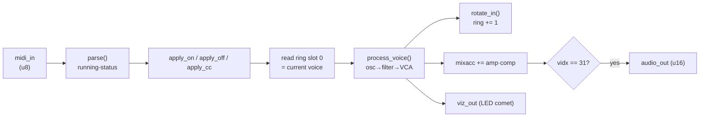

**Timing** — one voice per enabled cycle; a sample every 32 (columns = enabled engine cycles):

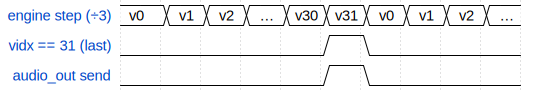

<details><summary>WaveDrom source</summary>

```wavedrom
{ "signal": [
  {"name": "engine step (÷3)", "wave": "==========", "data": ["v0","v1","v2","…","v30","v31","v0","v1","v2","…"]},
  {"name": "vidx == 31 (last)", "wave": "0....10..."},
  {"name": "audio_out send",    "wave": "0....10..."}
]}
```

</details>

**Gotcha.** MIDI is read with `recv_non_blocking` and the audio `send_if` fires only on the
last voice, so the shell paces the whole engine purely by *back-pressure* on `audio_out`
([C3](#c3-engine-handshake)) — there is no free-running counter inside the proc.

## A2 Voice ring & allocation

**What it does.** 32 voices live in a ring that is **rotated by one each cycle**, so the voice
being processed is always at index 0. That turns a dynamic `voices[vidx]` access (a 32:1
~3200-bit mux — the original ~21 ns timing wall) into a constant-index read/write. Note-on
claims free voices; note-off releases by matching note **and** part.

**How it's built.** The ring rotate ([`rtl/synth.x:291`](rtl/synth.x)):

```rust
fn rotate_in(v: Voice[32], tail: Voice) -> Voice[32] {
    let shifted = for (i, acc): (u32, Voice[32]) in u32:0..u32:31 {
        update(acc, i, v[i + u32:1])
    }(v);
    update(shifted, u32:31, tail)      // all indices loop-constant -> wires, not a mux
}
```

Note-off releases *every* matching voice (so unison stacks and duplicate notes all stop)
([`rtl/synth.x:143`](rtl/synth.x)):

```rust
fn apply_off(voices: Voice[32], note: u8, part: u2) -> Voice[32] {
    for (i, vs): (u32, Voice[32]) in u32:0..u32:32 {
        let v = vs[i];
        if v.note == note && v.part == part && v.env_st != Env::OFF && v.env_st != Env::RELEASE {
            update(vs, i, Voice { env_st: Env::RELEASE, fenv_st: Env::RELEASE, ..v })
        } else { vs }
    }(voices)
}
```

The `Voice` struct — deliberately narrow, because total ring width is the F4PGA packing budget
([`rtl/synth.x:40`](rtl/synth.x)):

```rust
pub struct Voice { phase: u32, env: u16, env_st: Env, note: u8, vel: u8,
                   flo: s19, fbnd: s19, fenv: u16, fenv_st: Env, subhi: u1, ph2: u32, cinc: u26,
                   uni: s4, part: u2 }   // uni: unison slot; part: which timbre (MIDI channel 0-3)
```

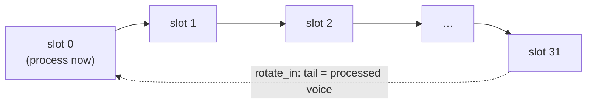

**Gotcha.** `inc` (the phase increment) is **not** stored per voice — it's recomputed from
`note` each cycle ([B1](#b1-oscillator--dds)) — precisely to keep the ring narrow. Same reason
`flo/fbnd` are `s19` and `cinc` is `inc>>6`.

## A3 Multitimbral parts

**What it does.** Four independent timbres (MIDI channels 1–4). The low 2 bits of the channel
nibble select one of 4 `Part` patches; every voice carries a 2-bit `part` tag, and the current
voice reads *its* part's patch through a 4:1 mux before processing.

**How it's built.** The `Part` patch — everything sound-shaping, including a per-part LFO
oscillator ([`rtl/synth.x:46`](rtl/synth.x)):

```rust
pub struct Part { wave: u3, cutoff: u16, reso: u16, fdepth: u16,   // wave(70) cutoff(74) reso(71) fdepth(79)
                  fmode: u2, subsel: u2, pw: u16, detsel: u2,      // fmode(72) sub(73) pw(75) detune(78)
                  vibsel: u2, bend: s16, portsel: u2, trdep: u8,   // vib(CC1) bend(0xE0) porta(5) trem depth(92)
                  unison: u2, lfo_depth: u16, vol: u8,              // unison(80) LFO depth(77) volume(CC7)
                  lfo_ph: u32, lfo_rate: u32,                       // per-part LFO oscillator (CC76 rate)
                  xmode: u2, xdepth: u16, xratio: u3,               // cross-osc: CC85/86/87
                  a_att: u16, a_dec: u16, a_sus: u16, a_rel: u16,   // amp ADSR (CC20-23)
                  f_att: u16, f_dec: u16, f_sus: u16, f_rel: u16 }  // filter-env ADSR (CC24-27)
```

Channel → part routing ([`rtl/synth.x:314`](rtl/synth.x)):

```rust
let ch = ps[0:2];                  // MIDI channel (low 2 bits) -> part 0-3
let ep = st.parts[ch];             // the event's part patch (4:1 read)
...
let p = parts1[cur.part];          // the PROCESSED voice reads its own part's patch
```

**Gotcha.** The 32-voice pool is **shared/dynamic** across the 4 parts (not 8 voices each). Only
the noise LFSR and the shell effects are global; everything else — including each part's LFO
*oscillator* — is per-part. The 4× patch state + the per-voice 4:1 mux are what put the
soft-multiplier backends ~0.2 ns over the ÷4 budget (see the README "4 parts is at the edge"
note); on the DSP48/Vivado ÷3 build it has ~10 ns of margin.

---

# Part B — Per-voice datapath

Everything below runs inside `process_voice()` ([`rtl/synth.x:184`](rtl/synth.x)), once per
enabled cycle for the slot-0 voice. The chain is: oscillators → sub → cross-mod → filter → VCA.

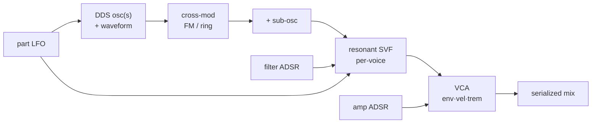

## B1 Oscillator / DDS

**What it does.** A [direct-digital-synthesis](https://en.wikipedia.org/wiki/Direct_digital_synthesis)
oscillator: a 32-bit phase accumulator advances by a per-note increment each sample; the top 8
phase bits index a wavetable. Pitch is set by the increment, which comes from an **octave-folded**
12-entry table rather than a 128-entry LUT.

**How it's built** ([`rtl/synth.x:12`](rtl/synth.x)):

```rust
const BASE_INC: u32[12] = u32[12]:[1097338, 1162588, 1231719, 1304961, 1382558, 1464769,
                                    1551869, 1644148, 1741914, 1845494, 1955232, 2071497];
fn note_inc(note: u8) -> u32 {
    let n = note & u8:0x7f;
    BASE_INC[(n % u8:12) as u32] << ((n / u8:12) as u32)   // one octave + barrel shift
}
```

Phase advance, in `process_voice` ([`rtl/synth.x:208`](rtl/synth.x)):

```rust
let phase_n = v.phase + inc;         // inc = note increment (+ pitch mod + unison detune)
```

**Timing** — the accumulator ramps; a `u32` overflow marks one oscillator period (used by the
sub-osc):

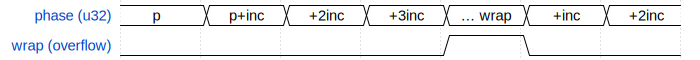

<details><summary>WaveDrom source</summary>

```wavedrom
{ "signal": [
  {"name": "phase (u32)", "wave": "=======", "data": ["p","p+inc","+2inc","+3inc","… wrap","+inc","+2inc"]},
  {"name": "wrap (overflow)", "wave": "0...10.."}
]}
```

</details>

**Gotcha.** `inc(n+12) == 2·inc(n)`, so keeping only the lowest octave and barrel-shifting by
`note/12` replaces a 128:1 32-bit LUT mux (~15 ns, un-pipelineable — an array index is one atomic
op in XLS/VPR) with a 12:1 mux + shift. Rounding error vs the exact table is <30 ULP — inaudible.

## B2 Waveforms

**What it does.** Five waveforms selected per part by CC70: sine (from the LUT), saw, pulse
(PWM, [B3](#b3-pwm)), triangle, and white noise (from an LFSR).

**How it's built** ([`rtl/synth.x:99`](rtl/synth.x)):

```rust
fn voice_wave(wave: u3, phase: u32, noise: s16, pw: u8) -> s16 {
    let t = phase[24:32];
    match wave {
        u3:0 => SINE[t],
        u3:1 => ((t as s16) * s16:16) - s16:2048,                  // saw
        u3:2 => if t < pw { s16:2047 } else { s16:0 - s16:2047 },  // pulse: pw = duty (PWM)
        u3:3 => { let f = if t < u8:128 { t } else { u8:255 - t }; ((f as s16) * s16:32) - s16:2048 },  // tri
        u3:4 => noise,                                             // white noise (LFSR)
        _    => SINE[t],
    }
}
```

The noise source is a 16-bit Galois LFSR advanced once per sample in the proc
([`rtl/synth.x:329`](rtl/synth.x)):

```rust
let lfsr1 = (st.lfsr >> u16:1) ^ (if (st.lfsr & u16:1) == u16:1 { u16:0xB400 } else { u16:0 });
let noise = (st.lfsr[0:12] as s16) - s16:2048;            // ~+-2048 white noise
```

**Gotcha.** `voice_wave` returns `s16` (|v| ≤ 2048) on purpose: the narrow return type gives the
optimizer a tight range bound, so the downstream amplitude multiply narrows to ~16×7 instead of a
full 32×32 soft-multiplier. The oscillators are *naive* (no band-limiting), so raw saw/pulse
alias — you play through the low-pass, which rolls the aliases off.

## B3 PWM

**What it does.** The pulse wave (wave 2) has a variable duty cycle: high while the phase's top
byte is below a threshold. The threshold is CC75 plus an LFO wobble, so pulse-width can be
modulated for the classic PWM shimmer.

**How it's built** — the duty threshold is computed per sample and passed into `voice_wave`
([`rtl/synth.x:346`](rtl/synth.x)):

```rust
let pwr = ((p.pw << u16:1) as s32) + (lfo_mod >> u32:4);
let pwthr = (if pwr < s32:12 { s32:12 } else if pwr > s32:244 { s32:244 } else { pwr }) as u8;
```

**Gotcha.** PWM reuses the existing `lfo_mod` for its wobble — no new multiply. At 50 % duty the
even harmonics vanish (odd-only, like a square); narrowing the pulse brings them back in.

## B4 Detuned dual oscillator

**What it does.** A second oscillator (`ph2`) runs slightly faster than the main one; summed with
the main, the two **beat** for analog thickness. Detune depth is CC78 (off / ~3 / ~7 / ~13 cents).

**How it's built** — a second accumulator with a constant-cents offset added to the increment
([`rtl/synth.x:216`](rtl/synth.x)):

```rust
let doff = match detsel { u2:0 => u32:0, u2:1 => inc >> u32:9,
                          u2:2 => inc >> u32:8, _ => inc >> u32:7 };
...
let ph2_n = v.ph2 + (if xmode == u2:0 { inc + doff } else { mstep });   // detune (xmode 0) OR cross-mod
...
let det2 = voice_wave(wave, ph2_n, noise, pw);
let o12 = if xmode == u2:0 { if detsel == u2:0 { main } else { (main + det2) >> u16:1 } } ...
```

**Gotcha.** The second oscillator **must have its own accumulator** — `phase + (phase>>k)` fails
because `phase` wraps every period, resetting the relationship. And `ph2` is the *only* spare
accumulator: detune (here) and cross-modulation ([B6](#b6-cross-oscillator-fm--ring-mod)) are
mutually-exclusive uses of it, so cross-mod adds no new per-voice ring state.

## B5 Sub-oscillator

**What it does.** A square wave one octave below the note, mixed in by a shift-based level (CC73).
Adds weight/bass.

**How it's built** — a 1-bit toggle flipped each time the main phase wraps
([`rtl/synth.x:211`](rtl/synth.x)):

```rust
let wrapped = phase_n < v.phase;                           // u32 overflow = one osc period
let subhi_n = if wrapped { v.subhi ^ u1:1 } else { v.subhi };   // toggle = half rate = octave down
...
let sub = if subhi_n == u1:1 { s16:1800 } else { s16:0 - s16:1800 };
let subm = match subsel { u2:0 => s16:0, u2:1 => sub >> u16:2, u2:2 => sub >> u16:1, _ => sub };
```

**Gotcha.** The first cut used a *second* 32-bit accumulator for the sub; the extra +1024 bits of
ring state overflowed VPR's SLICE packer. A 1-bit toggle on the main phase's wrap gives the same
octave-down square for one bit of state. On F4PGA, ring-state width and soft-multiplier *count*
are the packing budget — not just the critical path.

## B6 Cross-oscillator FM / ring-mod

**What it does.** Turns the second oscillator into a **modulator** so the engine can *create*
inharmonic (bell/metallic) timbres it otherwise can't. CC85 picks Off / Ring / FM / FM+, CC86 is
depth, CC87 is one of 8 modulator:carrier ratios.

**How it's built** — ratios by shift/add (no multiply), then the FM index is a real multiply
([`rtl/synth.x:218`](rtl/synth.x)):

```rust
let mstep = match xratio {                                 // mod:carrier  (all shift/add)
    u3:0 => inc,                                           // 1
    u3:1 => inc + (inc >> u32:1),                          // 1.5
    u3:2 => inc << u32:1,                                  // 2
    ...
    u3:6 => (inc << u32:3) - inc,                          // 7
    _    => inc >> u32:1 };                                // 0.5
let ph2_n = v.ph2 + (if xmode == u2:0 { inc + doff } else { mstep });
let modsig = SINE[ph2_n[24:32]];                           // s16 +-2047: FM/ring modulator
// STRONG FM (xmode>=2): index = modsig * depth (one soft-multiply) scaled into the phase.
let fmoff = if xmode >= u2:2 {
                let midx = (modsig as s32) * (xdepth as s32);
                (midx << (if xmode == u2:2 { u32:12 } else { u32:13 })) as u32
            } else { u32:0 };
let main = voice_wave(wave, phase_n + fmoff, noise, pw);   // FM = modulate the carrier phase
let ring = (((main as s32) * (modsig as s32)) >> u32:11) as s16;   // ring = amplitude product
```

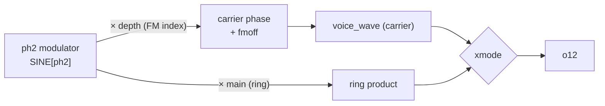

**Gotcha.** Cross-mod costs **two soft-multiplies** (FM index + ring product) — the things that
had to fit the ÷4 40 ns budget. An earlier *shift*-based FM index reached only β ≈ 0.1 rad (far
too weak for bells); the multiply-based index reaches β ≈ 1.5 (FM) / π (FM+) and cost only
+0.13 ns. Strong FM also exposed the SVF limit-cycle latch that the de-latch fix in
[B7](#b7-state-variable-filter) cures.

## B7 State-variable filter

**What it does.** A per-voice resonant [Chamberlin SVF](https://en.wikipedia.org/wiki/State_variable_filter):
one filter *per voice*, filtering that voice's oscillator before the mix. All four responses
(low/high/band/notch) fall out together; CC72 selects the mode, CC71 the resonance, CC74 +
key-tracking + the filter envelope + the LFO set the cutoff.

**How it's built** — the filter kernel, coefficients in Q13 ([`rtl/synth.x:70`](rtl/synth.x)):

```rust
fn svf(low: s32, band: s32, x: s32, f: s32, q: s32) -> (s32, s32, s32, s32, s32) {
    let low1  = clampx(low + ((f * band) >> u32:13), s32:131072);
    let high  = clampx(x - low1 - ((q * band) >> u32:13), s32:180000);
    let band1 = clampx(band + ((f * high) >> u32:13), s32:131072);
    // DE-LATCH: leak the integrator state a hair each sample so a fixed-point overflow limit
    // cycle can't sustain full-scale (the clamp alone latches). Poles pulled just inside the
    // unit circle -> any self-oscillation decays. >>6/>>7 is ~1.5%/0.8%/sample.
    let low2  = low1  - (low1  >> u32:7);
    let band2 = band1 - (band1 >> u32:6);
    (low2, band2, low2, high, band2)
}
```

Cutoff assembly + multimode select + 4× input attenuation ([`rtl/synth.x:264`](rtl/synth.x)):

```rust
let ktrack = (v.note as s32) * s32:16;                    // key-tracking: brighter high notes
let fmod = (((fenv_n >> u16:6) as s32) * (fdepth as s32)) >> u32:7;   // filter-envelope pluck
let fsum = (cutoff as s32) + ktrack + fmod + lfo_mod;
let f = if fsum < s32:60 { s32:60 } else if fsum > s32:4095 { s32:4095 } else { fsum };
// attenuate input 4x (amp>>2) so the resonant state stays off the clamp rails; restore 4x after
let (lo, bd, lp, hp, bp) = svf(v.flo as s32, v.fbnd as s32, amp >> u32:2, f & s32:8191, (reso as s32) & s32:8191);
let filt = match fmode { u2:0 => lp, u2:1 => hp, u2:2 => bp, _ => lp + hp };  // LP/HP/BP/notch
```

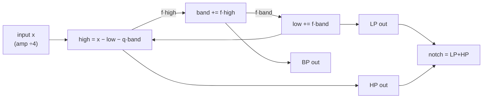

**Gotcha.** Two fixed-point traps, both fixed here: (1) at high resonance the state grows ~Q×input
and sticks on the clamp rails (silence) — hence the 4× input attenuation for headroom; (2) bright
polyphonic/FM patches drove a full-scale limit cycle (measured 96 % of playtime railed) — the
**leaky integrators** (`>>6`/`>>7`) pull the poles just inside the unit circle so any
self-oscillation decays. `f` is capped at 4095 (12-bit) and masked `& 0x1FFF` so `f*band` maps to
a single 25×18 DSP48.

## B8 ADSR envelopes

**What it does.** Two ADSR envelopes per voice — one for amplitude, one for the filter cutoff —
sharing one parametric state machine. Rates come from CC20–23 (amp) and CC24–27 (filter) via an
8-entry time LUT.

**How it's built** — the envelope step ([`rtl/synth.x:87`](rtl/synth.x)):

```rust
fn adsr(env: u16, st: Env, att: u16, dec: u16, sus: u16, rel: u16) -> (u16, Env) {
    match st {
        Env::ATTACK => if (env as u32) + (att as u32) >= u32:65535 { (u16:65535, Env::DECAY) } else { (env + att, Env::ATTACK) },
        Env::DECAY  => if (env as u32) <= (sus as u32) + (dec as u32) { (sus, Env::SUSTAIN) } else { (env - dec, Env::DECAY) },
        Env::SUSTAIN => (env, Env::SUSTAIN),
        Env::RELEASE => if env <= rel { (u16:0, Env::OFF) } else { (env - rel, Env::RELEASE) },
        _ => (u16:0, Env::OFF),
    }
}
```

Both envelopes are stepped for the current voice ([`rtl/synth.x:189`](rtl/synth.x)):

```rust
let (env_n, est_n)   = adsr(v.env,  v.env_st,  a_att, a_dec, a_sus, a_rel);
let (fenv_n, fest_n) = adsr(v.fenv, v.fenv_st, f_att, f_dec, f_sus, f_rel);  // per-voice filter env
```

The `Env` state machine ([`rtl/synth.x:33`](rtl/synth.x): `enum Env : u3`):

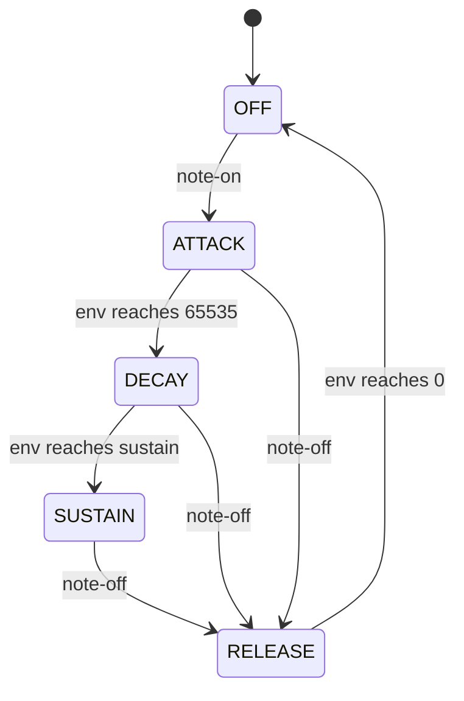

**Timing** — envelope level vs gate across the stages:

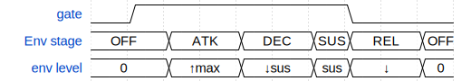

<details><summary>WaveDrom source</summary>

```wavedrom
{ "signal": [
  {"name": "gate",      "wave": "01.....0.."},
  {"name": "Env stage", "wave": "=.=.=.==.=", "data": ["OFF","ATK","DEC","SUS","REL","OFF"]},
  {"name": "env level", "wave": "=.=.=.==.=", "data": ["0","↑max","↓sus","sus","↓","0"]}
]}
```

</details>

**Gotcha.** Compares are done in `u32` so a high sustain (~65024) plus a large decay step can't
wrap `u16`. Rates map through `TIME_INC` (an 8-entry LUT, index `cc>>4`), spanning ~3 ms to ~2 s
at 32 kHz — an 8:1 mux and no multiply, cheap for packing.

## B9 VCA

**What it does.** The [VCA](https://en.wikipedia.org/wiki/Variable-gain_amplifier) scales the
oscillator by envelope × velocity × tremolo, collapsed into one small gain so the sample multiply
stays narrow.

**How it's built** ([`rtl/synth.x:257`](rtl/synth.x)):

```rust
let e7  = (env_n >> u16:9) as u8;                          // envelope -> 0..127
let g7  = (((e7 as u16) * (v.vel as u16)) >> u16:7) as u8; // × velocity -> 0..127
let g7t = (((g7 as u16) * (tg as u16)) >> u16:6) as u8;    // × tremolo (tg/64)
let amp = (w as s32) * (g7t as s32);                       // one ~16×8 multiply
```

**Gotcha.** Folding env (7-bit) × velocity (7-bit) into a single 7-bit gain via a tiny 8×8, then
one ~16×8 sample multiply, keeps both products small — no full 32×32 soft-multiplier.

## B10 LFO

**What it does.** Each part has its own LFO oscillator (a phase accumulator into the sine LUT).
Its output fans out to filter-cutoff modulation (auto-wah), vibrato, tremolo, and PWM.

**How it's built** — read + fan-out ([`rtl/synth.x:334`](rtl/synth.x)):

```rust
let lfo_raw = SINE[p.lfo_ph[24:32]];                      // this part's LFO phase
let lfo_mod = ((lfo_raw as s32) * (p.lfo_depth as s32)) >> u32:8;   // cutoff LFO depth (CC77)
let vib = match p.vibsel { u2:0 => s32:0, u2:1 => (lfo_raw as s32) >> u32:6,
                           u2:2 => (lfo_raw as s32) >> u32:5, _ => (lfo_raw as s32) >> u32:4 };
...
let tg = (s32:64 - (((s32:64 - lfoU) * (p.trdep as s32)) >> u32:7)) as u8;   // tremolo gain
```

Each part's LFO phase advances once per sample (on the ring's last slot)
([`rtl/synth.x:363`](rtl/synth.x)):

```rust
let parts2 = if last {
    Part[4]:[Part { lfo_ph: parts1[u32:0].lfo_ph + parts1[u32:0].lfo_rate, ..parts1[u32:0] },
             ... ]  // one per part
} else { parts1 };
```

**Gotcha.** The LFO is a genuine per-part oscillator (phase + CC76 rate), so the 4 timbres wobble
at independent speeds — advanced once per sample, not once per voice.

## B11 Pitch expression

**What it does.** Three modulators of the oscillator increment: **vibrato** (CC1, from the LFO),
**pitch bend** (0xE0, ±2 semitones), and **portamento** (CC5, glide between notes).

**How it's built** — portamento glides `cinc` toward the target, then pitch mod is applied
multiplicatively ([`rtl/synth.x:193`](rtl/synth.x)):

```rust
let tgt = note_inc(v.note) >> u32:6;                      // target increment / 64
let cinc_n = if portsel == u2:0 { tgt as u26 } else {
    let pk = match portsel { u2:1 => u32:9, u2:2 => u32:11, _ => u32:13 };
    ((v.cinc as s32) + (((tgt as s32) - (v.cinc as s32)) >> pk)) as u26   // glide (no multiply)
};
let inc0 = (cinc_n as u32) << u32:6;
// pitch mod: inc*(1 + pmod/4096) done as inc + (inc>>12)*pmod  -> a ~19×10 multiply
let inc = (inc0 as s32 + (((inc0 >> u32:12) as s32) * (pmod as s16 as s32))) as u32;
```

Bend decode and the vibrato+bend sum ([`rtl/synth.x:324`](rtl/synth.x)):

```rust
let bend_v = (((((evv as s32) << u32:7) | (evn as s32)) - s32:8192) >> u32:4) as s16;  // 14-bit, center 8192
...
let pmod = clampx(vib + (p.bend as s32), s32:2047);   // vibrato + pitch bend (both per-part)
```

**Gotcha.** All three share the `inc + (inc>>12)*pmod` trick so the multiply is ~19×10 (no 32×32 /
no u64 overflow); `pmod` is clamped ±2047 so the cast to `s16` is lossless and the product fits one
DSP48. Portamento is pure shift/add — no multiply.

## B12 Unison

**What it does.** Voice-stacking unison (CC80: off/2/3/4): a note-on grabs N physical voices, each
detuned by a fixed symmetric slot and started at a decorrelated phase, for a thick super-saw. Max
polyphony becomes 32/N.

**How it's built** — allocation assigns the slot + decorrelated seed
([`rtl/synth.x:136`](rtl/synth.x)):

```rust
let slot = ((cnt as s8) * s8:2 - ((un as s8) - s8:1)) as s4;   // {-1,+1} / {-2,0,+2} / {-3,-1,+1,+3}
let seed = ((lfsr as u32) << u32:16) ^ ((cnt as u32) << u32:29);   // decorrelated start phase
```

The slot detunes the increment; gain compensation ≈ 256/√N holds loudness
([`rtl/synth.x:207`](rtl/synth.x), [`:354`](rtl/synth.x)):

```rust
let inc = (inc as s32 + ((inc >> u32:9) as s32) * (v.uni as s32)) as u32;   // ~3.4 cents/unit
...
let comp = match p.unison { u2:0 => s32:256, u2:1 => s32:181, u2:2 => s32:148, _ => s32:128 };
```

**Gotcha.** Detune slots are *fixed and symmetric*, not random — fixed offsets are exactly what
create the beating; randomness would only make the character inconsistent. Phase decorrelation
(the LFSR seed) avoids a coherent N× amplitude spike at the attack (headroom) and gives instant
thickness. Since `apply_off` releases every matching voice, note-off is free.

## B13 Mixing

**What it does.** The 32 per-voice outputs are summed one-per-cycle into an accumulator, then
scaled and **saturated** (never wrapped) into the 16-bit output sample.

**How it's built** — serialized accumulate ([`rtl/synth.x:358`](rtl/synth.x)) and the final scale
([`rtl/synth.x:283`](rtl/synth.x)):

```rust
let compv = (comp * (p.vol as s32)) >> u32:7;             // unison comp × per-part volume (CC7)
let mix1 = st.mixacc + (((amp as s24 as s32) * compv) >> u32:8);
```

```rust
fn scale_mix(acc: s32) -> u16 {
    let s = acc >> u32:5;
    let c = if s > s32:32767 { s32:32767 } else if s < s32:0 - s32:32767 { s32:0 - s32:32767 } else { s };
    (c + s32:32768) as u16    // offset-binary output
}
```

**Gotcha.** Accumulating **one voice per clock** (not a 32-wide adder tree) keeps the critical
path short and makes voice count a one-constant change. Saturation is essential: a wrap is a huge
discontinuity → a broadband click. Output is offset-binary (`+32768`); the shell subtracts it back
to signed ([C1/C4](#part-c--the-verilog-shell)).

---

# Part C — The Verilog shell

## C1 Clocking

**What it does.** One 100 MHz clock, no MMCM/PLL. The engine and the effects FSM each advance on a
**clock-enable** rather than a divided clock (F4PGA won't let logic drive a BUFG). A mod-6 counter
produces `ce` (÷3, engine) and `ce8` (÷6, effects); a separate counter makes the 32 kHz sample
tick.

**How it's built** ([`rtl/top.v:57`](rtl/top.v)):

```verilog
reg [2:0] cec = 3'd0;
always @(posedge clk100) cec <= rst ? 3'd0 : (cec == 3'd5 ? 3'd0 : cec + 3'd1);   // mod-6
wire ce  = (cec == 3'd0) || (cec == 3'd3);   // 1 of every 3 cycles (engine + sample, 30ns)
wire ce8 = (cec == 3'd0);                     // 1 of every 6 cycles (effects FSM, 60ns/step)
```

Sample tick ([`rtl/top.v:155`](rtl/top.v)):

```verilog
localparam integer SAMPDIV = 3125;   // 100 MHz / 32 kHz
reg [15:0] sdiv = 0; wire stick = (sdiv == SAMPDIV - 1);
always @(posedge clk100) sdiv <= rst ? 16'd0 : (stick ? 16'd0 : sdiv + 1);
```

**Timing** — two full mod-6 periods:

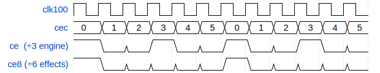

<details><summary>WaveDrom source</summary>

```wavedrom
{ "signal": [
  {"name": "clk100",           "wave": "pppppppppppp"},
  {"name": "cec",              "wave": "============", "data": ["0","1","2","3","4","5","0","1","2","3","4","5"]},
  {"name": "ce  (÷3 engine)",  "wave": "100100100100"},
  {"name": "ce8 (÷6 effects)", "wave": "100000100000"}
]}
```

</details>

**Gotcha.** `ce8` is a strict subset of `ce` (same phase), so the ÷3 sample-consume handshake and
the ÷6 effects FSM never collide on the shared `dst` state. The DSP48/Vivado build runs ÷3 (30 ns,
~10 ns margin); the soft-multiplier F4PGA/nextpnr builds must drop to ÷4 (40 ns) / ÷8, which caps
real-time throughput at 28 kHz. **The top-of-file comment describing ÷4/÷8 is stale history — the
live code is ÷3/÷6.**

## C2 UART

**What it does.** Two receivers feed one MIDI stream — the FT2232 at 2 Mbaud (web bridge/host) and
DIN MIDI at 31250 baud — and one transmitter streams the 16-bit stereo audio out at 2 Mbaud.

**How it's built** — baud dividers ([`rtl/top.v:34`](rtl/top.v)) and the FT2232 RX framing
([`rtl/top.v:89`](rtl/top.v)):

```verilog
localparam integer BAUD  = 50;     // 100 MHz / 2 Mbaud
localparam integer MBAUD = 3200;   // 100 MHz / 31250 baud = DIN MIDI
```

```verilog
if (!rxa) begin
    if (rx == 1'b0) begin rxa <= 1; rxd <= BAUD + BAUD/2 - 1; rxb <= 0; end   // start bit -> sample mid-bit
end else if (rxd == 0) begin
    if (rxb == 4'd8) begin rxa <= 0; rxbyte <= rxsh; rxhave <= 1; ... end     // 8 data bits shifted in
    else begin rxsh <= {rx, rxsh[7:1]}; rxd <= BAUD - 1; rxb <= rxb + 1; end  // LSB-first
end else rxd <= rxd - 1;
```

**Timing** — one 8-N-1 UART byte (idle-high, start bit low, 8 data LSB-first, stop bit high):

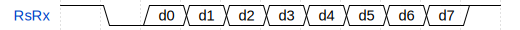

<details><summary>WaveDrom source</summary>

```wavedrom
{ "signal": [
  {"name": "RsRx", "wave": "10========1", "data": ["d0","d1","d2","d3","d4","d5","d6","d7"]}
]}
```

</details>

**Gotcha.** Each receiver arms on the falling start bit and samples at `BAUD + BAUD/2 - 1` (mid-bit
of bit 0), then every `BAUD-1` after — the classic "sample in the middle" rule. 2 Mbaud is chosen
so 4 audio bytes/sample fit inside the 3125-clock budget for real-time 32 kHz.

## C3 Engine handshake

**What it does.** The shell bridges the engine's ready/valid channels to the UART, and — crucially
— completes each transfer **only on a `ce` cycle**, so bytes/samples aren't lost across the
multicycle.

**How it's built** — instantiation ([`rtl/top.v:66`](rtl/top.v)) and the two handshakes
([`rtl/top.v:121`](rtl/top.v), [`:312`](rtl/top.v)):

```verilog
xls_engine eng (.clk(clk100), .rst(rst), .ce(ce),
    ._midi_in(mdata), ._midi_in_vld(mvld), ._midi_in_rdy(mrdy),
    ._audio_out(audio), ._audio_out_vld(avld), ._audio_out_rdy(ardy),
    ._viz_out(vdata), ._viz_out_vld(vvld), ._viz_out_rdy(1'b1));   // viz always ready
```

```verilog
end else if (mvld && mrdy && ce) mvld <= 0;   // MIDI byte transfers only when the engine advances
...
if (want && avld && !ardy) ardy <= 1;         // sample tick raised `want`
if (ardy && avld && ce) begin
    raws <= $signed(audio) - 16'sd32768;       // consume the sample (undo offset-binary) on a ce cycle
    ... dst <= 6'd1; ardy <= 0; want <= 0;      // and kick off the effects FSM
end
```

**Gotcha.** `_viz_out_rdy` is tied high so the LED tap never stalls the pipeline. The audio pull is
what paces the whole engine: `want` is set on the 32 kHz `stick`, so the engine free-runs against
back-pressure and delivers exactly one sample per tick.

## C4 Stereo framing

**What it does.** The engine is mono; the shell emits **stereo** as 4 bytes per sample
(`Llo Lhi Rlo Rhi`), with a 1-bit channel marker in each low byte's LSB so the host can lock byte
alignment *and* L/R order unambiguously.

**How it's built** ([`rtl/top.v:405`](rtl/top.v)):

```verilog
// 1-bit channel marker in the low byte's LSB (L=0, R=1)
frame <= {1'b1, (pend==3'd4 ? {sampL[7:1],1'b0} : pend==3'd3 ? sampL[15:8]
               : pend==3'd2 ? {sampR[7:1],1'b1} : sampR[15:8]), 1'b0};
```

**Timing** — the 4-byte interleaved frame:

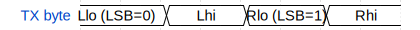

<details><summary>WaveDrom source</summary>

```wavedrom
{ "signal": [
  {"name": "TX byte", "wave": "=.=.=.=.", "data": ["Llo (LSB=0)","Lhi","Rlo (LSB=1)","Rhi"]}
]}
```

</details>

**Gotcha.** A single dropped UART byte would otherwise flip the 16-bit phase for the rest of the
stream (silence → DC, tone → buzzy saw). The LSB marker + the host's periodic re-lock heal a
mid-stream drop within ~0.1 s. The mono dry sits centered (identical L/R); only the wet is
decorrelated ([Part D](#part-d--block-ram-effects)).

---

# Part D — Block-RAM effects

All effects live in the shell, downstream of the engine, and run on the `ce8` (÷6) enable. One
arithmetic datapath is time-shared **L then R** by the FSM, so there's no second multiplier.

## D1 Effects FSM

**What it does.** A 28-state machine (`dst` 1→28) that does **one BRAM read+write per step**:
first echo+chorus, then the reverb send (8 comb + 4 all-pass for L, then the same for R).

**How it's built** — the state progression (representative steps,
[`rtl/top.v:321`](rtl/top.v)):

```verilog
if (ce8) begin
if (dst == 6'd1) dst <= 6'd2;                 // wait echo read
else if (dst == 6'd2) begin ... raddrL <= waddrL - ctiL; ... dst <= 6'd3; end   // chorus tap
else if (dst == 6'd4) begin ... ecwL <= ecwL_c; ecwR <= ecwR_c;                 // echo/chorus wet
    if (revwet != 7'd0) begin rin_r <= (ecwL_c + ecwR_c) >>> 6; ... dst <= 6'd5; end   // -> reverb
    else begin pend <= 3'd4; dst <= 6'd0; end end
else if (dst==6'd5)  begin ... accL<=cbn;      raddr2<=RB1+{3'd0,cp1L}; dst<=6'd6;  end   // L comb 0
... (dst 5-12 = L combs, 13-16 = L all-pass, 17-24 = R combs, 25-28 = R all-pass) ...
else if (dst==6'd28) begin ... sampL <= sat18(ecwL + rwetL) + 16'sd32768; ... pend<=3'd4; dst<=6'd0; end
```

**Timing** — the per-sample phase map:

| `dst` | phase | BRAM |
|------:|-------|------|
| 1–4 | echo + chorus (stereo ping-pong) → `ecwL/R` | `dmemL/R` |
| 5–12 | L: 8 comb filters | `dmem2L` |
| 13–16 | L: 4 all-pass | `dmem2L` |
| 17–24 | R: 8 comb filters | `dmem2R` |
| 25–28 | R: 4 all-pass, final wet mix, advance pointers | `dmem2R` |

**Gotcha.** 28 steps × 6 clocks (`ce8`) = **168 of the 3125** clocks per sample — thousands to
spare, which is why serializing L-then-R is free. (The top-of-file "~17 states" comment predates
the full 8-comb/4-all-pass stereo Freeverb; the live machine is 28 steps.)

## D2 BRAM layout

**What it does.** Four 16K×16 buffers: `dmemL`/`dmemR` for echo+chorus and `dmem2L`/`dmem2R` for
the reverb tank. Synchronous read+write is the pattern yosys/Vivado actually map to RAMB36E1.

**How it's built** ([`rtl/top.v:185`](rtl/top.v)):

```verilog
reg [15:0] dmemL [0:16383];  reg [15:0] dmemR [0:16383];    // echo + chorus
reg [15:0] dmem2L[0:16383];  reg [15:0] dmem2R[0:16383];    // reverb tank
always @(posedge clk100) begin
    drdL <= dmemL[raddrL]; if (dweL) dmemL[waddrL] <= dwdL;   // sync read + write
    ...
end
```

The reverb tank is carved into 8 comb regions + 4 all-pass ([`rtl/top.v:171`](rtl/top.v)):

```verilog
localparam [13:0] RB0=14'd0, RB1=14'd1300, ... RB7=14'd9100,
                  RA0=14'd10400, RA1=14'd11000, RA2=14'd11600, RA3=14'd12200;
```

**Gotcha.** Power-up BRAM is garbage that would seed a runaway feedback loop, so a `clearing`
sweep zeroes all four buffers (all 16384 addresses) before normal operation
([`rtl/top.v:302`](rtl/top.v)). XLS's *async*-read ROMs never map to BRAM — only a hand-written
sync-read RAM like this does.

## D3 Chorus

**What it does.** A short delay tap swept by a triangle LFO, L/R in anti-phase, linearly
interpolated to a fractional sample so the sweep doesn't click.

**How it's built** ([`rtl/top.v:203`](rtl/top.v)):

```verilog
reg  [14:0] clfo = 15'd0;
wire [10:0] ctriL = clfo[14] ? (11'd2047 - clfo[13:3]) : clfo[13:3];   // triangle, Q3
wire [10:0] ctriR = 11'd2047 - ctriL;            // anti-phase
wire [13:0] ctapQL = 14'd2400 + {3'd0, ctriL};   // Q3 tap: 300.0 .. 555.9 samples
wire [13:0] ctiL = ctapQL[13:3];  wire [2:0] cfrL = ctapQL[2:0];       // integer tap / fraction
```

**Gotcha.** The tap is kept in Q3 (1/8-sample) so the read can be linearly interpolated between
adjacent samples — an integer-only tap jumps a whole sample as it sweeps, and each jump is a
click (zipper noise). Depth is CC94.

## D4 Echo / delay

**What it does.** A long delay tap with feedback that **ping-pongs L↔R**. Time is CC82, depth CC95.

**How it's built** — the delay length ([`rtl/top.v:168`](rtl/top.v)) and the cross-fed write
([`rtl/top.v:336`](rtl/top.v)):

```verilog
wire [13:0] edly = {dtime, 7'd0} | 14'd128;     // dtime<<7, ~4..508 ms @ 32 kHz
...
dwdL <= sat18(raws + (echo_on ? (echodR >>> 1) : 16'sd0)); dweL <= 1'b1;   // L writes R's echo
dwdR <= sat18(raws + (echo_on ? (echodL >>> 1) : 16'sd0)); dweR <= 1'b1;   // R writes L's echo
```

**Gotcha.** Writing the *other* channel's delayed sample into each buffer is what makes the echo
ping-pong across the stereo field. `edly` is floored at 128 samples so the read tap never coincides
with the write pointer. Each effect is **depth-gated** (`echo_on = echodep != 0`) — there's no mode
byte.

## D5 Reverb

**What it does.** A full [Freeverb](https://ccrma.stanford.edu/~jos/pasp/Freeverb.html): 8 parallel
feedback comb filters + 4 series all-pass diffusers **per channel**, with the Freeverb stereo
spread (R delays = L + 23). Room size (CC91) sets the comb feedback gain → decay time.

**How it's built** — the comb feedback (a real Q15 multiply → DSP48) with damping
([`rtl/top.v:251`](rtl/top.v)):

```verilog
// Damping = 0.5*old + 0.5*new (overflow-safe). fbm = g*y (Q15, DSP mult). cbn = in + fbm.
wire signed [15:0] nlp = curdlp + ((drd2 - curdlp + 16'sd1) >>> 1);
wire signed [15:0] fbm = ($signed({1'b0,rvg}) * nlp + 32'sd16384) >>> 15;   // g*y, rounded
wire signed [15:0] cbn = sat18(rin_r + fbm);
```

Room-size gain ([`rtl/top.v:221`](rtl/top.v)):

```verilog
wire [14:0] rvg = (rsize==2'd0) ? 15'd22000 :   // 0.671  room      (~0.4 s)
                  (rsize==2'd1) ? 15'd26000 :   // 0.793  hall      (~0.8 s)
                  (rsize==2'd2) ? 15'd29000 :   // 0.885  large     (~1.5 s)
                                  15'd31200;    // 0.952  cathedral (~3.5 s)
```

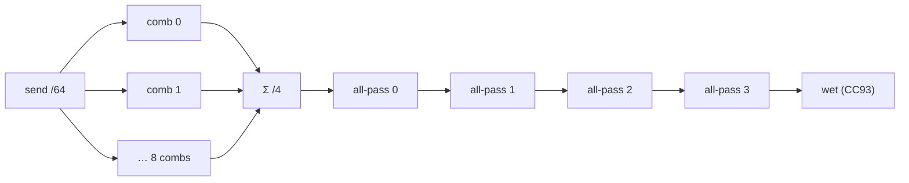

**Gotcha.** The tail took several fixed-point lessons (all in [DEVELOPMENT.md → M14](DEVELOPMENT.md#milestone-14--reverb-done-hardware-verified)):
damping must be `(old+new)/2` (a small-step shift both crushes the band and can wrap the state →
runaway); input is a *fixed* small `/64` (not `1/(1−g)`, which makes big rooms inaudible). The
feedback multiply maps to a **DSP48** on Vivado (works, hardware-verified); on the soft-multiplier
F4PGA fabric it railed, so reverb is DSP-backend-only. The MSB truncation trap (taking `(a*b)>>>15`
in a 16-bit context) is why the products use explicit 32-bit intermediates
([`rtl/top.v:271`](rtl/top.v)).

---

# Part E — Hardware I/O & build glue

## E1 I2S DAC out

**What it does.** A free-running Philips-I2S master clocks the stereo samples to a UDA1334A DAC on
Pmod JB → analog line-out. Built and timing-closed; hardware-pending.

**How it's built** ([`rtl/top.v:433`](rtl/top.v)):

```verilog
reg [10:0] i2s_c = 11'd0;
always @(posedge clk100) i2s_c <= i2s_c + 11'd1;   // [4:0]=within-bit, [10:5]=bit index 0..63
wire [5:0] bidx = i2s_c[10:5];
always @(posedge clk100) if (i2s_c[4:0] == 5'd0) begin   // BCLK falling edge -> present next bit
    ws_r <= (bidx >= 6'd32);                             // WS: 0..31 = left, 32..63 = right
    if (bidx == 6'd0) begin shl <= {~sampL[15], sampL[14:0]}; ... end   // latch, MSB->two's-comp
    else if (bidx <= 6'd16) begin sd_r <= shl[15]; shl <= {shl[14:0], 1'b0}; end   // shift MSB-first
    ...
end
```

**Timing** — BCLK = 100 MHz/32 = 3.125 MHz; 64 BCLK/frame → Fs ≈ 48.8 kHz; WS low = left:

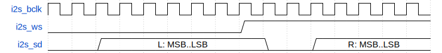

<details><summary>WaveDrom source</summary>

```wavedrom
{ "signal": [
  {"name": "i2s_bclk", "wave": "pppppppppppppppp"},
  {"name": "i2s_ws",   "wave": "0.......1......."},
  {"name": "i2s_sd",   "wave": "0.=======0.=====", "data": ["L: MSB..LSB","R: MSB..LSB"]}
]}
```

</details>

**Gotcha.** The UDA1334A needs no MCLK (internal PLL locks to BCLK/WS), which is *why* it was
chosen — F4PGA has no MMCM to synthesize an MCLK. `sampL/R` are offset-binary, so the MSB is
inverted to two's-complement at load; a 1-bit I2S delay means bit 0 of each slot carries no data.

## E2 DIN MIDI in

**What it does.** A hardware MIDI keyboard plugged into an opto-isolated DIN breakout on Pmod JA1,
decoded at 31250 baud and merged into the same MIDI stream the web bridge drives.

**How it's built** — 2-FF synchronizer ([`rtl/top.v:29`](rtl/top.v)) + RX FSM
([`rtl/top.v:111`](rtl/top.v)), merged after the web bridge ([`rtl/top.v:118`](rtl/top.v)):

```verilog
reg [1:0] mrxs = 2'b11;
always @(posedge clk100) mrxs <= {mrxs[0], midi_din};   // async input -> synchronize
wire mrx = mrxs[1];
...
if (!mvld) begin
    if (rxhave)       begin mdata <= rxbyte;  mvld <= 1; rxhave  <= 0; end   // web bridge first
    else if (dinhave) begin mdata <= dinbyte; mvld <= 1; dinhave <= 0; end   // then DIN keyboard
end
```

**Gotcha.** The DIN RX is identical in shape to the FT2232 RX, just at `MBAUD` (31250). The two
sources arbitrate into one `midi_in`, so a hardware keyboard and the browser coexist — both route
to the 4 parts by channel with no change to the parser.

## E3 LED comet

**What it does.** The 16 board LEDs show a live per-voice envelope "comet": each new note advances
a cursor to the next LED, and each LED's brightness tracks the real ADSR envelope of the voice that
lit it.

**How it's built** — driven by the engine's `viz_out` tuple `{env, is_new, last}`
([`rtl/top.v:140`](rtl/top.v)):

```verilog
always @(posedge clk100) if (vvld && ce) begin
    if (vdata[16]) begin                             // is_new: freshly allocated voice
        cursor                   <= cursor + 4'd1;   // advance the head
        bindled[sidx]            <= cursor + 4'd1;   // bind this scan-slot to the new head LED
        ledbright[cursor + 4'd1] <= vdata[15:8];     // light it at the current envelope
    end else begin
        ledbright[bindled[sidx]] <= vdata[15:8];     // track the bound LED's brightness
    end
    sidx <= vdata[17] ? 5'd0 : sidx + 5'd1;          // resync scan index on the last voice
end
```

**Gotcha.** `is_new` is a one-shot with *no new state*: a freshly allocated voice is uniquely
`env==0 && env_st==ATTACK` on its first slot-0 visit ([`rtl/synth.x:370`](rtl/synth.x)), so the
LED display costs nothing in the voice ring. The `last` bit self-aligns the scan index each
32-voice pass. Brightness is an 8-bit PWM compare against a free-running counter.

## E4 LUTs & `fix_verilog.py`

**What it does.** The shipped lookup tables are hand-embedded in `synth.x`; a small Python pass
patches the XLS-generated Verilog for the open toolchain.

**The real LUTs** live in [`rtl/synth.x:1`](rtl/synth.x): `SINE: s16[256]` (±2047, signed) used
by both the oscillators and the LFO, and the octave-folded `BASE_INC: u32[12]` phase-increment
table ([B1](#b1-oscillator--dds)), computed for **32 kHz**.

> **Note:** [`rtl/gen_lut.py`](rtl/gen_lut.py) is a **milestone-1 artifact** — it prints a
> 256-entry *u8* sine centered at 128 and a single A4 increment at a 4 kHz sample rate. It does
> **not** feed the current build; the shipped `s16` sine and 32 kHz `BASE_INC` are maintained
> directly in `synth.x`.

**`fix_verilog.py`** does two transforms on `engine.v` ([`rtl/fix_verilog.py:31`](rtl/fix_verilog.py)):

```python
src, count = pat.subn(unroll, src)   # 1. unroll `for (genvar...) assign a[i]=...` into explicit assigns
# --- global clock-enable ---
src, np = re.subn(r'(input wire rst,\n)', r'\1  input wire ce,\n', src, count=1)   # add `ce` port
src, ng = re.subn(r'\bend else begin\b', 'end else if (ce) begin', src, count=1)   # gate the pipeline
```

**Build flags & backends.** XLS codegen is identical across backends
([`scripts/vmbuild.sh`](scripts/vmbuild.sh)):
`--generator=pipeline --pipeline_stages=48 --worst_case_throughput=48 --delay_model=unit
--use_system_verilog=false --reset=rst --reset_active_low=false --reset_asynchronous=false`.
Only synthesis/P&R differs:

| Backend | DSP48 | BRAM | Clock / rate | Notes |
|---------|:-----:|:----:|--------------|-------|
| **Vivado** (committed) | ✅ 26 | ✅ 32×RAMB36 | ÷3 / **32 kHz** | the shipped bitstream; ~19.5 ns path |
| **openXC7** (nextpnr) | ❌ (unroutable pin) | ✅ | ÷4 / 28 kHz | fully open, real Fmax |
| **F4PGA** (VPR) | ❌ | ❌ | ÷4 / 28 kHz | fully open; soft multipliers, slice-bound |

**Gotcha.** XLS emits the whole pipeline as one `always @(posedge clk)` with a single
`if (rst) … else …`; gating that one `else` with `ce` makes *every* stage register multicycle at
once. VPR still reports the sub-`ce` paths as failing (it can't see the multicycle), so timing here
is **reasoned, not read from the report**. Full toolchain frictions:
[DEVELOPMENT.md → friction logs](DEVELOPMENT.md#friction-logs--learnings).

---

*Generated from `rtl/synth.x` and `rtl/top.v`. Line citations point at the current sources — if
they drift, grep for the quoted line. For the story behind each block, see the matching milestone
in [DEVELOPMENT.md](DEVELOPMENT.md).*
