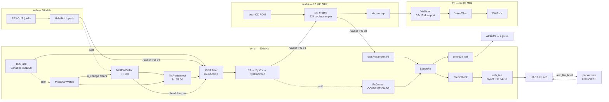
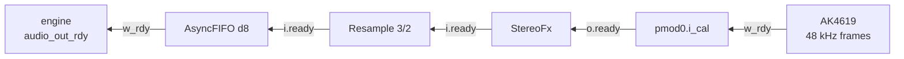
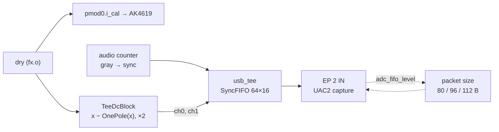

# XLS32 on Tiliqua — architecture deep-dive (the ECP5 shell)

How the Tiliqua build is actually put together: the Amaranth shell around the generated engine, the
USB device, the effects, the visualiser, and the area and timing constraints all four of them are
squeezed against. This is the **implementation reference for the second board**; for the
milestone-by-milestone rationale see [DEVELOPMENT_tiliqua.md](DEVELOPMENT_tiliqua.md), and for the
big-picture overview [README §5](README.md#5-architecture--design).

> **Parts A and B of [`ARCHITECTURE.md`](ARCHITECTURE.md) apply here verbatim.** The ECP5 runs the
> same `engine.v` the Artix-7 does, out of the same `core/synth.x`, through the same
> [`core/codegen.sh`](core/codegen.sh). The oscillators, the filter, the envelopes, the voice ring,
> the multitimbral parts and the mixer are not re-described below; read them there. **Only the
> shell differs**, and the shell is this whole document. The one number that does *not* carry over
> is the pipeline depth: Basys 3 builds at `STAGES=48`, Tiliqua at `STAGES=12`, so a sample costs
> **224 engine cycles here and 768 there** ([A3](#a3-the-rate-is-set-by-the-pull)).

> **Rendering note.** Diagrams are [Mermaid](https://mermaid.js.org/), rendered by GitHub. This
> file has no WaveDrom charts: the interesting cadences on this board are clock-domain crossings
> and back-pressure, which a dataflow diagram and a cycle budget say better than a waveform.

## Contents

**Where to start**, if you are not reading straight through. Porting the engine to some third board:
[Conventions](#conventions--the-ecp5-seam), then [Part A](#part-a--the-amaranth-shell) — that pair is
the whole seam. Recording from the board, or trusting what comes back:
[B1](#b1-the-uac2-device-and-a-midi-function-bolted-to-it) and
[B4](#b4-the-capture-tee--dc-and-pacing). Changing the DSP:
[Part C](#part-c--effects-on-the-ecp5), and [C4](#c4-the-bit-exact-model) before you change any
arithmetic. **Adding anything at all to this design: read
[Part E](#part-e--constraints-area-and-timing) first** — the die is 96% full and all 28 multipliers
are gone, so the question is never whether the idea works but what it displaces.

- [Conventions — the ECP5 seam](#conventions--the-ecp5-seam) — source-file map; what is identical to Basys 3 and what is not
- [The module — measured baseline](#the-module--measured-baseline) — what the hardware actually reports, and what XLS32 uses of it
- [End-to-end timing](#end-to-end-timing-usb-midi-in--pipeline--uac2-out) — USB MIDI in → pipeline → UAC2 out
- [Part A — The Amaranth shell](#part-a--the-amaranth-shell)
  - [A1 Clock domains](#a1-clock-domains) · [A2 The engine as an Amaranth submodule](#a2-the-engine-as-an-amaranth-submodule) · [A3 The rate is set by the pull](#a3-the-rate-is-set-by-the-pull) · [A4 The codec and the eurorack jacks](#a4-the-codec-and-the-eurorack-jacks)
- [Part B — USB and MIDI](#part-b--usb-and-midi)
  - [B1 The UAC2 device, and a MIDI function bolted to it](#b1-the-uac2-device-and-a-midi-function-bolted-to-it) · [B2 The TRS jack and the System-message filters](#b2-the-trs-jack-and-the-system-message-filters) · [B3 The MIDI arbiter and CC103](#b3-the-midi-arbiter-and-cc103) · [B4 The capture tee — DC and pacing](#b4-the-capture-tee--dc-and-pacing)
- [Part C — Effects on the ECP5](#part-c--effects-on-the-ecp5)
  - [C1 The ported FSM](#c1-the-ported-fsm) · [C2 Echo — from PSRAM to block RAM](#c2-echo--from-psram-to-block-ram) · [C3 The Freeverb tank, at half length](#c3-the-freeverb-tank-at-half-length) · [C4 The bit-exact model](#c4-the-bit-exact-model)
- [Part D — The beam-raced visualiser](#part-d--the-beam-raced-visualiser)
  - [D1 No framebuffer](#d1-no-framebuffer) · [D2 32 voices as 32 tiles](#d2-32-voices-as-32-tiles) · [D3 What deleting PSRAM bought](#d3-what-deleting-psram-bought)
- [Part E — Constraints, area and timing](#part-e--constraints-area-and-timing)
  - [E1 The six hard constraints](#e1-the-six-hard-constraints) · [E2 The area census](#e2-the-area-census) · [E3 Multipliers: 28 of 28](#e3-multipliers-28-of-28) · [E4 The timing shortfall, and the die it does not run on](#e4-the-timing-shortfall-and-the-die-it-does-not-run-on)

---

## Conventions — the ECP5 seam

`ARCHITECTURE.md` opens by saying two source files hold the whole design, and that they sit on
opposite sides of the board seam — the engine portable, the shell Basys 3. **This document is the
other shell.** `core/synth.x` is unchanged and unmentioned below except where a shell decision was
forced by something in it.

| File | lines | What's in it |
|------|------:|--------------|
| [`gateware/top.py`](boards/tiliqua/gateware/top.py) | 417 | The Amaranth top: clock domains, the codec, the MIDI chain, the effects, the video block, and the USB tee. The counterpart of `boards/basys3/rtl/top.v` |
| [`gateware/xls_core.py`](boards/tiliqua/gateware/xls_core.py) | 254 | `Instance()`s the generated `xls_engine`, crosses two clock domains around it, plays the boot patch, and resamples 32 → 48 kHz |
| [`gateware/usb_iface.py`](boards/tiliqua/gateware/usb_iface.py) | 364 | The SDK's UAC2 device subclassed to carry a USB-MIDI function as well — audio up and MIDI down on one cable — and to pace its own capture endpoint |
| [`gateware/dc_block.py`](boards/tiliqua/gateware/dc_block.py) | 93 | `TeeDcBlock`: two multiplier-free one-poles that keep the engine's pulse-duty DC out of the USB copy |
| [`gateware/midi_filter.py`](boards/tiliqua/gateware/midi_filter.py) | 69 | `SysCommonFilter`: the one MIDI filter the SDK does not ship |
| [`gateware/midi_arb.py`](boards/tiliqua/gateware/midi_arb.py) | 343 | `MidiArbiter` (round-robin, message-atomic), `MidiPartSelect` (the CC103 sniffer), `MidiChanWatch` and `TrsPanicInject` |
| [`gateware/fx.py`](boards/tiliqua/gateware/fx.py) | 683 | Chorus, ping-pong echo and 8-comb Freeverb — a structural port of `top.v:159-400` |
| [`gateware/fx_model.py`](boards/tiliqua/gateware/fx_model.py) | 127 | A bit-exact pure-Python transcription of the same arithmetic, for the unit tests |
| [`gateware/viz.py`](boards/tiliqua/gateware/viz.py) | 361 | `VizStore` + `VoiceTiles`: 32 voices drawn as 32 tiles with no framebuffer |
| [`gateware/sim_xls_core.cpp`](boards/tiliqua/gateware/sim_xls_core.cpp) | 272 | The Verilator harness — bit-bangs the TRS jack and dumps samples |
| [`build.sh`](boards/tiliqua/build.sh) | — | codegen (in Docker) → Amaranth → yosys/nextpnr (yowasp) → `top.bit` |
| [`area.py`](boards/tiliqua/area.py) | 108 | Per-block area census, read out of yosys' `top.json` |
| [`board.py`](boards/tiliqua/board.py) | 48 | The board descriptor the host and test suite dispatch on |

Supporting, on the host side: [`check_pitch.py`](boards/tiliqua/check_pitch.py) (simulation),
[`check_midi.py`](boards/tiliqua/check_midi.py) (simulation),
[`check_loop.py`](boards/tiliqua/check_loop.py) (hardware — isolates a broken transport from a
broken synth before the full suite runs), and
[`host/transport/usbaudio.py`](host/transport/usbaudio.py).

Beside the gateware, four Amaranth-sim test benches run standalone (`python
boards/tiliqua/gateware/test_fx.py`) and are the fastest way to see any of these blocks move:
`test_fx.py` (232 lines, sample-for-sample against `fx_model.py`), `test_viz.py` (341),
`test_midi_arb.py` (208) and `test_dcblock.py` (213). What they cannot cover is anything behind
`sim.is_hw(platform)`, which is all of USB — see [B4](#b4-the-capture-tee--dc-and-pacing).

**What is identical to Basys 3, and what is not.** The rows that say *identical* are why the
port is a shell port and not a rewrite:

| | Basys 3 | Tiliqua | |
|---|---|---|---|
| Engine source | `core/synth.x` | `core/synth.x` | identical |
| Engine Verilog | `core/codegen.sh` | `core/codegen.sh` | identical flow, different `STAGES` |
| `--pipeline_stages` | 48 | **12** | 768 vs **224** cycles/sample |
| Engine clock | 100 MHz ÷3 clock-enable | **12.288 MHz, its own domain** | `i_ce` tied high here |
| Engine sample rate | 32 kHz | 32 kHz | identical — set by `synth.x`'s pitch tables |
| Output sample rate | 32 kHz | **48 kHz** (3/2 resampled) | |
| Sample word | offset binary `u16` | signed `ASQ` (Q1.15) | one MSB inversion |
| Effects arithmetic | `top.v:159-400` | `fx.py`, bit-for-bit | delay *lengths* scaled ×3/2 |
| Shell language | Verilog | **Amaranth** | |
| Host transport | UART, 2 Mbaud | **UAC2 over USB HS** | |
| MIDI in | 2 Mbaud UART + DIN Pmod | **TRS-A jack + USB-MIDI** | |
| Display | 16 LEDs | **720×720p60 over DVI** | |

**Fixed-point.** [`ARCHITECTURE.md`'s table](ARCHITECTURE.md#conventions) still holds inside the
engine. One format is added at the shell boundary:

| Quantity | Format | Notes |
|---|---|---|
| Codec sample `ASQ` | `fixed.SQ(1, 15)` | signed Q1.15, ±1.0 == ±8.192 V, 0.25 mV/LSB |

`synth.x` emits `audio_out: chan<u16>` in offset binary, so the conversion into `ASQ` is an MSB
inversion and nothing else — **no requantisation and no rescaling**. Anything that describes this
board as converting 16-bit audio to a 24-bit DAC is wrong; the 24-bit USB descriptor is an external
representation, and Tiliqua's DSP path is natively 16-bit signed.

---

## The module — measured baseline

Everything here was measured on the physical module, not inferred from a datasheet. Where it
contradicts a number stated anywhere else, this section wins.

**Identity.** `openFPGALoader --scan-usb` reports `0x1209:0xc0ca dirtyJtag apf.audio` /
`Tiliqua R5 apfbug-beta4-1-g9b45`. Bitstream slots are at release **v1.2.1**. XLS32 is written to
**slot 6**, which overwrote the shipped DSP-MDIFF example — the one of the eight with no firmware
region, and so the cheapest to rebuild from the SDK if it is ever wanted back.

**The chip.** ECP5 `LFE5U-25F-6BG256C`: 24,288 TRELLIS_COMB (LUT4) · 24,288 TRELLIS_FF ·
**28 MULT18X18D** (18×18) · **56 DP16KD** (16 Kb of data each, ≈896 Kb) · 2 EHXPLLL. Off-chip:
32 MB HyperRAM (APS256XXN), unused since M29 ([D3](#d3-what-deleting-psram-bought)).

**What XLS32 uses, and what was on the die before it.** Both columns are nextpnr's own post-pack
figures — the ones that decide whether a bitstream places. The left column is the shipped build. The
right is the vendor's `dsp-mirror` reference core — PLL, I²C, eurorack-pmod codec interface, no
video, no SoC — which is the floor any design on this module starts from:

| resource | **XLS32 (shipped)** | vendor reference shell |
|---|---|---|
| TRELLIS_COMB | **23,729 of 24,288 (97%)** | 1,768 (7%) |
| TRELLIS_FF | **13,178 of 24,288 (54%)** | 731 (3%) |
| DP16KD | **53 of 56 (94%)** | 0 (0%) |
| MULT18X18D | **28 of 28 (100%)** | 1 (4%) |
| EHXPLLL | **2 of 2 (100%)** | 1 (50%) |
| TRELLIS_IO | **86 of 197 (43%)** | — |

The right column is the good news: the only row where the shell is not almost nothing is the PLL, and
that is not fabric — XLS32 needs the second one anyway, for video. So essentially all 56 BRAM tiles
and 27 of 28 multipliers were there to spend, and the left column is what spending them looks like.
Three of the five fabric resources are at or above 94%.

For **what the 23,557 is spent on**, block by block, see [E2](#e2-the-area-census); for **how it got
to 96%** over the milestones, and what that occupancy costs in timing, see
[E4](#e4-the-timing-shortfall-and-the-die-it-does-not-run-on).

**The screen.** The panel's own EDID resolves to
`DVIModeline { h_active: 720, v_active: 720, pixel_clk_mhz: 39.07, rotate: Left }`, and the
bootloader logs `detected tiliqua screen! rotate framebuffer 90 degrees`. `MODELINE` in `top.py` is
`"720x720p60r2"` to match, and slot 6's manifest pins `clk1_hz: 39070000` so the mode does not
depend on the EDID having been read by whatever booted last.

**The clock chip is programmed per boot, not per bitstream.** This is the single most load-bearing
fact about running anything on this module. The `audio` domain is the SI5351's `clk0` wired
straight into the FPGA, and **no bitstream programs that chip** — only the bootloader does, over
I²C, from the manifest of whichever slot it is about to boot. An SRAM load over JTAG programs
nothing at all and inherits whatever the last-booted slot left behind. Booting XBEAM by hand leaves
`clk0` at 49.152 MHz; the engine then runs 4× fast and the whole instrument is 2,616 cents sharp,
with no other symptom. Slot 6's manifest carries `clk0_hz: 12288000`, so once `last_boot_slot`
points at it every cold boot lands correctly clocked — which is why the design lives in a flash
slot at all. `check_loop.py` measures the clock before grading anything
([A3](#a3-the-rate-is-set-by-the-pull) explains where the measurement comes from).

**That manifest is generated, not hand-written**, which is what makes it shippable. The build emits
it beside `top.bit` from three sources — the `MODELINE`, the clock settings, and the
`BitstreamHelp` literal in `xls_core.py` — and tars the pair into a *bitstream archive*, the format
both `pdm flash archive` and `tiliqua-webflash` take. M32 committed one as
`boards/tiliqua/firmware/xls32-r5.tar.gz`, so the correct `clk0` now travels with the design
instead of being a thing the reader has to know. `BitstreamHelp` is a class attribute the manifest
generator reads and the elaborator never sees, so correcting the help text is provably free:
the rebuild that fixed it produced a byte-identical `top.bit`.

**Calibration needs a CPU, and there isn't one.** The AK4619's calibration constants live in an I²C
EEPROM and are read at boot by firmware. With an SoC present the DC offsets are
ch0 −2.81 mV · ch1 −4.44 mV · ch2 −1.13 mV · ch3 −3.94 mV, all inside the quoted ±5 mV. A bare
XLS32 top has no SoC, so it gets raw converters at **−86 to −116 mV** — 20–40× worse, ~1.2% of full
scale, and enough to skew FFT grading. That is the reason the host does not grade the analogue
output at all: it grades a digital tee ([B1](#b1-the-uac2-device-and-a-midi-function-bolted-to-it)).

**One unresolved anomaly.** The bootloader reports `cy8cmbr3xxx/touch: n_working_sensors=Ok(0)`
with `CRC OK`. Nothing in this design uses the capacitive touch sensors, so it has never blocked
anything.

---

## End-to-end timing: USB MIDI in → pipeline → UAC2 out

Four clocks, and every boundary between them is either an `AsyncFIFO`, a dual-port BRAM or a
gray-coded synchroniser. Nothing anywhere divides a clock to make a sample rate — the rate is set
by back-pressure, which is [A3](#a3-the-rate-is-set-by-the-pull) and the least obvious thing in the
design.



**Timescales.**

| Cadence | Period | Cycles | Where |
|---|---|---:|---|
| `audio` clock | 81.4 ns | 1 | SI5351 `clk0`, 12.288 MHz |
| `sync` / `usb` clock | 16.7 ns | 1 | ECP5 PLL, 60 MHz — one net, see [E4](#e4-the-timing-shortfall-and-the-die-it-does-not-run-on) |
| `dvi` pixel clock | 25.6 ns | 1 | SI5351 `clk1` → second ECP5 PLL, 39.07 MHz |
| engine voice scan | 18.2 µs | **224** `audio` | `STAGES=12`; the whole cost of one sample |
| **engine sample period** | **31.25 µs** | **384** `audio` | 32 kHz — 58% occupancy, 160 cycles idle |
| **codec frame** | **20.83 µs** | **1,250** `sync` | 48 kHz |
| effects pass | ≤1.45 µs | ≤87 `sync` | measured worst case, against a 1,250 budget |
| MIDI byte (TRS) | 320 µs | 19,200 `sync` | 31250 baud, 10-bit frame |
| video frame | 16.7 ms | ~651 k `dvi` | 720×720p60 including blanking |

**Two sample rates, and the ratio is exact.** The engine runs at 32 kHz because `synth.x`'s pitch
tables say so; the codec runs at 48 kHz because the AK4619 does. `dsp.Resample(n_up=3, m_down=2)`
sits between them, and because both sides are derived from the same 12.288 MHz mclk there is no
drift to correct — the 3/2 is exact by construction, not approximately right.

**Nothing is tight except the die.** The engine uses 58% of its own period, the effects 7% of
theirs, and the video block is a pair of counters. Every timing problem this board has is
placement, not throughput ([E4](#e4-the-timing-shortfall-and-the-die-it-does-not-run-on)).

---

# Part A — The Amaranth shell

## A1 Clock domains

**What it does.** Four domains, three sources, one of them off-chip.

| Domain | Rate | Source | What runs in it |
|---|---|---|---|
| `sync` | 60 MHz | ECP5 PLL from the 48 MHz oscillator | everything except the engine and the pixels: MIDI, the effects, the codec interface, the USB tee |
| `usb` | 60 MHz | **the same PLL net** | luna's ULPI-side stack |
| `fast` | 120 MHz | ECP5 PLL | SDK infrastructure; unused by this design |
| `audio` | 12.288 MHz | **SI5351 `clk0`, straight in** | the XLS engine, its boot ROM, the `viz_out` tap and the cycle counter |
| `dvi` (+`dvi5x`) | 39.07 MHz | SI5351 `clk1` → the second ECP5 PLL | `VoiceTiles` and the TMDS PHY |

**How it's built.** The SDK's `platform.clock_domain_generator(clock_settings)` makes all of them;
`top.py` asks for the video ones by passing `video_core=True` to `top_level_cli`, which is what adds
`--modeline` and with it the second `EHXPLLL` and the `dvi`/`dvi5x` domains. The engine's domain is
not created by the FPGA at all — `TiliquaDomainGeneratorPLLExternal` takes `clk0` as a clock input,
which is why the SI5351's programming is a correctness issue and not a configuration detail.

**Why the engine gets its own clock rather than a clock enable.** Both were costed, and the middle
option — what Basys 3 does — is unavailable:

| Option | Verdict |
|---|---|
| `sync` ÷1 (60 MHz) | **Not available.** No `STAGES` reaches 60 MHz on ECP5; the best measured is 59.2 MHz at `STAGES=48`, which also costs 70% of the device's flip-flops |
| `sync` with a clock enable | **Not available either.** A clock enable does not relax a register-to-register path — the design still has to close at 60 MHz. Basys 3 gets away with ÷3 only because Vivado is given a multicycle constraint, and nextpnr-ecp5 has no equivalent |
| a dedicated ~12 MHz clock | **What is built.** At `STAGES=12` the engine closes at 27.5 MHz and needs 224 × 32 kHz = 7.2 MHz. 12.288 MHz gives 1.7× margin, and it was already on the board |

**Gotcha.** `i_ce` on the engine `Instance` is tied to `C(1)`. The clock-enable port that
`core/fix_verilog.py` injects for the Basys 3 exists on both builds — the same generated Verilog
serves both — but here it is dead, because the engine has a clock slow enough to run on every edge
of.

## A2 The engine as an Amaranth submodule

**What it does.** `XlsSynth` (in `xls_core.py`) is the whole engine-side shell: it reads the
generated Verilog as *text*, instantiates it, crosses a domain on each side, plays a boot patch into
its MIDI port, and hands the result to the resampler.

**How it's built** ([`xls_core.py:130`](boards/tiliqua/gateware/xls_core.py)):

```python
with open(self.engine_path) as f:
    platform.add_file("xls_engine.v", f.read())
```

By contents, not by path — yowasp yosys runs under WASI and can only see files beneath its working
directory, and the Verilator flow copies added files into its own build tree. Both platforms take
contents.

```python
m.submodules.engine = Instance(
    "xls_engine",
    i_clk = ClockSignal("audio"),
    i_rst = ResetSignal("audio"),
    i_ce  = C(1),
    i__midi_in     = midi_b,   i__midi_in_vld = midi_v,   o__midi_in_rdy = midi_r,
    o__audio_out   = audio_o,  o__audio_out_vld = audio_v, i__audio_out_rdy = audio_r,
    o__viz_out     = viz_o,    o__viz_out_vld = viz_v,     i__viz_out_rdy = C(1),
)
```

Three ready/valid channels, exactly as on the Basys 3, and `viz_out` is tied ready-high for the same
reason there: an observer that can stall the pipeline is a deadlock waiting to happen. Unlike the
Basys 3 the `viz` tuple is also *used* — `o_viz` / `o_viz_valid` are exported for
[Part D](#part-d--the-beam-raced-visualiser), guarded by a `viz=` flag so the Verilator build (which
has no display) leaves nothing dangling for yosys to prune.

**Two crossings, one per direction.** MIDI in is an `AsyncFIFO(width=8, depth=4, w_domain="sync",
r_domain="audio")`; audio out is an `AsyncFIFO(width=16, depth=8, w_domain="audio",
r_domain="sync")`. The depths are chosen, not defaulted: a MIDI byte takes 320 µs and the engine
drains one per cycle, so 4 is generous; the 3/2 FIR consumes two inputs per three outputs *in
bursts*, so 8 keeps the engine free-running through them instead of restarting.

**The word conversion is two lines**
([`xls_core.py:197`](boards/tiliqua/gateware/xls_core.py)):

```python
signed_o.eq(Cat(audio_o[:15], ~audio_o[15]).as_signed()),   # offset binary -> signed
padded.eq(signed_o >> 1),                                   # 6 dB pad
```

The pad puts full scale at ±4.1 V rather than `ASQ`'s ±8.192 V, inside normal Eurorack audio range.

**The boot patch.** `BOOT_MIDI` is 36 bytes of CC — cutoff, resonance and part volume, broadcast on
all four channels because the engine takes the channel nibble's low two bits as the part
(`synth.x:337`) and CCs on channel 1 alone would leave parts 2–4 at their DSLX defaults. A small ROM
in the `audio` domain holds absolute priority over the MIDI FIFO until it drains, which takes ~36
cycles — 3 µs, long finished before the first start bit of anything a player could send. **There is
no note-on in it**: the module comes up silent and sounds when you play it.

**Gotcha.** The five `dbg_*` counters exist to localise a stall in a single simulation run: no MIDI
bytes means the UART or its filters ate them, no engine samples means the boot ROM or the proc is
stuck, engine samples but no resampler output means the CDC or the FIR is, and so on. They are
created in `__init__` rather than `elaborate()` because `top_level_cli` asks for the simulation
ports before the design is elaborated.

## A3 The rate is set by the pull

**What it does.** Nothing in the Tiliqua build generates a 32 kHz tick. The Basys 3 has `SAMPDIV =
3125` and a `stick` pulse; here there is no divider anywhere, and **the engine's sample rate is
whatever its consumer pulls at.**

**How it works.** `dsp.Resample` gates its input `ready` on the internal FIR, which stalls on output
back-pressure; `pmod0.i_cal` is a real FIFO whose `w_rdy` drops when the codec is behind. So the
codec's demand propagates backwards through the 3/2 and lands on the engine as exactly two-thirds of
the codec's frame rate — phase-locked to the same mclk, with no divider to drift. The engine is
always the one waiting; the FIFO sits full and the pull sets the rate.



**Why this is the right shape and not just the cheap one.** A divider would have to be derived from
`audio` and would then be a *second* opinion about the sample rate, with nothing keeping the two
agreeing. Back-pressure gives one opinion — the codec's — and the 3/2 makes it exact. M25 verified
it end to end on hardware with the frame counter on USB channel 3.

**The corollary is the whole tuning of the instrument.** With no divider anywhere, `clk0` *is* the
pitch reference. There is nothing in the design that would notice a wrong one, which is exactly the
failure described in [the baseline](#the-module--measured-baseline): a stale 49.152 MHz makes every
note come out sharp by the ratio and produces no other symptom at all.

**So the board measures its own clock and reports it.** USB channels 2 and 3 carry a 31-bit counter
of `audio` cycles, sampled at the instant each frame was teed — ch2 the low 15 bits, ch3 the high
16. The host subtracts the counter at each end of a capture, divides by elapsed wall-clock time, and
has the board's real audio clock in Hz, measured from outside the FPGA against a reference the FPGA
has no part in. `check_loop.py` prints it (`audio clock 12.289 MHz`) and refuses to grade a
misclocked board.

Three details in that counter are load-bearing
([`top.py:295`](boards/tiliqua/gateware/top.py)):

- **It is one wide counter, not a cycle count plus a frame count.** USB delivery is bursty: most
  adjacent delivered frames are 256 `audio` cycles apart — one codec frame, since I2STDM takes
  `lrck` from `clkdiv[7]` — but every twentieth pair jumps by 5,120 as the tee FIFO refills. No
  per-frame statistic is the rate; the median sees only inside a burst and the mean is thrown by the
  tail. Only end-to-end advance is honest, and 31 bits does not wrap inside any capture (175 s at
  12.288 MHz).
- **It is gray-coded before the CDC.** `audio_gray.eq(audio_next ^ audio_next[1:])` on the write
  side, `ctr_s[i].eq(gray_s[i:].xor())` on the read side. A binary counter sampled by a foreign
  clock can be caught mid-carry and read as any value at all; gray puts at most one bit in flight, so
  the worst case is off by one count — 81 ns.
- **Bit 15 of channel 2 is forced high.** That makes the channel never-zero, which is what lets the
  host's gap detector be exact: all-zero on all four channels means dropped, full stop. Against an
  ADC that would be free, because a converter's noise floor is never exactly zero; against a digital
  tee it is not, because digital silence *is* exactly zero and a note's release tail would otherwise
  read as one long dropout.

**Gotcha.** The tee must never back-pressure `pmod0.i_cal`, or a host that is not recording would
stall the codec. `usb_tee` takes a copy only when the FIFO has room and silently drops otherwise.

**Gotcha — the *host's* rate is a different question, and it does not match by construction.**
Everything above is about the two rates *inside* the board, which the shared mclk makes exact. The
host is outside it and collects at its own nominal 48,000 fps, which this board beats by 110–123 ppm.
Nothing makes those agree for free; what makes them agree is the capture endpoint varying its packet
size ([B4](#b4-the-capture-tee--dc-and-pacing)). Given that, the tee FIFO only ever absorbs jitter —
without it, the FIFO absorbs a real surplus until it cannot, once every ten seconds.

## A4 The codec and the eurorack jacks

**What it does.** `eurorack_pmod.EurorackPmod` drives the AK4619: 4 in and 4 out, DC-coupled,
24-bit on the wire, 48 kHz, ±8.192 V full scale. The engine is mono, so the stereo image is made
entirely downstream by the effects ([Part C](#part-c--effects-on-the-ecp5)).

**How it's wired** ([`top.py:117`](boards/tiliqua/gateware/top.py)):

```python
wiring.connect(m, pmod0.o_cal, self.core.i)     # ADC in — drained, unused
m.submodules.fx = fx = StereoFx(psram=False)
wiring.connect(m, self.core.o, fx.i)
dry = fx.o
wiring.connect(m, dry, pmod0.i_cal)
```

Out 0 and out 1 are the wet stereo pair; out 2 and 3 pass the engine's untouched channels through.
The inputs are unused but `self.i.ready` is tied high anyway, because the pmod's ADC FIFO must not
be allowed to back up.

`dry` is a deliberate single name for the signal on its way out. Everything downstream — the codec,
the USB tee — reads it through that name, which is what kept the two M28 variants differing in one
place rather than four, and it is still the one place to intercept the signal.

**The two branches off `dry` are not identical.** The codec gets it untouched; the tee gets it
through a DC blocker, because the jacks are AC-coupled and a digital copy is not
([B4](#b4-the-capture-tee--dc-and-pacing)). That asymmetry is the point: everything that makes the
USB copy usable lives on the tee, so `out0`/`out1` and the engine keep bit-exact parity with
`fx_model.py` and the Basys 3.

**The LEDs.** All eight are left in the pmod's automatic mode, showing the four input levels on 0–3
and the four output levels on 4–7. M28 drove them as an envelope comet off `viz_out`; M29's screen
shows the same tap 32 voices at a time, so the LEDs are better spent saying something the screen
does not.

**Gotcha.** `i_cal` and `o_cal` are in `sync`, not `audio` — `I2SCalibrator`'s `stream_domain`
defaults to `"sync"` and `EurorackPmod` does not expose it. That is the reason the engine needs a
CDC on each side rather than simply being placed in the codec's domain
([A2](#a2-the-engine-as-an-amaranth-submodule)).

---

# Part B — USB and MIDI

## B1 The UAC2 device, and a MIDI function bolted to it

**What it does.** One cable carries audio up and MIDI down. The SDK gives exactly half of that:
`tiliqua.usb_audio.USB2AudioInterface` is a working UAC2 device, so audio up is solved. MIDI down is
not — the SDK's only USB-MIDI is `USBMIDIHost`, which makes Tiliqua the *host* for a keyboard
plugged into it (the opposite direction, and it cannot share the `usb2` port with a device-mode
stack anyway), and luna itself ships no MIDI class at all.

**How it's built.** `XlsUsbInterface` subclasses the SDK's device and adds a MIDIStreaming function.
It does **not** vendor the SDK's 555 lines; it leans on two properties of the parent that were
checked rather than assumed:

- `create_descriptors()` is self-contained and called from `elaborate()`, so an override is picked
  up. It cannot be *extended* — `DeviceDescriptorCollection.ConfigurationDescriptor()` is a context
  manager that seals the configuration on exit — so the method body is restated with the MIDI
  function inserted inside the `with` block. The three heavy helpers are still the parent's,
  untouched.
- `USBDevice.add_endpoint()` only appends to a list, and Amaranth resolves `m.submodules.usb` on
  read, so `elaborate()` can call `super().elaborate()` and add the bulk endpoint to the returned
  module before the fragment is ever built.

| | interfaces | endpoints |
|---|---|---|
| audio function | 0, 1, 2 | EP 1 OUT, EP 1 IN, EP 2 IN |
| MIDI function | 3, 4 | **EP 3 OUT** (bulk, 512 bytes) |

Each function sits behind its own Interface Association Descriptor, which is why the device
descriptor declares class `0xEF` / subclass `0x02` / protocol `0x01` (Miscellaneous / Common Class /
IAD). The device enumerates as `0x1209:0xAA62`, `iProduct = "Tiliqua XLS32"` — apf.audio's VID with
a distinct PID, since squatting a different pid.codes allocation would be worse than sharing, and
`iProduct` is what the host transport matches on anyway.

**The build stamp rides in `iManufacturer`.** EP 3 is OUT only — MIDI goes down and nothing comes
back up it — so the module could not say what was flashed on it, and the panel could only report
what the repo ships. A SysEx identity reply would need a device-to-host endpoint, a packetiser, a
matcher upstream of `MidiSysexFilter` and a CDC back into the `usb` domain, against **559
`TRELLIS_COMB` free** of 24,288 and a router that only converges on a hand-picked seed. So the
stamp goes in a string descriptor instead, which costs no cells at all:

```
iManufacturer = "apf.audio XLS32/2026-08-17T03:23Z-9c752e3"     # '+' appended for a dirty tree
```

`iProduct` was rejected because it is what the macOS sound picker shows, and `iSerialNumber`
because CoreAudio builds a device's persistent UID from it and a serial that changed on every
flash would make every reflash a new device.

**Reading it back is the hard half, and Web MIDI cannot do it.** `MIDIPort.manufacturer` looked
like the free answer — the panel already holds the MIDI permission, and the string arrives per
port, so four boards would give four stamps. It is not the device talking. On macOS every string
Web MIDI exposes comes from CoreMIDI's own cache in
`~/Library/Preferences/ByHost/com.apple.MIDI.<uuid>.plist`, whose entry is keyed on
USBLocationID + USBVendorProduct + SerialNumber — and all three of those are pinned across builds
on purpose, the serial most of all, precisely so the host keeps recognising the module. So the
cache is never invalidated by a reflash, and Web MIDI keeps reporting the build you have just
replaced. That is worse than reporting nothing: *did my flash take?* is the only question the row
exists for.

`navigator.usb` reads the descriptor from IOKit instead, which the reflash does refresh, so
SETTINGS ▸ Firmware prefers `USBDevice.manufacturerName` and falls back to Web MIDI labelled as
cached. Measured on one module, in one sitting, with no click between the two reads:

| | before reflash | after reflash |
|---|---|---|
| device (`ioreg`) | `…T03:57Z-890d4be` | `…T14:00Z-76e49c9` |
| WebUSB | `…T03:57Z-890d4be` | `…T14:00Z-76e49c9` |
| Web MIDI | `apf.audio` (a pre-stamp build, cached) | `apf.audio` |

The cost is one device-picker click per origin, ever: `requestDevice()` needs a user gesture, but
`getDevices()` is silent afterwards — and the grant survives a reflash for the very same reason
the stale cache does, because it is keyed on the same pinned fields. Nothing is opened and no
interface is claimed; the strings were read during enumeration and are already on the `USBDevice`,
which matters here because the kernel's own audio and MIDI drivers hold every interface this
device has. `webui/usb_check.html` is the side-by-side that produced the table above.

The stamp is **fixed-width on purpose**. A string descriptor is a ROM, and this design sits at 97%
`TRELLIS_COMB` behind a hand-picked router seed, so anything that moves the netlist costs a fresh
draw of a lottery about half of whose tickets lose. Measured here: the stamp's *length* moves the
netlist and its *characters* do not — a 42-character stamp placed at 23,679 cells, while two
different 41-character stamps, thirty-four minutes and a commit apart, both placed at 23,792 and
gave byte-identical placements down to the router's first-iteration wire count. So the timestamp
is 17 characters and the commit 7, and a rebuild is free. The `+` on a dirty tree is the one thing
that changes the width, which is why you commit before the build you intend to ship. See
[`build_id.py`](boards/tiliqua/gateware/build_id.py) and the parser in
[`webui/static/transport.js`](webui/static/transport.js), which have to agree on the format.

**The nine literal bytes.** MIDI 1.0 §3.1 requires the MIDIStreaming interface to sit behind an
AudioControl interface, and that AudioControl interface is UAC **1** shaped even on a USB 2.0
device — protocol `0x00`, and a class-specific header enumerating its streaming interfaces. UAC2's
emitters cannot express it (`bInterfaceProtocol` there is a fixed `IP_VERSION_02_00`) and
`usb_protocol` has no UAC1 header emitter, so the header is written out by hand
([`usb_iface.py:217`](boards/tiliqua/gateware/usb_iface.py)):

```python
c.add_subordinate_descriptor(bytes([
    0x09, 0x24, 0x01, 0x00, 0x01, 0x09, 0x00, 0x01, self.MS_INTERFACE,
]))
```

**Unpacking.** USB-MIDI arrives as 4-byte event packets: a header (cable number in the high nibble,
code index number in the low) and three payload bytes of which only the first `n` are real, where
`n` is implied by the CIN. `UsbMidiUnpack` knows the length table and drops the padding — and
nothing else. Running status, SysEx framing and System Common have already been normalised into
packets by the host's USB-MIDI driver, and whatever survives that goes on to the same filter chain
the TRS jack uses ([B2](#b2-the-trs-jack-and-the-system-message-filters)).

**Gotcha.** Header and padding bytes are swallowed *unconditionally* (`self.i.ready.eq(self.o.ready
| ~forward)`), so a stalled consumer can never wedge the packet counter halfway through a packet.
And `usbif.o.ready` is tied high in `top.py`: nothing consumes host-to-device audio, but the stream
still has to be drained, because macOS opens the output direction whenever it opens the input one.

**The one thing this class overrides in the audio direction** is the capture endpoint's packet size,
which the parent leaves pinned at the host's nominal rate. That is
[B4](#b4-the-capture-tee--dc-and-pacing), and it is the difference between a capture you can grade
and one that steps every ten seconds.

## B2 The TRS jack and the System-message filters

**What it does.** The optoisolated TRS-A jack, at 31250 baud, plus three stream filters that remove
everything the engine's DSLX parser cannot survive.

**How it's built.** `midi.SerialRx(system_clk_hz=60e6, pins=None, rx_depth=8)` runs in `sync`, where
60 MHz / 31250 = **1920 exactly** — zero baud error, where the `audio` domain would carry +0.055%.
`pins=None` leaves the input free: on hardware it is synchronised from the jack, and in simulation it
becomes a top-level port the C++ harness bit-bangs. `rx_depth` is 8 rather than the SDK default of
64, because the engine drains a byte in one `audio` cycle and the wire delivers one every 320 µs, so
64 bytes of elasticity buys nothing and costs area on a die at 97%.

**Why the filters exist.** `synth.x:114` latches **any** byte ≥ 0x80 as a new running status, and
there is exactly one such register for the whole engine. That is fine for channel messages and fine
for the hand-fed byte streams the Basys 3 host sends, but a real cable also carries System messages,
and each one that reaches the engine costs the next two bytes: the engine latches it as a status,
then consumes two data bytes against a `0xFn` status that matches none of its cases. One Active
Sensing byte in the middle of a note-on and the note simply never sounds.

| filter | drops | source |
|---|---|---|
| `midi.MidiRTFilter` | System Real-Time, 0xF8–0xFF | SDK |
| `midi.MidiSysexFilter` | SysEx, 0xF0…0xF7 | SDK |
| `SysCommonFilter` | System Common, 0xF1–0xF7 **and their data bytes** | [`midi_filter.py`](boards/tiliqua/gateware/midi_filter.py) |

The third is the one the SDK does not ship, because its own decoder handles System Common inline in
the SKIP-1 / SKIP-2 states of `MidiDecodeSerial` — and this design does not use that decoder, since
the engine parses MIDI itself. `SysCommonFilter` is that logic as a standalone stream filter:
data-byte counts follow the spec (MTC quarter frame and song select carry one, song position pointer
two, the rest none).

**Gotcha, twice over.**

- The synchroniser on the jack resets to **1** (`FFSynchronizer(..., init=1)`). The line is
  optoisolated and idles high; a reset that released it low would look like a start bit and cost one
  framing error.
- `top.py` names the engine's port `i_midi_bytes` rather than `i_midi` **deliberately**. The SDK's
  `src/top/dsp/top.py:1122` auto-wires `SerialRx → MidiDecodeSerial → core.i_midi` for any core
  exposing `i_midi`, handing it decoded `MidiMessage` structs. The XLS engine wants raw bytes, so
  the port is named so that the auto-wiring does not fire.

## B3 The MIDI arbiter and CC103

**What it does.** Merges the TRS and USB byte streams into one, **a whole message at a time**, and
lets the web UI point the TRS keyboard at any of the four parts.

**Why a mux is not enough.** Until M28 `top.py` fed the engine from a two-way mux whose own comment
admitted the rest — "playing both at once interleaves bytes mid-message and is not supported."
Interleave

```
source A:  90 3C 64          source B:  B0 4A 20
```

a byte apart and the engine sees `90 B0 3C 4A 64 20`: one CC to a controller that does not exist,
with a note number for a value. Nothing detects it; the note never sounds.

**How it's built.** A three-state FSM (`ARB` / `DATA` / `SYSEX`) with round-robin selection. Two
things make it harder than a mux with a hold:

- **Running status.** A keyboard that has already sent `0x90` may send bare note pairs from then on,
  and those are only meaningful next to *that source's* last status — precisely what gets destroyed
  by another source going first. So the arbiter remembers a running status **per source** and
  re-inserts it when that source is granted, which turns every source into one that always sends
  complete, self-describing messages.
- **System Real-Time is legal inside another message.** It is one byte, takes no grant, and does not
  disturb running status. It is passed straight through and dropped downstream by `MidiRTFilter` —
  dropping it here would mean the arbiter deciding what is worth forwarding, which is not its job.

Round-robin rather than fixed priority, because the sources are not equally patient: a USB host
running a preset census has something to say on every cycle indefinitely, and a permanent claim
would mean the TRS jack never plays another note. Round-robin bounds the wait at one message per
other source.

**CC103 — the PART chips reaching a hardware keyboard.** The on-screen keys are re-addressed by the
browser before they leave, and the host bridge does the same for a host-side keyboard. **TRS is the
one path where the bytes arrive already addressed**, past every piece of software involved — a
hardware keyboard transmits on the channel it was configured with, in practice channel 1, always. So
the fix has to be in gateware. `MidiPartSelect` sniffs CC103 (undefined in the MIDI spec, unused by
`synth.x`) off the **USB** stream and drives a per-source channel override on the arbiter:

```python
m.d.comb += [
    partsel.i_midi.payload.eq(usb_src.payload),
    partsel.i_midi.valid.eq(usb_src.valid & usb_src.ready),
    arb.chan[0].eq(partsel.o_chan),        # source 0 is the TRS jack
    arb.chan_en[0].eq(partsel.o_en),
]
```

Reading the target from the USB side rather than from the merged stream is deliberate: a keyboard
cannot retarget itself by sending CC103, and the two directions cannot fight. Values 0–15 select a
channel, anything above (the UI sends 127) turns the override off, and off is the reset state — so
`check_midi.py` and every bitstream built before this existed behave identically until something
asks otherwise.

**The policy around it was host-side, and mostly still is.** This register has nothing to read it
back from and no way to expire, so whoever sets it owns it until something clears it. The panel
therefore treats claiming as a *gesture*: clicking a PART chip claims the jack, a fresh link
releases it (`app.js` `claimTrs` / `releaseTrs`), and anything else that merely moves the selected
part only keeps an existing claim in step. Otherwise a board driven from the browser once stays
pinned to that part for every session after, with the player's channel knob doing nothing and no
indication anywhere of why — which is what it did until the panel learned to let go.

**`MidiChanWatch` — the keyboard taking the decision back (M34).** The gesture above still left the
panel outranking the instrument in the player's hands: a browser tab closed an hour ago could hold
the jack while the player turned the channel knob and nothing happened. So a second observer sits
on the raw TRS bytes, ahead of the arbiter, and reports every change of transmit channel:

```python
with m.If(self.i_midi.valid & b[7] & (b[4:8] != 0xF)):
    m.d.sync += self.o_chan.eq(b[0:4])
    with m.If(b[0:4] != self.o_chan):
        m.d.sync += self.o_change.eq(1)
```

`o_change` clears `MidiPartSelect`, so whoever moved last decides. Three details carry it:

- **Running status is not a blind spot.** A keyboard that changes channel emits a fresh status
  byte — the running status it had been using belongs to the old channel and is no longer valid
  for it to send. There is no case where the channel changes silently.
- **`b[4:8] != 0xF` excludes System messages.** Without it Active Sensing (`0xFE`) would read as
  "channel 14" and clear the override roughly 300 ms after the last time anything happened.
- **`i_clear` is written before the CC103 sniffer** in `MidiPartSelect.elaborate`, so on a cycle
  where both land the panel wins. A panel click is a later decision than a keyboard's, whatever
  order the two byte streams happen to arrive in.

Its one false positive is a split or layered keyboard alternating two channels: the override is
cleared continually and the instrument decides, which is the default behaviour and not a failure.

**`TrsPanicInject` — the board cleaning up after itself (M34).** A third arbiter source, and not an
input at all: it speaks only when the TRS jack's effective target changes, emitting
`B<leaving> 7B 00` — All Notes Off for the part being left. Without it a key held across a target
change strands, for the reason in the next paragraph.

```python
m.d.comb += panic.i_chan.eq(Mux(partsel.o_en, partsel.o_chan, chanwatch.o_chan))
wiring.connect(m, panic.o, arb.i[1])       # 0 = TRS, 1 = injector, 2 = USB
```

`chan_en[1]` stays low: this source addresses its own message and must not be re-addressed to the
part it is trying to leave. `prev` advances when a send *starts* rather than when it finishes, so a
second change during a send queues its own CC123 for the channel this one is moving to, instead of
re-sending the current one and losing the intermediate part. And because the arbiter is
message-atomic, an injection that arrives mid-message waits its turn rather than splitting one.

Feeding this from `Mux(o_en, ...)` rather than from two separate triggers folds both ways of
changing target — the panel's click and the keyboard's channel knob — into one edge. At reset both
inputs are 0, so it does not fire on power-up.

**Gotcha — where the rewrite happens, and what it costs.** `rechan()` rewrites the channel nibble at
the arbiter's **output**, not on the way into `run[]`. Done the other way, only the first note after
a part change would move and the rest would keep playing part 1 from the remembered status — a bug
that would present as "it works sometimes." At the output, a part change takes effect on the very
next message even from a keyboard that sent `0x90` an hour ago and has been sending bare pairs ever
since.

The price is structural and is why `TrsPanicInject` exists. Rewriting at the output means a message
is addressed at the moment it *leaves*, not at the moment the key that caused it went down — so a
key held across a target change has its note-on addressed to the old part and its note-off to the
new one. The note-off lands where there is nothing to release and the note sounds forever. No
amount of care on the host fixes this: the host never sees these bytes. The only place that can
know a target changed while something was held is the place that changed it.

**Gotcha — the sniffers tie `ready` high.** Both `MidiPartSelect` and `FxControl` observe streams
they must never stall. `FxControl` in particular watches the *same* bytes the engine parses,
gated on `common_filter.o.valid & common_filter.o.ready`, so the effects and the engine see exactly
the same stream on exactly the same cycles. An observer that can stall the path it observes is a
deadlock waiting for the one day both sources are busy.

## B4 The capture tee — DC and pacing

**What it does.** Sends the host a copy of what the jacks are playing, at the rate the *board*
produces it, with the engine's DC offset removed. Two mechanisms, both of them on the tee and
neither of them anywhere near `out0`/`out1`:



The counter on channels 2 and 3 is [A3](#a3-the-rate-is-set-by-the-pull)'s; it goes into the same
FIFO word and is deliberately **not** filtered.

**Why the tee needs a DC blocker and the jacks do not.** A pulse wave at duty `d` sits at a mean of
`2d − 1`, and the engine emits it that way. The eurorack jacks are AC-coupled, so out0/out1 have
never cared. The tee is a direct digital copy and cares a great deal: measured over a 110 s capture
the mean was **+0.286** with **89.6% of the energy below 5 Hz**, which pushes everything audible down
to −25.9 dBFS and, in a DAW, pins the waveform against the top of the window.

**The filter is `x − lowpass(x)`, and the lowpass has no multiplier.** `dsp.OnePole` is
`state += (input − state) >> shift`, which is a shift and two adders. That is not a stylistic
preference: `MULT18X18D` is **28 of 28** on this bitstream ([E3](#e3-multipliers-28-of-28)), which
also rules out the SDK's `dsp.filters.DCBlock` — the obvious choice — because it wants a MAC.
`DEFAULT_SHIFT = 10` puts the corner near 7.5 Hz, below the lowest note the engine can play and well
above the drift it has to remove.

**`extra_bits` is matched to `shift`, and the reason is not the one it looks like.** It looks like a
dead-band guard — narrow the accumulator too far and `(inp − state) >> shift` quantises to zero and
the filter stops updating. Measured, that does not happen: at 10, 12 and 16 the DC residual on a 0.5
step is an identical 1 LSB. What the extra bits buy is only tracking noise, 1.081 LSB at 10 against
0.632 at 16 — both near −90 dBFS. `OnePole` sizes its state `SQ(1, 15 + extra_bits)` with two adders
across it, so each bit is four bits of carry chain per channel, and 16 cost 132 TRELLIS_COMB against
a device that had 515 free at the time. Buying an inaudible 4 dB for 24 cells at 98% utilisation is
not a trade worth making.

**Why the packet size has to move.** The SDK computes the capture packet size from a counter that
only the *playback* stream updates, so with nothing playing it sits at its reset value of
`24 * nr_channels`. At 48 kHz / 4 channels that is 96 bytes — 6 frames per microframe, **exactly
48,000 frames/s, the host's nominal rate**. It is not this board's rate: the audio clock measures
110–123 ppm fast, so the codec makes about 5.5 frames/s more than the host collects. The 48 frames of
elasticity between them (`usb_tee` 16 + `adc_fifo` 16 + `out_fifo` 16) soak that up for roughly ten
seconds and then the tee drops a run of ~60 frames — 0.011% of a capture, a step in every sustained
tone, once per 10.4 s. **Enlarging any of those FIFOs buys more seconds and fixes nothing**, because
the surplus is a rate and only a rate can absorb it.

A UAC2 asynchronous IN endpoint states its rate by varying how many samples it sends. **The absence
of a feedback endpoint on capture is the design, not an omission.** So `pace_capture_endpoint()`
re-drives `bytes_in_frame` from `dbg.adc_fifo_level`: one frame under nominal while the buffer
drains, one over while it fills, nominal in between. 80 / 96 / 112 bytes, all inside the 128-byte
`max_packet_size`. The average lands on whatever the board actually produces — there is no ppm
constant here and nothing to recalibrate if the crystal is ever replaced.

**A dead zone, not a Schmitt trigger.** The two thresholds are `target ± PACE_BAND`, distinct, so the
decision cannot chatter between the outer states; chatter across one threshold costs a single frame
that the next microframe undoes. Hysteresis would only earn its keep if one wrong decision were
expensive, and here it is one frame.

**Aimed at the middle, biased to overrun.** `bytes_in_frame` is latched once per microframe at SOF,
and over a microframe the level sawtooths by a packet's worth of frames as the host drains and the
codec refills. Where SOF falls in that sawtooth depends on when the host schedules its IN token,
which is not observable from inside the FPGA — targeting the centre of the FIFO makes the answer
irrelevant, because a full swing either side still fits. The bias is deliberate: the extra frame can
only be asked for once the level is above `target + PACE_BAND`, which cannot happen unless
`out_fifo` is already full, so the extra frame is always in hand. Underrunning is the worse failure —
`ChannelsToUSBStream`'s FILL state pads short frames with zeroes, and a zero-padded frame is exactly
what `rec_audio.py` counts as a dropout, so **the fix would report itself as the bug.**

Measured over 120 s: counter loss 0.011% → **0.000%**, loss events 12 → **0**, ch0/ch1 mean +0.286 →
**+0.00003**, energy below 5 Hz 89.6% → **0.000%**, zero-padded frames 0 → 0.

**Gotcha — the tee must never back-pressure.** `TeeDcBlock`'s `en` is a strobe, not a handshake:
there is no `ready` to wire and nothing on this path can stall the codec. `usb_tee` takes a copy only
when the FIFO has room and silently drops otherwise. A tee that can stall the codec would be a worse
bug than either of the two this section is about, because it would reach the jacks.

**Gotcha — the subtraction saturates.** `x` reaches full scale while `lowpass(x)` can be a third of
it, so the difference leaves `ASQ`'s range regularly. Wrapping would be an audible click per
occurrence — precisely the artefact the pacing removes.

**Gotcha — none of this can be simulated.** Everything USB sits behind `sim.is_hw(platform)` and the
Verilator harness has no ULPI, so the pacing has no sim coverage at all and its only evidence is the
hardware measurement above. The DC blocker does: `test_dcblock.py`. And 120 seconds measured clean is
not a proof about ten minutes — the tee is still permitted to drop, it simply no longer has a
standing reason to.

**Gotcha — the endpoint is fished back out by number.** `capture_endpoint()` walks
`m.submodules.usb._endpoints` looking for endpoint 2, and raises if it is not there rather than
returning `None`. If the SDK ever moves it, the pacing would otherwise drive nothing and captures
would quietly go back to dropping a run of frames every ten seconds — a silent regression with a
ten-second period is the hardest kind to attribute.

---

# Part C — Effects on the ECP5

`fx.py` is a **structural port** of `boards/basys3/rtl/top.v:159-400`, not a reimplementation. The
four graded cases (`echo`, `reverb`, `reverb_cathedral`, `stress_fx_tail`) were written against that
exact topology, so the arithmetic stays bit-for-bit where it can. See
[`ARCHITECTURE.md` Part D](ARCHITECTURE.md#part-d--block-ram-effects) for what the algorithms *are*;
this part is only what changed to make them fit here.

## C1 The ported FSM

**What it does.** Chorus + ping-pong echo + 8-comb Freeverb, in `sync`, between the engine and the
jacks. The engine is mono and the effects create the stereo image: the dry signal sits centred and
only the wet is decorrelated — the reverb by the Freeverb spread (R delay lengths = L + `SPREAD`),
the echo by ping-ponging L↔R, the chorus by anti-phase LFO taps.

**Where the samples live.**

| | | |
|---|---|---|
| reverb tank | 2 × `Memory(7,450 × 16)` | BRAM, 8 DP16KD per channel |
| chorus history | 2 × `Memory(1,024 × 16)` | BRAM, 1 DP16KD per channel |
| echo history | 2 × `dsp.DelayLine(16384)` | BRAM, 16 DP16KD per channel |

**Sample-rate scaling.** Every constant that is a number of *samples* comes from the 32 kHz Basys 3
build and is scaled by 3/2 so the corresponding *time* is unchanged at 48 kHz:

```python
def _S(n):
    """32 kHz sample count -> 48 kHz, rounded half up (403 -> 605, not 604)."""
    return (n * 3 + 1) // 2
```

**Gains are not scaled.** `rvg` is a per-round-trip Q15 feedback coefficient and the round trip is
the same duration, so it must not move. (Halving the delays *does* require it to move, which is
[C3](#c3-the-freeverb-tank-at-half-length).)

**Four deliberate departures from the Verilog**, each with a reason:

1. **No ±32768 offset arithmetic.** `ASQ` is signed and `core.o` is already signed; the offsets
   exist on Basys 3 only because that engine emits offset binary and the UART framing wants it back.
2. **No `clearing` FSM.** Artix BRAM powers up as garbage; `amaranth.lib.memory` zero-initialises
   DP16KD in the bitstream for free.
3. **Three shared multipliers, not seven.** The Verilog writes `fbm`, `echoW{L,R}`, `chW{L,R}` and
   `rwet{L,R}` as combinational wires because that is what Verilog wires do. Here the FSM already
   serialises L then R, and the echo/chorus wet never coincides with the reverb wet, so two channel
   multipliers plus one comb-feedback multiplier cover all seven sites.
4. **CC90 (`dbg`) is not ported.** It is a UART-era bypass probe; the Tiliqua equivalent is the USB
   tee, which already exists.

**Timing — spending cycles rather than saving them.** `core.o` is 48 kHz in `sync` at 60 MHz, so the
budget is 1,250 cycles per sample and the whole pass takes ~90. The Basys 3 FSM had to run at `ce8`;
here there is room to buy slack instead. Each tank step is therefore split into **three** phases —
`RVB-ADDR` (present the address) / `RVB-READ` (the memory answers, damp) / `RVB-WRITE` (multiply,
saturate, write back) — which keeps the memory output, the Q15 feedback multiply and the saturating
add off the same 16.6 ns path.

**Gotcha — the rotating rings.** Indexing 24 region pointers by `ridx`/`chan` would be a 24:1 mux
over 11 bits plus a 24-way write decode, with the damping registers adding another 16:1 — together
the largest combinational structure in the design, and unaffordable on a die that was already at
86% before any of this existed. But the FSM walks the regions in a fixed order, 0..11 for L then
0..11 for R, so the value it wants is always the head of the ring. Rotate by one as each region
retires and after a full pass every entry is back where it started, updated:

```python
for i in range(NREG - 1):
    m.d.sync += cp[c][i].eq(cp[c][i + 1])
m.d.sync += cp[c][NREG - 1].eq(cp_next)
```

A rotate is the flip-flops' own clock enable and their neighbour's Q — no mux, no decode, no LUT at
all. Advancing all 24 pointers at the end of the sample the way the Verilog does would cost ~500
LUT4, which is the difference between fitting on this die and not.

**Gotcha — the multiply-width trap does not exist here.** `top.v:271` documents a Verilog hazard
where `(a*b)>>>n` assigned into a 16-bit wire truncates under Vivado and sign-extends under
iverilog. Amaranth evaluates `a * b` at the full product width and only then shifts. The shifts are
still written out explicitly so the two files read the same.

## C2 Echo — from PSRAM to block RAM

**What it does.** A ping-pong delay of 4 to 340 ms, CC82-controlled. L stores the dry plus half of
what R just read, and vice versa.

**What changed.** Through M28 the echo was a **32,768-word PSRAM** line, and that was the idiomatic
Tiliqua answer — `tiliqua/dsp/delay_line.py` exists precisely for delays too big for BRAM. M29 moved
it inboard to **16,384 words of block RAM**, because `psram_periph` plus its DDR physical layer was
the only block big enough to pay for the video block ([D3](#d3-what-deleting-psram-bought)).

**What that costs, exactly.** `DelayLine` wants a power of two, so the reachable tap is
192·(`dtime`+1) ≤ 16,384: **CC82 tops out at 84 and the echo at 340 ms instead of 512.** Grounded in
the preset library rather than the knob range — four of the seven demo songs have `echod = 0` and
use no echo at all, and the longest setting anywhere is Ivory Orbit at `dtime` 85, i.e. 344 ms,
which now plays at 340. A 4 ms difference in the one song that reaches the limit.

**It clamps rather than folds** ([`fx.py:325`](boards/tiliqua/gateware/fx.py)):

```python
dtime_max = min(self.max_echo // ECHO_STEP - 1, 127)
m.d.comb += dtime_c.eq(Mux(ctrl.dtime > dtime_max, dtime_max, ctrl.dtime))
```

CC82 still *accepts* its full 0..127, because presets in the wild carry values the line cannot reach
and rejecting them would mean editing every one. The tap is clamped at the single point of use, so
the init value cannot slip past it either. Left unclamped, `dtime` 85..127 would compute past
`max_echo` and `DelayLine`'s address mask would fold it back to a **short** delay — the one failure
mode that sounds like a bug rather than a limit. `fx_model.py` had to stop folding too (it used
`% max_echo`), and the graded case checks the peak *position* independently rather than only that
model and gateware agree.

**A side effect worth having.** Hardware and simulation now run the same delay line.
`sim_xls_core.cpp` never had a HyperRAM model, so until M29 the unit test's sample-for-sample
agreement with `fx_model` was proving an SRAM build that hardware did not quite run.

**Gotcha.** The `psram=False` path is not simulation-only scaffolding any more — it is what
hardware builds. `StereoFx(psram=True)` still exists, still instantiates a `wishbone.Arbiter` over
two PSRAM-backed lines at 64 KiB bases, and is now the *unused* branch.

## C3 The Freeverb tank, at half length

**What it does.** Eight damped comb filters into four all-pass stages, per channel, in one `Memory`
per channel with region offsets.

**Why not `dsp.DelayLine`.** The port plan said the effects would be rewritten against the SDK's
delay-line library. That was half right. `DelayLine` is **single-writer / multi-reader** over one
circular buffer, but each Freeverb comb has its *own* write pointer and writes its own feedback back
into it — so the tank cannot be expressed as taps on a shared line at all. It would need 12
instances per channel, 24 in total, each with its own `wishbone.Arbiter` and L2 cache. The SDK does
not do that either: `src/top/dsp/top.py:822` keeps a `sram_max_delay = 1024` heuristic that routes
short taps to local memory and only long ones to PSRAM, and every Freeverb tap here is short (≤958
samples). Only the echo was long enough to be worth an arbiter.

**Region sizing is the saving.** The Basys 3 spaces its regions uniformly (RB0..RB7 every 1300,
RA0..RA3 every 600) because it had 16 kwords of BRAM and nothing else to spend them on. Here each
region is exactly as long as its own R-channel delay:

```python
_LEN   = [d + SPREAD for d in DELAYS]
REGION = [sum(_LEN[:i]) for i in range(NREG)]
TANK_WORDS = sum(_LEN)                   # 7,450
```

That alone took the tank from 19 DP16KD per channel to 15. M29 then **halved the comb and all-pass
delays** as well, to 8 tiles per channel, which is what made room for the echo.

**RT60 is per round trip — the one place this could have gone quietly wrong.** Halving the comb
delays looks free, and it is not. `RT60 = D·ln(0.001)/ln(g)`: the gain applies once per *round
trip*, so halving `D` halves the decay unless `g` rises to compensate. Same RT60 at half the delay
wants `ln(g′) = ln(g)/2`, i.e. **g′ = √g**:

```python
RVG = [26850,   # 0  room      ~0.4 s   (was 22000 at full tank length)
       29188,   # 1  hall      ~0.8 s   (was 26000)
       30826,   # 2  large     ~1.5 s   (was 29000)
       31974]   # 3  cathedral ~3.5 s   (was 31200)
```

Cathedral climbs from 0.952 to 0.976 of unity — high, but inside the range Freeverb's own roomsize
control reaches, and the damping filter sits inside the same loop. This is exactly the kind of error
that produces a working bitstream that merely sounds wrong, which nothing in the test suite grades;
it was caught before the build and the halved tank was then accepted by ear on Bach's Prelude and Le
Cygne, the two demos most exposed to it.

**Raising `g` had a second consequence, and that one was not caught.** The feedback multiply was a
transcription of the Verilog's round-half-up, `(g·v + 16384) >> 15`. Rounding to nearest gives the
comb recurrence a **dead band**: wherever the rounding pulls the product back up to the state it
came from, the state is a fixed point and stays there forever. The condition is
`|v|·(32768 − g) ≤ 16384`, so the band scales with how close `g` sits to unity:

| | `g` | dead band | where a decaying state stops |
|---|---:|---|---:|
| Basys 3 cathedral | 31200 (0.952) | \|v\| ≤ 10 | ±10 |
| Tiliqua cathedral after M29 | 31974 (0.976) | \|v\| ≤ 20 | ±20 |

Both boards have it; **√g doubled the band and pushed it over the graders' floors.** Each of the
eight combs parked its whole delay line on a non-zero constant, and the sum came out of the wet
multiplier as a steady **+206 DC, about −44 dBFS** — not a ringing tail, not railing, just a floor
the tank could not get below. `stress_fx_tail` measured that same DC in both of its windows and read
the ratio as "the tail is not decaying" (late/mid 1.07 against a 0.70 threshold); it is the only
case in 175 that ever caught it, and it did so for the wrong reason.

The cure is **magnitude truncation** — round toward zero rather than to nearest. `|g·v| < |v|` for
every `g < 1`, so truncating the magnitude makes every round trip strictly shrink the state and
leaves zero as the only fixed point. It is written as a sign-selected addend into the adder that was
already there, so it is the same shape as the `+16384` it replaces:

```python
fbm.eq((mul_g + Mux(nlp_r < 0, 32767, 0)) >> 15)     # ceil for negatives, floor for positives
```

The select comes from `nlp_r` and not from the product: `rvg` is always positive, so the signs
agree, and `nlp_r` is a register output that settles long before the multiplier does. Deriving it
from `mul_g` instead — a 15-bit sticky-OR of the discarded bits — costs a further 2.6 MHz on `sync`
by serialising behind the multiply ([E4](#e4-the-timing-shortfall-and-the-die-it-does-not-run-on)).

Measured on hardware, the tail's octile RMS went from `… 142 → 195 → 206 → 206 → 206` to
`… 139 → 85 → 82 → 82`, and `stress_fx_tail` from FAIL 45.0 to PASS 100.0. **A floor of ~82 remains**
and is not the tank's: it shows up at `revwet == 0` too, so a second source is still unaccounted for
([docs/TODO.md](docs/TODO.md)).

**Gotcha.** The tank runs unconditionally, even at `revwet == 0`. It costs 72 of the 1,250 cycles in
a sample period and `rwet` comes out zero anyway, but it means the tank is primed when the wet knob
comes up instead of starting from whatever was frozen in it — which is also what the Basys 3 does,
since its FSM has no bypass branch either.

**Gotcha.** The chorus reads a *second, shorter copy* of the recent past rather than sharing the
echo's buffer. On Basys 3 both read `dmemL`/`dmemR`, so the chorus hears the echo feedback and not
the dry signal; that is preserved by writing the chorus ring with the identical word that goes into
the echo line. Duplicating 1 kword per channel costs one BRAM tile and saves two variable PSRAM taps
thrashing a 64-word direct-mapped cache against the write pointer.

## C4 The bit-exact model

**What it does.** `fx_model.py` is a second transcription of `top.v:159-400`, in pure Python, whose
only job is to **disagree with the gateware when one of the two is wrong.** Every truncation, every
saturation and every shift is reproduced, so a mismatch is a real mismatch and not a modelling
artefact:

```python
def sat16(x):
    return -32768 if x < -32768 else (32767 if x > 32767 else x)

def wrap16(x):
    """Assignment into a 16-bit signed target: truncate, do not clamp."""
    x &= 0xFFFF
    return x - 0x10000 if x & 0x8000 else x
```

It shares its constants with `fx.py` by importing them, so the two cannot drift apart on a delay
length or a gain table.

**The one thing it does not model is timing.** It computes a whole sample at a time and assumes the
echo tap reads exactly `edly` samples back and the chorus taps exactly `cti`/`cti+1` back. That
assumption is precisely what the FSM has to get right, so a shared assumption there would be a hole
in the check — `test_fx.py` closes it by driving the gateware through its real handshakes.

---

# Part D — The beam-raced visualiser

## D1 No framebuffer

**What it does.** Draws 720×720 at 60 Hz with **no frame buffer anywhere**. The colour of each pixel
is computed in the cycle before it is sent, from the beam position and a 32-byte store.

**Why that is the design and not a shortcut.** Two reasons, and the first is about contention:

- The SDK's usual video path is `framebuffer.py`, which streams an image out of PSRAM. PSRAM is
  where the echo delay line lived, and the two would then be sharing one controller for the whole of
  every frame — "the audio must not glitch" would become a bandwidth argument to be won. With no
  framebuffer there is no second PSRAM client and nothing to argue about. (M29 then went further and
  deleted PSRAM entirely; see [D3](#d3-what-deleting-psram-bought).)
- 32 tiles × 15 bits of brightness and note is **60 bytes**. A framebuffer for the same information
  is 1.5 MB, and every one of those bytes would be a copy of one of these 60.

**The crossing is one dual-port BRAM.** `VizStore` is `Memory(shape=unsigned(15), depth=32)` —
brightness and note packed into one word per voice — written from `audio` (12.288 MHz, one word per
voice per scan) and read from `dvi` (39.07 MHz, one word per pixel). No FIFO, no handshake, no
synchroniser, because neither side needs to know what the other is doing: the reader wants the most
recent value and does not care which scan it came from, and a byte read mid-write yields one of the
two values, both of which were true within the last 2.7 ms. An `AsyncFIFO` here would be machinery
in service of a guarantee nobody wants.

**Gotcha.** The store's write address tracks the voice on the wire rather than being carried with
it: `send(tok, viz_out, ..)` at `synth.x:404` is unconditional and `vidx` is a ring, so tuples
arrive 0,1,…,31,0,… in order. Unlike the Basys 3's LED comet, this *does* read bit 17 (`last`) — a
counter can drift where a rotation cannot, and `last` costs one comparison to make the address
self-correcting on every scan.

## D2 32 voices as 32 tiles

**What it does.** Eight across, four down, filling the panel exactly (90 × 180 px each, both of
which divide 720). **Brightness is loudness** and **hue is pitch**.

**No divider.** `x // 90` and `y // 180` are counters that reset with the beam — the standard
beam-racing trade, and the reason the tiles can be 90×180 instead of the power-of-two sizes a
bit-slice would force, with a border of dead pixels to make up the difference. `x` and `y` are
signed and count *through* the blanking, so `x == -1` is an unambiguous "one pixel before the line"
and the natural place to reload.

**Brightness rather than size is not just taste.** The envelope reaches these tiles at the engine's
own rate and is resampled once per pixel, so the only limit on how fast a tile can change is the
panel's 60 Hz. A growing rectangle spends that bandwidth on edges that step one pixel at a time — 80
distinct sizes between silence and full — where brightness has 235 levels and no quantised motion to
give the frame rate away.

**Hue is stretched over 44 keys, not 88.** The first version collapsed octaves (`note % 12`, twelve
fixed hues), which made a chord read as one stable chord of colours but also made the bottom and top
of the instrument identical. On 32 tiles the thing worth seeing is *register*. Spreading the ramp
over the full A0–C8 was technically correct and visually useless: real music lives in the middle two
octaves, so a whole song came out one shade of green. `NOTE_LO, NOTE_HI = 36, 79` (C2–G5) doubles
the colour separation where the notes actually are, and out-of-range notes **clamp rather than
wrap**, so "off the bottom" is pure red and "off the top" pure blue and the two stay
distinguishable. Four sectors — red → yellow → green → cyan → blue — land exactly on (0, 0, 255)
with no wrap; a fifth would carry on into magenta and a sixth would collide with the bottom of the
range.

**The pipeline is four deep**, and the sync signals are delayed to match, so what leaves the
component is a pixel and the syncs that belong to it:

| cycle | what happens |
|---|---|
| 0 | `x`, `y` from `DVITimingGen`; `col`/`row` valid; `o_addr` combinational |
| 1 | the store answers. Hue and brightness derived from it — a constant multiply each — and the pixel's distance to the nearest tile edge is taken |
| 2 | the one real multiply (`f * v`), the sector mux that turns it into RGB, and the corner ROM lookup |
| 3 | a two-way mux, and the colour is out |

Split this finely because it is free: nothing here is on a feedback path, and at 39 MHz an 8×8
multiply followed by a mux followed by a compare would be the only thing in the design with any
reason to be marginal.

**Gotcha — the idle floor.** `IDLE_V = 0x14` rather than zero, because all 32 cells have to stay
visible when nothing is playing: a black screen is indistinguishable from a video path that is not
working, and that ambiguity has cost a debugging session before.

**Gotcha — the corner ROM.** `dx*dx + dy*dy <= r*r` is two multiplies in the pixel path, on a design
with zero spare multipliers ([E3](#e3-multipliers-28-of-28)). The quarter circle is baked into
eighteen 5-bit words instead. The radius is also clamped to half the shape, or the two corners on
one edge meet and the rectangle develops a waist — only the test geometry's miniature tiles come
near it, but clamping is one line and a waist is a confusing bug.

## D3 What deleting PSRAM bought

**The chain.** At M28 the design was in two bitstreams because it did not fit in one, and video did
not fit at all. The measurement that unlocked it was that `cv`+video used **3 of 56 DP16KD** — BRAM
was never the constraint, LUTs were, with 181 spare. Which makes the chain productive rather than
circular:

> halve the reverb tank → BRAM for the echo → the echo leaves PSRAM → `psram_periph` **and its DDR
> physical layer** are deleted → the LUTs video needs

Predicted ~800 cells freed. Actual: `fx` fell 2,417 → 1,603 (−814) **and** `psram_periph`'s 401
disappeared with it. The design got smaller while gaining a screen:

| | `fx`, no video | `fx` + video |
|---|---:|---:|
| TRELLIS_COMB | 24,107 (99%) | **23,404 (96%)** |
| TRELLIS_FF | 13,029 | 13,064 (53%) |
| DP16KD | 37 | 53 (94%) |
| MULT18X18D | 25 | **28 (100%)** |
| `sync` Fmax | 40.17 MHz | 44.71 MHz |

**What the screen itself costs.** `tiles` is 235 cells — **1.0% of the device**. `dvi_gen` (328) is
the TMDS PHY, which is the wire protocol and cannot move anywhere. A proposal to render the tiles on
the host and stream pixels in was killed by measuring it: 93 MB/s against a UAC2 device with no bulk
endpoint and a ~40 MB/s practical ceiling, and the burstiness of USB delivery would force a
framebuffer into PSRAM — precisely the contention this design was built framebuffer-free to avoid.

**Gotcha.** The pixel clock comes from *outside* the FPGA — SI5351 `clk1` → the second ECP5 PLL —
and the bootloader has already programmed it from the panel's EDID by the time a JTAG-loaded
bitstream runs. That is why the video block needs no flash write and no manifest work of its own; it
inherits `clk1` the same way it already inherits the `clk0` that clocks the codec. The video block
is also guarded on `clock_settings.modeline is not None` rather than assumed, because it is
unbuildable without one: the modeline is where the timings come from, and `DVIPHY` needs a `dvi5x`
domain the clock generator only creates when a resolution is named.

---

# Part E — Constraints, area and timing

## E1 The six hard constraints

Four were known before the port started; two were found during it. All six are stated here as
resolved facts about the shipped design — the narrative of how each was hit is in
[DEVELOPMENT_tiliqua.md](DEVELOPMENT_tiliqua.md).

**1 · Multipliers.** The Basys 3 build infers 26 DSP48E1. A DSP48E1 is 25×18; a `MULT18X18D` is
18×18, so yosys splits any operand wider than 18 bits into 2–4 tiles — and `synth.x` deliberately
widened some operands to fit *one* DSP48. The naive expectation was **40–60 tiles against a budget
of 28**. Fixed in the DSLX by narrowing operands to ≤18×18, not worked around downstream, and the
narrowing made the Basys 3 build cheaper too. See [E3](#e3-multipliers-28-of-28).

**2 · Block RAM.** `rtl/top.v` declares four 16384×16 buffers = 1,048,576 bits, which is 64 DP16KD
against 56 available — before the engine's own inferred ROMs. Resolved by region-sizing the tank and
halving its delays ([C3](#c3-the-freeverb-tank-at-half-length)), not by moving it off-chip.

**3 · Clocking.** A sample costs 32 × (roughly `STAGES`/2) engine cycles, not 32:

| `STAGES` | 6 | 8 | 10 | 12 | 16 | 20 | 24 | 32 | 40 | 48 | 64 | 80 |
|---|---|---|---|---|---|---|---|---|---|---|---|---|
| cycles/sample | 128 | 160 | 192 | 224 | **320** | 384 | 416 | 512 | 640 | 768 | 928 | 1216 |

Because both the required clock *and* the achievable Fmax rise with `STAGES`, raising it does not
buy throughput — it buys timing slack and spends flip-flops. The sustainable sample rate is
`Fmax / cycles_per_sample`, and on ECP5 that stays above 57 kHz at every `STAGES` that fits. **Sample
rate is therefore not a constraint on this port at all. Area is.** See [A1](#a1-clock-domains) for
the choice that follows from it.

**4 · The verification loop.** The RP2040's CDC serial is 115200 baud only; 16-bit stereo at 48 kHz
is 1.5 MB/s. The Basys 3's UART transport does not carry over, which is why the whole of
[Part B](#part-b--usb-and-midi) exists: audio up over UAC2 and MIDI down over USB-MIDI on the FPGA's
own USB HS PHY.

**5 · The engine crowds luna off the die.** [E4](#e4-the-timing-shortfall-and-the-die-it-does-not-run-on).

**6 · The loop needed a human finger.** The SI5351 is programmed per boot by the bootloader, and
every cold boot autoboots `last_boot_slot` with that slot's `clk0`. Resolved by writing XLS32 to
flash slot 6, whose manifest carries `clk0_hz: 12288000` — see
[the baseline](#the-module--measured-baseline). Programming the SI5351 from gateware (the pattern is
in the SDK: `periph/i2c.py`'s `I2CStreamer` is how `eurorack_pmod.py` configures the AK4619 with no
softcore) remains the better answer in principle, because it would make the *bitstream*
self-sufficient rather than the flash image. It is no longer urgent.

**What got easier, and is worth stating alongside.** Builds run natively on Apple Silicon —
`nextpnr-ecp5` via `yowasp`, no GCE detour, the reference core end to end in 35.8 s. The sample
format already matched. The DIN MIDI parser finally has a jack to be tested against. And the
bootloader holds eight slots, so variants can coexist.

## E2 The area census

**What it does.** `area.py` reads yosys' `top.json` and totals each primitive against the block that
owns it. nextpnr prints one number for the whole device — the number that decides whether a
bitstream places at all — but when it says 102%, as it did in M28, it says nothing about *where* to
look. That question has twice decided the shape of a milestone.

```
uv run boards/tiliqua/area.py
uv run boards/tiliqua/area.py --top 5 --path build/tiliqua/build/xls32-r5/top.json
```

**What is being counted, and why it is a proxy.** `top.json` predates packing: there are no
`TRELLIS_COMB` cells in it at all, only the `LUT4` / `CCU2C` / `PFUMX` / `L6MUX21` primitives nextpnr
will later pack into slices. One `CCU2C` is two carry halves and so two `TRELLIS_COMB`; the two muxes
usually fold into a slice that was going to exist anyway. Those two pull in opposite directions and
empirically the second wins: the total lands about a percent **under** nextpnr's (23,641 against
23,729 on the shipped build, 23,225 against 23,557 before it).
**Use nextpnr's total for "does it fit" and this one for "what is it spent on".**

Hierarchy survives flattening in the cell *names* (`core.xls_engine...`), which is the whole reason
this works — but not universally: small blocks are sometimes hoisted to top level with their prefix
dropped, so a block that reads as ~0 has been absorbed, not removed. The unattributed remainder is
printed rather than hidden for exactly that reason.

The absorbing is not stable between runs either. Two M34 synthesis runs 60 cells apart in total
reported `serialrx` at 87 and then 61, `arb` at 93 and then 109, and `common_filter` at 0 and then
30 — the same RTL, redistributed. Read the small rows as "this block is tiny", not as a figure.

**The census of the shipped build**, `--top 14`:

| block | ~COMB | share | | block | ~COMB | share |
|---|---:|---:|---|---|---:|---:|
| `core` (the engine) | 17,225 | 70.9% | | `serialrx` | 61 | 0.3% |
| `usbif` (luna + UAC2 + MIDI) | 2,364 | 9.7% | | `common_filter` | 30 | 0.1% |
| `fx` | 1,664 | 6.9% | | `usb_tee` | 29 | 0.1% |
| `pmod0` | 904 | 3.7% | | `viz_store` | 28 | 0.1% |
| `dvi_gen` (TMDS PHY) | 326 | 1.3% | | `usb_midi_cdc` | 27 | 0.1% |
| `tiles` | 236 | 1.0% | | `panic` (`TrsPanicInject`) | 13 | 0.1% |
| `reboot` | 137 | 0.6% | | `partsel` | 13 | 0.1% |
| `arb` | 109 | 0.4% | | *(elsewhere)* | 393 | 1.6% |
| `tee_dc` | 108 | 0.4% | | **total** | **23,641** | **97.3%** |

**One block is 71% of the die and the other thirteen share the rest.** That shape is the whole
budget argument on this board: nothing outside `core` is large enough for trimming it to matter, so
the only lever with real travel is voice count — and that lever is shorter than it looks, for the
reason below.

**The engine has no soft area.** XLS unrolls the voice loop: `____state_0_tuple_element_*` are
32-entry arrays read at all 32 constant indices every cycle, so they are a flat register file, not an
inferrable memory. That is why 3 of 56 DP16KD were in use while 11,225 flip-flops were not. There is
no BRAM or LUT-RAM win hiding in there.

**But engine area is not proportional to voice count, and a per-voice average is not a derivative.**
This section said "roughly 440 LUTs per voice" for four milestones, and the 32 → 24 → 16 fallback
ladder was sized by dividing. M21's sweep only ever measured the two endpoints (32 and 16, on the
bare engine), so nothing in it could have caught the shape between them. Both intermediate variants
have now been built through the real flow:

| voices | `TRELLIS_COMB` | % of 25k | `TRELLIS_FF` | Δ from the row above |
|---|---:|---:|---:|---|
| 32 (shipped) | 23,792 | 97% | 13,179 | — |
| 24 | 19,631 | 80% | 9,456 | **−4,161** cells, −17 points |
| 16 | 19,222 | 79% | 8,381 | **−409** cells, −1.7 points |

**The ladder has two rungs, not three.** The engine time-shares one datapath — one voice per proc
tick, 32 ticks per sample ([A2](#a2-the-engine-as-an-amaranth-submodule)) — so the oscillators, the
filter, the VCA and the envelopes are *the same size at any voice count*. What scales is the voice
register file, which the flip-flop column tracks honestly, and the unrolled `apply_on`/`apply_off`
allocation scans. Below about 24 voices the fixed datapath dominates and there is nothing left to
give back. Neither `MULT18X18D` (28/28) nor `DP16KD` (53/56) moves at all across the three, so
cutting voices does not relieve [E3](#e3-multipliers-28-of-28) either.

**Gotcha — the model misses in both directions, and neither miss is understood.**

*Up.* The M31 part-select remap cost **+369 TRELLIS_COMB** (23,404 → 23,773) against an estimate of
~50. The arbiter gained a 4-bit mux on two output paths and a 15-cell sniffer; 369 is not that.

*Down, and by more than the thing being measured.* M34 estimated `TrsPanicInject` plus the arbiter's
third source at ~150 cells and drew a retreat line around it. Deleting the pair moved nextpnr's total
from 23,789 to **23,793** — four cells the *wrong* way. This census does see them, at 13 (`panic`) and
~+40 (`arb`); post-pack they vanish into a re-synthesis swing larger than themselves. The feature went
back in. Nothing under ~100 cells can be costed on this design without building it both ways.

*Down.* M29 → shipped, `tee_dc` appearing at 108 was predicted and `core` falling **17,096 → 16,960**
was not — the engine's RTL did not change. It is **not structural**: the flip-flop counts are
identical block for block (`core` 9,363 → 9,363, and the whole-design delta 13,150 → 13,138 is
exactly `tee_dc`'s own 64 → 52). It is **not re-attribution** either: `(elsewhere)` moved 298 → 403,
which `--top 14` folding eight named rows in accounts for. What is left is an abc/yosys re-synthesis
swing in combinational logic alone, and nextpnr's own figure moved by only −216 of it.

Both are left alone deliberately — the design places and it runs. But a sevenfold miss upward and a
few hundred cells drifting downward on unchanged RTL are the same hole seen from two sides: **this
census tells you where the area is, not what an edit will cost.** Estimate from it, then measure.

## E3 Multipliers: 28 of 28

**Where they went.** The engine's, after the M22 narrowing, plus the effects' three shared
multipliers ([C1](#c1-the-ported-fsm)), plus three in `viz.py`. Of those three only one is a real
multiply — `f * v`, the brightness fold at `viz.py:325`. The other two are constant scalings yosys
inferred: `nrel * HUE_K` (`HUE_K = 6091`, `nrel` 0..43) and `i_level * (255 - IDLE_V)`.

**The escape hatch, measured and deliberately not taken.** A 44-entry ROM would free the two
constant scalings for 60–80 TRELLIS_COMB, or one of the 3 spare DP16KD. It spends the resource that
is at 97% to relieve one that nothing is waiting on. Revisit when something actually needs a
multiplier.

**Gotcha.** `MULT18X18D` at 28/28 means **any new inferred multiply pushes the design into soft
multipliers**, and a soft 16×16 is hundreds of LUT4 on a die with 731 TRELLIS_COMB free — and that
figure has been as low as ~515, at the 98% of [E4](#e4-the-timing-shortfall-and-the-die-it-does-not-run-on)'s
second-to-last row. The brightness fold in
`tile_rgb` is written the way it is — reusing `v` and `v - fv` for the `255` and `255-f` cases
instead of scaling them properly — to save two multipliers for a difference no panel can show. That
is the standing style for anything added here.

## E4 The timing shortfall, and the die it does not run on

**The claim.** Static timing says this part is out of spec, and **on one Tiliqua out of two it does
not run.** The vendor tried the shipped bitstream on their own two boards in August 2026: it failed
on the first and worked on the second. Every earlier version of this section reported the shortfall
as a risk being carried on the strength of a loop that kept passing. That loop was one die. **The
risk is no longer hypothetical, and this section is now a bug report** — see
[#3](https://github.com/kazunori279/xls32-fpga-synth/issues/3).

**`sync` and `usb` are one net.** `pll.py` drives both from `feedback60`, so yosys merges them and
nextpnr reports a single `$glbnet$clk`. The engine cannot be given a slower clock than luna, and
luna's 60 MHz is fixed by ULPI. (This is also why the engine gets an entirely separate, off-chip
clock rather than a divided one — [A1](#a1-clock-domains).)

### There are two paths, stacked

This is the fact that makes the trajectory table below readable, and it took until the 24-voice build
to see it:

- **A luna floor whose *depth* has never changed** — ~20 LUT levels, 4.79 ns of logic, measured the
  same at M25 and today. Its Fmax moves with placement (48.7–55.3 at M25, 41.5–46.8 at 80% now,
  because the netlist around it is a different shape), but the depth is invariant and it is the term
  that will not go away.
- **An `fx` path stacked on top of it that only exists at high occupancy.** It is
  *congestion*-limited, and it is what the shipped netlist reports.

Take the die pressure off, `fx` drops away, and luna is back on top. Everything below follows from
that shape — and note that the table's Fmax column, read alone, cannot show it. That is how the
correct M25 diagnosis came to be written off as stale.

**The trajectory.**

| build | occupancy | critical path | `sync` Fmax vs 60 MHz required |
|---|---|---|---|
| vendor `usb_audio` shell, ~20% | — | luna | 58.66 MHz fail → **66.49 MHz pass** after retiming |
| M25, engine + USB | 86% | luna | 48.7–55.3 MHz across sixteen seeds |
| M26, + effects | 97% | — | **43.40 MHz** |
| M29, + video | 96% | — | 44.71 MHz |
| M31 | 97% | `fx.nlp_r[12]` → `fx.acc[16]` | 42.51 MHz |
| + comb magnitude truncation | 98% | `fx.rsize[0]` → `fx.mul_g[22]` | 39.92 MHz |
| **shipped**, 32 voices, `--seed 4` | **97%** | `fx.rsize[0]` → `fx.mul_g[22]` | **40.95 MHz** |
| 24-voice variant, best of 5 seeds | **80%** | **luna** | **46.79 MHz** |

The last two rows are measured; the `shipped` row supersedes an entry that read `M33 | 96% |
39.42 MHz` and was two netlists out of date.

**The luna cone, measured on the 24-voice netlist** where nothing of ours is in front of it:

```
usbif.usb.USBControlEndpoint.request[4]            (clk-to-q)
  -> USBControlEndpoint.recipient
  -> USBControlEndpoint.setup_decoder.received
  -> usb.endpoint_mux.valid
  -> StandardRequestHandler.transmitter.position_in_stream
  -> USBIsochronousStreamInEndpoint.next_data_pid
  -> usb.translator.phy_ready
  -> pin_ulpi_0__data.buf.o[6]                     (the ULPI TX data mux)
  -> UAC2RequestHandlers.transmitter.bytes_sent
  -> USBIsochronousStreamInEndpoint.bytes_left_in_packet
  -> usbif.usb_audio_in_active
  -> channels_to_usb_stream.frame_finished_seen
  -> channels_to_usb_stream.level[8]               (setup)

22.11 ns  =  4.79 ns logic  +  17.32 ns routing,  ~20 LUT levels
```

That is, almost line for line, what M25 recorded: *"about twenty LUT levels from an interpacket timer
through the control endpoint, the endpoint mux and `ChannelsToUSBStream` to the ULPI TX data
register."* **It was never stale.**

### The arithmetic, which is the part that was never stated

- 60 MHz is a **16.7 ns** period.
- **4.79 ns of it is logic** — 20 LUT levels at ~0.24 ns. No placer, no router, no seed and no speed
  grade touches that. 29% of the budget is gone before a single wire.
- That leaves **11.9 ns for 20 routing hops = 0.60 ns/hop.** At 80% occupancy we measure
  **0.87 ns/hop**, which is *ordinary ECP5 inter-tile delay*, not congestion.
- The vendor's stock `usb_audio` reaches 0.60 ns/hop with the same luna at ~20% occupancy, so the
  placement exists on this silicon. It needs far more empty die than a synth will ever leave.

**So the depth has to come down.** Registering one stage inside that cone roughly halves both terms,
and it is the only lever that attacks the 4.79 ns floor. It is luna's code rather than ours —
[#34](https://github.com/kazunori279/xls32-fpga-synth/issues/34).

### What has been ruled out

**Shrinking our design.** Cutting to 24 voices moves 97% → 80% and buys **+5.8 MHz, ceiling
46.79.** Cutting to 16 is not smaller ([E2](#e2-the-area-census)). 46.79 → the vendor's 55 MHz bar is
a further +17.5% with no area left to pay for it. What the cut *does* buy is routability, below.

**Trimming luna instead.** Dropping `nr_channels` from 4 to 2 saves ~100 LUTs; dropping the
host→device audio direction saves ~10. Neither touches the thing doing the crowding — **luna is not
big; the engine is** ([E2](#e2-the-area-census)).

**The tool flow.** Sixteen placer seeds span 48.74–55.33 MHz, and seed rankings do *not* transfer
between netlists: seed 11 gave 55.98 MHz on one netlist and 51.27 MHz on the next, and seed 2's
55.33 MHz became 52.27 MHz on the rebuild that actually emitted `top.bit`. A seed is not a fix you
can bank. `--placer-heap-timingweight` buys 1–5 MHz; `--tmg-ripup` is marginal;
`--placer-heap-critexp` and `--placer-heap-beta` change nothing at all. Adding `-abc9` to
`synth_ecp5` gives no improvement and a slightly larger design, confirming the diagnosis from the
other side. Three more, measured against the shipped and the 24-voice netlists:

| lever | result |
|---|---|
| **nextpnr 0.11.1** vs the pinned 0.10 | **bit-identical Fmax** on both netlists — 40.95 and 46.79 |
| `--placer static` (the electrostatic placer) | **never legalises at 97%** — COMB overlap flat at 23–24% over 27,500+ iterations, penalty climbing |
| `REGION`/`UGROUP` to fence luna into a die corner | **absent from the wasm in both 0.10 and 0.11.1** |

**Gotcha — do not test for `REGION` by feeding nextpnr an LPF.** The reader silently ignores
statements it does not know, so a `REGION` line and a line of pure garbage both "succeed" and the
build carries on unconstrained. The decisive check is the binary:

```bash
strings nextpnr-ecp5.wasm | grep -x -c REGION      # 0.10 -> 0,  0.11.1 -> 0
strings nextpnr-ecp5.wasm | grep -x -c LOCATE      # both -> 1
```

`LOCATE`, `SYSCONFIG` and `FREQUENCY` are in there. `REGION` and `UGROUP` are not, in either.

### What the 24-voice cut is actually worth

Not 55 MHz. But **five of five seeds routed** at 80%, in about four minutes each, against roughly one
in four at 97%. The seed lottery in the gotcha below is a symptom of occupancy and it disappears —
`build.sh` would not need a pinned seed, and an edit that moves the cell count would stop being an
afternoon of re-drawing the lottery. That is a real and separable win, and it is on the table
independently of #3.

**The 2.59 MHz** the comb magnitude truncation costs is real and is not placement noise: same seed,
same flow, one netlist edit. It buys the tank a decay to zero
([C3](#c3-the-freeverb-tank-at-half-length)) and it was measured, twice, against a 175-case run with
**zero glitches in either direction**.

**Gotcha — a non-converged run still writes a timing report, and it reads high.** Timing on a
partially routed design is optimistic, so a seed whose router ran away reports a *better* Fmax than
one that finished. Such a run leaves a zero-byte `.out` and no `.config`; **only compare runs that
reached `overused=0`.** This is the likeliest explanation for the ~45 MHz the vendor measured on a
netlist that actually makes 40.95.

**Gotcha — the router.** At 97% occupancy nextpnr's default router does not converge on this design.
router1 spent **two hours** ripping up more arcs than it laid — 62,719 of 105,900 still unrouted with
the count *rising*, and 240 s per 1000 iterations against 0.4 s at the start. `--router router2`
finishes the same netlist in **81 seconds, overused = 0**.

**Gotcha — `nextpnr_opts` is an override, not an addition.** Amaranth's
`get_override("nextpnr_opts")` *replaces* what the caller passed, and the Tiliqua SDK passes
`--timing-allow-fail` at `build/cli.py:303`. Setting only `--router router2` silently drops it and
turns the known shortfall from a warning into an error that fails the build *after* it has routed
successfully. All three flags go in `build.sh` together:

```bash
export AMARANTH_nextpnr_opts="${AMARANTH_nextpnr_opts:---timing-allow-fail --router router2 --seed 4}"
```

**Gotcha — the seed is load-bearing at 97%, and only at 97%.** At M34's 23,729 cells even router2
does not converge on the default placement: it bottoms out at 135 overused nets and then the ripup
cascade runs away. Seed 3 routed *that* netlist; the shipped one is 23,792 cells and seed 3 climbs
past 10,000 overused on it, which is the whole point — **a seed that wins here says nothing about the
next netlist.** Seed 4 routes the shipped build, at iteration 158. Roughly one seed in four does.
Any edit that moves the cell count means drawing the lottery again, one run at a time (the wasm
nextpnr traps if two are in flight); a losing seed never terminates on its own, so watch `overused=`
and kill the ones that climb. The knobs that sound like the right answer at 97% are not:
`--router2-alt-weights` plateaus at 765 and `--no-tmdriv` bottoms at 2,779, i.e. timing-driven
placement is *helping* the density here, not costing it. **All of this is a symptom of occupancy** —
at the 24-voice build's 80%, five seeds out of five routed.

---

**Where to read more.** [`ARCHITECTURE.md`](ARCHITECTURE.md) for the engine and the Basys 3 shell ·
[`DEVELOPMENT_tiliqua.md`](DEVELOPMENT_tiliqua.md) for how each decision above was arrived at ·
[`docs/TILIQUA_USB_DROPOUTS.md`](docs/TILIQUA_USB_DROPOUTS.md) for the withdrawn dropout report and
its post-mortem · [`README.md`](README.md) for how to build and flash it.
