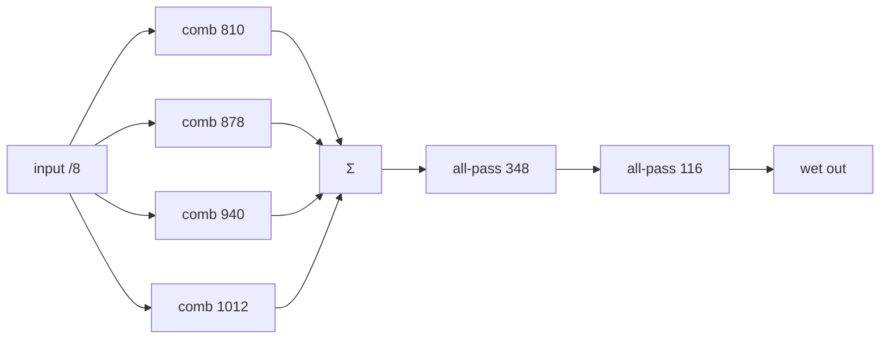
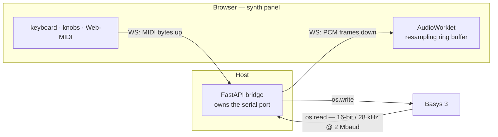

# XLS32 — development history & learnings

The long-form companion to the [README](README.md): how the synth was built, milestone by
milestone, and the hard-won friction logs & learnings from the XLS / F4PGA / Basys 3 toolchain.

**How to read this doc.** Two parts, two purposes:
- **[Development history](#development-history-milestones)** — the build in chronological
  order. The [roadmap table](#milestone-roadmap) is the skim index; each milestone opens with
  a one-line **What changed** summary, so you can scan the arc and dive in only where you need
  the detail.
- **[Friction logs & learnings](#friction-logs--learnings)** — the reusable, toolchain-level
  lessons. **Read these before extending the synth or porting the toolchain** — the first one
  ([Integrating Basys 3 + F4PGA + XLS](#integrating-basys-3--f4pga--xls-the-frictions)) caps
  what you can build.

**Contents**

- [Development history (milestones)](#development-history-milestones)
  - [Milestone roadmap](#milestone-roadmap)
  - [M1 — single-voice DDS sine + ADSR](#milestone-1--single-voice-dds-sine--adsr-done-hardware-verified)
  - [M2 — polyphony](#milestone-2--polyphony-done)
  - [M3 — MIDI input](#milestone-3--midi-input-done)
  - [M4 — hi-fi + expressive voice](#milestone-4--hi-fi--expressive-voice-done)
  - [M5 — 32-voice polyphony](#milestone-5--32-voice-polyphony-done)
  - [M6 — resonant filter + LFO](#milestone-6--resonant-filter--lfo-done)
  - [M6a — pipelined voice engine](#milestone-6a--pipelined-voice-engine-hi-fi-restored-done-hardware-verified)
  - [M6b — per-voice resonant filter](#milestone-6b--per-voice-resonant-filter-done-hardware-verified)
  - [M9 — noise + multimode filter + sub-osc](#milestone-9--noise--multimode-filter--sub-osc-done-hardware-verified)
  - [M10 — fat oscillators (PWM + detuned dual osc)](#milestone-10--fat-oscillators-pwm--detuned-dual-osc-done-hardware-verified)
  - [M11 — pitch expression (vibrato · bend · portamento)](#milestone-11--pitch-expression-vibrato--pitch-bend--portamento-done-hardware-verified)
  - [M13 — effects: chorus + delay](#milestone-13--effects-chorus--delay-via-block-ram-done-hardware-verified)
  - [M14 — reverb](#milestone-14--reverb-done-hardware-verified)
  - [M15 — unison](#milestone-15--unison-done-hardware-verified)
  - [Web UI — a browser synth panel](#web-ui--a-browser-synth-panel-done-hardware-verified)
  - [Standalone LED "comet"](#standalone-led-comet--per-voice-envelope-on-the-16-board-leds-done-hardware-verified)
  - [Stereo effects — mono dry, decorrelated wet](#stereo-effects--mono-dry-decorrelated-wet-done-hardware-verified)
  - [M19 — cross-oscillator FM / ring-mod](#milestone-19--cross-oscillator-fm--ring-mod-built)
  - [Preset browser & AI-matched preset banks](#preset-browser--ai-matched-preset-banks-inverse-synthesis)
  - [M7 + M8 — hardware I/O (DIN MIDI + I2S DAC)](#milestone-7--8--hardware-io-din-midi-in--i2s-dac-out-built-hardware-pending)
- [Friction logs & learnings](#friction-logs--learnings)
  - [Integrating Basys 3 + F4PGA + XLS](#integrating-basys-3--f4pga--xls-the-frictions)
  - [FPGA resource usage](#fpga-resource-usage-f4pga-vs-vivado)
  - [Backends for DSP48/BRAM (openXC7 vs Vivado)](#backends-for-dsp48bram-openxc7-nextpnr-vs-vivado--the-migration-learnings)
  - [Unlocking DSP48 & MMCM/PLL](#unlocking-dsp48--mmcmpll-backend-upgrade-path)
  - [XLS / DSLX](#xls--dslx)
  - [Headless verification over USB](#headless-verification-over-usb)
  - [Verify sound with a spectrogram](#verify-sound-with-a-spectrogram-not-just-an-fft-peak)
  - [Docker on macOS](#docker-on-macos)

---

# Development history (milestones)

The synth was built in verifiable increments, each checked over USB before moving on. The
roadmap table is the index; the sections that follow are in chronological build order
(M1 → M6b → the M9–M15 analog-feature push → the Web UI).

## Milestone roadmap

| # | Milestone | Verify remotely by |
|---|-----------|--------------------|
| **1 ✅** | Single-voice DDS sine + ADSR, auto-gated, streamed over UART | UART dump: ~440 Hz sine, amplitude follows the ADSR |
| **2 ✅** | Polyphony: 4 voices, auto-gated chord, sum/scale | **FFT of the UART dump shows 4 simultaneous chord peaks** |
| **3 ✅** | UART RX + MIDI parser + voice allocation | **host sends MIDI note-ons over USB; FFT confirms the pitches** |
| **4 ✅** | Hi-fi (16-bit / 32 kHz / 1 Mbaud) + velocity + waveforms | **FFT: right pitch + waveform harmonic signatures; richer WAV/MP4** |
| **5 ✅** | 32-voice polyphony (serialized mixer, /5 clock-enable) | **FFT shows 12 simultaneous pitches; hardware clean** |
| **6 ✅** | Master resonant low-pass filter (SVF) + LFO, MIDI-CC (low-fi /10) | **spectrogram shows harmonics roll off + a cutoff sweep** |
| **6a ✅** | Redesign → time-multiplexed **pipelined voice engine**, hi-fi 32 kHz restored | **FFT 4/4 chord + clean spectrogram on hardware** |
| **6b ✅** | **Per-voice** resonant filter + key-tracking (CC74/CC71), effective /3 clock | **spectrogram: cutoff sweep + rolloff steps up with pitch** |
| **7 ◐** | ⭐ Real **MIDI-DIN input** (31250 baud, DIN + optocoupler) | RTL built + timing-closed; iverilog TB; **hardware pending** (parts on order) |
| **8 ◐** | ⭐ **I2S DAC output** (UDA1334A → line-out) | RTL built + timing-closed; iverilog TB; **hardware pending** (parts on order) |
| **9 ✅** | ⭐ Quick wins: **noise**, multimode filter, sub-osc | **noise broadband; HP mode; sub +1322× octave-down** |
| **10 ✅** | ⭐ Fat oscillators: **PWM** + **detuned dual osc** | **PWM: 50%%=odd-only; detune: 2nd peak +13c, beats** |
| **11 ✅** | ⭐ Pitch expression: **vibrato**, **portamento**, **bend** | **vibrato sidebands; bend +-2st; glide 110->440** |
| 12 ◐ | Mod polish: **tremolo ✅**, LFO shapes, exp. envelopes | tremolo pulses the amplitude |
| **13 ✅** | ⭐ **Effects**: chorus + delay (BRAM delay line) | **echo decays cleanly; chorus comb-sweep; 8x RAMB36E1** |
| **14 ✅** | ⭐ **reverb** (Schroeder, BRAM) + cathedral/room size | **diffuse decay tail; room→cathedral RT60** |
| **15 ✅** | ⭐ **unison** (voice-stacking, detune + phase-decorrelation) | **thick super-saw; beating 2%→37% as voices stack** |
| **Web UI ✅** | Browser **synth panel** (live MIDI in + audio out + ADSR over CC) | **RMS rises on note; slow-attack pad vs fast bass audible** |
| 16+ | 24 dB filter / self-osc / drive (cascade a 2nd SVF pole + saturation), **ring/FM ✅ (M19)**, osc sync, exp. envelopes, LFO shapes, aftertouch / mod matrix | — |

> Milestones 9+ close the gap to a **typical analog synth**; each milestone section below opens
> with its analog-feature **priority** (impact × ease, ⭐ = priority pick). They interleave freely
> with M7/M8 (which are I/O, not sound design).

> **Architecture note (M6a onward):** milestones 1–6 used one combinational
> `tick(St)->Out` registered by a Verilog shell. M6 added a *master* filter but
> forced the clock to /10 (10 kHz, low-fi) and can't give each voice its own filter.
> M6a rewrites the core as a **time-multiplexed pipelined voice engine** (XLS *proc*
> + `--generator=pipeline`): all 32 voices flow through one deep datapath, one voice
> per engine cycle — the prerequisite for per-voice filtering (M6b). See the M6a
> section and *"Integrating Basys 3 + F4PGA + XLS"* below for why this lands at an
> effective **50 MHz**, not 100 MHz.

## Milestone 1 — single-voice DDS sine + ADSR (done, hardware-verified)

**What changed:** First sound — one voice (DDS sine + linear ADSR, auto-gated), streamed
8-bit/4 kHz over UART and verified from afar.

The de-risking MVP: prove the oscillator + envelope produce a correct waveform on
real silicon, using only the pipeline we already have.

- **DSLX**: one combinational `tick(St) -> Out` — DDS phase accumulator + 256-entry
  sine LUT, a linear **ADSR** envelope, an **auto-gate** timer (note on ~0.4 s /
  off ~0.4 s), and inline **UART TX** that sends the current 8-bit sample once per
  sample tick. Baud/sample dividers are parametric so a `tick_sim` variant
  simulates fast.
- **Sample rate 4 kHz**, note **A4 = 440 Hz** (so a 115200-baud, 1-byte-per-sample
  UART dump captures the waveform without [aliasing](https://en.wikipedia.org/wiki/Aliasing): ~9 samples/period).
- **Verify**: `read_uart.py` collects the 8-bit sample stream; the analyzer
  confirms (a) the sine period ≈ 9 samples and (b) the amplitude envelope rises
  (attack/decay) and falls (release) in lock-step with the auto-gate.
- LEDs show the live envelope level.

Real audio (higher sample rate + PWM) comes in later milestones; milestone 1
keeps the sample rate UART-friendly so the whole thing is checkable from afar.

### Milestone 1 result (verified on hardware, headless)
```
done 1
20173 samples in 5.0s (4035/s)          # ~4 kHz sample rate
sine period median = 9.0 samples        # ~448 Hz ≈ A4 440 Hz
envelope peak-to-peak: max=246, min=0   # ADSR cycles with the auto-gate
PASS
```
DSLX tests 8/8, iverilog sim PASS, hardware PASS. (Build/verify/listen commands are in the
[Builder's guide](README.md#3-builders-guide).) Listening to a 6 s capture (`record_wav.py` → `afplay`)
gives a pulsing **A4 (~440 Hz)** tone with the ADSR envelope (~7 note cycles in 6 s). It's
telephone-grade (8-bit / 4 kHz) by design — hi-fi audio (16-bit / higher rate via PWM) is
milestone 5. A sample capture was uploaded to Google Drive via `gws drive files create --upload`.

## Milestone 2 — polyphony (done)

**What changed:** 1 voice → 4 (`Voice[4]`), summed and scaled to play an Amaj7 chord;
verified by DFT peaks in the UART capture.

Four voices (`Voice[4]`), each its own DDS phase accumulator + ADSR; a shared
auto-gate triggers/releases an **Amaj7 chord** (A4 440 / C#5 554 / E5 659 /
G#5 831 Hz); `mix` sums the voices and scales by 1/4 to avoid clipping. It's a
small evolution of milestone 1 — a DSLX `for`-loop over the voice array
(`advance_voices`) and a `for`-fold for the mix.

Verified by running a **DFT over the captured UART stream** (`analyze_fft.py`) and
confirming multiple simultaneous peaks — one pitch is milestone 1, four pitches is
polyphony:
```
detected peaks (Hz): [440, 554, 660, 830]
A4/C#5/E5/G#5 all FOUND — PASS: 4/4 chord tones, 4 simultaneous peaks
```
DSLX tests 7/7, iverilog sim PASS (4 peaks), **hardware PASS (4 peaks)**. Chord
audio (`record_wav.py` → `chord.wav`) uploaded to Drive as an MP4.

**Frictions & lessons.**

- One pitch vs many is invisible in the raw byte dump but obvious in the
  frequency domain: a **DFT over the UART capture** (`analyze_fft.py`, pure
  stdlib) shows one peak for a single voice, N peaks for a chord.

## Milestone 3 — MIDI input (done)

**What changed:** Real MIDI in — a UART receiver + MIDI parser + voice allocation replace
the hardcoded chord; the host plays notes over USB and FFT-verifies the pitches.

`tick(St, rx)` gained a **UART receiver** (host → FPGA on `RsRx`/B18, 115200), a
**MIDI parser** (0x9n note-on / 0x8n note-off, running status), and **voice
allocation** (claim the first free voice; release by note number). Per-voice pitch
comes from a `NOTE_INC[128]` LUT. The hardcoded chord is gone — notes now come
from real MIDI bytes. Audio still streams out `RsTx` for verification (full duplex
on the one [FT2232](https://en.wikipedia.org/wiki/FTDI) channel-B port).

End-to-end, verified remotely: the host writes MIDI note-ons to the serial port,
reads the audio back, and FFTs it (`play.py`):
```
$ uv run host/play.py 60 64 67        # C major
detected peaks (Hz): [262, 330, 392] — 3/3 notes heard — PASS
```
DSLX tests 5/5, iverilog sim PASS (bit-banged MIDI → 4 chord peaks), **hardware
PASS** for Amaj7, C-major, and single notes. A MIDI-driven melody demo
(`demo.py`) was recorded and uploaded to Drive.

**Frictions & lessons.**

- **Baud countdown off-by-one:** counting `div` from `N` down to `0` is `N+1`
  cycles. Using `BAUD_DIV` (not `BAUD_DIV-1`) drifted the sample point 1 clock per
  bit — byte 1 decoded, byte 2 walked off the bit. Use `BAUD_DIV-1` between bits
  and `BAUD_DIV + BAUD_DIV/2 - 1` from the start edge to bit-0 centre.
- **False start bit from data MSB:** MIDI data bytes are `< 0x80` (bit7 = 0). If
  the RX goes idle *during* bit 7, that lingering 0 instantly looks like the next
  start bit and corrupts everything. Hold `rx_active` through the stop bit before
  re-arming.
- **Host-side flush:** an `os.write()` immediately followed by `os.close()`
  truncates — the last MIDI note-off was lost and a voice hung forever. `tcdrain()`
  + a short sleep before close.
- **Analyzer floor, not a synth bug:** a "missing" note (C4 261.6 Hz) was just
  below the FFT scan's 300 Hz floor. Widened to 200 Hz.

## Milestone 4 — hi-fi + expressive voice (done)

**What changed:** 16-bit/32 kHz audio over a 1 Mbaud UART, velocity→amplitude, and
CC70-selectable waveforms (sine/saw/square/triangle).

Upgraded for sound quality and musicality, all still verified over USB:
- **16-bit samples at 32 kHz**, streamed over a **1 Mbaud** UART (2 bytes/sample).
  At 32 kHz no MIDI note aliases ([Nyquist](https://en.wikipedia.org/wiki/Nyquist_frequency) 16 kHz), and 16-bit kills the 8-bit hiss.
- **Velocity → amplitude** (the velocity byte we already parsed now scales the mix).
- **Selectable waveform** — sine / saw / square / triangle, chosen by MIDI CC
  (`0xBn`, controller 70). `voice_wave()` derives each from the phase accumulator.

Verified on hardware: pitches correct (`play.py`), and the **waveforms confirmed by
their spectra** — saw = full harmonic series (440/880/1320/1760), square = odd
harmonics only (440/1320), sine = fundamental only. DSLX tests 6/6, sim PASS,
hardware PASS. Hi-fi demo (saw scale + sine chord) uploaded to Drive.

```bash
uv run host/play.py --wave saw 69    # A4 sawtooth, FFT shows the harmonic stack
uv run host/demos/demo.py demo.wav && scripts/make_mp4.sh demo.wav   # record + spectrogram video
```

**Frictions & lessons.**

- **Bandwidth sets the ceiling:** 115200 baud = ~11.5 kB/s, so 8-bit maxes ~11 kHz.
  16-bit @ 32 kHz needs 64 kB/s → bumped the UART to **1 Mbaud** (both ends).
- **macOS custom baud:** `termios` only names up to B230400; for 1 Mbaud use the
  `IOSSIOSPEED` ioctl (`0x80045402`) after `tcsetattr` (see `uartaudio.py`).
- **16-bit framing without a sync word:** stream lo/hi bytes and **auto-detect the
  byte alignment on the host** — real audio is smooth, a 1-byte-shifted stream is
  noise, so pick the offset with the smaller sample-to-sample delta.
- **Retime the envelope with the sample rate:** ADSR increments are per-sample, so
  going 4 kHz → 32 kHz (8×) means dividing the rates by ~8 to keep the same
  attack/decay/release *times*.
- **Waveforms verify themselves:** a saw shows all harmonics, a square only odd
  ones, a sine only the fundamental — the FFT is an unambiguous timbre check.

## Milestone 5 — 32-voice polyphony (done)

**What changed:** `Voice[4]` → `Voice[32]` with a **serialized** mixer, run at an effective
20 MHz via a ÷5 clock-enable (the design was too slow for 100 MHz).

Bumped `Voice[4]` → `Voice[32]`. The mix is **serialized** (accumulate one voice per
clock over 32 of the 1000 clocks/sample) so it isn't a 32-wide combinational tree.
Even so, the design's critical path is ~41 ns (Fmax ~24 MHz) — too slow for 100 MHz —
so the synth runs at an **effective 20 MHz via a /5 clock-enable** on the state
register (F4PGA forbids a divided clock driving a BUFG, so a clock-enable, not a
divided clock). 16-bit audio at 20 kHz over 1 Mbaud.

Verified on hardware: a 12-note cluster reads back as **12 simultaneous FFT peaks**
(84/112/148/196/262/330/392/523/659/784/1047/1319 Hz). Polyphony demo uploaded.

**Frictions & lessons.**

- **Serialize the wide work.** 32 voices × multiply + adder-tree in one clock won't
  meet 100 MHz. With 1000 clocks/sample, accumulate **one voice per clock** — short
  critical path, and it's how you scale voice count.
- **`for`-fold over an array = a deep combinational chain.** `update(vs, i, …)`
  threaded through a 32-iteration fold became a ~32-deep mux chain. `map()` does the
  per-voice update in parallel (depth 1). (The real remaining bottleneck was the
  note-*allocation* folds, `apply_on`/`apply_off` — a priority scan is inherently
  serial.)
- **Measure before flashing.** F4PGA hides VPR's timing report (`symbiflow_route …
  2>&1 > /dev/null`); re-run route and grep `Final critical path delay` / `Fmax`. Ours
  was 41 ns / 24 MHz — a guaranteed glitch at 100 MHz (and indeed the FFT was full of
  spurious peaks until fixed).
- **F4PGA won't let logic drive a BUFG** ("clock net … sources at logic which is not
  allowed"), so you can't just divide the clock. Use a **clock-enable**: the state FF
  captures every 5th cycle, giving the combinational block 50 ns to settle. VPR still
  analyzes the 100 MHz source and warns, but the FF only latches every 50 ns, so the
  hardware is correct.

## Milestone 6 — resonant filter + LFO (done)

**What changed:** A master resonant SVF + cutoff-modulating LFO on the mixed output (MIDI-CC
controlled) — at the cost of a ÷10 low-fi clock. A dead end that M6a/M6b supersede.

A master **resonant low-pass filter** (Chamberlin state-variable, Q13 fixed-point)
on the mixed output, with an **LFO** that modulates the cutoff (auto-wah). All
controlled by MIDI CC: **CC74 cutoff, CC71 resonance, CC76 LFO rate, CC77 LFO
depth** (CC70 still selects the waveform). Verified by spectrogram: a sawtooth's
harmonics roll off above the cutoff with a resonant peak, and a cutoff sweep moves
that edge up and down.

To fit the filter's feedback multiplies the synth clock drops to **/10 = 10 MHz
(10 kHz audio)** — low-fi, but the filter effect is the point. Filter/LFO demo
(`demo.py`) uploaded to Drive.

**Frictions & lessons.**

- **Chamberlin SVF** (`low += f*band; high = in-low-q*band; band += f*high`) is the
  easy fixed-point resonant filter; coefficients in Q13. Cutoff `f` and damping `q`
  come from MIDI CC; keep `f` capped (~0.6) and a damping floor so it stays stable.
- **Clamping filter state latches it.** At high resonance the state grows ~Q×input
  and hits the clamp rails, where it sticks (silence) and never recovers — note-on
  doesn't reset filter state. Fix: **attenuate the filter input ~4×** (scale the
  output back up) so the resonant state has headroom and never reaches the rails.
  Dynamic cutoff sweeps tolerate less resonance than static settings.
- **Narrow the multipliers.** `s64` mults blew timing (76 ns); the filter's chained
  feedback mults are the critical path, so the synth runs at **/10 (10 MHz)**.
- **Host gotcha:** `tcflush(TCIFLUSH)` mid-capture silently dropped the stream —
  don't flush once audio is flowing.

## Milestone 6a — pipelined voice engine, hi-fi restored (done, hardware-verified)

**What changed:** The core is rewritten as a time-multiplexed **pipelined proc** (one voice
per cycle) — the prerequisite for per-voice filtering — with hi-fi 32 kHz restored. Runs at an
effective 50 MHz (÷2 clock-enable).

The master filter (M6) is a dead end for *per-voice* filtering, and its /10 clock
threw away the hi-fi. M6a rewrites the core as a **time-multiplexed pipelined voice
engine** so every voice can later get its own filter (M6b) at full sample rate.

- **`engine` proc** (`--generator=pipeline`): recurrent state is `Voice[32]` + a
  mix accumulator + the MIDI parser. One voice is processed per engine cycle; a
  sample is emitted every 32 cycles. MIDI in / audio out are ready/valid **channels**
  the Verilog shell drives (`_midi_in`, `_audio_out`).
- **Rotate-ring voice storage.** The old dynamic `voices[vidx]` read is a 32:1
  ~3200-bit mux (~21 ns). Instead the ring is **rotated** so the current voice is
  always at slot 0 → constant-index read/write, no dynamic mux. `apply_on`/
  `apply_off` keep their constant-index (unrolled) scans.
- **Hi-fi restored:** 16-bit / **32 kHz** again, pristine 256-point sine.

Verified on the board: `play.py` reads **4/4 chord tones** over UART and the
**spectrogram is clean** (stable bands, no haze/dropouts/clipping — `docs/m6a_spectrogram.png`).

**It runs at an effective 50 MHz, not 100 MHz.** F4PGA/VPR floors this design at
~15–19 ns (wide MUXF6 mux trees; **no DSP48, no BRAM inference, no MMCM**). After
fixing the fixable paths (narrow multiplies, octave-shift note LUT), the sine LUT +
mux tree is an irreducible ~15 ns atomic op. So the engine advances every **2nd**
clock via a global **clock-enable** (`ce`, injected by `fix_verilog.py`), giving
every register path a 20 ns budget. See the frictions section for the full story.

```bash
scripts/build.sh      # or: STAGES=48 WCT=48 scripts/remote_build.sh  (native x86 host, faster)
openFPGALoader -b basys3 build/top.bit
uv run host/play.py                 # 4/4 chord over UART
uv run host/record_wav.py 3 m6a.wav && scripts/spectro.sh m6a.wav   # clean spectrogram
```

## Milestone 6b — per-voice resonant filter (done, hardware-verified)

**What changed:** Every voice gets its own resonant SVF — with key-tracking and a 2nd (filter)
envelope — filtering its oscillator *before* the mix. Clock drops to an effective ÷3.

The payoff of the M6a rewrite: **every voice now has its own resonant low-pass**,
filtering its oscillator *before* the mix — impossible with the old single master
filter (M6), which could only filter the summed output.

- **Per-voice SVF.** `Voice` gains `flo`/`fbnd` (Chamberlin state-variable filter
  state, Q13). `process_voice` runs the filter per voice with the input attenuated
  4× (anti-latch) and clamped state, so the `f*band`/`q*band` products stay ~13×18
  **narrow** soft-multipliers (no DSP48 in F4PGA — same discipline as the amp mult).
- **Per-voice cutoff** = **CC74** base + **key-tracking** (`note*16`, higher notes
  brighter) + a per-voice **filter envelope** (a 2nd ADSR → per-note "pluck",
  depth **CC79**) + a global **LFO** (auto-wah, **CC76** rate / **CC77** depth).
  **CC71** sets resonance. Every term but the LFO is per-voice.
- **Clock:** the filter deepens the path to ~22 ns (over the /2 budget), so the
  engine drops to an effective **/3 (~33 MHz, 30 ns budget)**. Throughput is fine —
  the actual initiation interval is far below the `worst_case_throughput` cap, so 32
  voices still finish well inside 3125 clocks/sample.

Verified on the board five ways:
- **Static:** CC74=10 rolls off the highs, CC74=127 passes the full harmonic stack.
- **Cutoff sweep** (`filter_demo.py`): the bright filter edge sweeps upward,
  revealing the sawtooth harmonics — `docs/m6b_filter_sweep.png`.
- **Key-tracking:** ascending octave saws at a *fixed* CC show the rolloff edge
  stepping **up** with pitch — `docs/m6b_keytracking.png`.
- **Filter envelope:** repeated notes each show a bright attack decaying to a darker
  sustain (a pluck); **LFO:** a held note shows the cutoff wobbling — `docs/m6b_modulation.png`.

```bash
uv run host/filter_demo.py sweep.wav 45 90 && scripts/spectro.sh sweep.wav   # cutoff sweep
uv run host/demos/demo_m6b.py demo.wav && scripts/make_mp4.sh demo.wav       # full showcase
```

## Milestone 9 — noise + multimode filter + sub-osc (done, hardware-verified)

**What changed:** Three cheap analog staples — LFSR **noise**, **multimode** filter
(LP/HP/BP/notch), and a **sub-oscillator** an octave down.

*Analog-feature priority: ⭐ quick wins — noise (impact High · ease ★★★★★), multimode filter (Med · ★★★★★), sub-osc (Med · ★★★★). Cheap, immediate new timbres.*

Three cheap analog-staple additions, all verified on the board:
- **Noise source** — a 16-bit Galois **[LFSR](https://en.wikipedia.org/wiki/Linear-feedback_shift_register)** (taps `0xB400`), exposed as waveform 4
  (CC70). Broadband spectrum, essential for percussion/effects.
- **Multimode filter** — the SVF already computes low/high/band, so `svf()` now returns
  all of them and **CC72** selects **LP / HP / BP / notch**. HP verified: the
  fundamental is attenuated ~380× while highs pass.
- **Sub-oscillator** — a square one octave below, mixed in via **CC73** (shift-based
  level). Verified: +1322× energy an octave below the played note.

Implementation note (F4PGA packing): the first cut used a 32-bit-per-voice 2nd phase
accumulator for the sub and a multiply for its level — that extra ring state + soft-
multiply **overflowed VPR's SLICE packer** (`top.net` Error 1). Fixed by deriving the
sub from a **1-bit toggle** on phase-wrap and a **shift-based** level (no new
multiply). Lesson: on F4PGA, watch total soft-multiplier count and ring-state width,
not just the critical path. Path 22.5 ns, within the ÷3 30 ns budget.

## Milestone 10 — fat oscillators: PWM + detuned dual osc (done, hardware-verified)

**What changed:** Analog thickness — variable-width **PWM** pulse and a **detuned 2nd
oscillator** on its own accumulator (beating/fatness).

*Analog-feature priority: ⭐ fat oscillators — PWM (impact High · ease ★★★★), detuned dual osc (V.High · ★★★); the signature analog thickness — the biggest single upgrade.*

- **PWM** — the square (wave 2) is now a variable-width **pulse**: high while
  `phase[24:32] < pw`. Width = **CC75** base + an LFO wobble (reuses `lfo_mod`, no new
  multiply). Verified: at 50 % the 2nd harmonic is 0 (odd-only); narrowing brings in
  even harmonics.
- **Detuned dual oscillator** — a 2nd oscillator (detuned **saw**) on its own
  accumulator `ph2 += inc + inc>>k` (constant-cents detune, **CC78**: off/~3/~7/~13 c).
  Verified: adds a 2nd spectral peak at ~1.008× the fundamental → beating / fatness.

Two F4PGA-packing lessons (both surfaced as `top.net` Error 1):
- A 2nd oscillator **must have its own accumulator** to beat — `phase + (phase>>k)`
  fails because `phase` wraps every period, resetting the relationship.
- A per-voice 32-bit accumulator (+1024 b of ring state) **overflows VPR's packer**
  (same failure as the M9 sub-osc). Fix: **stop storing `inc`** per voice and
  recompute `note_inc(note)` each cycle → net-zero ring width. On F4PGA, ring-state
  width and soft-multiplier count are the packing budget, not just the critical path.

MIDI CC map so far: 70 wave(0–4) · 71 reso · 72 filter-mode · 73 sub-level ·
74 cutoff · 75 pulse-width · 76 LFO rate · 77 LFO depth · 78 detune · 79 filter-env depth.

> **Limitation — aliasing.** The oscillators are naive (no band-limiting/BLEP), so raw
> saw/pulse alias at 32 kHz — worst on narrow pulses and wide detune with the filter
> open. In practice you play through the low-pass (that's what it's for), which rolls
> off the aliased highs; demos must use a moderate cutoff or they sound gritty. A
> band-limited oscillator would be a future milestone.

## Milestone 11 — pitch expression: vibrato + pitch bend + portamento (done, hardware-verified)

**What changed:** Three pitch modulators — **vibrato** (mod wheel), **pitch bend** (±2 st),
and **portamento**/glide — all folded into the oscillator increment.

*Analog-feature priority: ⭐ pitch expression — vibrato (impact High · ease ★★★), portamento (High · ★★★), pitch bend (Med · ★★★★).*

All three modulate the oscillator increment; the shared trick is `inc*(1+pmod/4096)`
done as `inc + (inc>>12)*pmod` (a ~19×10 multiply — no 32×32 / u64 overflow).
- **Vibrato** (CC1 mod wheel) — the global LFO drives `pmod` via a shift-based depth
  (no new multiply). Verified: mod wheel spreads a 440 Hz tone into sidebands.
- **Pitch bend** (0xE0 message) — 14-bit, ±2 semitones, folded into `pmod`. Verified:
  ±full → ±~2 st.
- **Portamento** (CC5) — per-voice glided increment `cinc` (stored as `inc>>6`, u26)
  slews toward the note target: `cinc += (tgt-cinc)>>k` (no multiply); a new note glides
  from its voice's previous pitch. Verified: a note glides ~110→440 Hz over ~300 ms.

Packing note: `cinc` (+26 b/voice) was afforded by **narrowing the filter state
flo/fbnd from s32 to s19** (they only hold the SVF clamp, ±131072) → net-zero ring
width. Testing note: **engine state persists across UART sessions** — reflash for a
deterministic voice-allocation/`cinc` when verifying the glide.

MIDI CC map: 1 vibrato · 5 portamento · 70 wave(0–4) · 71 reso · 72 filter-mode ·
73 sub · 74 cutoff · 75 pulse-width · 76 LFO rate · 77 LFO depth · 78 detune ·
79 filter-env; **0xE0** pitch bend.

## Milestone 13 — effects: chorus + delay via block RAM (done, hardware-verified)

**What changed:** First use of **block RAM** — a 16K×16 circular delay line in the Verilog
shell drives **chorus** and **echo/delay**.

*Analog-feature priority: ⭐ effects — chorus (impact V.High · ease ★★), delay/echo (High · ★★); the BRAM delay-line experiment (also proves out RAM for future work).*

The first use of **block RAM** on this design — and it works. A 16K×16-bit circular
delay buffer lives in the **Verilog shell** (`top.v`), downstream of the engine, with
**synchronous read + write** → F4PGA infers **8× RAMB36E1**. (The engine's sine ROM
never mapped to BRAM because XLS emits *async* reads; a sync-read RAM is the pattern
yosys/VPR actually maps.) Two taps per sample: a long fixed tap (**echo**, 250 ms + 0.5
feedback) and a short LFO-swept tap (**chorus**, ~9–17 ms). **CC83** selects
dry / chorus / echo / both (sniffed in the shell, which sees the MIDI stream).

Verified on board: echo decays cleanly (repeats halving every 250 ms, 0 glitches),
chorus shows the classic moving comb notches, dry/silence clean.

Three things this milestone taught (all cost a build):
- **BRAM is usable** on F4PGA — via a *sync-read* RAM, unlike the async ROM.
- Chorus tipped VPR's packer (**`rst` high-fanout net**). `--reset_data_path=false`
  packs but **rails the output** (un-reset state) — don't. The clean fix is **fewer
  pipeline stages** (48→40 → fewer reset FFs → less `rst` fanout), still ÷3 at 20.4 ns.
- An **uninitialized BRAM seeds a feedback loop** (echo railed): **clear the buffer**
  (sweep-write 0) at reset.

MIDI CC map: 1 vibrato · 5 portamento · 70 wave · 71 reso · 72 filter-mode · 73 sub ·
74 cutoff · 75 pulse-width · 76 LFO rate · 77 LFO depth · 78 detune · 79 filter-env ·
80 unison (off/2v/3v/4v) · 83 effect (dry/chorus/echo/both/**reverb**) ·
91 reverb room size (room/hall/large/**cathedral**) · 92 tremolo; 0xE0 pitch bend.

## Milestone 14 — reverb (done, hardware-verified)

**What changed:** A **Schroeder/Freeverb reverb** (4 feedback combs + 2 all-pass) with
room→cathedral size, in the shell's BRAM; the multiply-heavy feedback drops the clock to ÷4.

*Analog-feature priority: reverb (impact High · ease ★ — the hardest: multiply-heavy comb feedback).*

A **Schroeder reverb** as effect mode 4 (CC83): **4 parallel feedback comb filters**
(delays 810/878/940/1012 samples, [Freeverb](https://ccrma.stanford.edu/~jos/pasp/Freeverb.html) tuning) summed, then **2 series all-pass
diffusers** (348/116, g=0.5). All six delay lines live in their own regions of the
shared 16K delay BRAM (still 8× RAMB36E1); the shell FSM does one BRAM read+write per
cycle across ~10 states per audio sample. The reset buffer-clear (M13) keeps the comb
feedback from railing on power-up garbage.



**Room size (CC91):** each comb's feedback `g` is a real Q15 multiply, selected by room
size — `room` 0.671 (~0.4 s) · `hall` 0.793 · `large` 0.885 · `cathedral` 0.952 (~3.5 s
RT60). Input is a fixed `/8` gain (Freeverb-style) for all sizes, so the wet level stays
constant and bigger rooms ring *longer*, not quieter. A light `0.5` damping (a 1-pole
average in the feedback) rolls off highs for a natural tail.

Getting the long tail clean took several fixed-point lessons — all reproduced in a
Python sim (`/tmp/combsim.py` pattern) before committing each build:
- **Damping must be `(old+new)/2`, not `0.875·old+0.125·new`.** A small-step damping
  shift (`>>3`) both crushed the audio band (→ short tail *regardless* of `g`) and could
  push `curdlp + Δ` past ±32767 and **wrap** the 16-bit state → sign flip → runaway
  feedback. Averaging (`>>1`) is inherently overflow-safe (result always between its two
  operands) *and* preserves the band.
- **Matched input attenuation `1/(1−g)` was the wrong idea** — it makes cathedral's input
  32× smaller, so at non-resonant frequencies the tail is inaudible. A *fixed* small
  input (Freeverb) is correct.
- **A sustained sine is the worst reverb test signal** (settles near a comb anti-resonance
  → looks broken). Reverb needs a broadband transient; the demo uses plucks/chords.

The multiply pushed the effect path to ~37 ns, so the engine clock-enable dropped from
÷3 to **÷4 (40 ns budget)** — throughput is unaffected (II ≪ budget). Verified on board:
0 glitches, a smooth decay that **audibly lengthens room→cathedral**, no railing.

## Milestone 15 — unison (done, hardware-verified)

**What changed:** **Voice-stacking** unison (2/3/4 voices per note) with fixed detune + phase
decorrelation for a thick super-saw; max polyphony becomes 32/N.

*Analog-feature priority: ⭐ unison (impact Med · ease ★★★).*

**Voice-stacking** unison (CC80): a note-on grabs **N of the 32 physical voices** instead
of one (`off / 2 / 3 / 4`), each detuned and phase-decorrelated, for a thick "super-saw".
This reuses the whole per-voice datapath (filter, envelope, sub) and — since `apply_off`
already releases *every* voice whose stored `note` matches — note-off is free. Trade: max
polyphony becomes 32/N.

Two design points (the question that kicked this off — "do we need random detune?"):
- **No random detune.** Each stacked voice gets a *fixed symmetric* slot `2·k−(N−1)`
  ({−1,+1} / {−2,0,+2} / {−3,−1,+1,+3}) applied to its increment (`inc + (inc>>9)·slot`,
  ~3.4 c/unit). Fixed offsets are exactly what create the beating; randomness would only
  make the character inconsistent note-to-note. The spread widens with voice count.
- **Phase decorrelation, yes.** Each stacked voice starts at a distinct phase seeded from
  the noise LFSR. This avoids a coherent N× amplitude spike at the attack (**headroom** —
  a recurring pain point here) and gives instant thickness instead of a slow "bloom".
- **Gain comp ÷√N** (`×{256,181,148,128}/256`): decorrelated voices sum ~√N, so this holds
  single-note loudness constant (measured RMS ~2000 across off→4).

Cost: one small per-voice field (`uni: s4`) + one narrow multiply; packs at STAGES=40,
**34.5 ns (÷4)**. Verified on board: sustained-note **beating grows monotonically** with
voice count (envelope CV 2% → 17.5% → 26.3% → 37.4% for off→2→3→4), spectral peak widens
(0.5 → 2.5 Hz), level stays matched, no railing.

## Web UI — a browser synth panel (done, hardware-verified)

**What changed:** A browser analog-panel front-end that plays the real board live — MIDI in +
audio out over a WebSocket — plus the ADSR-over-CC firmware change it needed.

A browser front-end styled like a classic analog polysynth that plays the real board: it is a live
**MIDI input** (on-screen keyboard, computer keys, or a Web-MIDI hardware controller — all
forwarded to the board in real time) and an **audio output** (the board's 16-bit/28 kHz
UART stream, played through the browser via an AudioWorklet). A **timbre selector** offers
**5 factory presets** (show-off patches) + **5 user presets** (saved in `localStorage`).



- **Bridge** (`webui/server.py`, [FastAPI](https://fastapi.tiangolo.com/)): owns the serial port (reuses `uartaudio.open_port`),
  one reader thread drains the FTDI RX buffer, **byte-aligns** the 16-bit stream, and forwards
  the *raw* aligned bytes to every browser over one WebSocket (a per-sample Python decode
  couldn't keep up with the stream and dropped data — the browser decodes instead); MIDI bytes
  from the browser are written straight to the board. Multiple tabs supported. Serve HTTPS
  (needed for Web Audio off-localhost, e.g. over [Tailscale](https://tailscale.com/)) with `SSL_CERT`/`SSL_KEY`; bind
  with `HOST`. Run: `uv run python webui/server.py` (or `HOST=0.0.0.0 SSL_CERT=… SSL_KEY=… …`).
- **Front-end** (`webui/static/`): a `<canvas>`-free P5 panel (wood cheeks, cream sections,
  black knobs, pitch/mod wheels, keyboard; a version tag in the header). Knobs/switches send
  MIDI CCs; a preset applies a full CC burst so the board matches the UI. The AudioWorklet is
  an **adaptive-resampling ring buffer**: the board streams slightly under real time and the
  rate varies, so the worklet tracks the *measured* arrival rate and resamples to it — smooth
  playback at correct pitch with no under/overruns. `webui/synthspec.py` is the single source
  of truth for the CC map + presets, served at `/api/spec`.

**Browser-audio robustness (hard-won on iOS over Tailscale):**
- **Byte-alignment self-heal.** A single dropped UART byte flips the 16-bit phase for the rest
  of the stream — silence becomes a full-scale **DC**, tones a buzzy **"saw"**. Smoothness alone
  can't spot a flip during silence (both phases look flat), so the server scores each phase by
  smoothness **and** DC-centeredness (real audio sits at 32768) and **re-locks periodically**,
  so a mid-stream drop heals within ~0.1 s.
- **iOS audio session.** Web Audio is silenced by the ringer/silent switch even when the context
  is `running`; playing a looping **silent clip** flips the session to *playback* so output is
  heard. (Routing through a MediaStream element also plays through the switch but iOS distorts it
  with voice-processing — avoid.) The context is **resumed** on any gesture / `statechange`
  (iOS drops it to `interrupted`).
- **Connectivity & diagnostics.** WebSocket **auto-reconnects**; `wss` on HTTPS pages; a header
  **version tag** and a live **debug readout** (`ctx · ws · rx · rms · el`) make field debugging
  possible without a console.
- **Steady pitch.** The board's 28 kHz is crystal-stable, so the resampler estimates the rate
  slowly (heavily smoothed) and trims the step by only **±0.4 %** off a smoothed buffer level —
  no audible wow/flutter, still glitch-free.

**Firmware change it needed — ADSR over MIDI CC (CC20-27):** for an authentic panel the
envelopes had to be knob-controllable, but the amp/filter ADSR were hardcoded consts. The
fix parametrizes `adsr(env, st, att, dec, sus, rel)` and adds **engine-level** state
(`a_att…f_rel`) fed from CC20-23 (amp A/D/S/R) and CC24-27 (filter-env A/D/S/R). A/D/R map a
7-bit CC through a tiny 8-entry LUT to a per-sample increment (~3 ms…2 s, no multiply);
sustain is `cc<<9`. Engine-level (added once, not per-voice) + no new multipliers, so the
`Voice` ring width and the critical path are untouched — it packs and re-flashes unchanged
at ÷4.

Verified end-to-end: over UART the amp-attack CC sweeps the envelope rise cleanly and
monotonically (**CC20 = 0 / 64 / 120 → 4 / 120 / 716 ms** to 50 %), release responds, and
`play.py` still reads a clean 4/4 chord (no timing regression). In the browser (driven by
Chrome DevTools), Power starts audio at `running@32000`, a note raises the measured output
RMS and note-off returns to digital silence, and switching **Cathedral Pad** (slow attack)
vs **Sub Bass** (fast attack) shows the audible amplitude swell of the new ADSR CCs
(early/peak RMS ratio 0.03 vs 1.0).

## Standalone LED "comet" — per-voice envelope on the 16 board LEDs (done, hardware-verified)

**What changed:** The 16 board LEDs become a live voice display — a note advances a "comet"
cursor and each LED's brightness tracks the real per-voice ADSR envelope.

The Basys 3's 16 LEDs are a live voice display: **each new note advances a cursor to the next
LED** (a sliding comet that moves faster the more notes you strike at once), and **each LED's
brightness tracks the real ADSR envelope** of the voice that lit it, so notes swell and fade
behind the moving head. It's driven by the *actual* per-voice envelope, not a shell fake.

- The engine gets one non-blocking `viz_out` channel that streams `{env, is_new, last}` for
  the slot-0 voice every cycle. `is_new` is a **one-shot with no new state** — a freshly
  allocated voice is uniquely `env==0 && env_st==ATTACK` on its first slot-0 visit — so the
  `Voice[32]` ring width, allocation logic, multiplier count, and ÷4 critical path are all
  untouched (35.7 ns, +1.2 ns of fan-out vs before).
- The Verilog shell keeps a small cursor + scan-slot→LED binding table and an 8-bit PWM
  dimmer; the tuple's `last` bit self-aligns the scan index, so no cross-pipeline correlation
  is needed. Demo: `uv run host/demos/demo_leds.py`.

## Stereo effects — mono dry, decorrelated wet (done, hardware-verified)

**What changed:** The mono engine gains a **stereo image** built entirely in the shell —
decorrelated wet (Freeverb spread, ping-pong echo, anti-phase chorus) over a centered dry.

The voice engine stays mono; the **shell effects create the stereo image**. Two per-channel
16K delay buffers (`dmemL`/`dmemR`), and a single arithmetic datapath (one reverb multiply) is
**time-shared L-then-R** by the FSM — so no second multiplier and the ÷4 budget holds
(38.0 ns). Decorrelation: the **Freeverb stereo spread** (R comb/all-pass lengths = L + 23),
**ping-pong echo** (L↔R cross-feed), and **anti-phase chorus** taps. The mono dry sits centered
for a solid phantom center. Audio now leaves as 4-byte interleaved frames (`Llo Lhi Rlo Rhi`)
with a **1-bit channel marker** in each low byte's LSB (L=0, R=1) so the browser locks byte
*and* L/R alignment unambiguously. The web-UI `AudioWorklet` plays two rings sharing one
fractional read position (L/R phase-locked).

## Milestone 19 — cross-oscillator FM / ring-mod (built)

**What changed:** The 2nd oscillator doubles as a **modulator** — **FM** or **ring-mod** — so
the engine can finally *create* inharmonic (bell/metallic) timbres, not just filter them.

*Analog-feature priority: ⭐ FM / ring-mod (impact V.High · ease ★★) — the missing synthesis method.*

The engine was purely **subtractive** — it could shape harmonics but never *create* new ones,
so metallic, bell, and clangorous timbres were out of reach. M19 adds **cross-oscillator
modulation**: the 2nd oscillator (a detune-only saw until now) doubles as a **modulator** that
either phase-modulates (**FM**) or amplitude-multiplies (**ring-mod**) the carrier.

Three new engine CCs (a "Cross-Mod" panel in the web UI): **X-Mod** (CC85: Off / Ring / FM /
FM+), **X-Depth** (CC86), **X-Ratio** (CC87: **8** shift/add ratios — 1 / 1.5 / 2 / 3 / 4 / 5 /
7 / ½).

**F4PGA-aware design** — the friction logs (M9/M10) show that per-voice `u32` accumulators (×32)
overflow VPR's packer, so cross-mod adds **no new per-voice ring state**: it *reuses the existing
`ph2` accumulator* as the modulator (detune and cross-mod are mutually-exclusive uses of the
same register). Modulator:carrier ratios are done with **shifts/adds** on the phase increment
(the eight ratios above — no multiply). The **FM index is a real multiply** — `modsig · depth`,
scaled into the phase — reaching β ≈ 1.5 rad (FM) / π (FM+). Ring is a second multiply
(`main · modsig`). So cross-mod costs **two soft-multiplies**, the thing that had to fit the ÷4
40 ns budget.

> **Strong-FM upgrade.** The first cut used a *shift*-based FM index (`modsig << (depth>>3)`) to
> stay at one multiply — but that tops out at β ≈ 0.1 rad, far too weak to voice bells (measured:
> on-vs-off spectra nearly identical). We proved in the sim that a **multiply-based index +
> fractional ratios** reaches real inharmonic partials (it nails a glockenspiel's 5.3× strike
> tone), so the RTL was upgraded to the strong version. The extra multiply still fits: **`Final
> critical path delay: 39.51 ns`** (vs 39.39 for the shift version — the added multiply cost only
> +0.13 ns; 0.49 ns margin under the 40 ns budget), and it packs. Hardware-verified: sidebands
> grow with depth (1 → 3 → 4 → 7 partials) and X-Ratio reshapes the spectrum, matching the sim;
> X-Mod = Off is a clean single carrier (byte-identical, banks unchanged).

Validated **in the software model first** (`presetgen/engine.py` mirrors the RTL exactly), then
built + timing-checked + flashed + FFT-verified on the board — the full prototype→measure→build
loop.

> **De-latch fix (fixed-point filter robustness).** Strong FM exposed a *latent* hardware bug:
> under **2+ bright polyphonic voices**, the Q13 fixed-point Chamberlin SVF would intermittently
> lock into a **full-scale limit cycle** — audible as noise (rapid polyphonic FM play measured
> **96% of playtime railed**). It wasn't FM-specific (the same patch with X-Mod off railed too),
> just triggered readily by FM's bright, wide-open patches; it's the same instability first seen
> in `presetgen/calibrate.py`. The **sim never showed it — it models the SVF in floating point**,
> so this could only be reproduced and fixed on hardware. Fix: a **leaky integrator** on the SVF
> state (`low -= low>>7`, `band -= band>>6`, ~0.8–1.5 %/sample) that pulls the poles just inside
> the unit circle so any self-oscillation decays instead of latching — inaudible on the frequency
> response. Hardware result: polyphonic FM railing **96% → 0%** (0/16 chord-bursts), normal and
> resonant patches unchanged, critical path **39.01 ns**. Hardens the whole synth, not just FM.

> **Why it's a *playable* feature, not a search target.** We investigated hard whether the
> preset-matcher would *choose* cross-mod for bells, and the answer is a firm no — even with
> strong FM that reaches the target's inharmonic ratios, and even on real NSynth recordings (not
> just the GM SoundFont). The magnitude-STFT loss isn't blind to overtones; it's *too literal* —
> it scores per frequency-bin, so partials a few Hz off draw a double penalty, and its dominant
> terms reward *filling the gross energy curve* (which a rich saw+noise+filter does) over placing
> sparse exact partials. So FM ties, at best, only on the most inharmonic/brightest targets. Like
> every real FM synth, the bell/EP/metallic patches are **voiced by ear** (see the **FM** bank in
> the browser), not inverse-synthesized.

## Preset browser & AI-matched preset banks (inverse synthesis)

**What changed:** A Serum/Vital-style **preset browser** backed by banks built through *inverse
synthesis* — a CMA-ES search over the CC space minimizing a spectrogram loss against real target
sounds, run on a fast software model of the engine.

The web UI has a Serum/Vital-style **preset browser** (Factory/User tabs, a category rail, a
scrollable list, search) backed by **128-slot** banks; `webui/synthspec.py` concatenates every
`presets_*.json`, so multiple source banks coexist. But the interesting part is *how the
factory presets are made* — not by hand-guessing knob values (which sounds bland), but by
**inverse synthesis**: for each named target sound, search the engine's parameter space to
minimize a spectrogram distance to that target.

The pipeline (`presetgen/`):
1. **Software model of the engine** (`engine.py`) — a sample-accurate NumPy/[numba](https://numba.pydata.org/)
   reimplementation of `synth.x` + the shell effects (naive oscillators kept naive so the
   *aliasing* matches), validated against the real DSP. It renders `(CCs, note) → audio` in
   milliseconds, which is what makes a search feasible (the board is far too slow: ~10³–10⁴
   renders per target).
2. **Perceptual loss** (`loss.py`) — a multi-resolution STFT + mel + amplitude-envelope
   distance, RMS-normalized and magnitude-only.
3. **Search** (`search.py`) — [CMA-ES](https://en.wikipedia.org/wiki/CMA-ES) over the 23-dim
   CC space (`params.py`), seeded per category, minimizing the loss against a target render.
4. **Targets** — real single-note samples, one *source module* per corpus (all expose the same
   `list_targets()`/`load()` interface): `nsynth.py` (Google's **NSynth** — 128-preset bank,
   loss median 28.5), `soundfont.py` (a **GM soundfont** rendered with [FluidSynth](https://www.fluidsynth.org/)
   — named synth presets at known pitch, median 22.9), and `freesound.py` (**CC0 analog** via
   the Freesound API + the AudioCommons `ac_note_midi` descriptor for pitch). Each becomes its
   own bank/tab in the browser.
5. **Orchestrate** (`build_presets.py <per_cat> <budget> <source>`) → writes
   `webui/presets_<source>.json`; the browser picks it up automatically.

### The loss function (`loss.py`)

A **magnitude-only** distance on **loudness- and pitch-normalized** renders (both `prep()`'d:
resampled to a common 22.05 kHz, RMS-normalized, truncated to equal length; both rendered at
the *same MIDI note* so harmonics align). Three terms sum to one scalar:

```
loss =  Σ over FFT ∈ {256,512,1024,2048}  [ mean|Aₘ−Bₘ|  +  0.5·mean|log Aₘ − log Bₘ| ]   # multi-res STFT
      + 2 · mean|mel-band(A) − mel-band(B)|                                                # perceptual timbre
      + 3 · mean|env(A) − env(B)|                                                          # ADSR shape (10 ms RMS)
```

- **Multi-resolution STFT** (Hann, 75 % overlap): small windows catch transients, large windows
  resolve pitch/harmonics — summing across scales avoids any single window's time-vs-frequency
  bias (the [DDSP](https://magenta.tensorflow.org/ddsp) multi-scale spectral loss). The log term
  adds dB-like sensitivity so quieter harmonics count.
- **Mel/log-frequency bands** weight the overall spectral envelope (timbre), not just bins.
- **Amplitude-envelope** term (highest weight) matches attack/decay/sustain over time, so a pad
  can't "match" a pluck on steady-state spectrum alone.
- **Magnitude-only** discards phase — perceptually fine for these sounds and a much smoother
  objective for the optimizer (no phase-cancellation cliffs). Reference scale: identical ≈ 0,
  octave-off ≈ 49, tone-vs-noise ≈ 137; matched presets land ~7–40.

### The CMA-ES search (`search.py`, `params.py`)

Each target is fit by one [CMA-ES](https://en.wikipedia.org/wiki/CMA-ES) run over a **23-dim
`[0,1]` vector** (14 continuous knobs + 9 bit-packed selects), seeded from a per-category
region (`seed_vec`). Discrete selects (waveform, filter mode, fx, …) are handled by
**continuous relaxation**: each is one `[0,1]` coordinate that `preset_from_vec()` quantizes into
its option buckets (e.g. waveform = one of 5 equal bands), so CMA-ES only ever optimizes a
continuous vector and explores discretes implicitly as its sampling distribution crosses band
boundaries. A guard rejects silent/degenerate patches; the seed patch is always kept as a floor.

Two measured findings shaped this (equal-*total-cost* A/B over 8 targets/category):
- **The loss is budget-limited, not local-minima-limited — so don't restart.** Per-waveform
  multi-start actually came out **~8 % worse** than a single run at the same budget (it starved
  each run), and continuous-space restarts never beat a single run either. A loss-vs-cost sweep
  makes the knee explicit:

  | config | cost (evals) | mean loss |
  |---|---|---|
  | single @400 | 400 | 20.27 |
  | **single @800** | 800 | **18.03** |
  | single @1600 | 1600 | 17.58 |
  | restart 2×400 | 800 | 19.89 |
  | restart 2×800 | 1600 | 17.60 |

  At every matched cost a single run ≥ restarts, and 400→800 buys 11 % while 800→1600 buys only
  ~2.5 %. **Sweet spot: one CMA-ES run at ~800 evals** (≈90 % of the 1600-eval floor at half the
  cost) — so `search.py` is a single run, no restarts/multi-start.
- **What's left is the engine's reach, not the optimizer.** Once the search is converged, the
  residual loss on brass / intervals / acoustic targets is because a subtractive engine can't
  *make* those timbres — an inherent subtractive-engine limit that only new synthesis features
  (anti-aliased oscillators, a real 2nd oscillator, exponential envelopes) would extend. A cheaper,
  orthogonal win is matching over multiple notes/velocities (generalization across the keyboard).

**Hard-won lessons (see [§6](#friction-logs--learnings)):** the simulator's fidelity bounds
everything, and a `calibrate.py` probe against the board is essential; the "clinical" nature of
NSynth notes and the difficulty of driving/obtaining ground truth (Surge XT can't be loaded
headlessly by any Python VST host; Freesound bulk fetching trips Cloudflare) are the real
constraints, not the search itself.

**Lessons — offline matching.**

- **The simulator's fidelity bounds the result.** A search that minimizes a loss on the
  *software model* only transfers to hardware if the model matches the board. A `calibrate.py`
  probe (render the same probe patches on sim and board, compare spectra) is essential — it
  exposed a real sim↔board gap (resonance/effects level and character), so treat matched
  patches as sim-optimal until board-validated. Board captures are also **nondeterministic**
  (engine state persists across UART sessions + occasional MIDI-CC drops), so use best-of-N and
  reflash for a clean baseline before trusting a calibration number.
- **Ground truth is the hard part, not the search.** Driving Surge XT headlessly is a dead end
  with pip tooling: pedalboard and DawDreamer both silently ignore its `.fxp` (VST3 `raw_state`
  round-trips unchanged; `load_preset`/`preset_data` reject it; the AU won't scan), `surgepy`
  isn't on PyPI, and the `.fxp` XML param names don't map to the plugin's exposed params. The
  tell-tale that "it works" was a false positive — **identical seed-losses across different
  targets** meant every target was silently the default patch. Pivoted to real sample corpora
  (NSynth; Freesound CC0). NSynth's held/valid splits are small and "clinical" (no `synth_lead`,
  ~10 instruments/family) — variety comes from using multiple pitches per instrument.
- **Freesound API gotchas:** filter fields are Solr — `ac_single_event` isn't filterable
  (returns *undefined field*); take it from the `ac_analysis` output field instead. A burst of
  `Python-urllib` requests trips **Cloudflare** (empty-body 403, IP-wide, affects the browser
  too) — throttle hard (≥2 s between calls, browser-like User-Agent) and don't hammer while
  debugging.
- **numba is what makes it tractable:** the SVF and effects are recursive per-sample, so a pure
  NumPy sample loop is too slow for CMA-ES; JIT the kernels and thousands of renders/target
  become milliseconds each.

## Milestone 7 + 8 — hardware I/O: DIN MIDI in + I2S DAC out (built; hardware pending)

**What changed:** The two interfaces that make it a **standalone** instrument — DIN MIDI-in
(opto-isolated) and I2S DAC line-out — built and timing-closed, but hardware-pending (parts on
order).

Until now the synth has been a *headless* instrument: MIDI arrives and audio leaves over the one
USB UART (great for autonomous verification, but it means a computer is always in the loop). M7+M8
add the two interfaces that make it a **standalone** instrument — a hardware MIDI keyboard plugged
straight in, and analog audio out to real speakers — with **no host and no OS/driver round-trip**.
This is the low-latency chain: keyboard → FPGA → DAC → amp, every stage hard-real-time.

- **M7 — DIN MIDI input** (`rtl/top.v`). A second **UART RX at 31250 baud** on **Pmod JA1**, fed by
  a standard **opto-isolated MIDI-DIN breakout**. Its decoded bytes are **arbitrated into the same
  `midi_in` stream** the FT2232 (web UI, 2 Mbaud) already drives — so the hardware keyboard and the
  browser coexist, both routing to the 4 parts by channel. The parser, voice allocation, and CC map
  are all unchanged; MIDI simply has a second physical source.
- **M8 — I2S DAC output** (`rtl/top.v`). A **Philips-I2S master** (BCLK / LRCLK / SDATA on **Pmod
  JB1–3**) clocks the engine's 16-bit stereo samples to a **UDA1334A** DAC, whose analog line-out
  feeds the speakers (**KEF LSX II** via 3.5 mm, in this build). BCLK = 3.125 MHz, 64 BCLK/frame →
  Fs ≈ 48.8 kHz, a zero-order hold of the 28 kHz engine samples; offset-binary → two's-complement
  at the shift-register. The UDA1334A needs **no MCLK** (internal PLL), so three pins suffice.
  This supersedes the roadmap's original **M8 (1-bit PWM + RC filter)** — a real I2S DAC is only a
  little more logic and gives clean line-level stereo instead of a filtered 1-bit pin.

**F4PGA-aware / timing.** Both blocks are small and sit *outside* the engine's ~40 ns SVF critical
path (the DIN RX is one more slow-baud state machine; the I2S TX is a free-running counter + two
shift registers on the 100 MHz clock). The full build confirms it: **`Final critical path delay:
39.85 ns`** — under the ÷4 40 ns budget, and actually *better* than the pre-M7/M8 4-part figure
(40.02 ns), so the added I/O placed for free. `basys3.xdc` gains the four Pmod pins (JA1; JB1–3).

**Verification.** A functional iverilog testbench (`rtl/tb_io.v`, with a stub engine) drives a DIN
note-on and checks that (a) the bytes decode and forward to the engine (`last = 0x64`, the
velocity) and (b) BCLK/LRCLK toggle — both pass. The full F4PGA build synthesizes, routes, and
closes timing (above). **Not yet hardware-tested** — the MIDI-DIN breakout + UDA1334A are on order;
once they arrive the plan is: flash, wire (breakout at 3.3 V → JA1; DAC → JB1–3 + 3.3 V/GND; DAC
3.5 mm → speakers), play a keyboard, and confirm the analog output by ear + capture.

> **Wiring (for when the parts arrive).** *Keyboard→FPGA:* MIDI-UART opto breakout set to **3.3 V**,
> serial-out → **JA1**, powered from JA pin 6 (VCC) + pin 5 (GND); keyboard DIN-OUT → breakout
> DIN-IN. *FPGA→speakers:* UDA1334A BCLK←JB1, WSEL←JB2, DIN←JB3, VIN←JB pin 6 (3.3 V), GND←JB pin 5;
> DAC 3.5 mm line-out → speaker aux-in. Flash with `openFPGALoader -b basys3 build/top.bit`.

---

# Friction logs & learnings

The hard-won, reusable lessons — read these before extending the synth or porting the
toolchain. The first subsection is the load-bearing one (it caps what you can build); the
rest are per-topic.

## Integrating Basys 3 + F4PGA + XLS: the frictions

Three tools that don't know about each other, stacked: **XLS** (HLS, DSLX → Verilog)
→ **F4PGA** (open-source yosys + VPR + prjxray bitstream for Xilinx 7-series) →
**Basys 3** (Artix-7 `xc7a35tcpg236-1`). Each seam leaks. What actually bit us:

**F4PGA's hard limits (the big ones — they cap what you can build):**
- **No DSP48 inference.** Multiplies become **soft multipliers** (LUT+CARRY4 chains); a
  32×32 is ~20 ns. **The gap is in the F4PGA flow, not XLS or yosys** — verified from a build
  log: XLS emits ordinary `*`/`$mul`, and mainline yosys *can* infer DSP (`synth_xilinx -dsp` /
  `mul2dsp` / `xilinx_dsp`), but F4PGA's `symbiflow_synth` runs the `xc7_vpr` script, which
  **omits those passes** — the multiplies go `ALUMACC → $macc → ABC → LUT/CARRY4` (0 DSP48 in the
  final netlist, all soft). Even if they were emitted, the shipped `xc7a50t_test` arch + F4PGA
  techmaps model **no DSP48 tile** for VPR to place (prjxray has the fuzz data, but the P&R arch
  never completed it). So it's a backend limitation, unlockable only by changing the backend —
  see [Unlocking DSP48 & MMCM/PLL](#unlocking-dsp48--mmcmpll-backend-upgrade-path). **Working fix
  today: keep multipliers tiny.** Constrain operand types so XLS's narrowing pass shrinks them
  (return `s16` not `s32` from `voice_wave`; fold env×vel into one 7-bit gain → a ~16×8 multiply).
  20.7 → 15.4 ns.
- **Block RAM needs a *synchronous* read.** XLS emits **async** array reads (`wire […]
  SINE[…]; assign = SINE[addr]`), which yosys's frontend `mem2reg`s to logic **before**
  BRAM inference → the 256-entry sine ROM stays a **256:1 mux** (~15 ns). BUT a
  hand-written **sync-read RAM** (registered read/write) in the Verilog shell **does map
  to RAMB36E1** — that's how the M13 delay line works (8× RAMB36E1). So BRAM is usable;
  XLS's async-read *ROM* just isn't the pattern that maps.
- **An array-index is one atomic op.** Neither XLS's pipeline scheduler nor VPR can split
  a wide LUT/mux across pipeline stages, so more `--pipeline_stages` doesn't help — the
  single mux dominates one stage. This is *the* 100 MHz wall here.
- **No MMCM / PLL.** No clock-management primitives in the techlib/arch, so you **cannot
  synthesize an arbitrary clock** (e.g. a clean 50 MHz) from the 100 MHz oscillator.
- **Logic can't drive a BUFG** ("clock net sources at logic which is not allowed") — so
  you can't divide the clock in fabric either.
- **Consequence — the clock-enable multicycle.** With no DSP, no BRAM, no MMCM, and no
  clock divider, and the design floored at ~15–19 ns, we run everything on the 100 MHz
  clock but advance the engine **every Nth cycle via a global clock-enable** (`ce`), so a
  path gets N×10 ns. `fix_verilog.py` injects `ce` into XLS's *single* pipeline
  `always @(posedge clk)` block (gate the non-reset branch: `end else if (ce) begin`), and
  the shell drives `ce` at ÷2. **VPR still reports the 15 ns paths as failing** (it can't
  see the multicycle) — timing must be *reasoned*, not read from the report: safe iff the
  single-cycle critical path < N×10 ns. Verified clean on hardware at N=2 (effective 50 MHz).
  Note both the ready/valid handshakes (MIDI-accept, audio-pull) must then complete **only
  on `ce` cycles**, or bytes/samples are lost.

**XLS → F4PGA codegen seams:**
- **Emit plain Verilog:** `--use_system_verilog=false`. XLS's SystemVerilog `'{…}`
  array-assignment for LUTs makes yosys throw `syntax error, unexpected OP_CAST`.
- **Dynamic array *writes* → `for (genvar …)` generate loops** that F4PGA's plain-Verilog
  yosys rejects; `fix_verilog.py` unrolls them into explicit assigns.
- **Proc pipeline codegen** exposes **channel ready/valid ports** (`_ch`, `_ch_vld`,
  `_ch_rdy`) the shell must handshake — different from the old combinational `st`/`out`.
  Needs `--reset=rst --reset_active_low=false --reset_asynchronous=false` or codegen
  errors ("register has a reset value but … no reset operand").
- **`--delay_model=unit` schedules by *op count*, blind to real cost.** It happily packs an
  expensive mux with cheap ops into one stage. There's no good FPGA delay model in XLS, so
  the schedule is only as good as your op-narrowing — the scheduler won't save you.
- **DSLX member names** can't be `in`/`out`/`byte` (reserved); a proc channel named `out`
  or a param named `byte` (→ SV `wire byte`) breaks downstream.
- **Prebuilt XLS binaries are linux-x64 + glibc ≥ 2.34**, but the F4PGA image is glibc
  2.31 — they can't share a container. Run XLS in a separate amd64 Ubuntu 24.04 image.

**Toolchain / host frictions (Apple Silicon, remote):**
- **F4PGA is amd64-only**, emulated via Docker on the M-series Mac → ~8–10 min/build. A
  **native x86 GCE host** (`remote_build.sh` → `vmbuild.sh`) cuts it to ~6 min (VPR is
  single-threaded, so the win is modest) and frees the Mac. F4PGA also **hides VPR's
  timing report** (`symbiflow_route … > /dev/null`); we patch the VM's `common.mk` to tee
  it, so a single route pass yields the bitstream *and* `Final critical path delay` — never
  trust a build you haven't measured.
- **VPR placement is noisy:** the *same* design ranged 15.4 → 18.9 ns across builds. Leave
  timing margin; a "closes at 19 ns" build can be a 15 ns build on a different seed.
- **Docker on macOS:** locked keychain blocks `docker pull` (import an Ubuntu rootfs
  tarball instead); never bind-mount `~/Documents` (iCloud → containers hang in `Created`);
  build under `/tmp` (which is periodically wiped, so `build.sh` re-fetches).
- **Basys 3 I/O:** one 100 MHz oscillator (W5); the FT2232 gives **channel A = JTAG**
  (openFPGALoader) and **channel B = UART** (`/dev/cu.usbserial-…1`) — MIDI in + audio out
  run full-duplex on that one UART. `openFPGALoader` is native arm64 (no emulation).

## FPGA resource usage (F4PGA vs Vivado)

The resource picture depends heavily on the backend. **On F4PGA** (soft multipliers, no BRAM/DSP
inference) logic is the ceiling: measured from the VPR pack/place report, **slices are ~90% full**
while everything else idles (this shaped the early roadmap). **On the shipped Vivado build the story
flips** — LUTs drop to **~50%** and block RAM becomes the most-used resource (second table below).

| Resource | Used | Fabric* | % | Note |
|---|---:|---:|---:|---|
| **Slices** | **7,297** | 8,150 | **~90%** | the binding constraint |
| LUTs (5-LUT, fractured) | 28,120 | 32,600 | — | packs near-full into those slices |
| Flip-flops (FDRE/FDSE) | 17,647 | 65,200 | ~27% | huge headroom |
| Block RAM (RAMB36E1) | 16 | 75 | ~21% | the 16K×16 effects delay line |
| DSP48E1 | 0 | 120 | 0% | not inferred (see above) |
| BUFG / MMCM-PLL | 1 / 0 | 32 / 5 | — | clock-enable, no CMT |
| Bonded I/O | 23 | — | — | UART + MIDI-DIN + I2S + LEDs |

\* F4PGA builds the Basys 3 (`xc7a35t`) against the **`xc7a50t_test`** arch — the two parts are the
*same die*, binned differently — so P&R targets, and utilization is measured against, the a50t fabric.
(On the a35t's *advertised* 5,200 slices this design wouldn't "fit"; it fits because the physical die
is the a50t.) VPR's own `Device Utilization: 0.19` is whole-grid tile occupancy (mostly empty
routing/IO) — **not** the meaningful figure; slice occupancy is.

**The shipped Vivado build (DSP48 + BRAM), measured against the real `xc7a35t`
(`report_utilization` / `report_timing`):**

| Resource | Used | Fabric | % | Note |
|---|---:|---:|---:|---|
| Slice LUTs | **10,483** | 20,800 | **50.4%** | ~half the F4PGA count — ROMs/muxes moved to BRAM |
| Slice Registers | 17,445 | 41,600 | 41.9% | headroom |
| F7 / F8 muxes | 297 / 18 | — | ~2% | vs **6,685 MUXF6** on F4PGA — the mux trees collapsed |
| **Block RAM** | **32× RAMB36 + 1× RAMB18** | 50 | **65%** | now the binding resource (the 16K×16 effects/reverb buffers) |
| DSP48E1 | **26** | 90 | 28.9% | every `×` inferred off the fabric |
| Engine critical path | **~18.5 ns** | — | — | runs ÷3 (30 ns budget) → true **32 kHz** |

Vivado infers the ROMs/delay memories into **32 BRAM** and the multiplies into **26 DSP48**, which
collapses the mux trees (**6,685 → ~300**) and halves the critical path (~40 → ~18.5 ns). Net effect:
**LUTs fall to ~50% and block RAM (65%) becomes the most-used resource — logic is no longer the
ceiling.** It also restored a real 32 kHz stream (÷3) and eliminated the "4-parts-at-40.02 ns /
placement-roulette" fragility (~10 ns of margin now). *(Vivado reports the raw 100 MHz constraint as
failing — expected: the engine runs on the ÷3 clock-enable, a multicycle the tool isn't told about.)*

Learnings:
- **On F4PGA, slices fill before FFs/LUT-capacity because of packing density.** The datapath is
  dominated by **wide combinational mux trees** (the 256-point sine LUT, per-voice/per-part selects) —
  **6,685 MUXF6** instances pin LUTs to fixed slice positions and force *low* slice packing, so slices
  hit ~90% while FFs sit at ~27%. **Vivado sidesteps this** by inferring those ROMs/memories into BRAM
  (muxes collapse to ~300), which is why its LUT use is ~half and BRAM becomes the ceiling instead.
- **Soft multipliers are the *other* slice hog.** With no DSP48, every `×` is LUT+CARRY4 — so more
  synthesis features (FM, filters) cost slices twice: logic *and* timing.
- **Growth hits slices first on F4PGA, BRAM first on Vivado.** On F4PGA a 5th part / deeper
  polyphony / more effects exhausts slices before anything else — levers are **reduce mux width** and
  **move multiplies to DSP**. On Vivado the delay/reverb buffers already use 65% of BRAM, so *more
  effects* is the resource risk there. This is the physical basis for the "4 parts is at the edge"
  and loss-roadmap "watch soft-multiplier count" notes.

## Backends for DSP48/BRAM: openXC7 (nextpnr) vs Vivado — the migration learnings

Getting DSP48 required leaving F4PGA/VPR. Two backends were added alongside it (both select via
`BACKEND=` in `scripts/remote_build.sh`); the hard-won lessons:

- **XLS is not the blocker; the P&R backend is.** XLS emits ordinary `*`/`$mul`, and mainline yosys
  infers DSP (`synth_xilinx`). F4PGA's `symbiflow_synth` just never runs the DSP passes *and* its
  `xc7a50t_test` arch has no DSP tile — so the fix is a different backend, not different DSLX.
- **openXC7 (yosys `synth_xilinx` + nextpnr-xilinx) works — except DSP routing.** Via the
  `regymm/openxc7` Docker image it routes the design, **infers BRAM (16 RAMB36)**, and prints a
  trustworthy **Fmax (~32 MHz)** — a big step up from VPR's "reason-don't-read" report. yosys even
  infers **24 DSP48**, but nextpnr-xilinx **can't route the global GND constant into the DSP's
  dedicated `CARRYCASCIN` pin** (`Unrouteable $PACKER_GND_NET … CARRYCASCIN`) — a real 7-series
  maturity gap that hits even *single* (non-cascaded) DSPs once yosys uses the DSP's post-adder.
  So openXC7 is a great open BRAM/timing backend but not (yet) a DSP one here.
- **Keep each multiply inside ONE DSP48 (25×18).** yosys/Vivado split a `>25`-bit operand into
  *cascaded* DSPs, which reintroduces the cascade-pin problem. XLS often *fails to range-narrow*
  operands that flow through `as s32` casts (it left `inc>>9`, `pmod`, `amp` at 32 bits). The fix in
  `synth.x` is explicit narrowing at the multiply — bitmask a value that's provably in range
  (`f & 0x1FFF`) or cast through a tight type (`pmod as s16`, `amp as s24`). Behavior-preserving,
  and it drops each product to a single 25×18 DSP.
- **Vivado ML Standard closes DSP48 cleanly.** `read_verilog` + `synth_design`/`place`/`route` infers
  **26 DSP48E1 + 32 RAMB36E1** from the identical RTL, reads the normal Vivado `-dict` XDC, and gives
  real STA. It "fails" the 10 ns clock (we run ÷3, 30 ns) so `write_bitstream -force` past the
  timing/UCIO DRCs. Cost: it's closed-source (breaks the fully-open ethos) and a ~19 GB device-limited
  install (pick Artix-7 only in the batch config; the full SFD is ~100 GB).
- **Headless Vivado install gotchas:** `AuthTokenGen`/`ConfigGen` need a **real console** — pipe fails
  with "Could not get a console", so drive them with `expect` (pty). `ConfigGen` is interactive
  (product menu → pick Vivado); its edition name is **"Vitis Unified Software Platform"** (Vivado is a
  *module*, not an edition). Ubuntu 24.04 needs a `libtinfo.so.6→.so.5` shim. And **watch disk**: a
  runaway interactive process writing to a redirected log filled 23 GB and a rolled-back install left
  ~100 GB of *deleted-but-open* files (held by zombie `xsetup`/java the local `TaskStop` never killed)
  — which manifested as a bogus "error extracting archive" at 92%. Kill the remote PIDs, not just ssh.
- **÷2 was too tight; ÷3 is the sweet spot.** With DSP the path is ~19.5 ns. ÷2 (20 ns) *built* but
  **latched the SVF under stress** (~0.5 ns margin lost to voltage/temp/routing); ÷3 (30 ns) is
  rock-solid and still sustains 32 kHz. Reliability > the last MHz — same lesson as the placement note.
- **Host read must match the board:** the board went **stereo** (4 bytes/frame) with the iOS fix, but
  `host/uartaudio.py` still de-serialized mono — so every tone read an *octave low* (2× samples). The
  test suite kept scoring "pitch" via a relative check so it went unnoticed. `samples_from_bytes` now
  de-interleaves. Lesson: when the RTL output format changes, audit *every* host consumer.

## Unlocking DSP48 & MMCM/PLL (backend upgrade path)

> **✅ DSP48 + BRAM DONE (Vivado backend).** This was implemented. Two open-source backends were
> added first (`scripts/vmbuild_nextpnr.sh`, openXC7 `yosys synth_xilinx` + nextpnr-xilinx): it
> **routes, infers BRAM, and Fmax-reports cleanly (~32 MHz)**, and yosys *does* infer DSP48 — but
> this nextpnr build can't route the DSP `CARRYCASCIN` constant pin (a real 7-series maturity gap),
> so DSP is blocked there. The **Vivado ML Standard** backend (`scripts/vmbuild_vivado.sh`,
> `rtl/build_vivado.tcl`) closes it: **26 DSP48E1 + 32 RAMB36E1 inferred**, and the engine critical
> path drops **~40 ns → ~18.5 ns**. That headroom let the clock-enable move **÷4 → ÷3** and restore
> a **true 32 kHz** real-time stream with correct pitch (hardware-verified; ÷2 was tried but latched
> the SVF under stress). Net effect beyond speed: the old "4-parts-at-40.02 ns / placement-roulette"
> fragility is **gone** — the path now sits at 19.5 ns with ~10 ns of margin. The narrowing needed
> to keep each multiply inside one DSP48 (single-DSP, no cascade) is in `rtl/synth.x`; the F4PGA and
> nextpnr fallbacks still work at ÷4/28 kHz (soft multipliers). The MMCM/PLL half remains future work.
>
> *The original analysis that motivated this migration follows.*

The chip has **120 DSP48E1** and **5 MMCM/PLL** sitting completely idle (0 used) — the current
F4PGA flow simply can't target them ([DSP details](DEVELOPMENT.md#integrating-basys-3--f4pga--xls-the-frictions)).
Given that **slices are the ~90% bottleneck** and the multiply-laden SVF path drives the ~40 ns
critical path, these are the highest-leverage *structural* upgrades available — but they require
changing the backend, not the DSLX.

**What DSP48 would buy** (mainly the critical path — see the slice caveat below):
- **Shortens the critical path** — the SVF multiply is *on* it; a hardened, internally-pipelined
  DSP multiply could drop the path well under 40 ns → restore **÷3 or ÷2** clocking, fix the
  **28 kHz→32 kHz** real-time pitch compromise, and make **4 parts reliably timing-clean** instead
  of placement roulette. This is DSP48's biggest win here.
- **Full precision for free** — no need to hand-narrow multiplies (the "self-consistent tonal
  shift" and de-latch tweaks were slice/timing workarounds).
- **Frees the *arithmetic* slice share** — moving every soft `×` (VCA, `f×band`/`q×band`, FM index,
  ring-mod) out of LUT/CARRY4 helps, but see below.

**⚠ DSP48 will not break the slice ceiling — the muxes will still dominate.** The two big slice
consumers are *different primitives*: **mux/selection logic** (6,685 MUXF6 + feeder LUTs — the sine
LUT and per-part/per-voice selects) and **arithmetic** (777 CARRY4 + feeders — the multipliers).
DSP48 only absorbs the arithmetic. Backing it out from the carry chains, the multipliers are only
**~3,000 of 28,120 LUTs (~10–15%)** — so DSP48 reclaims roughly that much and leaves the
mux-dominated ~85% untouched. **The real lever for the slice ceiling is moving the async-read LUTs
(sine + note-increment ROMs) to *sync-read BRAM ROMs* in the shell** — that removes the biggest mux
from both the slice count *and* the critical path, and BRAM is only 21% used (16/75), so there's
headroom (async-read ROMs from XLS become muxes; a hand-written sync-read RAM maps to RAMB36E1 —
[see the frictions](DEVELOPMENT.md#integrating-basys-3--f4pga--xls-the-frictions)). Plus narrowing the per-part
`Part` selects. **Net: DSP48 for timing + arithmetic; BRAM ROMs + narrower selects for the slice
ceiling — do both to actually open room for a 5th part / more voices.**

**What MMCM/PLL would buy** (cleanliness + audio quality + DAC flexibility):
- **Replace the clock-enable multicycle** (`ce`/`ce8` + `fix_verilog.py`) with a real synthesized
  clock the tools can time natively (no more "timing must be reasoned, not read from the report").
- **Exact, standard sample rates** (clean 32/48 kHz) decoupled from the `100 MHz / SAMPDIV` arithmetic.
- **A proper I2S master clock (MCLK = 256×Fs).** M8 chose the UDA1334A *specifically to dodge the
  no-MMCM limit* (internal PLL, no MCLK). With an MMCM you could drive **any** I2S DAC at 44.1/48 kHz
  with lower jitter → lower noise floor.

**The path** (none is a flag; all change the backend):
1. **`nextpnr-xilinx` (gatecat) + mainline `synth_xilinx -dsp`** — the realistic *open-source* route:
   it uses the same prjxray DB as F4PGA **and already supports DSP48E1** (and CMTs) on 7-series.
   This is the recommended experiment — swap VPR for nextpnr-xilinx on this exact Basys 3.
2. **Extend `f4pga-arch-defs`** with DSP48/MMCM pb_types + techmaps — a substantial upstream
   contribution (prjxray minitests/fuzzers + cells-map/sim + arch XML), the "proper" F4PGA fix.
3. **Vivado for synthesis** — infers DSP/clocking trivially, but abandons the fully-open-toolchain premise.

Recommended next step if pursuing this: a **spike** — take the current `synth.x`/`top.v` through
nextpnr-xilinx with `-dsp`, and *measure* the slice drop + critical-path change before committing to
it as the build flow. Everything else in the design stays identical.

## XLS / DSLX
- **Flow:** `ir_converter_main --top=<fn>` → `opt_main` → `codegen_main
  --generator=combinational --delay_model=unit`. Prebuilt binaries are
  **linux-x64 only** and need **glibc ≥ 2.34** (Ubuntu 22.04+) — the F4PGA image
  (glibc 2.31) can't run them, so XLS runs in a separate amd64 Ubuntu container.
- **Emit plain Verilog for F4PGA:** `--use_system_verilog=false`. Otherwise XLS
  emits a SystemVerilog `'{...}` array-assignment for LUTs that F4PGA's yosys
  rejects (`syntax error, unexpected OP_CAST`). With the flag, a `u8[256]` LUT
  becomes `wire [7:0] SINE[0:255]` + per-element `assign`s, which yosys accepts.
- **DSLX** (this build) rejects `_` digit separators in numeric literals; shift
  amounts are typed (`x >> u32:16`); struct update is `St { field: v, ..st }`;
  `zero!<St>()` inits (enum 0-value included). Single-step `#[test]`s run via
  `interpreter_main` — keep them O(1), not million-cycle loops.
- **Design pattern that just works:** express the whole datapath as one *pure
  combinational* `tick(St) -> Out` and let a thin Verilog shell hold the single
  state register (`state <= out[next]`). Reused unchanged across blinky → UART →
  synth. Port layout is `out = { next_state, tx, led }`, sliced in the wrapper.
- **HLS-idiomatic hardware:** one clock + a **sample-tick enable**, a **DDS phase
  accumulator** for pitch (not a generated per-note clock), LUTs as arrays,
  parametric timing so a `*_sim` top simulates fast. This sidesteps everything
  XLS can't do (gated/multiple clocks).
- **Polyphony is cheap in DSLX:** a `Voice[N]` array, a `for`-loop with
  `update(arr, i, v)` to advance all voices, and a `for`-fold to mix — no
  hand-instantiated modules or daisy-chains. Scaling voice count is a one-const
  change. Adding voices grew the flattened state 171→324 bits; the RTL shell just
  tracks the new width (`out = { next_state, tx, led }`).

## Headless verification over USB
- Stream state out the **FT2232 channel-B UART** (`/dev/cu.usbserial-…1`; `…0` is
  JTAG, silent) and decode on the host. Keep the payload rate **UART-friendly**
  (here: 4 kHz × 1 byte < 115200 baud) or you can't observe every sample.
- **Flush buffered history** before measuring rate (`tcflush`), else you read a
  stale burst and mis-measure. The port also **re-enumerates briefly on close**,
  so retry `find_port` for a few seconds.

## Verify sound with a spectrogram, not just an FFT peak
- A single-window FFT peak-check **passed while the audio was actually corrupted** —
  it only looks at one clean slice. **Render a spectrogram of the whole capture**
  (`scripts/spectro.sh capture.wav`) — broadband haze, clipping, and dropouts are obvious.
- What "corrupted" turned out to be (all fixed):
  - **Too quiet.** The /4096 headroom for 32 voices made a few notes ~2% full scale,
    so playback amplified the noise floor. Fixed with louder scaling + **host
    peak-normalization** (`normalize()`).
  - **8-bit sine LUT** → harmonic distortion + intermodulation haze across the
    spectrum. Fixed with a **12-bit sine LUT** (a synthetic chord at the same level
    was clean, which is how we knew it was the source, not the capture).
  - **Clipping** when many loud voices sum past full scale. `scale_mix` now
    **saturates** (clamp, never wrap — a wrap is a huge discontinuity = broadband
    click), and demos keep big chords at moderate velocity.

## Docker on macOS
- **Locked keychain blocks `docker pull`** in a headless session. Workaround:
  `docker import` an Ubuntu **rootfs tarball** over HTTPS (no registry). Pass
  **`--platform linux/amd64`** or the image inherits the host arch and re-triggers
  a pull.
- Never bind-mount `~/Documents` (iCloud) — containers hang in `Created`; build
  under **/tmp**. **/tmp is periodically wiped**, so `build.sh` re-downloads XLS /
  re-clones f4pga-examples as needed. If a container wedges in `Created`,
  `docker desktop restart` (don't `pkill` the client).
