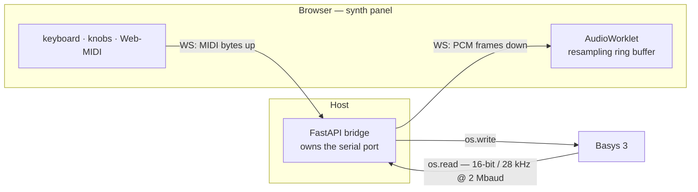

# XLS32 — development history & learnings

The long-form companion to the [README](README.md): how the synth was built, milestone by
milestone, and the hard-won friction logs & learnings from the XLS / F4PGA / Basys 3 toolchain.

**How to read this doc.** Two parts, two purposes:
- **[Development history](#development-history-milestones)** — the build in chronological
  order. The [roadmap table](#milestone-roadmap) is the skim index; each milestone opens with
  a one-line **What changed** summary, so you can scan the arc and dive in only where you need
  the detail.
- **[Friction logs & learnings](#friction-logs--learnings)** — the reusable, toolchain-level
  lessons. **Read these before extending the synth or porting the toolchain** — the first one
  ([Integrating Basys 3 + F4PGA + XLS](#integrating-basys-3--f4pga--xls-the-frictions)) caps
  what you can build.

**Where the Tiliqua history went.** M21–M29 were the ECP5 port and now live in
[DEVELOPMENT_tiliqua.md](DEVELOPMENT_tiliqua.md), with their own roadmap table and friction logs.
This file keeps everything shared or Basys 3: M1–M20, **M28a** (a host decoder bug that affected
both boards), **the PART chips** investigation and **M31**. The two chronologies interleave, so the
milestone sections below link across at each jump.

**Contents**

- [Development history (milestones)](#development-history-milestones)
  - [Milestone roadmap](#milestone-roadmap)
  - [M1 — single-voice DDS sine + ADSR](#milestone-1--single-voice-dds-sine--adsr-done-hardware-verified)
  - [M2 — polyphony](#milestone-2--polyphony-done)
  - [M3 — MIDI input](#milestone-3--midi-input-done)
  - [M4 — hi-fi + expressive voice](#milestone-4--hi-fi--expressive-voice-done)
  - [M5 — 32-voice polyphony](#milestone-5--32-voice-polyphony-done)
  - [M6 — resonant filter + LFO](#milestone-6--resonant-filter--lfo-done)
  - [M6a — pipelined voice engine](#milestone-6a--pipelined-voice-engine-hi-fi-restored-done-hardware-verified)
  - [M6b — per-voice resonant filter](#milestone-6b--per-voice-resonant-filter-done-hardware-verified)
  - [M9 — noise + multimode filter + sub-osc](#milestone-9--noise--multimode-filter--sub-osc-done-hardware-verified)
  - [M10 — fat oscillators (PWM + detuned dual osc)](#milestone-10--fat-oscillators-pwm--detuned-dual-osc-done-hardware-verified)
  - [M11 — pitch expression (vibrato · bend · portamento)](#milestone-11--pitch-expression-vibrato--pitch-bend--portamento-done-hardware-verified)
  - [M13 — effects: chorus + delay](#milestone-13--effects-chorus--delay-via-block-ram-done-hardware-verified)
  - [M14 — reverb](#milestone-14--reverb-done-hardware-verified)
  - [M15 — unison](#milestone-15--unison-done-hardware-verified)
  - [Web UI — a browser synth panel](#web-ui--a-browser-synth-panel-done-hardware-verified)
  - [Standalone LED "comet"](#standalone-led-comet--per-voice-envelope-on-the-16-board-leds-done-hardware-verified)
  - [Stereo effects — mono dry, decorrelated wet](#stereo-effects--mono-dry-decorrelated-wet-done-hardware-verified)
  - [M19 — cross-oscillator FM / ring-mod](#milestone-19--cross-oscillator-fm--ring-mod-built)
  - [Preset browser & AI-matched preset banks](#preset-browser--ai-matched-preset-banks-inverse-synthesis)
  - [M7 + M8 — hardware I/O (DIN MIDI + I2S DAC)](#milestone-7--8--hardware-io-din-midi-in--i2s-dac-out-built-hardware-pending)
  - [M20 — one synth, two boards](#milestone-20--one-synth-two-boards-done-hardware-verified)
  - [M21–M27 — the Tiliqua port](#milestones-2127--the-tiliqua-port) → [DEVELOPMENT_tiliqua.md](DEVELOPMENT_tiliqua.md)
  - [M28a — the rails were a host decoder bug](#m28a--the-rails-were-a-host-decoder-bug-frame_align-locked-byte-alignment-once)
  - [M28–M29 — the Eurorack jacks, and the screen](#milestones-2829--the-eurorack-jacks-and-the-screen) → [DEVELOPMENT_tiliqua.md](DEVELOPMENT_tiliqua.md)
  - [The PART chips and the MIDI keyboard](#the-part-chips-and-the-midi-keyboard--four-bugs-wearing-one-costume)
  - [M31 — deleting the Python hop](#milestone-31--deleting-the-python-hop)
- [Friction logs & learnings](#friction-logs--learnings)
  - [Integrating Basys 3 + F4PGA + XLS](#integrating-basys-3--f4pga--xls-the-frictions)
  - [FPGA resource usage](#fpga-resource-usage-f4pga-vs-vivado)
  - [Backends for DSP48/BRAM (openXC7 vs Vivado)](#backends-for-dsp48bram-openxc7-nextpnr-vs-vivado--the-migration-learnings)
  - [Unlocking DSP48 & MMCM/PLL](#unlocking-dsp48--mmcmpll-backend-upgrade-path)
  - [XLS / DSLX](#xls--dslx)
  - [Headless verification over USB](#headless-verification-over-usb)
  - [Verify sound with a spectrogram](#verify-sound-with-a-spectrogram-not-just-an-fft-peak)
  - [Docker on macOS](#docker-on-macos)

---

# Development history (milestones)

The synth was built in verifiable increments, each checked over USB before moving on. The
roadmap table is the index; the sections that follow are in chronological build order
(M1 → M6b → the M9–M15 analog-feature push → the Web UI).

## Milestone roadmap

| # | Milestone | Verify remotely by |
|---|-----------|--------------------|
| **1 ✅** | Single-voice DDS sine + ADSR, auto-gated, streamed over UART | UART dump: ~440 Hz sine, amplitude follows the ADSR |
| **2 ✅** | Polyphony: 4 voices, auto-gated chord, sum/scale | **FFT of the UART dump shows 4 simultaneous chord peaks** |
| **3 ✅** | UART RX + MIDI parser + voice allocation | **host sends MIDI note-ons over USB; FFT confirms the pitches** |
| **4 ✅** | Hi-fi (16-bit / 32 kHz / 1 Mbaud) + velocity + waveforms | **FFT: right pitch + waveform harmonic signatures; richer WAV/MP4** |
| **5 ✅** | 32-voice polyphony (serialized mixer, /5 clock-enable) | **FFT shows 12 simultaneous pitches; hardware clean** |
| **6 ✅** | Master resonant low-pass filter (SVF) + LFO, MIDI-CC (low-fi /10) | **spectrogram shows harmonics roll off + a cutoff sweep** |
| **6a ✅** | Redesign → time-multiplexed **pipelined voice engine**, hi-fi 32 kHz restored | **FFT 4/4 chord + clean spectrogram on hardware** |
| **6b ✅** | **Per-voice** resonant filter + key-tracking (CC74/CC71), effective /3 clock | **spectrogram: cutoff sweep + rolloff steps up with pitch** |
| **7 ◐** | ⭐ Real **MIDI-DIN input** (31250 baud, DIN + optocoupler) | RTL built + timing-closed; iverilog TB; **hardware pending** (parts on order) |
| **8 ◐** | ⭐ **I2S DAC output** (UDA1334A → line-out) | RTL built + timing-closed; iverilog TB; **hardware pending** (parts on order) |
| **9 ✅** | ⭐ Quick wins: **noise**, multimode filter, sub-osc | **noise broadband; HP mode; sub +1322× octave-down** |
| **10 ✅** | ⭐ Fat oscillators: **PWM** + **detuned dual osc** | **PWM: 50%%=odd-only; detune: 2nd peak +13c, beats** |
| **11 ✅** | ⭐ Pitch expression: **vibrato**, **portamento**, **bend** | **vibrato sidebands; bend +-2st; glide 110->440** |
| 12 ◐ | Mod polish: **tremolo ✅**, LFO shapes, exp. envelopes | tremolo pulses the amplitude |
| **13 ✅** | ⭐ **Effects**: chorus + delay (BRAM delay line) | **echo decays cleanly; chorus comb-sweep; 8x RAMB36E1** |
| **14 ✅** | ⭐ **reverb** (Schroeder, BRAM) + cathedral/room size | **diffuse decay tail; room→cathedral RT60** |
| **15 ✅** | ⭐ **unison** (voice-stacking, detune + phase-decorrelation) | **thick super-saw; beating 2%→37% as voices stack** |
| **Web UI ✅** | Browser **synth panel** (live MIDI in + audio out + ADSR over CC) | **RMS rises on note; slow-attack pad vs fast bass audible** |
| 16+ | 24 dB filter / self-osc / drive (cascade a 2nd SVF pole + saturation), **ring/FM ✅ (M19)**, osc sync, exp. envelopes, LFO shapes, aftertouch / mod matrix | — |
| **20 ✅** | **Two boards, one synth**: `core/` + `boards/` split, transport seam ([the port history](DEVELOPMENT_tiliqua.md)) | **A/B against the pre-move commit on the same board: 98.4 → 98.6, 152/175 bit-identical, same 3 pre-existing FAILs** |
| **21–29** | **The Tiliqua port**: ECP5 feasibility gate, 18×18 arithmetic, first sound, TRS MIDI, the UAC2 verification loop, the effects, the preset re-fit, the Eurorack jacks, the screen | Its own roadmap table, in [DEVELOPMENT_tiliqua.md](DEVELOPMENT_tiliqua.md#milestone-roadmap) |
| **28a ✅** | **The rails were a host decoder bug**: `frame_align()` in `host/transport/uart.py` picked one byte offset from the first 8000 bytes and kept it for a 166 kB capture | **the presets never railed.** Both boards re-graded after the fix; the Tiliqua verdicts were unmoved, which is what proved the fix reached only the board that needed it |
| **PART ✅** | **The PART chips and a MIDI keyboard**: four independent bugs wearing one costume — three in the browser and the host, one that could only be fixed in gateware (CC103, sniffed off the USB stream) | a hardware keyboard follows the PART buttons; `check_midi.py` unchanged, and the remap costs +369 TRELLIS_COMB (still unexplained) |
| **31 ✅** | **Deleting the Python hop**: `webui/server.py` removed — the page reaches the board itself with Web MIDI, `getUserMedia` on the Tiliqua UAC2 input, and Web Serial at 2 Mbaud on the Basys 3 | `python3 -m http.server -d webui/static` plays both boards with no Python process anywhere |
| **BOARDS ◐** | **Four boards, one panel**: 16 parts / 128 voices from four USB cables and the *same* bitstream — the panel routes part `p` to board `p >> 2`, channel `p & 3`, and sums the four UAC2 streams | `webui/route_check.html`: 26 checks, including the single-board stream hashed byte-for-byte against a recording made before the change. One board passes on hardware, TRS jack included — a real keyboard on the jack, one part muted so the claim is audible as well as asserted; `webui/audio_check.html` counts dropouts per stream and is **waiting on four boards** |

> Milestones 9+ close the gap to a **typical analog synth**; each milestone section below opens
> with its analog-feature **priority** (impact × ease, ⭐ = priority pick). They interleave freely
> with M7/M8 (which are I/O, not sound design).

> **Architecture note (M6a onward):** milestones 1–6 used one combinational
> `tick(St)->Out` registered by a Verilog shell. M6 added a *master* filter but
> forced the clock to /10 (10 kHz, low-fi) and can't give each voice its own filter.
> M6a rewrites the core as a **time-multiplexed pipelined voice engine** (XLS *proc*
> + `--generator=pipeline`): all 32 voices flow through one deep datapath, one voice
> per engine cycle — the prerequisite for per-voice filtering (M6b). See the M6a
> section and *"Integrating Basys 3 + F4PGA + XLS"* below for why this lands at an
> effective **50 MHz**, not 100 MHz.

## Milestone 1 — single-voice DDS sine + ADSR (done, hardware-verified)

**What changed:** First sound — one voice (DDS sine + linear ADSR, auto-gated), streamed
8-bit/4 kHz over UART and verified from afar.

The de-risking MVP: prove the oscillator + envelope produce a correct waveform on
real silicon, using only the pipeline we already have.

- **DSLX**: one combinational `tick(St) -> Out` — DDS phase accumulator + 256-entry
  sine LUT, a linear **ADSR** envelope, an **auto-gate** timer (note on ~0.4 s /
  off ~0.4 s), and inline **UART TX** that sends the current 8-bit sample once per
  sample tick. Baud/sample dividers are parametric so a `tick_sim` variant
  simulates fast.
- **Sample rate 4 kHz**, note **A4 = 440 Hz** (so a 115200-baud, 1-byte-per-sample
  UART dump captures the waveform without [aliasing](https://en.wikipedia.org/wiki/Aliasing): ~9 samples/period).
- **Verify**: `read_uart.py` collects the 8-bit sample stream; the analyzer
  confirms (a) the sine period ≈ 9 samples and (b) the amplitude envelope rises
  (attack/decay) and falls (release) in lock-step with the auto-gate.
- LEDs show the live envelope level.

Real audio (higher sample rate + PWM) comes in later milestones; milestone 1
keeps the sample rate UART-friendly so the whole thing is checkable from afar.

### Milestone 1 result (verified on hardware, headless)
```
done 1
20173 samples in 5.0s (4035/s)          # ~4 kHz sample rate
sine period median = 9.0 samples        # ~448 Hz ≈ A4 440 Hz
envelope peak-to-peak: max=246, min=0   # ADSR cycles with the auto-gate
PASS
```
DSLX tests 8/8, iverilog sim PASS, hardware PASS. (Build/verify/listen commands are in the
[Builder's guide](README.md#3-builders-guide).) Listening to a 6 s capture (`record_wav.py` → `afplay`)
gives a pulsing **A4 (~440 Hz)** tone with the ADSR envelope (~7 note cycles in 6 s). It's
telephone-grade (8-bit / 4 kHz) by design — hi-fi audio (16-bit / higher rate via PWM) is
milestone 5. A sample capture was uploaded to Google Drive via `gws drive files create --upload`.

## Milestone 2 — polyphony (done)

**What changed:** 1 voice → 4 (`Voice[4]`), summed and scaled to play an Amaj7 chord;
verified by DFT peaks in the UART capture.

Four voices (`Voice[4]`), each its own DDS phase accumulator + ADSR; a shared
auto-gate triggers/releases an **Amaj7 chord** (A4 440 / C#5 554 / E5 659 /
G#5 831 Hz); `mix` sums the voices and scales by 1/4 to avoid clipping. It's a
small evolution of milestone 1 — a DSLX `for`-loop over the voice array
(`advance_voices`) and a `for`-fold for the mix.

Verified by running a **DFT over the captured UART stream** (`analyze_fft.py`) and
confirming multiple simultaneous peaks — one pitch is milestone 1, four pitches is
polyphony:
```
detected peaks (Hz): [440, 554, 660, 830]
A4/C#5/E5/G#5 all FOUND — PASS: 4/4 chord tones, 4 simultaneous peaks
```
DSLX tests 7/7, iverilog sim PASS (4 peaks), **hardware PASS (4 peaks)**. Chord
audio (`record_wav.py` → `chord.wav`) uploaded to Drive as an MP4.

**Frictions & lessons.**

- One pitch vs many is invisible in the raw byte dump but obvious in the
  frequency domain: a **DFT over the UART capture** (`analyze_fft.py`, pure
  stdlib) shows one peak for a single voice, N peaks for a chord.

## Milestone 3 — MIDI input (done)

**What changed:** Real MIDI in — a UART receiver + MIDI parser + voice allocation replace
the hardcoded chord; the host plays notes over USB and FFT-verifies the pitches.

`tick(St, rx)` gained a **UART receiver** (host → FPGA on `RsRx`/B18, 115200), a
**MIDI parser** (0x9n note-on / 0x8n note-off, running status), and **voice
allocation** (claim the first free voice; release by note number). Per-voice pitch
comes from a `NOTE_INC[128]` LUT. The hardcoded chord is gone — notes now come
from real MIDI bytes. Audio still streams out `RsTx` for verification (full duplex
on the one [FT2232](https://en.wikipedia.org/wiki/FTDI) channel-B port).

End-to-end, verified remotely: the host writes MIDI note-ons to the serial port,
reads the audio back, and FFTs it (`play.py`):
```
$ uv run host/play.py 60 64 67        # C major
detected peaks (Hz): [262, 330, 392] — 3/3 notes heard — PASS
```
DSLX tests 5/5, iverilog sim PASS (bit-banged MIDI → 4 chord peaks), **hardware
PASS** for Amaj7, C-major, and single notes. A MIDI-driven melody demo
(`demo.py`) was recorded and uploaded to Drive.

**Frictions & lessons.**

- **Baud countdown off-by-one:** counting `div` from `N` down to `0` is `N+1`
  cycles. Using `BAUD_DIV` (not `BAUD_DIV-1`) drifted the sample point 1 clock per
  bit — byte 1 decoded, byte 2 walked off the bit. Use `BAUD_DIV-1` between bits
  and `BAUD_DIV + BAUD_DIV/2 - 1` from the start edge to bit-0 centre.
- **False start bit from data MSB:** MIDI data bytes are `< 0x80` (bit7 = 0). If
  the RX goes idle *during* bit 7, that lingering 0 instantly looks like the next
  start bit and corrupts everything. Hold `rx_active` through the stop bit before
  re-arming.
- **Host-side flush:** an `os.write()` immediately followed by `os.close()`
  truncates — the last MIDI note-off was lost and a voice hung forever. `tcdrain()`
  + a short sleep before close.
- **Analyzer floor, not a synth bug:** a "missing" note (C4 261.6 Hz) was just
  below the FFT scan's 300 Hz floor. Widened to 200 Hz.

## Milestone 4 — hi-fi + expressive voice (done)

**What changed:** 16-bit/32 kHz audio over a 1 Mbaud UART, velocity→amplitude, and
CC70-selectable waveforms (sine/saw/square/triangle).

Upgraded for sound quality and musicality, all still verified over USB:
- **16-bit samples at 32 kHz**, streamed over a **1 Mbaud** UART (2 bytes/sample).
  At 32 kHz no MIDI note aliases ([Nyquist](https://en.wikipedia.org/wiki/Nyquist_frequency) 16 kHz), and 16-bit kills the 8-bit hiss.
- **Velocity → amplitude** (the velocity byte we already parsed now scales the mix).
- **Selectable waveform** — sine / saw / square / triangle, chosen by MIDI CC
  (`0xBn`, controller 70). `voice_wave()` derives each from the phase accumulator.

Verified on hardware: pitches correct (`play.py`), and the **waveforms confirmed by
their spectra** — saw = full harmonic series (440/880/1320/1760), square = odd
harmonics only (440/1320), sine = fundamental only. DSLX tests 6/6, sim PASS,
hardware PASS. Hi-fi demo (saw scale + sine chord) uploaded to Drive.

```bash
uv run host/play.py --wave saw 69    # A4 sawtooth, FFT shows the harmonic stack
uv run host/demos/demo.py demo.wav && scripts/make_mp4.sh demo.wav   # record + spectrogram video
```

**Frictions & lessons.**

- **Bandwidth sets the ceiling:** 115200 baud = ~11.5 kB/s, so 8-bit maxes ~11 kHz.
  16-bit @ 32 kHz needs 64 kB/s → bumped the UART to **1 Mbaud** (both ends).
- **macOS custom baud:** `termios` only names up to B230400; for 1 Mbaud use the
  `IOSSIOSPEED` ioctl (`0x80045402`) after `tcsetattr` (see `host/transport/uart.py`).
- **16-bit framing without a sync word:** stream lo/hi bytes and **auto-detect the
  byte alignment on the host** — real audio is smooth, a 1-byte-shifted stream is
  noise, so pick the offset with the smaller sample-to-sample delta.
- **Retime the envelope with the sample rate:** ADSR increments are per-sample, so
  going 4 kHz → 32 kHz (8×) means dividing the rates by ~8 to keep the same
  attack/decay/release *times*.
- **Waveforms verify themselves:** a saw shows all harmonics, a square only odd
  ones, a sine only the fundamental — the FFT is an unambiguous timbre check.

## Milestone 5 — 32-voice polyphony (done)

**What changed:** `Voice[4]` → `Voice[32]` with a **serialized** mixer, run at an effective
20 MHz via a ÷5 clock-enable (the design was too slow for 100 MHz).

Bumped `Voice[4]` → `Voice[32]`. The mix is **serialized** (accumulate one voice per
clock over 32 of the 1000 clocks/sample) so it isn't a 32-wide combinational tree.
Even so, the design's critical path is ~41 ns (Fmax ~24 MHz) — too slow for 100 MHz —
so the synth runs at an **effective 20 MHz via a /5 clock-enable** on the state
register (F4PGA forbids a divided clock driving a BUFG, so a clock-enable, not a
divided clock). 16-bit audio at 20 kHz over 1 Mbaud.

Verified on hardware: a 12-note cluster reads back as **12 simultaneous FFT peaks**
(84/112/148/196/262/330/392/523/659/784/1047/1319 Hz). Polyphony demo uploaded.

**Frictions & lessons.**

- **Serialize the wide work.** 32 voices × multiply + adder-tree in one clock won't
  meet 100 MHz. With 1000 clocks/sample, accumulate **one voice per clock** — short
  critical path, and it's how you scale voice count.
- **`for`-fold over an array = a deep combinational chain.** `update(vs, i, …)`
  threaded through a 32-iteration fold became a ~32-deep mux chain. `map()` does the
  per-voice update in parallel (depth 1). (The real remaining bottleneck was the
  note-*allocation* folds, `apply_on`/`apply_off` — a priority scan is inherently
  serial.)
- **Measure before flashing.** F4PGA hides VPR's timing report (`symbiflow_route …
  2>&1 > /dev/null`); re-run route and grep `Final critical path delay` / `Fmax`. Ours
  was 41 ns / 24 MHz — a guaranteed glitch at 100 MHz (and indeed the FFT was full of
  spurious peaks until fixed).
- **F4PGA won't let logic drive a BUFG** ("clock net … sources at logic which is not
  allowed"), so you can't just divide the clock. Use a **clock-enable**: the state FF
  captures every 5th cycle, giving the combinational block 50 ns to settle. VPR still
  analyzes the 100 MHz source and warns, but the FF only latches every 50 ns, so the
  hardware is correct.

## Milestone 6 — resonant filter + LFO (done)

**What changed:** A master resonant SVF + cutoff-modulating LFO on the mixed output (MIDI-CC
controlled) — at the cost of a ÷10 low-fi clock. A dead end that M6a/M6b supersede.

A master **resonant low-pass filter** (Chamberlin state-variable, Q13 fixed-point)
on the mixed output, with an **LFO** that modulates the cutoff (auto-wah). All
controlled by MIDI CC: **CC74 cutoff, CC71 resonance, CC76 LFO rate, CC77 LFO
depth** (CC70 still selects the waveform). Verified by spectrogram: a sawtooth's
harmonics roll off above the cutoff with a resonant peak, and a cutoff sweep moves
that edge up and down.

To fit the filter's feedback multiplies the synth clock drops to **/10 = 10 MHz
(10 kHz audio)** — low-fi, but the filter effect is the point. Filter/LFO demo
(`demo.py`) uploaded to Drive.

**Frictions & lessons.**

- **Chamberlin SVF** (`low += f*band; high = in-low-q*band; band += f*high`) is the
  easy fixed-point resonant filter; coefficients in Q13. Cutoff `f` and damping `q`
  come from MIDI CC; keep `f` capped (~0.6) and a damping floor so it stays stable.
- **Clamping filter state latches it.** At high resonance the state grows ~Q×input
  and hits the clamp rails, where it sticks (silence) and never recovers — note-on
  doesn't reset filter state. Fix: **attenuate the filter input ~4×** (scale the
  output back up) so the resonant state has headroom and never reaches the rails.
  Dynamic cutoff sweeps tolerate less resonance than static settings.
- **Narrow the multipliers.** `s64` mults blew timing (76 ns); the filter's chained
  feedback mults are the critical path, so the synth runs at **/10 (10 MHz)**.
- **Host gotcha:** `tcflush(TCIFLUSH)` mid-capture silently dropped the stream —
  don't flush once audio is flowing.

## Milestone 6a — pipelined voice engine, hi-fi restored (done, hardware-verified)

**What changed:** The core is rewritten as a time-multiplexed **pipelined proc** (one voice
per cycle) — the prerequisite for per-voice filtering — with hi-fi 32 kHz restored. Runs at an
effective 50 MHz (÷2 clock-enable).

The master filter (M6) is a dead end for *per-voice* filtering, and its /10 clock
threw away the hi-fi. M6a rewrites the core as a **time-multiplexed pipelined voice
engine** so every voice can later get its own filter (M6b) at full sample rate.

- **`engine` proc** (`--generator=pipeline`): recurrent state is `Voice[32]` + a
  mix accumulator + the MIDI parser. One voice is processed per engine cycle; a
  sample is emitted every 32 cycles. MIDI in / audio out are ready/valid **channels**
  the Verilog shell drives (`_midi_in`, `_audio_out`).
- **Rotate-ring voice storage.** The old dynamic `voices[vidx]` read is a 32:1 mux
  over 189-bit voices — 6,048 input bits (~21 ns). Instead the ring is **rotated**
  so the current voice is always at slot 0 → constant-index read/write, no
  dynamic mux. `apply_on`/`apply_off` keep their constant-index (unrolled) scans.
- **Hi-fi restored:** 16-bit / **32 kHz** again, pristine 256-point sine.

Verified on the board: `play.py` reads **4/4 chord tones** over UART and the
**spectrogram is clean** (stable bands, no haze/dropouts/clipping — `docs/assets/m6a_spectrogram.png`).

**It runs at an effective 50 MHz, not 100 MHz.** F4PGA/VPR floors this design at
~15–19 ns (wide MUXF6 mux trees; **no DSP48, no BRAM inference, no MMCM**). After
fixing the fixable paths (narrow multiplies, octave-shift note LUT), the sine LUT +
mux tree is an irreducible ~15 ns atomic op. So the engine advances every **2nd**
clock via a global **clock-enable** (`ce`, injected by `fix_verilog.py`), giving
every register path a 20 ns budget. See the frictions section for the full story.

```bash
boards/basys3/scripts/build.sh      # or: STAGES=48 WCT=48 boards/basys3/scripts/remote_build.sh  (native x86 host, faster)
openFPGALoader -b basys3 build/top.bit
uv run host/play.py                 # 4/4 chord over UART
uv run host/record_wav.py 3 m6a.wav && scripts/spectro.sh m6a.wav   # clean spectrogram
```

## Milestone 6b — per-voice resonant filter (done, hardware-verified)

**What changed:** Every voice gets its own resonant SVF — with key-tracking and a 2nd (filter)
envelope — filtering its oscillator *before* the mix. Clock drops to an effective ÷3.

The payoff of the M6a rewrite: **every voice now has its own resonant low-pass**,
filtering its oscillator *before* the mix — impossible with the old single master
filter (M6), which could only filter the summed output.

- **Per-voice SVF.** `Voice` gains `flo`/`fbnd` (Chamberlin state-variable filter
  state, Q13). `process_voice` runs the filter per voice with the input attenuated
  4× (anti-latch) and clamped state, so the `f*band`/`q*band` products stay ~13×18
  **narrow** soft-multipliers (no DSP48 in F4PGA — same discipline as the amp mult).
- **Per-voice cutoff** = **CC74** base + **key-tracking** (`note*16`, higher notes
  brighter) + a per-voice **filter envelope** (a 2nd ADSR → per-note "pluck",
  depth **CC79**) + a global **LFO** (auto-wah, **CC76** rate / **CC77** depth).
  **CC71** sets resonance. Every term but the LFO is per-voice.
- **Clock:** the filter deepens the path to ~22 ns (over the /2 budget), so the
  engine drops to an effective **/3 (~33 MHz, 30 ns budget)**. Throughput is fine —
  the actual initiation interval is far below the `worst_case_throughput` cap, so 32
  voices still finish well inside 3125 clocks/sample.

Verified on the board five ways:
- **Static:** CC74=10 rolls off the highs, CC74=127 passes the full harmonic stack.
- **Cutoff sweep** (`filter_demo.py`): the bright filter edge sweeps upward,
  revealing the sawtooth harmonics — `docs/assets/m6b_filter_sweep.png`.
- **Key-tracking:** ascending octave saws at a *fixed* CC show the rolloff edge
  stepping **up** with pitch — `docs/assets/m6b_keytracking.png`.
- **Filter envelope:** repeated notes each show a bright attack decaying to a darker
  sustain (a pluck); **LFO:** a held note shows the cutoff wobbling — `docs/assets/m6b_modulation.png`.

```bash
uv run host/filter_demo.py sweep.wav 45 90 && scripts/spectro.sh sweep.wav   # cutoff sweep
uv run host/demos/demo_m6b.py demo.wav && scripts/make_mp4.sh demo.wav       # full showcase
```

## Milestone 9 — noise + multimode filter + sub-osc (done, hardware-verified)

**What changed:** Three cheap analog staples — LFSR **noise**, **multimode** filter
(LP/HP/BP/notch), and a **sub-oscillator** an octave down.

*Analog-feature priority: ⭐ quick wins — noise (impact High · ease ★★★★★), multimode filter (Med · ★★★★★), sub-osc (Med · ★★★★). Cheap, immediate new timbres.*

Three cheap analog-staple additions, all verified on the board:
- **Noise source** — a 16-bit Galois **[LFSR](https://en.wikipedia.org/wiki/Linear-feedback_shift_register)** (taps `0xB400`), exposed as waveform 4
  (CC70). Broadband spectrum, essential for percussion/effects.
- **Multimode filter** — the SVF already computes low/high/band, so `svf()` now returns
  all of them and **CC72** selects **LP / HP / BP / notch**. HP verified: the
  fundamental is attenuated ~380× while highs pass.
- **Sub-oscillator** — a square one octave below, mixed in via **CC73** (shift-based
  level). Verified: +1322× energy an octave below the played note.

Implementation note (F4PGA packing): the first cut used a 32-bit-per-voice 2nd phase
accumulator for the sub and a multiply for its level — that extra ring state + soft-
multiply **overflowed VPR's SLICE packer** (`top.net` Error 1). Fixed by deriving the
sub from a **1-bit toggle** on phase-wrap and a **shift-based** level (no new
multiply). Lesson: on F4PGA, watch total soft-multiplier count and ring-state width,
not just the critical path. Path 22.5 ns, within the ÷3 30 ns budget.

## Milestone 10 — fat oscillators: PWM + detuned dual osc (done, hardware-verified)

**What changed:** Analog thickness — variable-width **PWM** pulse and a **detuned 2nd
oscillator** on its own accumulator (beating/fatness).

*Analog-feature priority: ⭐ fat oscillators — PWM (impact High · ease ★★★★), detuned dual osc (V.High · ★★★); the signature analog thickness — the biggest single upgrade.*

- **PWM** — the square (wave 2) is now a variable-width **pulse**: high while
  `phase[24:32] < pw`. Width = **CC75** base + an LFO wobble (reuses `lfo_mod`, no new
  multiply). Verified: at 50 % the 2nd harmonic is 0 (odd-only); narrowing brings in
  even harmonics.
- **Detuned dual oscillator** — a 2nd oscillator (detuned **saw**) on its own
  accumulator `ph2 += inc + inc>>k` (constant-cents detune, **CC78**: off/~3/~7/~13 c).
  Verified: adds a 2nd spectral peak at ~1.008× the fundamental → beating / fatness.

Two F4PGA-packing lessons (both surfaced as `top.net` Error 1):
- A 2nd oscillator **must have its own accumulator** to beat — `phase + (phase>>k)`
  fails because `phase` wraps every period, resetting the relationship.
- A per-voice 32-bit accumulator (+1024 b of ring state) **overflows VPR's packer**
  (same failure as the M9 sub-osc). Fix: **stop storing `inc`** per voice and
  recompute `note_inc(note)` each cycle → net-zero ring width. On F4PGA, ring-state
  width and soft-multiplier count are the packing budget, not just the critical path.

MIDI CC map so far: 70 wave(0–4) · 71 reso · 72 filter-mode · 73 sub-level ·
74 cutoff · 75 pulse-width · 76 LFO rate · 77 LFO depth · 78 detune · 79 filter-env depth.

> **Limitation — aliasing.** The oscillators are naive (no band-limiting/BLEP), so raw
> saw/pulse alias at 32 kHz — worst on narrow pulses and wide detune with the filter
> open. In practice you play through the low-pass (that's what it's for), which rolls
> off the aliased highs; demos must use a moderate cutoff or they sound gritty. A
> band-limited oscillator would be a future milestone.

## Milestone 11 — pitch expression: vibrato + pitch bend + portamento (done, hardware-verified)

**What changed:** Three pitch modulators — **vibrato** (mod wheel), **pitch bend** (±2 st),
and **portamento**/glide — all folded into the oscillator increment.

*Analog-feature priority: ⭐ pitch expression — vibrato (impact High · ease ★★★), portamento (High · ★★★), pitch bend (Med · ★★★★).*

All three modulate the oscillator increment; the shared trick is `inc*(1+pmod/4096)`
done as `inc + (inc>>12)*pmod` (a ~19×10 multiply — no 32×32 / u64 overflow).
- **Vibrato** (CC1 mod wheel) — the global LFO drives `pmod` via a shift-based depth
  (no new multiply). Verified: mod wheel spreads a 440 Hz tone into sidebands.
- **Pitch bend** (0xE0 message) — 14-bit, ±2 semitones, folded into `pmod`. Verified:
  ±full → ±~2 st.
- **Portamento** (CC5) — per-voice glided increment `cinc` (stored as `inc>>6`, u26)
  slews toward the note target: `cinc += (tgt-cinc)>>k` (no multiply); a new note glides
  from its voice's previous pitch. Verified: a note glides ~110→440 Hz over ~300 ms.

Packing note: `cinc` (+26 b/voice) was afforded by **narrowing the filter state
flo/fbnd from s32 to s19** (they only hold the SVF clamp, ±131072) → net-zero ring
width. Testing note: **engine state persists across UART sessions** — reflash for a
deterministic voice-allocation/`cinc` when verifying the glide.

MIDI CC map: 1 vibrato · 5 portamento · 70 wave(0–4) · 71 reso · 72 filter-mode ·
73 sub · 74 cutoff · 75 pulse-width · 76 LFO rate · 77 LFO depth · 78 detune ·
79 filter-env; **0xE0** pitch bend.

## Milestone 13 — effects: chorus + delay via block RAM (done, hardware-verified)

**What changed:** First use of **block RAM** — a 16K×16 circular delay line in the Verilog
shell drives **chorus** and **echo/delay**.

*Analog-feature priority: ⭐ effects — chorus (impact V.High · ease ★★), delay/echo (High · ★★); the BRAM delay-line experiment (also proves out RAM for future work).*

The first use of **block RAM** on this design — and it works. A 16K×16-bit circular
delay buffer lives in the **Verilog shell** (`top.v`), downstream of the engine, with
**synchronous read + write** → F4PGA infers **8× RAMB36E1**. (The engine's sine ROM
never mapped to BRAM because XLS emits *async* reads; a sync-read RAM is the pattern
yosys/VPR actually maps.) Two taps per sample: a long fixed tap (**echo**, 250 ms + 0.5
feedback) and a short LFO-swept tap (**chorus**, ~9–17 ms). **CC83** selects
dry / chorus / echo / both (sniffed in the shell, which sees the MIDI stream).
*Superseded:* CC83 was retired when each effect got its own depth knob — an effect is on iff its
depth is nonzero (CC94 chorus / CC95 echo / CC93 reverb). M27 rewrote the last callers.

Verified on board: echo decays cleanly (repeats halving every 250 ms, 0 glitches),
chorus shows the classic moving comb notches, dry/silence clean.

Three things this milestone taught (all cost a build):
- **BRAM is usable** on F4PGA — via a *sync-read* RAM, unlike the async ROM.
- Chorus tipped VPR's packer (**`rst` high-fanout net**). `--reset_data_path=false`
  packs but **rails the output** (un-reset state) — don't. The clean fix is **fewer
  pipeline stages** (48→40 → fewer reset FFs → less `rst` fanout), still ÷3 at 20.4 ns.
- An **uninitialized BRAM seeds a feedback loop** (echo railed): **clear the buffer**
  (sweep-write 0) at reset.

MIDI CC map: 1 vibrato · 5 portamento · 70 wave · 71 reso · 72 filter-mode · 73 sub ·
74 cutoff · 75 pulse-width · 76 LFO rate · 77 LFO depth · 78 detune · 79 filter-env ·
80 unison (off/2v/3v/4v) · 83 effect (dry/chorus/echo/both/**reverb**) ·
91 reverb room size (room/hall/large/**cathedral**) · 92 tremolo; 0xE0 pitch bend.

## Milestone 14 — reverb (done, hardware-verified)

**What changed:** A **Schroeder/Freeverb reverb** (4 feedback combs + 2 all-pass) with
room→cathedral size, in the shell's BRAM; the multiply-heavy feedback drops the clock to ÷4.

*Analog-feature priority: reverb (impact High · ease ★ — the hardest: multiply-heavy comb feedback).*

*Superseded twice over: the tank is 8 combs + 4 all-pass now, gated on the CC93 wet level rather
than selected as a mode. What follows is the M14 shape.*

A **Schroeder reverb** as effect mode 4 (CC83): **4 parallel feedback comb filters**
(delays 810/878/940/1012 samples, [Freeverb](https://ccrma.stanford.edu/~jos/pasp/Freeverb.html) tuning) summed, then **2 series all-pass
diffusers** (348/116, g=0.5). All six delay lines live in their own regions of the
shared 16K delay BRAM (still 8× RAMB36E1); the shell FSM does one BRAM read+write per
cycle across ~10 states per audio sample. The reset buffer-clear (M13) keeps the comb
feedback from railing on power-up garbage.


**Room size (CC91):** each comb's feedback `g` is a real Q15 multiply, selected by room
size — `room` 0.671 (~0.4 s) · `hall` 0.793 · `large` 0.885 · `cathedral` 0.952 (~3.5 s
RT60). Input is a fixed `/8` gain (Freeverb-style) for all sizes, so the wet level stays
constant and bigger rooms ring *longer*, not quieter. A light `0.5` damping (a 1-pole
average in the feedback) rolls off highs for a natural tail.

Getting the long tail clean took several fixed-point lessons — all reproduced in a
Python sim (`/tmp/combsim.py` pattern) before committing each build:
- **Damping must be `(old+new)/2`, not `0.875·old+0.125·new`.** A small-step damping
  shift (`>>3`) both crushed the audio band (→ short tail *regardless* of `g`) and could
  push `curdlp + Δ` past ±32767 and **wrap** the 16-bit state → sign flip → runaway
  feedback. Averaging (`>>1`) is inherently overflow-safe (result always between its two
  operands) *and* preserves the band.
- **Matched input attenuation `1/(1−g)` was the wrong idea** — it makes cathedral's input
  32× smaller, so at non-resonant frequencies the tail is inaudible. A *fixed* small
  input (Freeverb) is correct.
- **A sustained sine is the worst reverb test signal** (settles near a comb anti-resonance
  → looks broken). Reverb needs a broadband transient; the demo uses plucks/chords.

The multiply pushed the effect path to ~37 ns, so the engine clock-enable dropped from
÷3 to **÷4 (40 ns budget)** — throughput is unaffected (II ≪ budget). Verified on board:
0 glitches, a smooth decay that **audibly lengthens room→cathedral**, no railing.

## Milestone 15 — unison (done, hardware-verified)

**What changed:** **Voice-stacking** unison (2/3/4 voices per note) with fixed detune + phase
decorrelation for a thick super-saw; max polyphony becomes 32/N.

*Analog-feature priority: ⭐ unison (impact Med · ease ★★★).*

**Voice-stacking** unison (CC80): a note-on grabs **N of the 32 physical voices** instead
of one (`off / 2 / 3 / 4`), each detuned and phase-decorrelated, for a thick "super-saw".
This reuses the whole per-voice datapath (filter, envelope, sub) and — since `apply_off`
already releases *every* voice whose stored `note` matches — note-off is free. Trade: max
polyphony becomes 32/N.

Two design points (the question that kicked this off — "do we need random detune?"):
- **No random detune.** Each stacked voice gets a *fixed symmetric* slot `2·k−(N−1)`
  ({−1,+1} / {−2,0,+2} / {−3,−1,+1,+3}) applied to its increment (`inc + (inc>>9)·slot`,
  ~3.4 c/unit). Fixed offsets are exactly what create the beating; randomness would only
  make the character inconsistent note-to-note. The spread widens with voice count.
- **Phase decorrelation, yes.** Each stacked voice starts at a distinct phase seeded from
  the noise LFSR. This avoids a coherent N× amplitude spike at the attack (**headroom** —
  a recurring pain point here) and gives instant thickness instead of a slow "bloom".
- **Gain comp ÷√N** (`×{256,181,148,128}/256`): decorrelated voices sum ~√N, so this holds
  single-note loudness constant (measured RMS ~2000 across off→4).

Cost: one small per-voice field (`uni: s4`) + one narrow multiply; packs at STAGES=40,
**34.5 ns (÷4)**. Verified on board: sustained-note **beating grows monotonically** with
voice count (envelope CV 2% → 17.5% → 26.3% → 37.4% for off→2→3→4), spectral peak widens
(0.5 → 2.5 Hz), level stays matched, no railing.

## Web UI — a browser synth panel (done, hardware-verified)

**What changed:** A browser analog-panel front-end that plays the real board live — MIDI in +
audio out over a WebSocket — plus the ADSR-over-CC firmware change it needed.

A browser front-end styled like a classic analog polysynth that plays the real board: it is a live
**MIDI input** (on-screen keyboard, computer keys, or a Web-MIDI hardware controller — all
forwarded to the board in real time) and an **audio output** (the board's 16-bit/28 kHz
UART stream, played through the browser via an AudioWorklet). A **timbre selector** offers
**5 factory presets** (show-off patches) + **5 user presets** (saved in `localStorage`).


```mermaid
flowchart LR
  subgraph BROWSER["Browser — synth panel"]
    IN["keyboard · knobs · Web-MIDI"]
    AW["AudioWorklet<br/>resampling ring buffer"]
  end
  subgraph HOST["Host"]
    BR["FastAPI bridge<br/>owns the serial port"]
  end
  IN -->|"WS: MIDI bytes up"| BR
  BR -->|"os.write"| BOARD["Basys 3"]
  BOARD -->|"os.read — 16-bit / 28 kHz @ 2 Mbaud"| BR
  BR -->|"WS: PCM frames down"| AW
```

- **Bridge** (`webui/server.py`, [FastAPI](https://fastapi.tiangolo.com/)): owns the serial port (reuses `transport.uart.open_port`),
  one reader thread drains the FTDI RX buffer, **byte-aligns** the 16-bit stream, and forwards
  the *raw* aligned bytes to every browser over one WebSocket (a per-sample Python decode
  couldn't keep up with the stream and dropped data — the browser decodes instead); MIDI bytes
  from the browser are written straight to the board. Multiple tabs supported. Serve HTTPS
  (needed for Web Audio off-localhost, e.g. over [Tailscale](https://tailscale.com/)) with `SSL_CERT`/`SSL_KEY`; bind
  with `HOST`.
  **Gone since M31** — Chrome grew both halves natively (Web MIDI + UAC2 capture on the Tiliqua,
  Web Serial at 2 Mbaud on the Basys 3), so the page owns the hardware and `webui/server.py` was
  deleted. Everything below still describes the audio path faithfully; only the transport under it
  changed. To run it today: `python3 -m http.server 8765 -d webui/static`.
- **Front-end** (`webui/static/`): a `<canvas>`-free P5 panel (wood cheeks, cream sections,
  black knobs, pitch/mod wheels, keyboard; a version tag in the header). Knobs/switches send
  MIDI CCs; a preset applies a full CC burst so the board matches the UI. The AudioWorklet is
  an **adaptive-resampling ring buffer**: the board streams slightly under real time and the
  rate varies, so the worklet tracks the *measured* arrival rate and resamples to it — smooth
  playback at correct pitch with no under/overruns. `webui/synthspec.py` is the single source
  of truth for the CC map + presets, served at `/api/spec`.

**Browser-audio robustness (hard-won on iOS over Tailscale):**
- **Byte-alignment self-heal.** A single dropped UART byte flips the 16-bit phase for the rest
  of the stream — silence becomes a full-scale **DC**, tones a buzzy **"saw"**. Smoothness alone
  can't spot a flip during silence (both phases look flat), so the server scores each phase by
  smoothness **and** DC-centeredness (real audio sits at 32768) and **re-locks periodically**,
  so a mid-stream drop heals within ~0.1 s.
- **iOS audio session.** Web Audio is silenced by the ringer/silent switch even when the context
  is `running`; playing a looping **silent clip** flips the session to *playback* so output is
  heard. (Routing through a MediaStream element also plays through the switch but iOS distorts it
  with voice-processing — avoid.) The context is **resumed** on any gesture / `statechange`
  (iOS drops it to `interrupted`).
- **Connectivity & diagnostics.** WebSocket **auto-reconnects**; `wss` on HTTPS pages; a header
  **version tag** and a live **debug readout** (`ctx · ws · rx · rms · el`) make field debugging
  possible without a console.
- **Steady pitch.** The board's 28 kHz is crystal-stable, so the resampler estimates the rate
  slowly (heavily smoothed) and trims the step by only **±0.4 %** off a smoothed buffer level —
  no audible wow/flutter, still glitch-free.

**Firmware change it needed — ADSR over MIDI CC (CC20-27):** for an authentic panel the
envelopes had to be knob-controllable, but the amp/filter ADSR were hardcoded consts. The
fix parametrizes `adsr(env, st, att, dec, sus, rel)` and adds **engine-level** state
(`a_att…f_rel`) fed from CC20-23 (amp A/D/S/R) and CC24-27 (filter-env A/D/S/R). A/D/R map a
7-bit CC through a tiny 8-entry LUT to a per-sample increment (~3 ms…2 s, no multiply);
sustain is `cc<<9`. Engine-level (added once, not per-voice) + no new multipliers, so the
`Voice` ring width and the critical path are untouched — it packs and re-flashes unchanged
at ÷4.

Verified end-to-end: over UART the amp-attack CC sweeps the envelope rise cleanly and
monotonically (**CC20 = 0 / 64 / 120 → 4 / 120 / 716 ms** to 50 %), release responds, and
`play.py` still reads a clean 4/4 chord (no timing regression). In the browser (driven by
Chrome DevTools), Power starts audio at `running@32000`, a note raises the measured output
RMS and note-off returns to digital silence, and switching **Cathedral Pad** (slow attack)
vs **Sub Bass** (fast attack) shows the audible amplitude swell of the new ADSR CCs
(early/peak RMS ratio 0.03 vs 1.0).

## Standalone LED "comet" — per-voice envelope on the 16 board LEDs (done, hardware-verified)

**What changed:** The 16 board LEDs become a live voice display — a note advances a "comet"
cursor and each LED's brightness tracks the real per-voice ADSR envelope.

The Basys 3's 16 LEDs are a live voice display: **each new note advances a cursor to the next
LED** (a sliding comet that moves faster the more notes you strike at once), and **each LED's
brightness tracks the real ADSR envelope** of the voice that lit it, so notes swell and fade
behind the moving head. It's driven by the *actual* per-voice envelope, not a shell fake.

- The engine gets one non-blocking `viz_out` channel that streams `{env, is_new, last}` for
  the slot-0 voice every cycle. `is_new` is a **one-shot with no new state** — a freshly
  allocated voice is uniquely `env==0 && env_st==ATTACK` on its first slot-0 visit — so the
  `Voice[32]` ring width, allocation logic, multiplier count, and ÷4 critical path are all
  untouched (35.7 ns, +1.2 ns of fan-out vs before).
- The Verilog shell keeps a small cursor + scan-slot→LED binding table and an 8-bit PWM
  dimmer; the tuple's `last` bit self-aligns the scan index, so no cross-pipeline correlation
  is needed. Demo: `uv run host/demos/demo_leds.py`.

## Stereo effects — mono dry, decorrelated wet (done, hardware-verified)

**What changed:** The mono engine gains a **stereo image** built entirely in the shell —
decorrelated wet (Freeverb spread, ping-pong echo, anti-phase chorus) over a centered dry.

The voice engine stays mono; the **shell effects create the stereo image**. Two per-channel
16K delay buffers (`dmemL`/`dmemR`), and a single arithmetic datapath (one reverb multiply) is
**time-shared L-then-R** by the FSM — so no second multiplier and the ÷4 budget holds
(38.0 ns). Decorrelation: the **Freeverb stereo spread** (R comb/all-pass lengths = L + 23),
**ping-pong echo** (L↔R cross-feed), and **anti-phase chorus** taps. The mono dry sits centered
for a solid phantom center. Audio now leaves as 4-byte interleaved frames (`Llo Lhi Rlo Rhi`)
with a **1-bit channel marker** in each low byte's LSB (L=0, R=1) so the browser locks byte
*and* L/R alignment unambiguously. The web-UI `AudioWorklet` plays two rings sharing one
fractional read position (L/R phase-locked).

## Milestone 19 — cross-oscillator FM / ring-mod (built)

**What changed:** The 2nd oscillator doubles as a **modulator** — **FM** or **ring-mod** — so
the engine can finally *create* inharmonic (bell/metallic) timbres, not just filter them.

*Analog-feature priority: ⭐ FM / ring-mod (impact V.High · ease ★★) — the missing synthesis method.*

The engine was purely **subtractive** — it could shape harmonics but never *create* new ones,
so metallic, bell, and clangorous timbres were out of reach. M19 adds **cross-oscillator
modulation**: the 2nd oscillator (a detune-only saw until now) doubles as a **modulator** that
either phase-modulates (**FM**) or amplitude-multiplies (**ring-mod**) the carrier.

Three new engine CCs (a "Cross-Mod" panel in the web UI): **X-Mod** (CC85: Off / Ring / FM /
FM+), **X-Depth** (CC86), **X-Ratio** (CC87: **8** shift/add ratios — 1 / 1.5 / 2 / 3 / 4 / 5 /
7 / ½).

**F4PGA-aware design** — the friction logs (M9/M10) show that per-voice `u32` accumulators (×32)
overflow VPR's packer, so cross-mod adds **no new per-voice ring state**: it *reuses the existing
`ph2` accumulator* as the modulator (detune and cross-mod are mutually-exclusive uses of the
same register). Modulator:carrier ratios are done with **shifts/adds** on the phase increment
(the eight ratios above — no multiply). The **FM index is a real multiply** — `modsig · depth`,
scaled into the phase — reaching β ≈ 1.5 rad (FM) / π (FM+). Ring is a second multiply
(`main · modsig`). So cross-mod costs **two soft-multiplies**, the thing that had to fit the ÷4
40 ns budget.

> **Strong-FM upgrade.** The first cut used a *shift*-based FM index (`modsig << (depth>>3)`) to
> stay at one multiply — but that tops out at β ≈ 0.1 rad, far too weak to voice bells (measured:
> on-vs-off spectra nearly identical). We proved in the sim that a **multiply-based index +
> fractional ratios** reaches real inharmonic partials (it nails a glockenspiel's 5.3× strike
> tone), so the RTL was upgraded to the strong version. The extra multiply still fits: **`Final
> critical path delay: 39.51 ns`** (vs 39.39 for the shift version — the added multiply cost only
> +0.13 ns; 0.49 ns margin under the 40 ns budget), and it packs. Hardware-verified: sidebands
> grow with depth (1 → 3 → 4 → 7 partials) and X-Ratio reshapes the spectrum, matching the sim;
> X-Mod = Off is a clean single carrier (byte-identical, banks unchanged).

Validated **in the software model first** (`presetgen/engine.py` mirrors the RTL exactly), then
built + timing-checked + flashed + FFT-verified on the board — the full prototype→measure→build
loop.

> **De-latch fix (fixed-point filter robustness).** Strong FM exposed a *latent* hardware bug:
> under **2+ bright polyphonic voices**, the Q13 fixed-point Chamberlin SVF would intermittently
> lock into a **full-scale limit cycle** — audible as noise (rapid polyphonic FM play measured
> **96% of playtime railed**). It wasn't FM-specific (the same patch with X-Mod off railed too),
> just triggered readily by FM's bright, wide-open patches; it's the same instability first seen
> in `presetgen/calibrate.py`. The **sim never showed it — it models the SVF in floating point**,
> so this could only be reproduced and fixed on hardware. Fix: a **leaky integrator** on the SVF
> state (`low -= low>>7`, `band -= band>>6`, ~0.8–1.5 %/sample) that pulls the poles just inside
> the unit circle so any self-oscillation decays instead of latching — inaudible on the frequency
> response. Hardware result: polyphonic FM railing **96% → 0%** (0/16 chord-bursts), normal and
> resonant patches unchanged, critical path **39.01 ns**. Hardens the whole synth, not just FM.

> **Why it's a *playable* feature, not a search target.** We investigated hard whether the
> preset-matcher would *choose* cross-mod for bells, and the answer is a firm no — even with
> strong FM that reaches the target's inharmonic ratios, and even on real NSynth recordings (not
> just the GM SoundFont). The magnitude-STFT loss isn't blind to overtones; it's *too literal* —
> it scores per frequency-bin, so partials a few Hz off draw a double penalty, and its dominant
> terms reward *filling the gross energy curve* (which a rich saw+noise+filter does) over placing
> sparse exact partials. So FM ties, at best, only on the most inharmonic/brightest targets. Like
> every real FM synth, the bell/EP/metallic patches are **voiced by ear** (`make_fm_bank.py`, which
> writes an FM bank the browser will show if it is present), not inverse-synthesized.
>
> **Overturned once the loss changed.** That verdict was a property of the magnitude-STFT loss, and
> the shipped bank is now fitted under **clap+stft** — an embedding distance that does not compare
> bins at all. Re-asked with `presetgen/xmod_probe.py`: on the 10 most metallic targets, a
> same-budget re-fit with cross-mod pinned on beats the cross-mod-off control **6/10** (E-Piano 1
> by 4.87, E-Piano 2 by 4.19, Clavinet by 2.50), and the attack spectral centroid — a metric the
> loss never sees — goes from 0.52 to 0.59 of the target's. See
> [the dull attack](#the-dull-attack-three-fixes-tried-and-the-one-that-worked).

## Preset browser & AI-matched preset banks (inverse synthesis)

**What changed:** A Serum/Vital-style **preset browser** backed by banks built through *inverse
synthesis* — a CMA-ES search over the CC space minimizing a spectrogram loss against real target
sounds, run on a fast software model of the engine.

The web UI has a Serum/Vital-style **preset browser** (Factory/User tabs, a category rail, a
scrollable list, search); `webui/synthspec.py` concatenates every `presets_*.json`, so multiple
source banks can coexist. But the interesting part is *how the factory presets are made* — not by
hand-guessing knob values (which sounds bland), but by **inverse synthesis**: for each named target
sound, search the engine's parameter space to minimize a spectrogram distance to that target.

> **What ships today is one bank of 64.** The tree has produced four (NSynth, GM SoundFont, an
> ear-voiced FM bank, and a Freesound experiment) and the browser is happy to show all of them at
> once, but a browser is judged on how fast you find a sound, not on how many rows it has. The
> NSynth and FM banks are removed from `webui/` (regenerate: `build_presets.py … nsynth`,
> `make_fm_bank.py`), and the SoundFont bank is **halved to 64 by `consolidate.py`** — see
> [Half a bank is a better bank](#half-a-bank-is-a-better-bank).

The pipeline (`presetgen/`):
1. **Software model of the engine** (`engine.py`) — a sample-accurate NumPy/[numba](https://numba.pydata.org/)
   reimplementation of `synth.x` + the shell effects (naive oscillators kept naive so the
   *aliasing* matches), validated against the real DSP. It renders `(CCs, note) → audio` in
   milliseconds, which is what makes a search feasible (the board is far too slow: ~10³–10⁴
   renders per target).
2. **Perceptual loss** (`loss.py`) — a multi-resolution STFT + mel + amplitude-envelope
   distance, RMS-normalized and magnitude-only.
3. **Search** (`search.py`) — [CMA-ES](https://en.wikipedia.org/wiki/CMA-ES) over the 22-dim
   CC space (`params.py`), seeded per category, minimizing the loss against a target render.
   `$SPACE` widens it to 25, 26 or 29 of the engine's 30 CCs — see below.
4. **Targets** — real single-note samples, one *source module* per corpus (all expose the same
   `list_targets()`/`load()` interface): `nsynth.py` (Google's **NSynth** — 128-preset bank,
   loss median 28.5), `soundfont.py` (a **GM soundfont** rendered with [FluidSynth](https://www.fluidsynth.org/)
   — named synth presets at known pitch, median 22.9), and `freesound.py` (**CC0 analog** via
   the Freesound API + the AudioCommons `ac_note_midi` descriptor for pitch). Each becomes its
   own bank/tab in the browser.
5. **Orchestrate** (`build_presets.py <per_cat> <budget> <source>`) → writes
   `webui/presets_<source>.json`; the browser picks it up automatically.

### The loss function (`loss.py`)

A **magnitude-only** distance on **loudness- and pitch-normalized** renders (both `prep()`'d:
resampled to a common 22.05 kHz, RMS-normalized, truncated to equal length; both rendered at
the *same MIDI note* so harmonics align). Three terms sum to one scalar:

```
loss =  Σ over FFT ∈ {256,512,1024,2048}  [ mean|Aₘ−Bₘ|  +  0.5·mean|log Aₘ − log Bₘ| ]   # multi-res STFT
      + 2 · mean|mel-band(A) − mel-band(B)|                                                # perceptual timbre
      + 3 · mean|env(A) − env(B)|                                                          # ADSR shape (10 ms RMS)
```

- **Multi-resolution STFT** (Hann, 75 % overlap): small windows catch transients, large windows
  resolve pitch/harmonics — summing across scales avoids any single window's time-vs-frequency
  bias (the [DDSP](https://magenta.tensorflow.org/ddsp) multi-scale spectral loss). The log term
  adds dB-like sensitivity so quieter harmonics count.
- **Mel/log-frequency bands** weight the overall spectral envelope (timbre), not just bins.
- **Amplitude-envelope** term (highest weight) matches attack/decay/sustain over time, so a pad
  can't "match" a pluck on steady-state spectrum alone.
- **Magnitude-only** discards phase — perceptually fine for these sounds and a much smoother
  objective for the optimizer (no phase-cancellation cliffs). Reference scale: identical ≈ 0,
  octave-off ≈ 49, tone-vs-noise ≈ 137; matched presets land ~7–40.

### The CMA-ES search (`search.py`, `params.py`)

Each target is fit by one [CMA-ES](https://en.wikipedia.org/wiki/CMA-ES) run over a **22-dim
`[0,1]` vector** (14 continuous knobs + 8 bit-packed selects), seeded from a per-category
region (`seed_vec`). Discrete selects (waveform, filter mode, fx, …) are handled by
**continuous relaxation**: each is one `[0,1]` coordinate that `preset_from_vec()` quantizes into
its option buckets (e.g. waveform = one of 5 equal bands), so CMA-ES only ever optimizes a
continuous vector and explores discretes implicitly as its sampling distribution crosses band
boundaries. A guard rejects silent/degenerate patches; the seed patch is always kept as a floor.

Two measured findings shaped this (equal-*total-cost* A/B over 8 targets/category):
- **The loss is budget-limited, not local-minima-limited — so don't restart.** Per-waveform
  multi-start actually came out **~8 % worse** than a single run at the same budget (it starved
  each run), and continuous-space restarts never beat a single run either. A loss-vs-cost sweep
  makes the knee explicit:

  | config | cost (evals) | mean loss |
  |---|---|---|
  | single @400 | 400 | 20.27 |
  | **single @800** | 800 | **18.03** |
  | single @1600 | 1600 | 17.58 |
  | restart 2×400 | 800 | 19.89 |
  | restart 2×800 | 1600 | 17.60 |

  At every matched cost a single run ≥ restarts, and 400→800 buys 11 % while 800→1600 buys only
  ~2.5 %. **Sweet spot: one CMA-ES run at ~800 evals** (≈90 % of the 1600-eval floor at half the
  cost) — so `search.py` is a single run, no restarts/multi-start.
- **What's left is the engine's reach, not the optimizer.** Once the search is converged, the
  residual loss on brass / intervals / acoustic targets is because a subtractive engine can't
  *make* those timbres — an inherent subtractive-engine limit that only new synthesis features
  (anti-aliased oscillators, a real 2nd oscillator, exponential envelopes) would extend. A cheaper,
  orthogonal win is matching over multiple notes/velocities (generalization across the keyboard).

> **Half of the first finding is wrong, and the other half is bigger than it looks (2026-08-16).**
> "Don't restart" survives. "Diminishing returns past ~800" does not. That table was measured on
> *corpus* targets, where no patch is exactly right, so the flat part of it is the engine's reach and
> not the optimizer's — the same thing the second bullet says, mistaken for convergence. On targets
> the engine can play **exactly**, there is no knee at all: `loss_bench.py 8 300,800,3000` under
> `clap+stft` goes **8.99 → 3.35 → 1.81** on the STFT column and 0.049 → 0.035 → 0.022 on CLAP,
> monotone. The shipped `budget=800` is a cost decision, not a converged one.

#### The search cannot recover parameters, and no optimizer can (issue #17)

`loss_bench.py` hides a patch the engine plays exactly, renders it, throws the parameters away and
asks CMA-ES to find its way back. Ground truth is known, so parameter error is measurable — and it
sat at 0.19 no matter which distance drove the search, which is what #17 was opened on. Two columns
the benchmark did not have turn that number into a different finding (`loss_bench_budget.json`):

- **`floor` = 0.027** — what a *perfect* answer scores. `preset_from_vec()` rounds each select to an
  option index and `vec_from_preset()` returns that bin's midpoint, so an exactly correct recovery
  still lands half a bin from a continuous truth. Part of the 0.19 was always the ruler.
- **`seed L1` = 0.125** — where the search *started*, same distance, same truth.

| budget | drove the search | stft | clap | **param L1** | seed L1 | floor | worse than the seed |
|---|---|---|---|---|---|---|---|
| 300 | clap+stft | 8.99 | 0.049 | **0.190** | 0.125 | 0.027 | 8/8 |
| 800 | clap+stft | 3.35 | 0.035 | **0.182** | 0.125 | 0.027 | 7/8 |
| 3000 | clap+stft | **1.81** | **0.022** | **0.181** | 0.125 | 0.027 | 6/8 |

**Budget is binding on the loss and not on the parameters.** Ten times the compute buys a 5× better
render and moves parameter error by 0.009 — and every row is *worse than not searching*. In **44 of
48** (patch, loss, budget) runs the search ends farther from the true parameters than the seed it
was handed. It is not failing to converge; it is converging away.

One line of the log is the whole issue:

```
b3000  Brass  stft  own 0.000   |dp| 0.134 (seed 0.132, floor 0.027)
```

Loss **0.000** — the render recovered as exactly as that distance can express — with the parameters
no closer than doing nothing. **A global optimum with the wrong parameters is not a local-minimum
problem.** IPOP/BIPOP restarts, per-waveform multi-start and coarse-to-fine all treat local minima;
a restart here just finds another point on the same level set. So this is a property of the inverse
problem, not a bug in the optimizer: the map from 22 CCs to a 1.9 s render is many-to-one under
every distance we have, and `match()` returns *a* patch that sounds like the target and can never
return *the* patch.

Per coordinate, the split is sharp. Under `clap+stft` at budget 3000 the search reliably recovers
the oscillator and the filter's steady state — `reso` 0.129 → **0.014**, `aatt` 0.094 → 0.032, then
`wave`, `sub`, `cutoff`, `unison` — and reliably destroys the filter envelope and the modulators:
`fsus` +0.358, `pw` +0.284, `fdepth` +0.181, `room` +0.166, `lforate` +0.134.

> **`room` is the control that validates the metric.** It provably cannot reach a render at
> `SPACE=base` (`engine.py:480` skips the effects chain while dry), and the search randomises it by
> +0.166 — exactly what a dead coordinate must do. Counted over the shipped 64: `room` inert in
> 64/64, `pw` in 49/64 (`engine.py:165`, non-pulse waves), `lforate` in 2/64, the filter ADSR in
> 0/64. Mean **1.8 of 22 coordinates describe nothing**, 8% — real, and far too small to be the
> explanation.

**This is also the mechanism behind [#16's null](#widening-the-search-space-what-30-ccs-bought-and-what-it-cost).**
A widening that wins the objective 48–16 at *p* = 0.0001 and comes back 9–7–8 in a blind listening
test is what a many-to-one landscape produces: the extra dimensions bought loss, and loss is not the
sound. Two widenings have now failed to pay, which is why `trem` stayed in `SELECTS` when the CC92
model bug was fixed (#23) even though moving it to `KNOBS` was half of what that issue asked for.

**Hard-won lessons (see [§6](#friction-logs--learnings)):** the simulator's fidelity bounds
everything, and a `calibrate.py` probe against the board is essential; the "clinical" nature of
NSynth notes and the difficulty of driving/obtaining ground truth (Surge XT can't be loaded
headlessly by any Python VST host; Freesound bulk fetching trips Cloudflare) are the real
constraints, not the search itself.

**Lessons — offline matching.**

- **The simulator's fidelity bounds the result.** A search that minimizes a loss on the
  *software model* only transfers to hardware if the model matches the board. A `calibrate.py`
  probe (render the same probe patches on sim and board, compare spectra) is essential — it
  exposed a real sim↔board gap (resonance/effects level and character), so treat matched
  patches as sim-optimal until board-validated. Board captures are also **nondeterministic**
  (engine state persists across UART sessions + occasional MIDI-CC drops), so use best-of-N and
  reflash for a clean baseline before trusting a calibration number.
- **Ground truth is the hard part, not the search.** Driving Surge XT headlessly is a dead end
  with pip tooling: pedalboard and DawDreamer both silently ignore its `.fxp` (VST3 `raw_state`
  round-trips unchanged; `load_preset`/`preset_data` reject it; the AU won't scan), `surgepy`
  isn't on PyPI, and the `.fxp` XML param names don't map to the plugin's exposed params. The
  tell-tale that "it works" was a false positive — **identical seed-losses across different
  targets** meant every target was silently the default patch. Pivoted to real sample corpora
  (NSynth; Freesound CC0). NSynth's held/valid splits are small and "clinical" (no `synth_lead`,
  ~10 instruments/family) — variety comes from using multiple pitches per instrument.
- **Freesound API gotchas:** filter fields are Solr — `ac_single_event` isn't filterable
  (returns *undefined field*); take it from the `ac_analysis` output field instead. A burst of
  `Python-urllib` requests trips **Cloudflare** (empty-body 403, IP-wide, affects the browser
  too) — throttle hard (≥2 s between calls, browser-like User-Agent) and don't hammer while
  debugging.
- **numba is what makes it tractable:** the SVF and effects are recursive per-sample, so a pure
  NumPy sample loop is too slow for CMA-ES; JIT the kernels and thousands of renders/target
  become milliseconds each.

### The dull attack: three fixes tried, and the one that worked

Listening to the browser's target-vs-ours pairs, the GM samples have a **metallic, FM-ish attack**
that our fits do not. `presetgen/attack_audit.py` puts a number on it, deliberately **outside the
loss** (a loss cannot grade a change to itself): over the first 80 ms, the **spectral centroid as a
ratio ours/target**, and the **share of energy off the harmonic grid**. On the shipped bank:
geo-mean centroid **0.741**, too dull on **95 of 128**, worst on Pluck (×0.62) and Keys (×0.64).

First, what the targets actually are. A pdta dump of the SoundFont says every one of them is a
**recording, usually layered**: Music Box is two pitch-shifted *Celeste* samples (−3 and −18
semitones), E-Piano 2 is `DX7 Strike 3` + `DX7 Wave`, Crystal is `Synth Bell-1` + `Crystal-C5`,
Charang is three layers. So the target of a "single oscillator + ADSR" fit is a **multi-sample
instrument recorded off DX-class hardware**, and no amount of optimizer is going to close that.

Three hypotheses, in increasing order of how much they cost to test:

**1. The loss ignores the attack.** Every spectral term in `loss.py` is a `mean()` over frames, and
Music Box puts **78% of its energy in the first 200 ms** of a 1.9 s window — so the part a listener
calls "the sound" gets ~13% of the vote. Fix: group frames into the note's phases and weight each
by **sqrt of its share of the target's energy** (`loss.py:SEG`, `protocol.segments`). The
redistribution works exactly as designed — Music Box's AD phase goes 13% → 65% of the frame weight
— and it **does not help**. 24 presets, budget 800, same seed:

| objective | SEG=0 | SEG=1 |
|---|---|---|
| **clap+stft** (shipped) | **0.706** | 0.642 |
| stft | 0.576 | 0.594 |

Worse under the objective we ship, and inside the noise under the other. Under `SEG=1` the fits
also drift inharmonic in the wrong places (Brass 46% against a 7% target). `SEG` stays in the tree,
defaulted off, because the measurement is worth being able to repeat.

**2. The target and the render disagreed about the note.** Found while building the above, and a
real bug: the window was three numbers in three files. `search.py` rendered gate 1.6 s / tail 0.3 s,
`soundfont.py` rendered its targets at 1.5 / 0.5, and NSynth ships ~3 s held notes. `loss.py`
truncates to the shorter signal, so nothing ever complained — the soundfont bank was fitted with
the target's note-off **100 ms before** the render's, and the NSynth bank scored 0.3 s of *our
release* against 0.3 s of *the target still sustaining*. `protocol.py` makes the window one
declaration per corpus that both sides read. Re-fitting all 128 under the aligned window is
**statistically better but perceptually nothing**: on the same objective it wins **77/128** (mean
27.31 → 26.78, sign test p ≈ 0.02), while the attack centroid does not move (0.741 → 0.731). Worth
keeping as a correctness fix; not the answer to the complaint.

**3. The search space has no cross-mod in it.** M19 built FM/ring (CC85/86/87) but
`params.py:SELECTS` leaves it out, so **0 of 128** fitted presets use it. `presetgen/xmod_probe.py`
re-asks M19's question on the 10 most metallic targets, in two stages: **graft** (hold the fitted
preset, sweep 96 xmode×xratio×xdepth settings) and **refit** (CMA-ES from the fitted preset with
the best three CCs pinned, against a **same-budget control with cross-mod off** — so the control
absorbs whatever the extra budget alone buys). Under clap+stft: graft **8/10** improved, refit
**6/10** (two are ties by construction — their best graft was "off", so both arms are the same
run). E-Piano 1 −4.87, E-Piano 2 −4.19, Clavinet −2.50, Charang −1.82, Crystal −1.44.

And it moves the metric the loss never sees, which is the point:

| | attack centroid, ours/target |
|---|---|
| cross-mod off | 0.521 |
| **cross-mod on** | **0.591** |

(Glockenspiel 421 → 849 Hz against a 1769 Hz target; E-Piano 2 271 → 421 against 837.)

**So M19's "the matcher would not choose cross-mod" verdict was true of the loss it was measured
under, and is not true any more.** That verdict was reasoned from the magnitude-STFT loss being
*too literal* — per-bin, so a partial a few Hz off draws a double penalty and filling the gross
energy curve with saw+noise+filter always wins. A CLAP embedding does not compare bins at all, and
under `clap+stft` the same three CCs are worth roughly a point and a half of loss on exactly the
patches that motivated building them. The open item is the expensive one: adding X-Mod to
`SELECTS` widens the search space by three dimensions, which costs budget on all 128 targets to buy
something on maybe a dozen — a full-bank A/B, not a graft probe.

> **The full-bank A/B was run, and it overturned this.** A graft asks "is the fitted preset
> improvable from where it stands"; a bank asks "is the wider space better to search". They have
> different answers — see *Widening the search space*, below.

**The honest summary of all three:** the attack is not dull because the loss is looking the wrong
way, and it is not dull because the windows were misaligned. It is dull because a single carrier
with a static modulation index cannot make a layered DX sample's transient — and the only fix that
moved the number was **giving the search more engine**, not giving it a better objective.

### Half a bank is a better bank

A 128-slot fitted bank is not 128 sounds. `soundfont.py` lists each GM program at several pitches
and every pitch becomes its own slot, so the Bass category shipped **six** independently-fitted
"Synth Bass 1" patches that mostly landed in the same place. `presetgen/consolidate.py` keeps half,
chosen for **spread** rather than for score:

- **Distance is perceptual, not parametric.** Two presets with different CC values can sound
  identical (close the filter and the waveform select stops mattering) and two with similar values
  can not. So each preset is rendered and embedded with **CLAP** — the encoder the bank was fitted
  under — and distance is cosine on that.
- **Instrument coverage is a hard constraint ahead of distance.** Farthest-point selection alone
  keeps three pitches of one instrument and drops another entirely, because *pitch* moves a CLAP
  embedding more than *timbre* does. So no instrument gets a second slot until every instrument in
  the category has one; distance only breaks ties inside that rule.
- **Per category, not globally.** The category rail is the browser's main axis; a "diverse" bank
  that emptied Brass to make room for six FX patches would be worse to use whatever a global
  spread metric said.
- **The worst-fitting tail is a last resort.** Max-min selection favours outliers by construction,
  and in a bank fitted to *named* targets the outlier is usually the fit that **missed** — a patch
  nothing else resembles because it does not resemble its own target either, while still carrying
  that target's name. Deprioritising the worst 15% costs almost nothing in spread (0.085 → 0.083)
  and drops eight mislabelled slots.

Result: **128 → 64**, all **46 instruments** kept, and mean nearest-neighbour distance — how close
the closest pair of slots sits, which is what a listener feels as "these two are the same patch" —
up **0.060 → 0.083 (+38%)**. Per category: Bass 0.090→0.151, Pluck 0.102→0.144, Brass 0.080→0.117,
FX 0.082→0.117, Keys 0.091→0.115, Pad 0.069→0.113, Lead 0.077→0.104, Strings 0.051→0.078
(Strings stays the tightest category both before and after — four string programs that the engine
renders as four slightly different filtered saws).

> **A naming trap worth one line.** The first cut keyed instruments off `name_audit.clean_name()`,
> which strips a trailing index — so "E-Piano 1" (a Rhodes) and "E-Piano 2" (a DX) became one
> instrument, as did "Synth Bass 1"/"Synth Bass 2". Under that key coverage was satisfied by four
> E-Pianos and one Clavinet. `consolidate.py` strips **only** the pitch tag.

### Widening the search space: what 30 CCs bought, and what it cost

The engine exposes **30 CCs**; the fits had only ever reached **22**, and one of those 22 was
inert. `params.py` now takes a `$SPACE` and all four widths run from one tree, so the question is
settled by measurement rather than by argument:

| `$SPACE` | dims | adds |
|---|---|---|
| `base` | 22 | — (what every shipped bank was fitted under; the default) |
| `xmod` | 25 | CC85 xmode, CC86 xdepth, CC87 xratio |
| `fx` | 26 | CC93 reverb, CC94 chorusd, CC95 echod, CC82 dtime |
| `full` | 29 | both |

The thirtieth CC is `volume`, and it is correctly excluded for good: the loss RMS-normalizes, so
gain is unobservable and the coordinate would be free.

> **`room` (CC91) had been a dead dimension the whole time.** It is in `SELECTS`, so CMA-ES has
> been optimising it on every target in every bank — and `engine.py:480` skips the effects chain
> unless one of the three depths is nonzero, so `rsize`, the only thing `room` feeds, never
> reached a render during a fit. The real width of the shipped search was **21**, wearing a
> 22-dimensional vector. `SPACE=fx` is what brings it to life.

**The control is exact, not approximate.** All four arms re-fit the *same 64 targets* the shipped
bank occupies (`ONLY_FROM=`), at the same budget (800), from the same seed — and the new dimensions
seed from `engine._DEFAULTS`, which is dry with cross-mod off, so a wider arm starts at its own
control's starting point. `armbase` then reproduces the shipped bank on **64 of 64 slots, exactly**,
which is what makes the rest of the table readable.

`bank_compare.py` scores each arm against `armbase` **per preset** — two banks over the same targets
are a paired sample, and a mean can be carried by two outliers while the majority of slots get
worse:

| arm | median loss | stft W–L | p | clap W–L | p | attack centroid |
|---|---|---|---|---|---|---|
| base (22) | 25.9 | — | — | — | — | **0.777** |
| xmod (25) | 24.1 | 40–24 | 0.060 | 37–27 | 0.260 | 0.703 |
| **fx (26)** | 24.5 | **48–16** | **0.0001** | **48–16** | **0.0001** | 0.707 |
| full (29) | 24.1 | 47–17 | 0.0002 | 43–21 | 0.0081 | 0.726 |

Three things fall out of it, and only the first is the one that was expected.

**1. The effect depths win, decisively, and cross-mod does not.** `fx` takes 48 of 64 slots on
*both* yardsticks at p = 0.0001. `xmod` alone cannot clear chance under CLAP (p = 0.26), and adding
it *on top of* `fx` makes `fx` worse (clap 48–16 → 43–21): three more dimensions cost more budget
than they buy. This is the reverse of `xmod_probe.py`'s verdict, and the two are not in conflict —
a graft holds a converged preset and asks whether cross-mod improves it, which it does; a re-fit
from the category seed asks whether the wider space is better to *search*, which at a fixed 800
evals it is not.

**2. It is not the corpus's reverb.** `soundfont.py` renders through FluidSynth, whose reverb
(room 0.5 / level 0.7) and chorus (depth 4.25 / level 0.6) are **on by default** — so every target
is a *wet* recording, and the obvious reading of the `fx` result is that the search found the
renderer's room rather than the instrument. `DRY=1` re-renders the corpus with both switched off
into its own cache, and the win survives it essentially unchanged: **48–16, p = 0.0001** under CLAP,
46–18 under STFT. Worth knowing anyway that the wet/dry gap is concentrated in the release tail of
short-release patches (Brass ×4.3, Keys ×2.9) and is ~1.0 everywhere else.

**3. Every arm made the attack duller, including the winner.** The loss-independent metric moves the
wrong way across the board — and not one category improves under `xmod`, least of all the one it was
supposed to fix:

| centroid, ours/target | Bass | Lead | Pad | Pluck | Keys | Brass | Strings | FX |
|---|---|---|---|---|---|---|---|---|
| base | 0.63 | **0.91** | **0.89** | **0.73** | **0.66** | 0.80 | 1.03 | 0.66 |
| xmod | 0.54 | 0.76 | 0.84 | 0.68 | 0.49 | 0.80 | 1.00 | 0.65 |
| fx | 0.59 | 0.80 | 0.82 | 0.55 | 0.50 | 0.80 | 1.14 | 0.64 |
| full | 0.59 | 0.75 | 0.83 | 0.59 | 0.63 | 0.78 | 1.06 | **0.68** |

Cross-mod *does* make the bell content the probe promised: on the 13 metallic slots the target sits
at **18.8%** off-harmonic energy, `base` undershoots at 10.4%, and `xmod` lands at **19.0%** — dead
on. The refit then spends it on a darker attack. Getting the inharmonicity right and the brightness
wrong at the same time is a real result about the engine, not a measurement artefact.

**And the hypothesis that started all this did not survive.** The effect depths went into the
search space because `name_audit.py` showed Strings at **0% kept** against a 50% target ceiling, and
"an ensemble string sound without chorus is not an ensemble string sound" is a good argument.
Strings is still at **0%** in all four arms. Chorus was not what was missing.

**So nothing is promoted on this evidence.** `fx` is the objective winner and the one to audition —
`presetgen/ab_render.py webui/presets_armbase.json webui/presets_armfx.json` writes the blind set —
but a bank whose attack got measurably duller is exactly the bank that should not ship on a p-value.
The arms are gitignored (`webui/presets_arm*.json`); the listening test is the gate.

**The gate answered: no.** Same rig that settled the `$LOSS` question — 24 blind trials, the pairs
the two arms disagree on most under CLAP, A/B coin-flipped, answer key unread until the last vote —
came back **armbase 9, armfx 7, tie 8** on both questions, sign test **p = 0.80**
(`presetgen/ab_votes_space.json`). A 48–16 margin on both objective yardsticks does not reach an
ear at all. n=16 decided trials only rules out a *large* effect, but 48–16 is not a small claim:
the `$LOSS` test cleared p = 7.6e-05 on the same n with an 18–1 vote, and the mean pair spread here
is **0.255** against that test's **0.385** — the two arms simply differ less than the two losses
did. `presets_soundfont.json` stays as fitted at `SPACE=base`.

> **What the widening is still worth.** `$SPACE` stays in `params.py`: it is the only way `room`
> (CC91) is reachable at all, it is what made both negatives measurable, and the arms can be re-run
> against any future change to the loss or the budget. What it is not is a reason to ship a
> different bank. The three results together — a decisive objective win, a duller attack, and a
> null ear — say the search found something the metrics reward and the listener does not.

## Milestone 7 + 8 — hardware I/O: DIN MIDI in + I2S DAC out (built; hardware pending)

**What changed:** The two interfaces that make it a **standalone** instrument — DIN MIDI-in
(opto-isolated) and I2S DAC line-out — built and timing-closed, but hardware-pending (parts on
order).

Until now the synth has been a *headless* instrument: MIDI arrives and audio leaves over the one
USB UART (great for autonomous verification, but it means a computer is always in the loop). M7+M8
add the two interfaces that make it a **standalone** instrument — a hardware MIDI keyboard plugged
straight in, and analog audio out to real speakers — with **no host and no OS/driver round-trip**.
This is the low-latency chain: keyboard → FPGA → DAC → amp, every stage hard-real-time.

- **M7 — DIN MIDI input** (`boards/basys3/rtl/top.v`). A second **UART RX at 31250 baud** on **Pmod JA1**, fed by
  a standard **opto-isolated MIDI-DIN breakout**. Its decoded bytes are **arbitrated into the same
  `midi_in` stream** the FT2232 (web UI, 2 Mbaud) already drives — so the hardware keyboard and the
  browser coexist, both routing to the 4 parts by channel. The parser, voice allocation, and CC map
  are all unchanged; MIDI simply has a second physical source.
- **M8 — I2S DAC output** (`boards/basys3/rtl/top.v`). A **Philips-I2S master** (BCLK / LRCLK / SDATA on **Pmod
  JB1–3**) clocks the engine's 16-bit stereo samples to a **UDA1334A** DAC, whose analog line-out
  feeds the speakers (**KEF LSX II** via 3.5 mm, in this build). BCLK = 3.125 MHz, 64 BCLK/frame →
  Fs ≈ 48.8 kHz, a zero-order hold of the 28 kHz engine samples; offset-binary → two's-complement
  at the shift-register. The UDA1334A needs **no MCLK** (internal PLL), so three pins suffice.
  This supersedes the roadmap's original **M8 (1-bit PWM + RC filter)** — a real I2S DAC is only a
  little more logic and gives clean line-level stereo instead of a filtered 1-bit pin.

**F4PGA-aware / timing.** Both blocks are small and sit *outside* the engine's ~40 ns SVF critical
path (the DIN RX is one more slow-baud state machine; the I2S TX is a free-running counter + two
shift registers on the 100 MHz clock). The full build confirms it: **`Final critical path delay:
39.85 ns`** — under the ÷4 40 ns budget, and actually *better* than the pre-M7/M8 4-part figure
(40.02 ns), so the added I/O placed for free. `basys3.xdc` gains the four Pmod pins (JA1; JB1–3).

**Verification.** A functional iverilog testbench (`core/sim/tb_io.v`, with a stub engine) drives a DIN
note-on and checks that (a) the bytes decode and forward to the engine (`last = 0x64`, the
velocity) and (b) BCLK/LRCLK toggle — both pass. The full F4PGA build synthesizes, routes, and
closes timing (above). **Not yet hardware-tested** — the MIDI-DIN breakout + UDA1334A are on order;
once they arrive the plan is: flash, wire (breakout at 3.3 V → JA1; DAC → JB1–3 + 3.3 V/GND; DAC
3.5 mm → speakers), play a keyboard, and confirm the analog output by ear + capture.

> **Wiring (for when the parts arrive).** *Keyboard→FPGA:* MIDI-UART opto breakout set to **3.3 V**,
> serial-out → **JA1**, powered from JA pin 6 (VCC) + pin 5 (GND); keyboard DIN-OUT → breakout
> DIN-IN. *FPGA→speakers:* UDA1334A BCLK←JB1, WSEL←JB2, DIN←JB3, VIN←JB pin 6 (3.3 V), GND←JB pin 5;
> DAC 3.5 mm line-out → speaker aux-in. Flash with `openFPGALoader -b basys3 build/top.bit`.

## Milestone 20 — one synth, two boards (done, hardware-verified)

The first milestone that adds no sound. A second target — the [Tiliqua](DEVELOPMENT_tiliqua.md), an
ECP5 Eurorack module — meant the tree had to stop assuming there was only ever one board, and the
cheapest time to draw that line was before any ECP5 gateware existed to drag across it.

**The seam.** Two questions, asked of every file: *is this the synth, or is this the board?*
`core/` holds the answer to the first — `synth.x` and its testbenches name no pin, no clock rate
and no transport, and the only thing a board can see is the proc's three channels. `boards/<name>/`
holds the second: pinout, build scripts, and a `board.py` descriptor the host side reads for the
sample rate and which transport to use. `host/uartaudio.py` straddled both, so it split in two —
`host/synth.py` (MIDI/CC builders, sample maths, `SR`) and `host/transport/uart.py` (the FTDI
ioctl, the recorder thread, the byte-alignment guess), behind a small `Transport` ABC.

**`$XLS32_BOARD`, and deliberately not `--board`.** `host/synth.py` binds `SR` at *import* time,
and 26 modules import it at their own import time. A `--board` flag parsed inside `main()` would be
read long after every dependent module had captured the old rate — it would run, print no error,
and grade at the wrong sample rate. An environment variable is read before python starts, so it
cannot be late. The flag can come back when a second board actually produces samples.

**Extracting `core/codegen.sh` found a live bug.** The XLS invocation was copy-pasted into four
build scripts, and the copies had drifted: `build.sh` hardcoded `--pipeline_stages=48` where the VM
scripts honoured `$STAGES`. Sweeping `STAGES` therefore did nothing on a local build. One script
now, called by every board.

**Verifying a refactor with no board attached.** The board wasn't plugged in when the work was
done, so the check was pushed as far as it would go statically. All 35 MIDI builders, plus
`pitch_bend` across a sweep, `note_to_hz`, `glitches`, `to_signed`, `normalize` and
`samples_from_bytes` (stereo and mono), were snapshotted to JSON *before* the split and re-run
after: byte-identical. Every entry point still resolves its imports; every doc link and script path
resolves to a file that exists. That pins the pure functions and the wiring, and says nothing about
the wire — which is what the hardware run below is for.

**The baseline that didn't exist.** "Scores the same as before the move" needs a *before*, and
there wasn't one: `test/out/` is generated, gitignored, and no score had ever been committed. So
the baseline was manufactured — `git worktree add` at the pre-move commit, and both trees run
back-to-back against the same board, the same flashed bitstream and the same session. That is a
better control than a stored number anyway, since it cancels out board temperature, host load and
whatever the converters were doing that day.

The gateware being byte-identical across the move is what makes the comparison clean: `git diff -M`
reports `synth.x` and `top.v` as pure renames, zero content change, so any score delta has to come
from the host split. Result: **98.4 → 98.6**, 152 of 175 cases bit-identical, mean delta +0.17,
per-case stdev 2.10, and the same three pre-existing FAILs on both sides. The two verdict flips
both went WARN→PASS because the *before* run happened to clip those presets (peak 32640, 5.0% clip
vs 17026, 0.0%) — residual level from the preceding case, which is exactly the noise the stdev
describes.

**Running the suite at all needed a fix first.** It died at test 41 on `KeyError: 'fx'`. All 128
factory presets carry an `fx` value from when CC83 selected an effect mode; CC83 is ignored now
(effects are depth-gated via CC93/94/95) and `synthspec` dropped the control, but the stored bank
kept the key. Pre-existing — it reproduces at the pre-move commit — so the same one-line patch went
into *both* trees before the A/B, or the comparison would have been measuring the patch. The fix
skips `fx` **by name**: a preset naming any *other* undefined control is real drift between the
bank and the control list, and still raises.

**A correction worth recording:** `presetgen/engine.py`'s `SR = 28000` looks like a board rate and
is not. It is a property of the offline model — the `BASE_INC` phase increments are tuned to it and
the calibration bank was fitted at it. Repointing it at the board's 32 kHz would have invalidated
every stored preset while looking like a tidy-up.
*And a correction to the correction (M27): the first half is right and the conclusion was wrong.*
`SR` alone would indeed have broken pitch, because `BASE_INC` was stale to match — but *both* were
stale, and the engine has ticked at 32 kHz on both boards all along. Leaving the pair alone bought
correct pitch at the price of every per-sample quantity (ADSR, LFO, SVF corner) sitting 14% off the
hardware the presets were fitted for. Changing them **together** is the fix; see the M27 entry.

## Milestones 21–27 — the Tiliqua port

The ECP5 feasibility gate, the 18×18 narrowing, the first bitstream, MIDI over TRS, the UAC2
verification loop, the effects port and the preset re-fit all live in
[DEVELOPMENT_tiliqua.md](DEVELOPMENT_tiliqua.md#development-history-tiliqua). Two of them changed
this board too: **M22** made the Basys 3 build cheaper (78 fewer LUTs, 0.32 ns shorter path, same
26 DSP48), and **M27** found that all 274 presets had been fitted against a model of a synth that
never shipped — a Basys 3 bug as much as a Tiliqua one.

## M28a — the rails were a host decoder bug: `frame_align` locked byte alignment once

**Answer first: the presets never railed.** `frame_align()` in `host/transport/uart.py` picked one
byte offset from the first 8000 bytes of a 166 kB capture and kept it for the whole buffer. The
frame phase shifts by one byte mid-capture on this link, and everything after the shift decodes as
(Lhi, Rlo) pairs — full-scale noise, which is precisely what the RAIL test looks for. Re-locking
every 4000 bytes, as `Aligner` already did for the continuous stream, takes the census from
**16/128 rails to 0/128** with no RTL change. The measurement was the bug.

Getting there cost five hypotheses, four of them wrong, and they are all written down below because
each was plausible enough to be re-chased otherwise. Read it as a record of where the fault is not —
and of an instrument that was worth more than the theories it was built to test.

**It is not the SVF.** The presets do not share a filter setting. `Brightness` has `reso: 0` and
`Synth Strings 1` has `reso: 5`, and CC71 runs *backwards* — `core/synth.x:155` computes
`r = 4000 − 25·cc` floored at 800, so CC71 = 0 is the most damped setting the engine has. Two of
the six rail at minimum resonance. The M27 bullet claiming they "all sit at high cutoff × high
resonance" was reading the integration-suite presets, not the six that `validate_hw.py` flagged.

**It is not dropped MIDI bytes.** This looked strong: the Basys 3 shell's RX had no FIFO — the
byte-complete branch ran `rxbyte <= rxsh; rxhave <= 1;` unconditionally, so an uncollected byte
was overwritten silently, with two bytes of total buffering against an engine that only accepts on
`mrdy && ce`. The Tiliqua, 0/274, puts an `AsyncFIFO` in front of its engine and runs MIDI 64×
slower. Same core, different shell, and the split lines up exactly.

`core/sim/tb_midi_drop.v` bit-bangs the unpaced 456-byte burst (128 note-offs then a preset's 24
CCs) into the real `top.v` + `build/engine.v` and counts what the engine accepted at the
`mvld && mrdy && ce` handshake. **456 sent, 456 accepted, 0 overwrites of `rxbyte`**, agreeing
between iverilog and Verilator. Measured *during the burst* (gating matters — the 16384-clock
power-up BRAM sweep parks `mrdy` low for far longer and is not evidence of anything), `mrdy` goes
away for at most **891 clocks** against the **1000 clocks** two byte-slots cover at 2 Mbaud. An
11% margin, which is thin — but it is deterministic, so it would fail every time or never, and it
never does. Two further nails: `validate_hw.capture()` already paces its CCs 3 ms apart, so the
real stimulus is gentler than the test; and MIDI resynchronizes on status bytes, so even a lost
byte would corrupt one message rather than shift the stream.

**The rail does not reproduce in RTL simulation at all.** `core/sim/tb_preset_rail.v` plays a
preset through the real shell with the byte-for-byte stimulus `validate_hw.capture()` sends —
`recover()` preamble, 3 ms pacing and all, generated by `core/sim/gen_midi_stream.py` — and
applies the validator's own RAIL test to `sampL` at the point the shell queues a frame for the
host. All six railing presets and two higher-resonance controls come back **peak 0.07–0.34,
jump% 0.0**, against a threshold of peak > 0.9 and jump% > 15. Unpaced (`PACE=0`) is also clean.
The rig is not lying: scored against `engine.render()` with the same loss `validate_hw` uses,
peak and RMS track the model (Trumpet G4 0.300 vs 0.301, Celesta G4 0.210 vs 0.221).

So the fault is something simulation cannot see, and **setup timing is back on the list** — M28a's
own plan had declared it ruled out, which was overreach. `build/timing.rpt` is written with
`report_timing_summary -max_paths 5`: it names five endpoints out of **5643 failing**, all five
`sampL_reg`/`sampR_reg`, which are written only under `if (ce8)` and genuinely have six clocks.
The other 5638 were never classified by anything. Marginal setup timing is precisely a
hardware-only, intermittent, 30–60%-of-takes fault that a timing-free simulator is blind to.

Two changes so the next build can answer it instead of assuming:

- `build_vivado.tcl` adds `sampL_reg`/`sampR_reg` to `fx_ffs`. They were the entire worst-five at
  18.5 ns against a 10 ns requirement (WNS −8.656), which is what made the report useless for
  spotting a path that is actually late.
- `build_vivado.tcl` also writes `timing_endpoints.rpt` — every failing setup endpoint, grouped by
  name with its worst slack — and `vmbuild_vivado.sh` pulls it back and prints the top 40 into
  `timing.txt`. One page instead of 5643 lines, and the "it's all /3 and /6 paths" claim becomes
  checkable.

### The census, and why 8614 failing endpoints is not the disaster it reads as

That build ran. Adding `sampL`/`sampR` to `fx_ffs` moved the numbers the wrong way at first glance
— **8614 failing endpoints, WNS −7.321 ns** — but the census resolves 1738 endpoint groups into
three classes, and each of the three largest is a missing exception rather than a late path:

| class | groups | worst | verdict |
|---|---|---|---|
| `/R`, `/S`, `/CE` pins | 1640 | −2.232 ns | the `rst` net. **Noise.** |
| `dwd2_reg[*]/D` | 16 | **−7.321 ns** | reverb tank, `ce8`. **60 ns available.** |
| `mvld_reg/D` | 1 | −3.304 ns | engine ready chain, sampled on `ce`. **30 ns available.** |

The reset class is the bulk of it and is pure artefact: `rst = (rc != 5'h1f)` where `rc` is a 5-bit
counter that saturates 310 ns after power-up and never moves again, so its deassertion timing
cannot matter. It reaches the `/CE` pins as well as the `/R` pins, because every register in the
two big `always @(posedge clk100) begin if (rst) … else begin … end end` blocks has `!rst` as a
term in its clock enable — which is why `revwet_reg[*]/CE` measures 11.9 ns when the enable
`rxa & (rxd==0) & (rxb==8) & (ecnt==2) & (ectrl==93)` is four or five LUT levels of purely local
registers. The measurement confirms it: all 51 shell `/R`, `/CE` and `/S` groups fall in a
**10.02–12.23 ns band, mean 11.07 ns**. Fifty-one structurally unrelated endpoints do not agree to
within 2 ns by coincidence; that is the signature of one high-fanout net (`rst` drives essentially
all 17846 flops) reaching sinks at different placements. `rst` is slow — and harmless, because
nothing is happening 310 ns after power-up.

The worst path in the whole design, `dmem2L_reg_0/CLKBWRCLK → dwd2_reg[*]/D` at 17.2 ns, is the
reverb-tank BRAM output feeding the tank write data — written only inside `if (ce8)`, so it has
60 ns and was simply missing from `fx_ffs` for the same reason `sampL` was.

`mvld_reg/D` is the one worth dwelling on, because `mvld` is *precisely* the register that carries
MIDI bytes into the engine — the register the dropped-byte hypothesis was about. Its long input
cone is `mrdy` = `_midi_in_rdy` = `stage_outputs_ready_0`, which `engine.v` defines as a purely
combinational backpressure chain running backwards through all 48 stages (`stage_outputs_ready_0 =
~p1_inputs_valid | p1_stage_done__1`, and `p1_stage_done__1 = stage_outputs_valid_1 &
stage_outputs_ready_1`, recursively). Hence ~13 ns. But every register feeding that chain is inside
the engine's single `end else if (ce)` block — `fix_verilog.py` gates the whole pipeline with one
substitution, and `engine.v` has exactly one `always @` — so they all move on the /3 enable. And
`top.v` clears `mvld` only on `mvld && mrdy && ce`, where `ce` is an AND term: on the two clocks
out of three where `ce` is low, `D(mvld)` is `mvld` regardless of `mrdy`. So `mrdy` is sampled only
on a `ce` edge and physically has 30 ns against a 13 ns path. It meets, with room. The violation is
an artefact of `set_multicycle_path -from $eng_ffs -to $eng_ffs` not covering the engine→shell
crossing.

Which accounts for all of it. **No genuinely-single-cycle path is late.** 8614 failing endpoints
reduce to one slow-but-static reset net and two missing multicycle exceptions, and the setup-timing
hypothesis — the one M28a promoted to leading suspect after the MIDI-drop and SVF explanations both
died — does not survive its own diagnostic either. Three explanations dead, three builds' worth of
guessing avoided.

The caveat worth stating: the reset-net attribution is inferred from the source plus that 2 ns
band, not read off a startpoint column, because the census records **endpoints only** — and an
endpoint alone cannot distinguish a crisis from a missing exception, as `mvld_reg/D` just
demonstrated. Three changes so the next census is decisive rather than inferential:

- the census is keyed on **startpoint → endpoint**, not endpoint alone;
- `set_false_path -from` the `rc` reset counter, deleting the 1463-group reset class outright;
- `dwd2`/`dwdL`/`dwdR` join `fx_ffs`, and a targeted `set_multicycle_path 3 -setup -from $eng_ffs
  -to mvld_reg` covers the backpressure crossing. Targeted on purpose: `mvld` has no clock enable
  and its `rxhave`/`dinhave` cone is genuinely single-cycle, so constraining the register rather
  than the crossing would hide a real bug.

With the three known-benign classes declared, whatever still fails is either real or a fourth thing
worth naming. Utilisation is not the explanation, incidentally — 49.8% LUT and 42.9% FF, so the
long routes are not congestion.

The dead `fxmode` register is gone in the same pass (declaration, the CC83 write, and the three
stale comments that still described CC83 as a mode selector). Nothing read it — `echo_on` and
`chorus_on` have gated on `echodep`/`chdep` since M26. It was deferred in M27 specifically so it
would ship with a rebuild rather than leave the committed bitstream out of sync with source.

**No FIFO was added and no bitstream was built.** The FIFO was the point of the rebuild and the
reproduction disproved the need for it; building on a dead hypothesis would only have burned the
verification pass. The rails stay open, with the search moved to timing.

### Four: the reverb tank's history, killed by two JSON queries

The one state difference left between the rig and the board was that `recover()` does not clear the
reverb tank: it sets CC93 = 0, and with `revwet == 0` the shell skips the whole reverb FSM (`dst`
5–28), so the tank *freezes* holding the previous preset's audio instead of decaying. Every
simulation starts cleared; every hardware take starts from whatever the last preset left. That is
history-dependent, which is the right shape for a 30–60%-per-take fault.

It is also wrong, and the presets say so without a single simulation being run. All six railers
have **`reverb: 0`** — so `revwet == 0`, so the FSM that would read the tank never runs and the
tank cannot reach the output at all, stale or not. All six also have **`chorusd: 0`**. Three
(`Clavinet`, `Clavinet G3`, `Trumpet G4`) have **`echod: 0`**, i.e. no delay path either. The other
three (`Synth Strings 1`, `Atmosphere G4`, `Brightness`) have `echod: 64` but **`dtime: 0`**, and
`edly = (0 << 7) | 128` = 128 samples = **4 ms** of delay line — against a **412 ms** quiet preamble
(300 ms `recover()` + 24 CCs × 3 ms + 40 ms settle). Nothing older than 4 ms survives to be heard.

`--prime` in `gen_midi_stream.py` and the `tank`/`runpeak` probe in `tb_preset_rail.v` were built to
test this and are kept — they cost nothing and the next history-dependent hypothesis will want them
— but they were never needed. Read the preset values before building the rig.

### The suspect that is not on the board at all

Combining two earlier results relocates the search. M28a proved *the board* drops no MIDI bytes;
M27 measured that pacing CCs 3 ms apart cut railing from 16/24 takes to 10/24. Both cannot be true
of the same hardware, so the pacing-sensitive mechanism is on the **host/FTDI** side — and once the
host is in scope, so is the decoder.

`frame_align()` in `host/transport/uart.py` picks one byte offset from the first 8000 bytes (~62 ms
of a 1300 ms capture) and keeps it for the entire buffer. Its continuous sibling `Aligner` re-locks
every 8192 bytes, with the comment *"a mid-stream byte drop self-heals within ~0.1 s"* — so the
failure mode is known to exist and only the bracketed path is defenceless against it. `open_port`
sets `iflag = 0` and no `CRTSCTS`, so there is no flow control in either direction: if the drain
thread falls behind, the FTDI simply loses bytes. And `best_align`'s own docstring already notes
that *"USB delivers whole frames and has nothing to guess, so the Tiliqua transport has no
counterpart to this"* — which is the Basys3-only / Tiliqua-clean split, restated.

What one lost byte does, measured against synthetic captures with correct channel markers:

| capture | peak | jump% | RAIL test |
|---|---|---|---|
| clean sine | 0.61 | 0.0 | quiet |
| clean sine, **1 byte dropped at 60%** | **0.998** | **27.0** | **fires** |
| genuinely diverged SVF (framing intact) | 1.000 | 57.0 | fires |

A single dropped byte manufactures a textbook rail out of a clean sine, and from the samples alone
it is indistinguishable from the real thing. So measure the framing instead —
`marker_integrity()` walks the capture in 8000-byte windows and reports whether each window's own
best frame phase is the same one, which steps 0 → 3 at a drop and stays there whatever the audio is
doing. `record_stop` stashes the verdict on `UartTransport.last_align` (attribute, not a return
value, so the ABC and the USB board are untouched) and `validate_hw.py` prints `MISDECODED` beside
any rail whose frame lock moved.

Scoring the whole buffer at the *one* offset `frame_align` chose does not work, and the wrong
version was written first: the aligner picks whichever phase the majority of those bytes are in, so
a drop in the first window makes it lock POST-drop and every later window then reads clean —
measured, a drop at 5% scored 0.13 with no window over threshold. Per-window phase has no such
blind spot. Verified: 0 false positives across sine, decaying pluck, quiet and DC captures, 0 false
positives on a true full-scale rail with intact markers, and every drop from 20% to 80% of the
buffer caught. It misses drops inside the first or last window — which is also the range that
cannot cause a rail, since ≤5% of the buffer corrupted contributes ≤3% jump against a 15% threshold.

**Counter-evidence, stated when this was still a lead:** M27 recorded the railed signature as
bimodal and preset-specific — 24.2% clipping for the strings, 38.2% for Echo Lead, "every single
time". A drop at a *random* point would not do that, and sweeping the drop position across a
synthetic capture moves jump% from 3.4% to 54.1%. So the hypothesis needed the drop point to be
deterministic. It is: the board puts it in the same window every time.

### Confirmed on hardware — the rails were never in the synth

`build/top.bit` flashed to SRAM (`openFPGALoader -b basys3`, `done 1`), and the instrument answered
on the first capture. A capture taken with the board playing **nothing** decoded to peak 0.992,
with one phase change. Then twelve identical takes of note 60 — same preset, same everything:

| | takes | railed | phase change |
|---|---|---|---|
| note 60, 12 identical takes | 12 | **6** | 6 — the same 6 |

Six of twelve railed, which is M27's "30–60% of takes" exactly. **Every rail had a phase change and
no clean take had one.** The full census agrees: **16/128 presets railed, all 16 flagged
`MISDECODED`, zero rails with intact frame lock.** The change is reported in the same 8000-byte
window (byte 24000) on every single one; a finer probe put one at byte 19600, phase 3 → 2 — a
one-byte shift, at a repeatable point, which is what the per-preset-constant clipping fraction
required.

The decisive test is that the *same bytes* decode correctly when the decoder may re-lock. Across 24
lock-loss captures, re-locking every 4000 bytes recovered smooth audio from every one:

| decoder | peak | jump% | verdict |
|---|---|---|---|
| `frame_align` (locks once) | 0.996–0.998 | 31–45 | RAIL |
| same bytes, re-locking | 0.980–0.997 | **0.0–0.2** | clean |

24/24. The audio was never wrong. The post-shift bytes are intact, correctly framed against the new
phase, and continue the waveform smoothly — the entire fault was `frame_align` assuming a phase it
picked from the first 62 ms would hold for the remaining 1.24 s.

**The fix is one loop.** `frame_align` re-locks every 4000 bytes, which is what `Aligner` has always
done for the continuous stream; the bracketed path simply never inherited it. Census after:

```
0/128 presets diverge (rail) on hardware — measured from a verified-quiet start.
88/128 captures shifted frame phase mid-buffer (framing, not DSP — decoded correctly by the re-locking path)
  scored          128  (0 skipped: railed or silent)
  identification  75/128 (59%)   chance 20%
```

**0/128, down from 16/128**, and for the first time the agreement pass scores the whole bank —
previously the "railed" presets were dropped from it, so the census was silently grading 112 of 128.

The loop carries the frame position *across* window boundaries and steps only when the phase
actually moved. Restarting the scan each window instead — the obvious way to write it, and the way
it was written first — silently drops the 1–3 bytes that cannot fit a whole frame, every window:
~32 samples per second, a 0.1% timebase error that would bias every pitch and duration measurement
taken through this path. With the carry, a capture whose phase never moves decodes **byte-identical
to the old code** — verified on hardware (100.0% identical on every stable-phase take) and on
synthetic buffers with ragged tails. The one deliberate difference: a trailing half-frame no longer
yields a sample, because the old code built one out of 2 bytes with no R half.

**What is fixed, and what is not.** The rails are gone and the measurement is trustworthy. The
one-byte shift itself is *not* fixed, and two things about it are open:

- **It is not the shell.** `pend` loads `3'd4` and decrements exactly once per byte transmitted
  (top.v:411), and `stick && pend == 0 && dst == 0` blocks the next sample until the frame is fully
  out (top.v:312). There is no path that abandons a partial frame outside `rst`. So the shell emits
  frames in **whole 4-byte units**: if it stalls it skips an entire sample, which shifts the stream
  by 4 bytes — phase unchanged, by definition. A 1-byte shift cannot come from the board. The loss
  is downstream of the byte shifter: the wire, the FT2232, the kernel tty, or pyserial. Which of
  those is still open, but the search is now off-chip, and no build can help.
- **The rate climbs with uptime.** Three censuses across one session of continuous operation gave
  22/128, then 55/128, then 88/128, and single-note runs went 0/14 → 13/14 — monotonic over about
  an hour. Combined with the point above, the shape to suspect is host-side backpressure: `open_port`
  runs with **no flow control in either direction**, 128 kB/s against a 256-byte FTDI buffer means a
  ~2 ms reader stall is enough to overflow it, and a long-lived Python process accumulating captures
  gets progressively worse at not stalling for 2 ms. Note that *external* CPU load was tested and is
  not the trigger (13/14 idle vs 11/14 loaded) — which is consistent with this, since the reader
  thread's own scheduling and GC are what matter, not the machine's overall load. Untested.

  A tempting wrong answer, recorded so it is not re-derived: baud drift between the board's
  100 MHz/50 and the FTDI's 48 MHz/24. Both are nominally exact, and more to the point UART
  **re-syncs on every start bit**, so error does not accumulate across bytes. Losing a stop bit
  within a single 10-bit frame needs ~5% baud error; crystal tolerance over temperature is ~30 ppm,
  three orders of magnitude short. It cannot be this.

Both are robustness questions now rather than correctness ones — the decoder handles the shift
either way, exactly as the continuous path always did.

### What the fixed number is worth: the same census on Tiliqua

`0/128 rails` says the catastrophe is gone; it does not say the model is good. The agreement number
does, and it had never been trustworthy on Basys 3 before. Tiliqua is the control — same presets,
same loss, but UAC2 delivers whole frames so there is no framing to get wrong:

| | rails | scored | separation | identification | matched median |
|---|---|---|---|---|---|
| Basys 3, 32 kHz | 0/128 | 128 | 1.30x | 75/128 (59%) | 29.82 |
| **Tiliqua, 48 kHz** | 0/128 | 128 | **1.67x** | **92/128 (72%)** | **20.68** |

So 59% was **not** the model's ceiling. Two things come out of the comparison:

**Half the worst-predicted list is common to both boards** — Synth Brass 2 C5, Strings 2 G4,
Fifths G4, Clavinet appear on each, and the Tiliqua-only entries (Synth Strings 1, Metallic Pad,
Bass Lead, Saw Lead) are the same kind of patch. Detuned, stacked. Those are `engine.render()`'s
problem, not either board's, and they are the M27 follow-up work list. Resolved below.

**Re-locking recovers at the next boundary, so the window size *is* the damage.** That was 4000
bytes. Worst-case residual garbage over 40 drop positions × 4 signal types, in samples:

| win | 4000 | 512 | 256 | **128** | 64 |
|---|---|---|---|---|---|
| tone + decay | 281 | 27 | 26 | **0** | 0 |
| silence | 2 | 2 | 2 | **0** | 0 |
| loud saw | 476 | 32 | 32 | **0** | 0 |
| noise | 262 | 23 | 23 | **1** | 1 |

Up to 9 ms of full-scale hash per shift, feeding a spectral loss, on most of the bank. Shrinking to
`win=128` costs nothing on any axis: the marker is stamped regardless of the audio (silence
separates as cleanly as a loud saw — a wrong phase reads a data byte's LSB and scores ~50% against
0%), 128 bytes still carries 64 marker bits, total work is `4 * len(raw)` however it is divided so
every size decodes in ~32 ms, and a capture whose phase never moves is byte-identical at all of
them.

The census after the change read 0/128 rails, separation 1.39x, **82/128 (64%)** — but that run saw
only **8/128** shifts against the previous run's 88/128, so it is confounded and the improvement
cannot be attributed to the window. The table above is the evidence for `win=128`; the census is
not. What the 88 → 8 swing does say is that the shift rate is a property of the *host session*, not
of the bank or the board — which is further support for reader-stall over anything on the wire.

### The M27 follow-up: the model was playing two waveforms the board never had

**59% → 72%, no build, two edits in `presetgen/engine.py`.** The Tiliqua control said the gap was
in the model; the worst-predicted list said it lived in detuned patches. Both were right.

Parameter-fishing over the bank went nowhere — the eight probe presets have identical key coverage,
and `wave`/`cutoff` split the match/mismatch groups the wrong way (Strings 2 has `cutoff: 95`, wide
open, and is among the worst; E-Piano 1 shares its `wave: 0` and matches). What settled it was
dropping the presets entirely and sweeping one explicit patch, reading the harmonic ladder directly
(H2..H6 relative to the fundamental, sustain window, note 60):

| | H2 | H3 | H4 | H5 | H6 |
|---|---|---|---|---|---|
| `detune: 64` model **before** | −9.3 | −12.7 | −14.9 | −15.7 | −17.7 |
| `detune: 64` board | −88.5 | −96.7 | −90.3 | −92.5 | −89.1 |
| `wave: 96` model **before** | **+1.9** | **+3.6** | **+3.6** | **+2.8** | **+2.1** |
| `wave: 96` board | −87.3 | −94.5 | −83.8 | −89.7 | −97.9 |

`cutoff` agreed at every step and `wave` 0/32/48 agreed to 0.0 dB, so the rig was sound and the two
failures were specific:

- **`engine.py` used a hardcoded saw as the detune oscillator.** `core/synth.x:264` computes
  `det2 = voice_wave(wave, ph2_n, noise, pw)` — the *same* waveform as the main osc — and its
  comment says so explicitly: "was hardcoded to a saw, which turned e.g. sine+detune into
  sine+saw". The RTL was fixed; the model kept the old line. On the board a detuned sine is two
  sines `inc >> 9` apart (~3.4 cents, a 0.5 Hz beat at 261 Hz) and has *no* harmonics at all.
- **`engine.py` returned noise for every `wave` index above 3.** There are five waves and
  `wave` is a `u3`, so 5/6/7 are reachable; the RTL's catch-all is `_ => SINE[t]`, the model's
  `else` was the LFSR. CC70 ≥ 80 meant white noise in the model and a sine on the board — which is
  exactly the flat, above-the-fundamental ladder in the table.

Both are now one call to a shared `_voice_wave()` that mirrors the RTL's function, and the sweep
re-runs at −85 to −92 dB on both sides for every detune and wave setting. Census:

| Basys 3, 32 kHz | rails | separation | identification | matched median |
|---|---|---|---|---|
| before | 0/128 | 1.30x | 75/128 (59%) | 29.82 |
| **after** | 0/128 | **1.59x** | **92/128 (72%)** | **19.65** |

That is Tiliqua's number (92/128, 1.67x) reached on the noisier board, so the 13-point two-board
gap was never the transport — it was one bank of presets scored against a saw the hardware does not
make. The worst-predicted list turned over completely with it: the sustained, detuned patches are
gone and what is left is percussive — Glockenspiel G4, Pizzicato, Marimba G4, Xylophone,
Harpsichord. The next gap, if it is worth closing, is in the attack, not the sustain.

The generalizable part: **the model and the RTL had drifted at a line the RTL's own comment
documented as fixed.** Anywhere `engine.py` writes out a computation `synth.x` also writes out,
that is a divergence waiting to happen, and the agreement census is the only thing that sees it.

### Sweeping all 26 CCs: `presetgen/param_diff.py`, and a control that lied

Two real bugs came out of hand-sweeping three parameters. That is a bad ratio to leave alone, so
the throwaway probe became a committed tool. `presetgen/param_diff.py` drives one deliberately
plain patch — a single saw voice, filter wide open, envelope flat and instant, every effect off —
and sweeps one CC at a time over four values, scoring `engine.render()` against the board on the
census loss plus six diagnostics that say *what* differs rather than *how much*: the harmonic
ladder, the spectral centroid ratio, time-to-50% and tail length on both sides, and amplitude and
centroid modulation depth. Run it whole (`uv run python presetgen/param_diff.py`) or per parameter
(`... param_diff.py cutoff reso`). `porta` is skipped and says why: one note-on cannot show a glide.

A well-matched parameter sits at loss 2–3, and fourteen of them do. The sweep found two more bugs.

**The capture backlog: every recording in the project began with 157 ms of the previous one.**
`Recorder`'s constructor calls `tcflush(fd, TCIFLUSH)`, which empties the kernel input queue and
*not* the FTDI chip or the USB pipeline — and the board never stops streaming, so between captures
those fill with whatever was last playing. Measured at ~20 kB, a steady 157 ms, landing at the
**front** of every take: a 1.3 s capture of a note was really 157 ms of stale audio plus the first
1.14 s of the note, shifted against `engine.render()` by a sixth of a second. `record_stop()` now
trims it, and the excess is measured rather than guessed — the link runs at a fixed
`sr × bytes-per-frame`, so anything beyond what the elapsed wall clock can account for was already
buffered when recording began. Before: 1.80 s of wall clock returned 1.960 s of audio and 0.80 s
returned 0.960 s, the same 157 ms both times, with onset at 157 ms. After: 1.810 s / 0.806 s, onset
2.5–3.3 ms. This affected the census and `calibrate.py` too, not just the sweep.

**`edly` is an OR, and the model made it an addition.** `boards/basys3/rtl/top.v:170`:

```verilog
wire [13:0] edly = {dtime, 7'd0} | 14'd128;     // dtime<<7, floored ~4 ms
```

Bit 7 of `dtime << 7` *is* `dtime`'s bit 0, so the floor only ever lands on **even** `dtime`; for
odd `dtime` the OR does nothing. `engine.py` had `dtime * 128 + 128`, unconditionally — a delay
line 128 samples long on every odd setting, and 14 bits wide on the board against the model's
`% 32768`. The sweep's own pass/fail pattern is the proof: `dtime` 85 and 127 flagged, 0 and 42 did
not. Fixed to `((dtime << 7) | 128) & 0x3FFF`, and 11.34/9.11 dropped to 4.64/3.88.

**The control that lied.** A high loss is only a model bug if the board is repeatable, so flagged
rows re-capture and score the board against itself. The first run took **one** repeat, and on that
basis called `unison 42` and `detune 127` model bugs (loss 19.96 against self 3.60). They are not.
The patch under test has a flat sustain, so its amplitude envelope *is* the beat, and printing it
directly settles the question in one screen:

```
unison=42    model |==========--=----------------=-==========##################=|
             board |=========---------------------===========##################=|
             brd2  |--------------============##################===========-=---|
```

Same rate, same depth, different start. The quantity that wanders is the **phase of a ~1 Hz beat**,
and two takes land close often enough to look repeatable — a single repeat is not a control for it.
`REPEATS` is now 3, and `self` is the worst of the six pairs. That reclassified `unison` and
`detune` at every value, and left five rows out of the twenty-five flagged.

What survives is worth stating precisely, because most of the sweep's alarms are **not** fixable:

- **Board nondeterminism, irreducible.** Voice start phases come from the noise LFSR
  (`core/synth.x:140`), which free-runs from power-up, while `engine.render()` always seeds
  `0xACE1`. Anything that beats or stacks — `unison`, `detune`, `chorusd`, `trem`, `room`, the
  `wave: 64` noise setting — begins at an arbitrary point every note-on. The board disagrees with
  *itself* by as much as it disagrees with the model.
- **Stale LFO phase, a probe artifact.** The per-part LFO is not reset at note-on, so `lforate`
  rows inherit wherever the previous row's LFO stopped. `lforate 0` diverges at loss 6.06 with a
  self of 2.14 — perfectly repeatable, and perfectly meaningless.
- **One unexplained residual.** `echod` 85/127 sit at 5.75/6.40 against a self of ~3.25. The tail
  column says the model rings past the window while the board decays at ~707 ms, i.e. the echo
  feedback differs — but `sat18`/`_sat16`, the Q15 wet multiply, its truncating `>>> 15`, and the
  ping-pong write-back `raws + (echod[1-c] >> 1)` all read identically. Under 2× the noise floor
  and no candidate; left open rather than explained away.

The census, run twice because of what the last column shows:

| Basys 3, 32 kHz | rails | separation | matched median | identification |
|---|---|---|---|---|
| after the two waveform fixes | 0/128 | 1.59x | 19.65 | 92/128 (72%) |
| **+ backlog trim + `edly`**, run 1 | 0/128 | **2.10x** | **13.53** | 86/128 (67%) |
| **+ backlog trim + `edly`**, run 2 | 0/128 | **2.13x** | **13.64** | 97/128 (76%) |

**Identification swung 86 → 97 between two back-to-back runs of the same build.** Separation and
the matched median did not move (2.10/2.13, 13.53/13.64), so those are the metrics that mean
something and the identification rate carries a ±6-preset band nobody had measured. Every
single-run identification number quoted earlier in this document — 59%, 72%, Tiliqua's 72% —
should be read with that band, including the 13-point two-board gap that started the M27 follow-up.
The real, stable result of these two fixes is **matched median 19.65 → 13.5 and separation
1.59x → 2.1x**: a sixth of a second of alignment error was costing more than either waveform bug.

### The two-board gap is closed, and the split says which fix did what

Re-running the Tiliqua control separates the two classes of fix cleanly, because **the backlog trim
is UART-only** — Tiliqua streams over USB audio and `record_stop()` never touches it. So everything
Tiliqua gained came from the model edits alone, and everything Basys 3 gained on top of that came
from the transport:

| after every fix | rails | separation | matched median | identification |
|---|---|---|---|---|
| Tiliqua, ECP5, 48 kHz over USB audio | 0/128 | 2.00x | 14.84 | 97/128 (76%) |
| Basys 3, Artix-7, 32 kHz over UART, run 1 | 0/128 | 2.10x | 13.53 | 86/128 (67%) |
| Basys 3, run 2 | 0/128 | 2.13x | 13.64 | 97/128 (76%) |

Tiliqua went 1.67x / 20.68 → **2.00x / 14.84** on model edits with no transport change at all.
Basys 3 went 1.30x / 29.82 → **2.1x / 13.5** on the same edits plus the 157 ms trim.

The two boards now sit within 1.3 of each other on matched median and 0.1 on separation, and the
noisier board — the one that still drops a byte now and then, streaming raw over a 2 Mbaud UART with
no flow control — is the marginally *better* match. One DSLX core, two vendors, two clock domains,
two transports, and the remaining difference between them is smaller than the run-to-run noise of
the identification metric. Whatever is left is in the model or in the presets, not in either board.

### The `edly` fix was half a fix: the two boards genuinely disagree

Correcting `engine.py`'s echo tap to the Basys 3's `| 128` broke it for the Tiliqua, which really
does add. The two shells compute the same quantity differently and both are defensible:

```
boards/basys3/rtl/top.v:170        edly = {dtime, 7'd0} | 14'd128        an OR
boards/tiliqua/gateware/fx.py:287  edly = dtime*ECHO_STEP + ECHO_MIN     an addition
```

Bit 7 of `dtime << 7` *is* `dtime`'s bit 0, so on the Basys 3 the 128-sample floor only lands on
**even** `dtime`; for odd `dtime` the OR does nothing. Every odd `dtime` therefore runs 4 ms shorter
on the Basys 3 than on the Tiliqua. The floor exists so the read tap never meets the write pointer,
and both achieve that — they simply drifted, and `fx.py`'s own comment *quotes the `| 128` line it
is porting*, which is how a port that reads correct stayed different for a year. The Basys 3 also
truncates to its 14-bit dmem address; Tiliqua's line is 32768 deep and does not.

So `engine.py` now has exactly one board-conditional function, `echo_delay(dtime, board)`, defaulting
to `$XLS32_BOARD` like everything else. It is worth being explicit that this is the *only* one: every
other Tiliqua difference is rate scaling that preserves the time, `_S(n) = (n*3+1)//2`. On hardware
`dtime`'s worst loss fell to 6.74, in the Tiliqua's noise.

The general lesson is the one the port keeps re-teaching: **a comment quoting the line it ports is
not evidence the port matches it.** Only a sweep is.

### The percussive-gap hypothesis, and its refutation

The Basys 3's six worst-predicted presets are Xylophone, Glockenspiel, Celesta, Kalimba, Pizzicato
and Marimba, and one-at-a-time sweeps exonerate every CC they use — `fdepth` scores 1.81 and `fdec`
1.91, among the best-matched parameters in the run. What the six share is not any one CC but a
*combination*:

|  | asus | fdepth | fdec | reso | |  | asus | fdepth | fdec | reso |
|---|---|---|---|---|---|---|---|---|---|---|
| Xylophone | 8 | 127 | 73 | 117 | | E-Piano 1 | 88 | 2 | 123 | 17 |
| Glockenspiel | 2 | 126 | 26 | 85 | | Clavinet | 2 | 60 | 90 | 68 |
| Pizzicato | 2 | 127 | 19 | 105 | | Harpsichord | 15 | 10 | 109 | 52 |

The amp envelope decays to nothing while the filter envelope slams shut from a wide sweep, often
through a high resonance; the well-predicted counterexamples each break exactly one leg. Nothing in
a one-at-a-time sweep puts those together, so `param_diff.py` grew a `COMBOS` block that moves one
key of a patch *already* percussive (`PERC`: asus 0, adec 80, cutoff 20, fdepth 127, fdec 25, fsus 0).

It is wrong. On hardware:

```
adec@perc      2.39        reso@perc      0.68
fdepth@perc    0.98        fdec@perc      0.87
```

Zero flagged rows, and three of the four score **below 1.0** — better than any single-parameter
sweep in the census. The model tracks percussive patches to the sample under a controlled stimulus.
Whatever mispredicts those six presets, it is not the interaction, and the combos stay in the file
as the control that says so.

### Sweeping the Tiliqua: one real divergence, and a control that is too weak for this board

`fx.py` is an independent reimplementation and had never been swept parameter by parameter, so the
same 26-CC run went at the Tiliqua. Its headline verdicts looked dramatic — `pw` flagged MODEL at 3
of its 4 values (17.41 / 10.93 / 11.90), `sub` at 2 of 4 (11.91 / 11.27) — against Basys 3 scores of
2.24 and 4.34 for the same parameters. `dtime`'s worst fell to 6.74, confirming `echo_delay()` on
hardware.

Two things were wrong with reading it that way.

**The noise floor is not the Basys 3's.** No row scored below 5, and the flagged table's tail holds
`arel 0` (8.08), `trem 0` (7.72), `lforate 0` (8.77) and `reverb 0` (6.19) — all of which are the
*base patch itself*, a plain tone with the swept CC at zero. A model wrong about the defaults is
wrong about everything, which pointed at a static spectral tilt, and
`boards/tiliqua/gateware/xls_core.py:201` has a candidate the Basys 3 does not:
`dsp.Resample(32000, n_up=3, m_down=2)` designs a **15-tap FIR at 96 kHz with a 12.8 kHz cutoff** —
−1.6 dB at 8 kHz, −6.1 at 12.8, −11.7 at 16. `engine.py` has no such stage, and the two parameters
that failed are the two brightest waveforms in the sweep. It fits.

It is also wrong. Emulating that exact filter in float — zero-stuff ×3, the same `firwin`, decimate
by 2 — and re-scoring against three fresh takes moves nothing:

| | raw | +resampler | self |
|---|---|---|---|
| base, wave 16 | 2.83 | 2.66 | 7.46 |
| pw 8, wave 32 | 14.21 | **14.40** | 6.23 |
| pw 64, wave 32 | 6.48 | 6.36 | 2.98 |
| sub 127 | 4.31 | 4.12 | 11.32 |
| sub 85 | 4.25 | 4.14 | 7.93 |

The rolloff sits above where the loss metric has weight. Hypothesis dead, for one probe and no build.

**The same table kills most of the sweep's verdicts too.** That probe scores the *best* of three
board takes; `param_diff` scores a single one. On that basis the base patch is **2.83** — the Basys
3's floor exactly, not an elevated one — and `sub 127` is 4.31 against a self of 11.32, i.e. the
sweep's 11.27 was one bad take. The Tiliqua's take-to-take spread is large enough to swamp a
single-take loss, so `FLAG`-then-control is the wrong shape for this board: the control fires *after*
the number that decided whether to control it. On the Basys 3 that is affordable. On the Tiliqua it
manufactures MODEL verdicts, and the honest reading of that sweep is that only one row means
anything.

That row is solid: **`pw 8` scores 14.21 at the best of three takes against a self of 6.23**, while
the symmetric `pw 64` scores 6.48. A narrow pulse, on this board only, not the resampler. High
peak-to-RMS through a fixed-point output path is the obvious next suspect — a clamp would hit narrow
pulses and nothing else, and would survive a low-pass emulation exactly as this did — but that is a
hypothesis, not a result. Left open.

## Milestones 28–29 — the Eurorack jacks, and the screen

Tiliqua work, in
[DEVELOPMENT_tiliqua.md](DEVELOPMENT_tiliqua.md#milestone-28--the-eurorack-jacks-cv-in-gate-in-the-led-comet).
M28 turned the CV and gate jacks into MIDI in gateware and split the design across two bitstream
slots to fit; M29 added a 720×720p60 visualiser with no framebuffer and, by deleting PSRAM to pay
for it, merged the two slots back into one.

## The PART chips and the MIDI keyboard — four bugs wearing one costume

One report: *"the part button works with the software keyboard, but doesn't work for a midi
keyboard."* Four independent causes, three in the browser and the host, one that could only be fixed
in gateware.

**1. Web-MIDI was enumerated once, at boot.** `access.inputs.forEach(...)` ran in `initWebMidi` and
never again, so a keyboard plugged in after the page loaded got no handler at all. `access.onstatechange`
now rescans, and `inp.__xls32` guards against a second handler stacking on a port already bound —
which would double every note. **2. The host bridge had the same bug**, on the OFF→ON transition of
LOCAL play. `_rescan_midi()` runs on every `/api/local` hit including the GET the UI polls, so
plugging in and touching anything is enough; ports that vanish are closed, or the next scan reopens
a dead one. **3. The WebSocket was created by POWER.** MIDI goes *up* that socket. POWER is a
browser-audio control, and in LOCAL play the host makes the sound — so gating MIDI on it left the
keys dead until you pressed a button that, in that mode, does nothing else. The socket is opened at
boot now and reconnects unconditionally.

All three are the same shape: **a silent binding failure reads as a routing bug.** Hence the footer
readout — `MIDI in: <ports> → P1+P3`, amber when nothing is bound — because "no port was ever
opened" and "the PART chips are ignoring me" look identical from the front panel.

### 4. TRS is past every piece of software involved

The on-screen keys are re-addressed by the browser before they leave (`noteChans`), and the bridge
does the same for a host-side keyboard in LOCAL play. **The TRS jack is the one path where the bytes
arrive already addressed** — a hardware keyboard transmits on the channel it was configured with, in
practice channel 1, always — and by the time anything can see them they are on the FPGA. So the fix
has to be there.

`MidiPartSelect` sniffs **CC103** (undefined in the spec, unused by `synth.x`) off the USB stream
and drives a per-source channel override on the arbiter. Reading the target from the USB side rather
than from the merged stream is deliberate: a keyboard cannot retarget itself, and the two directions
cannot fight. Value 0–15 selects a part; 127 releases it, which is also the reset state, so
`check_midi.py` and every bitstream built before this one behave identically until something asks
otherwise.

**The load-bearing detail is *where* the rewrite happens.** The arbiter already re-emits a
remembered status byte for every message — that is what M28 built it to do. Rewriting the channel
nibble at its **output** rather than on the way into `run[]` means a part change takes effect on the
very next message, even from a keyboard that sent `0x90` once an hour ago and has been sending bare
pairs ever since. Done the other way, only the first note after a part change would move and the
rest would keep playing part 1 — a bug that would present as "it works sometimes."
`test_rechannel` is that case, plus every channel-voice status type, plus the proof that an unset
override is byte-for-byte what the arbiter did before the ports existed.

### nextpnr's default router does not converge on this design

Unrelated to the feature and the most expensive thing in the session. At 97% TRELLIS_COMB, router1
spent **two hours** ripping up more arcs than it laid: 62,719 of 105,900 still unrouted with the
count *rising*, and 240 s per 1000 iterations against 0.4 s at the start. `--router router2`
finishes the same netlist in **81 seconds, overused=0**. Whole build 5:43.

Two things about wiring it in. It is an **override**, not an addition — Amaranth's
`get_override("nextpnr_opts")` *replaces* what the caller passed, and the Tiliqua SDK passes
`--timing-allow-fail` at `build/cli.py:303`. Setting only `--router router2` dropped it, and the
known `clk` shortfall (42.51 MHz against a 60 MHz constraint, unmet since M25 and harmless — the
engine runs in `audio_clk`) turned from a warning into an error that failed the build *after* it had
routed successfully. Both flags go in `build.sh` together. And the vendor alternative was checked
before settling: Lattice **Diamond** is the only ECP5 vendor tool (Radiant dropped ECP5), Amaranth
has a native path to it, but it is Linux/Windows x86-64 only — it would mean moving builds to the
GCE VM — and the SDK's tar.gz/bootloader-slot packaging is `ecppack`-specific. A one-env-var fix
beat a multi-day migration.

**One number is unexplained.** The part-select remap cost **+369 TRELLIS_COMB** (23,404 → 23,773)
against an estimate of ~50. The arbiter gained a 4-bit mux on two output paths and a 15-cell
sniffer; 369 is not that. Left alone deliberately — the design places, it runs, and nothing depends
on the answer — but it is unattributed, not accounted for.

Also fixed in the same pass, from the same report: the DEMO button now stops the song when one is
playing, instead of reopening the picker. The label already flipped to `■ DEMO`, so the one control
that looked like a stop button was the one control that could not stop anything.

## Milestone 31 — deleting the Python hop

`webui/server.py` is gone: 566 lines of FastAPI that sat between the browser and the board,
taking MIDI over a WebSocket, writing it to the port, and pushing PCM back the other way. The
browser now opens the board itself. `python3 -m http.server 8765 -d webui/static` is the whole
runtime, and only because a page has to come from *somewhere* — nothing in that process ever
touches the hardware.

This became possible in pieces rather than all at once, and the last piece was the browser
catching up: Web MIDI sends to the Tiliqua, `getUserMedia` reads its UAC2 capture endpoint back,
Web Serial drives the Basys 3's 2 Mbaud UART, and the File System Access API writes `demos.json`
where the old `/api/demo_save` used to. Every server route had a browser equivalent or no reason
to exist. `/api/spec` became a build artifact (`presetgen/build_spec.py` → `spec.json`, factory
banks folded in); `/api/gain` and `/api/local` were LOCAL-playback plumbing and went with it;
`/api/demo` generated random songs, which the user cut.

### A thread can sleep until the next note; a tab cannot

The sequencer was the one part that did not port straight across. `_demo_run` was a Python thread
that slept until each event was due — accurate to well under a millisecond and costing nothing to
write. `setTimeout` is coarse, clamped, and throttled harder the moment the tab loses focus, so
the same shape in JS gives audibly ragged eighth notes.

So the JS sequencer never waits for an event. It wakes every 60 ms and hands the transport
everything due in the next 250 ms, each message carrying a `performance.now()` timestamp. On the
Tiliqua `output.send(data, when)` passes that timestamp to the MIDI service, which is not
JavaScript and does not get throttled — the timer's jitter is absorbed inside the look-ahead and
never reaches the wire. The Basys 3 has no such scheduler and degrades to one timer per event,
which is the same accuracy the old WebSocket path had.

The look-ahead costs one thing: `stopDemo` must cancel work already handed downstream. It calls
`cancelPending()` and then blasts note-offs across 4 channels × 128 notes, exactly as the server
did — the engine had no CC123 all-notes-off at the time, and a cancelled look-ahead has certainly
dropped some note-offs on the floor. (M34 added CC120/121/123; `stopDemo` still sweeps, because
the mode messages are per-part and would also cut a note the player is holding by hand on a part
the song was not using.) Mute is filtered on note-*ons* only, so muting a part
mid-note releases what is already sounding instead of stranding it.

### Proving the Aligner port instead of testing it

`host/transport/uart.py`'s `Aligner` is the piece that makes the Basys 3's frameless stream
readable: the board marks each sample's LSB with L=0 / R=1, so byte phase and channel order fall
out of one piece of evidence, scored over 4000 samples and re-checked every 8192 bytes. Frame
phase genuinely slips mid-stream — that was the M28a rail bug — so this is not startup-only code.

Testing the JS copy by ear would have proven very little. Instead: a synthetic stereo stream with
a 3-byte initial offset and a 1-byte slip partway through, fed to both implementations in
identical 1024-byte chunks. **47,996 bytes out of each, byte-identical, no divergence.** That is
a stronger statement than any capture, and it took less time.

> **It was not a stronger statement, and this is the correction (2026-08-10).** Two ports agreeing
> is not two ports working: the test had no oracle, only each other. Both sides scored `self.buf`
> for the periodic re-lock, and `feed` emits every whole frame it holds, so `buf` is 0–3 bytes at
> the check and the guard asking for 4100 of them could never pass at a 1024-byte chunk. The
> re-lock was dead in both languages, the 1-byte slip was never healed by either, and the two
> produced byte-identical *broken* output — which is exactly what the test was built to accept. It
> also never reached the repo, so nothing re-ran it. Replaced by `webui/check_aligner.py` and
> `webui/aligner_check.html`, which use a real 49 kB board capture with a real odd (+3) shift in it
> and assert the *outcome* as well as the agreement: the phase must be healed, at five chunk sizes,
> or the check fails. See `docs/TODO.md` item 2.

### Two traps worth writing down

**The identity string has to be the whole thing.** `TILIQUA_MATCH` is `'tiliqua xls32'`, the full
`iProduct`. Matching just "Tiliqua" also matches the vendor's own 4-in/4-out UAC2 bitstream, which
enumerates happily, accepts MIDI, and returns silence — reported as a synth failure.

**The 6 dB Eurorack pad has to be undone in the browser.** `xls_core.py:201` shifts the output
right by one so a modular rack sees sane levels; `usbaudio.py` multiplied by 2 on the way back in.
The browser does it with a `GainNode` at 2.0, which is what keeps browser levels equal to every
threshold hard-coded in `test/`.

### `file://` is not an option

An opaque origin cannot persist a Web MIDI permission grant, so the page would ask again on every
load and forget the answer. `http://127.0.0.1` is a secure context and needs no certificate, which
also retired `webui/certs/`.

### What is measured, and what is not

On the Tiliqua, with no Python running anywhere: POWER → board picker → `link:"Tiliqua · USB MIDI
+ UAC2", ctxRate:48000`. On the INIT patch the analyser reads **exactly 0.0 → 0.049 → exactly
0.0** across a note. All four MIDI channels sound (0.0509 / 0.0263 / 0.0229 / 0.0168) with
exact-zero silence between them, so part select survived the move. A full demo song runs at 0.229
and returns to the floor after stop, so the teardown strands nothing.

One early reading looked like a noise floor — 0.0048 at rest — and was not: it was the demo
patch's Freeverb tail still decaying. The INIT patch reads exact zero. Neither number is the
board's noise floor and neither should be quoted as one.

**Web Serial does reach 2 Mbaud on macOS.** This was the one premise the plan could not prove up
front: macOS termios cannot express 2 Mbaud, and `host/transport/uart.py` only gets there through an
`IOSSIOSPEED` ioctl. Chrome does the equivalent internally — `open({baudRate: 2000000})` streams. On
the Basys 3 the analyser reads **0.000038 → 0.0487 → 0.0000077** across a note, a three-note chord
peaks at 0.33 with **zero sample-to-sample jumps above 0.4** (so the ported Aligner is locked and
byte phase is right), and a demo song runs at 0.08–0.18 before falling back to 0.000008 on INIT.

### The failure that looked like a dead board

First attempt: no sound, and the board's LEDs — which follow the per-voice envelope, so they are a
direct read-out of whether MIDI is arriving — stayed dark. The page said `live`.

The Basys 3's FT2232H enumerates **two** serial ports. Channel A is JTAG, channel B is the UART, and
Python has always known this (`find_port` takes `p[-1]`, with the comment right there). Web Serial
cannot: `getInfo()` returns `{usbVendorId: 0x0403, usbProductId: 0x6010}` for both, the picker labels
them identically, and channel A **opens without complaint and then does nothing**. No error, no
data, no way to tell from the outside. `getPorts()` had two grants and the wrong one won.

There is no attribute to select on, so the port is now identified by behaviour: open a candidate,
read for 400 ms, and keep it only if ≥4 KB arrives. The gateware streams unconditionally — silence
is still 32000 centred frames a second — so "sends nothing" is a reliable negative, and the JTAG
channel fails it every time. Granted ports are probed in turn rather than trusted by index, and one
that fails gets `port.forget()`, because a remembered grant for channel A would otherwise win the
race on every future visit. A wrong pick at the picker now raises instead of going quiet.

Worth noting how it was diagnosed, since the symptom pointed at the hardware: opening both `/dev`
nodes from Python settled it in one shot — `…941` gave 134,640 bytes/s, `…940` gave `EBUSY`. The
board was fine and streaming; the browser was holding the other channel.

### The picker mostly does not appear

Asking "which board is plugged in?" on every POWER is the server's old `--board` flag rewritten as
a dialog, and the browser can usually answer it. Both checks are **silent** — they may not prompt,
because they run before the user has said what they want, and a MIDI prompt is the wrong thing to
show someone holding a Basys 3. That constrains what is knowable: `permissions.query({name:'midi'})`
first, and only enumerate outputs if it already says `granted`; `serial.getPorts()` only ever
returns ports already granted, so it is silent by construction. Each answers `yes` / `no` /
`unknown`, and `unknown` is the honest reply on a first visit, when nothing has been granted and
the picker is unavoidable.

One `yes` connects straight through. Anything else falls back to the dialog, now annotated — and a
board that auto-connected but failed to open falls back too, rather than dead-ending on an alert
when the other board is sitting right there. `no` is displayed but stays clickable: it means
"permission held, not on the bus", which is a good guess and not a fact worth locking someone out
over.

Verified both ways with the other board's probe stubbed out, since both are physically attached
here: Basys 3 alone → `Basys 3 · UART 2 Mbaud`, 32 kHz, no dialog; Tiliqua alone → `Tiliqua · USB
MIDI + UAC2`, 48 kHz, no dialog; both present → the dialog, both rows marked *detected*. The
`getUserMedia` call on the Tiliqua path still lands inside the POWER click's activation window,
which the detection pass had to be fast enough not to spend.

### The payoff, collected later: the page is hosted

Deleting the server is what made the UI *hostable* — a directory of seven files with no build step
and no backend can be handed to any static host, which the version with `webui/server.py` in front
of it could not. That was left as an open TODO for two milestones and is now done:
`.github/workflows/pages.yml` puts `webui/static/` at the root of
**[kazunori279.github.io/xls32-fpga-synth](https://kazunori279.github.io/xls32-fpga-synth/)** and
`docs/slides/` at `/slides/`, on every push to `main` that touches either.

Two details are the interesting part. Pages serves **HTTPS**, and Web Serial, Web MIDI and
`getUserMedia` all require a secure context — so the hosted copy is not merely convenient, it is
the only URL form other than `localhost` where the transport layer works at all. And the slides
stop needing `publish_gist.py`'s URL rewriting: that script exists solely because a gist has no
directories, and `/slides/assets/…` is a directory. The workflow builds nothing — it is a `cp`
followed by an upload, which is worth stating plainly next to M32's cancelled build CI.

## Four boards, one panel — 16 parts, 128 voices (built; four-board hardware pending)

Four parts is not a design limit, it is two bits: `core/synth.x` allocates voices with
`let ch = ps[0:2]`, so a board answers to four MIDI channels and channel 5 is part 1 again. Wanting
16 parts therefore looks like a gateware problem, and it is not — **four Tiliquas on four USB
cables, running the identical bitstream, are 16 parts and 128 voices**, and every line of the
change is in `webui/`.

### The two chaining designs that do not work, and why that is the good news

The obvious rig is one MIDI cable through all four boards, and it fails twice over.

**There is no MIDI out.** No Tiliqua revision has an out or thru jack — the SDK's `platform.py`
declares the `midi` resource as `Subsignal("rx", …, dir="i")` on every one of them. Nothing to
daisy-chain from.

**A splitter makes them play in unison.** Hang four boards off one TRS wire and every board sees
every message, and `ps[0:2]` means all four answer to the same four channels. What is wanted is a
per-board channel *window* — board 2 takes channels 5–8 and ignores the rest — which means a
comparator on the channel nibble, an offset subtract, a way to set the window per board, and
somewhere to keep it across power cycles (the SPI flash, and a boot-time read of it). All of that
is real gateware on a device already at **23,729 / 24,288 TRELLIS_COMB (97 %)**, and it ends with
four *different* bitstreams to build and keep in step on every change.

Four USB cables delete the entire problem. Each board is the only thing on its cable, gets channels
1–4 as its own four parts, and cannot tell it has neighbours. The rig is a browser-side fiction:
**16 parts and 128 voices from a bitstream that shipped before the idea existed.**

### One router, and the two places where "part" and "channel" stop being the same word

`webui/static/app.js` had one exit, `sendMidi(bytes)`, with the channel already burnt into the
status byte by each caller. The change is a router in front of it: part `p` lives on board
`p >> 2` as that board's channel `p & 3`, `sendPart()` rewrites the low nibble on the way out, and
no caller ever indexes the board list. Note-on, note-off, bend, mod wheel, the sweeps, PANIC,
`syncAllParts`, and forwarding from a host MIDI keyboard all fell out of it unchanged in shape.

Two things could not go through it.

**CC103, the TRS part-select**, because its *value* is a part number in the board's own terms — it
is a protocol, not an address. It goes out explicitly, and only to the focused part's board: a
keyboard plugged into board 3's jack must not lose it because someone clicked a chip on board 1's
row. Releasing is the other way round and goes to every board, since a fresh link knows nothing
about any of them.

**The global (effects) controls**, because they are one setting per *board*, not per part. This is
the one place the refactor could have quietly changed the single-board byte stream, and the answer
came from reading `boards/tiliqua/gateware/fx.py:196` — the sniffer matches
`(b & 0xF0) == 0xB0` and throws the channel away. So the channel a global CC rides on is free, and
spending that freedom on the focused part's own channel is what makes a one-board rig byte-identical
to the code before this change. A trace step exists specifically to catch getting it wrong.

### Recording the answer before writing the code

The regression that mattered was not "do four boards work" — it was "**can a single-board player
tell that this happened**". That question has an exact answer, and only if you take it first:
`webui/route_check.html` loads the real `static/index.html` in an iframe, replaces the app's MIDI
exit with a recorder, drives the panel by clicking its actual DOM, and hashes the bytes each step
emits. Run against the unmodified app it wrote `webui/testdata/route_trace.json`; that file was
committed on its own, before a line of `app.js` changed, so the provenance is visible in the log
rather than asserted in a comment.

17 steps hold the single-board contract — notes, chords, per-part and global CCs, bend, part
clicks, layering, the sweeps, PANIC, the full patch push — and all 17 hash equal after the
refactor. Nine more cover what is new, and those need staging rather than hardware: a hook installs
four fake links that discard every byte. It is the only hook in the app, and it exists only because
`links` and `NBOARDS` are `let` bindings — top-level `function` declarations become properties of
the global object and can be replaced from the parent frame, but `let` never does.

The demo assertion failed on its first run, and the harness was wrong, not the app: `playDemo`
opens with `stopDemo`, whose sweep is 128 note-offs **per part across the whole rig** — 2,048
messages, all of them correct, and the filter was catching note-offs. Filtering note-ons gives "5
notes on board 2", which is the actual question.

### The one claim that can only be heard

Every other message the panel sends can be checked as bytes. CC103 cannot be checked that way and
mean anything, because what it does happens to a keyboard the browser never sees: the TRS stream
reaches the arbiter without passing through any of this, and there is nothing to read back. So it
was measured on the board, by making two parts differ in nothing but level — P2's volume pushed to
0, P1's left at 127 — and clicking between them while a keyboard played continuously into the jack,
with an analyser sampling the summed capture:

| claim | peak rms |
|---|---|
| P1, the audible part | 0.063 |
| P2, the muted part | **0.000** |
| P1 again | 0.058 |
| P2 again | **0.000** |
| released | 0.065 |

The release line is the one worth having. Still claimed to the muted part, `releaseTrs()` put the
sound back — the jack returned to the keyboard's own channel, and sweeping the parts one audible at
a time afterwards showed that channel is 1, the arbiter's reset default. The bytes behind each step
were tapped at `link.sendMidi` rather than assumed: `B1 67 01` for P2, `B0 67 00` for P1, `B0 67 7F`
to release — the status nibble carrying the part and the value repeating it, which is the shape the
board-local protocol asks for. Each click emits its CC103 twice (`refreshPartUI` keeps an existing
claim in step, then `claimTrs` forces it) with the leaving part's 128 note-offs in between; it is
idempotent, it predates this work, and the golden trace has always recorded it.

The first two attempts measured nothing, and both times the harness was at fault rather than the
board: the arming loop timed out before the playing started, and then the run ended while the last
phase was still being measured. Hence the shape above — arm on the first note heard, no deadline,
and keep the phases inside one unbroken stretch of playing.

### What the panel shows, and what it cannot know

One board draws exactly what it always drew: four chips, no heading, no board number, the same
geometry to the pixel (401 × 56, measured against the pre-change build). Rows and IDENTIFY buttons
appear only when there is something to distinguish.

Which row is which box, the page cannot answer. All four enumerate as `Tiliqua XLS32` with no
serial number, and the browser cannot ask which USB port a device is on. Board order is
`MIDIPort.id` order — meaningless, but stable across reloads for an unchanged set of cables, so
Board 3 stays Board 3. **🔊 IDENTIFY** plays a short arpeggio on that row's first part and lets the
ear close the loop.

The audio pairing is arbitrary for a deeper reason: `MIDIOutput` comes from CoreMIDI,
`MediaDeviceInfo` from CoreAudio, and the browser exposes nothing that spans the two. It does not
matter — every stream is summed into one output, so "my board's stream" and "the next board's" are
the same sound arriving twice. The only property that has to hold is that the assignment is a
**bijection**, and the single `find` this replaced broke exactly that: it handed all four transports
one `deviceId`, capturing one board four times while three played to nobody.

**Still unverified, and it is the risky part.** Four UAC2 inputs free-run on four independent board
clocks, and Chrome's drift compensation runs four times in parallel into one `AudioContext`. Nothing
in a browser can prove that stays clean; it needs four boards on a desk. If it does not hold, the
retreat is monitoring one board through the page and taking the other three out of their own jacks
— the MIDI side is independent and would be unaffected.

What could be built without the boards is the instrument that will answer it, so that the answer is
a number and not a shrug. `webui/audio_check.html` opens every board through the same
`attachAudio()` the panel calls, pushes the default patch to all four parts of each, holds a chord,
and counts — inside an AudioWorklet, which sees every 128-frame block on the audio thread where a
timer-and-analyser would see snapshots on a main thread a background tab throttles to 1 Hz. Two
counters per board: blocks that are all-zero (a hole; the chord is held for the whole run, so
silence is never legitimate) and neighbouring samples more than 0.25 apart (a splice).

Two details are load-bearing, and the first run got both wrong. The test tone is a **sine**, not the
default saw, because a saw's every period ends in a full-scale vertical edge and the jump counter
would be measuring the oscillator; and the level is backed off, because four parts at the default
volume clip, after which the same counter measures the clip (so peak > 0.95 now fails the run
outright rather than reporting a number that cannot mean anything). The counters are also armed
*after* the chord is up — the leading silence of a starting capture is not a dropout, and counting
it failed the first run with 23 holes that were the harness's own doing.

A soak test that can only print zero is indistinguishable from a broken one, so the page renders
the same worklet offline over a 440 Hz sine with a hole and a splice cut into it, and requires the
exact counts back (8 zero blocks, 21.3 ms, 4 jumps — two channels × the splice's two edges; the
hole's own edges sit under the threshold at that phase, which is the point: a dropout is caught by
the zero counter, not the jump counter). That runs on load, with no hardware and no permissions.
One board passes it clean — 24 s, rms 0.134, peak 0.379, zero holes, zero splices — and the verdict
line says so in the same breath as saying that one board is not the question.

### Everything lands in one output, so the panel had better say which

Summing four boards into a single `AudioContext` makes "which speaker" a question the page had
been able to duck. The header grew an **OUT** menu: `AudioContext.setSinkId`, which moves
`ctx.destination` itself, so `masterGain → analyser → destination` is untouched and the meter keeps
reading the same signal wherever the sound goes. The choice is stored in `localStorage`, because
which box is plugged into the desk is a property of the desk and not of the session.

Two things the browser will not tell you straight. Output **labels** are empty strings until the
page holds a media permission, and this page is granted one only when POWER opens the UAC2
capture — so the list is rebuilt when the capture starts and the names arrive. And every Tiliqua
appears as an *output* as well as an input, because macOS opens both directions of a USB audio
device together; nothing in the gateware consumes host-to-device audio, which
`boards/tiliqua/gateware/top.py:394` drains solely to keep the stream from stalling. Selecting one
is therefore a way to hear nothing. It is labelled **takes no audio** rather than filtered out: it
is a device the player can see in the system sound panel, and a name explains more than a
disappearance does.

**No sound** is in the same menu, and it is the spec's `{type:'none'}` sink rather than a gain of
zero. The context goes on rendering into it, so the meter keeps reading while the room stays quiet
— which is what you want when the board is going out of its own jacks — and MASTER VOL is left
alone, being a mix setting you would have to remember to put back.

Verified on the board by switching sinks live: `ctx.sinkId` follows the picked `deviceId`, a held
note still measures rms 0.047 through the analyser, a device that is gone falls back to the system
default with the reason in the tooltip (`NotFoundError`) instead of wedging, and the choice
survives a reload — restored into the menu before POWER, applied to the context the moment there
is one. `No sound` reports `sinkId.type === 'none'` with the context still `running` and the meter
still at 0.044. What no automated check can see is that the sound physically moved; the analyser
sits upstream of the sink by construction, so that last step is an ear's job.

### The last PART chip had been clipped since PANIC arrived

Screenshotting the header for the OUT work turned up something the OUT work had not caused: `Part
4` was cut off at the right edge. `#synth` is capped at 1180px, so this was true at every window
size — the top bar has a fixed width to spend and the patch panel wanted 51px more of it than was
there. Hiding the PANIC button put the two edges back to the same pixel (1254 and 1254), which
dates it precisely: PANIC was added in `51eccd2`, and nothing since had looked at the row's total
width.

The fix lets the patch *name* be what gives — `min-width:0` down the chain, because a flex item
will not shrink below its content without it, and `text-overflow:ellipsis` on the label. One
attempt made it worse in an instructive way: `flex:1 1 230px` on the name box collapsed it to its
floor of 130px, 79px more than needed, because a flex item that can grow *and* shrink drags its
container's intrinsic width down with it — the max-content flex fraction goes negative and the
whole panel reports itself smaller than the sum of its parts, after which the neighbouring PART bar
grows into the space. `flex:0 1 230px` with a floor of 176px shrinks it by exactly the 51px owed.
Both layouts were then measured rather than eyeballed: one board leaves the last chip 17px clear,
and four boards fit all 16 chips with 68px to spare.

> **The cause left later.** PANIC is not a patch control — it sends CC120 and a note-off sweep to
> every part of every board and changes nothing a patch holds — so it moved out of the patch row and
> down to the keyboard, where the hand pressing it already is. That gives the top bar its 53px back:
> the last chip now clears by **142px** on one board and **193px** with sixteen. The shrink rule
> above stays as headroom rather than as the fix. `route_check.html` re-ran green across all 26
> checks, PANIC's own 516-message trace included — the button moved, the bytes did not.

### Mixing a demo song with a meter: `presetgen/demo_balance.py`

Three of the four demo songs had their per-part CC7 set by ear through 💾 TONES. The fourth, the
*Goldberg* Aria, was still four parts at 127 — which is not a mix, it is the absence of one, and
on this board that has a consequence: all 32 voices of all four parts land in a single `mixacc`
and `scale_mix` hard-clips the sum (`synth.x:328`). The Aria measured **peak 0.99** dry, with
reverb 127 and delay 65 still to be added *after* the sum.

Rather than guess, measure. `demo_balance.py` renders every note of a song through `engine.py` —
the same model the preset search is fitted against — sums each part's notes into its own track at
its own onset, and scores A-weighted loudness two ways: the 90th-percentile frame (how loud a part
is *while it sounds*) and the mean over the whole song (its share of the energy). The two disagree
on purpose. Part 3 of the Aria plays 45% of the time: while it sounds it is the equal of part 2
(−28.2 vs −28.5 dBA), across the song it is 4.8 dB below it (−34.9 vs −30.1). Levelling on the
second number would hand it that 4.8 dB and it would shout every time it entered.

CC7 is `vol/127` at `synth.x:412` — a downward gain — so the only place four parts can meet is the
quietest one. That removes the arbitrary choice: no target to invent, and the loudest part takes
the whole cut.

The check that the meter is measuring the right thing is *Le Cygne*, mixed entirely by ear:
hand-set `[15, 46, 39, 127]`, computed-flat `[14, 52, 55, 127]`. Two of four are within a couple of
LSBs and the worst of the four is 3.0 dB apart, from an ear that never saw the numbers. The other two
hand-mixed songs are flat *plus a lead*: *Prelude* and *Winter* both sit their part 0 about 6 dB
above where flat would put it. So flat is the floor of what the ear does here, not a substitute for
it — the Aria's `[31, 66, 127, 122]` is a mix that is levelled, not one that is finished, and its
melody may still want that 6 dB. Peak 0.99 → **0.46**, which is the part that was actually broken.

It wanted it. Handed back to the panel, the Aria came out at `[55, 88, 93, 108]` — part 0 lifted
**+6.8 dB** over flat and the other three trimmed by 1–3 dB, which is the *Prelude*/*Winter* shape
arrived at independently on a third song. That is the division of labour worth keeping: the meter
finds the level and cannot find the lead, and it takes about a minute to hand it the level so the
ear only has to decide the one thing it is better at. (Two of the four parts were re-voiced in the
same pass, so the flat numbers moved to `[25, 71, 127, 122]` under them; peak 0.52.)

### One SAVE button, two files, and a directory the browser remembers

The panel had two save controls that did not know about each other. 💾 TONES wrote `demos.json`
through the File System Access API and lived in the demo browser; SAVE wrote a patch to a
`localStorage` slot and lived in the header. The first was in the wrong place — `playDemo()` closes
that overlay, so the one control that only means anything *while a song is playing* was in the one
place you cannot reach while a song is playing. The second was a different thing wearing the same
verb: nothing left the browser, so the only way to get a USER patch into the repo was to read it out
of devtools.

Both are now the header's `💾 SAVE`. Not by switching modes on it — `demoIdx` never clears once a
song has been loaded, so a label that follows the demo state would make the patch path unreachable
for the rest of the session. It opens a two-entry menu instead, and only when there genuinely are
two answers; with no song loaded it goes straight to the patch. `savePatch()` still writes the
`localStorage` slot first and unconditionally (that is the live bank and the file is a copy of it),
then writes the *whole* USER bank as `{patches:[{slot,name,values}]}` at `indent:1`, the same
encoding `demos.json` uses. It is write-only for now: nothing reads `patches.json` back at boot.

The remembering is the part with a trap in it. **A `FileSystemFileHandle` is not JSON**, so
`localStorage` cannot hold one — `JSON.stringify` gives you `{}` and the next session silently
re-prompts. It *is* structured-cloneable, which is exactly what IndexedDB stores, so the handle
lives in `synth.files`/`handles` and only its `.name` is mirrored into
`localStorage['synth.file.<key>']`, for the button's tooltip to show. Permission still resets to
`'prompt'` in a new session, so a remembered handle is re-authorised with
`requestPermission({mode:'readwrite'})` — which needs transient activation, and survives the
IndexedDB round trip because the click is still the current task. Shift-click forces a re-pick;
a private window with no IndexedDB falls back to picking every time.

Verified against real handles rather than mocks: OPFS (`navigator.storage.getDirectory()`) hands
out genuine `FileSystemFileHandle` objects, so the whole clone-store-restore-reauthorise path runs
without a native dialog. Three saves cost two picker calls (the first and a forced re-pick), and
after a full page reload the fourth cost **zero** and landed in the same file. `route_check.html`:
26/26, every hash byte-identical — the buttons moved, the MIDI did not.

### 📂 LOAD, and a settings panel to put the rest of the panel's prose in

SAVE without LOAD is a one-way door: the USER bank could leave the browser and never come back, and
`demos.json` could only be re-read by dropping it into `webui/static/` and reloading. **📂 LOAD** is
the mirror, and it shares SAVE's remembered handles — a `FileSystemFileHandle` carries both
permissions, so the file you last wrote is the one LOAD offers to read and a round trip costs no
dialog at all. It always shows its two-entry menu where SAVE shows one conditionally, because both
files exist whether or not a song is playing. (SAVE always opens its menu too, as of the bank entry
below.)

Loading replaces rather than merges, for the reason the files are written whole: `patches.json` *is*
the bank, and a merge and a replace differ only in what happens to the slots the file does not
mention. So it counts them and asks — "Replace the USER bank with 2 patches from patches.json? 1
slot not in the file will be cleared." Loading a song bank stops whatever is playing and resets
`demoIdx`, because that index is what SAVE ▸ TONES writes through and the new bank is a different
list.

**The bug the first draft shipped with, caught by testing the unhappy path.** `loadFromFile()`
remembered the handle the moment the picker closed, which is one line earlier than it should be:
reading a file says nothing about whether it was the *right* file. Pointing LOAD at a stray JSON
therefore re-aimed SAVE at it too — the load itself failed loudly, and the only sign of the damage
was a changed line in SETTINGS. Remembering is now the caller's move: `loadFromFile` returns
`{name, text, accept}`, and `accept()` is called after the content has parsed and the player has
agreed. Verified by loading a good bank, then a bad one, and checking that the IndexedDB handle,
the localStorage name and the SETTINGS row all still named the good one.

**⚙ SETTINGS** is where the OUT picker and the footer went. Both were on the instrument's face and
neither is played: the sink is chosen once, and the footer had grown to a full-width strip of 10px
grey — key map, part gestures, `oct 4`, the MIDI-in readout, the audio debug line — too small to
read while playing and too permanent to ignore. The panel adds a Files block, which is the one
genuinely new thing in it: where `patches.json` and `demos.json` currently point. Only the *name*,
because the File System Access API hands a page a handle and not a path — the folder is deliberately
not readable — and saying so is better than showing a name that looks like it might be one.

**Which leaves "so where *is* it?" unanswered, and a row that admits it is still a row that does not
help.** The page cannot answer it; the file dialog can. `startIn:` takes a `FileSystemFileHandle`
and opens the picker in that handle's own directory, so **📁 Show** on each Files row opens the
system dialog *inside* the folder with the path in its location bar, and throws away whatever comes
back — `revealFile()` reads nothing, writes nothing, and re-points nothing, which was worth a test
of its own: stub the picker into returning a *different* handle and the remembered target must not
budge. It is write-only in the API's own direction — a dialog can be sent to a directory and never
reports one back — which is the same fact as before, put to use instead of apologised for. The same
`pickerOpts()` now gives both real pickers an `id` (Chrome remembers a directory per file *kind*
across restarts) and a `startIn` of the current handle, so a ⇧-click re-pick opens beside the file
it is replacing rather than wherever the last dialog of any kind happened to be. (The panel's own
note stops at the fact and lets the button's tooltip carry the rest — a settings row explaining
itself in five lines is a settings row nobody finishes.)

**The bank is its own entry now.** SAVE wrote all 128 slots from the start — `patches.json` has
always been the whole bank, because a file that is only part of the state is not one you can put
back — but the only door to it was *"save the patch on the panel to slot N"*, behind two `prompt()`
boxes. Backing up asked which slot and what name, and neither question has anything to do with
backing up. So **PATCHES ▸ USER bank** leads the menu: every slot, no prompts, one write, flashing
`✓ 3 patches`, and refusing with `✗ bank empty` before it touches a picker. **PATCH ▸ USER slot** is
the old flow, unchanged, second — it is a different act, and it keeps the questions that belong to
it. The menu is now the mirror of LOAD's, first entry to first entry, and SAVE opens it
unconditionally for LOAD's reason: both answers are always available. Verified with the pickers
bound to OPFS so nothing native could open — three slot-saves cost one picker, then the bank entry
cost zero prompts, zero extra pickers, and wrote all three patches in slot order.

The move cost nothing in code because the ids did not change: `#outdev`, `#octlabel`, `#midiin` and
`#dbg` are the same elements, written by the same `renderMidiIn()` / `octLabel()` / meter interval,
which go on updating behind a closed overlay so it is never stale when opened. `route_check.html`:
26/26 again.

The one thing SETTINGS should show and does not is **when the firmware on the board was built**.
Nothing on the wire can answer it — the engine implements no SysEx identity reply, and the Tiliqua
flash archive's `manifest.json` carries a git `tag` but no timestamp — so the honest version is a
build step that reads the committed artefacts and a row that says the MCU is not reporting.
[#27](https://github.com/kazunori279/xls32-fpga-synth/issues/27).

---

# Friction logs & learnings

The hard-won, reusable lessons — read these before extending the synth or porting the
toolchain. The first subsection is the load-bearing one (it caps what you can build); the
rest are per-topic.

## Integrating Basys 3 + F4PGA + XLS: the frictions

Three tools that don't know about each other, stacked: **XLS** (HLS, DSLX → Verilog)
→ **F4PGA** (open-source yosys + VPR + prjxray bitstream for Xilinx 7-series) →
**Basys 3** (Artix-7 `xc7a35tcpg236-1`). Each seam leaks. What actually bit us:

**F4PGA's hard limits (the big ones — they cap what you can build):**
- **No DSP48 inference.** Multiplies become **soft multipliers** (LUT+CARRY4 chains); a
  32×32 is ~20 ns. **The gap is in the F4PGA flow, not XLS or yosys** — verified from a build
  log: XLS emits ordinary `*`/`$mul`, and mainline yosys *can* infer DSP (`synth_xilinx -dsp` /
  `mul2dsp` / `xilinx_dsp`), but F4PGA's `symbiflow_synth` runs the `xc7_vpr` script, which
  **omits those passes** — the multiplies go `ALUMACC → $macc → ABC → LUT/CARRY4` (0 DSP48 in the
  final netlist, all soft). Even if they were emitted, the shipped `xc7a50t_test` arch + F4PGA
  techmaps model **no DSP48 tile** for VPR to place (prjxray has the fuzz data, but the P&R arch
  never completed it). So it's a backend limitation, unlockable only by changing the backend —
  see [Unlocking DSP48 & MMCM/PLL](#unlocking-dsp48--mmcmpll-backend-upgrade-path). **Working fix
  today: keep multipliers tiny.** Constrain operand types so XLS's narrowing pass shrinks them
  (return `s16` not `s32` from `voice_wave`; fold env×vel into one 7-bit gain → a ~16×8 multiply).
  20.7 → 15.4 ns.
- **Block RAM needs a *synchronous* read.** XLS emits **async** array reads (`wire […]
  SINE[…]; assign = SINE[addr]`), which yosys's frontend `mem2reg`s to logic **before**
  BRAM inference → the 256-entry sine ROM stays a **256:1 mux** (~15 ns). BUT a
  hand-written **sync-read RAM** (registered read/write) in the Verilog shell **does map
  to RAMB36E1** — that's how the M13 delay line works (8× RAMB36E1). So BRAM is usable;
  XLS's async-read *ROM* just isn't the pattern that maps.
- **An array-index is one atomic op.** Neither XLS's pipeline scheduler nor VPR can split
  a wide LUT/mux across pipeline stages, so more `--pipeline_stages` doesn't help — the
  single mux dominates one stage. This is *the* 100 MHz wall here.
- **No MMCM / PLL.** No clock-management primitives in the techlib/arch, so you **cannot
  synthesize an arbitrary clock** (e.g. a clean 50 MHz) from the 100 MHz oscillator.
- **Logic can't drive a BUFG** ("clock net sources at logic which is not allowed") — so
  you can't divide the clock in fabric either.
- **Consequence — the clock-enable multicycle.** With no DSP, no BRAM, no MMCM, and no
  clock divider, and the design floored at ~15–19 ns, we run everything on the 100 MHz
  clock but advance the engine **every Nth cycle via a global clock-enable** (`ce`), so a
  path gets N×10 ns. `fix_verilog.py` injects `ce` into XLS's *single* pipeline
  `always @(posedge clk)` block (gate the non-reset branch: `end else if (ce) begin`), and
  the shell drives `ce` at ÷2. **VPR still reports the 15 ns paths as failing** (it can't
  see the multicycle) — timing must be *reasoned*, not read from the report: safe iff the
  single-cycle critical path < N×10 ns. Verified clean on hardware at N=2 (effective 50 MHz).
  Note both the ready/valid handshakes (MIDI-accept, audio-pull) must then complete **only
  on `ce` cycles**, or bytes/samples are lost.

**XLS → F4PGA codegen seams:**
- **Emit plain Verilog:** `--use_system_verilog=false`. XLS's SystemVerilog `'{…}`
  array-assignment for LUTs makes yosys throw `syntax error, unexpected OP_CAST`.
- **Dynamic array *writes* → `for (genvar …)` generate loops** that F4PGA's plain-Verilog
  yosys rejects; `fix_verilog.py` unrolls them into explicit assigns.
- **Proc pipeline codegen** exposes **channel ready/valid ports** (`_ch`, `_ch_vld`,
  `_ch_rdy`) the shell must handshake — different from the old combinational `st`/`out`.
  Needs `--reset=rst --reset_active_low=false --reset_asynchronous=false` or codegen
  errors ("register has a reset value but … no reset operand").
- **`--delay_model=unit` schedules by *op count*, blind to real cost.** It happily packs an
  expensive mux with cheap ops into one stage. There's no good FPGA delay model in XLS, so
  the schedule is only as good as your op-narrowing — the scheduler won't save you.
- **DSLX member names** can't be `in`/`out`/`byte` (reserved); a proc channel named `out`
  or a param named `byte` (→ SV `wire byte`) breaks downstream.
- **Prebuilt XLS binaries are linux-x64 + glibc ≥ 2.34**, but the F4PGA image is glibc
  2.31 — they can't share a container. Run XLS in a separate amd64 Ubuntu 24.04 image.

**Toolchain / host frictions (Apple Silicon, remote):**
- **F4PGA is amd64-only**, emulated via Docker on the M-series Mac → ~8–10 min/build. A
  **native x86 GCE host** (`remote_build.sh` → `vmbuild.sh`) cuts it to ~6 min (VPR is
  single-threaded, so the win is modest) and frees the Mac. F4PGA also **hides VPR's
  timing report** (`symbiflow_route … > /dev/null`); we patch the VM's `common.mk` to tee
  it, so a single route pass yields the bitstream *and* `Final critical path delay` — never
  trust a build you haven't measured.
- **VPR placement is noisy:** the *same* design ranged 15.4 → 18.9 ns across builds. Leave
  timing margin; a "closes at 19 ns" build can be a 15 ns build on a different seed.
- **Docker on macOS:** locked keychain blocks `docker pull` (import an Ubuntu rootfs
  tarball instead); never bind-mount `~/Documents` (iCloud → containers hang in `Created`);
  build under `/tmp` (which is periodically wiped, so `build.sh` re-fetches).
- **Basys 3 I/O:** one 100 MHz oscillator (W5); the FT2232 gives **channel A = JTAG**
  (openFPGALoader) and **channel B = UART** (`/dev/cu.usbserial-…1`) — MIDI in + audio out
  run full-duplex on that one UART. `openFPGALoader` is native arm64 (no emulation).

## FPGA resource usage (F4PGA vs Vivado)

The resource picture depends heavily on the backend. **On F4PGA** (soft multipliers, no BRAM/DSP
inference) logic is the ceiling: measured from the VPR pack/place report, **slices are ~90% full**
while everything else idles (this shaped the early roadmap). **On the shipped Vivado build the story
flips** — LUTs drop to **~50%** and block RAM becomes the most-used resource (second table below).

| Resource | Used | Fabric* | % | Note |
|---|---:|---:|---:|---|
| **Slices** | **7,297** | 8,150 | **~90%** | the binding constraint |
| LUTs (5-LUT, fractured) | 28,120 | 32,600 | — | packs near-full into those slices |
| Flip-flops (FDRE/FDSE) | 17,647 | 65,200 | ~27% | huge headroom |
| Block RAM (RAMB36E1) | 16 | 75 | ~21% | the 16K×16 effects delay line |
| DSP48E1 | 0 | 120 | 0% | not inferred (see above) |
| BUFG / MMCM-PLL | 1 / 0 | 32 / 5 | — | clock-enable, no CMT |
| Bonded I/O | 23 | — | — | UART + MIDI-DIN + I2S + LEDs |

\* F4PGA builds the Basys 3 (`xc7a35t`) against the **`xc7a50t_test`** arch — the two parts are the
*same die*, binned differently — so P&R targets, and utilization is measured against, the a50t fabric.
(On the a35t's *advertised* 5,200 slices this design wouldn't "fit"; it fits because the physical die
is the a50t.) VPR's own `Device Utilization: 0.19` is whole-grid tile occupancy (mostly empty
routing/IO) — **not** the meaningful figure; slice occupancy is.

**The shipped Vivado build (DSP48 + BRAM), measured against the real `xc7a35t`
(`report_utilization` / `report_timing`):**

| Resource | Used | Fabric | % | Note |
|---|---:|---:|---:|---|
| Slice LUTs | **10,483** | 20,800 | **50.4%** | ~half the F4PGA count — ROMs/muxes moved to BRAM |
| Slice Registers | 17,445 | 41,600 | 41.9% | headroom |
| F7 / F8 muxes | 297 / 18 | — | ~2% | vs **6,685 MUXF6** on F4PGA — the mux trees collapsed |
| **Block RAM** | **32× RAMB36 + 1× RAMB18** | 50 | **65%** | now the binding resource (the 16K×16 effects/reverb buffers) |
| DSP48E1 | **26** | 90 | 28.9% | every `×` inferred off the fabric |
| Engine critical path | **~18.5 ns** | — | — | runs ÷3 (30 ns budget) → true **32 kHz** |

Vivado infers the ROMs/delay memories into **32 BRAM** and the multiplies into **26 DSP48**, which
collapses the mux trees (**6,685 → ~300**) and halves the critical path (~40 → ~18.5 ns). Net effect:
**LUTs fall to ~50% and block RAM (65%) becomes the most-used resource — logic is no longer the
ceiling.** It also restored a real 32 kHz stream (÷3) and eliminated the "4-parts-at-40.02 ns /
placement-roulette" fragility (~10 ns of margin now). *(Vivado reports the raw 100 MHz constraint as
failing — expected: the engine runs on the ÷3 clock-enable, a multicycle the tool isn't told about.)*

Learnings:
- **On F4PGA, slices fill before FFs/LUT-capacity because of packing density.** The datapath is
  dominated by **wide combinational mux trees** (the 256-point sine LUT, per-voice/per-part selects) —
  **6,685 MUXF6** instances pin LUTs to fixed slice positions and force *low* slice packing, so slices
  hit ~90% while FFs sit at ~27%. **Vivado sidesteps this** by inferring those ROMs/memories into BRAM
  (muxes collapse to ~300), which is why its LUT use is ~half and BRAM becomes the ceiling instead.
- **Soft multipliers are the *other* slice hog.** With no DSP48, every `×` is LUT+CARRY4 — so more
  synthesis features (FM, filters) cost slices twice: logic *and* timing.
- **Growth hits slices first on F4PGA, BRAM first on Vivado.** On F4PGA a 5th part / deeper
  polyphony / more effects exhausts slices before anything else — levers are **reduce mux width** and
  **move multiplies to DSP**. On Vivado the delay/reverb buffers already use 65% of BRAM, so *more
  effects* is the resource risk there. This is the physical basis for the "4 parts is at the edge"
  and loss-roadmap "watch soft-multiplier count" notes.

## Backends for DSP48/BRAM: openXC7 (nextpnr) vs Vivado — the migration learnings

Getting DSP48 required leaving F4PGA/VPR. Two backends were added alongside it (both select via
`BACKEND=` in `boards/basys3/scripts/remote_build.sh`); the hard-won lessons:

- **XLS is not the blocker; the P&R backend is.** XLS emits ordinary `*`/`$mul`, and mainline yosys
  infers DSP (`synth_xilinx`). F4PGA's `symbiflow_synth` just never runs the DSP passes *and* its
  `xc7a50t_test` arch has no DSP tile — so the fix is a different backend, not different DSLX.
- **openXC7 (yosys `synth_xilinx` + nextpnr-xilinx) works — except DSP routing.** Via the
  `regymm/openxc7` Docker image it routes the design, **infers BRAM (16 RAMB36)**, and prints a
  trustworthy **Fmax (~32 MHz)** — a big step up from VPR's "reason-don't-read" report. yosys even
  infers **24 DSP48**, but nextpnr-xilinx **can't route the global GND constant into the DSP's
  dedicated `CARRYCASCIN` pin** (`Unrouteable $PACKER_GND_NET … CARRYCASCIN`) — a real 7-series
  maturity gap that hits even *single* (non-cascaded) DSPs once yosys uses the DSP's post-adder.
  So openXC7 is a great open BRAM/timing backend but not (yet) a DSP one here.
- **Keep each multiply inside ONE DSP48 (25×18).** yosys/Vivado split a `>25`-bit operand into
  *cascaded* DSPs, which reintroduces the cascade-pin problem. XLS often *fails to range-narrow*
  operands that flow through `as s32` casts (it left `inc>>9`, `pmod`, `amp` at 32 bits). The fix in
  `synth.x` is explicit narrowing at the multiply — bitmask a value that's provably in range
  (`f & 0x1FFF`) or cast through a tight type (`pmod as s16`, `amp as s24`). Behavior-preserving,
  and it drops each product to a single 25×18 DSP.
- **Vivado ML Standard closes DSP48 cleanly.** `read_verilog` + `synth_design`/`place`/`route` infers
  **26 DSP48E1 + 32 RAMB36E1** from the identical RTL, reads the normal Vivado `-dict` XDC, and gives
  real STA. It "fails" the 10 ns clock (we run ÷3, 30 ns) so `write_bitstream -force` past the
  timing/UCIO DRCs. Cost: it's closed-source (breaks the fully-open ethos) and a ~19 GB device-limited
  install (pick Artix-7 only in the batch config; the full SFD is ~100 GB).
- **Headless Vivado install gotchas:** `AuthTokenGen`/`ConfigGen` need a **real console** — pipe fails
  with "Could not get a console", so drive them with `expect` (pty). `ConfigGen` is interactive
  (product menu → pick Vivado); its edition name is **"Vitis Unified Software Platform"** (Vivado is a
  *module*, not an edition). Ubuntu 24.04 needs a `libtinfo.so.6→.so.5` shim. And **watch disk**: a
  runaway interactive process writing to a redirected log filled 23 GB and a rolled-back install left
  ~100 GB of *deleted-but-open* files (held by zombie `xsetup`/java the local `TaskStop` never killed)
  — which manifested as a bogus "error extracting archive" at 92%. Kill the remote PIDs, not just ssh.
- **÷2 was too tight; ÷3 is the sweet spot.** With DSP the path is ~19.5 ns. ÷2 (20 ns) *built* but
  **latched the SVF under stress** (~0.5 ns margin lost to voltage/temp/routing); ÷3 (30 ns) is
  rock-solid and still sustains 32 kHz. Reliability > the last MHz — same lesson as the placement note.
- **Host read must match the board:** the board went **stereo** (4 bytes/frame) with the iOS fix, but
  the host helper (now `host/transport/uart.py`) still de-serialized mono — so every tone read an *octave low* (2× samples). The
  test suite kept scoring "pitch" via a relative check so it went unnoticed. `samples_from_bytes` now
  de-interleaves. Lesson: when the RTL output format changes, audit *every* host consumer.

## Unlocking DSP48 & MMCM/PLL (backend upgrade path)

> **✅ DSP48 + BRAM DONE (Vivado backend).** This was implemented. Two open-source backends were
> added first (`boards/basys3/scripts/vmbuild_nextpnr.sh`, openXC7 `yosys synth_xilinx` + nextpnr-xilinx): it
> **routes, infers BRAM, and Fmax-reports cleanly (~32 MHz)**, and yosys *does* infer DSP48 — but
> this nextpnr build can't route the DSP `CARRYCASCIN` constant pin (a real 7-series maturity gap),
> so DSP is blocked there. The **Vivado ML Standard** backend (`boards/basys3/scripts/vmbuild_vivado.sh`,
> `boards/basys3/rtl/build_vivado.tcl`) closes it: **26 DSP48E1 + 32 RAMB36E1 inferred**, and the engine critical
> path drops **~40 ns → ~18.5 ns**. That headroom let the clock-enable move **÷4 → ÷3** and restore
> a **true 32 kHz** real-time stream with correct pitch (hardware-verified; ÷2 was tried but latched
> the SVF under stress). Net effect beyond speed: the old "4-parts-at-40.02 ns / placement-roulette"
> fragility is **gone** — the path now sits at 19.5 ns with ~10 ns of margin. The narrowing needed
> to keep each multiply inside one DSP48 (single-DSP, no cascade) is in `core/synth.x`; the F4PGA and
> nextpnr fallbacks still work at ÷4/28 kHz (soft multipliers). The MMCM/PLL half remains future work.
>
> *The original analysis that motivated this migration follows.*

The chip has **120 DSP48E1** and **5 MMCM/PLL** sitting completely idle (0 used) — the current
F4PGA flow simply can't target them ([DSP details](DEVELOPMENT.md#integrating-basys-3--f4pga--xls-the-frictions)).
Given that **slices are the ~90% bottleneck** and the multiply-laden SVF path drives the ~40 ns
critical path, these are the highest-leverage *structural* upgrades available — but they require
changing the backend, not the DSLX.

**What DSP48 would buy** (mainly the critical path — see the slice caveat below):
- **Shortens the critical path** — the SVF multiply is *on* it; a hardened, internally-pipelined
  DSP multiply could drop the path well under 40 ns → restore **÷3 or ÷2** clocking, fix the
  **28 kHz→32 kHz** real-time pitch compromise, and make **4 parts reliably timing-clean** instead
  of placement roulette. This is DSP48's biggest win here.
- **Full precision for free** — no need to hand-narrow multiplies (the "self-consistent tonal
  shift" and de-latch tweaks were slice/timing workarounds).
- **Frees the *arithmetic* slice share** — moving every soft `×` (VCA, `f×band`/`q×band`, FM index,
  ring-mod) out of LUT/CARRY4 helps, but see below.

**⚠ DSP48 will not break the slice ceiling — the muxes will still dominate.** The two big slice
consumers are *different primitives*: **mux/selection logic** (6,685 MUXF6 + feeder LUTs — the sine
LUT and per-part/per-voice selects) and **arithmetic** (777 CARRY4 + feeders — the multipliers).
DSP48 only absorbs the arithmetic. Backing it out from the carry chains, the multipliers are only
**~3,000 of 28,120 LUTs (~10–15%)** — so DSP48 reclaims roughly that much and leaves the
mux-dominated ~85% untouched. **The real lever for the slice ceiling is moving the async-read LUTs
(sine + note-increment ROMs) to *sync-read BRAM ROMs* in the shell** — that removes the biggest mux
from both the slice count *and* the critical path, and BRAM is only 21% used (16/75), so there's
headroom (async-read ROMs from XLS become muxes; a hand-written sync-read RAM maps to RAMB36E1 —
[see the frictions](DEVELOPMENT.md#integrating-basys-3--f4pga--xls-the-frictions)). Plus narrowing the per-part
`Part` selects. **Net: DSP48 for timing + arithmetic; BRAM ROMs + narrower selects for the slice
ceiling — do both to actually open room for a 5th part / more voices.**

**What MMCM/PLL would buy** (cleanliness + audio quality + DAC flexibility):
- **Replace the clock-enable multicycle** (`ce`/`ce8` + `fix_verilog.py`) with a real synthesized
  clock the tools can time natively (no more "timing must be reasoned, not read from the report").
- **Exact, standard sample rates** (clean 32/48 kHz) decoupled from the `100 MHz / SAMPDIV` arithmetic.
- **A proper I2S master clock (MCLK = 256×Fs).** M8 chose the UDA1334A *specifically to dodge the
  no-MMCM limit* (internal PLL, no MCLK). With an MMCM you could drive **any** I2S DAC at 44.1/48 kHz
  with lower jitter → lower noise floor.

**The path** (none is a flag; all change the backend):
1. **`nextpnr-xilinx` (gatecat) + mainline `synth_xilinx -dsp`** — the realistic *open-source* route:
   it uses the same prjxray DB as F4PGA **and already supports DSP48E1** (and CMTs) on 7-series.
   This is the recommended experiment — swap VPR for nextpnr-xilinx on this exact Basys 3.
2. **Extend `f4pga-arch-defs`** with DSP48/MMCM pb_types + techmaps — a substantial upstream
   contribution (prjxray minitests/fuzzers + cells-map/sim + arch XML), the "proper" F4PGA fix.
3. **Vivado for synthesis** — infers DSP/clocking trivially, but abandons the fully-open-toolchain premise.

Recommended next step if pursuing this: a **spike** — take the current `synth.x`/`top.v` through
nextpnr-xilinx with `-dsp`, and *measure* the slice drop + critical-path change before committing to
it as the build flow. Everything else in the design stays identical.

## XLS / DSLX
- **Flow:** `ir_converter_main --top=<fn>` → `opt_main` → `codegen_main
  --generator=combinational --delay_model=unit`. Prebuilt binaries are
  **linux-x64 only** and need **glibc ≥ 2.34** (Ubuntu 22.04+) — the F4PGA image
  (glibc 2.31) can't run them, so XLS runs in a separate amd64 Ubuntu container.
- **Emit plain Verilog for F4PGA:** `--use_system_verilog=false`. Otherwise XLS
  emits a SystemVerilog `'{...}` array-assignment for LUTs that F4PGA's yosys
  rejects (`syntax error, unexpected OP_CAST`). With the flag, a `u8[256]` LUT
  becomes `wire [7:0] SINE[0:255]` + per-element `assign`s, which yosys accepts.
- **DSLX** (this build) rejects `_` digit separators in numeric literals; shift
  amounts are typed (`x >> u32:16`); struct update is `St { field: v, ..st }`;
  `zero!<St>()` inits (enum 0-value included). Single-step `#[test]`s run via
  `interpreter_main` — keep them O(1), not million-cycle loops.
- **Design pattern that just works:** express the whole datapath as one *pure
  combinational* `tick(St) -> Out` and let a thin Verilog shell hold the single
  state register (`state <= out[next]`). Reused unchanged across blinky → UART →
  synth. Port layout is `out = { next_state, tx, led }`, sliced in the wrapper.
- **HLS-idiomatic hardware:** one clock + a **sample-tick enable**, a **DDS phase
  accumulator** for pitch (not a generated per-note clock), LUTs as arrays,
  parametric timing so a `*_sim` top simulates fast. This sidesteps everything
  XLS can't do (gated/multiple clocks).
- **Polyphony is cheap in DSLX:** a `Voice[N]` array, a `for`-loop with
  `update(arr, i, v)` to advance all voices, and a `for`-fold to mix — no
  hand-instantiated modules or daisy-chains. Scaling voice count is a one-const
  change. Adding voices grew the flattened state 171→324 bits; the RTL shell just
  tracks the new width (`out = { next_state, tx, led }`).

## Headless verification over USB
- Stream state out the **FT2232 channel-B UART** (`/dev/cu.usbserial-…1`; `…0` is
  JTAG, silent) and decode on the host. Keep the payload rate **UART-friendly**
  (here: 4 kHz × 1 byte < 115200 baud) or you can't observe every sample.
- **Flush buffered history** before measuring rate (`tcflush`), else you read a
  stale burst and mis-measure. The port also **re-enumerates briefly on close**,
  so retry `find_port` for a few seconds.

## Verify sound with a spectrogram, not just an FFT peak
- A single-window FFT peak-check **passed while the audio was actually corrupted** —
  it only looks at one clean slice. **Render a spectrogram of the whole capture**
  (`scripts/spectro.sh capture.wav`) — broadband haze, clipping, and dropouts are obvious.
- What "corrupted" turned out to be (all fixed):
  - **Too quiet.** The /4096 headroom for 32 voices made a few notes ~2% full scale,
    so playback amplified the noise floor. Fixed with louder scaling + **host
    peak-normalization** (`normalize()`).
  - **8-bit sine LUT** → harmonic distortion + intermodulation haze across the
    spectrum. Fixed with a **12-bit sine LUT** (a synthetic chord at the same level
    was clean, which is how we knew it was the source, not the capture).
  - **Clipping** when many loud voices sum past full scale. `scale_mix` now
    **saturates** (clamp, never wrap — a wrap is a huge discontinuity = broadband
    click), and demos keep big chords at moderate velocity.

## Docker on macOS
- **Locked keychain blocks `docker pull`** in a headless session. Workaround:
  `docker import` an Ubuntu **rootfs tarball** over HTTPS (no registry). Pass
  **`--platform linux/amd64`** or the image inherits the host arch and re-triggers
  a pull.
- Never bind-mount `~/Documents` (iCloud) — containers hang in `Created`; build
  under **/tmp**. **/tmp is periodically wiped**, so `build.sh` re-downloads XLS /
  re-clones f4pga-examples as needed. If a container wedges in `Created`,
  `docker desktop restart` (don't `pkill` the client).
