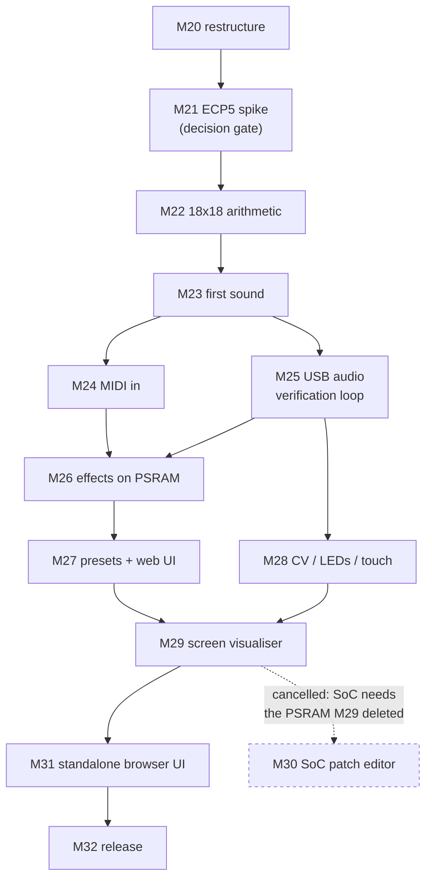

# XLS32 on Tiliqua — development history & learnings

How the ECP5 port was built, milestone by milestone. This is the companion to
[DEVELOPMENT.md](DEVELOPMENT.md), which holds the shared engine history (M1–M20), the Basys 3 work,
the cross-board milestones, and the F4PGA/Vivado friction logs. **The chronology runs across both
files:** M1–M20 there, M21–M29 here, then M28a, the PART chips and M31 back there again because they
are cross-board.

**How to read this doc.** Same shape as its companion. The [roadmap table](#milestone-roadmap) is
the skim index; each milestone opens with what changed and closes with what was measured. For the
finished architecture rather than how it was arrived at, read
[ARCHITECTURE_tiliqua.md](ARCHITECTURE_tiliqua.md) — every constraint referenced below is stated
there as a resolved fact, with the code that resolves it.

**Contents**

- [Development history (Tiliqua)](#development-history-tiliqua)
  - [Milestone roadmap](#milestone-roadmap)
  - [M21 — does it fit on an ECP5?](#milestone-21--does-it-fit-on-an-ecp5-decision-gate-passed)
  - [M22 — narrowing the arithmetic to 18×18](#milestone-22--narrowing-the-arithmetic-to-1818-done)
  - [M23 — hello Tiliqua: the first bitstream](#milestone-23--hello-tiliqua-the-first-bitstream-done-heard-on-hardware)
  - [M24 — MIDI in over TRS](#milestone-24--midi-in-over-trs-done-hardware-verified)
  - [M25 — the host loop: UAC2 audio up, USB-MIDI down](#milestone-25--the-host-loop-uac2-audio-up-usb-midi-down-done-hardware-verified)
  - [M26 — chorus, ping-pong echo and 8-comb Freeverb](#milestone-26--chorus-ping-pong-echo-and-8-comb-freeverb-on-tiliqua-done)
  - [M27 — preset bank + web UI on Tiliqua](#milestone-27--preset-bank--web-ui-on-tiliqua-done-hardware-verified)
  - [M28 — the Eurorack jacks: CV in, gate in, the LED comet](#milestone-28--the-eurorack-jacks-cv-in-gate-in-the-led-comet)
  - [M29 — 32 voices as 32 tiles, drawn by racing the beam](#milestone-29--32-voices-as-32-tiles-drawn-by-racing-the-beam)
  - [M30 — SoC + on-screen patch editor, cancelled](#milestone-30--soc--on-screen-patch-editor-cancelled)
  - [What is left — M32, and the risk register](#what-is-left--m32-and-the-risk-register)
  - [M33 — the USB capture path](#milestone-33--the-usb-capture-path-done-hardware-verified)
- [Friction logs & learnings (Tiliqua)](#friction-logs--learnings-tiliqua)
  - [Toolchain setup](#toolchain-setup)
  - [Repair what the counter names, not what the waveform looks like](#repair-what-the-counter-names-not-what-the-waveform-looks-like)
  - [The USB dropout report that was withdrawn](#the-usb-dropout-report-that-was-withdrawn)
  - [References](#references)

---

# Development history (Tiliqua)

The port ran as a decision gate (M21) followed by two arcs: **get sound out** (M22–M25) and **reach
feature parity, then past it** (M26–M29). M25 is the load-bearing one — everything after it is
graded automatically, everything before it by hand or by simulation.

## Milestone roadmap

| # | Milestone | Verified by |
|---|-----------|-------------|
| **21 ✅** | **ECP5 feasibility spike** (decision gate): engine alone on `LFE5U-25F`, `STAGES` × voice-count sweep | **32 voices × 4 parts fit: 66% LUT / 38% FF / 0 BRAM / 86% DSP at `STAGES=12`. No fallback rung needed** |
| **22 ✅** | **18×18 arithmetic**: reshape the DSP48-tuned multiplies in `synth.x` for the ECP5's narrower tile | **`MULT18X18D` 24 → 19 (86% → 68%); 3,000 audio samples bit-identical, and Basys 3 got *cheaper* — 78 fewer LUTs, 0.32 ns shorter path, same 26 DSP48** |
| **23 ✅** | **Hello Tiliqua**: first ECP5 bitstream — engine + AK4619 codec, no SoC, hard-coded A4 | **heard on the module's line-out; `check_pitch.py` ratio 0.667446, 0.117% error** |
| **24 ✅** | **MIDI in over TRS**: the jack feeds the engine's `u8 midi_in`, RT/SysEx/SysCommon filtered, byte CDC into `audio` | RTL built + both sim checks pass; **and, once a Type A cable was finally put in it, a keyboard on the jack plays the module** |
| **25 ✅** | **The host loop over one USB cable**: UAC2 audio up, USB-MIDI down, `harness.py` onto the `Transport` seam — the suite can see Tiliqua again | **three consecutive `--only basic` runs at 91.0 / 91.0 / 90.8 (A−), all 34 cases identical every run; clock 12.2874–12.2877 MHz; worst gap 0.001%** |
| **26 ✅** | **Effects on Tiliqua**: chorus, ping-pong echo and 8-comb Freeverb ported from the Basys 3 FSM into `fx.py` — echo on HyperRAM via `dsp.DelayLine`, tank on-chip | **`echo` / `reverb` / `reverb_cathedral` / `stress_fx_tail` all 100.0; basic 99.1 / 99.6 / 99.4 and stress 100.0 ×3, verdicts identical every run; CC82 spans 4.0–512.0 ms at 0.00% error** |
| **27 ✅** | **Preset bank + web UI on Tiliqua**: `Transport` gains `stream_start`/`stream_stop`, and all four banks are re-fitted against `fx_model.py` after the generator turned out to model a synth that never shipped | **basic 99.4 (33/1/0), integration 99.9 (134/0/0) twice with identical verdicts, stress 100.0 (7/0/0); the preset model identifies 189/268 against a 20% baseline** |
| **28 ✅** | **The Eurorack jacks**: CV in and gate in become MIDI in gateware, the LED comet is driven off `viz_out`, and the two-way MIDI mux becomes a real arbiter | **exit criterion met on hardware; 1.98 cents residual on the CV sweep; the preset census moved 0.04 on separation and 0.10 on the matched median, i.e. not at all.** Cost a second bitstream slot — undone in M29, and the `cv` variant deleted in M31 |
| **29 ✅** | **32 voices as 32 tiles**, 720×720p60 with no framebuffer — and the two bitstreams re-merge | **picture confirmed on the panel; `check_loop.py` PASS with frame gaps 0.000%, clock 12.289 MHz, note 69 at 440.02 Hz (+0.1 cents).** The design got *smaller* while gaining a screen: 24,107 (99%) → 23,404 (96%) |
| **30 ⛔** | ~~**SoC + on-screen patch editor**~~ — cancelled | `TiliquaSoc` mandates PSRAM; M29 deleted PSRAM to buy the screen. Not a trade to re-weigh — see [below](#milestone-30--soc--on-screen-patch-editor-cancelled) |
| **31 ✅** | **Standalone browser UI** — cross-board, so it lives in [DEVELOPMENT.md](DEVELOPMENT.md#milestone-31--deleting-the-python-hop) | |
| **32 ✅** | **Bitstream archives, ~~CI~~, docs**: `manifest.json` metadata, `pdm flash archive` recipes, a prebuilt `.tar.gz` in `boards/tiliqua/firmware/` | **exit criterion met** — `boards/tiliqua/firmware/xls32-r5.tar.gz` flashes to slot 6 from `tiliqua-webflash` in Chrome with no toolchain, and comes up clocked correctly off its own manifest, verified as the committed file. **CI was cut from the milestone**: Vivado cannot run in Actions, so a two-board matrix has no second half — see [below](#what-is-left--m32-and-the-risk-register) |

| **33 ✅** | **The USB capture path**: the UAC2 IN endpoint sizes its own packets from `adc_fifo_level` instead of echoing the host's nominal rate, and the tee gets a multiplier-free DC blocker | **measured over 120 s on hardware: 0 frames lost in 0 events (was 652 of 5,902,732, in 12), mean +0.00003 (was +0.286), 0.000% of the energy below 5 Hz (was 89.6%).** The design got smaller doing it: 23,773 (97%) → 23,557 (96%) |

> **Where the cross-board milestones went.** M20 (the `core/` + `boards/` split), M28a (a host
> decoder bug that affected both boards), the PART chips investigation and M31 all live in
> [DEVELOPMENT.md](DEVELOPMENT.md). They are numbered in this sequence but are not Tiliqua work.

## Milestone 21 — does it fit on an ECP5? (decision gate, passed)

**The question:** the whole Tiliqua port is conditional on the engine fitting an `LFE5U-25F`, which
has 24,288 LUT4-equivalents against the Artix-7's 20,800 LUT6 — *fewer* logic cells, in a coarser
form. If 32 voices × 4 parts could not fit, the fallback ladder had to be applied once, in DSLX,
before any Tiliqua infrastructure was written. **It fits**, at 66% LUT / 38% FF / 0 BRAM / 86% DSP.
The sweep that produced it is `boards/tiliqua/spike/` (`sweep.sh` + `results/`), and its
cycles/sample column is tabulated in
[ARCHITECTURE_tiliqua.md → E1](ARCHITECTURE_tiliqua.md#e1-the-six-hard-constraints); what follows is
what the exercise taught that the table does not say.

**Two toolchains, two sandboxes, and they disagree about what a path is.** XLS ships linux-x64 only,
so codegen runs in an amd64 container — which can mount `/tmp`, so that is where the slow codegen
output is cached. yosys and nextpnr come from yowasp, which is WebAssembly under WASI and **can only
open files beneath its working directory**. Handing it `/tmp/…/engine.v` fails with `File '…' not
found or is a directory` — a message that reads like a missing file and is actually a permissions
model. An hour went into "fixing" the file before a two-line probe (`read_verilog /tmp/x.v` vs
`read_verilog build/x.v`) found it. The build script now caches in `/tmp` and stages a copy into the
repo tree, passing only relative paths to the wasm tools.

**A spike top that ties its inputs off measures nothing.** Constant-drive an engine input and yosys
constant-folds the datapath behind it; the resulting utilisation number describes a design that does
not exist. `stub_top.v` drives every input from a real pin (the MIDI byte through a shift register,
so even the byte cannot be folded), and XOR-reduces every output into a real pin so nothing is dead.
The reduction tree costs a few dozen LUTs against an engine in the thousands.

**The measurement that changed the conclusion.** The resource sweep alone cannot pick an operating
point, because whether a build sustains 48 kHz depends on its *achieved* initiation interval — and
this document already recorded that the real II sits far below the `worst_case_throughput` cap
without ever saying what it was. The port plan meanwhile claimed both "32 cycles per sample" and
"needs ≥ 32.8 MHz", which differ by a factor of 32; the second was back-fitted from the Basys 3
divider that happened to work. `boards/tiliqua/spike/tb_rate.v` just counts clocks between
`audio_out` handshakes with `ce` tied high. The answer is **32 × roughly `STAGES`/2** — 768 cycles
per sample at the shipping `STAGES=48`, matching `top.v`'s note that ÷4 "capped at 28 kHz".

That inverts how the sweep reads. Raising `STAGES` raises Fmax *and* raises the clock you need, so
it buys no throughput — only timing slack, paid for in flip-flops. Sustainable rate is
`Fmax / cycles`, which never drops below 57 kHz anywhere in the table. **Sample rate was never a
constraint on this port; area is.** Read as a Fmax column the table says `STAGES=48`; read correctly
it says `STAGES=12`, which is 7,791 flip-flops — 32% of the device — cheaper.

**What the sweep found that no single build would have.** `TRELLIS_COMB` is flat at ~16k across
every `STAGES` from 6 to 64: pipeline depth moves flip-flops and never combinational area. And
`MULT18X18D` is pinned at 24 across *both* sweeps, voice count included — the multipliers live in
the shared one-voice-per-cycle datapath, not in the ring, so dropping to 16 voices frees 4,930 LUTs
and zero DSPs. With the shell that is 25 of 28, three spare, and it is the only resource anywhere
near its limit. M22 (narrow the arithmetic to 18×18) was speculative when it was written; it is now
the load-bearing next step.

**Not spent:** all 56 BRAM tiles are idle, because yosys flattens the voice and part arrays into
registers (42 `Replacing memory … with list of registers` warnings at the chosen point). That is the largest untapped
lever on the device. It is an optimisation, not a blocker, so it stays banked.

**On rewriting production DSLX to measure it.** The voice count in `synth.x` is bare literals, not a
constant, so a voice sweep meant either parameterising the shipping Basys 3 gateware for a
measurement or rewriting a throwaway copy. `voices_variant.py` does the latter, and asserts the
match count of every rewrite — which immediately caught two of its own bugs (`Voice[32]` occurs 10
times, not 6; `\bu5\b` also matches the `u5` inside `u5:31`). Its self-check is that `--voices 32`
must reproduce `core/synth.x` byte for byte.

## Milestone 22 — narrowing the arithmetic to 18×18 (done)

M21 left one resource near its limit: **24 of 28 `MULT18X18D`**, 25 with the shell. The cause is in
this document's own history — the multiplies in `synth.x` were shaped for the DSP48E1, which is
**25×18**. The ECP5 tile is **18×18**. Four operands sat in the gap: 20, 22 and 23 bits wide, each
one DSP48 on Artix-7 and two tiles on ECP5. Narrowing them took **24 → 19**, and the
`MULT18X18D`/`TRELLIS_COMB` ranking flipped: multipliers 68%, LUTs 73%.

**The trap: yosys maps *every* `*` to a DSP tile, however narrow.** The obvious fix for a 23×4
multiply is to split the wide operand into an 18-bit chunk plus a 5-bit remainder and multiply each.
A `build/dspprobe/` sweep — one trivial module per operand shape, synthesized and counted — says
otherwise: 2×16 costs a tile, 3×16 costs a tile, 6×10 costs a tile. The split would have cost the
same two tiles it was meant to save. **The saving only exists if the small chunk contains no `*` at
all**, so each rewrite ends in shifts and muxes:

- **SVF band update** — one `as s19` cast. `clampx` had already bounded the value to ±180,000, well
  inside s19, but a clamp narrows the *value* and not the *type*, so XLS carried 24 bits into the
  multiplier. The cast is lossless and costs nothing.
- **Pitch mod, and the mix accumulate** — split the wide operand at bit 18; the low half pairs with
  the narrow operand inside one tile, and the 2- or 4-bit top folds in as a shift-add of the *other*
  operand (top bit subtracted, for sign). LUTs, not a second multiplier.
- **Unison detune** — `uni` is a 4-bit signed stack index, so the whole multiply is four conditional
  shifts. This is the one that removes a tile outright rather than halving one.

**Bit-exactness, not score-equivalence.** A change that is supposed to alter nothing should be held
to more than "the test suite still scores 98.6". `core/sim/tb_equiv.v` drives the engine's MIDI
channel directly and dumps 3,000 audio words; two engines from two revisions must produce identical
files. The stimulus deliberately lights every path touched — max unison, pitch bend on two parts,
resonance high enough to push the SVF state near its clamps, and notes at 108 and 120 where
`inc0>>12` and `inc>>9` actually exceed 18 bits. **Identical over 3,000 samples with 2,809 distinct
values**, at both `STAGES=12` and the shipping `STAGES=48`.

One detail matters more than it looks: MIDI is fed **one byte per audio pull**, not as fast as the
engine accepts it. A datapath edit shifts XLS's pipeline schedule, and a free-running feed would
land a note-on on a different slot of the 32-voice ring — a diff that is a scheduling artefact and
not an arithmetic one. Pacing to sample boundaries makes the comparison mean what it claims.

**Both boards, from one source — and the Artix-7 got *cheaper*, not dearer.** The expectation going
in was that trading a multiplier for shift-adds would cost LUTs on the board that did not need the
trade. A full Vivado run against `xc7a35t` says otherwise:

| `xc7a35t`, top + engine, `STAGES=48` | before | after | |
|---|---:|---:|---|
| Slice LUTs | 10,483 (50.4%) | **10,405 (50.0%)** | **−78** |
| Slice Registers | 17,445 (41.9%) | 17,874 (43.0%) | +429 |
| F7 / F8 muxes | 297 / 18 | **155 / 8** | −142 / −10 |
| Block RAM | 32.5 (65%) | 33 (66%) | +0.5 |
| DSP48E1 | 26 (28.9%) | **26 (28.9%)** | **0** |
| Worst data-path delay | 18.872 ns | **18.556 ns** | **−0.32 ns** |

The DSP count holds — the DSP48's 25×18 shape already absorbed three of the four wide operands, and
the fourth (unison) freed a tile that Vivado spent elsewhere. The LUT saving is where the surprise
is: the multiplies that got narrower **stopped dragging wide mux trees behind them**, and F7/F8
usage roughly halved. yosys had predicted +450 LCs from the same netlist; Vivado's mapper found the
opposite, which is a reminder that a synthesis-only estimate is a screening tool and not a result.
Critical path improved slightly, in a 30 ns ÷3 budget. Unconstrained-path noise also fell by half
(11,591 → 5,643 failing endpoints, TNS −18,318 → −6,129 ns) — cosmetic, since those are the ÷3 paths
the tool is not told about, but it makes the report easier to read.

So M22 costs the Basys 3 nothing and buys the ECP5 five tiles. That is the case for doing this kind
of narrowing in the shared DSLX rather than forking the source per board.

## Milestone 23 — hello Tiliqua: the first bitstream (done, heard on hardware)

M21 proved the engine fits an `LFE5U-25F`; M22 made it fit comfortably. M23 is the first time
anything actually runs there: `boards/tiliqua/gateware/` — an Amaranth shell around the same
`engine.v` every board gets from `core/codegen.sh` — plays a fixed boot patch out eurorack-pmod
channels 0/1. No effects, no MIDI input, no host loop. The point is to close the path from DSLX to
a jack, and it does: a full nextpnr run passes timing on both clocks, the simulated output carries
the engine's waveform, and the bitstream loaded to the module's SRAM is audible on out0.

**The engine cannot live in `sync`, and that means a CDC.** The plan said otherwise — it assumed
the whole core could sit in the `audio` domain with the pmod, no crossing needed. Reading
`tiliqua/periph/eurorack_pmod.py` says no: `I2SCalibrator.__init__` defaults
`stream_domain="sync"` and `EurorackPmod` never exposes the argument, so the user-facing `i_cal`
and `o_cal` streams are at 60 MHz. The engine's Fmax at `STAGES=12` is ~27.6 MHz, so 60 MHz is not
available to it. The resolution puts the engine and its boot ROM in `audio` (12.288 MHz, 2.3×
margin), a depth-8 `AsyncFIFO` between, and the resampler and jack mapping in `sync`. The upside
is that `XlsSynth` ends up an ordinary sync-domain DSP core, so it drops into any Tiliqua top
unchanged — including the SoC shell M27/M28 will need.

**Nothing generates a 32 kHz tick, and nothing should.** The obvious design divides mclk down to
32 kHz and pulls the engine from that. `dsp.Resample` makes it unnecessary: it gates its input
`ready` on the internal FIR, and the FIR stalls on output backpressure, so chaining
`engine → FIFO → Resample(n_up=3, m_down=2) → pmod` lets the codec's 48 kHz demand propagate
backwards through 3/2 and land on the engine as exactly 32 kHz average — phase-locked to the same
mclk, with no divider to drift against it. Free-running, the engine emits a sample every **192
cycles** (measured on the generated Verilog at `STAGES=12`), i.e. 64 kHz, so it is always the one
waiting: the FIFO sits full and the pull sets the rate.

**The XLS engine needs a real reset, and the SDK's harness does not give it one.**
`src/top/dsp/sim_dsp_core.cpp` raises and lowers reset across two `timeInc(1)` calls before the
clock loop starts, so no clock edge ever sees it asserted. Amaranth registers do not care — they
carry init values and come up correct regardless. The XLS proc does: its state, including the bit
that says a state is live at all, is only established by a *synchronous* reset. With a zero-width
pulse the engine sits dead forever and never asserts `_midi_in_rdy`. The first working build
produced 1,954 samples of pure silence with no error anywhere. Four counters — boot ROM index,
engine samples, resampler inputs, codec writes — localised it in one run by reading `0/12, 0, 0,
0`: the failure was upstream of everything. Holding all three resets for the first 2 µs *inside*
the loop fixes it. The counters stayed in; they cost nothing (nothing drives them in a hardware
build, so yosys prunes them) and the next stall will be somewhere else.

**Grading pitch when neither clock is real.** The exit criterion is that the audio path carries
the engine faithfully, which is not the same question as whether the synth is in tune — mixing the
two would leave neither answerable, especially with `pitch_a4` outstanding. So
`boards/tiliqua/check_pitch.py` compares the Verilator capture of out0 against an iverilog run of
the bare engine driven by the identical boot patch (`boards/tiliqua/sim/tb_boot.v`), and compares
them in **cycles per sample, not hertz**. That matters because neither simulation runs at a
physically exact clock: the SDK harness computes `1e9/12288000 = 81` ns and halves it to `40`, so
its "12.288 MHz" mclk is really 12.5 MHz, +1.7%. Hertz would fold that error into the answer.
Normalised frequency cannot: whatever the clock, 3/2 resampling must divide it by exactly 3/2, and
a dropped FIFO word or a mis-fed codec would move the ratio. Measured **0.6674** against 0.6667,
error **0.12%**, with the output peak at 2480 against the engine's 5515 — the −6 dB pad, minus a
little resampler passband loss.

**A side result worth more than the milestone.** The reference run peaks at **439.79 Hz** for a
note-on at A4. The engine is in tune. That makes the long-standing `pitch_a4` failure on Basys 3 —
which reads 208–220 Hz, an octave low — a host, transport or measurement problem rather than a
DSLX one. Not yet chased down, but the engine is no longer a suspect.

**Utilisation** (nextpnr-ecp5, `LFE5U-25F-6BG256C`, the whole design — engine, pmod, PLL, reboot):

| | used | avail | |
|---|---:|---:|---:|
| MULT18X18D | 21 | 28 | 75% |
| TRELLIS_COMB | 16,721 | 24,288 | 68% |
| TRELLIS_FF | 9,843 | 24,288 | 40% |
| DP16KD | 0 | 56 | 0% |

Fmax **29.99 MHz** on `audio` against the 12.288 required, and **81.62 MHz** on `sync` against 60.
The critical path is inside `core.engine`, as expected. The two `MULT18X18D` above M22's
engine-only 19 are the resampler's 15-tap FIR — a cheap price for not having to retune the pitch
tables to 48 kHz.

Read those numbers from the **end** of `top.tim`, not the first match. nextpnr prints
"Max frequency for clock" twice: once as a post-placement estimate and again after routing. On
this design the two disagree in both directions — the estimate said 28.63 / 87.75 — so grepping
the first occurrence quietly reports a number that was never achieved.

**Heard on the module, and no Eurorack gear was needed to hear it.** The load is
`openFPGALoader -c dirtyJtag` onto a freshly power-cycled module; out0 went into the analogue AUX
input of a pair of powered desktop speakers over a plain 3.5 mm cable, and the sustained A4 came
out. That works because of an accident worth writing down: the −6 dB pad plus the boot patch's own
level puts the sustain at **0.265 V RMS** (0.377 Vpk, ~0.75 Vpp), and consumer line level is
0.316 V RMS. A normal Eurorack audio signal is 10 Vpp and would need a −20 dB pad to face a line
input; this one is already there. Two caveats that do not apply here but will later: the pmod
outputs are DC-coupled, and a non-SoC bitstream gets no converter calibration, so ~100 mV of DC
offset rides on the signal — fine into a line input's coupling capacitor, not fine into headphones.

Rendering the Verilator capture to a WAV first is worth the two minutes. `XLS_SIM_MS=3000` gives
three seconds; write it at **48828 Hz** rather than 48000, because the harness's mclk is really
12.5 MHz and declaring the true capture rate is what makes the pitch come out right. Having the
expected sound on hand turns "is it working?" into an A/B rather than a guess.

**What is deliberately not done.** The written exit criterion also said "boots from a slot". It
does not, and that is deferred to M28: flashing writes the module's nine-slot layout, and this
port has never written it. `openFPGALoader -c dirtyJtag` loads SRAM and touches nothing
persistent, which covers everything M23 needs to prove.

## Milestone 24 — MIDI in over TRS (done, hardware-verified)

M23 got sound out of a jack, but the note was hard-coded: the module was not yet an instrument.
M24 makes it one. The TRS MIDI-In jack now feeds the engine's `u8 midi_in` ready/valid channel, so
a keyboard or DAW plays all four parts. Written scope was "TRS + USB"; USB-MIDI moved to M25,
because it needs the luna device stack that M25 stands up for UAC2 audio anyway and building it
twice is waste.

The wiring itself is short — `midi.SerialRx` already emits `stream.Signature(unsigned(8))`, which
is the engine's input shape exactly, so no adapter is needed and the SDK's decoder is skipped
entirely. Four things around it were not short.

**A real MIDI cable would have destroyed the engine's parser, silently.** `core/synth.x:114`
treats *any* byte ≥ 0x80 as a new running status:

```
if mb >= u8:0x80 { (mb, data1, u2:1, ...) }
```

That is correct for channel messages and it is exactly what the Basys 3 host transport sends,
because the host hand-feeds clean messages. A cable does not. Every System message that reaches
the engine costs up to two further bytes: it is latched as a status, then the next two data bytes
are consumed against a `0xFn` that matches no case in the parser. Active Sensing (`0xFE`) is
emitted every ~300 ms by many keyboards, and MIDI Clock (`0xF8`) floods at 24 pulses per quarter
note the moment a DAW hits play — so the failure would have been continuous, note-dependent
corruption with no error anywhere, on hardware only, after everything passed in simulation. Three
filters go in front of the engine: the SDK's `MidiRTFilter` and `MidiSysexFilter`, plus a new
`SysCommonFilter` in `boards/tiliqua/gateware/midi_filter.py`. System Common (`0xF1`–`0xF7`) has no
SDK filter, and the reason is worth knowing rather than guessing: the SDK's own decoder does not
need one, because it absorbs those messages inline in the SKIP-1 / SKIP-2 states of
`MidiDecodeSerial`. A design that skips the decoder skips that too. Running status itself needs no
help — the engine supports it via `p_status`.

**The UART belongs in `sync`, and the divisor there is exact.** 60 MHz / 31250 baud = **1920**,
with no remainder at all. The `audio` domain, which would have avoided a crossing, gives
12.288 MHz / 31250 = 393.216 → 393, i.e. +0.055%. That error is harmless on its own, but zero is
better than harmless and the price is one depth-4 byte-wide `AsyncFIFO` — the same pattern the
audio path already uses in the other direction. The boot ROM keeps absolute priority over that
FIFO until it drains, which takes ~36 audio cycles, about 3 µs; a MIDI byte takes 320 µs, so there
is no contention to resolve.

**The simulated `sync` clock is 62.5 MHz, and a naive harness fails on it for a reason that does
not exist.** This is the M23 mclk trap again, in a new place. `sim_xls_core.cpp` computes
`ns_in_sync_cycle = 1e9/60000000` in integer arithmetic and gets **16**, so the simulated sync
period is 16 ns rather than 16.667 — 4.17% fast. A transmitter bit-banging at a literal 31250 baud
would face a receiver dividing that fast clock by 1920, slip 42% of a bit width by the stop bit,
and fail right at the edge. The harness therefore derives its bit period as
`1920 × ns_in_sync_cycle`, from the same divisor the gateware uses. The rule generalises: when the
timebase is wrong, the test must be written in the units the design works in, not in physical
ones. Baud accuracy on hardware is then a separate and purely arithmetic claim.

**Four notes do not prove per-part routing.** The natural test — one note per MIDI channel, check
the pitches — proves nothing about the thing M24 is actually adding. `core/synth.x:337` is
`let ch = ps[0:2]`: the channel nibble's low two bits pick the part. But a part is polyphonic, so
if that routing collapsed and all four channels landed on part 0, four notes played *in sequence*
would still come out at four correct pitches. The discriminator is CC7, which `synth.x:171` makes
per-part volume: give each channel a different CC7 and four different amplitudes must come out. If
there is only one part, the last CC7 wins and all four segments are identical. Those CC7 values
live in the harness's test script rather than in the shipped boot patch, sent over the wire — the
boot patch is a product decision, not a fixture, and this way the CC bytes are exercised through
the UART and the filters too.

`boards/tiliqua/check_midi.py` runs both assertions on one capture. Pitches are compared as ratios
to the first segment, for the same reason M23 compared cycles per sample: neither simulated clock
is physically exact, and a ratio is immune to that.

| ch | note | CC7 | ratio | expected | error | segment rms |
|---:|---:|---:|---:|---:|---:|---:|
| 1 | 69 (A4) | 110 | 1.0000 | 1.0000 | — | 1062 |
| 2 | 63 (D♯4) | 80 | 0.7074 | 0.7071 | 0.039% | 763 |
| 3 | 78 (F♯5) | 55 | 1.6837 | 1.6818 | 0.114% | 557 |
| 4 | 60 (C4) | 30 | 0.5943 | 0.5946 | 0.052% | 285 |

The check also asserts the 35 ms before each note-on is silent, and it is (rms 0.0 on all three
gaps). That guard earned its place immediately: the first version measured the *whole* 150 ms
between notes and failed, because the release tail runs about 60 ms and dominated the window. The
tail is real and harmless — the assertion was measuring the wrong thing, not finding a bug — but a
version of that overlap that *did* contaminate the amplitude comparison would have been invisible
without it.

**The boot patch lost its note-on.** `BOOT_MIDI` is now CCs only — cutoff, resonance and volume,
broadcast on all four channels because a CC on channel 1 alone leaves parts 2–4 at their DSLX
defaults. 36 bytes. The module comes up silent and sounds when you play it, which is what an
instrument should do; the CCs stay so that a keyboard plugged into a fresh boot makes a reasonable
noise without touching a knob. `check_pitch.py` still passes (ratio 0.6674, error 0.12%) with its
A4 now arriving over the simulated wire instead of from the ROM, which quietly upgrades the M23
regression: it exercises the entire MIDI path as well as the audio path.

**MIDI cost more area than predicted, and the reason is worth watching.** The plan called a UART,
three filters and a byte FIFO "small". They are not, in aggregate:

| | M23 | M24 | |
|---|---:|---:|---|
| TRELLIS_COMB | 16,721 (68%) | 17,909 (73%) | +1,188 |
| TRELLIS_FF | 9,843 (40%) | 9,941 (40%) | +98 |
| MULT18X18D | 21 (75%) | 21 (75%) | — |
| DP16KD | 0 | 0 | — |

Post-routing Fmax **28.00 MHz** on `audio` against 12.288 required and **80.77 MHz** on `sync`
against 60; the critical path is still inside `core.engine`. So it fits and it clears timing, but
that is +1,188 LUTs for a few hundred LUTs' worth of visible logic. 218 of them came back for free
by setting `SerialRx(rx_depth=8)` instead of the SDK default of 64 — buffering 64 MIDI bytes is
20 ms of wire time for a consumer that drains one per cycle, so the elasticity bought nothing.
The rest is not attributed. The likely explanation, **unverified**, is that M23's number was
flattered: the engine's `_midi_in` was driven by a 12-byte ROM of known constants, all on channel
1 and all of two message kinds, so yosys could constant-fold a slice of the DSLX parser away. Fed
an arbitrary byte, the whole parser has to exist. If that is right the cost is not waste, it is
the price of being a real instrument — but M29's video core has to fit in what is left, so the
next milestone that adds area should re-measure rather than assume.

**What was not done, for a long time: hardware.** The gateware and both automated checks passed at
M24, but nothing had been played into the physical jack — for want of a cable, the jack being
**TRS Type A** with optoisolation (`gateware/docs/hardware_design.rst:38`), so a Type B adapter
will not do. That has since been closed: a keyboard on the jack plays the module, and plays it
alongside USB-MIDI, which is what `midi_arb.py` was written for. It does **not** close M7's
"built, HW-pending" DIN MIDI item after all — the same DSLX parser is being fed, so the parser
half is now proven, but the Basys 3 DIN Pmod is different hardware in front of it and is still
untested.

## Milestone 25 — the host loop: UAC2 audio up, USB-MIDI down (done, hardware-verified)

Everything from M26 on is graded by the 175-case FFT suite, and on Tiliqua that suite was blind:
`run_tests.py` drove a 2 Mbaud FTDI UART the board does not have. M25 closes the loop over the
single `usb2` cable — audio up as a USB Audio Class 2 device, MIDI down as a USB-MIDI device — and
ports `test/harness.py` off a file descriptor onto the `Transport` seam M20 left behind, which is
what lets one suite grade two boards. New: `boards/tiliqua/gateware/usb_iface.py`,
`host/transport/usbaudio.py`, `boards/tiliqua/check_loop.py`.

**There was no USB-MIDI device stack to inherit.** M24's section says USB-MIDI was deferred here
because it needs "the luna device stack that M25 stands up anyway." That premise was wrong. The
SDK's only USB-MIDI is `USBMIDIHost` from the `guh` package (`src/top/usb_host/top.py:52`), which
makes Tiliqua the *host* for a keyboard plugged into it — the opposite direction, and it cannot
share `usb2` with a UAC2 device regardless. luna itself ships no MIDI class. What *is* inheritable
is the descriptor set: `usb_protocol.emitters.descriptors.midi1` has every MIDI 1.0 emitter except
the MIDI function's UAC1-style AudioControl header, which is nine fixed bytes written by hand. So
`XlsUsbInterface` subclasses the SDK's `USB2AudioInterface`, restates `create_descriptors()` with a
second Interface Association Descriptor inside the configuration block (interfaces 3 and 4; 0–2 are
UAC2's), and appends one bulk OUT endpoint on EP 3 after `super().elaborate()` returns the module.
Both hooks are load-bearing and both were verified before use: `create_descriptors()` is a
self-contained method called from `elaborate()`, and `USBDevice.add_endpoint()` only appends to a
list, so the endpoint can still be added after the parent has built its module.

**Tee the engine digitally and the calibration problem goes away.** The obvious wiring — the one
the SDK's own `usb_audio` top uses — feeds the USB interface from `pmod0.o_cal`, i.e. from the
codec. A bitstream with no SoC gets *uncalibrated* converters: −86 to −116 mV of DC offset, about
1.2% of full scale, which is enough to skew FFT grading. Feeding `usbif.i` from a depth-16 FIFO on
`core.o` instead means the graded signal never touches a converter. The jack still plays in
parallel, unchanged. The tee drops writes when full rather than backpressuring — a host that is not
recording must never stall the codec — and it keeps channel 2 non-zero at all times, which turns
the dropout detector below into "all four channels zero" and keeps it from mistaking genuine
digital silence for a lost frame.

**Repair the gaps; do not select around them.** §1.1 of the port doc reported 2.5–5% of
isochronous frames arriving all-zero device-side — a figure since **withdrawn**, see the
retraction below; the measured rate is 0.001% and the repair path now repairs almost nothing.
What follows is why the design is still the right one, and it did not depend on the rate.
The plan's mechanism was "return the longest contiguous gap-free run —
select, never splice," on the reasoning that splicing corrupts phase. Measured, selection is
unusable: the drops arrive in 6-sample microframe bursts, so at 3% the longest clean run is
**1,080 samples — 22.5 ms**, and run through the real `harness._bad_take` on a plucked saw,
selection returns 1,284 samples at 2.5% dropout and 954 at 5%, rejected as `short` both times.
Linear interpolation across the holes returns the full 144,000 and passes (peak 12,995, 201
glitches against a 1,440 limit); SNR against a clean reference goes from −20.9 dB holed to 14.2 dB
repaired. Interpolating is not splicing — a dropped frame *arrives*, as zeros, so the timeline is
intact and only its values are missing. `select_clean=True` is still there for anyone who wants the
strict behaviour. This is a deliberate deviation from the approved plan.

**Scale is the part that silently invalidates everything.** Every threshold in the suite —
`A.peak(s) < 800`, `glitches(s, 12000)` — is calibrated to the Basys 3's ±32768 domain. PortAudio
hands back 24-bit samples left-justified in `int32`; Tiliqua's `ASQ` is the engine's own s1.15 word
shifted left by 8, and `xls_core.py` applies a further `>>1` 6 dB pad. So `int32 >> 16` recovers
the engine's 16-bit sample and `* 2` undoes the pad. Get either wrong and the suite still runs, and
every number it prints is meaningless.

**`SR` binds at import, so `--board` cannot be an ordinary flag.** `host/synth.py` reads
`get_board().sr` at module scope. `run_tests.py` therefore scans `sys.argv` by hand and writes
`$XLS32_BOARD` *above* its own `import harness` line; argparse runs far too late. This is the item
`boards/__init__.py` had been deferring to M25 since M20.

**Area fits. Timing does not, and the reason is the engine.** On the current netlist:

| | M24 | M25 | |
|---|---:|---:|---|
| TRELLIS_COMB | 17,909 (73%) | 21,103 (**86%**) | +3,194 |
| TRELLIS_FF | 9,941 (40%) | 11,441 (47%) | +1,500 |
| DP16KD | 0 | 3 (5%) | +3 |
| MULT18X18D | 21 (75%) | 21 (75%) | — |

`audio` closes comfortably — 26.87 MHz against 12.288 required. `sync` does not: **48.7–55.3 MHz
across sixteen seeds against 60 required**, and the shipped `top.bit` lands at **49.51 MHz**. The failing path is about twenty LUT levels *entirely inside luna* — an
interpacket timer through the control endpoint, the endpoint mux and `ChannelsToUSBStream` to the
ULPI TX register — with roughly 5 ns of logic and 15 ns of routing. That ratio is the diagnosis:
congestion, not depth. The same block makes 66.49 MHz in the stock `usb_audio` bitstream at ~20%
occupancy.

Which kills both levers this milestone had pre-committed. A per-module LUT4 census says
`core.engine` is **83.8%** of the design and all of luna + UAC2 + MIDI is **9.4%**; dropping
`nr_channels` 4→2 saves ~100 LUTs and dropping the host→device direction ~10. Neither touches the
thing doing the crowding. Nor does the tool flow: sixteen placer seeds on the final netlist span
48.7–55.3 MHz, and the rankings do not survive a re-synthesis — the winning seed gave 55.33 MHz on
the netlist it was swept against and 52.27 MHz on the rebuild, so a good seed is a lottery ticket
rather than a fix; `--placer-heap-timingweight` buys 1–5 MHz, `--router router2` is worse,
`--placer-heap-critexp` and `--placer-heap-beta` change nothing, and `-abc9` gives no improvement
and a slightly larger design — which confirms the diagnosis from the other side. Region constraints, which is what this design
actually wants (fence luna into one corner), need a nextpnr with `REGION`/`UGROUP` in its LPF
reader and Python bindings; the `yowasp` 0.10 build has neither. And the engine has no soft area to
give back: XLS unrolls the voice loop into 32-entry arrays read at all 32 constant indices every
cycle, so voice state is a flat register file, not an inferrable memory — that is why 3 of 56
DP16KD are used while 11,225 FFs are not. Engine area is ~440 LUTs per voice, full stop.
Details and the full negative-result list are in
[ARCHITECTURE_tiliqua.md → E4](ARCHITECTURE_tiliqua.md#e4-the-timing-shortfall-that-runs-anyway).

One trap worth carrying forward: `--timing-allow-fail` on the nextpnr command line comes from the
*Tiliqua SDK's* `nextpnr_opts`, not from Amaranth's default template. Overriding
`AMARANTH_nextpnr_opts` to try a seed silently drops it and turns the timing warning into a hard
build failure, which looks like a regression and is not.

**The out-of-spec bitstream runs.** Of the two options — load it and find out whether the −6
worst-case model is as pessimistic as it usually is at room temperature, or cut voices and grade a
bitstream we do not ship — the first was taken, and it works: at 86% occupancy and 48–50 MHz
against 60 required, the module enumerates as a 4-in/4-out UAC2 device, accepts USB-MIDI and
streams audio the host can grade, repeatedly across a working day of reloads. That is a risk
carried, not retired. Static timing still fails, so it says nothing about margin at temperature or
on another die, and cutting voices stays on the shelf if the loop turns flaky.

**The day that went to the audio clock.** The first hardware capture came back 2,616 cents sharp,
with exact semitone ratios between notes — which reads as a gateware bug and was not one. `clk0` on
the SI5351 was still at 49.152 MHz, left by XBEAM, because *only the bootloader programs that chip*:
an SRAM load inherits whatever the last-booted slot wanted, and a JTAG refresh does
not clear it. Nothing in the design divides anything, by design — the codec pulls, and the
resampler's backpressure sets the engine's rate — so a 4× clock is simply a 4× synth, and pitch is
its only symptom. The sim checks cannot catch it either: `check_pitch.py` and `check_midi.py`
compare the engine against its own resampled output, so they are ratio-only and pass at any rate.
M23 and M24 could have been graded on a misclocked board without anyone knowing.

So the fix is a measurement. Channels 2 and 3 of the tee now carry one 31-bit count of `audio`
clock cycles — gray-coded across the CDC, latched with the frame, bit 15 of ch2 forced high so it
stays the never-zero dropout marker — and `check_loop.py` divides the end-to-end advance by
wall-clock time to get the board's real clock in Hz, checks it *before* the pitch, and prints the
recipe for getting back to the bootloader instead of an inexplicable cents error. Per-frame deltas cannot
do this: USB delivery is bursty, so most adjacent frames sit 256 audio cycles apart while every
twentieth pair jumps by 5,120 as the FIFO refills — the median then measures only inside a burst
and the mean is dominated by the refills. Only end-to-end advance is honest, which is what needs
the extra bits.

The wall-clock half of that ratio took a second attempt. A least-squares fit of callback arrival
times against frames delivered is the obvious estimator and it read a repeatable **47.8 MHz** —
repeatable to 0.01%, and wrong. PortAudio's delivery has not settled during the first capture after
the stream opens: per-frame intervals swing 20.8–34.8 µs there against 23.55–23.68 µs in every
later capture, and a fit spreads that transient across the whole slope. The **median** per-frame
interval steps around it. With that one change the same board reads **49.28–49.33 MHz** across
three runs, and **49.178 MHz** from `run_tests.py`, where the warmup capture absorbs the settling
first — XBEAM's 49.152 MHz, to 0.3% and 0.05%, which is the number theory predicted and the first
independent confirmation that the counter itself is right. Two unrelated measurements now agree:
the counter says the device produces 4.53 frames per frame the host receives, and the FFT says the
pitch is 4.532× too high.

Knowing the clock was wrong turned out not to be the same as knowing how to fix it. The obvious
remedy — power-cycle, since the bootloader sets 12.288 MHz at power-on — was tried, and the board
came back at 49.28 MHz anyway. The reason is in the bootloader's own source: the mobo EEPROM
remembers the last slot booted by hand as `last_boot_slot`, and every *cold* boot autoboots it after
a five-second countdown, reprogramming `clk0` from that slot's manifest on the way through. A power
cycle does not escape the wrong rate; it re-elects it, five seconds later, and a JTAG refresh in
between changes nothing because the FPGA is reconfigured out from under it. What does work is
catching the countdown — **touching the encoder cancels the autoboot and clears the flag** — or a
long press from a running slot, which warm-boots back to the bootloader and clears it too. The load
recipe in `boards/tiliqua/board.py` now says this, and so does every message that used to say
"power-cycle the module". Which leaves a loop that is autonomous within a session and not across a
power cycle. Three ways out were costed, the cleanest being to have our own bitstream program the
SI5351 over I2C, the way `eurorack_pmod` already configures the codec with no softcore; what was
actually done after M29 was the flash-slot route — see
[the M25 clock trap](ARCHITECTURE_tiliqua.md#a1-clock-domains) and
[README → Tiliqua](README.md#b--tiliqua--flash-and-go).

**The test that graded a working synth by coin toss.** With the clock fixed, one case still would
not sit still: `sub_osc` returned FAIL 38.9, FAIL 21.5, then PASS 100.0 on three identical runs.
The metric string gave it away — *"sub/fund = 0.12 at 110 Hz"*, when the note played is A4 and the
sub belongs at 220. The check located the fundamental with `A.strongest(s, 200, 900)`, a peak-pick
over a band that contains the sub it is looking for. Measured on the board's own capture, 220 Hz
stands at twice the amplitude of 440, so the peak-pick lands on the sub, and the check then hunts
an octave below *that*, at 110 Hz, where by construction there is nothing. It failed **because the
feature worked.** The third run's "pass" was no better: it locked onto 240 Hz — a leakage neighbour
1% above the 220 Hz sub — and measured 120. Reading the fundamental off the note the test itself
chose to play gives `sub/fund = 2.00 at 220 Hz` on the same audio. Worth the paragraph because
peak-picking a band is the right idiom in the three neighbouring checks and wrong only in this one,
which is exactly the kind of bug that survives review and then costs a milestone its exit bar.

**Where it stands: the exit bar is met.** Gateware, host transport and harness port are written;
the M23/M24 simulation checks still pass unchanged (`check_pitch.py` ratio 0.667446 / 0.117% error;
`check_midi.py` four channels on four parts), a real regression guard since the USB block is
hardware-only. On Tiliqua, `check_loop.py` passes at **12.292 MHz, A4 at 440.02 Hz (+0.1 cents),
0.00% gaps**, and three consecutive `uv run python test/run_tests.py --board tiliqua --only basic`
runs score **91.0 / 91.0 / 90.8 (A−), 30 pass / 1 warn / 3 fail — all 34 cases returning the same
verdict every time**, with the clock logged at 12.2874–12.2877 MHz and the worst gap rate 0.001%.

The three failures are `echo`, `reverb` and `reverb_cathedral`, and they are the honest answer:
M23 never ported the effects FSM, so there are no effects in this bitstream to measure. They are
M26's exit criteria showing up early, in red, which is what a working test suite is supposed to do.
Basys 3 passes all three (tails of 2947 / 331 / 661), which is the control that says the suite is
fine and the bitstream is what differs. Basys 3 was re-run on hardware after the `sub_osc` fix and
scores **95.2/100 (A), 32 pass / 2 fail** — the same two long-standing failures, `pitch_a4` and
`filter_sweep`, and the same 95.1–95.6 band it has been in all along.

### The bug report that had to be withdrawn

The 2.5–5% frame dropout in the [measured baseline](ARCHITECTURE_tiliqua.md#the-module--measured-baseline)
does not survive the fixed clock. Six full
34-case runs show a worst-case gap rate of **0.001%**.

The first reading was that this retracted half the report and left the other half standing, and
the reasoning looked sound. `docs/TILIQUA_USB_DROPOUTS.md` had been written as a hand-off to
apf.audio, and its
XBEAM row (2.56% at 192 kHz) came from a slot booted from the menu, which programs `clk0` from its
own manifest — so the misclock could not touch it. The `usb_audio` rows were the suspect ones,
built locally and SRAM-loaded over JTAG, the path that inherits the previous slot's clock. Hold
those, file the rest.

Wrong, and in an instructive direction. A parallel session re-measured on hardware instead of
reasoning about which rows were contaminated: that same menu-booted XBEAM slot delivers **100.27%
of expected frames with zero all-zero frames** across eleven runs, and 100.34% with one zero frame
in 11,558,912 on a 60 s endurance run. **Nothing in the report reproduces on either bitstream.**
Our own gateware is a clean control at 99.84% / 0.000% / 0 timeline jumps. The report had already
been sent; it was withdrawn the same day.

The residue is a lesson about the shape of the mistake. Given a finding and a newly-discovered
confound, the tempting move is to partition — decide which measurements the confound could have
reached and keep the rest. That is reasoning *from* the old numbers, and it inherits whatever was
wrong with them. Re-measuring took fifteen minutes and answered a question the partition could not:
the misclock does not explain the original numbers either. A 4× clock error predicts delivery near
25% or near 400%; the report said 67–69%, which is neither. What those captures measured is still
unknown, and now correctly recorded as unknown.

Two other things in that file were wrong in ways worth naming, because neither needed hardware to
catch. It asserted that "the USB side runs off the ULPI's own 60 MHz recovered clock" — inference
stated as fact, in a document that promised to flag inference, and refuted in minutes by reading
public vendor source. And it reported zero *counts* without positions and jump *counts* without
sizes; the vendor cleared their own 46 zeros (all startup settling) and 93 jumps (all exactly
1.0 ms) with one line each. A metric without the qualifier that makes it meaningful is not a weak finding,
it is not a finding.

The correct order, recorded in that file's own post-mortem: re-measure on a supported configuration
→ run the in-house control → read the source for anything about to be asserted → *then* write to
the vendor.

### Open at the end of M25

**M26 is next** and is not blocked by any of these. Everything below is carried, with the detail at
the reference given.

| | Where |
|---|---|
| `echo` · `reverb` · `reverb_cathedral` fail on Tiliqua — M23 never ported the effects FSM, so there is nothing to measure | M26's exit criteria, already red in the report |
| `sync`/`usb` close at 48–50 MHz against a 60 MHz requirement. It enumerates, streams and takes MIDI anyway, but static timing fails, so there is no proof of margin over temperature or across dies | Risk 3b — [ARCHITECTURE_tiliqua.md → E4](ARCHITECTURE_tiliqua.md#e4-the-timing-shortfall-that-runs-anyway) |
| The loop needs one encoder click to recover after a vendor slot is booted by hand. Recommendation is to program the SI5351 from our own gateware; the flash-slot alternative needs the owner's consent, and no flash write has been made in this port | [ARCHITECTURE_tiliqua.md → A1](ARCHITECTURE_tiliqua.md#a1-clock-domains) |
| ~~M24's TRS MIDI jack passes in simulation but has never had a cable in it~~ — **closed**: a keyboard on the jack plays the module | M24 section; roadmap row 24 ✅ |
| `pitch_a4` (reads an octave low) and `filter_sweep` fail on **Basys 3**, long-standing and unrelated to the port — the Tiliqua sim check proves the engine itself is in tune | M23 section |
| `cy8cmbr3xxx/touch: n_working_sensors=Ok(0)` on the module, with `CRC OK`. Unrelated to anything built so far, and ~~M28 will depend on touch~~ — M28 shipped without it; touch was one of four sub-features and the exit criterion was CV | [The module — measured baseline](ARCHITECTURE_tiliqua.md#the-module--measured-baseline) |

## Milestone 26 — chorus, ping-pong echo and 8-comb Freeverb on Tiliqua (done)

M25 left `echo`, `reverb`, `reverb_cathedral` and `stress_fx_tail` failing correctly: there were no
effects on the board to measure. On Basys 3 the effects are not in the XLS engine at all —
`core/synth.x` contains no effects code — they are a 29-state FSM in `boards/basys3/rtl/top.v:159-400`
around four block RAMs. So M26 is a port of the *shell*. New:
`boards/tiliqua/gateware/fx.py`, `fx_model.py`, `test_fx.py`.

**`dsp.DelayLine` fits the echo and does not fit Freeverb.** The plan of record
(the port plan's Phase C) was to rebuild all three effects against the SDK's delay-line
library. `DelayLine` is single-writer / multi-reader over one circular buffer; each Freeverb comb
has its **own** write pointer and writes its own feedback back, so expressing the tank that way
needs 12 instances per channel — 24 in total, each with a `wishbone.Arbiter` and, if PSRAM-backed,
a `WishboneL2Cache`. At 86% occupancy that is not a candidate. The SDK draws the same line itself:
`sram_max_delay = 1024` in `tiliqua/gateware/src/top/dsp/top.py:822` routes short taps to SRAM and
only long ones to PSRAM, and every Freeverb tap is short (≤1,845 samples at 48 kHz) while the echo
is long. So the echo goes to PSRAM through `DelayLine` and the tank stays on-chip as one
`memory.Memory` per channel with region offsets, exactly as the Verilog does it.

**Sizing each region to its own delay is what makes the tank fit.** The Verilog spaces its regions
uniformly (1300 / 600); giving each region only `DELAYS[i] + SPREAD` words takes the tank from 19
DP16KD per channel to **15**, which is the difference between the echo getting PSRAM as a choice
and needing it as a rescue.

**Stage 0 measured the PSRAM stack before anything depended on it.** One throwaway build adding
only `psram.Peripheral` + one PSRAM-backed `DelayLine`. It cost ~527 TRELLIS_COMB and *improved*
`sync` Fmax, so the gate passed and the echo got the full 4–512 ms range. `DQSBUFM 1` / `DDRDLL 1`
confirmed the PHY was genuinely instantiated rather than optimised away.

| cell | M25 baseline | Stage 0 probe | M26 first attempt | M26 shipped |
|---|---|---|---|---|
| TRELLIS_COMB | 21,103 (86%) | 21,630 (89%) | **25,319 (104%)** | **23,800 (97%)** |
| TRELLIS_FF | 11,225 | 11,788 | 13,007 | 13,007 (53%) |
| DP16KD | 3 | 4 | 37 | 37 (66%) |
| MULT18X18D | 21 | 21 | 25 | 25 (89%) |
| DQSBUFM | 0 | 1 | 1 | 1 (12%) |
| `sync` Fmax | 48.2–49.5 MHz | 51.36 MHz | *(never placed)* | 43.40 MHz |

**The first attempt did not fit** — `Unable to find legal placement for all cells` at 104%. Two
changes, both semantics-preserving and both verified bit-exact against the model before rebuilding,
took 1,519 TRELLIS_COMB back out:

- **Advance one region pointer per region, not 24 per sample.** `top.v:390-397` advances all 24
  comb and all-pass pointers together at the end of the sample, which is 24 parallel 11-bit
  compare-and-increments. The FSM already visits every region exactly once per sample, so one
  shared compare-and-increment retired as each region finishes is the same computation.
- **Make the pointer and damping files rings, not arrays.** Indexing 24 pointers by
  `ridx`/`chan` is a 24:1 mux over 11 bits plus a 24-way write decode, and the 16 damping
  registers cost another 16:1 over 16 bits — together the largest combinational structure in the
  design. But the FSM walks the regions in fixed order, so the value it wants is always the head of
  a ring: rotate by one as each region retires and after a full pass every entry is back where it
  started, updated. A rotate is the flip-flops' own clock enable and their neighbour's Q — no mux,
  no decode, no LUT. Standalone `synth_ecp5` on `StereoFx` alone read 5,325 → 4,813 → **3,641**
  gates across the two changes.

**Fmax got worse and the effects are not on the path.** `sync` closes at 43.40 MHz against 60 MHz,
down from M25's 48–50. The critical path is entirely inside the LUNA USB control endpoint
(`usbif.usb.timer.counter` → `USBControlEndpoint.StandardRequestHandler`) — `fx` appears nowhere on
it. This is the §2.6 risk getting worse through routing congestion at 97%, not new logic. Worth
naming plainly: the margin that was already absent is now more absent, and the only reason it works
is that a failed USB control transfer is retried.

**The port keeps the Basys 3's defaults, which means chorus and echo are on.** `top.v:78-83` boots
at `rsize=3, revwet=0, chdep=64, echodep=64, dtime=63` — only the reverb is off. The plan assumed a
bit-identical dry path at reset; that was wrong, and fidelity to the Verilog won, because the
Basys 3 graded all 30 basic cases with chorus and echo active. `filter_sweep`'s 78–85 straddle was
the predicted casualty and it did not materialise — see the grading below, where it warns at 84.3,
inside its usual band.

**A unit-sim harness, because there wasn't one.** The Basys 3 effects were only ever verified on
hardware. `fx_model.py` is a second, independent transcription of the same Verilog — every
truncation, saturation and shift — and `test_fx.py` drives `StereoFx` through its real stream
handshakes and compares every sample. Two silent holes in the first version are worth recording:
the reverb runs were 1,200 samples but the shortest comb is 1,215, so every tank read returned zero
and the damping register, the feedback multiply, `rvg` and the comb saturation were entirely
untested no matter how good the output looked; and the CC-sniffer check could not observe `rsize`
for the same reason. Fixed by running 4,000 samples (asserted longer than two wraps of the longest
region) and by reading the sniffer's registers directly. It also counts cycles per sample: worst
case is **87 of the 1,250** available at 60 MHz / 48 kHz, which is the headroom that let the tank
be split into three cycles per region to break the mem→damp→multiply→saturate path.

Verified cheapest-first, and the order paid off — the area failure was caught last, after
everything upstream of it was already proven: unit sim bit-exact in 79 s → `SKIP_BUILD=1`
elaboration → `SIM=1` Verilator with `check_pitch.py` (ratio 0.667346 vs 0.666667, 0.102% error)
and `check_midi.py` (all four channels, ≤0.114%) → full build. Both sim regressions were re-run
after the area work and returned identical numbers.

**On hardware, all four target cases score 100.0.** `check_loop.py` first, before any effect was
enabled, because the USB tee had moved downstream of `fx` and `check_loop.py` reads the audio clock
and A4 pitch off that stream: 12.291 MHz, A4 +0.1 cents, 0.000% gaps — the dry path at the CC
defaults is intact. Then three consecutive runs of each group, the M25 bar being an *identical*
verdict every time:

| group | run 1 | run 2 | run 3 | verdicts |
|---|---|---|---|---|
| basic (34) | 99.1 | 99.6 | 99.4 | byte-identical: 33 pass / 1 warn / 0 fail |
| stress (7) | 100.0 | 100.0 | 100.0 | byte-identical: 7 pass / 0 warn / 0 fail |

`echo` (tail RMS 2718), `reverb` (267), `reverb_cathedral` (442) and `stress_fx_tail` (late/mid
0.68) all at 100.0. The single warn is `filter_sweep` at 84.3 — its long-standing 78–85 straddle,
unchanged by the effects. 43.40 MHz against 60 MHz required did not cost anything measurable.

**The CC82 sweep needed a better instrument before it agreed.** The range is
`edly = (dtime + 1) × 192` samples at 48 kHz, so 4.0 ms to 512.0 ms; measured from captured audio it
came back exact at CC82 ≥ 32 and roughly *half* the prediction at 4, 8 and 16, with CC82 = 0 reading
7.6 ms against 4.0. That was the measurement, not the gateware: the probe plucked note 48, and 130.8
Hz is a 7.65 ms period, so the envelope autocorrelation was locking onto the note's own pitch and its
multiples — 7.6, 7.7, 8.0, then 15.3 ≈ 2× and 30.3 ≈ 4×. Driving white noise instead and
autocorrelating the waveform rather than its envelope removes the periodicity entirely, and every
one of the nine points then lands at **0.00% error** across the full 4.0–512.0 ms. Worth keeping as
a rule: when a periodicity measurement disagrees at exactly the scale of some *other* period in the
signal, suspect the instrument first.

## Milestone 27 — preset bank + web UI on Tiliqua (done, hardware-verified)

Two things still only worked on the Basys 3 after M26, and neither was about the gateware. The web
UI could not see the Tiliqua at all — `webui/server.py` predated the transport seam and opened
`/dev/cu.usbserial-*` by hand, ran its own reader thread, byte-aligned the stream with a private
`Aligner`, `tcflush`ed the fd and hardcoded 32000 Hz. And the four preset banks had been fitted
against a model of a synth that never shipped.

**The seam needed one more verb.** `Transport` only offered *bracketed* capture — `record_start()`
… `record_stop()` — which is exactly right for the graded suite, which plays a stimulus of
unpredictable length and takes whatever came back. A live monitor is the opposite shape: an
open-ended push. So the ABC gained `stream_start(cb, chunk=512)` / `stream_stop()`, delivering
`(n, 2)` int16-domain blocks. **Two channels, where `record_stop` returns one** — grading only ever
needed channel 0, but since M26 the two genuinely differ, and the monitor is the consumer that has
to hear that. On `usbaudio` it is a sink beside the existing `_recording` gate in the PortAudio
callback (guarded: an exception in that thread kills the stream silently). On `uart` it is the
reader thread and the `Aligner` lifted out of `server.py` and put next to `samples_from_bytes`,
which already does the bracketed version of the same job.

`Bridge` then stopped knowing what a file descriptor is: `open_transport().open()`,
`tp.send_midi()`, `tp.stream_start(self._on_frames)`, `self._ratio = self.tp.sr / dev_rate`. The
wire format to the browser (interleaved L,R unsigned 16-bit LE centred 32768) did not change, so
`app.js:onPCM` and `/api/capture` are untouched. Board selection needed no new flag —
`boards.get_board()` already honours `$XLS32_BOARD`.

**The browser was told 32 kHz and believed it.** `app.js` had `const SR = 32000` and `worklet.js`
fell back to 28000 in two places, so on a 48 kHz board the AudioContext was requested at the wrong
rate and the worklet's pre-roll target (`0.20 * 28000`) was 117 ms instead of 200. `sr` now rides
along in `/api/spec`, taken from the open transport rather than from `BOARD` — what the worklet is
told is the rate frames actually arrive at. The worklet's rate *estimator* stays; that adaptivity
is what makes the stream survive jitter, and only the seed constant moved.

**The preset model was wrong in two independent ways.** `presetgen/engine.py` ran at `SR = 28000`,
a rate neither board has ever had, and its `_fx()` modelled a 4-comb / 2-allpass reverb *selected
by CC83 modes*. What ships is 8 combs, 4 all-pass, and depth gating — `top.v:210-211` reads
`echo_on = (echodep != 0)`, `chorus_on = (chdep != 0)`, and CC83 is a no-op on both boards. So
every preset carried a dead `fx` key, patches fitted *with* a reverb tail were played *without*
one, and `test/cases_integration.py` had a `_RETIRED = {"fx"}` set whose only job was to swallow
it. The engine is now 32 kHz with `_fx()` ported from `boards/tiliqua/gateware/fx_model.py` — the
bit-exact model written in M26 — and cross-checked against it. One model serves both boards by
construction: the Tiliqua's ×3/2-scaled constants at 48 kHz give the same RT60 and the same chorus
rate.

**Migrating the banks, not just the generator.** `presetgen/migrate_fx.py` rewrites `fx` into the
live controls in all four banks using the old model's own mode semantics (`engine.py:254-258`):

| old `fx` | `chorusd` | `echod` | `reverb` | presets |
|---|---|---|---|---|
| 0 (dry) | 0 | 0 | 0 | 96 |
| 1 (chorus) | 64 | 0 | 0 | 81 |
| 2 (echo) | 0 | 64 | 0 | 96 |
| 3 (both) | 64 | 64 | 0 | 1 |
| 4 (reverb) | 0 | 0 | 96 | 0 on disk — but `make_fm_bank.py`'s source table uses it |

274 presets migrated: nsynth 128, soundfont 128, fm 18. 64 is the shell's own depth default and
matches the `wet/2` the old mode hardcoded; 96 is a musical send deliberately below the 110–120 the
graded `reverb` / `reverb_size` / `stress_fx_tail` cases use, so migrated presets do not start
competing with the cases that measure the tank.

The dry row writes **explicit zeros**, and that is the load-bearing detail. `chorusd`, `echod` and
`reverb` are in `synthspec.GLOBAL_CTRL` — shared by all four parts — so a preset that merely *omits*
them inherits whatever the last one set, and a chorus patch leaks into the next dry one. Verified on
hardware afterwards: `Strings Aco 56 G4` loaded straight after a chorused preset reads a 0.000 tail.

Along the way, three things that had been quietly broken since depth gating landed:
`host/demos/demo_reverb.py` sent `set_fx(4)` and had therefore been producing **no reverb at all**;
`demo_m13.py` swept CC83 modes that nothing reads; and `cases_basic.py`'s `echo` case still sent
`set_fx(2)` on top of the depths that were actually doing the work. `_RETIRED` stays in
`cases_integration.py` with its comment rewritten — nothing shipped carries `fx` any more, but a
patch saved to localStorage before M27 still does and must load rather than raise.

Not in scope, and worth saying plainly: **re-fitting**. The corpora are gone (`/tmp/nsynthv` is
empty, no `presetgen/targets_soundfont`), so re-running CMA-ES against the corrected model means a
multi-GB NSynth download, a fluidsynth/`.sf2` dependency and hours of compute. That is a milestone,
not a stage. `presets_fm.json` is also stale against its own generator — `make_fm_bank.py` has
`room` and five voicings the JSON does not — so the generator's effect table was corrected in place
and the drift recorded in a comment rather than papered over by a regeneration that would change
more than the migration.

**`combo_wah` was a passing-looking test of nothing.** The only thing the case sent to turn its echo
on was `set_fx(2)`, so it had been plucking dry and grading a dry pluck at a permanent WARN 80.
Fixing the stimulus (`set_echo_depth(64)`) made the echo real — tail energy 6 → 417 — and
immediately exposed the second half: the score swung 81 → 75 across two consecutive runs, failing
the M25 identical-verdict bar. The culprit was the `centroid_over_time` "pluck drop" term. Measured
offline from the case's own WAV at 20 ms resolution, on note 45 (110 Hz) through a resonant lowpass
the centroid moves 712 → 650 Hz and is flat inside 100 ms; five candidate framings gave drops of
123 / 117 / 49 / 107 / **1**. What the term had been scoring in the dry case was the last grading
window being *silence* (centroid 0), read as a ~1000 Hz sweep. Once the echo repeats filled that
tail the fiction collapsed and the term went negative. It is replaced by audibility + echo tail,
tail weighted heaviest, so a dead echo now reads ~60 instead of a comfortable 80. Brightness is
properly measured by `basic/filter_env` and `basic/lfo_autowah`, on patches where the centroid
actually moves; both score 100. *A measurement that only produces a number because the signal ended
is not measuring the signal.*

**Hardware.** `check_loop.py` first: 12.289 MHz, note 69 at 439.99 Hz (−0.0 cents), 0.000% frame
gaps. Then the full suite, `integration` for the first time ever on this board:

| group | cases | score | verdicts | wall |
|---|---|---|---|---|
| basic | 34 | 99.4 (A+) | 33 pass / 1 warn / 0 fail | 121 s |
| integration | 134 | 99.9 (A+) | 134 pass / 0 warn / 0 fail | 494 s |
| stress | 7 | 100.0 (A+) | 7 pass / 0 warn / 0 fail | 25 s |

`integration` ran twice after the `combo_wah` rebalance and returned **identical verdicts and
identical scores** — that is the group the migration could have moved, so a one-off green would not
have meant much. The single `basic` warn is `filter_sweep` at 81, its long-standing 78–85 straddle,
unchanged since M25. `stress_fx_tail` late/mid 0.58, USB frame gaps 0.00%.

`validate_hw.py` — the roadmap's named check for the banks, and board-agnostic since this milestone
— played all three migrated banks on the Tiliqua: **0 of 274 presets diverge**, each measured from a
verified-quiet start. Its `recover()` had the same CC83 bug as everything else; silencing the tank
now means zeroing CC93/94/95 individually.

Then the browser against the Tiliqua, which is the exit bar: AudioContext at `running@48000`,
keyboard round-trip (RMS 0 → 0.048 → 0 on note-on/off), all three banks loading from the preset
browser, and **all seven songs in `demos.json` playing through `/api/demo_play`** — peak RMS
0.084–0.283, zero silent windows in a 6 s sample of each, 0 under / 0 over / maxfill 0 across ~39k
blocks. The stereo claim behind the two-channel stream hook checks out too, measured on the
websocket the browser itself reads: dry L/R correlation 1.000, chorus 0.587, reverb 0.992 with R
louder than L (the `SPREAD` on R's comb lengths). Echo-only is 1.000 and that is correct, not a
bug — both delay lines get the same mono dry and cross-feed symmetrically, so ping-pong cannot
decorrelate a mono source by itself.

Two pre-existing web-UI bugs surfaced while doing it, both in `/ws` teardown and both fixed: a
closing client arrives as a `websocket.disconnect` *message*, not an exception, and looping round to
`receive()` again is what raised `RuntimeError` and logged an ASGI traceback on every tab close;
and `contextlib.suppress(Exception)` around `await task` cannot catch `CancelledError`, which has
been a `BaseException` since 3.8 and is the one thing that `await` is guaranteed to raise there.
Three open/close cycles now log three clean `connection closed` lines and nothing else.

### M27 addendum — going back to the Basys 3

M27 was verified on the Tiliqua. Coming back to the other board turned up three things, one of
which had been silently wrong for two milestones.

**`set_fx()` is gone.** CC83 selected an effect *mode* (0 dry, 1 chorus, 2 echo, 3 both, 4 reverb)
and the shell stopped reading it when effects went depth-gated — `top.v:210-211` gates on the depth
knobs and `fxmode` is written and never read. 35 call sites passed `set_fx(0)`, which reads as
"turn the effects off" and does nothing. They were dry anyway, but only because
`harness.reset_board()` independently zeroes every CC to its synthspec default: two things right for
unrelated reasons, which is the arrangement that hid `combo_wah` grading a dry pluck. Deleted rather
than deprecated. Confirmed inert by stashing the change and re-running `basic` on the Basys 3 —
identical verdicts, identical 95.3.

**`record_stop()` on the UART never de-interleaved.** `Transport.record_stop` promises "one channel,
ready to grade". The UART implementation returned `best_align(raw)`, which picks a 2-byte phase and
stops there, so what came back was the L,R,L,R stream at twice the sample count. Read at the 32 kHz
the harness assumes, **every Basys 3 measurement since M25 was an octave low** — M25 moved the
harness onto the transport seam and swapped `samples_from_bytes(..., stereo=True)`, which did
de-interleave, for `best_align`, which does not. The code even carried the symptom in a docstring
("otherwise every tone reads an octave low") next to the function that had stopped being called.

Only `pitch_a4` had a threshold tight enough to say so out loud, reading 220 Hz for A4 — and it was
one of two standing failures, so the board looked like it had a known cosmetic problem rather than a
broken decoder. `note_range` and `poly4` passed throughout because `found_pitches` accepts a
harmonic, and an octave-down saw has one exactly where the right answer would be.

`frame_align()` replaces it, using the evidence `Aligner` already uses for the continuous path: the
board stamps a channel marker in each sample's LSB (L=0, R=1), so the 4-byte offset whose LSBs read
0,1,0,1 fixes byte alignment and L/R order at once — strictly better than guessing from smoothness.

The scores are not the interesting part; the direction every metric moved is:

| metric | interleaved | de-interleaved | correct value |
|---|---|---|---|
| `pitch_a4` peak | 220 Hz | 440 Hz | 440 |
| triangle h2 | 0.28 | 0.06 | ~0 (odd harmonics only) |
| saw h2 | 0.42 | 0.54 | 1/2 |
| `filter_hp` low/high | 0.20 | 0.02 | →0 |
| `filter_sweep` centroid | 486→948 Hz | 962→1765 Hz | Tiliqua: 1019→1709 |

That last row is the strongest evidence: the two boards had never agreed on this case, and now do.
`basic` went 95.3 (32 pass / 2 fail) → **99.8 (34/0/0)**, `stress` 100.0 (7/0/0).

One consequence worth noting: `glitches()` counts sample-to-sample jumps, and on the interleaved
stream consecutive samples were L and R *at the same instant* — nearly equal. Every Basys 3 glitch
count since M25 was understated by roughly 2×.

**`set_trem(3)` was asking for 2% depth.** CC92 was a 2-bit packed control when the tremolo case was
written and is a continuous 0..127 knob now. Measured on the board: 3 → 0.25, 16 → 0.37, 48 → 0.69,
127 → 2.19, against a threshold of 0.6. It only ever passed because the interleaved capture inflated
peak-to-trough. The case and `demo_tremolo.py` now use the full range.

**Open: the Basys 3 SVF diverges intermittently, and the Tiliqua's does not.** `integration` will
not hold identical verdicts across runs — run 1 failed `preset_slow_strings` and `preset_sostenuto`,
run 2 failed neither and failed `preset_echo_lead` instead. Characterized but not fixed:

- Per take it rails 30–60% of the time, and the signature is bimodal and preset-specific — clean
  takes peak 17–23k with 0 glitches, railed ones peak ~32690 with 24.2% clipping (strings) or 38.2%
  (Echo Lead) every single time. It is a discrete state, not gradual clipping.
- **Not** a cascade from the previous case: gating each take on a verified-quiet board, the way
  `validate_hw.recover()` does, changes nothing (9/18 railed gated vs 8/18 ungated).
- Partly a dropped CC. Pacing the ~30-CC setup burst at 3 ms — the mitigation `validate_hw.capture()`
  already applies and `_apply_preset` does not — took 16/24 railed down to 10/24. Not the whole story.
- The presets involved all sit at high cutoff × high resonance (92/47, 108/47) or run echo feedback.
- `run_case`'s 5 retries mask it: at ~40% per take, all five failing is ~1%, and 134 cases × 1%
  predicts the 1–2 failures per run that both runs showed.

`validate_hw.py` puts a number on the same thing across the banks: **6 of 274 presets diverge on the
Basys 3, where the Tiliqua had 0 of 274** — all six in the soundfont bank (Clavinet, Clavinet G3,
Trumpet G4, Synth Strings 1, Atmosphere G4, Brightness), with nsynth and fm clean. It is
Basys 3-specific and fixing it is RTL work that has to ship with a Vivado rebuild.

> M27 called this "the fixed-point SVF divergence that `validate_hw.py` exists to find". **M28a
> showed that attribution is wrong**, along with two of the bullets above — see below.

### Scoring the preset model against the hardware

`validate_hw.py` only ever asked whether a preset *breaks* the board. That misses the failure mode
M27 actually fixed: a model at the wrong sample rate with the wrong reverb topology rails nothing —
it just quietly predicts the wrong instrument, and every preset fitted against it inherits the error.

The obstacle is that a raw distance is uninterpretable. `presetgen/loss.py` returns a
multi-resolution STFT + mel + envelope distance, and there is no unit in which 25.8 is "good". So
the score is comparative: each preset's model render is compared to its own capture *and* to four
other presets' captures (fixed offsets, so the number reproduces), and what gets reported is how
often the model's render is closest to the recording it is supposed to predict. That is scale-free,
and it fails loudly — a preset-blind model still produces plausible distances but stops being able
to tell presets apart. Checked against synthetic controls before spending board time: a
preset-tracking model scores 100% / 4.08× separation, a preset-blind one 17% against a 20% chance
baseline.

On the Basys 3, all three banks:

| bank | scored | rail | matched | distractor | separation | identification |
|---|---|---|---|---|---|---|
| nsynth | 128 | 0 | 18.69 | 36.16 | 1.93× | **77%** |
| soundfont | 122 | 6 | 25.81 | 36.26 | 1.40× | **66%** |
| fm | 18 | 0 | 28.47 | 38.52 | 1.35× | **56%** |

189/268 overall against a 20% chance baseline. The model genuinely tracks the hardware and is
nowhere near exact. The residual is honest and the shape of it is legible: the worst-predicted
patches are the bright, harmonically dense ones — `Saw Lead`, `Synth Strings`, `Synth Brass` — and
fm scores lowest of the three banks with `Metallic Drone`, `Tubular Bells`, `Clangor` and
`Ring Bells` at the bottom. Bell and metallic timbres are where a fixed-point cross-osc model and
real hardware diverge most, which is the answer you would want a validation number to give.

This is a measurement, not a fit. Re-fitting the banks against the corrected model still needs the
corpora, which are still gone.

### Both boards after the addendum

| group | Basys 3 | Tiliqua |
|---|---|---|
| basic | 99.8 — 34 pass / 0 warn / 0 fail | 99.5 — 33 / 1 / 0 |
| integration | 98.9 — 133 / 0 / 1 (intermittent, see above) | 99.9 — 134 / 0 / 0 |
| stress | 100.0 — 7 / 0 / 0 | 100.0 — 7 / 0 / 0 |

The Tiliqua numbers are its M27 baselines to the case — same single `filter_sweep` warn, same
verdicts — which is what makes the host-side changes (`set_fx`, the tremolo depth) demonstrably
inert, and confirms the `uart.py` fix reaches only the board that needed it. Tiliqua clock 12.289
MHz over 34 captures.

> **The chronology detours here.** Between M27 and M28 came *M28a* — the discovery that the railed
> presets were a host decoder bug, `frame_align()` in `host/transport/uart.py` locking byte alignment
> once over a whole capture. It is a Basys 3 transport bug found while grading Tiliqua, so it lives
> in [DEVELOPMENT.md](DEVELOPMENT.md#m28a--the-rails-were-a-host-decoder-bug-frame_align-locked-byte-alignment-once).

## Milestone 28 — the Eurorack jacks: CV in, gate in, the LED comet

The four input jacks have been arriving since M25 and going straight in the bin — `top.py` wires
`pmod0.o_cal` to `core.i` and `xls_core.py:219` ties `self.i.ready` high, so the engine consumes
every sample and ignores it. Same for `viz_out`, the LED envelope tap, dropped at
`xls_core.py:177`. M28 reads both. New: `gateware/cvin.py`, `midi_arb.py`, `led.py`, their three
test files, and `boards/tiliqua/check_cv.py`.

Two things the roadmap implied would block this did not.

**Touch does not.** The exit criterion is a CV sweep, and the port's own caveat is conditional —
*"worth resolving with SELFTEST before M28 **depends on** touch"* (the port plan's own
[measured baseline](ARCHITECTURE_tiliqua.md#the-module--measured-baseline)). Touch is
one of four sub-features and it is out of scope. **Calibration does not either.** The −86…−116 mV
uncalibrated converter offset is ~120 cents at 4000 counts/V, which sounds fatal until you notice
it is a *constant transposition*: it moves every point of a sweep by the same number of cents and
falls out of a slope fit's intercept. Only **gain** error affects 1 V/oct tracking, and the
per-revision gain defaults are compiled into the gateware already
(`periph/eurorack_pmod.py:302`). So no EEPROM reader and no SoC — which mattered enormously, for
reasons the area section below makes plain.

### CV becomes MIDI, because the alternative costs two boards

`CvIn` emits MIDI on channel 4 rather than reaching into the engine. The DSLX core is shared with
the Basys 3, so a new input port on it costs a 48-stage XLS run *plus* a Vivado build on a board
this milestone does not otherwise involve. MIDI is a port the engine already has, on a channel
nothing else uses — the part index is the channel's low 2 bits (`synth.x:337`), so CV drives part 4
while a keyboard on channel 1 still plays part 1.

The two consequences are both real and both accepted. Crossing a semitone retriggers the envelope,
which is what every CV-to-MIDI converter does and is audible; a true glide needs the core to take a
pitch input. And the bend covers only the residual — `synth.x:347` shifts the 14-bit bend right by 4
and `:364` clamps to ±2047, so the usable range is ±512, about ±2.1 semitones against the ±0.5 a
rounded note number leaves over. Comfortable.

**The multiply width is not a detail.** `semi_q8 = (cv * 50332) >> 16` converts counts to Q8
semitones. Written the obvious 16-bit way, `cv * 197 >> 16` is 0.003006 against a true 0.003 — 0.2%,
which is **12 cents at the top of a five-octave sweep**. That is the entire error budget, spent on
a constant, and it would have failed the exit criterion on arithmetic alone before any hardware was
involved. At 24 bits the error is 0.004 cents. `test_cvin.py` reconstructs the pitch the engine
would actually sound, using the core's own formula from `synth.x:202`, and holds the whole chain to
**0.99 cents over 60 semitones**.

**The box average pre-pays its rounding.** The ADC noise floor is ≈ −70 dBFS ≈ 10 counts ≈ 3 cents,
so the four channels are averaged over 64 frames. Seeding each accumulator at half a divisor instead
of zero makes `(HALF + sum) >> 6` round-to-nearest for free; adding the term at the divide would be
four more 23-bit adders, and adders were 270 of `CvIn`'s original 537 logic cells. Measured:
**537 → 451**, with the tracking error unchanged.

### The arbiter: the old mux was already wrong

`top.py` used to pick USB over TRS with a two-way mux and admit in a comment that playing both at
once "interleaves bytes mid-message and is not supported". That is not a limitation, it is a
corruption: `synth.x:114` latches **any** byte ≥ 0x80 as running status into exactly one register,
so two sources interleaving silently rewrite each other's messages. CV would have been a third.
`MidiArbiter` is round-robin, holds the grant until a message completes, and expands each source's
running status so what reaches the engine is always self-describing. It costs **102 cells** to stop
being true, and it goes in both bitstreams.

### It did not fit, and the census said so

M26 closed at 23,800 of 24,288 TRELLIS_COMB — 488 cells of headroom on the whole die. `CvIn` plus
the arbiter is 639. The first full build after those two steps landed at **24,848 (102%)** and
nextpnr refused to place it: `Unable to find legal placement for all cells`.

A per-block census of `top.json` is what turned that into a decision rather than a guess:

| block | cells | |
|---|---:|---|
| `core` | 17,675 | 70.5% of the die on its own |
| `usbif` | 2,440 | LUNA UAC2 + USB-MIDI |
| `fx` | 2,398 | chorus / echo / Freeverb |
| `pmod0` | 1,000 | codec, I²C, calibration |
| `cvin` | 537 | |
| `arb` | 102 | |

It rules out shrinking our way out. Even deleting all of M28 only just clears the overrun. The
engine has no soft area — XLS unrolls the voice loop into a flat register file, which is why 3 of 56
DP16KD are used while 11,225 flip-flops are not. And dropping `usbif` would free plenty and is
exactly wrong, because the exit criterion is *graded by FFT over the USB tee*.

So the split is along `fx`, and it is the fallback the port already named (§M29 area warning, and
the risk table's row 2):

- **`fx`** (default) — effects + USB, no jacks. What M26/M27 shipped, plus the arbiter.
- **`cv`** (`XLS32_VARIANT=cv`) — CV/gate in, LED comet, effects bypassed. M28's instrument.

Dropping the effects for the CV bitstream costs nothing the measurement wants: an FFT of a 1 V/oct
sweep grades a dry oscillator, and reverb on the graded signal would be noise in the literal sense.
The bootloader holds eight user slots and this spends a second one, which is what they are for.

### The comet is a rotation, not a lookup

`boards/basys3/rtl/top.v:127-147` drives 16 LEDs from `viz_out`: the head advances when a voice is
freshly struck, and each LED keeps tracking the live envelope of the voice that lit it, so the trail
fades as notes release. Porting it to the pmod's eight LEDs drops two things — the pmod takes a
signed i8 and does its own PWM, so `top.v:419-424`'s comparator chain is unnecessary, and 8 LEDs
makes the cursor 3 bits.

The interesting part is `bind`, the voice → LED map. On the Basys 3 it is a 32-entry file indexed by
a scan counter, which in ECP5 terms is a 32:1 mux plus a 32-way write decode — the structure M26
spent a day removing from the reverb tank. But that index only ever walks 0,1,…,31,0:
`send(tok, viz_out, …)` at `synth.x:404` is *unconditional* and `vidx` is the same ring counter that
raises `last`. So it is a rotation, and a rotation is the flip-flops' own enable and their
neighbour's Q. The whole comet costs **98 TRELLIS_COMB and 245 FF**.

One thing the port fixes rather than copies. The Basys 3 initialises all 32 slots to LED 0; on 16
LEDs that is nearly harmless, but here 24 of 32 voices are still pointing at LED 0 once the head has
been round once, and each writes its silent envelope there every scan — LED 0 would be held dark
forever, and an eighth of the comet with it. A ninth code point (`UNBOUND`) and one comparison buys
it back. `test_led.py::test_unstruck_voices_write_nowhere` is that bug, kept.

### The board grades itself, with one patch cable

out2 and out3 have carried silence since M26. So `CvTestRamp` puts a host-settable DC level on out2,
**patch out2 → in0**, and `check_cv.py` can step a five-octave sweep and FFT the result over the USB
tee with no signal generator, no voltmeter and no second module — and re-run it any time, which
makes it a regression rather than a bring-up measurement. The level arrives over CC102 (undefined in
the spec, unused by `synth.x`) because there is no SoC in this bitstream and no CSR bus to hang a
register off; the sniffer observes the filtered byte stream with `ready` tied high, so it cannot
stall the engine's MIDI. Gate-jack detection is what makes one cable enough: with in1 unpatched the
gate is held on, so the note drones while the host steps the ramp.

### Timing: for one build, the failing path was ours

| | M26 | M28 `fx` | M28 `cv` |
|---|---:|---:|---:|
| TRELLIS_COMB | 23,800 (97%) | 23,785 (97%) | **21,974 (90%)** |
| TRELLIS_FF | 13,007 | 13,029 (53%) | 12,147 (50%) |
| DP16KD | 37 | 37 (66%) | 3 (5%) |
| MULT18X18D | 25 | 25 (89%) | 23 (82%) |
| `sync` Fmax | 43.40 MHz | 41.24 MHz | **47.92 MHz** |

The `fx` variant is **15 cells smaller than M26** while gaining a three-way message-atomic arbiter,
because the two-way mux it replaced was not free either.

The `cv` number took a fix. The first comet build read 40.96 MHz, and for the first time since M25
the `sync` critical path did not belong to LUNA: it was `cvin.smooth0 → prod.MULT18X18D →
bprod.MULT18X18D`, two inferred multipliers chained combinationally inside `CvIn`'s pitch maths.
Registering between them costs one cycle of latency out of the 1.33 ms between averaging ticks, and
`smooth` is stable across all of it. **40.96 → 47.92 MHz**, tracking error unchanged at 0.99 cents,
and the critical path back inside `usbif.usb.timer.counter` where §2.6 has always said it lives —
better than every Tiliqua build since M25.

### The measurement: 1.98 cents of residual, and a slope error that is not the gateware's

One cable, 21 points, five octaves:

```
  slope    1188.7 cents/V  (-11.3 against 1200, -0.94%)
  offset   -107.2 cents at 0 V  (= -0.089 V of uncalibrated DC, not graded)
  residual worst 1.98 cents over 5.00 V

PASS: 1 V/oct tracks within 1.98 cents across 5.00 octaves.
```

61.44 Hz at 0 V to 1904.15 Hz at 5 V. **The residual is the number that grades this repo's work**,
and 1.98 cents against an 8-cent budget is comfortable — it is also the only column with anything
left to explain, since 15 of the 21 residuals are inside ±0.6 cents and the two worst are the two
lowest points, 61 Hz and 72 Hz, where 2 cents is 0.07 Hz and the FFT has the fewest cycles to work
with. Nothing bends: the line is straight everywhere, so neither converter is contributing
curvature, and the −0.089 V of DC falls out into the intercept exactly as §1.1 predicted it would.

The **slope is off by 0.94%, and a loopback cannot say whose fault that is.** The volts axis is what
the host *asked* the DAC for, so a DAC gain error and an ADC gain error enter the fit identically
and no amount of re-measuring separates them without a reference the module does not have. What can
be said is that it is not the arithmetic: `test_cvin.py` holds `CvIn`'s maths to 0.99 cents over the
same 60 semitones, which is 0.08%, an order of magnitude below what was measured. The rest is the
two uncalibrated converters. `platform.py:561` sets this revision's defaults to `-1.248` in and
`0.90` out, "based on averaging some R3.3 units… accurate to +/- 100 mV or so" — an *offset* claim,
with no gain claim attached, from constants that are by construction one unit's distance from an
average of several. 0.94% of combined gain deviation is what that sentence sounds like when
measured. Reading the EEPROM would fix it and costs an SoC, which is the thing this milestone spent
its whole area budget avoiding.

So the honest reading: **the slope is a calibration number and the residual is an engineering one**,
and only the second is inside M28's scope. If absolute tracking ever matters — a second module
sequencing this one — that is an EEPROM reader, and it belongs to whichever milestone brings the SoC
back.

Also, a small one worth writing down because it cost a run. `check_cv.py` imported three constants
from `cvin.py` and therefore imported `amaranth`, which is not in this repo's `uv` environment at
all: amaranth lives in the Tiliqua SDK venv that `build.sh:44` reaches for, and the host scripts run
under `uv run` from the repo root. **A host script cannot import a gateware module.** The three
constants that are genuinely a host/gateware wire protocol now live in `cv_proto.py`, which imports
nothing — and keeping them shared rather than duplicated matters more than the import does, because
if `RAMP_STEP` moved on one side only, the sweep would measure the wrong volts and still report a
clean fit: the error would be in the axis, not in the data.

### Where it stands

Ten unit tests pass across `test_cvin.py` (pitch / jacks / ramp), `test_midi_arb.py` (interleave /
fairness / system messages) and `test_led.py` (head / binding / drift / unbound). Both bitstreams
place. `check_pitch.py` and `check_midi.py` — the M23/M24 guards, and the arbiter rewrite sits
directly in their path — still pass unchanged.

**The exit criterion is met on hardware**, and the audio path is where M27 left it. The preset
census re-run on the `fx` bitstream, which is the variant carrying the arbiter rewrite:

| Tiliqua, 128 presets | rails | separation | matched median | identification |
|---|---|---|---|---|
| M27 baseline | 0/128 | 2.00x | 14.84 | 97/128 (76%) |
| M28 `fx` | 0/128 | 1.96x | 14.94 | 97/128 (76%) |

0.04 on separation and 0.10 on the matched median, against a metric this document has already
measured a ±6-preset run-to-run band on. Replacing the MIDI mux with a three-way arbiter did not
move the sound.

## Milestone 29 — 32 voices as 32 tiles, drawn by racing the beam

720×720p60 out of the DVI connector, showing the engine's 32 voices as a grid of rounded
rectangles: **brightness is the envelope, hue is the pitch.** New: `gateware/viz.py` and
`test_viz.py`. The roadmap asked for `tiliqua.video.framebuffer` streaming a 720×720 image out of
PSRAM. That is not what got built, and the difference is the milestone.

### There is no framebuffer

The colour of each pixel is computed in the cycle before it is sent, from the beam position and a
32-byte store. Two reasons, and only the second is about elegance.

**PSRAM is where M26's echo delay line lives.** A framebuffer would put a second client on that
controller for the whole of every frame, and the exit criterion — *"no audio glitching"* — would
stop being a question with an obvious answer and become a bandwidth argument to be won, with an
arbiter, a cache and a latency budget behind it. With no framebuffer there is no second client and
nothing to argue about. (This turned out to matter more than it looked: the *reason* video would not
fit in the `fx` bitstream was PSRAM, and deleting the framebuffer was the first move in deleting the
controller entirely. See below.)

**And the information is 32 bytes.** 32 tiles × 8 bits of brightness. A framebuffer holding the same
picture is 1.5 MB, every byte of it a copy of one of those 32.

So the whole clock crossing is one dual-port BRAM: `audio` (12.288 MHz) writes one byte per voice
per scan, `dvi` (39.07 MHz) reads one per pixel. No FIFO, no handshake, no synchroniser — not an
omission, a consequence. Neither side needs to know what the other is doing: the reader wants the
freshest value and does not care which scan produced it, and a byte read mid-write yields one of the
two, both of which were true within the last 2.7 ms. An `AsyncFIFO` here would be machinery in
service of a guarantee nobody wants.

`addr` tracks the voice on the wire rather than travelling with it, because `send(tok, viz_out, …)`
at `synth.x:404` is unconditional and `vidx` is a ring — the same property `led.py` leans on to turn
its lookup into a rotation. Unlike `led.py` this *does* read `last` (bit 17): a counter can drift
where a rotation cannot, and one comparison makes it self-correcting every scan.

The renderer is a pair of counters and a four-deep pipeline. No divider: `x // 90` and `y // 180`
are counters that reset with the beam, which is the standard beamracing trade and the reason the
tiles can be 90×180 — filling the panel exactly — rather than the power-of-two sizes a bit-slice
would force, with a border of dead pixels to make up the difference. Splitting the pipeline that
finely is free (nothing is on a feedback path) and buys the only thing at 39 MHz that would have had
any reason to be marginal: an 8×8 multiply, then a five-way mux, then a compare.

**The corner ROM.** Rounding the corners is `dx*dx + dy*dy <= r*r`, two multiplies in the pixel
path, on a design that turned out to have zero multiplier margin. `r` is 18, so the answer is
eighteen 5-bit words of quarter-circle inset, baked in.

### What it draws took four rounds, and the plan named none of them

The user drove this and every change was a correction to something that had looked fine on paper.

**Size → brightness.** Loudness was a growing rectangle first. It has ~80 distinct sizes between
silence and full and steps a pixel at a time; brightness has 235 levels and no quantised motion to
give 60 Hz away. The envelope reaches the tiles at the engine's rate and is resampled once per
pixel, so the only limit on how fast a tile can change is the panel — and a growing rectangle spends
that bandwidth on edges.

**`note % 12` → the whole keyboard → 44 keys of it.** Collapsing octaves made a chord read as one
stable chord of colours, and made the bottom and top of the instrument identical. On 32 tiles the
thing worth seeing is *register*. Stretched over all 88 keys instead, a real song came out in one
shade of green, because real music lives in the middle two octaves and the map was spending both
ends on notes nobody plays. The shipped window is **C2..G5, 44 keys**, which doubles the colour
separation where the notes are, and **clamps rather than wraps** — so every bass note below the
window is the same pure red and every lead above it the same pure blue, and "off the bottom" and
"off the top" stay distinguishable at a glance. Four hue sectors for the same reason: red → yellow →
green → cyan → blue lands exactly on (0, 0, 255) with no wrap, where a fifth would carry into
magenta and a sixth would collide with the bottom of the range.

**A silent voice is dim, not black.** `IDLE_V = 0x14`. All 32 cells stay visible when nothing is
playing, because a black screen is indistinguishable from a video path that is not working, and that
ambiguity has cost a debugging session before.

### No manifest, no flash write

The pixel clock is the SI5351's `clk1` into the second ECP5 PLL, and the *bootloader* programs it
from the panel's own EDID on every cold boot. So a JTAG SRAM load inherits a live 39.07 MHz `clk1`
exactly the way it already inherits `clk0`'s 12.288 MHz — the constraint of §2.7 in the port doc,
here working in our favour. `720x720p60r2` is named once, at `top.py:45`, and `parser.set_defaults`
overrides the SDK CLI's own 1280x720p60: two copies of a modeline is two chances to be silently
wrong about what the hardware was programmed to.

### The re-merge: BRAM was never the video constraint

Video shipped in `cv` first, because `fx` was at 98.9% of the die and the screen wants ~800 LUTs.
Two bitstreams, and now *mutually exclusive* ones — effects or picture, pick one. The user's
proposal was to render the tiles on the host and have the FPGA pass the signal through. Measuring it
killed it: `tiles` is 235 cells, **1.0% of the device**, against a ~2% shortfall, and `dvi_gen` (328)
is the TMDS PHY, which is the wire protocol and cannot move off-chip. Streaming pixels in instead
needs 93 MB/s against a UAC2 device with no bulk endpoint and a ~40 MB/s practical ceiling — and the
burstiness of USB delivery would force a framebuffer into PSRAM, which is precisely the contention
this design was built framebuffer-free to avoid.

The measurement that mattered was a different one. **`cv`+video used 3 of 56 DP16KD.** BRAM was
never the constraint; LUTs were, with 181 spare. Which makes the chain productive rather than
circular:

> halve the reverb tank → BRAM for the echo → the echo leaves PSRAM → `psram_periph` *and its DDR
> physical layer* are deleted → the LUTs video needs

Predicted ~800 cells freed. Actual: `fx` fell 2,417 → 1,603 (−814) **and** `psram_periph`'s 401
disappeared with it. The design got smaller while gaining a screen.

| | `fx`, no video | `fx` + video |
|---|---:|---:|
| TRELLIS_COMB | 24,107 (99%) | **23,404 (96%)** |
| TRELLIS_FF | 13,029 | 13,064 (53%) |
| DP16KD | 37 | 53 (94%) |
| MULT18X18D | 25 | **28 (100%)** |
| `sync` Fmax | 40.17 MHz | 44.71 MHz |

`area.py --variant fx`: core 17,096 (70.4%), usbif 2,371, fx 1,603, pmod0 876, dvi_gen 325,
tiles 225, reboot 137, arb 65, serialrx 58, common_filter 40.

### RT60 is per round trip — the one place this could have gone quietly wrong

Halving the Freeverb comb delays to free the BRAM looked free, and I wrote down that it was: same
feedback gain, same decay. **That is false.** RT60 = D·ln(0.001)/ln(g); the gain applies once per
*round trip*, so halving D halves the decay unless g rises to compensate. Same RT60 at half the
delay wants ln(g′) = ln(g)/2, i.e. **g′ = √g**. Cathedral climbs from 0.952 to 0.976 of unity — high,
but inside the range Freeverb's own roomsize control reaches, and the damping filter is inside the
same loop. Caught before the build, but it is exactly the kind of error that produces a working
bitstream that merely sounds wrong, which nothing in the test suite grades.

Worth stating the contrast, because the same file contains the opposite case: the `_S(n)` 32→48 kHz
scaling **stays uncompensated**, because it preserves delay *time*, so the round trip is unchanged
and g must not move.

### The echo's ceiling, and why it clamps rather than folds

16,384 words of BRAM instead of 32,768 of PSRAM. `DelayLine` wants a power of two, so the reachable
tap is 192·(dtime+1) ≤ 16,384: **CC82 tops out at 84, the echo at 340 ms instead of 512.**

Grounded in the library rather than the knob range: four of the seven demo songs have `echod = 0`
and use no echo at all, and the longest setting anywhere is Ivory Orbit at dtime 85 — 344 ms, which
now plays at 340. A 4 ms difference in the one song that reaches the limit.

CC82 still *accepts* 0..127, because presets in the wild carry values the line cannot reach and
rejecting them would mean editing every one. The tap is clamped at the single point of use, so the
init value cannot slip past it either. Left unclamped, `dtime` 85..127 computes past `max_echo` and
`DelayLine`'s address mask folds it back to a **short** delay — the one failure mode that sounds
like a bug rather than a limit. `fx_model.py` had to stop folding too (it used `% max_echo`), and
test 5 checks the peak position independently rather than only that model and gateware agree.

A side effect worth having: **hardware and simulation now run the same delay line.** `sim_xls_core.cpp`
never had a HyperRAM model, so `test_fx.py`'s sample-for-sample agreement with `fx_model` had been
proving an SRAM build that hardware did not quite run.

### Where it stands

```
  tank   7450 words/channel  (8 DP16KD)
  echo   192 .. 16320 samples (4.0 .. 340.0 ms), CC82 clamped at 84 (16 DP16KD/ch)
  impulse, CC82 = 127 (past the line; clamps to 84)
    16820 samples, worst 87 cycles/sample (budget 1250), 0 mismatches
    first echo at sample 16320, tap is 16320
  PASS
```

`check_loop.py` on the loaded bitstream: **frame gaps 0.000%, audio clock 12.289 MHz, note 69
measured 440.02 Hz (+0.1 cents), PASS.** Video costs the audio path nothing measurable. Picture
confirmed on the panel, and the halved tank accepted by ear on Bach's Prelude and Le Cygne — the two
demos most exposed to it, both at reverb 127 / room 96.

**MULT18X18D is at 28 of 28 and that is the thing to know before adding anything.** Three are
`viz.py`'s, and only one is a real multiply: `f * v` at line 325. The other two are constant
scalings yosys inferred — `nrel * HUE_K` (HUE_K = 6091, nrel 0..43) and `i_level * (255 - IDLE_V)`.
A 44-entry ROM would free them for 60–80 TRELLIS_COMB, or one of the 3 spare DP16KD. Measured and
deliberately not done: it spends the resource that is at 97% to relieve one that nothing is waiting
on. Revisit when something actually needs a multiplier.

## Milestone 30 — SoC + on-screen patch editor, cancelled

`TiliquaSoc` plus Rust firmware (`riscv32im`) would have put the full CC map behind the module's
encoder and screen, with no host involved at all. It was scheduled last and marked optional
precisely so that it could be dropped, and dropping it cost nothing that had been built. But the
reason it was dropped is worth recording, because it is not the reason that was anticipated.

**It cannot be built on top of M29.** `TiliquaSoc` mandates PSRAM — `psram_periph`
(`tiliqua_soc.py:187`), `DMAFramebuffer` (`:224`), and firmware that executes from `psram_base` —
and PSRAM is exactly the block M29 deleted to buy the screen. Putting it back costs the DDR physical
layer and a framebuffer, on a design sitting at 23,773 / 24,288 cells with ~515 free. The two are
not alternatives to weigh against each other: **M29's beam-raced visualiser exists *because* the
memory went away.**

Nothing about the plan was wrong except its order, and the order is not recoverable — the M29
measurements that unlocked the screen (BRAM was never the constraint; LUTs were) are the same ones
that make the SoC unaffordable. The browser panel covers the same use case, and M31 turned it into a
static page that needs no host process, so the capability the SoC was for is closer than it was, not
further.

This is [risk 10](#what-is-left--m32-and-the-risk-register) realised, with no impact taken.

## What is left — M32, and the risk register

**M32 · Bitstream archives, ~~CI~~, docs.** `manifest.json` metadata (name and IO assignments for
the bootloader's help screen), `pdm flash archive` recipes, a prebuilt `.tar.gz` in
`boards/tiliqua/firmware/`, and a webflash-compatible release. It was also written to include CI
that builds both boards; that half was **cancelled**, for the reason below.
*Exit:* a fresh Tiliqua can be flashed from the web flasher and played with no toolchain, mirroring
what `boards/basys3/firmware/top.bit` already does for the other board. The documentation half of
M32 is what produced the file you are reading.

**The release half turned out to be almost free**, because the SDK's build already emits a
`xls32-<tag>-r5.tar.gz` beside `top.bit` — bitstream plus manifest, which is exactly the format
`tiliqua-webflash` accepts as an upload. Shipping one is a `cp`. What needed thought was two things
either side of it.

*The manifest was describing a different module.* `BitstreamHelp` is what the bootloader prints
beside a highlighted slot, and ours read `io_left[4..5] = 'synth out', 'synth out'` with everything
else blank — including `io_right[5]`, the TRS MIDI jack this design has taken note-ons from since
M24, and `io_right[2]`, the video output M29 built. A user reading the screen would not have known
either existed. Corrected to `out L` / `out R` and the two missing labels; `in0..in3` and
`out2/out3` stay deliberately blank, because nothing reads the ADC (M28's CV variant went in M31)
and out2/out3 have carried silence since M26. The README claimed out2 carried the dry mono engine.
It does not, and has not since M26 — `xls_core.py` drives channels 0 and 1 only.

*Nothing verified that the shipped binary is the tested one.* The fix here was cheap and worth
recording: `bitstream_help` is a class attribute consumed by the manifest generator and never
elaborated, so changing it must not change the netlist. Rebuilding gave a `top.bit` **byte-identical**
to the one the 175-case suite had just graded at 99.8/100 — same `sha256`, `3703aa89…`, and the same
39.92 MHz on `clk`. That is worth more than the manifest fix itself: it says the ECP5 flow is
deterministic enough that the archive in `boards/tiliqua/firmware/` is the artefact that was
measured, not a rebuild of it.

**The demo recorder was finally run, and it found five things — the fifth only after the take
had been published.** `scripts/demo_video.sh` had been
rewritten for the post-M31 audio path — the browser owns the link now, so the sound has to come off
an audio *input* rather than the deleted `/api/capture` — and then left unexecuted, which
[docs/TODO.md](docs/TODO.md) recorded as its first unverified item. Running it produced
a 111 s take of *Prelude in C* and closed the item, but only after four defects the rewrite had not
been able to see — and the take it produced turned out to be unusable for a fifth reason none of
the four checks could see. **(1)** The Tiliqua's UAC2 input is **4 channels**, not 2: ch2/3 are the
gray-coded audio-clock counter, near full scale because bit 15 of ch2 is forced high as a
dropout marker. Chrome escapes this by asking for 4 and being handed 2; avfoundation hands ffmpeg
all four, so the counter was being encoded into the AAC track and would fold into the mix on any
downmix. `AFILTER=pan=stereo|c0=c0|c1=c1` drops them, and is the identity on a stereo loopback.
**(2)** A webcam framed on a Eurorack module is mostly rack, so `CAM_CROP` now trims it before
`CAM_W` is spent scaling it, with `CAM_PREVIEW` to grab a still to measure off. **(3)** The screen
grab was the whole 2560-wide desktop; `CROP` takes it to the browser's content rectangle, which
also takes the same 480 px PIP from 19 % of the frame to 39 %. **(4)** `DUR` defaulted to a 45 s
clip with no hint of how long a song is — each demo's length is `max(t + duration)` over
`demos.json` in beats, over its BPM, and the player loops at `bars × 4 × beatMs`, so a take that
overshoots has an exact bar-boundary cut point. Bach's is 110.53 s, and the recording's second pass
began at 115.58 s against a first note at 5.05 s: the same number, measured two ways.

**(5) — found after the take was published — two thirds of its audio was missing.** The take was
checked at the time and passed: ffmpeg captured the board at mean −12.4 dB / max −1.9 dB while
Chrome held the same device, which was read as *CoreAudio allows the second client* and written up
here as a settled result. It measured the wrong thing. **Level cannot detect absent samples.** The
packets that do arrive keep honest wall-clock timestamps, so the container duration, the levels and
the waveform were all exactly what a good 125 s take looks like; the file held **40.75 s of audio**
(1911 AAC frames), a steady 32.6 % of what it should have, in 1633 gaps over 30 ms. Nothing in the
pipeline said so. A listener did.

What makes it measurable is on the board already: ch2/3 are a 31-bit counter clocked at 12.288 MHz,
so consecutive frames must differ by **exactly 256 ticks** and any larger delta is missing frames,
counted exactly. Over 12–15 s captures:

| capture path | frames lost |
|---|---|
| `ffmpeg -f avfoundation -i ":N"`, audio alone | 10.7–21.1 %, ~10 events/s |
| … plus a second avfoundation input in the same process | ~90 % |
| … and Chrome holding the device as well | **67 %** — the take that shipped |
| PortAudio, `blocksize=0` | **0.000-0.015 %** |

It is not the board: the counter advanced 184,319,488 ticks in 15 s, which is 12.288 MHz to the
digit — no drift, no USB-side loss. It is not Chrome either; navigating the panel to `about:blank`
still left 10.7 %. It is not load, either, since dropping the webcam from 720p60 to 640×480@30
changed nothing — what matters is the *number of avfoundation inputs in one process*, whatever they
are. ffmpeg sheds whole 512-frame buffers and reports nothing. `host/transport/usbaudio.py` had
carried the other half of the answer since M28 — `blocksize=0, # PortAudio picks; forcing 1024
loses 86% of frames` — and it is the same failure seen from the host side: a fixed block size is
what kills this device, and ffmpeg's is fixed.

So the sound no longer comes from ffmpeg. `scripts/rec_audio.py` records it through PortAudio and
**checks itself against the counter**, failing the take above 0.1 % rather than leaving it to a
listener; `demo_video.sh` waits for its `READY` before starting two *separate* ffmpeg processes for
the screen and the camera, and muxes the three. One detail cost an hour and is worth the line:
asking PortAudio for `int16` puts a dithered conversion in the path, and ±1 LSB is nothing to the
audio but fatal to ch3 — which carries counter bits 15..30, so it is ±32768 ticks, and the check
read 91 % loss on a clean capture. Take `int32` and round down.

The original question stands unanswered, and is now moot: whether CoreAudio really gives a second
client an intact stream was never tested, only assumed from a level reading. The recorder does not
need to know — it verifies each take instead of trusting the path.

**CI was cut from the milestone.** It was written into M32 as "CI that builds both boards", and the
second board is the problem: Basys 3 needs Vivado, which wants a licence and about 100 GB, and no
hosted runner is going to have it. Actions could run the Tiliqua half on its own — yowasp is
WebAssembly and the XLS codegen step is already containerised for amd64 — but a one-board matrix
green-ticks a repo whose *other* bitstream may have gone stale, and a badge that means less than it
appears to is worse than no badge.

Cutting it leaves a real gap, which [docs/TODO.md](docs/TODO.md) records rather than closes:
**nothing detects that a committed artefact no longer matches its sources.** Both firmware files are
refreshed by hand. The cheap version of what CI was actually wanted for is a checked-in hash of the
sources each artefact was built from, compared on demand — it catches the drift without building
anything, and it does not need a runner that can hold Vivado. The other open items are on the same
page.

**How the milestones depended on each other**, including the branch that was cancelled:



**The risk register, as it ended.** Written before M21 and kept honest since; the rows that were
struck through were retired, the rows in bold were hit. Two are still open.

| # | Risk | Outcome |
|---|---|---|
| 1 | ~~26 DSP48 explode past 28 `MULT18X18D`~~ | **Retired by M22**: 24 → 19 tiles (20 with the shell), eight spare. `TRELLIS_COMB` became the binding resource instead |
| 2 | LUT4 / FF exhaustion with 32 voices × 4 parts | **Hit in M28.** M26's effects build left 488 spare cells and the CV jacks wanted 639, so nextpnr refused to place at 24,848 / 24,288 (102%). A per-block census (`core` 70.5% on its own) ruled out shrinking, so the design split along `fx` into an `fx` slot (97%) and a `cv` slot (90%). **Undone by M29** and the `cv` variant deleted in M31 |
| 3 | Timing: ECP5 can't hold ~30 ns on the SVF path | Did not bite. The engine closes at 27.5 MHz at `STAGES=12` and needs 7.2 MHz; it runs at 12.288 MHz with 1.7× margin |
| 3b | `sync`/`usb` misses 60 MHz once USB is added | **Confirmed in M25; carried, not retired.** Not the engine's own path and not fixable in the tool flow — occupancy scatters luna, and `pll.py` drives `sync` and `usb` from one signal so a dedicated engine PLL output does not help. The bitstream enumerates, takes MIDI and streams; static timing still fails. Cutting voices remains the fallback. See [ARCHITECTURE_tiliqua.md E4](ARCHITECTURE_tiliqua.md#e4-the-timing-shortfall-that-runs-anyway) |
| 3c | Stale SI5351 `clk0` silently detunes everything | **Hit in M25.** Only the bootloader programs `clk0`; an SRAM load inherits the last-booted slot's rate, and neither a JTAG refresh nor a power cycle clears it. The ratio-only sim checks cannot see it. *Mitigated in M25*: the USB tee carries a 31-bit `audio`-cycle counter, and both `check_loop.py` and `run_tests.py` measure the clock and refuse to grade before reporting anything else. *Closed in M29* by giving XLS32 a flash slot whose manifest sets `clk0_hz` |
| 4 | 115200 CDC can't carry audio | **Certain, and retired as a design risk.** UAC2 over `usb2` records 4×24-bit on real hardware; M25 was integration work, not research |
| 4b | USB audio delivers 2.5–5% of frames as zeros | ⛔ **Withdrawn — does not reproduce.** See [below](#the-usb-dropout-report-that-was-withdrawn) |
| 4c | Non-SoC bitstreams get no ADC/DAC calibration (−86…−116 mV offsets) | **Confirmed**, and *sidestepped in M25*: the graded signal is teed off `core.o` digitally and never reaches a converter, so there is nothing to calibrate. It still applies to anything graded at the jacks — and turned out not to bite there either, because a DC offset is a constant transposition and cancels out of the slope fit `check_cv.py` grades on |
| 5 | Effects don't fit on-chip | **Certain, and it was a port after all.** M26 put the echo on HyperRAM via `dsp.DelayLine` and the tank on-chip; M29 brought the echo inboard too, at the cost of 512 → 340 ms |
| 6 | ~~Video + full polyphony don't coexist~~ | **Retired by M29 — and it undid risk 2's split.** The screen costs 550 cells because it has no framebuffer, and the die found them by *deleting* memory |
| 7 | Tiliqua submodule / Amaranth version drift | Medium, ongoing. Mitigated by pinning the submodule, building gateware in Tiliqua's own `pdm` env and keeping `uv` for host tooling |
| 8 | 32→48 kHz resampling artifacts | Did not bite. `dsp.Resample(n_up=3, m_down=2)`, both rates off the same mclk, verified by FFT from M23 onward |
| 9 | ~~Preset bank mismatches the ported path~~ | **Confirmed, and worse than stated** — the mismatch was never Tiliqua-specific. `engine.py` ran at 28 kHz (a rate no board has) and modelled a 4-comb reverb selected by CC83 modes, against 8 combs and depth gating in the shipped shell, so all 274 presets carried a dead `fx` key and were fitted with a tail they were then played without, *on the Basys 3 too*. **Retired by M27**: generator corrected against `fx_model.py`, banks migrated, `validate_hw.py` clean on all three. Re-fitting the corpora is deferred (they are gone) |
| 10 | SoC firmware is a project unto itself | **Realised — M30 cancelled, no impact taken.** It was scheduled last and optional precisely so this could happen |

Two rows were open going into M32: **3b** (out-of-spec static timing, watched via the frame-gap rate
every report prints) and **M24's TRS MIDI**, which passed in simulation and had never had a cable in
it. TRS has since been closed on hardware; 3b is still open, and is in
[docs/TODO.md](docs/TODO.md).

---

## Milestone 33 — the USB capture path (done, hardware-verified)

Two separate defects, both only visible to someone recording over USB, both fixed on the tee alone
so that `out0`/`out1` and the engine keep bit-exact parity with `fx_model.py` and the Basys 3.

**The clicks were a rate mismatch, not a FIFO that was too small.** The vendor UAC2 implementation
sets the capture packet size from `audio_in_frame_bytes`, a register updated only by the *playback*
stream. At 48 kHz / 4ch its reset value is 96 bytes — 6 frames per microframe, exactly 48,000 fps,
the host's nominal rate. The board's audio clock runs 110–123 ppm fast, so ~5.5 frames per second
had nowhere to go, and the 48 frames of total elasticity (tee 16 + `adc_fifo` 16 + `out_fifo` 16)
filled every ~10 s. That is the observed period. **A deeper FIFO buys seconds and fixes nothing** —
the surplus is a rate, and only a rate can absorb it.

UAC2's asynchronous IN conveys the device's rate by varying the packet size the device sends; the
absence of a feedback endpoint for capture is spec-correct, not an omission. So `usb_iface.py` now
re-drives `bytes_in_frame` from `adc_fifo_level` with a three-value bang-bang — 80 / 96 / 112 bytes,
all of which fit the 128-byte `max_packet_size` — aiming at the middle of the FIFO, because SOF's
phase within the level sawtooth is not observable from inside. It is deliberately biased toward
overrun: `ChannelsToUSBStream` zero-pads when it runs short, and `rec_audio.py` counts a zero-padded
frame as a dropout, so underrunning would trade a real artefact for a measured one. The cost is
about 24 frames buffered, half a millisecond of added USB latency.

**The DC was arithmetic.** `dc_block.py` is `x - OnePole(x)` per channel, multiplier-free because
`MULT18X18D` is 28 of 28 with nothing spare — which also rules out the SDK's `dsp.filters.DCBlock`,
the obvious choice, since it wants a MAC.

**Two things measurement contradicted.** The first: `extra_bits` does *not* create a dead band. At
10, 12 and 16 the DC residual on a 0.5 step is an identical 1 LSB; what the bits actually buy is
tracking noise, 1.081 LSB against 0.632. The second: that noise is not worth its area. `OnePole`
sizes its state `SQ(1, 15 + extra_bits)` and puts two adders across it, so `extra_bits=16` cost 132
`TRELLIS_COMB` — and at 98% utilisation nextpnr's router2 stopped converging, climbing from 671
overused wires at iteration 31 to 17,865 by 104 on a netlist it had previously closed in 81 s. A
cell census settled what to cut: 66 CCU2C, 64 FF, **zero LUT4**, so the dynamic `shift` was being
constant-folded and the whole cost was adder width. At `extra_bits = shift = 10` routing completes
at iteration 140 with `overused=0`.

**Verification.** The pacing fix cannot be simulated at all — everything USB sits behind
`sim.is_hw(platform)` and the Verilator harness has no ULPI. Its only evidence is the hardware
measurement.

| | Before | Target | After (120 s) |
|---|---|---|---|
| Counter loss | 0.011% (652 / 5,902,732) | ≤ 0.001% | **0.000% (0 / 5,760,000)** |
| Loss events | 12 in 110 s | 0 | **0** |
| Zero-padded frames | 0 | not increased | **0** |
| ch0/ch1 mean | +0.286 | ≈ 0 | **+0.00003** |
| Energy below 5 Hz | 89.6% | a few % | **0.000%** |

`check_loop.py` is the compact version of the same result: before the fix it reported the dominant
frequency of a held A4 as **0.69 Hz** — the DC, winning against the note — and after it reports
**440.01 Hz, +0.1 cents**, with frame gaps 0.000%.

Post-route: **23,557 / 24,288 TRELLIS_COMB (96%)**, 28/28 `MULT18X18D`, 53/56 `DP16KD`. `sync`
closes at 39.42 MHz against its nominal 60, which is risk-register row 3b and unchanged in kind.

**What this does not claim.** 120 seconds measured clean is not a proof about ten minutes; the tee
is still permitted to drop, it simply no longer has a standing reason to. The graded suite's
`rms` / `peak` / `clip_frac` scores for `stress_fx_tail` and `stress_silence_recovery` will move,
because those statistics are DC-sensitive and the DC is gone — that is the fix showing up, not a
regression. And the pulse-duty offset itself is untouched: it is still in the engine and still on
the jacks, where AC coupling removes it. `docs/TODO.md` keeps that debt open, with a note that USB
can no longer observe it.

---

# Friction logs & learnings (Tiliqua)

The reusable lessons, separate from the chronology. The Basys 3 / F4PGA / Vivado equivalents are in
[DEVELOPMENT.md](DEVELOPMENT.md#friction-logs--learnings) and are worth reading first if you are
porting the toolchain rather than this design.

## Toolchain setup

Host tools, in addition to what the repo already needs:

```bash
# Tiliqua build toolchain
brew install pdm                       # or: curl -sSL https://pdm-project.org/install-pdm.py | python3 -
# oss-cad-suite (arm64 native) — or let pdm use yowasp-yosys / yowasp-nextpnr-ecp5
brew install verilator
brew install openfpgaloader             # already installed for Basys 3; needs >= 0.12.1 for dirtyJtag
```

No Rust toolchain: it was listed for M30's SoC firmware, which is cancelled.

Hardware: a Eurorack case + PSU (the module and the screen each take 16-pin Eurorack power), a USB-C
cable to `dbg`, and a second to `usb2` from M25 onward.

Sanity-check that the module is talking before writing any gateware:

```bash
openFPGALoader --scan-usb        # expect: 0x1209:0xc0ca dirtyJtag  apf.audio  Tiliqua R5
```

**Three toolchains, three ideas about the filesystem.** This is the friction that costs the most
time on this board, and `boards/tiliqua/build.sh` exists mostly to absorb it. XLS runs as a
linux-x64 binary inside Docker; `yowasp`'s yosys and nextpnr run under WASI and **can only see files
beneath the working directory**; and the SDK's build helpers resolve paths relative to their *own*
cwd, not the caller's. Hence the `src` symlink into the SDK, and hence `xls_core.py` handing Verilog
to `platform.add_file()` as **contents rather than a path** — a path that is valid for one of the
three is invalid for the other two.

**`nextpnr_opts` is an override, not an addition.** Amaranth's `get_override("nextpnr_opts")`
*replaces* whatever the caller passed, and the Tiliqua SDK passes `--timing-allow-fail` at
`build/cli.py:303`. Setting only `--router router2` silently drops it and turns the known `sync`
shortfall from a warning into an error that fails the build *after* it has routed successfully. Both
flags have to be set together.

**At 97% occupancy the default router does not converge.** router1 spent two hours ripping up more
arcs than it laid — 62,719 of 105,900 still unrouted with the count *rising*, and 240 s per 1000
iterations against 0.4 s at the start. `--router router2` finishes the same netlist in 81 seconds
with zero overuse.

**Placer seeds are a lottery you have to win again after every edit.** Sixteen seeds span
48.74–55.33 MHz, and the rankings do *not* transfer between netlists: seed 11 gave 55.98 MHz on one
and 51.27 MHz on the next, and seed 2's 55.33 MHz became 52.27 MHz on the rebuild that actually
emitted `top.bit`. A seed is not a fix that can be banked.

**Where the good news is.** Builds run natively on Apple Silicon — `nextpnr-ecp5` via `yowasp`, no
GCE detour, the vendor's reference core end to end in 35.8 s. The sample format already matched
(`ASQ` is Q1.15, which is what `synth.x` emits). The DIN MIDI parser finally has a jack to be tested
against. And the bootloader holds eight slots, so variants can coexist on the module.

## Repair what the counter names, not what the waveform looks like

[`scripts/declick.py`](scripts/declick.py) exists because of the pre-M33 tee: every ~10.4 s a run of
~60 frames went missing from the USB capture and each gap was a step in a sustained tone, which is
to say a click. It bridges each one with an LPC continuation of the 40 ms before it, cross-faded
over 5 ms. M33 removed the cause, but the script stays in `demo_video.sh` — it has to keep working
on material recorded from older gateware, and it is a no-op on a clean take.

**The first version looked for the steps in the waveform, and that was the mistake.** A waveform
hunter cannot tell a dropped buffer from a knob. MIDI CC is 7 bits, so a dragged control moves the
sound in 1/128 jumps at the pointer's ~50 Hz, and a burst of small steps 20 ms apart has exactly the
shape it was hunting. On a take recorded while someone played the panel it found 50 seams, of which
about 12 were the clock, and rebuilt the performance along with them: the LPC bridge lands ~0.18
from what was really there, so against a 0.0078 knob step the cure ran twenty times the disease.

The version that shipped repairs the samples ch2/3's counter *names*. Nothing is inferred, so a
performance can be as jumpy as it likes and the repair still only touches the frames that are
actually gone. The general form: if a signal already carries ground truth about its own damage,
read it — do not re-derive it from the payload, where the damage and the content look alike.

## The USB dropout report that was withdrawn

An early M25 measurement reported 2.5–5% of USB audio frames arriving as all-zero, and a good deal
of machinery was built to survive it. **It does not reproduce.** Re-measured on 2026-08-03: our
bitstream 99.84% delivery / 0.000% zero frames, the vendor's XBEAM 100.27% / zero zeros over eleven
runs, and the M25 suite's worst case 0.001% over six 34-case runs. What the original captures
measured is unknown; the misclock is a lead that does not fit the numbers. The full retraction and
its post-mortem are in [docs/TILIQUA_USB_DROPOUTS.md](docs/TILIQUA_USB_DROPOUTS.md).

The machinery stays, because it turned out to be worth having for a different reason: the stream is
opened once with `blocksize=0`, channel 2 is kept non-zero by the tee, and holes are interpolated in
place — which makes `gap_rate` a *measurement* that every report publishes, and that measurement is
how [risk 3b](#what-is-left--m32-and-the-risk-register) is watched.

The general lesson is the one worth carrying: a defect measured once, mitigated, and never
re-measured becomes indistinguishable from a defect that was never there. The mitigation would have
hidden it either way.

## References

- Tiliqua docs — [quickstart](https://apfaudio.github.io/tiliqua/quickstart/tlq_module.html) ·
  [electrical design](https://apfaudio.github.io/tiliqua/hardware_design.html) ·
  [building & flashing](https://apfaudio.github.io/tiliqua/building_flashing.html) ·
  [custom DSP](https://apfaudio.github.io/tiliqua/custom_dsp.html)
- Source — [`apfaudio/tiliqua`](https://github.com/apfaudio/tiliqua): platform pinout in
  `gateware/src/tiliqua/tiliqua_platform.py`; PSRAM delay lines in `gateware/src/tiliqua/dsp/`;
  reference tops in `gateware/src/top/` (`polysyn`, `xbeam`, `usb_audio`, `vectorscope_no_soc`)
- This repo — [ARCHITECTURE_tiliqua.md](ARCHITECTURE_tiliqua.md) for the finished ECP5 shell ·
  [ARCHITECTURE.md](ARCHITECTURE.md) for the engine and the Basys 3 shell ·
  [DEVELOPMENT.md](DEVELOPMENT.md) for the shared history · [docs/TODO.md](docs/TODO.md) for what is
  still open
