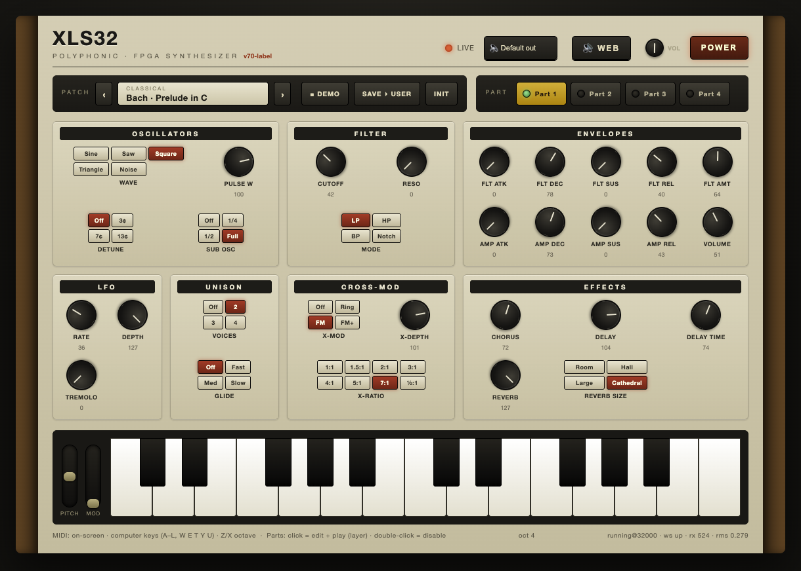
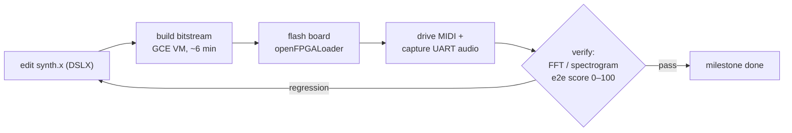
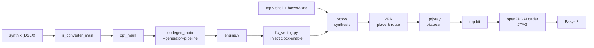
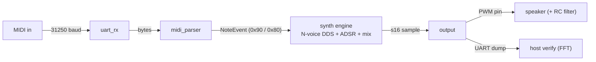
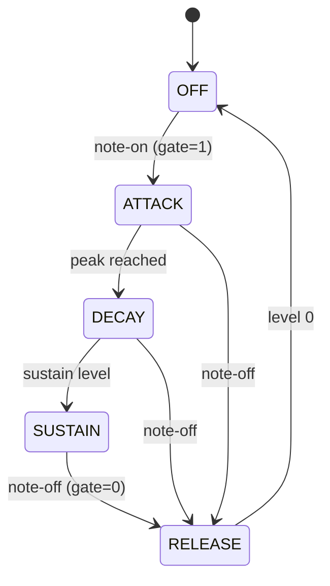
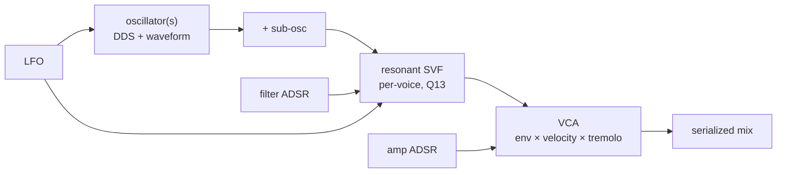
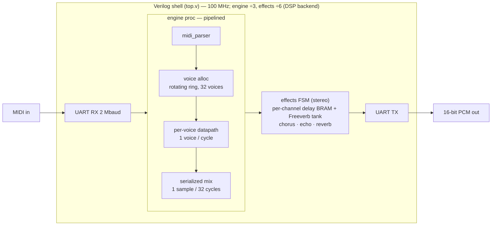

# XLS32 — a polyphonic HLS/FPGA synthesizer, built end-to-end with AI coding agents

A **[polyphonic](https://en.wikipedia.org/wiki/Polyphony_and_monophony_in_instruments) [MIDI](https://en.wikipedia.org/wiki/MIDI) synthesizer built entirely in [FPGA](https://en.wikipedia.org/wiki/Field-programmable_gate_array) fabric** — the oscillators,
filters, envelopes, and effects all run as digital logic on the chip, not as software on a CPU.
It's written in **[Google XLS (DSLX)](https://google.github.io/xls/)**, not hand-written [Verilog](https://en.wikipedia.org/wiki/Verilog), and targets a
**[Basys 3](https://digilent.com/reference/programmable-logic/basys-3/start)** board.

Because it was developed headlessly over a network, every feature is verified automatically
over USB. And **not a single line of it was written by hand**: the whole design was built by
[Claude Code](https://www.anthropic.com/claude-code) (Opus 4.8), the AI coding agent, through
[loop engineering](https://addyosmani.com/blog/loop-engineering/) — prompts in, a self-verifying
build → measure → revise loop out.



*The browser front-end (`webui/`): a Serum/Vital-style panel that drives the FPGA synth live over
USB — oscillators, filter, envelopes, LFO, unison, cross-mod, and effects, plus a 4-part
multitimbral selector, preset browser, and demo player.*

[](https://youtu.be/2ROr9M_ZlVY)

*▶️ **[Demo video](https://youtu.be/2ROr9M_ZlVY)** — the web UI driving the Basys 3 board live, with the synth's own audio (click to watch on YouTube).*

## At a glance

- **What it is** — a 32-voice polyphonic, 4-part multitimbral [subtractive](https://en.wikipedia.org/wiki/Subtractive_synthesis) synth: oscillators → per-voice resonant filter → VCA, with 2× ADSR, LFO, unison, cross-osc FM/ring-mod, and stereo effects.
- **Hardware** — a [Basys 3](https://digilent.com/reference/programmable-logic/basys-3/start) board (Xilinx [Artix-7](https://www.amd.com/en/products/adaptive-socs-and-fpgas/fpga/artix-7.html) `xc7a35t`), one 100 MHz clock. The whole synth is a literal circuit that computes one audio sample per tick.
- **Written in** — [Google XLS (DSLX)](https://google.github.io/xls/) compiled to Verilog, plus a thin Verilog shell for UART and the block-RAM effects. No hand-written datapath.
- **Play it** — a browser analog-style panel drives the board live over USB (or drive it from Python); MIDI in, 16-bit stereo audio out.
- **Built by AI** — every line written by [Claude Code](https://www.anthropic.com/claude-code) (Opus 4.8) through [loop engineering](https://addyosmani.com/blog/loop-engineering/): a self-verifying edit → build → measure loop, with 130+ scored end-to-end tests over USB.
- **Start here** — [Quickstart](#2-quickstart-guide) flashes the prebuilt board and plays it (no toolchain); the [Builder's guide](#3-builders-guide) builds from source; [Architecture](#4-architecture--design) is how it works. Build history + toolchain friction logs live in **[DEVELOPMENT.md](DEVELOPMENT.md)**.

## Contents

1. [Overview](#1-overview) — what it is, the spec table, background & rationale, the repo layout.
2. [Quickstart guide](#2-quickstart-guide) — flash the prebuilt board, run and play the web UI.
3. [Builder's guide](#3-builders-guide) — build the bitstream, flash, verify, simulate, test.
4. [Architecture & design](#4-architecture--design) — how the synth works today.

The milestone-by-milestone build history (M1 → M19 + Web UI) and the toolchain friction logs &
learnings live in the companion **[DEVELOPMENT.md](DEVELOPMENT.md)**.

---

# 1. Overview

## What it is

A polyphonic MIDI synthesizer implemented in Google XLS (DSLX) and run on a Basys 3
(Artix-7), built through open-source (F4PGA / openXC7) or Xilinx Vivado flows. The whole
datapath is expressed in DSLX; a thin Verilog shell handles UART and the block-RAM effects.

Because the board is developed remotely, **every feature is checked over the USB UART**: audio
is teed out as a sample stream and verified on the host by FFT / spectrogram, and MIDI is driven
in over the same port. Today it is a **32-voice** [subtractive](https://en.wikipedia.org/wiki/Subtractive_synthesis) synth (oscillators → per-voice
resonant filter → [VCA](https://en.wikipedia.org/wiki/Variable-gain_amplifier), envelopes, [LFO](https://en.wikipedia.org/wiki/Low-frequency_oscillation), effects), played headlessly from Python or live from a
browser **analog-style** front-end.

**Synth spec**

| Spec | Value |
|------|-------|
| **Polyphony** | 32 voices, time-multiplexed (1 voice/engine cycle) |
| **Multitimbral** | 4 parts — MIDI channels 1–4, each an independent patch |
| **Synthesis** | subtractive: oscillators → per-voice resonant filter → VCA, with 2× ADSR + LFO |
| **Oscillators** | 2 per voice (detuned dual) + sub-osc → up to 64 oscillators across the 32 voices; 5 waveforms (sine/saw/square/triangle/noise), PWM, cross-osc ring/FM/FM+ (8 ratios) |
| **Filter** | per-voice state-variable, resonant — LP / HP / BP / notch |
| **Envelopes** | 2× ADSR per voice (amplitude + filter) |
| **Modulation** | per-part LFO (vibrato + tremolo), pitch bend (±2 st), portamento/glide |
| **Effects** | stereo — chorus, ping-pong delay/echo, 8-comb Freeverb reverb |
| **Sample rate** | 32 kHz (DSP/Vivado backend) · 28 kHz (open soft-multiplier backend) |
| **Audio out** | 16-bit stereo PCM over USB UART (teed for host/verify); I2S DAC out (Pmod JB → UDA1334A, ~48.8 kHz) |
| **MIDI in** | USB-UART bridge @ 2 Mbaud; DIN @ 31.25 kbaud (built, HW-pending) |

**Build & dev tools**

| Tool | Value |
|------|-------|
| **HDL** | Google XLS (DSLX) → Verilog, plus a thin Verilog shell (UART + effects) |
| **Target** | Basys 3 — Xilinx Artix-7 `xc7a35t`, single 100 MHz clock |
| **Toolchain** | F4PGA (VPR) · openXC7 (nextpnr-xilinx) · Vivado — all scriptable |
| **FPGA resources** | Vivado (`xc7a35t`): ~50% LUTs · 26× DSP48E1 · 32× RAMB36E1 · ~42% FF |
| **Verification** | 130+ scored end-to-end cases over USB (FFT / spectrogram) |

## Background & rationale

*Why this design — the technologies, the trade-offs, and the build method. Skip to
[Quickstart](#2-quickstart-guide) if you just want to run it.*

### The technologies

Three technologies do the heavy lifting; here's what each is and why it's here.

- **Basys 3 — the hardware.** An entry-level FPGA development board built on a [Xilinx](https://en.wikipedia.org/wiki/Xilinx)
  **[Artix-7](https://www.amd.com/en/products/adaptive-socs-and-fpgas/fpga/artix-7.html)** chip (`xc7a35t`). An FPGA is a grid of reconfigurable logic you wire up into
  an arbitrary digital circuit, so the synth is a *literal circuit* clocked at 100 MHz that
  computes one audio sample per tick — sample-accurate timing no OS scheduler can jitter.
  The board is cheap, well-documented, and carries the USB-[UART](https://en.wikipedia.org/wiki/Universal_asynchronous_receiver-transmitter) + [JTAG](https://en.wikipedia.org/wiki/JTAG) needed to program it
  and stream data back.
- **Google XLS (DSLX) — the language.** An open-source **[High-Level Synthesis (HLS)](https://en.wikipedia.org/wiki/High-level_synthesis)**
  toolkit: you write hardware as *pure functions* and small stateful *procs* in a Rust-like
  language, and the compiler schedules them into a pipelined Verilog circuit.
- **The toolchain.** DSLX → Verilog (XLS) is placed & routed to a bitstream by any of three
  interchangeable backends: the fully open-source **[F4PGA](https://f4pga.org/)** ([yosys](https://yosyshq.net/yosys/) · [VPR](https://verilogtorouting.org/) · [Project X-Ray](https://github.com/f4pga/prjxray))
  or **openXC7** (nextpnr-xilinx), or **Xilinx Vivado** — the last builds the committed 32 kHz/DSP48
  bitstream. [`openFPGALoader`](https://trabucayre.github.io/openFPGALoader/) then flashes it over JTAG; the whole build is scriptable.

### Why XLS, not hand-written Verilog?

The DSP here — [DDS](https://en.wikipedia.org/wiki/Direct_digital_synthesis) oscillators, [ADSR](https://en.wikipedia.org/wiki/Envelope_(music)) math, a [state-variable filter](https://en.wikipedia.org/wiki/State_variable_filter), a mixer — is naturally
expressed as functions over numbers. In DSLX that's a few lines with unit tests that run in
milliseconds, and the compiler handles pipelining, register insertion, and bit-width narrowing.
The Verilog equivalent means hand-managing pipeline registers, valid/ready handshakes, and
[fixed-point](https://en.wikipedia.org/wiki/Fixed-point_arithmetic) widths yourself.

XLS trades some low-level control for a much tighter write-test loop. Where you *do* need that
control — the block-RAM effects, the clock-enable multicycle — a thin Verilog shell provides it.
This project is partly a candid stress test of that trade-off; the
[friction log](DEVELOPMENT.md#friction-logs--learnings) documents exactly where the seams leak.

### Why an FPGA, not Web Audio?

You *could* synthesize these voices in a few lines of JavaScript with the
[Web Audio](https://developer.mozilla.org/en-US/docs/Web/API/Web_Audio_API) API. The question is what that costs you. Pushing the DSP into hardware
buys three concrete things:
- **Deterministic, tiny latency.** The FPGA computes one sample per clock in a fixed-length
  pipeline, so the delay through the datapath is a fixed handful of clock cycles —
  sub-millisecond and *jitter-free*. Web Audio renders in fixed 128-sample blocks (an
  [AudioWorklet](https://developer.mozilla.org/en-US/docs/Web/API/AudioWorklet) quantum ≈ 2.7 ms at 48 kHz) stacked on top of the OS audio buffer (~10 ms on
  Windows, 30–40 ms on Linux) while sharing the CPU with the UI thread and the garbage
  collector — so its timing is best-effort and can glitch under load.
- **A dedicated, hard-real-time datapath.** This engine *time-multiplexes* its 32 voices
  through one pipeline — one voice per 100 MHz clock, all 32 finished inside every sample
  tick — so the per-sample work is a *fixed* cycle budget that always completes on time,
  regardless of the patch. (An FPGA *can* instead lay voices out as fully parallel spatial
  hardware; this design multiplexes one deep pipeline to fit F4PGA's area/timing budget, and
  still hits the deadline every sample with margin.) A CPU shares one core across the voices,
  the UI, and the OS, so its timing is best-effort and degrades as polyphony and load grow.
- **Customizable to the bit.** You design the exact circuit — arbitrary fixed-point widths,
  a bespoke oscillator/filter topology, sample-accurate modulation routing — none of it
  boxed into a fixed set of Web Audio nodes, and the same design can drive a [DAC](https://en.wikipedia.org/wiki/Digital-to-analog_converter), a [PWM](https://en.wikipedia.org/wiki/Pulse-width_modulation) pin,
  or hardware MIDI directly with no OS/driver round-trip. It's a real instrument, not a
  browser tab.

### Loop engineering with FPGA and AI coding agents

This whole board was brought up *remotely and headlessly* by an AI coding agent — no one
watching LEDs, listening to a speaker, or pressing buttons. That works because the project is
built for *loop engineering*: you design a tight, self-verifying edit → build → run → observe
cycle and let the agent iterate *inside* it, instead of hand-prompting each step.

The load-bearing ingredient is **autonomous verification** — every feature emits a signal a
machine can grade without human senses. Audio is teed out over USB and checked by
[FFT](https://en.wikipedia.org/wiki/Fast_Fourier_transform)/[spectrogram](https://en.wikipedia.org/wiki/Spectrogram); the end-to-end suite scores each test 0–100 and fails on a regression.
Give the agent that objective pass/fail and the loop runs unattended: change the DSLX, build,
flash, measure, read the number, revise.
- **Fast builds keep the loop tight.** A loop is only as good as its cycle time, and FPGA
  place-and-route is the slow step. Building F4PGA under x86 *emulation* on an Apple-Silicon
  Mac takes ~8–10 min per iteration; offloading the build to a **native x86 [GCE](https://cloud.google.com/products/compute) VM** in the
  cloud cuts it to ~6 min and frees the laptop — so the agent gets its verdict sooner and
  fits more iterations into an hour. (`scripts/remote_build.sh` pushes the sources up, builds
  on the VM, and pulls the bitstream + timing report back.)



### Design principle

One clock, one sample rate. Everything is either a **pure function** (the DSP
math — XLS's sweet spot) or a small **proc** (the stateful/streaming stages). No
generated clocks, no per-note clocks, no daisy-chained voice stealing. The synth
emits **one audio sample per sample-rate tick**.

## Repository layout

The project is grouped into topical subdirectories:
- **`rtl/`** — hardware sources: `synth.x` (DSLX), `top.v` (Verilog shell/wrapper),
  `basys3.xdc`, `tb.v` ([iverilog](http://iverilog.icarus.com/)), `gen_lut.py` (LUT + phase-increment generator),
  `fix_verilog.py` (post-codegen fixups); `engine.v` is generated here.
- **`scripts/`** — build/flash: `build.sh` (local [Docker](https://www.docker.com/)), `remote_build.sh` + `vmbuild.sh`
  (native x86 GCE build), `verify.sh` (flash + UART check), `spectro.sh` (.wav → PNG),
  `make_mp4.sh` (.wav → spectrogram MP4).
- **`host/`** — host tools: `uartaudio.py` (2 Mbaud + 16-bit host helper), `analyze.py`
  (envelope/pitch checks), `analyze_fft.py` ([DFT](https://en.wikipedia.org/wiki/Discrete_Fourier_transform) chord-peak check), `play.py` (host sends
  MIDI → FFT-verifies), `record_wav.py` (capture stream → .wav), `filter_demo.py`; and
  **`host/demos/`** — the per-milestone showcase scripts (`demo*.py`).
- **`webui/`** — the browser synth UI (`server.py` bridge, `synthspec.py` CC map/presets,
  `static/` UI, a Serum/Vital-style **preset browser**, and a **DEMO player** — 4 authored
  4-part songs (one per genre: classical/techno/pop/ambient) in `static/demos.json`, played live
  to the board, with a per-song "replace" that composes a fresh one on the fly (`/api/demo`). Classical
  = public-domain themes; techno/pop/ambient use a **theory-aware composer** ([MidiGen](https://pypi.org/project/midigen-lib/)):
  an in-scale random-walk melody snapped to the bar's chord, over voice-led Roman-numeral
  extended-chord harmony (`presetgen/build_demos.py`). While a demo plays, its 4 part tones load
  into the multitimbral editor — tweak each part live and **💾 TONES** saves them straight back
  into `static/demos.json` (`/api/demo_save`), which is the **single source of truth** for the
  bank (re-running `build_demos.py` overwrites tone edits). The matched preset banks live here as
  `presets_*.json`. See the [Web UI](DEVELOPMENT.md#web-ui--a-browser-synth-panel-done-hardware-verified) and
  [Preset banks](DEVELOPMENT.md#preset-browser--ai-matched-preset-banks-inverse-synthesis) sections.
- **`presetgen/`** — offline **inverse-synthesis** preset generator: a NumPy/numba software
  model of the engine (`engine.py`), a multi-resolution spectrogram loss (`loss.py`), the
  CMA-ES search (`search.py`), target sources (`nsynth.py`, `freesound.py`), a sim↔board
  calibration probe (`calibrate.py`), and the orchestrator (`build_presets.py`). See
  [Preset banks](DEVELOPMENT.md#preset-browser--ai-matched-preset-banks-inverse-synthesis).
- **`test/`** — the end-to-end hardware test suite: drives the board over USB, scores the
  captured audio (0–100), and builds a captioned report video. See [§3](#3-builders-guide) and
  `test/README.md`.
- **`firmware/`** — a committed prebuilt bitstream (`top.bit`) so a board can be flashed **without
  building** (see [Set up a board without building](#set-up-a-board-without-building)).
- **`docs/`** — spectrogram PNGs; **`media/`** — captured .wav/.mp4/screenshots (gitignored);
  **`build/`** — bitstream build output; **`webui/certs/`** — local TLS cert (both gitignored).

---

# 2. Quickstart guide

Get a board making sound **without the toolchain** — flash the prebuilt bitstream, run the web
UI, and play. Commands are shown from the **project root**; Python tools run under
[`uv`](https://docs.astral.sh/uv/) (`pyproject.toml` pins the deps; `uv sync` once to set up).

### Prerequisites & setup (macOS) — running/demoing the synth

To **play or demo** the synth you need a **flashed Basys 3 board** plus these tools:

- **[`uv`](https://docs.astral.sh/uv/)** (Python env + deps): `curl -LsSf https://astral.sh/uv/install.sh | sh`
- **[`openFPGALoader`](https://trabucayre.github.io/openFPGALoader/)** (flash the board over USB-JTAG): `brew install openfpgaloader`
- A **Basys 3** board (Xilinx `xc7a35t`) + USB cable. macOS ships the FTDI serial driver, so the
  board enumerates as `/dev/cu.usbserial-*` automatically — nothing else to install.

Then, once per checkout:
```bash
git clone <repo-url> && cd <repo-dir>
uv sync                     # runtime deps only (all have prebuilt wheels — works on any Mac)
```

> `uv sync` installs everything needed for **WEB mode and LOCAL audio-out**. Two extras are opt-in:
> `--extra localmidi` adds `python-rtmidi` for reading a MIDI keyboard **plugged into the host** in
> LOCAL mode (it builds from C++ source, so skip it on locked-down machines — e.g. Santa on corp
> Macs blocks the compiler; WEB mode and on-screen/computer/Web-MIDI keyboards still work).
> `--extra presetgen` adds the preset-generation toolchain (`dawdreamer` etc.), only for dev work.

> **A prebuilt bitstream ships in the repo** at [`firmware/top.bit`](firmware/top.bit.md), so you can
> flash a board **without building** (no Vivado / F4PGA — just `openFPGALoader`). See
> [Set up a board without building](#set-up-a-board-without-building) below. (The build output
> `build/top.bit` is gitignored; `firmware/top.bit` is a committed copy — regenerate it with
> [Build the bitstream](#build-the-bitstream) / [Build in the cloud](#build-in-the-cloud-native-x86-gce-vm-faster)
> then `cp build/top.bit firmware/top.bit`.)

The build turns DSLX into a bitstream through three independent tools (XLS → F4PGA → loader):



### Set up a board without building

The fastest path — flash the **committed** [`firmware/top.bit`](firmware/top.bit.md) with
`openFPGALoader`; no toolchain, no rebuild. Plug the Basys 3 in over USB, then:

```bash
# A) Persistent — write the onboard SPI flash (survives power cycles, boots standalone):
openFPGALoader -b basys3 -f firmware/top.bit
#    then set the Basys 3 mode jumper JP1 to QSPI so it loads from flash on power-up.

# B) Volatile — load SRAM directly (quicker, but lost on power-off / unplug):
openFPGALoader -b basys3 firmware/top.bit
```

Verify it's alive (should print the Artix-7 IDCODE):
```bash
openFPGALoader -b basys3 --detect     # idcode 0x362d093 / xc7a35
```

Notes:
- **SRAM is volatile.** After any power-cycle or USB re-enumeration the SRAM config is wiped and the
  board goes silent (the web UI shows `frames: 0`) — just re-run option B, or use option A so it
  reloads itself from flash. For a demo machine, prefer **A + JP1=QSPI**: then it needs only
  **`uv` + this repo**, no `openFPGALoader` and no rebuild.
- **Power:** the board runs off USB. Some laptops (e.g. a MacBook Air over a single USB-C hub) don't
  supply enough current — if the board's power LED stays dark, use a powered USB hub or the board's
  external supply.
- **JTAG vs UART share the FTDI.** Free the serial port before flashing (`pkill -f webui/server.py`),
  then restart the server after — the audio stream (UART) and JTAG programming use the same USB chip.

Then jump to [Run the web UI](#run-the-web-ui-browser-synth-panel) to play it.

### Run the web UI (browser synth panel)
```bash
uv run python webui/server.py             # serves http://localhost:8765, owns the serial port
```
Open the URL, click **POWER** (starts audio + the [WebSocket](https://developer.mozilla.org/en-US/docs/Web/API/WebSockets_API)), and play with the on-screen
keyboard, your computer keys, or a [Web-MIDI](https://developer.mozilla.org/en-US/docs/Web/API/Web_MIDI_API) controller. Hit **▶ DEMO** for the built-in
songs (sequenced on the server for steady timing). The server holds the serial port, so
stop it before running the `host/` tools above. See the
[Web UI](DEVELOPMENT.md#web-ui--a-browser-synth-panel-done-hardware-verified) section for the architecture.

> **Demoing on one Mac** (board + browser on the same machine): `http://localhost:8765` is a
> secure context, so audio works with **no certificate**. Just `uv run python webui/server.py`
> and open the URL. To open the UI from **other devices** on the network, serve HTTPS (Web Audio
> needs a secure context off-localhost) — point `SSL_CERT`/`SSL_KEY` at a (self-signed is fine)
> cert and bind all interfaces:
> ```bash
> HOST=0.0.0.0 SSL_CERT=cert.pem SSL_KEY=key.pem uv run python webui/server.py
> ```

The **🔊 WEB / 💻 LOCAL** toggle (next to POWER) picks where audio + live MIDI run:

- **WEB** streams PCM to the browser — play from any device on the network.
- **LOCAL** makes the *host* (the machine running `server.py`, wired to the board) play the audio on
  its own output device (pick which from the dropdown next to the toggle — switchable live) and read
  a MIDI keyboard plugged into it directly. This skips the WebSocket + AudioWorklet round-trip for
  **much lower play latency**; the browser stays the control + demo surface.

LOCAL audio-out works out of the box (`sounddevice`, a runtime dep). Reading a host-plugged MIDI
keyboard additionally needs `python-rtmidi` (`uv sync --extra localmidi`); without it, LOCAL still
plays audio — you just drive it from the browser (on-screen/computer/Web-MIDI keys or the demos).
The toggle hides itself entirely if no host audio backend is present.

### Record a demo video (web UI + board webcam + sound)

Compose one MP4 from the **web UI** (screen), the **board** (a webcam, picture-in-picture), and the
synth's **own audio** (a pristine digital capture from the server — not a room mic):

```bash
# server running + board connected; grant Terminal Screen-Recording + Camera perms once.
scripts/demo_video.sh demo.mp4            # records ~45s, muxes the board's audio
# find your device indices with:  ffmpeg -f avfoundation -list_devices true -i ""
SCREEN_IDX=2 CAM_IDX=0 DUR=60 scripts/demo_video.sh bach.mp4
```

The script switches the server to LOCAL play, records the screen + webcam, and pulls the exact
board output via `/api/capture`; when it prints **NOW**, open **DEMO** in the browser and click the
song (e.g. *Bach · Prelude in C*). It muxes video + audio at the end (`AV_OFFSET` tunes A/V drift).

> **GUI alternative — [OBS](https://obsproject.com/):** add three sources — *macOS Screen Capture*
> (grabs the web UI **and** desktop audio in one), a *Video Capture Device* (the webcam) sized as a
> corner overlay, and record straight to MP4. Best when you want to frame the shot by hand.

# 3. Builder's guide

Build the bitstream from the DSLX sources, then flash, verify, simulate, and test. Commands are
shown from the **project root** (Python tools run under [`uv`](https://docs.astral.sh/uv/)).

### Build the bitstream
```bash
scripts/build.sh    # DSLX codegen (XLS) + F4PGA -> build/top.bit  (local Docker, ~8–10 min)
```
Self-contained: pulls the XLS release + an [Ubuntu](https://ubuntu.com/) rootfs and clones `f4pga-examples` into
`/tmp` on first run (Docker `--platform linux/amd64`, emulated on Apple Silicon).

> **Codegen note:** emit **plain Verilog** (`--use_system_verilog=false`) — F4PGA's yosys
> rejects the [SystemVerilog](https://en.wikipedia.org/wiki/SystemVerilog) `'{...}` array-assignment XLS uses for the LUT. (`build.sh`
> already passes this.)

### Build in the cloud (native x86 GCE VM, faster)
`scripts/build.sh` runs F4PGA under amd64 **emulation** on Apple Silicon (~8–10 min). A
**native x86 GCE VM** builds in ~6 min and frees the Mac:
```bash
STAGES=48 WCT=48 scripts/remote_build.sh    # push sources → build on the VM → pull top.bit + timing back
```
`remote_build.sh` scp's `rtl/{synth.x,top.v,basys3.xdc,fix_verilog.py}` + `scripts/vmbuild.sh`
to `~/build/` on the VM (flat), runs `vmbuild.sh` (native codegen + F4PGA in Docker), and pulls
`build/top.bit` + `build/timing.txt`. Then flash locally as above.

**Backend selection (`BACKEND=`).** Three P&R backends are supported — see the
[migration learnings](DEVELOPMENT.md#backends-for-dsp48bram-openxc7-nextpnr-vs-vivado--the-migration-learnings):
```bash
BACKEND=vivado   STAGES=48 WCT=48 scripts/remote_build.sh   # Vivado ML Standard: DSP48 + BRAM (recommended)
BACKEND=nextpnr  STAGES=48 WCT=48 scripts/remote_build.sh   # openXC7 (yosys+nextpnr-xilinx): open, BRAM, no DSP
BACKEND=f4pga    STAGES=48 WCT=48 scripts/remote_build.sh   # F4PGA/VPR (default; soft mult, no DSP/MMCM)
```
- **`vivado`** (`scripts/vmbuild_vivado.sh` + `rtl/build_vivado.tcl`) infers **26 DSP48E1 + 32 RAMB36E1** (~50% LUTs),
  critical path ~18.5 ns → the committed RTL runs **÷3 / 32 kHz**. Needs Vivado under `/opt/Xilinx`.
- **`nextpnr`** (`scripts/vmbuild_nextpnr.sh`, `rtl/basys3_nextpnr.xdc`, `regymm/openxc7` image) is
  fully open, infers BRAM, prints a real Fmax — but can't route the DSP `CARRYCASCIN` pin.
- **`f4pga`**/`nextpnr` (soft multipliers, ~40 ns) require the **÷4 / 28 kHz** variant (revert the
  `top.v` clock-enable + `synth.x` `BASE_INC` to the 28 kHz values); the committed defaults target
  the DSP (Vivado) backend.

**Committed Vivado build — resource utilization** (`xc7a35t`, from `report_utilization`, pulled back as `build/util.rpt`):

| Resource | Used | Fabric | % | Note |
|---|---:|---:|---:|---|
| Slice LUTs | **10,483** | 20,800 | **50.4%** | ROMs/muxes inferred into BRAM |
| Slice Registers | 17,445 | 41,600 | 41.9% | headroom |
| F7 / F8 muxes | 297 / 18 | — | ~2% | vs **6,685 MUXF6** on F4PGA — mux trees collapsed |
| **Block RAM** | **32× RAMB36 + 1× RAMB18** | 50 | **65%** | binding resource (the 16K×16 effects/reverb buffers) |
| DSP48E1 | **26** | 90 | 28.9% | every `×` inferred off the fabric |
| Engine critical path | **~18.5 ns** | — | — | runs ÷3 (30 ns budget) → true **32 kHz** |

On F4PGA (soft multipliers, no BRAM/DSP inference) the same design is instead **slice-bound (~90%)** —
see [FPGA resource usage](DEVELOPMENT.md#fpga-resource-usage-f4pga-vs-vivado).

**One-time VM setup** (set your VM name/zone/project via the `GCE_VM` / `GCE_ZONE` /
`GCE_PROJECT` env vars, or edit the defaults near the top of `remote_build.sh`):
a native-x86 Ubuntu VM with **Docker**, the **XLS release** unpacked at
`~/xls/xls-<tag>-linux-x64`, `f4pga-examples` cloned at `~/f4pga-examples`, and F4PGA's
`common.mk` patched to **tee** `route_timing.log` (F4PGA hides VPR's report; this makes one
route pass yield the bitstream *and* `Final critical path delay`). The VM is not provisioned by
this repo — create/start it before running `remote_build.sh`.

> **Measure timing.** F4PGA hides VPR's report; `remote_build.sh`/`vmbuild.sh` tee it so a
> build yields `Final critical path delay`. Never trust a build you haven't measured — see
> [§6](DEVELOPMENT.md#friction-logs--learnings).

### Flash & verify
```bash
openFPGALoader -b basys3 build/top.bit   # flash over JTAG (FT2232 channel A)
scripts/verify.sh                         # flash + read UART, check sine period + ADSR envelope
uv run host/play.py                       # send MIDI note-ons, FFT-verify the pitches (default Amaj7)
uv run host/play.py 60 64 67              # C major
uv run host/play.py --wave saw 69         # A4 sawtooth — FFT shows the harmonic stack
```

### Simulate (no board)
```bash
iverilog -g2012 -o /tmp/s.vvp rtl/tb.v rtl/engine.v && vvp /tmp/s.vvp | grep '^S ' | uv run host/analyze.py
```

### Record & listen
Each UART byte stream *is* the audio (8-bit PCM at M1's 4 kHz; 16-bit LE at 32 kHz from M4
on). Capture and play:
```bash
uv run host/record_wav.py 6 capture.wav   # record 6 s from the board -> capture.wav
afplay capture.wav                         # play on the Mac (or open the .wav)
```

### Spectrograms & video (verify sound visually)
```bash
scripts/spectro.sh capture.wav            # capture.wav -> spectrogram PNG
scripts/make_mp4.sh demo.wav              # demo.wav -> MP4 with a scrolling spectrogram
```

### Run the e2e test suite
```bash
pkill -f webui/server.py                   # free the serial port first
uv run python test/run_tests.py            # reflash + full suite + captioned video + scored report
uv run python test/run_tests.py --smoke    # fast subset;  --only basic|integration|stress ; --no-reflash --skip-video
```
Drives the real board over USB and grades the captured audio for every feature (basic),
typical combinations (integration), and boundary conditions (stress) — 130+ cases across the
three groups, including the full effects chain: **echo/delay** (CC95 depth + CC82 time),
**chorus** (CC94 depth), and the **8-comb Freeverb reverb** (CC93 wet + CC91 size), each
verified for an audible tail that **decays without railing** (`stress_fx_tail`). Outputs to
`test/out/`: `report.md`/`report.json` (0–100 per test + overall grade), `report.mp4` (one
video, each test preceded by a caption card + its spectrogram), and per-test `.wav`s. See
`test/README.md` for details.

> **Testing note:** the **engine state persists across UART sessions** — reflash for a
> deterministic voice-allocation / `cinc` when verifying glide or startup behavior. The port
> also re-enumerates briefly on close, so `find_port` retries for a few seconds. The board's
> 1 Mbaud MIDI RX drops the occasional CC under bursty traffic — the suite handles this with
> best-of-N retry (keep the highest-scoring take).

---

# 4. Architecture & design

This section describes how the shipped synth works. The **conceptual model** below is the
original M1 plan; the actual engine evolved into a time-multiplexed pipeline (M6a) with
per-voice filtering (M6b) and block-RAM effects in the shell (M13–M15). Milestone sections
in [§4](DEVELOPMENT.md#development-history-milestones) carry the detailed rationale; this section is the
consolidated current view.

## Signal chain (conceptual model)



**Pure functions (the easy majority)**
- `note_to_inc(note) -> u32` — DDS phase increment per MIDI note (`u32[128]` LUT).
- `sine(idx: u8) -> s16` — quarter/full sine `s16[256]` LUT via top phase bits.
- `adsr(voice, params) -> voice` — one envelope step (arithmetic + `match` on stage).
- `mix(voices) -> s16` — `for`-reduce sum + scale.

**State types**
```rust
enum Env { OFF, ATTACK, DECAY, SUSTAIN, RELEASE }
struct Voice { note: u7, phase: u32, inc: u32, level: u16, env: Env, gate: bool }
struct Synth { voices: Voice[N] }        // N parametric: 8, 16, …
```

The `Env` enum is a per-voice state machine, stepped once per sample tick:



**Procs (the stateful minority)**
1. `uart_rx` — MIDI pin bit-stream → `u8` bytes (oversampled RX).
2. `midi_parser` — bytes → `NoteEvent{on/off,note,vel}`; state `(count,status,data1)`.
3. `synth` — per sample tick: `recv_non_blocking` a NoteEvent, allocate/release a
   voice (first free voice), run ADSR + DDS on all voices, `mix`, emit one sample.

**Output** — 1-bit PWM / [sigma-delta](https://en.wikipedia.org/wiki/Delta-sigma_modulation) to a pin (+ RC filter → speaker); no external
DAC. The same samples are teed over UART for headless verification.

> The shipped `Voice` struct grew well beyond the sketch above (per-voice filter state,
> filter envelope, glided increment, [unison](https://en.wikipedia.org/wiki/Unison) slot, …); see [M6b](DEVELOPMENT.md#milestone-6b--per-voice-resonant-filter-done-hardware-verified)
> and [M15](DEVELOPMENT.md#milestone-15--unison-done-hardware-verified). MIDI-DIN input (M7) and the I2S DAC
> output (M8) are **built and timing-closed but not yet hardware-tested** (parts on order) — see
> [M7+M8](DEVELOPMENT.md#milestone-7--8--hardware-io-din-midi-in--i2s-dac-out-built-hardware-pending); audio and
> MIDI otherwise flow over the USB UART.

## The shipped engine (M6a onward)

The core is a **time-multiplexed pipelined voice engine** — an XLS `proc` built with
`--generator=pipeline`. Recurrent state is `Voice[32]` + a mix accumulator + the MIDI
parser. **One voice is processed per engine cycle; a sample is emitted every 32 cycles.**
Voices live in a **rotating ring** so the "current" voice is always at slot 0 →
constant-index read/write, avoiding the 32:1 dynamic mux that was the original timing wall.
MIDI in / audio out are ready/valid **channels** the Verilog shell drives. Per-voice, the
datapath is: oscillator(s) → optional sub-osc → per-voice resonant SVF → VCA (envelope ×
velocity × [tremolo](https://en.wikipedia.org/wiki/Tremolo)) → serialized mix. Full detail: [M6a](DEVELOPMENT.md#milestone-6a--pipelined-voice-engine-hi-fi-restored-done-hardware-verified),
[M6b](DEVELOPMENT.md#milestone-6b--per-voice-resonant-filter-done-hardware-verified).

The per-voice datapath (run once per engine cycle, one voice at a time):



## The Verilog shell & block-RAM effects

`rtl/top.v` is a thin shell. It runs the UART at 2 Mbaud (MIDI in on `RsRx`, audio out on
`RsTx`), drives the engine's clock-enable and ready/valid handshakes, and hosts the **stereo
effects** downstream of the engine.

The voice engine is mono; **the effects create the stereo image**. The dry signal sits centered
(identical L/R) and each wet is decorrelated. Per-channel **16K×16-bit circular delay buffers**
(synchronous read+write) feed [chorus](https://en.wikipedia.org/wiki/Chorus_%28audio_effect%29) (L/R LFO taps in anti-phase) and echo/delay (feedback
ping-pongs L↔R); a separate per-channel **reverb tank** holds a full [Freeverb](https://en.wikipedia.org/wiki/Reverberation) — **8 combs +
4 all-pass per channel**, with the Freeverb stereo spread (right-channel delays = left + 23 samples).

Each effect is **depth-gated** (on when its knob > 0), so there's no mode byte: chorus depth (CC94),
echo/delay depth (CC95) + time (CC82), and reverb wet (CC93) + room size (CC91) are sniffed from the
MIDI stream by the shell. (The old CC83 dry/chorus/delay/both mode is now unused.) Full detail:
[M13](DEVELOPMENT.md#milestone-13--effects-chorus--delay-via-block-ram-done-hardware-verified),
[M14](DEVELOPMENT.md#milestone-14--reverb-done-hardware-verified).

> **Effects run on their own clock-enable, slower than the engine's.** The effects FSM uses only
> ~17 of the ~3,500 clocks per sample, so it advances on a ÷6 enable (`ce8`, 60 ns/step) while the
> engine runs ÷3 (30 ns) on the **DSP/Vivado backend** — there the reverb's comb-feedback multiply
> maps to a **DSP48**, so it closes timing with margin and **reverb is fully working and
> hardware-verified** (stereo, all room sizes). Earlier, under the F4PGA soft-multiplier backend,
> that multiply railed on the congested 4-part fabric (the logic is provably correct in a full-RTL
> iverilog sim, `rtl/tb_fx_stub.v` — it was a synthesis/timing artifact, not a logic bug), so
> reverb was temporarily pulled from the UI; the DSP48 fixed it. On the soft-mult fallback the
> effects run ÷8 (80 ns) and reverb still rails, but chorus/echo are clean there.

End to end, the shell wraps the engine and the effects between the two UART directions:



## Clocking: the clock-enable multicycle

F4PGA has no DSP48, no BRAM inference for XLS's async ROMs, and no MMCM/[PLL](https://en.wikipedia.org/wiki/Phase-locked_loop), and it won't
let logic drive a BUFG — so you can neither synthesize nor divide the clock, and the design
floors at ~15–34 ns depending on features. Everything therefore runs on the 100 MHz clock
but the engine **advances every Nth cycle via a global clock-enable** (`ce`, injected by
`rtl/fix_verilog.py`), giving each register path N×10 ns. N has grown with features:
÷2 (M6a, 50 MHz) → ÷3 (M6b, ~33 MHz) → **÷4 (M14/M15, 40 ns budget)**. Throughput is
unaffected (the actual initiation interval is far below the budget). The full rationale and
the "timing must be reasoned, not read from the (failing) VPR report" caveat are in
[§6 frictions](DEVELOPMENT.md#integrating-basys-3--f4pga--xls-the-frictions).

> **Real-time streaming rate: 28 kHz at ÷4, true 32 kHz at ÷3 (DSP backend).** At ÷4 the per-sample
> audio-pull + effect FSM + TX chain overruns the 32 kHz sample budget, so the engine back-pressures
> and streams only ~28–30 k samples/s — clean, but ~1 semitone flat in real time. (Recorded captures
> play fine at 32 kHz, which is why it hid so long.) The soft-multiplier fix ran the DSP at **28 kHz**
> (`SAMPDIV=3571`, `BASE_INC` rescaled).
>
> With the **DSP48 (Vivado) backend** the engine critical path drops ~40 → ~19.5 ns, so it runs
> **÷3 (30 ns budget)** — fast enough to sustain a **true 32 kHz** stream with correct pitch
> (`SAMPDIV=3125`, `BASE_INC` at 32 kHz, `SR=32000`). ÷2 also builds but latches the SVF under stress
> (~0.5 ns margin), so ÷3 is the reliable choice. The filter/reverb constants were always
> 32 kHz-native, so they're now correct too. The soft-multiplier F4PGA/nextpnr fallbacks stay at
> ÷4 / 28 kHz.

## MIDI CC map (current)

The engine parses `0x9n` note-on / `0x8n` note-off / `0xBn` CC / `0xE0` pitch bend. The **channel
nibble selects the part** (0–3) — see [Multitimbral](#multitimbral--4-parts-done-hardware-verified). Sound-shaping is via
CC, applied **per part** (each channel has its own patch, including its own LFO oscillator —
CC76 rate is per-part). Only the shell effects (CC82/91/93/94/95, post-mix) are global:

| CC | Parameter | CC | Parameter |
|----|-----------|----|-----------|
| 1  | [vibrato](https://en.wikipedia.org/wiki/Vibrato) depth (mod wheel) | 74 | filter cutoff |
| 5  | [portamento](https://en.wikipedia.org/wiki/Portamento) / glide | 75 | pulse width (PWM) |
| 7  | volume (per-part output level) | 90 | debug stream select (dev) |
| 20 | amp attack | 76 | LFO rate |
| 21 | amp decay | 77 | LFO depth |
| 22 | amp sustain | 78 | detune (dual osc) |
| 23 | amp release | 79 | filter-env depth |
| 24 | filter-env attack | 80 | unison (off/2/3/4) |
| 25 | filter-env decay | 82 | **delay/echo time** (~4–508 ms) |
| 26 | filter-env sustain | 83 | *(unused — effects are depth-gated)* |
| 27 | filter-env release | 91 | reverb size (room/hall/large/cathedral) |
| 70 | waveform (sine/saw/square/tri/noise) | 92 | tremolo depth |
| 71 | resonance | 93 | **reverb wet** (8-comb Freeverb send) |
| 72 | filter mode (LP/HP/BP/notch) | 94 | **chorus depth** |
| 73 | sub-osc level | 95 | **delay/echo depth** |
| 85 | cross-osc mode (off/ring/FM/FM+) | 86 | cross-osc depth |
| 87 | cross-osc ratio (8: 1/1.5/2/3/4/5/7/½) | 0xE0 | pitch bend (±2 st) |

`webui/synthspec.py` is the machine-readable source of truth for this map (served to the
browser at `/api/spec`); `host/uartaudio.py` has the matching `set_*` helpers. The map grew
milestone by milestone — the historical "CC map so far" snapshots live in the M10/M11/M13
sections. ADSR (CC20–27) was added for the [Web UI](DEVELOPMENT.md#web-ui--a-browser-synth-panel-done-hardware-verified).

## Multitimbral — 4 parts (done, hardware-verified)

The engine is **4-part multitimbral**: **MIDI channels 1–4** (low 2 bits of the channel nibble)
select one of 4 independent **parts**, each with its own patch. `rtl/synth.x` factors the patch
into a `Part` struct (`parts: Part[4]` in `Eng`), and each `Voice` carries a 2-bit `part`.

Note-on tags voices with the event's channel (and uses that part's unison); note-off matches
**note *and* part** (so a note-off on ch1 can't cut ch2); CCs/pitch-bend route to the event's part
(`apply_cc`). The processed voice reads **its** part's patch through a 4:1 mux before
`process_voice`.

The **32-voice pool is shared/dynamic** across parts. Each part has its **own LFO oscillator**
(phase + CC76 rate), so the 4 timbres can wobble at independent speeds. Global (not per-part): the
noise LFSR, and the shell effects (chorus/echo/reverb are post-mix, one for the whole mix).
Everything else is per-part, including vibrato/tremolo/LFO-depth and pitch bend.

The web UI has a **Part 1–4 selector**: the selected part is what the on-screen/computer keyboard
plays and the knobs edit; each part keeps its own patch; all 4 play simultaneously from an
external controller/DAW on channels 1–4.

Verified on hardware: the same note on two channels renders two distinct timbres (e.g. 320 Hz
dark sine vs 2.4 kHz bright saw), and a note-off on one part doesn't cut another.

> **⚠ Timing note — 4 parts is at the edge (soft-multiplier backends only).** On the committed
> **Vivado/DSP48 build (÷3)** this is a non-issue: the path sits at ~19.5 ns with ~10 ns of margin
> (see [Clocking](#clocking-the-clock-enable-multicycle)). It only bites the **F4PGA / nextpnr ÷4**
> backends, where the 4× patch state + per-voice part mux push the SVF path to
> `Final critical path delay ≈ 40.2 ns` — **~0.2 ns over** the 40 ns budget. (The `f×band` multiply
> is already trimmed to 12-bit; the residual is mux congestion, not the multiply.)
>
> Unlike a normal setup miss (a 1-sample glitch), a violation there can land on a *control* path and
> **wedge the engine → no UART output → dead/silent** (observed: one STAGES=48 placement came out
> dead, another streamed fine). So on those backends **which build works is placement roulette** — a
> given bitstream is either fine or dead. **Treat soft-mult rebuilds as needing a re-check** (does it
> stream?). For a strictly-reliable soft-mult build, **drop to 2 parts** (halves the mux →
> comfortably under 40 ns with full per-part everything), or reduce the per-part field count (e.g.
> shared LFO).
