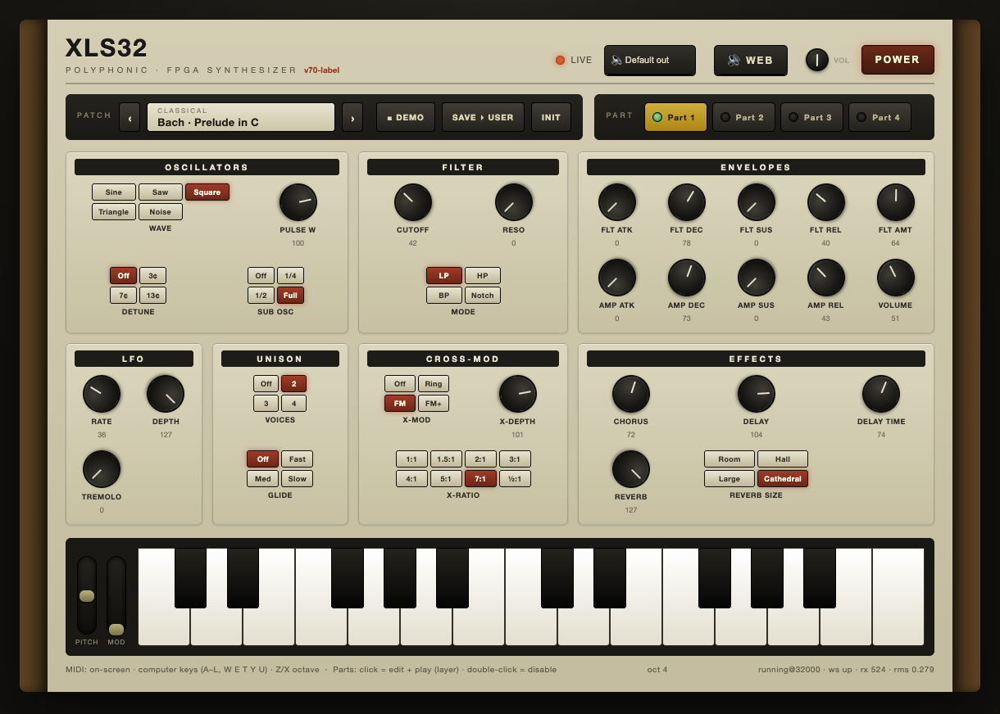
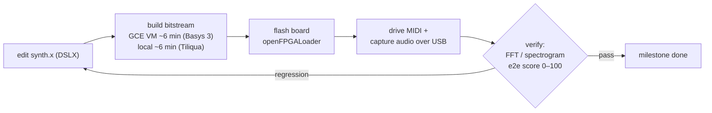
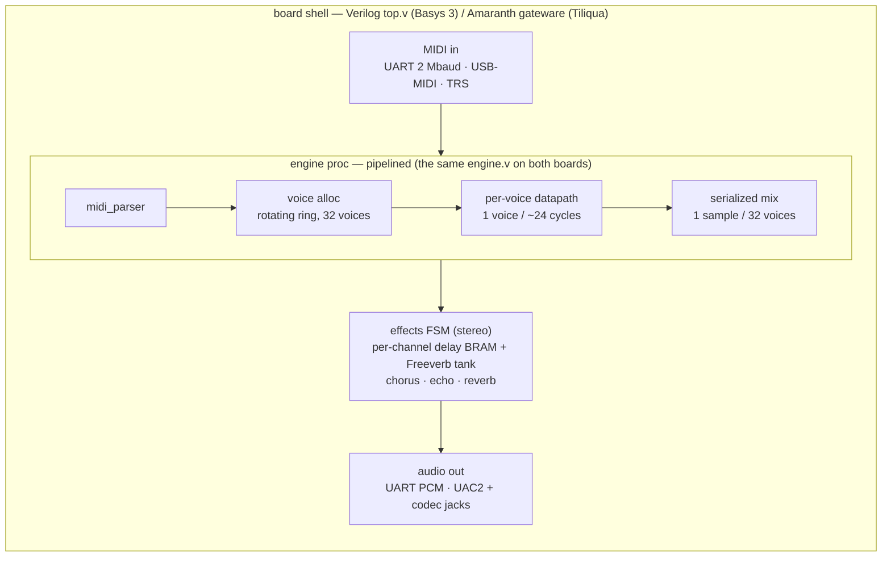
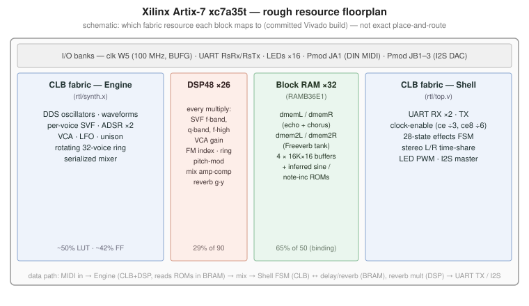

# XLS32 — a polyphonic HLS/FPGA synthesizer, built end-to-end with AI coding agents

A **[polyphonic](https://en.wikipedia.org/wiki/Polyphony_and_monophony_in_instruments) [MIDI](https://en.wikipedia.org/wiki/MIDI) synthesizer built entirely in [FPGA](https://en.wikipedia.org/wiki/Field-programmable_gate_array) fabric** — the oscillators,
filters, envelopes, and effects all run as digital logic on the chip, not as software on a CPU.
It's written in **[Google XLS (DSLX)](https://google.github.io/xls/)**, not hand-written [Verilog](https://en.wikipedia.org/wiki/Verilog), and the same engine runs on
**two very different boards**: a **[Basys 3](https://digilent.com/reference/programmable-logic/basys-3/start)** (Xilinx Artix-7) and an **[apf.audio Tiliqua](https://apf.audio/)**
Eurorack module (Lattice ECP5).

Because it was developed headlessly over a network, every feature is verified automatically
over USB. And **not a single line of it was written by hand**: the whole design was built by
[Claude Code](https://www.anthropic.com/claude-code) (Opus 4.8), the AI coding agent, through
[loop engineering](https://addyosmani.com/blog/loop-engineering/) — prompts in, a self-verifying
build → measure → revise loop out.



*The browser front-end (`webui/`): a Serum/Vital-style panel that drives the FPGA synth live over
USB — oscillators, filter, envelopes, LFO, unison, cross-mod, and effects, plus a 4-part
multitimbral selector, preset browser, and demo player.*

[](https://youtu.be/2ROr9M_ZlVY)

*▶️ **[Demo video](https://youtu.be/2ROr9M_ZlVY)** — the web UI driving the Basys 3 board live, with the synth's own audio (click to watch on YouTube).*

### Hear it

Two of the built-in 4-part demo songs, played by the board and recorded off its own audio output
over USB — no room mic, no software instruments, every note is the FPGA's logic. The picture is a
scrolling spectrogram of that same signal.

[](https://youtu.be/wpsqDLXTggE)

*▶️ **[Bach · Prelude in C](https://youtu.be/wpsqDLXTggE)** — 4 parts, 1:51 (click to listen on YouTube).*

[](https://youtu.be/tL7N2eV9pn8)

*▶️ **[Saint-Saëns · Le Cygne](https://youtu.be/tL7N2eV9pn8)** — 4 parts, 2:18 (click to listen on YouTube).*

*(Both MP4s also live in [`docs/assets/`](docs/assets/); they were captured from the web UI's demo
player and rendered with [`make_mp4.sh`](scripts/make_mp4.sh).)*

## ▶ Quick start — play it

Getting a **Tiliqua** singing is three separate things, and they ask for different equipment —
which is why "what do I need?" has no one answer. **Flashing** happens once and wants Chrome.
**Playing** needs no computer at all. **The panel** is optional, and is the only part that rules
any device out. **No toolchain, no terminal, no clone of this repo** at any point.

**The hardware, whichever route you take:** a **Tiliqua R5** in a powered Eurorack case, a **USB-C
cable**, and something to listen on — `out0`/`out1` are Eurorack line level, hotter than a
headphone jack expects, so go through a mixer, an audio interface or a Eurorack output module.

### 1 · Flash it — once, from Chrome

1. **Download one file** —
   **[`xls32-r5.tar.gz`](https://github.com/kazunori279/xls32-fpga-synth/raw/main/boards/tiliqua/firmware/xls32-r5.tar.gz)**
   (430 KB). That *is* the synth: the FPGA bitstream, plus the clock settings the module has to be
   given at boot.
2. **Write it to the module** — connect USB-C to the module's **`dbg`** port, open
   **[tiliqua-webflash](https://apfaudio.github.io/tiliqua-webflash/)** in Chrome, pick the module,
   upload the file, and write it to **slot 6**. Power-cycle the case; the bootloader counts down
   for five seconds — pick slot 6 from the menu once, and every cold boot after that goes straight
   there.

This is the **only** step that needs a computer or an Android tablet, so borrow one if you have to.
Once slot 6 is written the module never asks again.

### 2 · Play it — no computer at all

Move the cable to **`usb2`** and plug in a **USB-MIDI keyboard**. That is the entire setup: 32
voices across 4 parts, on MIDI channels 1–4.

**`out0` and `out1`** are the stereo pair — the other two jacks are silent by design. The screen
shows 32 tiles, one per voice: brightness is the envelope, hue is the pitch.

> **The jacks are the output; the USB audio is a monitoring tap.** The module also sends its sound
> back up the `usb2` cable, which is the easy way to record it — but that copy drops about a
> millisecond every ten seconds, by design, and each drop is an audible click. The jacks never do:
> they get every sample whatever USB is doing. **Record anything that matters from `out0`/`out1`.**
> Why, and how the recording is repaired if you use USB anyway: [Record a demo
> video](#record-a-demo-video).

### 3 · Control it — the panel, or anything that speaks MIDI CC

**The panel** is the full experience: every parameter, a preset browser, and four demo songs the
board plays to itself. Connect **`usb2`** to a computer or an Android tablet, open
**[the panel](https://kazunori279.github.io/xls32-fpga-synth/)** in Chrome, press **POWER**, and
allow MIDI and audio input when the browser asks.

**Or drive it from anything else that sends MIDI CC.** Every control on that panel is one plain CC
message — no sysex, no custom protocol — so a hardware controller, a DAW, or a Core MIDI app on an
iPhone or iPad reaches exactly the same parameters. The full map is
[`webui/static/spec.json`](webui/static/spec.json) (`wave` is CC70, `detune` CC78, and so on), one
MIDI channel per part.

### Which host can do what

| Host | 1 · Flash | 2 · Send notes | 3 · The panel |
|---|:---:|:---:|:---:|
| **Mac, Windows or Linux computer + Chrome** | ✅ | ✅ | ✅ |
| **Android tablet or phone + Chrome** | ✅ | ✅ | ✅ — audio path untested |
| **iPhone / iPad** | ✗ | ✅ via a Core MIDI app † | ✗ — but CC from that app does the same job |
| **A USB-MIDI keyboard, no host at all** | ✗ | ✅ | ✗ — only the knobs the keyboard itself sends |
| **Same computer, but Firefox or Safari** | ✗ | ✗ | ✗ |

The crosses are all the same cross: **Firefox and Safari ship neither Web MIDI nor Web Serial**,
and Apple requires every iOS browser to use WebKit, so an iPhone's Chrome is Safari underneath.
That is a limit of those *browsers*, not of the synth — which only ever speaks standard MIDI, and
so will talk to almost anything that does.

† Untested with this board. iOS handles class-compliant USB-MIDI and USB audio natively and the
module draws its power from the Eurorack case rather than from the phone, so it ought to work; no
one has actually tried it.

**Basys 3 instead?** You need the board, a USB cable, a clone of this repo and
[`openFPGALoader`](https://trabucayre.github.io/openFPGALoader/) — then one command,
`openFPGALoader -b basys3 -f boards/basys3/firmware/top.bit`, and the same panel over USB.
Full version in [§2 · A](#a--basys-3--flash-and-go).

*Nothing happening?* [§2 · B](#b--tiliqua--flash-and-go) has the long form and a list of the
things that usually go wrong. *Want to build it from source?* [§3](#3-builders-guide).
*Want to know how it works?* [§5](#5-architecture--design).

## At a glance

- **What it is** — a 32-voice polyphonic, 4-part multitimbral [subtractive](https://en.wikipedia.org/wiki/Subtractive_synthesis) synth: oscillators → per-voice resonant filter → VCA, with 2× ADSR, LFO, unison, cross-osc FM/ring-mod, and stereo effects.
- **Hardware** — one engine, two boards: a [Basys 3](https://digilent.com/reference/programmable-logic/basys-3/start) (Xilinx [Artix-7](https://www.amd.com/en/products/adaptive-socs-and-fpgas/fpga/artix-7.html) `xc7a35t`, audio over USB) and a [Tiliqua](https://apf.audio/) Eurorack module (Lattice [ECP5](https://www.latticesemi.com/Products/FPGAandCPLD/ECP5) `LFE5U-25F`, analog jacks + a DVI visualiser). The synth is a literal circuit that computes one audio sample per tick — see [The two boards](#the-two-boards).
- **Written in** — [Google XLS (DSLX)](https://google.github.io/xls/) compiled to Verilog, plus a per-board shell (Verilog on Basys 3, [Amaranth](https://amaranth-lang.org/) on Tiliqua) for I/O and the block-RAM effects. No hand-written datapath.
- **Play it** — **[the panel is live at kazunori279.github.io/xls32-fpga-synth](https://kazunori279.github.io/xls32-fpga-synth/)**: a browser analog-style panel that drives either board over USB with nothing installed (or drive it from Python). MIDI in, 16-bit stereo audio out. **The page needs Chrome** — see [What you need](#what-you-need).
- **Built by AI** — every line written by [Claude Code](https://www.anthropic.com/claude-code) (Opus 4.8) through [loop engineering](https://addyosmani.com/blog/loop-engineering/): a self-verifying edit → build → measure loop, with 175 scored end-to-end tests over USB, run against both boards.
- **Start here** — the [Quick start](#-quick-start--play-it) above is the five-minute path; [Getting started](#2-getting-started) is the same thing at length, for either board. Both boards ship a prebuilt bitstream, so neither needs a toolchain. The [Builder's guide](#3-builders-guide) builds from source; [Architecture](#5-architecture--design) is how it works.

## Contents

1. [Overview](#1-overview) — what it is, and how the two boards differ.
2. [Getting started](#2-getting-started) — flash a board, run and play the web UI.
3. [Builder's guide](#3-builders-guide) — build the bitstream for either board, flash, verify, test.
4. [Background & rationale](#4-background--rationale) — why XLS, why an FPGA, how it was built.
5. [Architecture & design](#5-architecture--design) — how the synth works today.

Four companion documents go deeper, split the same way the code is — **core + Basys 3** in one
pair, **Tiliqua** in the other:

| | per-block deep-dive | build history & friction logs |
|---|---|---|
| **core engine + Basys 3 shell** | [ARCHITECTURE.md](ARCHITECTURE.md) | [DEVELOPMENT.md](DEVELOPMENT.md) |
| **Tiliqua / ECP5 shell** | [ARCHITECTURE_tiliqua.md](ARCHITECTURE_tiliqua.md) | [DEVELOPMENT_tiliqua.md](DEVELOPMENT_tiliqua.md) |

The 50-minute talk that covers all of the above — with playable audio clips from each milestone —
lives in **[`docs/slides/`](docs/slides/)**
([English](https://kazunori279.github.io/xls32-fpga-synth/slides/) ·
[日本語](https://kazunori279.github.io/xls32-fpga-synth/slides/index_ja.html)).

---

# 1. Overview

## What it is

A polyphonic MIDI synthesizer implemented in Google XLS (DSLX). The whole datapath is expressed in
DSLX and compiled to one generated `engine.v`; a per-board shell handles the I/O and the block-RAM
effects. Nothing in the engine knows about pins, clock rates or how audio reaches a host, which is
why the same DSLX runs on an Artix-7 and an ECP5 unchanged.

Because the boards are developed remotely, **every feature is checked over USB**: audio is teed out
as a sample stream and verified on the host by FFT / spectrogram, and MIDI is driven in over the
same cable. Today it is a **32-voice** [subtractive](https://en.wikipedia.org/wiki/Subtractive_synthesis) synth (oscillators → per-voice resonant
filter → [VCA](https://en.wikipedia.org/wiki/Variable-gain_amplifier), envelopes, [LFO](https://en.wikipedia.org/wiki/Low-frequency_oscillation), effects), played headlessly from Python or live from a
browser **analog-style** front-end.

**Synth spec** — board-independent; everything here is the engine itself.

| Spec | Value |
|------|-------|
| **Polyphony** | 32 voices, time-multiplexed — one voice enters the pipeline every ~24 engine cycles |
| **Multitimbral** | 4 parts — MIDI channels 1–4, each an independent patch |
| **Synthesis** | subtractive: oscillators → per-voice resonant filter → VCA, with 2× ADSR + LFO |
| **Oscillators** | 2 per voice (detuned dual) + sub-osc → up to 64 oscillators across the 32 voices; 5 waveforms (sine/saw/square/triangle/noise), PWM, cross-osc ring/FM/FM+ (8 ratios) |
| **Filter** | per-voice state-variable, resonant — LP / HP / BP / notch |
| **Envelopes** | 2× ADSR per voice (amplitude + filter) |
| **Modulation** | per-part LFO (vibrato + tremolo), pitch bend (±2 st), portamento/glide |
| **Effects** | stereo — chorus, ping-pong delay/echo, 8-comb Freeverb reverb (in the shell, not the engine) |
| **Sample format** | 16-bit signed PCM, stereo out |
| **Verification** | 175 scored end-to-end cases over USB (FFT / spectrogram), on both boards |

## The two boards

The engine is the same generated `engine.v` on both. What differs is the **shell** around it — the
clocking, the transport, and where the audio physically comes out.

| | **Basys 3** | **Tiliqua** |
|---|---|---|
| **Board / FPGA** | Digilent Basys 3 — Xilinx Artix-7 `xc7a35t` | apf.audio Tiliqua R5 (SoldierCrab R3) — Lattice ECP5 `LFE5U-25F`, a Eurorack module |
| **Shell** | Verilog — `boards/basys3/rtl/top.v` | Amaranth — `boards/tiliqua/gateware/` |
| **P&R toolchain** | Vivado (committed build) · F4PGA · openXC7 | yosys + nextpnr-ecp5 (yowasp), via the Tiliqua SDK |
| **Engine clock** | 100 MHz on a ÷3 clock-enable | 12.288 MHz (SI5351 `clk0` straight in, no FPGA PLL) |
| **Pipeline depth** | `STAGES=48` → **768 cycles/sample** | `STAGES=12` → **224 cycles/sample** |
| **Sample rate** | 32 kHz (28 kHz on the soft-multiplier backends) | engine 32 kHz, resampled 3/2 → **48 kHz** out |
| **Host link** | USB UART @ 2 Mbaud (FT2232H channel B) | one USB-C: UAC2 audio up + USB-MIDI down |
| **Audio out** | 16-bit PCM over the UART; I2S Pmod (built, HW-pending) | Eurorack jacks `out0`/`out1` as a stereo pair (AK4619 codec), plus the USB tee — a monitoring copy, not a lossless one |
| **MIDI in** | over the same USB UART; DIN @ 31.25 kbaud (built, HW-pending) | USB-MIDI, **plus a TRS MIDI-In jack** (arbitrated in gateware; built, HW-pending) |
| **Effects** | chorus · ping-pong echo (≤508 ms) · 8-comb Freeverb | the same FSM, ported — echo ≤340 ms, half-length reverb tank |
| **Extras** | 16 LEDs (a voice-activity comet), 7-segment | **720×720p60 DVI visualiser** — 32 voices as 32 tiles, no framebuffer; 8 level LEDs; encoder |
| **Area** | ~50% LUTs · 26 DSP48E1 · 32 RAMB36 | 23,773 / 24,288 TRELLIS_COMB (97%) · 28/28 MULT18X18D · 53/56 DP16KD |
| **Flashing** | `openFPGALoader -b basys3` (SPI flash or SRAM) | bitstream archive to slot 6, over the web flasher or `pdm flash`; `openFPGALoader -c dirtyJtag` for SRAM |
| **Prebuilt bitstream in-repo** | ✅ `boards/basys3/firmware/top.bit` | ✅ `boards/tiliqua/firmware/xls32-r5.tar.gz` (bitstream archive) |

Both boards are driven by the same web UI, the same `host/` tools and the same 175-case suite; the
transport is chosen by `$XLS32_BOARD` (default `basys3`). The per-board shells are documented in
[ARCHITECTURE.md](ARCHITECTURE.md) (Basys 3) and
[ARCHITECTURE_tiliqua.md](ARCHITECTURE_tiliqua.md) (Tiliqua); the directory-by-directory tour of
the source tree is [docs/REPO_MAP.md](docs/REPO_MAP.md).

---

# 2. Getting started

Get a board making sound, then play it from the browser. The long form of the
[Quick start](#-quick-start--play-it) above, with the reasons and the failure modes.

Neither board needs an FPGA toolchain: both ship a prebuilt bitstream in the repo — a bare
`top.bit` for Basys 3, a bitstream archive for Tiliqua. Building from source is
[§3](#3-builders-guide) and is optional.

### What you need

**To play the synth: Chrome, and that is all.** The web UI owns the hardware directly
from the page — it uses [Web MIDI](https://developer.mozilla.org/en-US/docs/Web/API/Web_MIDI_API)
and [Web Serial](https://developer.mozilla.org/en-US/docs/Web/API/Web_Serial_API), and **neither
ships in Firefox or Safari**. In those browsers **POWER** reports the board as unsupported and
there is nothing to configure — use **Chrome**. On Tiliqua the flashing is a browser page too
([tiliqua-webflash](https://apfaudio.github.io/tiliqua-webflash/)), so nothing at all has to be
installed; on Basys 3 you need `openFPGALoader`, one line below.

**Phones and tablets can be the UI too.** The panel is touch-native — pointer events throughout,
no mouse-only interactions anywhere, and a layout that folds to a single narrow column below
900 px — so an **Android tablet running Chrome** drives a Tiliqua the same way a laptop does: plug
`usb2` into the tablet, open the panel, press POWER. The module takes its power from the Eurorack
case, not from the tablet, so a phone or tablet is a genuinely practical host. A 10-inch screen is
the comfortable size; phone-sized ones fit, but the knobs get tight.

Three limits worth knowing before you rely on it — see
[Which host can do what](#which-host-can-do-what) for the summary:

- **iPhone and iPad cannot run the panel.** WebKit ships neither Web MIDI nor Web Serial, and Apple
  requires every iOS browser to use WebKit, so installing Chrome there changes nothing. They can
  still *play* the synth: every parameter the panel touches is a plain MIDI CC, which a Core MIDI
  app sends just as well.
- **Basys 3 needs a Mac, Windows or Linux machine.** It talks over Web Serial, which only reached
  Android in 2026 on a limited set of devices, and its 2 Mbaud link has never been tried over one.
- **The Android audio path is untested on hardware.** It should work, but two things could bite:
  Android may label the board's audio input differently than the panel expects, and if its audio
  layer downmixes all four USB channels instead of taking the first two, the clock counter carried
  on `ch2/3` will come through as noise. If you try it, that noise is the symptom to listen for.

**For the command-line tools, the demos and the test suite** — none of which is needed to play:

- **[`uv`](https://docs.astral.sh/uv/)** (Python env + deps): `curl -LsSf https://astral.sh/uv/install.sh | sh`
- **[`openFPGALoader`](https://trabucayre.github.io/openFPGALoader/)** (flash over USB-JTAG): `brew install openfpgaloader` — required for Basys 3, and for Tiliqua only if you SRAM-load your own build instead of using the web flasher (≥ 0.12.1 for the Tiliqua's `dirtyJtag` probe).

Then, once per checkout:
```bash
git clone <repo-url> && cd <repo-dir>
uv sync                     # runtime deps only (all have prebuilt wheels — works on any Mac)
```

Command-line examples below are shown from that **project root**, and the Python ones run under
`uv` (`pyproject.toml` pins the deps).

> `uv sync` installs the host tools and the test suite. **The web UI needs none of it** — it is a
> static page. Two extras are opt-in: `--extra localmidi` adds `python-rtmidi`, which the *host*
> Tiliqua transport needs to send MIDI (it builds from C++ source, so skip it on locked-down
> machines — e.g. Santa on corp Macs blocks the compiler; the Basys 3 sends MIDI down its UART and
> the browser has its own Web MIDI). `--extra presetgen` adds the preset-generation toolchain
> (`dawdreamer` etc.), only for dev work.

### A · Basys 3 — flash and go

You need a **Basys 3** board (Xilinx `xc7a35t`) and a USB cable. macOS ships the FTDI serial
driver, so the board enumerates as `/dev/cu.usbserial-*` automatically — nothing else to install.

**A prebuilt bitstream ships in the repo** at [`boards/basys3/firmware/top.bit`](boards/basys3/firmware/top.bit.md),
so you can flash without building (no Vivado / F4PGA — just `openFPGALoader`). Plug the board in
over USB, then:

```bash
# A) Persistent — write the onboard SPI flash (survives power cycles, boots standalone):
openFPGALoader -b basys3 -f boards/basys3/firmware/top.bit
#    then set the Basys 3 mode jumper JP1 to QSPI so it loads from flash on power-up.

# B) Volatile — load SRAM directly (quicker, but lost on power-off / unplug):
openFPGALoader -b basys3 boards/basys3/firmware/top.bit
```

Verify it's alive (should print the Artix-7 IDCODE):
```bash
openFPGALoader -b basys3 --detect     # idcode 0x362d093 / xc7a35
```

Notes:
- **SRAM is volatile.** After any power-cycle or USB re-enumeration the SRAM config is wiped and the
  board goes silent (the web UI shows `frames: 0`) — just re-run option B, or use option A so it
  reloads itself from flash. For a demo machine, prefer **A + JP1=QSPI**: then it needs only
  **`uv` + this repo**, no `openFPGALoader` and no rebuild.
- **Power:** the board runs off USB. Some laptops (e.g. a MacBook Air over a single USB-C hub) don't
  supply enough current — if the board's power LED stays dark, use a powered USB hub or the board's
  external supply.
- **JTAG vs UART share the FTDI.** Free the serial port before flashing — close the web UI tab
  (it holds the port through Web Serial) — then reopen it after: the audio stream (UART) and JTAG
  programming use the same USB chip.

The committed bitstream is the Vivado/DSP48 build: 32 kHz, `STAGES=48`. To regenerate it see
[§3 · Basys 3](#a--basys-3--build-flash-verify), then `cp build/top.bit boards/basys3/firmware/top.bit`.

> **This one is behind the sources.** `top.bit` is byte-for-byte the July 13 initial-release
> build; `core/synth.x` and `rtl/top.v` have moved on since (M22's 18×18 narrowing, M29). It
> plays — it is a complete engine, just an older one — but it is not what the repo describes.
> Rebuilding it needs Vivado, which is why it has drifted. `uv run --no-project python
> scripts/check_artefacts.py` reports exactly this, and the Tiliqua archive beside it is
> current.

Then jump to [Run the web UI](#run-the-web-ui) to play it.

### B · Tiliqua — flash and go

You need a **Tiliqua R5** in a Eurorack case with power and **one USB-C cable to the `dbg` port**
(JTAG + the bootloader's serial log). That is enough to flash it and hear it. A **second cable to
`usb2`** carries the UAC2 audio and USB-MIDI link — add it when you want to play from the browser
or from the `host/` tools, which is [Run the web UI](#run-the-web-ui) below.

[`boards/tiliqua/firmware/xls32-r5.tar.gz`](boards/tiliqua/firmware/) is a committed **bitstream
archive** — the bitstream plus the manifest the bootloader needs — so you can run the synth without
building. **Download it directly**
([raw link](https://github.com/kazunori279/xls32-fpga-synth/raw/main/boards/tiliqua/firmware/xls32-r5.tar.gz),
430 KB) if you have not cloned the repo. Then write it to a slot.

**A · The web flasher — the default, and nothing to install.** Open
[**tiliqua-webflash**](https://apfaudio.github.io/tiliqua-webflash/) in Chrome, pick the module over
WebUSB, upload `xls32-r5.tar.gz`, and choose **slot 6**.

**B · `pdm flash`, if you already have the vendor SDK checked out** (see
[§3 · Tiliqua](#b--tiliqua--build-flash-verify) for what `pdm` needs). `openFPGALoader --scan-usb`
should print `0x1209:0xc0ca dirtyJtag  apf.audio  Tiliqua R5` first — if it does not, the module is
not talking and nothing below will work:

```bash
cd ~/Documents/GitHub/tiliqua/gateware
pdm flash archive ~/Documents/GitHub/xls32-fpga-synth/boards/tiliqua/firmware/xls32-r5.tar.gz \
    --slot 6
```

Any slot 0–7 works; **slot 6 is what this repo's docs and tooling assume**, and it is where the
vendor DSP-MDIFF example used to live. Catch the five-second countdown, pick the slot from the menu
once, and every cold boot from then on loads it directly.

> **Flashing to a slot is also how you avoid the clock trap — take the archive path if you can.**
> The `audio` domain is the SI5351's `clk0` wired straight into the fabric, with no FPGA PLL, and
> **only the bootloader programs that chip**, from the manifest of whichever slot it last booted.
> This archive's manifest carries `clk0_hz: 12288000` and pins `clk1_hz: 39070000`, so booting it
> from a slot always clocks the module correctly.
>
> **An SRAM load does not, and that is the trap.** Five seconds after power-on the bootloader
> autoboots `last_boot_slot` and takes that slot's `clk0` with it, so a bitstream pushed into SRAM
> after a vendor 192 kHz slot has booted inherits **49.152 MHz** and the whole instrument plays
> 2,616 cents sharp — with no other symptom, and neither a power cycle nor a JTAG refresh clears
> it. If you are SRAM-loading your own build, **the module must be sitting in the bootloader when
> you load**: touch the encoder during the countdown to cancel the autoboot. The full story is in
> [`boards/tiliqua/board.py`](boards/tiliqua/board.py) and
> [ARCHITECTURE_tiliqua.md → A1](ARCHITECTURE_tiliqua.md#a1-clock-domains).

What you should see and hear when it comes up:

- **The screen** — 720×720p60 on the DVI output: 32 tiles, one per voice, brightness the envelope
  and hue the pitch. It is beam-raced, with no framebuffer.
- **The jacks** — `out0`/`out1` are the stereo effects pair, and the only two that make sound;
  `out2`/`out3` have carried silence since M26 and nothing reads the four inputs. The eight LEDs
  show the four input and four output levels (the pmod's automatic mode), so the bottom four stay
  dark by design. **They are also the only lossless output.** The UAC2 tee that carries the same
  audio up the USB cable is a copy, and it is forbidden from stalling the codec to keep itself fed,
  so it drops ~1 ms every ~10.4 s instead — see [Record a demo video](#record-a-demo-video). The
  jacks are downstream of `dry` and unaffected: this is a recording artefact, not a playing one.
- **MIDI** — **USB-MIDI over `usb2` is the path that has been played on hardware.** The **TRS
  MIDI-In jack** is built and arbitrated in gateware alongside it, and the web UI's PART selection
  is honoured for a TRS keyboard too (CC103, sniffed in gateware) — but that half has only ever
  passed in simulation; **no cable has been put in the jack yet** ([docs/TODO.md](docs/TODO.md)).
  If a TRS keyboard is silent, that is the likely reason, not your wiring.

> **If it does not work.** In rough order of how often each one bites:
>
> - **Everything plays wildly sharp.** You SRAM-loaded instead of booting a slot, and the module
>   inherited the previous slot's clock — see the clock trap above. Flash the archive to slot 6 and
>   boot it from the menu.
> - **No sound at all.** Patch from **`out0`/`out1`**. `out2`/`out3` are silent by design, and the
>   bottom four of the eight LEDs stay dark for the same reason.
> - **The browser panel says the board is unsupported.** It is not Chrome. Web MIDI and Web
>   Serial do not exist in Firefox or Safari — see [What you need](#what-you-need).
> - **POWER cannot find the board.** Check the second cable is in **`usb2`**, not just `dbg`, and
>   that nothing else is holding the device — another panel tab, or `check_loop.py` mid-run.
> - **The web flasher does not see the module.** WebUSB needs the `dbg` cable and Chrome, and
>   the module has to be sitting in the bootloader rather than running a slot.

Smoke-test the host link before anything heavier — this isolates a broken transport from a broken
synth, which the 175-case suite cannot (needs the `usb2` cable and `uv sync`):

```bash
uv run boards/tiliqua/check_loop.py    # one note down over USB-MIDI, recorded back over USB audio
```

Then jump to [Run the web UI](#run-the-web-ui).

### Run the web UI

The UI is a **static page** — there is no server to run. It reaches the board itself, through
[Web MIDI](https://developer.mozilla.org/en-US/docs/Web/API/Web_MIDI_API) + the Tiliqua's UAC2
input, or [Web Serial](https://developer.mozilla.org/en-US/docs/Web/API/Web_Serial_API) at 2 Mbaud
on the Basys 3. **Open it in Chrome** (see [What you need](#what-you-need)):

### 👉 **[kazunori279.github.io/xls32-fpga-synth](https://kazunori279.github.io/xls32-fpga-synth/)**

That is the copy on `main`, served over HTTPS — which is what Web MIDI and Web Serial require, and
the reason a `file://` copy will not work. Nothing is installed and nothing is uploaded: the page
talks to the board over USB from your machine.

To run it from a clone instead — offline, or to try an edit — any static host will do:

```bash
python3 -m http.server 8765 -d webui/static      # then open http://127.0.0.1:8765
```

`localhost` counts as a secure context, so the browser APIs work there too.

Open the URL, click **POWER**, pick your board, and approve the browser's prompts (MIDI, then
microphone — that "microphone" is the board's audio input). Then play with the on-screen keyboard,
your computer keys, or a Web-MIDI controller. Hit **▶ DEMO** for the built-in songs.

After that first visit the board is found on its own and **POWER connects straight to it** — the
picker only comes back when both boards are plugged in, or when neither has been approved yet. The
check is silent by design: it can only see hardware you have already granted access to, so it never
prompts to answer a question you have not asked.

Two per-board quirks are worth knowing:

- **Basys 3** — the serial picker lists the FT2232H **twice**: channel A is JTAG, channel B is the
  UART, and the browser cannot tell them apart. Pick either; the page reads the port for 400 ms and
  rejects a silent one, so a wrong choice says so instead of playing nothing.
- **Tiliqua** — audio arrives as a UAC2 *input* device, so the browser asks for **microphone**
  permission. That is the board, not your laptop's mic. MIDI goes down the same cable as a
  standard USB-MIDI port.

Two constraints come with owning the hardware from a page:

- **`file://` does not work.** These APIs need a
  [secure context](https://developer.mozilla.org/en-US/docs/Web/Security/Secure_Contexts), and a
  `file://` page is an opaque origin that cannot even keep its MIDI permission. `127.0.0.1` is a
  secure context with no certificate; anything else needs HTTPS. So any static host works as long
  as it is served over HTTPS or from localhost.
- **The tab holds the board's link.** Close it before running the `host/` tools or the test suite,
  the way you used to stop the server.

The panel is the same on both boards; it takes the frame rate from the transport it opened
(32 kHz Basys 3, 48 kHz Tiliqua) rather than assuming. See the
[Web UI](DEVELOPMENT.md#web-ui--a-browser-synth-panel-done-hardware-verified) section for the architecture.

### Playing it

**The computer keyboard.** Your laptop's keys are a piano, one octave plus a fourth:

```
black keys      W   E       T   Y   U       O   P
                C#  D#      F#  G#  A#      C#  D#

white keys    A   S   D   F   G   H   J   K   L   ;   '
              C   D   E   F   G   A   B   C   D   E   F
```

`Z` / `X` shift down / up an octave (the label at the bottom right shows which). The keys are read
by *physical position*, so they still play with a kana IME switched on or on a non-QWERTY layout.

**The 4 PARTS.** The synth is multitimbral: 4 independent parts on MIDI channels 0–3,
each with its own patch. The PART chips at the top right carry two separate controls:

- **Click a part's name** — that part *alone* plays what you press, and the knobs edit it. This is
  the normal case: what you hear is exactly the tone you're editing.
- **⇧-click** (or ⌘/Ctrl-click) **another part's name** — adds it to the selection, so a key press
  now **stacks the note across every selected part**. That's how you build a layer (piano + strings,
  saw + sub). Selected parts show amber; the last one clicked is the *primary* — full amber, and the
  one the knobs edit. ⇧-click a layered part again to drop it; a plain click collapses back to one.
- **Click a part's LED** — mutes that part **in a demo song**. It has no effect on your own playing;
  it's there so you can strip a song down to, say, just the bass line while you re-voice it.

Loading a demo song fills all 4 parts with the song's patches and lights every LED (the song plays
all 4); your keys start on Part 1, so you can play along on top.

> **One machine only.** The page must run on the computer the board is plugged into: it opens the
> USB devices directly, so there is nothing left to reach over the network. The old
> stream-to-any-device mode went away with the server, and with it the certificate dance —
> `127.0.0.1` needs none.

### Record a demo video

Compose one MP4 from the **web UI** (screen), the **board** (a webcam, picture-in-picture), and the
synth's **own audio** — captured from an audio *input*, so it is a digital feed and never a room
mic:

```bash
# UI open + board connected; grant Terminal Screen-Recording, Camera and Microphone perms once.
# find your screen/camera indices with:  ffmpeg -f avfoundation -list_devices true -i ""
scripts/demo_video.sh demo.mp4                      # records ~45s
SCREEN_IDX=2 CAM_IDX=0 AUD_DEV=Tiliqua DUR=60 scripts/demo_video.sh bach.mp4
```

`AUD_DEV` is that input — named, not numbered, because the indices renumber whenever a device
appears (a pair of AirPods waking up is enough). Which device it should be depends on the board:

- **Tiliqua — point it at the board.** The UAC2 interface enumerates as an input (`Tiliqua XLS32`,
  4ch @ 48 kHz): the synth's output *before* the host touches it, with nothing to install and one
  fewer resampling stage than a loopback. Only ch0/1 are audio — ch2/3 carry the gray-coded clock
  counter, and they sit near full scale — so the script drops them (`AFILTER`, on by default). It
  reads them first, though: the counter says exactly how many frames the capture lost, and the take
  is rejected if that is more than 0.1 %. `AFILTER` also high-passes at 20 Hz, which is not
  cosmetic: a pulse wave off 50 % duty carries DC, the demo patches run about 78 %, and the tee taps
  the signal *before* the AC coupling that `out0`/`out1` have. On a full take of *Prelude in C*,
  89.6 % of the captured energy sat below 5 Hz and the audible band was 26 dB down. Expect to want a
  few dB of make-up gain afterwards.

  **Convenience, not fidelity.** The tee is a copy that cannot push back on the codec, so it drops
  rather than stalls, and ~1 ms goes missing every ~10.4 s (below). Everything here — the counter,
  the 20 Hz high-pass, `declick.py`, the make-up gain — exists to make that copy usable, and it
  gets close. **A recording that has to be right should come off `out0`/`out1` into an audio
  interface**, which needs no repair because nothing was ever lost. This route is what a headless
  build machine can do, which is why the project uses it.
- **Basys 3, or as a fallback** — a **loopback** device, capturing what the browser plays:
  [BlackHole](https://existential.audio/blackhole/) (`brew install blackhole-2ch`) routed through a
  Multi-Output Device so you can still hear the demo.

A webcam framed on a Eurorack module sees a lot of rack either side of it, so trim it before it is
scaled into the corner — `CAM_CROP=w:h:x:y`, in capture pixels. Find the rectangle by grabbing a
still first rather than guessing at it:

```bash
CAM_IDX=0 CAM_PREVIEW=/tmp/cam.png scripts/demo_video.sh              # a still, then exits
CAM_IDX=0 CAM_CROP=712:400:368:154 CAM_PREVIEW=/tmp/cam.png scripts/demo_video.sh   # check it
```

Those numbers are one camera on one rack — yours will differ, and they change the moment the
camera or the case moves, so preview again rather than reusing them. Keep the crop landscape:
`CAM_W` fixes the PIP's *width*, so a portrait rectangle scales up into a very tall corner.

The screen grab is the whole desktop unless you trim that too — `CROP=w:h:x:y`, in the same
capture pixels. Ask the browser for its own geometry instead of measuring off a screenshot; in the
panel's console, `[screenX, screenY + (outerHeight - innerHeight), innerWidth, innerHeight]` is the
content rectangle (multiply all four by `devicePixelRatio` on a HiDPI display). **Bring the window
to the front before recording**: the numbers describe where Chrome *is*, not what is on top of it,
so anything overlapping it lands in the frame. Cropping also enlarges the PIP for free — the same
`CAM_W=480` is 19 % of a 2560-wide desktop but 39 % of a 1240-wide window, so re-check the corner
before reaching for a bigger `CAM_W`.

When the script prints **NOW**, open **DEMO** in the browser and click the song (e.g. *Bach ·
Prelude in C*). `DUR` is a clip length, not a song, so the 45 s default captures an opening. To catch a whole
piece, set it past the length — *Goldberg Aria* 50 s, *Winter (Largo)* 98 s, *Prelude in C* 110 s,
*Le Cygne* 134 s (each is `max(t + duration)` over `demos.json`, in beats, over its BPM) — plus a
few seconds for the click and the reverb tail. Overshooting is cheap; trim the end afterwards.

> **Why it is three captures and not one.** On macOS, ffmpeg's avfoundation input sheds audio in
> whole 512-frame buffers and reports nothing — and it gets worse the more inputs the process has.
> Measured against the board's own 12.288 MHz counter, one ffmpeg capturing sound alone lost
> **10–21 %** of frames; add a second avfoundation input (a screen or a camera grab) and it lost
> **~90 %**. None of it is visible without the counter: the packets that arrive keep honest
> timestamps, so duration, levels and waveform all look right. A 125 s take of *Prelude in C* was
> published missing two thirds of its samples, and only a listener caught it. So the sound is
> captured by [`scripts/rec_audio.py`](scripts/rec_audio.py) through PortAudio (**under 0.02 %**
> lost, and it checks itself), the screen and the camera get an ffmpeg each, and the three are
> muxed at the end. They start together but their devices do not, so `SCREEN_LATENCY` (0.46 s) trims the
> audio's head and `CAM_OFFSET` (0.39 s) delays the PIP; both are start-up times measured on one
> Mac mini, so measure yours if the lips do not match.
>
> **And passing that check is not the same as sounding clean.** The 0.011 % the counter still
> reports is not noise, and it is not the host either — it is the tee in *this* gateware
> ([`top.py`](boards/tiliqua/gateware/top.py), the `usb_tee` FIFO), 16 entries deep, written once
> per codec frame off the motherboard's clock and read at whatever rate the host's USB SOF asks
> for. Two crystals, no rate control, **110–123 ppm** apart on the takes measured here, so the
> FIFO's 0.33 ms of slack is gone every **10.4 s** like a metronome and a run of ~60 frames is
> dropped — by design, because the tee is forbidden from stalling the codec. A millisecond, well
> inside tolerance, and every one of them a step in a sustained tone, which is to say a click. Ten
> were audible in a take the counter had passed. None of it reaches the jacks: `dry` feeds the DAC
> whatever the FIFO does, so this is an artefact of *recording* and not of playing. [`scripts/declick.py`](scripts/declick.py) bridges each one with an LPC
> continuation of the 40 ms before it, cross-faded over 5 ms, and `demo_video.sh` runs it before the
> mux; it also hands back about 4 dB of headroom the clicks had been occupying as the loudest
> samples in the take.
>
> It repairs the samples the **counter** names, and that distinction was bought the hard way. The
> first version looked for the steps in the waveform, which cannot tell a dropped buffer from a
> knob: MIDI CC is 7 bits, so a dragged control moves the sound in 1/128 jumps at the pointer's
> ~50 Hz, and a burst of small steps 20 ms apart has exactly the shape it was hunting. On a take
> recorded while someone played the panel it found 50 seams, of which about 12 were the clock, and
> rebuilt the performance along with them — the bridge lands ~0.18 from what was really there, so
> against a 0.0078 knob step the cure ran twenty times the disease. ch2/3 already know where the
> gaps are; nothing has to be inferred.

> **GUI alternative — [OBS](https://obsproject.com/):** add three sources — *macOS Screen Capture*
> (grabs the web UI **and** desktop audio in one), a *Video Capture Device* (the webcam) sized as a
> corner overlay, and record straight to MP4. Best when you want to frame the shot by hand.

---

# 3. Builder's guide

Build from the DSLX sources, then flash, verify, simulate, and test. Commands are
shown from the **project root** (Python tools run under [`uv`](https://docs.astral.sh/uv/)).
**[docs/REPO_MAP.md](docs/REPO_MAP.md) is the map of what is where** — read it alongside this
section if the tree is unfamiliar.

### The shared step — DSLX to engine.v

Both boards generate their engine with the **same script**, `core/codegen.sh`
(DSLX → IR → optimised IR → pipelined Verilog, then `fix_verilog.py`). Neither board's build calls
it by hand — `boards/basys3/scripts/build.sh` and `boards/tiliqua/build.sh` each invoke it inside
the amd64 Docker image XLS ships for (XLS is linux-x64 only), and cache the result on a hash of
`synth.x`.

The one parameter that differs is the **pipeline depth**:

| | `STAGES` | engine cycles per sample | why |
|---|---:|---:|---|
| Basys 3 | 48 | 768 | 100 MHz ÷3 gives a 30 ns budget; deep enough to fit the SVF path in it |
| Tiliqua | 12 | 224 | 12.288 MHz only allows 384 cycles per 32 kHz sample; a deeper pipeline would not fit |

Everything else — the DSLX source, the flags, the fixups — is identical. Measured cycles/sample for
twelve values of `STAGES` are tabulated in
[ARCHITECTURE_tiliqua.md → E1](ARCHITECTURE_tiliqua.md#e1-the-six-hard-constraints).

### A · Basys 3 — build, flash, verify

```bash
boards/basys3/scripts/build.sh    # DSLX codegen (XLS) + F4PGA -> build/top.bit  (local Docker, ~8–10 min)
```
Self-contained: pulls the XLS release + an [Ubuntu](https://ubuntu.com/) rootfs and clones `f4pga-examples` into
`/tmp` on first run (Docker `--platform linux/amd64`, emulated on Apple Silicon).

> **Codegen note:** emit **plain Verilog** (`--use_system_verilog=false`) — F4PGA's yosys
> rejects the [SystemVerilog](https://en.wikipedia.org/wiki/SystemVerilog) `'{...}` array-assignment XLS uses for the LUT. (`build.sh`
> already passes this.)

**Build in the cloud (native x86 GCE VM, faster).** `build.sh` runs F4PGA under amd64
**emulation** on Apple Silicon (~8–10 min). A **native x86 GCE VM** builds in ~6 min and frees the
Mac:
```bash
STAGES=48 WCT=48 boards/basys3/scripts/remote_build.sh    # push sources → build on the VM → pull top.bit + timing back
```
`remote_build.sh` scp's `core/{synth.x,codegen.sh,fix_verilog.py}` + `boards/basys3/rtl/{top.v,basys3.xdc}` + `boards/basys3/scripts/vmbuild.sh`
to `~/build/` on the VM (flat), runs `vmbuild.sh` (native codegen + F4PGA in Docker), and pulls
`build/top.bit` + `build/timing.txt`. Then flash locally as above.

**Backend selection (`BACKEND=`).** Three P&R backends are supported — see the
[migration learnings](DEVELOPMENT.md#backends-for-dsp48bram-openxc7-nextpnr-vs-vivado--the-migration-learnings):
```bash
BACKEND=vivado   STAGES=48 WCT=48 boards/basys3/scripts/remote_build.sh   # Vivado ML Standard: DSP48 + BRAM (recommended)
BACKEND=nextpnr  STAGES=48 WCT=48 boards/basys3/scripts/remote_build.sh   # openXC7 (yosys+nextpnr-xilinx): open, BRAM, no DSP
BACKEND=f4pga    STAGES=48 WCT=48 boards/basys3/scripts/remote_build.sh   # F4PGA/VPR (default; soft mult, no DSP/MMCM)
```
- **`vivado`** (`boards/basys3/scripts/vmbuild_vivado.sh` + `boards/basys3/rtl/build_vivado.tcl`) infers **26 DSP48E1 + 32 RAMB36E1** (~50% LUTs),
  critical path ~18.5 ns → the committed RTL runs **÷3 / 32 kHz**. Needs Vivado under `/opt/Xilinx`.
- **`nextpnr`** (`boards/basys3/scripts/vmbuild_nextpnr.sh`, `boards/basys3/rtl/basys3_nextpnr.xdc`, `regymm/openxc7` image) is
  fully open, infers BRAM, prints a real Fmax — but can't route the DSP `CARRYCASCIN` pin.
- **`f4pga`**/`nextpnr` (soft multipliers, ~40 ns) require the **÷4 / 28 kHz** variant (revert the
  `top.v` clock-enable + `synth.x` `BASE_INC` to the 28 kHz values); the committed defaults target
  the DSP (Vivado) backend.

**Committed Vivado build — resource utilization** (`xc7a35t`, from `report_utilization`, pulled back as `build/util.rpt`):

| Resource | Used | Fabric | % | Note |
|---|---:|---:|---:|---|
| Slice LUTs | **10,483** | 20,800 | **50.4%** | ROMs/muxes inferred into BRAM |
| Slice Registers | 17,445 | 41,600 | 41.9% | headroom |
| F7 / F8 muxes | 297 / 18 | — | ~2% | vs **6,685 MUXF6** on F4PGA — mux trees collapsed |
| **Block RAM** | **32× RAMB36 + 1× RAMB18** | 50 | **65%** | binding resource (the 16K×16 effects/reverb buffers) |
| DSP48E1 | **26** | 90 | 28.9% | every `×` inferred off the fabric |
| Engine critical path | **~18.5 ns** | — | — | runs ÷3 (30 ns budget) → true **32 kHz** |

On F4PGA (soft multipliers, no BRAM/DSP inference) the same design is instead **slice-bound (~90%)** —
see [FPGA resource usage](DEVELOPMENT.md#fpga-resource-usage-f4pga-vs-vivado).

**One-time VM setup** (set your VM name/zone/project via the `GCE_VM` / `GCE_ZONE` /
`GCE_PROJECT` env vars, or edit the defaults near the top of `remote_build.sh`):
a native-x86 Ubuntu VM with **Docker**, the **XLS release** unpacked at
`~/xls/xls-<tag>-linux-x64`, `f4pga-examples` cloned at `~/f4pga-examples`, and F4PGA's
`common.mk` patched to **tee** `route_timing.log` (F4PGA hides VPR's report; this makes one
route pass yield the bitstream *and* `Final critical path delay`). The VM is not provisioned by
this repo — create/start it before running `remote_build.sh`.

> **Measure timing.** F4PGA hides VPR's report; `remote_build.sh`/`vmbuild.sh` tee it so a
> build yields `Final critical path delay`. Never trust a build you haven't measured — see
> the [friction logs](DEVELOPMENT.md#friction-logs--learnings).

**Flash & verify:**
```bash
openFPGALoader -b basys3 build/top.bit    # flash over JTAG (FT2232 channel A)
boards/basys3/scripts/verify.sh           # flash + read UART, check sine period + ADSR envelope
uv run host/play.py                       # send MIDI note-ons, FFT-verify the pitches (default Amaj7)
uv run host/play.py 60 64 67              # C major
uv run host/play.py --wave saw 69         # A4 sawtooth — FFT shows the harmonic stack
```

### B · Tiliqua — build, flash, verify

The Tiliqua build needs the vendor SDK checkout (Amaranth, the SoC/DVI libraries and the yowasp
yosys/nextpnr launchers) plus Docker for the XLS codegen step:

```bash
brew install pdm verilator            # openFPGALoader you already have (needs >= 0.12.1)
git clone https://github.com/apfaudio/tiliqua ~/Documents/GitHub/tiliqua
cd ~/Documents/GitHub/tiliqua/gateware && pdm install     # creates the .venv build.sh uses
```

`build.sh` looks for the SDK at `$TILIQUA_SDK` (default `~/Documents/GitHub/tiliqua/gateware`).
Then, from this repo:

```bash
bash boards/tiliqua/build.sh              # engine.v + Amaranth + yosys/nextpnr -> build/tiliqua/build/xls32-r5/top.bit
SIM=1 bash boards/tiliqua/build.sh        # verilate + run instead; leaves build/tiliqua/out0.txt
SKIP_BUILD=1 bash boards/tiliqua/build.sh # elaborate only (a fast wiring check, no P&R)
uv run boards/tiliqua/area.py             # per-block cell census out of yosys' top.json
```

> **nextpnr needs `--router router2` here, and it is not a preference.** At 97% TRELLIS_COMB the
> default router does not converge — it ripped up more arcs than it laid for two hours and never
> finished; router2 routes the same netlist in 81 s with `overused=0`. `build.sh` sets it, together
> with `--timing-allow-fail` for the known `sync`-domain shortfall
> ([ARCHITECTURE_tiliqua.md → E4](ARCHITECTURE_tiliqua.md#e4-the-timing-shortfall-that-runs-anyway)).

The build leaves two things worth having in `build/tiliqua/build/xls32-r5/`: `top.bit`, and a
`xls32-<tag>-r5.tar.gz` **bitstream archive** pairing it with a generated `manifest.json`. Load
whichever suits — but read the bootloader warning in
[§2 · Tiliqua](#b--tiliqua--flash-and-go) before the SRAM one:

```bash
# SRAM — fast, but inherits whatever clk0 the last-booted slot left behind:
openFPGALoader -c dirtyJtag build/tiliqua/build/xls32-r5/top.bit

# Slot — slower, and programs clk0 from the archive's own manifest. `pdm` must run from the SDK,
# so pass an absolute path back to this repo:
ARCHIVE="$PWD"/build/tiliqua/build/xls32-r5/xls32-*-r5.tar.gz
(cd ~/Documents/GitHub/tiliqua/gateware && pdm flash archive $ARCHIVE --slot 6)
```

To refresh the committed archive, copy it over with its tag stripped:

```bash
cp build/tiliqua/build/xls32-r5/xls32-*-r5.tar.gz boards/tiliqua/firmware/xls32-r5.tar.gz
```

Verify, cheapest check first — each isolates one layer, and each was a milestone's exit gate:

```bash
uv run boards/tiliqua/check_pitch.py   # sim: does the CDC + 3/2 resampler + codec carry the pitch?
uv run boards/tiliqua/check_midi.py    # sim: does TRS MIDI play the right part at the right pitch?
uv run boards/tiliqua/check_loop.py    # hardware: is the host<->board USB loop closed?
```

`check_loop.py` also measures the audio clock off a counter teed into channels 2 and 3, and refuses
to grade a misclocked board — which is the only automated defence against the stale-`clk0` trap.

### Simulate · record · spectrograms

Simulate the bare engine with no board at all:
```bash
iverilog -g2012 -o /tmp/s.vvp core/sim/tb.v build/engine.v && vvp /tmp/s.vvp | grep '^S ' | uv run host/analyze.py
```

Record from a connected board (`$XLS32_BOARD` picks the transport) and listen:
```bash
uv run host/record_wav.py 6 capture.wav   # record 6 s from the board -> capture.wav
afplay capture.wav                         # play on the Mac (or open the .wav)
```

Verify sound visually:
```bash
scripts/spectro.sh capture.wav            # capture.wav -> spectrogram PNG
scripts/make_mp4.sh demo.wav              # demo.wav -> MP4 with a scrolling spectrogram
SPAN=10 CRF=24 scripts/make_mp4.sh x.wav  # SPAN = seconds the window shows at once, i.e. the
                                          # scroll speed (default: the clip, capped at 30 s);
                                          # CRF = video quality/size (lower = bigger)
```

### Run the e2e test suite

```bash
# close the web UI tab first — it holds the board's link
uv run python test/run_tests.py                  # Basys 3: reflash + full suite + captioned video + report
uv run python test/run_tests.py --board tiliqua  # the same 175 cases on the other board
uv run python test/run_tests.py --smoke          # fast subset;  --only basic|integration|stress ; --no-reflash --skip-video
```
Drives a real board over USB and grades the captured audio for every feature (basic),
typical combinations (integration), and boundary conditions (stress) — 175 cases across the
three groups, including the full effects chain: **echo/delay** (CC95 depth + CC82 time),
**chorus** (CC94 depth), and the **8-comb Freeverb reverb** (CC93 wet + CC91 size), each
verified for an audible tail that **decays without railing** (`stress_fx_tail`) — on **both**
boards, the Tiliqua's effects being a port of the Basys 3 FSM (M26) that scores 100.0 on the same
four cases. Every threshold is derived from the selected board's sample rate, so the same case
grades correctly at 32 kHz and 48 kHz. Outputs to
`test/out/`: `report.md`/`report.json` (0–100 per test + overall grade), `report.mp4` (one
video, each test preceded by a caption card + its spectrogram), and per-test `.wav`s. See
`test/README.md` for details.

> **Testing note:** the **engine state persists across sessions** — reflash for a
> deterministic voice-allocation / `cinc` when verifying glide or startup behavior. On Basys 3 the
> port also re-enumerates briefly on close, so `find_port` retries for a few seconds, and the
> board's 1 Mbaud MIDI RX drops the occasional CC under bursty traffic — the suite handles this
> with best-of-N retry (keep the highest-scoring take). On Tiliqua the run refuses to start until
> the measured audio clock is right.

---

# 4. Background & rationale

*Why this design — the technologies, the trade-offs, and the build method. It sits down here on
purpose: none of it is needed to play the synth, or to build it.*

## The technologies

Three technologies do the heavy lifting; here's what each is and why it's here.

- **The boards — an FPGA dev board and a Eurorack module.** The **[Basys 3](https://digilent.com/reference/programmable-logic/basys-3/start)** is an entry-level
  development board built on a [Xilinx](https://en.wikipedia.org/wiki/Xilinx) **[Artix-7](https://www.amd.com/en/products/adaptive-socs-and-fpgas/fpga/artix-7.html)** chip (`xc7a35t`); it is
  cheap, well-documented, and carries the USB-[UART](https://en.wikipedia.org/wiki/Universal_asynchronous_receiver-transmitter) + [JTAG](https://en.wikipedia.org/wiki/JTAG) needed to program it and stream data
  back. The **[Tiliqua](https://apf.audio/)** is a Lattice **ECP5** Eurorack module with a real audio
  codec, analog jacks, TRS MIDI and a DVI output — the same design as an instrument you can patch.
  An FPGA is a grid of reconfigurable logic you wire up into an arbitrary digital circuit, so the
  synth is a *literal circuit* that computes one audio sample per tick — sample-accurate timing no
  OS scheduler can jitter.
- **Google XLS (DSLX) — the language.** An open-source **[High-Level Synthesis (HLS)](https://en.wikipedia.org/wiki/High-level_synthesis)**
  toolkit: you write hardware as *pure functions* and small stateful *procs* in a Rust-like
  language, and the compiler schedules them into a pipelined Verilog circuit.
- **The toolchains.** DSLX → Verilog (XLS) is placed & routed by whichever backend the board wants:
  on Basys 3 by the fully open-source **[F4PGA](https://f4pga.org/)** ([yosys](https://yosyshq.net/yosys/) · [VPR](https://verilogtorouting.org/) · [Project X-Ray](https://github.com/f4pga/prjxray)),
  **openXC7** (nextpnr-xilinx), or **Xilinx Vivado** — the last builds the committed 32 kHz/DSP48
  bitstream; on Tiliqua by **yosys + nextpnr-ecp5**. [`openFPGALoader`](https://trabucayre.github.io/openFPGALoader/) flashes both; the whole
  build is scriptable.

## Why XLS, not hand-written Verilog?

The DSP here — [DDS](https://en.wikipedia.org/wiki/Direct_digital_synthesis) oscillators, [ADSR](https://en.wikipedia.org/wiki/Envelope_(music)) math, a [state-variable filter](https://en.wikipedia.org/wiki/State_variable_filter), a mixer — is naturally
expressed as functions over numbers. In DSLX that's a few lines with unit tests that run in
milliseconds, and the compiler handles pipelining, register insertion, and bit-width narrowing.
The Verilog equivalent means hand-managing pipeline registers, valid/ready handshakes, and
[fixed-point](https://en.wikipedia.org/wiki/Fixed-point_arithmetic) widths yourself.

XLS trades some low-level control for a much tighter write-test loop. Where you *do* need that
control — the block-RAM effects, the clock-enable multicycle — the board shell provides it. It also
pays a dividend the second board collected: because the engine is a scheduling problem rather than
a hand-placed pipeline, retargeting it to an ECP5 was *recompiling the same source at a different
`--pipeline_stages`*, not a rewrite. This project is partly a candid stress test of that trade-off;
the [friction log](DEVELOPMENT.md#friction-logs--learnings) documents exactly where the seams leak.

## Why an FPGA, not Web Audio?

You *could* synthesize these voices in a few lines of JavaScript with the
[Web Audio](https://developer.mozilla.org/en-US/docs/Web/API/Web_Audio_API) API. The question is what that costs you. Pushing the DSP into hardware
buys three concrete things:
- **Deterministic, tiny latency.** The FPGA computes one sample per clock in a fixed-length
  pipeline, so the delay through the datapath is a fixed handful of clock cycles —
  sub-millisecond and *jitter-free*. Web Audio renders in fixed 128-sample blocks (an
  [AudioWorklet](https://developer.mozilla.org/en-US/docs/Web/API/AudioWorklet) quantum ≈ 2.7 ms at 48 kHz) stacked on top of the OS audio buffer (~10 ms on
  Windows, 30–40 ms on Linux) while sharing the CPU with the UI thread and the garbage
  collector — so its timing is best-effort and can glitch under load.
- **A dedicated, hard-real-time datapath.** This engine *time-multiplexes* its 32 voices
  through one pipeline — one voice per clock, all 32 finished inside every sample tick — so the
  per-sample work is a *fixed* cycle budget that always completes on time, regardless of the patch.
  (An FPGA *can* instead lay voices out as fully parallel spatial hardware; this design multiplexes
  one deep pipeline to fit the area/timing budget, and still hits the deadline every sample with
  margin.) A CPU shares one core across the voices, the UI, and the OS, so its timing is
  best-effort and degrades as polyphony and load grow.
- **Customizable to the bit.** You design the exact circuit — arbitrary fixed-point widths,
  a bespoke oscillator/filter topology, sample-accurate modulation routing — none of it
  boxed into a fixed set of Web Audio nodes, and the same design can drive a [DAC](https://en.wikipedia.org/wiki/Digital-to-analog_converter), a [PWM](https://en.wikipedia.org/wiki/Pulse-width_modulation) pin,
  or hardware MIDI directly with no OS/driver round-trip. It's a real instrument, not a
  browser tab.

## Loop engineering with FPGA and AI coding agents

Both boards were brought up *remotely and headlessly* by an AI coding agent — no one
watching LEDs, listening to a speaker, or pressing buttons. That works because the project is
built for *loop engineering*: you design a tight, self-verifying edit → build → run → observe
cycle and let the agent iterate *inside* it, instead of hand-prompting each step.

The load-bearing ingredient is **autonomous verification** — every feature emits a signal a
machine can grade without human senses. Audio is teed out over USB and checked by
[FFT](https://en.wikipedia.org/wiki/Fast_Fourier_transform)/[spectrogram](https://en.wikipedia.org/wiki/Spectrogram); the end-to-end suite scores each test 0–100 and fails on a regression.
Give the agent that objective pass/fail and the loop runs unattended: change the DSLX, build,
flash, measure, read the number, revise.
- **Fast builds keep the loop tight.** A loop is only as good as its cycle time, and FPGA
  place-and-route is the slow step. Building F4PGA under x86 *emulation* on an Apple-Silicon
  Mac takes ~8–10 min per iteration; offloading the build to a **native x86 [GCE](https://cloud.google.com/products/compute) VM** in the
  cloud cuts it to ~6 min and frees the laptop — so the agent gets its verdict sooner and
  fits more iterations into an hour. (`boards/basys3/scripts/remote_build.sh` pushes the sources up, builds
  on the VM, and pulls the bitstream + timing report back.) The Tiliqua build is ECP5-sized and
  runs locally in ~6 min, so it never needed the VM.


```mermaid
flowchart LR
  EDIT["edit synth.x (DSLX)"] --> BUILD["build bitstream<br/>GCE VM ~6 min (Basys 3)<br/>local ~6 min (Tiliqua)"]
  BUILD --> FLASH["flash board<br/>openFPGALoader"]
  FLASH --> DRIVE["drive MIDI +<br/>capture audio over USB"]
  DRIVE --> CHECK{"verify:<br/>FFT / spectrogram<br/>e2e score 0–100"}
  CHECK -->|pass| DONE["milestone done"]
  CHECK -->|regression| EDIT
```

## Design principle

One clock, one sample rate. Everything is either a **pure function** (the DSP
math — XLS's sweet spot) or a small **proc** (the stateful/streaming stages). No
generated clocks, no per-note clocks, no daisy-chained voice stealing. The synth
emits **one audio sample per sample-rate tick**.

---

# 5. Architecture & design

The consolidated overview of how the shipped synth works. For the **per-block implementation
deep-dive** — real code, a dataflow diagram, and a timing chart for every block — see
**[ARCHITECTURE.md](ARCHITECTURE.md)** (the core engine and the Basys 3 Verilog shell) and
**[ARCHITECTURE_tiliqua.md](ARCHITECTURE_tiliqua.md)** (the Amaranth/ECP5 shell). The
milestone-by-milestone rationale lives in
[DEVELOPMENT.md](DEVELOPMENT.md#development-history-milestones) and
[DEVELOPMENT_tiliqua.md](DEVELOPMENT_tiliqua.md).

## How it works

The core is a **time-multiplexed pipelined voice engine** (an XLS `proc` in `core/synth.x`):
32 voices live in a **rotating ring**, so the current voice is always at slot 0 (constant-index —
no 32:1 mux). **A voice enters the pipeline every ~24 engine cycles, and 32 of them make one 16-bit
sample.** Per voice the datapath is oscillator(s) → optional sub-osc → per-voice resonant
[SVF](https://en.wikipedia.org/wiki/State_variable_filter) → [VCA](https://en.wikipedia.org/wiki/Variable-gain_amplifier) (envelope × velocity × [tremolo](https://en.wikipedia.org/wiki/Tremolo)), with 2× ADSR and a per-part LFO.
MIDI in and audio out are ready/valid channels; the board shell drives both.

The engine is **mono; the shell creates the stereo image** with block-RAM effects downstream —
per-channel [chorus](https://en.wikipedia.org/wiki/Chorus_%28audio_effect%29) (anti-phase taps), ping-pong echo/delay, and an 8-comb [Freeverb](https://en.wikipedia.org/wiki/Reverberation) reverb, each
**depth-gated** by CC. There is no effects code in the DSLX on either board.

End to end, the shell wraps the engine and the effects between the two transport directions:


```mermaid
flowchart LR
  subgraph SHELL["board shell — Verilog top.v (Basys 3) / Amaranth gateware (Tiliqua)"]
    RX["MIDI in<br/>UART 2 Mbaud · USB-MIDI · TRS"] --> ENG
    subgraph ENG["engine proc — pipelined (the same engine.v on both boards)"]
      PARSE["midi_parser"] --> ALLOC["voice alloc<br/>rotating ring, 32 voices"]
      ALLOC --> PV["per-voice datapath<br/>1 voice / ~24 cycles"]
      PV --> MX["serialized mix<br/>1 sample / 32 voices"]
    end
    ENG --> FX["effects FSM (stereo)<br/>per-channel delay BRAM + Freeverb tank<br/>chorus · echo · reverb"]
    FX --> TX["audio out<br/>UART PCM · UAC2 + codec jacks"]
  end
```

## Two shells, one engine

The engine is board-independent; the shell is where every board-specific number lives. What each
shell has to provide is the same list — a clock, a MIDI source, an audio sink, the effects — but
almost none of the answers match:

| | Basys 3 (`rtl/top.v`, Verilog) | Tiliqua (`gateware/`, Amaranth) |
|---|---|---|
| **Clocking** | one 100 MHz clock; engine on a ÷3 clock-enable, effects FSM on ÷6 | five domains — `sync`/`usb` 60 MHz, `fast` 120, `audio` **12.288**, `dvi` 39.07 + `dvi5x`; the engine lives in `audio` |
| **What sets the rate** | the ÷3 enable — the shell *pushes* samples | the codec *pulls*: 48 kHz demand back through a 3/2 resampler lands on the engine as exactly 32 kHz. There is no 32 kHz divider anywhere |
| **Engine occupancy** | 768 of ~3,125 cycles per sample | 224 of 384 `audio` cycles per sample (58.3%) |
| **Multipliers** | 26 × DSP48E1 (of 90) | 28 × MULT18X18D (of 28 — every one on the die) |
| **Echo line** | 16K×16 BRAM → ≤508 ms | 16,384 words of BRAM → ≤340 ms (it was PSRAM until M29 gave the space to the screen) |
| **Reverb tank** | full-length 8-comb Freeverb | the same 8 combs at half length, RVG raised to hold RT60 |
| **Audio format** | 16-bit PCM, offset binary over the UART | `ASQ` = `fixed.SQ(1,15)` — one MSB inversion from the engine's output, then a 6 dB pad |
| **Visual feedback** | 16 LEDs, a voice-activity comet | 32 voices as 32 tiles on a 720×720p60 DVI beam-raced display, 32 bytes of state and no framebuffer |
| **Known risk** | soft-multiplier backends sit ~0.2 ns over budget (see below) | `sync` fails static timing at 60 MHz (39.92 MHz Fmax, inside the effects block) and runs anyway — carried, watched via the frame-gap rate |

Basys 3's MIDI-DIN input (M7) and I2S DAC output (M8) are **built and timing-closed but not yet
hardware-tested** (parts on order); audio and MIDI otherwise flow over the USB UART. On Tiliqua both
already exist in hardware — TRS MIDI in, and the codec jacks out.

Roughly how the blocks lay out on the Artix-7 — engine + shell in CLB fabric, every multiply in
the 26 DSP48 slices, and the delay/reverb buffers + ROMs in the 32 block RAMs:



*Rough resource map (schematic — which fabric each block maps to, not exact place-and-route). Block-by-block detail in [ARCHITECTURE.md → Chip floorplan](ARCHITECTURE.md#e5-chip-floorplan-rough-resource-map); the ECP5 census is in [ARCHITECTURE_tiliqua.md → E2](ARCHITECTURE_tiliqua.md#e2-the-area-census).*

## MIDI CC map (current)

The engine parses `0x9n` note-on / `0x8n` note-off / `0xBn` CC / `0xE0` pitch bend. The **channel
nibble selects the part** (0–3) — see [Multitimbral](#multitimbral--4-parts-done-hardware-verified). Sound-shaping is via
CC, applied **per part** (each channel has its own patch, including its own LFO oscillator —
CC76 rate is per-part). Only the shell effects (CC82/91/93/94/95, post-mix) are global:

| CC | Parameter | CC | Parameter |
|----|-----------|----|-----------|
| 1  | [vibrato](https://en.wikipedia.org/wiki/Vibrato) depth (mod wheel) | 74 | filter cutoff |
| 5  | [portamento](https://en.wikipedia.org/wiki/Portamento) / glide | 75 | pulse width (PWM) |
| 7  | volume (per-part output level) | 90 | debug stream select (dev) |
| 20 | amp attack | 76 | LFO rate |
| 21 | amp decay | 77 | LFO depth |
| 22 | amp sustain | 78 | detune (dual osc) |
| 23 | amp release | 79 | filter-env depth |
| 24 | filter-env attack | 80 | unison (off/2/3/4) |
| 25 | filter-env decay | 82 | **delay/echo time** (~4–508 ms; 4–340 on Tiliqua†) |
| 26 | filter-env sustain | 83 | *(unused — effects are depth-gated)* |
| 27 | filter-env release | 91 | reverb size (room/hall/large/cathedral) |
| 70 | waveform (sine/saw/square/tri/noise) | 92 | tremolo depth |
| 71 | resonance | 93 | **reverb wet** (8-comb Freeverb send) |
| 72 | filter mode (LP/HP/BP/notch) | 94 | **chorus depth** |
| 73 | sub-osc level | 95 | **delay/echo depth** |
| 85 | cross-osc mode (off/ring/FM/FM+) | 86 | cross-osc depth |
| 87 | cross-osc ratio (8: 1/1.5/2/3/4/5/7/½) | 0xE0 | pitch bend (±2 st) |

`webui/synthspec.py` is the machine-readable source of truth for this map (baked to
`webui/static/spec.json` by `presetgen/build_spec.py`, which is what the browser loads); `host/synth.py` has the matching `set_*` helpers. The map grew
milestone by milestone — the historical "CC map so far" snapshots live in the M10/M11/M13
sections. ADSR (CC20–27) was added for the [Web UI](DEVELOPMENT.md#web-ui--a-browser-synth-panel-done-hardware-verified).

† **One CC the engine never sees.** The Tiliqua shell sniffs it out of the USB stream before the
engine does, and it is undefined in the MIDI spec: **CC103** picks which part a keyboard on the
**TRS jack** plays. It exists
because TRS is the one input that arrives already addressed to a channel — the browser and the host
bridge both re-address their keys before sending, but a hardware keyboard's bytes reach the FPGA
untouched, so the part chips are honoured in gateware (`midi_arb.py`) or not at all. CC82's shorter
ceiling on Tiliqua is M29's: the echo line moved from PSRAM into block RAM to make room for the
screen.

## Multitimbral — 4 parts (done, hardware-verified)

The engine is **4-part multitimbral**: MIDI channels 1–4 select one of 4 independent **parts**,
each with its own patch (a `Part` struct; every voice carries a 2-bit `part` tag). The **32-voice
pool is shared/dynamic** across parts, and each part has its own LFO, so the 4 timbres wobble at
independent speeds; only the noise LFSR and the post-mix shell effects are global. Note-off matches
note **and** part, so one channel can't cut another. The routing and per-voice 4:1 patch mux are in
[ARCHITECTURE.md → Multitimbral parts](ARCHITECTURE.md#a3-multitimbral-parts).

The web UI has a **Part 1–4 selector**: the selected part is what the on-screen keyboard plays and
the knobs edit; all 4 play simultaneously from an external controller/DAW on channels 1–4. Verified
on hardware: the same note on two channels renders two distinct timbres, and a note-off on one part
doesn't cut another.

> **⚠ Timing note — 4 parts is at the edge (Basys 3 soft-multiplier backends only).** On the
> committed **Vivado/DSP48 build (÷3)** this is a non-issue: the path sits at ~19.5 ns with ~10 ns of
> margin (see [ARCHITECTURE.md → Clocking](ARCHITECTURE.md#c1-clocking)), and on Tiliqua the engine
> has its own domain with room to spare. It only bites the **F4PGA / nextpnr ÷4**
> backends, where the 4× patch state + per-voice part mux push the SVF path to
> `Final critical path delay ≈ 40.2 ns` — **~0.2 ns over** the 40 ns budget. (The `f×band` multiply
> is already trimmed to 12-bit; the residual is mux congestion, not the multiply.)
>
> Unlike a normal setup miss (a 1-sample glitch), a violation there can land on a *control* path and
> **wedge the engine → no UART output → dead/silent** (observed: one STAGES=48 placement came out
> dead, another streamed fine). So on those backends **which build works is placement roulette** — a
> given bitstream is either fine or dead. **Treat soft-mult rebuilds as needing a re-check** (does it
> stream?). For a strictly-reliable soft-mult build, **drop to 2 parts** (halves the mux →
> comfortably under 40 ns with full per-part everything), or reduce the per-part field count (e.g.
> shared LFO).

## Where to read more

| Document | What is in it |
|---|---|
| **[ARCHITECTURE.md](ARCHITECTURE.md)** | Per-block deep-dive of the **core engine** (Parts A–B, board-independent) and the **Basys 3** Verilog shell (Parts C–E): real code, dataflow, timing charts, floorplan. |
| **[ARCHITECTURE_tiliqua.md](ARCHITECTURE_tiliqua.md)** | The same treatment for the **Amaranth/ECP5 shell**: clock domains, the pull-driven rate, UAC2 + MIDI on one cable, the ported effects, the beam-raced visualiser, and the area/timing budget. |
| **[DEVELOPMENT.md](DEVELOPMENT.md)** | Milestone-by-milestone build history for the core and Basys 3 (M1–M20, M28a, M31), plus eight toolchain **friction logs & learnings**. |
| **[DEVELOPMENT_tiliqua.md](DEVELOPMENT_tiliqua.md)** | The Tiliqua port's history (M21–M29), the cancelled M30, what is left in M32, and the risk register. |
| **[docs/REPO_MAP.md](docs/REPO_MAP.md)** | Directory-by-directory tour of the source tree, and how the front-end gets published. |
| **[docs/TODO.md](docs/TODO.md)** | The open list — unverified items and known debt. |
| **[docs/TILIQUA_USB_DROPOUTS.md](docs/TILIQUA_USB_DROPOUTS.md)** | The USB dropout investigation, written up and then withdrawn. |
| **[`docs/slides/`](docs/slides/)** | The 50-minute talk, with playable audio clips from each milestone ([English](https://kazunori279.github.io/xls32-fpga-synth/slides/) · [日本語](https://kazunori279.github.io/xls32-fpga-synth/slides/index_ja.html)). |
