# I didn't write a line of this synthesizer, and it runs on an FPGA

**TL;DR**

- I built a synthesizer with no CPU inside it and no program to run. The sound
  comes out of hard-wired logic laid out inside a $150 reprogrammable chip: 32
  notes at once, controlled from a web page over a USB cable.
- Circuits like this are normally described by hand, one wire and one clock tick
  at a time. Instead I wrote the sound math as ordinary functions in a Rust-like
  language, and a Google compiler turned those functions into the circuit.
- Compiling a design into something the chip can load takes minutes of heavy
  computation, so it never ran on my laptop. Source code goes up to a cloud VM,
  a finished chip image and a performance report come back, about six minutes a
  round.
- I wrote none of it. An AI coding agent did the design, then checked each
  version by playing notes on the real board, recording the audio it produced,
  and grading that recording 0 to 100 against the frequencies it should have
  contained. Over 130 such tests. Nobody ever judged by ear.
- The part worth copying is the setup around the AI: every feature produces a
  number a machine can score, and one build-and-check round takes six minutes.

XLS32 is a 32-voice, 4-part polyphonic synthesizer that exists as a circuit on a
$150 [FPGA](https://en.wikipedia.org/wiki/Field-programmable_gate_array) board.
It has oscillators, per-voice resonant filters, envelopes, chorus, delay and
reverb, and it is played from a browser panel over a USB cable. The whole thing
is [open source under
Apache-2.0](https://github.com/kazunori279/xls32-fpga-synth), and there is a
[demo video](https://youtu.be/2ROr9M_ZlVY) if you want to hear it before reading
about it.

[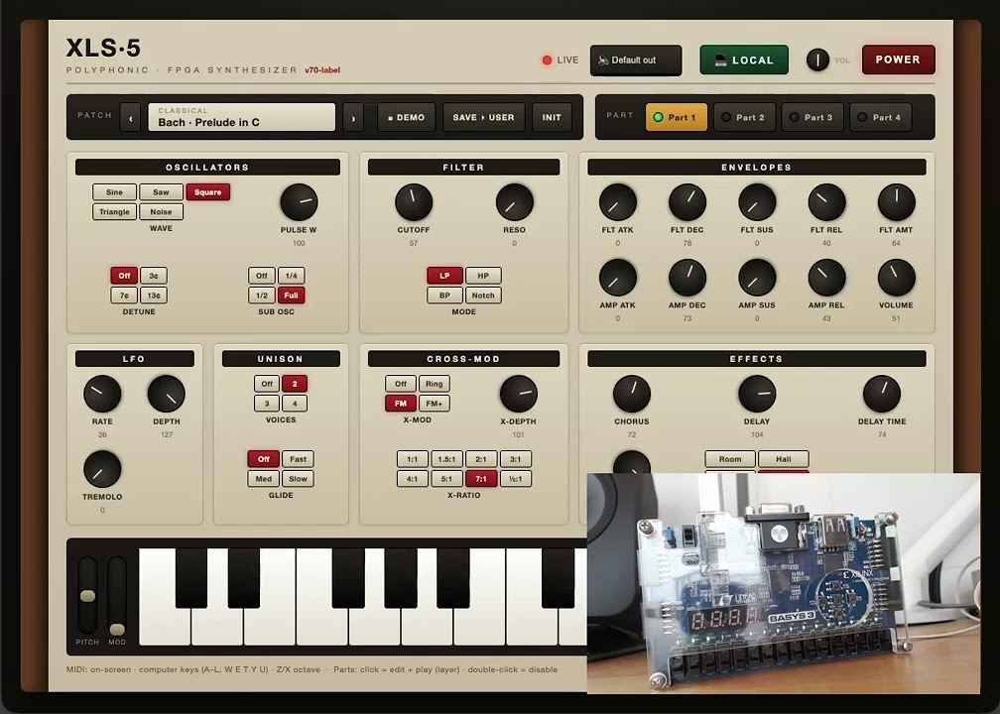](https://youtu.be/2ROr9M_ZlVY)

*The browser panel on the left, the board it is driving on the right. Every
sample you hear is computed by the FPGA.*

Three things about it are unusual, and they are related.

The design is written in a [Rust](https://www.rust-lang.org/)-like language
called [DSLX](https://google.github.io/xls/dslx_reference/) and compiled to
hardware by [Google XLS](https://google.github.io/xls/), not hand-written in
[Verilog](https://en.wikipedia.org/wiki/Verilog). No bitstream was ever built on
my laptop; every one of them came off a [Google Compute
Engine](https://cloud.google.com/compute) VM. And I did not write any of it:
[Claude Code](https://claude.com/claude-code) (Opus 4.8) designed, built and
hardware-verified the whole thing end to end, over the network, with nobody
watching the board. Most of the features were developed while I was travelling
for a week, from a phone.

I have built this instrument before. In 2012 I wrote an eight-voice sine
synthesizer by hand in Verilog on an Altera DE0, and it took me roughly a
weekend per feature before I gave up. This time a loop checked whether the
hardware was correct with nobody in the room, and that is what made the
difference.

This post is for software engineers who have never touched an FPGA, so I explain
the hardware concepts as they come up.

---

## What the instrument actually is

[Subtractive synthesis](https://en.wikipedia.org/wiki/Subtractive_synthesis) is
the oldest and most common way to build an electronic instrument. You start with
a harmonically rich waveform and remove parts of it.

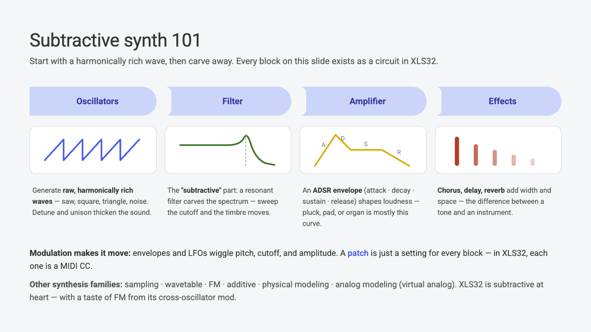

Every box in that picture exists as a circuit in XLS32. An oscillator turns a
running counter into a saw, square, triangle, sine or noise wave. A filter
carves the spectrum, and sweeping its cutoff is what makes a synth sound like it
is moving. An [ADSR envelope](https://en.wikipedia.org/wiki/Envelope_(music))
(attack, decay, sustain, release) shapes loudness over time, and the difference
between a plucked sound and a pad is mostly that curve. Effects add width and
space.

A patch, meaning a sound, is nothing but a setting for every one of those
blocks. In XLS32 a patch is 28 numbers, and every one of them is a
[MIDI](https://en.wikipedia.org/wiki/MIDI) control change that the browser panel
sends over the wire. The circuit never changes. Hand it a different 28 numbers
and the same silicon becomes a bass, a pad or a bell.

The board runs 32 voices shared across four MIDI channels, two oscillators plus
a sub-oscillator per voice, a [state-variable
filter](https://en.wikipedia.org/wiki/State_variable_filter) per voice with four
response types, two ADSRs per voice, an
[LFO](https://en.wikipedia.org/wiki/Low-frequency_oscillation) per part, and a
stereo effects chain with a
[Freeverb](https://ccrma.stanford.edu/~jos/pasp/Freeverb.html)-style reverb.
Audio comes back as 32 kHz 16-bit stereo PCM over the same USB cable that
carries the MIDI in.

## Why put a synthesizer in an FPGA at all

There are five reasonable ways to build an oscillator, and they trade build
difficulty against timing guarantees.

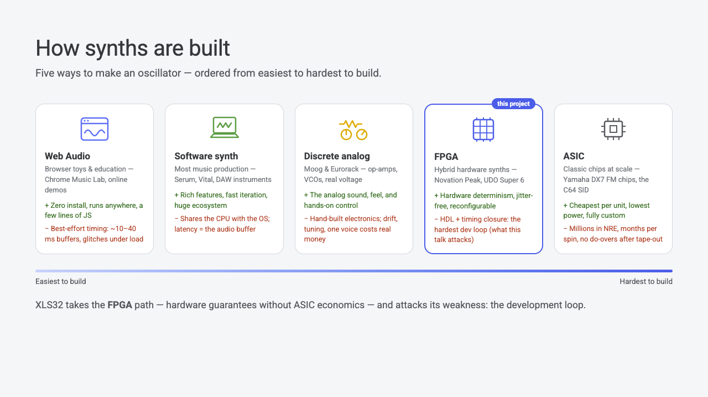

[Web Audio](https://developer.mozilla.org/en-US/docs/Web/API/Web_Audio_API) is a
few lines of JavaScript and runs anywhere. A software synth like
[Serum](https://xferrecords.com/products/serum-2) or [Vital](https://vital.audio/)
gets you a full ecosystem and fast iteration. Both share the CPU with the
operating system, so their timing is best-effort: an
[AudioWorklet](https://developer.mozilla.org/en-US/docs/Web/API/AudioWorklet)
renders 128-sample blocks on top of an OS buffer that is typically 10 to 40 ms,
and it degrades as load grows. Discrete analog circuits give you the sound and
the feel, and cost real money per voice. An
[ASIC](https://en.wikipedia.org/wiki/Application-specific_integrated_circuit) is
cheapest per unit and costs millions in NRE with no do-overs after tape-out.

The FPGA sits in the middle. You get hardware determinism without ASIC
economics: a fixed-length pipeline builds every sample on the same schedule, so
the delay through the datapath is a fixed handful of microseconds and does not
jitter. All 32 voices finish inside every sample tick, regardless of what patch
is loaded, because the per-sample work is a fixed cycle budget. This is the same
property that puts FPGAs in ADAS cameras, live mixing consoles, radar front-ends
and [high-frequency
trading](https://en.wikipedia.org/wiki/High-frequency_trading), where the
deadline is set by physics.

The cost is the development loop, and that is the part this project attacks.

## FPGA in one picture

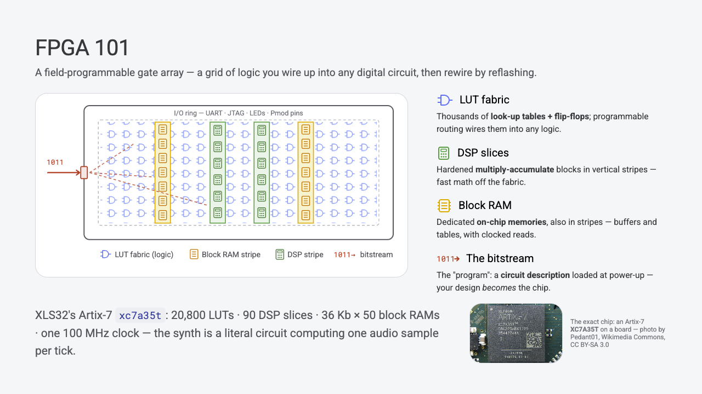

An FPGA is a grid of programmable logic. The bulk of it is [look-up
tables](https://en.wikipedia.org/wiki/Lookup_table) and
[flip-flops](https://en.wikipedia.org/wiki/Flip-flop_(electronics)): a LUT
computes any small boolean function of its inputs, a flip-flop remembers one bit
until the next clock edge, and a programmable routing fabric wires them into
whatever circuit you describe. Vertical stripes of hardened DSP slices do fast
[multiply-accumulate](https://en.wikipedia.org/wiki/Multiply%E2%80%93accumulate_operation)
off the fabric, and stripes of block RAM give you small on-chip memories with
clocked reads.

The "program" is a bitstream: a description of which LUTs compute what and which
wires connect to which, loaded at power-up. Your design becomes the chip.

XLS32 targets a [Digilent Basys
3](https://digilent.com/reference/programmable-logic/basys-3/start) with a
[Xilinx
Artix-7](https://www.amd.com/en/products/adaptive-socs-and-fpgas/fpga/artix-7.html)
`xc7a35t`: 20,800 LUTs, 90 DSP slices, fifty 36 Kb block RAMs, one 100 MHz
oscillator. That clock gives you 3,125 cycles between audio samples at 32 kHz,
and the whole design is a budget for those 3,125 cycles.

## Verilog, and the build flow around it

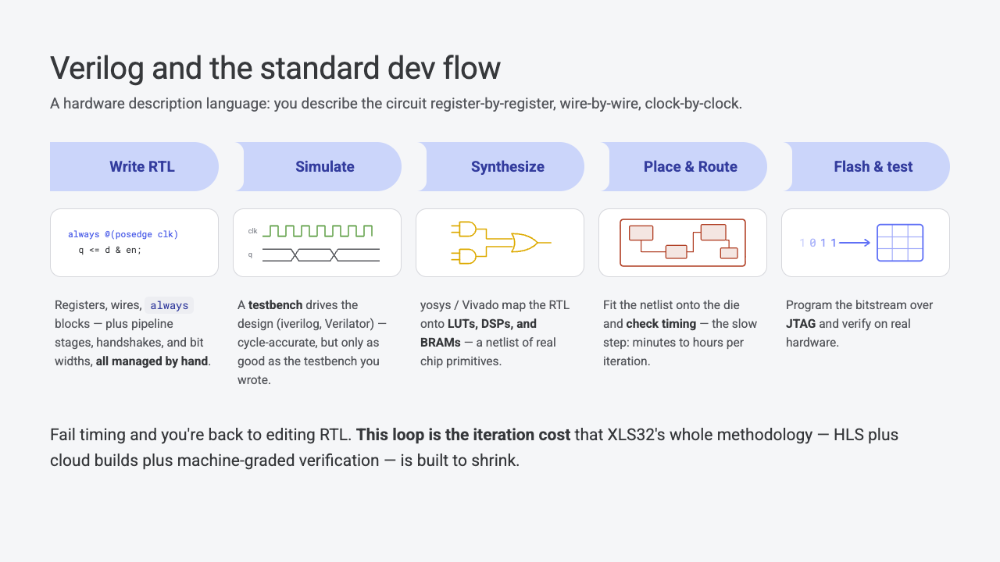

Verilog is a hardware description language. You describe the circuit
[register by register](https://en.wikipedia.org/wiki/Register-transfer_level),
wire by wire, clock by clock. Two properties of it are genuinely hard if you
come from software.

Everything happens at once. Every `always @(posedge clk)` block in the file
fires on every clock edge, in parallel. Nothing reads top to bottom, and there
is no call stack, no loop that takes as long as it takes, and no allocation.

You do the scheduling. If a computation is too slow to finish in one clock
period, you must break it into stages yourself and decide by hand which
intermediate value lives in which register on which cycle. Get it wrong and the
design either produces the wrong answer or fails timing.

Then there is the build. [Logic
synthesis](https://en.wikipedia.org/wiki/Logic_synthesis) maps your RTL onto
LUTs, DSPs and BRAMs; [place-and-route](https://en.wikipedia.org/wiki/Place_and_route)
decides where each of those goes on the physical die and how the wires get
there, and checks that every signal arrives before the next clock edge.
Place-and-route is the slow step, minutes to hours per iteration, and its result
is not fully deterministic. Fail timing and you are back to editing RTL.

That loop is why my 2012 project stopped at eight sine voices.

## Google XLS: describing hardware as software

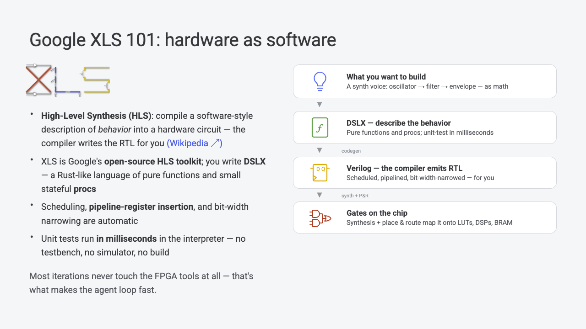

[High-level synthesis](https://en.wikipedia.org/wiki/High-level_synthesis) means
compiling a software-style description of behavior into a circuit, so the
compiler writes the RTL. [XLS](https://google.github.io/xls/) is Google's
open-source HLS toolkit. You write DSLX, a small Rust-like language of pure
functions and stateful `proc`s, and the compiler does the scheduling, inserts
the pipeline registers, and narrows bit widths for you.

Here is real code from the project, abridged. One oscillator sample, turning a
phase accumulator into a wave:

```rust
// Bit-widths are types: u3/u32 unsigned, s16 signed wires.
fn voice_wave(wave: u3, phase: u32, noise: s16) -> s16 {
  let t = phase[24:32];          // cycle position 0..255
  match wave {
    u3:0 => SINE[t],                             // sine
    u3:1 => (t as s16) * s16:16 - s16:2048,      // saw
    u3:4 => noise,                               // noise
    _    => SINE[t],
  }
}
```

That is a pure function. It composes, it reads top to bottom, and it unit-tests
in the interpreter in milliseconds. Bit widths are part of the type: `u3` is a
three-bit unsigned wire, `s16` a sixteen-bit signed one, and `phase[24:32]` is a
bit slice, which in hardware is free.

Here is roughly what the compiler emits for it:

```verilog
// pipeline registers p0/p1/p2 - inserted for you
always @(posedge clk) begin
  p0_t   <= phase[31:24];
  p1_sin <= SINE[p0_t];                  // 256-entry ROM
  p1_saw <= {p0_t, 4'h0} - 16'd2048;     // shift & offset
  p2_out <= (wave == 3'd0) ? p1_sin :
            (wave == 3'd1) ? p1_saw : p1_noise;   // wave-select mux
end
```

Three pipeline stages appeared. Nobody asked for three. The compiler cut the
dataflow graph where it had to in order to meet the clock, and it will re-cut it
differently if you change the target frequency or the surrounding logic.

The trade is real and worth stating. You give up cycle-exact control, so
anywhere that control matters (block RAM ports, I/O protocols, clock-domain
crossings) you still drop down to a hand-written Verilog shell around the
generated core. In XLS32 that split is clean: all the DSP math is DSLX, and the
shell owns the memory and the pins.

The last line of that diagram is the one that matters for the agent loop. Unit tests run
in the interpreter in milliseconds, with no testbench, no simulator and no
build. Most iterations never touch the FPGA tools at all.

## From one file to a bitstream

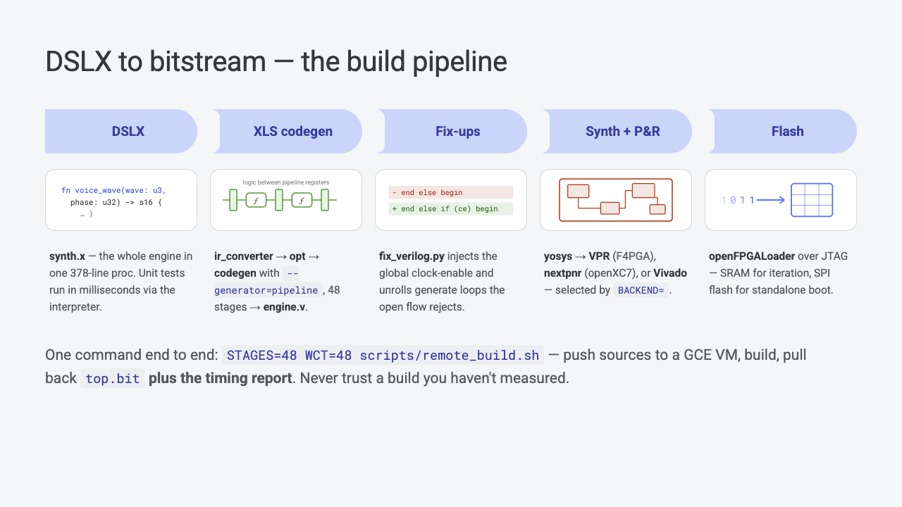

The whole engine is a single 378-line `proc` in `core/synth.x`. From there:
`ir_converter` lowers it to XLS IR, `opt` optimizes the IR, and `codegen
--generator=pipeline` with 48 stages emits `engine.v`. A small Python fix-up
script injects the global clock-enable and unrolls the generate loops the open
toolchain rejects. Then [yosys](https://yosyshq.net/yosys/) plus
[VPR](https://verilogtorouting.org/) ([F4PGA](https://f4pga.org/)),
[nextpnr](https://github.com/YosysHQ/nextpnr)
([openXC7](https://github.com/openXC7)), or
[Vivado](https://www.amd.com/en/products/software/adaptive-socs-and-fpgas/vivado.html)
turns that into a bitstream, and
[openFPGALoader](https://github.com/trabucayre/openFPGALoader) pushes it over
[JTAG](https://en.wikipedia.org/wiki/JTAG).

One command runs all of it and brings back both the bitstream and the timing
report:

```
STAGES=48 WCT=48 scripts/remote_build.sh
```

The timing report is not optional output. A build that meets timing on paper and
a build you have measured are different things, and the agent is required to
read the number.

---

## Loop engineering

The prompt that describes this project is not "write me a synthesizer". It is
closer to: design a tight, self-verifying edit, build, run, observe cycle, and
let the agent iterate inside it.

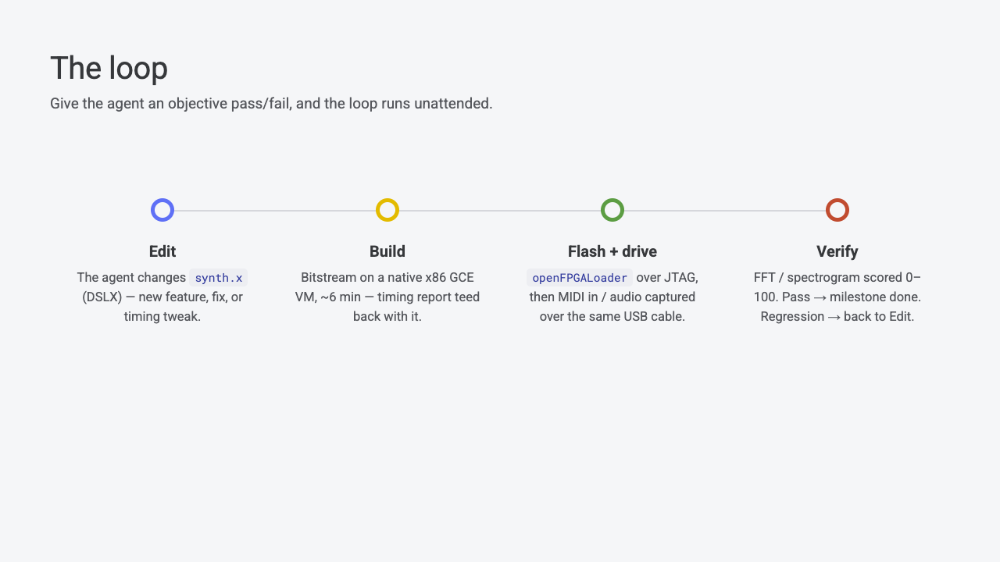

The agent edits `synth.x`. A build produces a bitstream and a timing report. The
board gets flashed over JTAG, then driven with MIDI while its audio is captured
back over the same USB cable. The capture is scored 0 to 100. A pass closes the
milestone; a regression sends it back to the edit step. Nobody watches an LED,
listens to a speaker, or presses a button.

### Scoring the board without listening to it

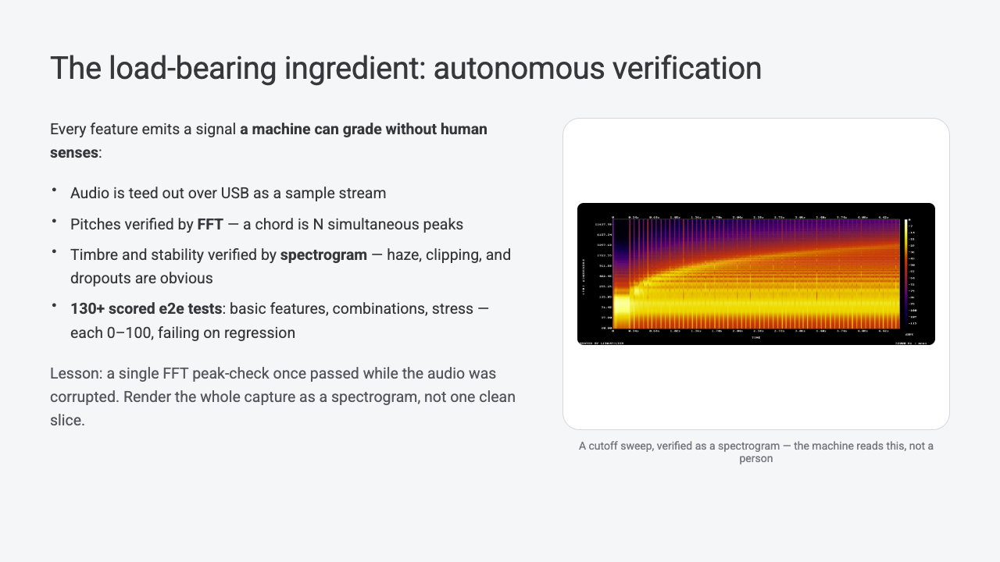

An agent can only iterate on something it can measure. So every feature in
XLS32 had to emit a signal a machine can grade without human senses.

Audio is teed out of the board over USB as a raw sample stream. Pitch is
verified by [FFT](https://en.wikipedia.org/wiki/Fast_Fourier_transform): a
four-note chord is four simultaneous peaks at the right frequencies, and that is
a numeric assertion. Timbre and stability are verified by
[spectrogram](https://en.wikipedia.org/wiki/Spectrogram), where haze, clipping
and dropouts are visible as structure. There are now over 130 scored end-to-end
hardware tests covering basic features, feature combinations, and stress cases,
each producing a 0 to 100 score that fails on regression.

A single FFT peak-check once passed while the audio was audibly corrupted, and
that mistake cost real time. The slice it sampled was clean and the rest of the
capture was not. Render the whole capture
as a spectrogram and score that, rather than trusting one clean window.

---

## Building hardware on a cloud VM

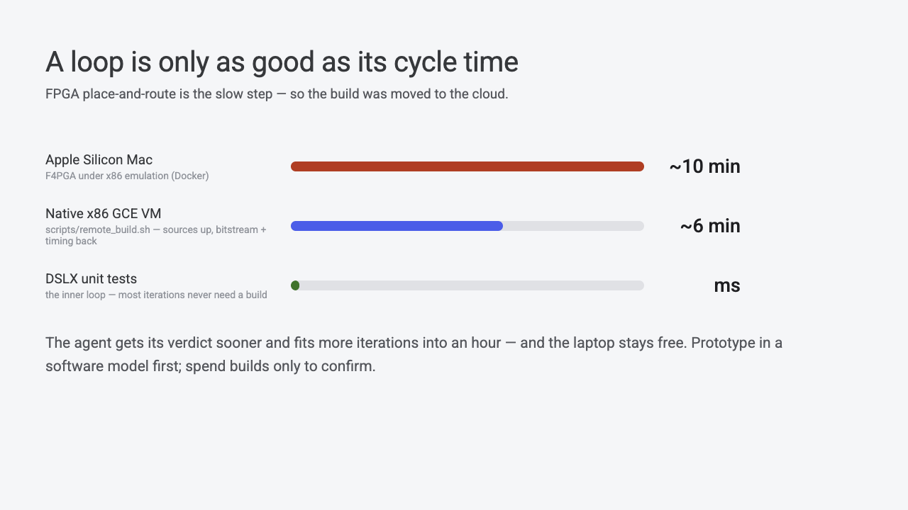

FPGA development assumes by default that the toolchain lives on your
workstation. Vendor tools are tens of gigabytes, node-locked, x86-only Linux,
and everybody installs them locally and builds locally. That assumption is what
makes the loop slow, and it turned out to be easy to drop.

On an Apple Silicon Mac the situation is worse than usual. F4PGA has to run
under x86 emulation in [Docker](https://www.docker.com/), which is about ten
minutes per build, and Vivado will not run at all. So the build moved to a
[Compute Engine](https://cloud.google.com/compute) VM, and the laptop kept the
only thing that genuinely has to be local: the board on the end of a USB cable.

The whole thing is [`gcloud`](https://cloud.google.com/sdk/gcloud), `scp` and
`ssh` in a 37-line script, with no CI system, container registry or artifact
store:

```bash
gcloud compute scp --zone="$Z" --project="$P" \
  core/synth.x core/codegen.sh core/fix_verilog.py \
  boards/basys3/rtl/top.v boards/basys3/rtl/basys3.xdc \
  ... "$VM":~/build/
gcloud compute ssh "$VM" --zone="$Z" --project="$P" \
  --command="STAGES=${STAGES:-48} WCT=${WCT:-48} bash ~/build/$RB"
gcloud compute scp ... "$VM":~/build/top.bit ./build/top.bit
gcloud compute scp ... "$VM":~/build/timing.txt ./build/timing.txt
```

Seven source files go up. A bitstream, a timing report, and Vivado's utilization
and timing reports come back. Everything in between (XLS, yosys, VPR, nextpnr,
Vivado, the Xilinx device database) lives on the VM and is never installed on a
laptop.

Three things came out of that, and the raw speedup is the least interesting one.

**A build becomes a pure function.** Sources in, a bitstream and a measured
timing number out, computed somewhere else. That is exactly the shape an agent
can drive: one command, two files back, no local state to corrupt and no
installation to keep working. The agent never needed to know what a Xilinx
device database is.

**Switching place-and-route backends becomes an environment variable.** All
three flows sit on the same VM, and `BACKEND=f4pga|nextpnr|vivado` picks between
three build scripts on the far side. Comparing three place-and-route tools is a
variable, not three local installations that fight over Python versions. The
backend comparison later in this post was measured that way.

**Wall-clock drops from about ten minutes to about six.** Four minutes does not
sound like much until you multiply it by an agent that wants to iterate all
afternoon. It roughly doubles the verified iterations per hour, and the laptop
stays free while a build runs.

This pays off because the fast toolchains for this part are x86-only Linux.
Where the toolchain is open and ships natively, the
round trip is not worth it. The same engine also targets a [Lattice
ECP5](https://www.latticesemi.com/Products/FPGAandCPLD/ECP5) board through a
fully open yosys plus nextpnr flow that runs natively on Apple Silicon, builds
the core in well under a minute, and never needed the VM at all.

The bigger win is the row above the VM in that diagram. DSLX unit tests run in
milliseconds, and a [NumPy](https://numpy.org/) model of the engine runs in
seconds, so most iterations never spend a build at all. Prove the idea in the
software model, then spend six minutes confirming it on silicon. FM strength,
reverb damping and the preset search were all settled in simulation first.

---

## Increments you can sign off

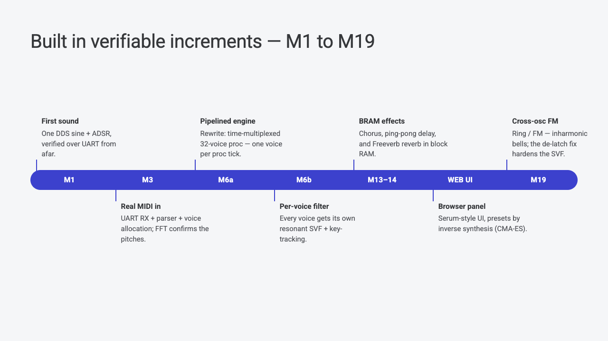

The project ran as nineteen milestones, each one a feature that could be graded
on its own. M1 was a single [DDS](https://en.wikipedia.org/wiki/Direct_digital_synthesis)
sine with a linear ADSR at 8-bit and 4 kHz. It sounded thin, and that was not
the point: it proved the edit, build, flash, measure loop was closed. M3 added
real MIDI input, a
[UART](https://en.wikipedia.org/wiki/Universal_asynchronous_receiver-transmitter)
receiver and parser and voice allocation, with an FFT confirming the pitches.
M6a was the rewrite into a time-multiplexed 32-voice pipelined engine. M6b gave
every voice its own resonant filter. M13 and M14 put chorus, ping-pong delay and
Freeverb into block RAM. M19 added cross-oscillator ring and FM modulation.

Behind every one of those there is a number the agent had to beat.

## What fixed-point hardware does that a float simulator will not

Two bugs are worth mentioning because they only appeared on silicon, and both
come from [fixed-point
arithmetic](https://en.wikipedia.org/wiki/Fixed-point_arithmetic).

The state-variable filter latched. At high resonance its integrator state sticks
on the clamp rails and the voice goes silent; under bright polyphonic FM it
locked into a full-scale limit cycle and was railed 96% of playtime. The fix was
leaky integrators, bleeding about 1% of the state per sample, which pulls the
filter poles just inside the unit circle so any self-oscillation decays. The
floating-point simulation never showed it.

The reverb ran away. A small damping-coefficient shift crushed the audio band
and could wrap the 16-bit state, and a sign flip in a feedback loop means
runaway. The fix was computing damping as `(old + new) / 2`, which cannot
overflow, plus clearing the block RAM at reset so power-up garbage does not seed
the loop.

The general rule underneath both is to saturate, never wrap. A wraparound is a huge
discontinuity, which is a broadband click, which a spectrogram shows instantly
and a peak-check does not.

---

## Architecture, briefly

The design principle is one clock and one sample rate. Everything is either a
pure function or a small proc, and the synth emits exactly one audio sample per
sample-rate tick.

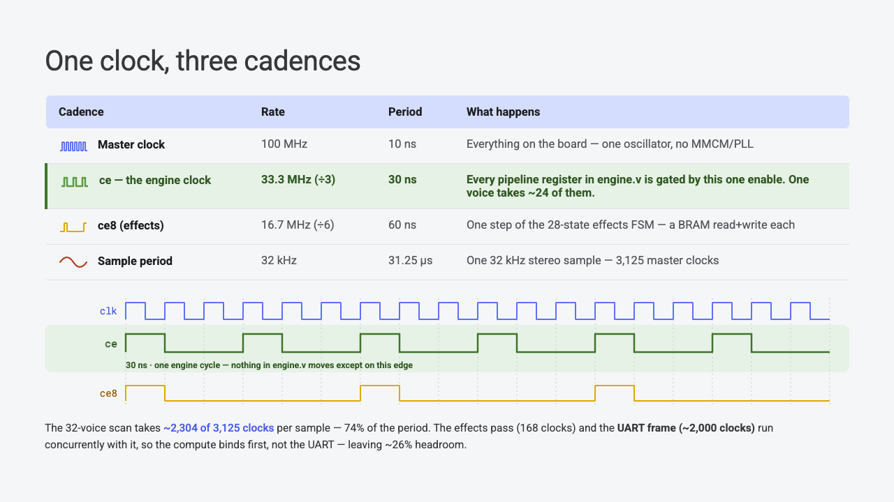

There is one 100 MHz oscillator on the board and no PLL, so slower rates are
made with clock enables rather than with real slower clocks. The engine advances
on a divide-by-three enable at 33.3 MHz; the effects state machine steps at 16.7
MHz. A 32 kHz sample period is 3,125 master clocks, the 32-voice scan takes
about 2,304 of them (74%), and the effects pass and the UART frame run
concurrently with it, leaving around a quarter of the period spare.

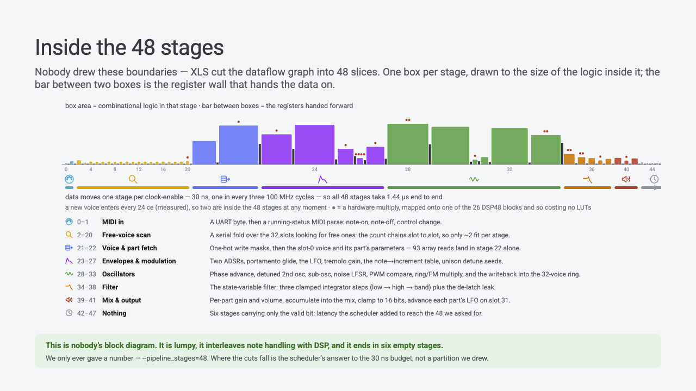

Those 48 pipeline stages were not designed. XLS cut the dataflow graph into 48
slices to meet the clock, and each box in that picture is sized by the amount of
logic inside it. A new voice enters the pipeline every 24 cycles, so only two
voices are ever in flight and the rest of the stages carry bubbles. That is
fine: the sample rate is met with room to spare, and depth bought timing slack.

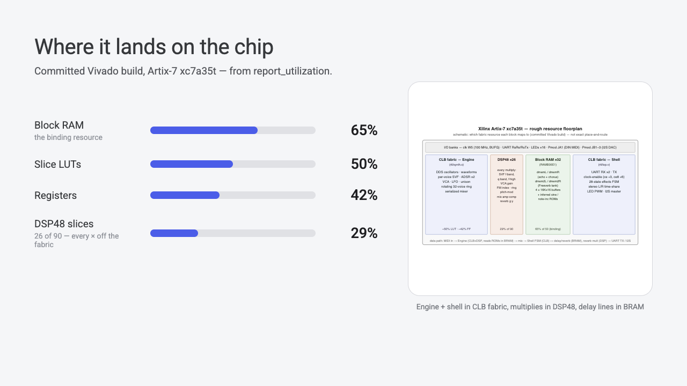

On the shipped Vivado build the binding resource is block RAM at 65%, because
four 16K by 16 circular buffers for the delay lines eat 32 of the 50 BRAMs. LUTs
sit at 50%, registers at 42%, and 26 of the 90 DSP slices carry every multiply
in the design.

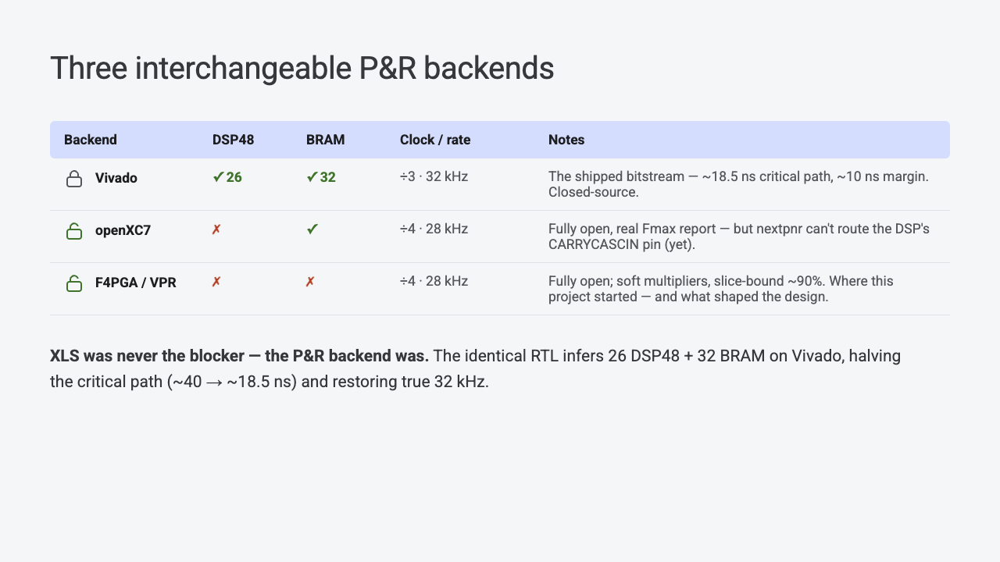

Three place-and-route backends build the same RTL, and they do not produce the
same chip. Vivado infers DSP slices
and block RAM, gets a roughly 18.5 ns critical path against a 30 ns budget, and
ships at 32 kHz. openXC7 is fully open and gives a real Fmax report, but nextpnr
cannot yet route the DSP's carry-cascade pin, so multiplies fall back to the
fabric and the design runs at divide-by-four, 28 kHz. F4PGA infers neither DSPs
nor BRAM, so every multiply becomes a LUT-and-carry soft multiplier and the chip
runs about 90% full.

Identical source, identical generated Verilog, and roughly a 2x difference in
critical path. XLS was never the blocker. The backend was, and its limits shaped
the design: keep multiplier operands narrow so the narrowing pass can shrink
them, put anything needing a synchronous read in the hand-written shell, and
advance the whole engine on a global clock enable because you cannot make a
slower clock.

---

## What I would tell another software engineer

HLS makes DSP hardware feel close enough to software that an agent can work in
it, provided you accept a thin hand-written shell where cycle-exact control
matters.

An agent can build real hardware, but only for features that emit a
machine-gradable signal. The synthesizer was buildable this way because audio
can be scored by FFT and spectrogram. A feature you can only evaluate by ear
would not have survived the loop.

Get the toolchain off your machine. A hardware build that runs on a cloud VM and
returns a bitstream plus a measured timing number is the same interface as any
other remote build: no local install to break, backends swappable by environment
variable, and roughly twice as many verified iterations per hour. Pair it with a millisecond-scale software
model of the same design and most iterations cost nothing at all.

And measure everything. Timing reports, spectrograms of whole captures, and
periodic calibration between the simulation and the board. Every one of the bugs
that cost me real time was hidden behind something that looked like it had
passed.

The code, the prebuilt bitstream, the per-block architecture notes and the
milestone-by-milestone development log are all in
[github.com/kazunori279/xls32-fpga-synth](https://github.com/kazunori279/xls32-fpga-synth).

*XLS32 is a personal side project, open-sourced under Apache-2.0. The opinions
here are my own, not those of my employer.*
