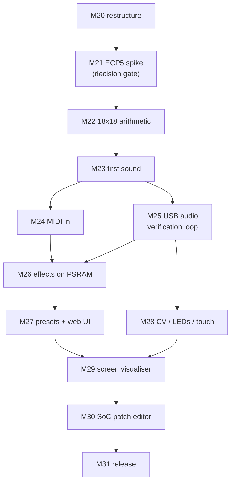

# Porting XLS32 to Tiliqua — milestone plan

A plan to run the XLS32 engine on **[Tiliqua](https://apfaudio.github.io/tiliqua/)** (`TLQ-MODULE` +
`TLQ-SCREEN`) alongside the existing Basys 3 target, and to restructure the repo so both boards are
first-class.

Status: **M20 through M25 are done** — the module makes sound, takes MIDI, and grades itself over
USB, so from M26 on every milestone has a scored report to answer to. **M26 is next.** Two things
carried forward rather than finished: M24's TRS jack works in simulation but has never had a cable
in it, and M25's loop still needs one encoder press after a cold boot (§2.7). Everything in §1.1
was measured on the real module and M21–M25 on the real toolchain, so the constraints below are not
estimates — where a number has since been withdrawn, it says so. Milestones continue the numbering
in [DEVELOPMENT.md](../DEVELOPMENT.md) (M1 → M19 + Web UI), so this starts at **M20**.

---

## 1. The two boards, side by side

| | **Basys 3** (today) | **Tiliqua R5 / SoldierCrab R3** |
|---|---|---|
| FPGA | Artix-7 `xc7a35t` | Lattice **ECP5 `LFE5U-25F`** |
| Logic | 20,800 LUT6 · 41,600 FF | 24,288 TRELLIS_COMB (LUT4) · 24,288 FF |
| Multipliers | 90× DSP48E1 (25×18) | **28× MULT18X18D (18×18)** |
| Block RAM | 50× RAMB36 (36 Kb) ≈ 1,800 Kb | **56× DP16KD (16 Kb data)** ≈ 896 Kb |
| Off-chip RAM | none | **32 MB HyperRAM / oSPI (APS256XXN)** |
| Clocks | one 100 MHz osc | `sync` 60 MHz · `fast` 120 MHz · `usb` 60 MHz (ECP5 PLL from 48 MHz) · `audio` 12.288 MHz (SI5351) |
| Audio out | UART PCM tee + Pmod I²S DAC | **eurorack-pmod R3.5** — 4 in + 4 out, DC-coupled, 24-bit, 48 kHz (or 192 kHz) |
| MIDI in | USB-UART @2 Mbaud; DIN Pmod (built, untested) | **TRS-A jack, optoisolated** + USB-MIDI on `usb2` |
| Host link | FT2232 UART, 2 Mbaud | RP2040 `dbg`: dirtyJtag + CDC serial **@115200 only**; `usb2`: **USB HS (480 Mbit) PHY on the FPGA** |
| Display | 16 LEDs | **TLQ-SCREEN 720×720p60** (panel rotated 90°), DVI/TMDS from framebuffer in PSRAM |
| Controls | switches/buttons | rotary encoder + push, capacitive touch on all 8 jacks, per-jack RGB LEDs, jack detect |
| Toolchain | XLS → Vivado / F4PGA / nextpnr-xilinx | XLS → **Amaranth** wrapper → yosys → **nextpnr-ecp5**, driven by `pdm` |
| Flashing | `openFPGALoader -b basys3` | `pdm flash archive … --slot N` (8 slots + bootloader) or `openFPGALoader -c dirtyJtag` to SRAM |

The engine itself is portable — XLS emits plain Verilog, Amaranth can `Instance()` it, and yosys
reads it for either family. **The port is not about the DSLX; it is about the shell.** Four things
in `rtl/top.v` are Xilinx/Basys-3-specific and must be rebuilt: the UART transport, the BRAM
effects, the LED comet, and the clocking.

## 1.1 Measured baseline (2026-08-03, on the physical module)

Everything in this subsection was measured, not inferred. Where it contradicts a number elsewhere in
this document, this subsection wins.

**Identity.** `openFPGALoader --scan-usb` reports `0x1209:0xc0ca dirtyJtag apf.audio` /
`Tiliqua R5 apfbug-beta4-1-g9b45`. Bitstream slots are at release **v1.2.1**. Slot map as shipped:
`0 XBEAM · 1 POLYSYN · 2 MACRO-OSC · 3 SID · 4 SELFTEST · 5 SAMPLER · 6 DSP-MDIFF · 7 VSYNTH`.

**From the bootloader's CDC log** (115200 on the `dbg` port — it prints on boot, then goes quiet):

- Screen EDID resolves to `DVIModeline { h_active: 720, v_active: 720, pixel_clk_mhz: 39.07,
  rotate: Left }`, and the firmware logs `detected tiliqua screen! rotate framebuffer 90 degrees`.
- **The SI5351 is reconfigured per *boot*, by the bootloader — not per bitstream.** The bootloader
  runs `clk0=12288000Hz` (→ 48 kHz); booting XBEAM from the menu reprograms it to
  `clk0=49152000Hz` (→ 192 kHz) from that slot's manifest. `clk1` is the pixel clock, 39.07 MHz
  here. XLS32 wants the 12.288 MHz / 48 kHz variant. **An SRAM load over JTAG programs nothing**,
  so it inherits whatever the last-booted slot left behind — which is how M25 lost a day to a note
  2,616 cents sharp, and is the lead (an unsatisfying one) for the withdrawn dropout numbers
  below. See §2.7 and risk 3c; `check_loop.py` and `run_tests.py` now measure the clock before
  grading anything.
- `ak4619/codec: register config looks healthy`, `audio/calibration: looks good! switch to it`.
- PSRAM is exercised on every boot — the bootloader copies 163 KiB of firmware into
  `0x20200000..0x20228d30`. §2.2's escape hatch is real hardware that demonstrably works.
- All 8 slot manifests parse and CRC-match.
- One anomaly: `cy8cmbr3xxx/touch: n_working_sensors=Ok(0)` with `CRC OK`. Worth resolving with
  SELFTEST before M28 depends on touch.

**Audio sample format — this is the important one.**
`gateware/src/tiliqua/dsp/__init__.py` defines the native codec sample type as

```python
_ASQ_WIDTH  = int(os.environ.get('TILIQUA_ASQ_WIDTH',  '16'))
_ASQ_I_BITS = int(os.environ.get('TILIQUA_ASQ_I_BITS', '1'))
ASQ = fixed.SQ(_ASQ_I_BITS, _ASQ_WIDTH - _ASQ_I_BITS)   # s1.15, ±1.0 == ±8.192 V
```

**Tiliqua's DSP path is natively 16-bit signed**, 0.25 mV/LSB; the 24-bit USB descriptor is an
external representation only. `synth.x` emits `audio_out: chan<u16>`, so the engine's output drops
into `ASQ` with **no requantisation and no rescaling** — and `TILIQUA_ASQ_WIDTH` is an env var if we
ever want more. Any wording elsewhere about converting 16-bit to a 24-bit DAC is wrong; there is
nothing to convert.

**`dsp-mirror` reference build** (`pdm dsp build --dsp-core=mirror`, default yowasp/WASM toolchain,
Apple Silicon): **35.8 s wall** (29.92 s user, 88% CPU) end to end. Post-PnR utilisation of the
audio-only shell — PLL, I²C, eurorack-pmod codec interface, no video, no SoC:

| | used | available |
|---|---|---|
| TRELLIS_COMB | 1,768 | 24,288 (7%) |
| TRELLIS_FF | 731 | 24,288 (3%) |
| **DP16KD** | **0** | 56 (0%) |
| **MULT18X18D** | **1** | 28 (3%) |
| EHXPLLL | 1 | 2 |

The shell costs almost nothing: XLS32 gets essentially all 56 BRAM tiles and 27 of 28 multipliers,
and one `EHXPLLL` output is free for the dedicated engine clock §2.3 recommends.

**USB Audio Class 2 on `usb2` — validated.** With XBEAM running, macOS enumerates
`Tiliqua / apf.audio / 4 in / 4 out / 192000 Hz / USB` and PortAudio accepts both 192 kHz and
48 kHz at 4 channels. A capture returns real samples on all four channels. Caveats found the hard
way, all of which constrain `host/transport/usbaudio.py`:

- The interface enumerates unconditionally, but **no frames flow until `MISC → usb-mode = enable`**
  in the XBEAM menu, and the vendor docs say to set it *before* plugging the host in. This one
  survived re-measurement; the throughput numbers originally attached to it did not.
- ⛔ **The isochronous-dropout finding is withdrawn.** This section used to report 2.5–5% of frames
  arriving all-zero, ADC-timeline jumps of 44–500 ms, and only ~67% of expected audio arriving,
  on the vendor's own bitstream. **None of it reproduces.** Re-measured on hardware 2026-08-03
  across eleven runs, XBEAM v1.2.1 menu-booted at 192 kHz delivers **100.27% of expected frames,
  zero all-zero frames, zero timeline jumps**; a 60 s endurance run gives 100.34% with one zero
  frame in 11,558,912. Withdrawn with it: the per-config table that used to sit here (XBEAM
  2.56%, `usb_audio` 3.82–4.84% at 48 kHz, and the inference that 48 kHz was the worse rate —
  which was the report's headline), the `blocksize=1024` collapse to ~14%, the open/close wedge,
  and the ~256 ms periodicity. Our own bitstream is a clean control at 99.84% / 0.000% / 0 jumps
  at 48 kHz, and the M25 suite measures a worst-case gap rate of **0.001%** over six 34-case runs.

  What the original runs actually measured is not known. A misclocked SRAM load is a lead —
  §2.7's SI5351 inheritance was real and was fixed — but it does not fit quantitatively: a 4×
  clock mismatch predicts delivery near 25% or near 400%, and 67–69% is neither. The XBEAM
  figure has no explanation at all, since that slot was menu-booted and therefore correctly
  clocked. The full retraction, the re-measurement, a claim in the hand-off that turned out
  flatly wrong against vendor source ("the USB side runs off the ULPI's own 60 MHz recovered
  clock" — §2.6 has the half that refutes it, `sync` and `usb` being one 60 MHz net off the ECP5
  PLL, and §2.7 the audio half), and a post-mortem on how the report came to be written
  are in [TILIQUA_USB_DROPOUTS.md](TILIQUA_USB_DROPOUTS.md). Reproduction probes are in
  `boards/tiliqua/probe/`.
- **Let PortAudio choose the block size, and open the stream once.** The measurements that
  motivated both rules are withdrawn above, but the code follows them anyway: they cost nothing,
  and the configuration they describe is the one every clean run has been taken on.
- A cheap, reliable gap detector falls out of the DC offsets below: a genuine frame is never
  all-zero on all four channels, so the transport can self-validate every capture and retry.
  With the gap rate now at 0.001% this repairs almost nothing, but it is also what *measures*
  the rate, which is the number the report publishes.

**Factory calibration**, measured with nothing patched (median DC offset, ±8.192 V full scale):
ch0 −2.81 mV · ch1 −4.44 mV · ch2 −1.13 mV · ch3 −3.94 mV — all inside the quoted ±5 mV. Noise
floor ≈ −70 dBFS, strongly correlated across channels (0.82–0.97), i.e. shared supply/reference
noise rather than per-channel.

**But calibration only applies when there is a CPU to load it.** The same measurement on the
non-SoC `usb_audio` bitstream gives **−86 to −116 mV** DC offsets — 20–40× worse — because the
constants live in I²C EEPROM and are read at boot by firmware. A bare XLS32 top has no SoC, so it
gets raw, uncalibrated converters. This matters at **M23** (a DC-offset floor of ~100 mV is ~1.2%
of full scale and will show up in FFT grading) and at **M28**: either keep a minimal SoC/firmware
in the design, or read the EEPROM from a small state machine and apply the offsets in gateware.

---

## 2. The six hard constraints (read this before planning work)

Four were known before the port started (§2.1–§2.4); §2.6 and §2.7 were found in M25 and are
numbered in the order they were hit, not by severity.

### 2.1 Multipliers — the binding constraint

The committed build infers **26 DSP48E1**. A DSP48E1 is 25×18; an ECP5 `MULT18X18D` is 18×18, so
yosys splits any operand wider than 18 bits into 2–4 tiles. `synth.x` deliberately widens some
operands to fit *one* DSP48 (e.g. `(amp as s24 as s32) * compv` — a 24×18). Those become 2 tiles
each on ECP5.

Rough expectation: **26 DSP48 → 40–60 MULT18X18D against a budget of 28.** This has to be fixed in
DSLX by narrowing operands to ≤18×18, not worked around downstream.

### 2.2 Block RAM — the effects buffers do not fit

`rtl/top.v` declares four 16384×16 buffers (`dmemL`, `dmemR`, `dmem2L`, `dmem2R`) =
**1,048,576 bits**. At 16 Kb of usable data per `DP16KD` that is **64 tiles against 56 available** —
before the engine's own inferred ROMs, and before the video framebuffer. At 48 kHz the reverb tank
and delay taps would need ~1.5× *more* depth again.

The answer is the HyperRAM: Tiliqua ships `tiliqua/periph/psram.py`, `tiliqua/dsp/delay_line.py` and
`tiliqua/dsp/delay_effect.py` — PSRAM-backed delay lines are the idiomatic Tiliqua way to do exactly
this. The effects get **rewritten against that library**, not ported line-by-line.

> **M26 split that prediction in half.** The diagnosis held: the buffers do not fit, and the echo
> line did go to PSRAM through `dsp.DelayLine`. The prescription did not. `DelayLine` is
> single-writer / multi-reader over one circular buffer, and each Freeverb comb has its *own*
> write pointer and writes its own feedback back into it — so the reverb tank cannot be expressed
> as taps on a shared line at all. It needs 12 instances per channel, 24 in total, each with its
> own arbiter and L2 cache, on a die already at 86%.
>
> What actually fits is the Basys 3's own answer: one BRAM per channel with region offsets. The
> saving that makes it fit is not PSRAM but arithmetic — sizing each region to its own delay
> instead of the Verilog's uniform 1300/600 spacing takes the tank from 19 tiles per channel to
> 15. The SDK agrees, incidentally: `src/top/dsp/top.py:822` keeps a `sram_max_delay = 1024`
> heuristic that routes short taps to SRAM and only long ones to PSRAM, and every Freeverb tap
> here is short. So the effects were **ported line-by-line after all**, with `dsp.DelayLine` used
> for the one delay that genuinely wanted a megabyte. See the M26 entry below.

### 2.3 Clocking — the cost of a sample is `--pipeline_stages`, not 32

> **This section was wrong until M21 measured it.** It read "one voice per engine-cycle, 32 cycles
> per sample… at 32 kHz that needs ≥ ~32.8 MHz". Those two claims cannot both be true — 32 cycles
> at 32 kHz is 1.02 MHz, not 32.8 MHz, a factor of 32. The right number was never derived, only
> back-fitted from the Basys 3 ÷3 divider that happened to work. It is now measured directly
> (`boards/tiliqua/spike/tb_rate.v`: count clocks between `audio_out` handshakes with `ce` tied
> high), and the answer is neither figure.

**One sample costs 32 × (roughly `STAGES`/2) engine cycles.** The voice ring is 32 iterations, but
each iteration re-enters a pipeline whose recurrence forces an initiation interval that scales with
the schedule depth. Measured, at 32 voices:

| `STAGES` | 6 | 8 | 10 | 12 | 16 | 20 | 24 | 32 | 40 | 48 | 64 | 80 |
|---|---|---|---|---|---|---|---|---|---|---|---|---|
| cycles/sample | 128 | 160 | 192 | 224 | 320 | 384 | 416 | 512 | 640 | 768 | 928 | 1216 |

This reframes the whole clocking question. The shipping Basys 3 build is `STAGES=48` → **768 cycles
per sample**, and its ÷3 enable gives 33.3 MHz, i.e. a 43.4 kHz ceiling against the 32 kHz it
actually runs. That matches the note in `boards/basys3/rtl/top.v` that ÷4 "capped at 28 kHz".

Because both the required clock *and* the achievable Fmax rise with `STAGES`, raising it does not
buy throughput — it buys timing slack and spends flip-flops. The sustainable sample rate is
`Fmax / cycles_per_sample`, and on ECP5 that stays **above 57 kHz at every `STAGES` that fits**
(§M21 table). **Sample rate is therefore not a constraint on this port at all.** Area is.

| Option | Verdict |
|---|---|
| `sync` ÷1 (60 MHz) | **Not available.** No `STAGES` reaches 60 MHz on ECP5; the best is 59.2 MHz at `STAGES=48`, which also costs 70% of the device's flip-flops |
| `sync` with a clock enable | **Not available either.** A clock enable does not relax a register-to-register path — the design still has to close at 60 MHz. Basys 3 gets away with ÷3 only because Vivado is given a multicycle constraint; nextpnr-ecp5 has no equivalent |
| dedicated PLL output, ~12–25 MHz | **Recommended, and now with numbers.** At the chosen `STAGES=12` the engine closes at 27.5 MHz and needs 224 × 48 kHz = **10.8 MHz**. Needs a free `EHXPLLL` output and an async FIFO on the MIDI/audio channels |

**Why the third row was already the right call.** Building the vendor's own `usb_audio` top — a
*shell*, with no DSP in it at all — nextpnr reports `$glbnet$clk` **58.66 MHz, FAIL against the
60 MHz constraint** on the first pass, recovering to **66.49 MHz PASS** only after retiming. The
stock `sync` domain barely makes its own timing with nothing of ours in it.

**Fallback ladder, in order:** 32 voices → 24 voices → 16 voices → 2 parts instead of 4. M21
measured the first two rungs and **found them unnecessary** — 32 voices × 4 parts fits. They are
kept here costed, because the video/SoC shell is a much larger tenant than the audio-only one this
was measured against.

### 2.4 The verification loop — 115200 baud kills it

The whole project rests on "audio is teed over USB and graded by FFT". The RP2040's CDC serial is
**115200 baud only**; 16-bit stereo at 48 kHz is 1.5 MB/s. **The Basys 3 transport does not carry
over.**

The replacement is the `usb2` port: Tiliqua has a USB HS PHY wired to the FPGA and ships
`tiliqua/usb_audio/` plus `src/top/usb_audio/top.py` (a UAC2 device). The host then sees Tiliqua as
an audio interface and records with `sounddevice`; MIDI goes in over USB-MIDI
(`tiliqua/midi/decode_usb.py`) or the TRS jack. This is a **blocking dependency for every later
milestone** — until it works, the agent loop is blind, so it comes early (M25).

**Confirmed on hardware (§1.1).** Recording 4×24-bit from Tiliqua over `usb2` with `sounddevice`
works today using the stock XBEAM bitstream, so M25 is *integration*, not invention: wire
`tiliqua/usb_audio/` into our own top and port the host side onto it. Gap-free capture was written
here as the open question, on the strength of a ~2.5% zero-frame rate that has since been
**withdrawn** (§1.1). M25 kept the exit criterion anyway — "0 dropped frames over 10 s at 48 kHz",
not mere enumeration — and met it: `check_loop.py` reports **0.00% gaps**.

Stopgap if USB audio slips: a decimated debug stream (e.g. 4 kHz mono 8-bit ≈ 32 kbps) fits inside
115200 and is enough for pitch/envelope grading, which is what M1–M3 used anyway.

### 2.5 What gets *easier*

- **Build time.** `nextpnr-ecp5` runs natively on Apple Silicon (oss-cad-suite arm64 or
  `yowasp-nextpnr-ecp5`). The GCE detour that exists purely because F4PGA/Vivado are x86 goes away.
  Measured: the reference `dsp-mirror` core builds end-to-end in **35.8 s** on this Mac, on the
  slower WASM toolchain (§1.1). The loop gets tighter, not looser.
- **The sample format already matches.** Tiliqua's native `ASQ` is 16-bit signed, which is exactly
  what `synth.x` emits (§1.1). No conversion layer.
- **MIDI DIN finally gets tested.** M7's DIN parser has been "built, HW-pending" — Tiliqua has an
  optoisolated TRS-A MIDI jack on the board.
- **A real DAC.** 24-bit DC-coupled outputs replace the UART tee + Pmod I²S breakout.
- **8 slots.** The bootloader holds 8 user bitstreams, so a 32-voice build and a 16-voice+video
  build can coexist on one module.

### 2.6 The fifth constraint, found in M25: the engine crowds luna off the die

Adding USB fits — 20,806 / 24,288 TRELLIS_COMB, **85%**, and 21,103 / **86%** once M25's clock
probe went in — and misses timing. `sync` places at
**48.7–55.3 MHz against 60 MHz required** across sixteen seeds. This was not in the original risk
register. It runs on hardware anyway — see the resolution at the end of this section — but it is
still out of spec, so the reasoning is kept in full.

**`sync` and `usb` are one net.** `pll.py` drives both from `feedback60` (lines 464, 605, 835), so
yosys merges them and nextpnr reports a single `$glbnet$clk`. The engine cannot be given a slower
clock than luna, and luna's 60 MHz is fixed by ULPI.

**The failing path is entirely inside luna** — about twenty LUT levels from an interpacket timer
(`luna/gateware/usb/usb2/packet.py:1415`) through the control endpoint, the endpoint mux and
`ChannelsToUSBStream` to the ULPI TX data register. Logic accounts for roughly 5 ns of it and
routing for roughly 15 ns, with single hops of 0.9–1.2 ns between adjacent tiles. That ratio is
the diagnosis: **congestion, not depth.** The same block makes 66.49 MHz in the stock `usb_audio`
bitstream at ~20% occupancy.

**Which kills the two levers this milestone had pre-committed.** A per-module census of `top.json`
(16,958 LUT4 before packing):

| module | LUT4 | share |
|---|---:|---:|
| `core.engine` | 14,209 | 83.8% |
| `usbif.*` (luna + UAC2 + MIDI) | 1,588 | 9.4% |
| `pmod0.i2c_master` | 413 | 2.4% |
| everything else | 748 | 4.4% |

Dropping `nr_channels` from 4 to 2 saves ~100 LUTs and dropping the host→device audio direction
saves ~10. Neither touches the thing doing the crowding. **luna is not big; the engine is.**

**Nothing in the tool flow closes it either.** Sixteen placer seeds on the final netlist span
**48.74–55.33 MHz**, best at seed 2 — still 7.8% short, and seed rankings do *not* transfer between
netlists: seed 11 gave 55.98 MHz on the previous netlist and 51.27 MHz on this one, and seed 2's
55.33 MHz became **52.27 MHz** on the rebuild that actually emitted `top.bit`. A seed is not a fix
you can bank; it is a lottery you have to re-run after every edit, and win again at build time.
`--placer-heap-timingweight` 35/60/100 buys 1–5 MHz; `--tmg-ripup` is marginal; `--router router2`
is *worse*; `--placer-heap-critexp` 4/6/8 and `--placer-heap-beta` 0.95/0.99 change nothing at all.
Adding `-abc9` to `synth_ecp5` — absent from Amaranth's default script, and the obvious thing to
try for a deep path — gives no improvement and a slightly larger design, confirming the diagnosis
from the other side. nextpnr-0.10 from `yowasp` has no Python bindings and its LPF reader has no
`REGION`/`UGROUP`, so luna cannot simply be fenced into a corner of the die, which is what this
design actually wants.

**The engine has no soft area.** XLS unrolls the voice loop: `____state_0_tuple_element_*` are
32-entry arrays read at all 32 constant indices every cycle (`xls_engine.v:4882`ff), so they are a
flat register file, not an inferrable memory. That is why 3 of 56 DP16KD are used while 11,225 FFs
are not. There is no BRAM or LUT-RAM win hiding here; engine area is proportional to voice count,
at roughly 440 LUTs per voice.

So the remaining choices were (a) load the 85% bitstream and find out whether −6 worst-case static
timing is as pessimistic as it usually is at room temperature — the shortfall is 6–15%, and the
failing cone is control-transfer logic that only toggles during enumeration — or (b) cut voices,
which means the suite would grade a bitstream we do not ship. Note `--timing-allow-fail` on the
nextpnr line comes from the SDK, not from Amaranth's default template: overriding `nextpnr_opts`
silently drops it and turns the warning into a build failure.

**Resolved by (a), empirically: it runs.** Built at 86% and placed at 48.2–49.5 MHz against the
60 MHz requirement, the bitstream enumerates as a 4-in/4-out UAC2 device, accepts USB-MIDI, and
streams audio the host can grade — repeatedly, across many loads over a working day. The failing
cone was diagnosed as control-transfer logic that only toggles during enumeration, and that is
exactly how it behaves. This is a **risk being carried, not a risk retired**: static timing says
the part is out of spec, so it is not proof of margin at temperature, over voltage, or on another
die. Cutting voices stays available if the loop ever proves flaky. The number to watch is the
frame gap rate, which every report prints.

**M26 made it worse and it still runs.** Adding the effects took occupancy to 97% and `sync` Fmax
down to **43.40 MHz** — a 28% shortfall, not 6–15%. The critical path is still nowhere near the
new logic: it runs `usbif.usb.timer.counter` → `USBControlEndpoint.StandardRequestHandler`, i.e.
the same enumeration-only cone, now slower through routing congestion rather than through added
depth. Three consecutive runs of basic and of stress returned byte-identical verdicts and 0.000%
gaps, so the empirical answer has not changed; the margin, which was already absent, is more
absent.

### 2.7 The sixth constraint, found in M25: the loop needs a human finger

M25's whole point is a verification loop an agent can run unattended. On Basys 3 it is: reflash
over JTAG, capture over UART, no hands. On Tiliqua there is one step nobody can automate yet.

The `audio` domain is the SI5351's `clk0` wired straight in, and only the bootloader programs that
chip. That would be harmless — the bootloader's own rate is the 12.288 MHz this design wants — if
the bootloader stayed put. It does not: the mobo EEPROM holds `last_boot_slot`, and every cold boot
autoboots that slot after a five-second countdown, taking its manifest's `clk0` with it. **So the
module has to be caught in the countdown**, by hand: one click of the encoder, which nothing on the
JTAG or USB side can reach.

It is once, not every time. Cancelling the countdown also writes `last_boot_slot: None`, so every
later cold boot sits in the bootloader at 12.288 MHz and the loop is hands-free again — until
somebody boots a vendor slot from the menu, which re-arms it. That makes this a bring-up ritual
rather than a per-run one, but it still means the loop cannot recover itself from a power cycle
that follows a manual slot boot, and an agent has no way to tell which state the module is in
except by measuring the clock, which is why both entry points now do.

Three ways to remove it entirely, none free:

1. **Program the SI5351 from gateware.** The precedent is in the SDK: `periph/i2c.py`'s
   `I2CStreamer` plus an FSM of `i2c_addr` / `i2c_w_arr` / `i2c_wait` is exactly how
   `eurorack_pmod.py` configures the AK4619 with no softcore. The same pattern could set `clk0` to
   12.288 MHz from our bitstream, which would make the design self-sufficient and delete this
   constraint outright. Cost is the SI5351 register sequence (portable from the vendor's
   `si5351.rs`) plus a second I2C master on the mobo bus, and the risk is that reprogramming the
   clock *underneath* a running `audio` domain needs care about reset ordering.
2. **Write our own slot to flash and let autoboot pick it.** Cheapest by far, and it makes the
   problem disappear rather than solving it — but it spends one of the nine slots and writes flash,
   which is a decision for the module's owner, not for the agent.
3. **Live with it**, and treat "power-cycled since the last run" as a manual precondition, the way
   the load recipe in `boards/tiliqua/board.py` documents it today. Fine for a session that starts
   with a load; not fine for a loop that expects to survive a reboot.

A fourth was tried and abandoned: JTAG-load the *bootloader* bitstream to SRAM, let it program
clk0, then load ours within the five seconds before the countdown fires — the reconfiguration kills
the countdown, and no flash or EEPROM is touched. It would have been fully scriptable. But the SDK
builds its VexiiRiscv core by shelling out to `sbt`, so reproducing the bootloader means a Scala
toolchain and a half-hour first build for a softcore we otherwise have no use for. Noted in case a
prebuilt bootloader bitstream ever comes to hand, since the trick itself is sound.

Until one of these lands, the loop is autonomous within a session, autonomous across power cycles
*provided* no vendor slot gets booted by hand, and needs one encoder click to recover when one has.
Worth stating plainly, because that is a narrower claim than "M25 restored autonomous verification."

**Open, and not yet decided with the module's owner.** Option 1 is the recommendation — it is the
only one that makes the bitstream self-sufficient, it needs no flash write, and it would slot in
alongside M26 rather than blocking it. Option 2 needs the owner's consent because it writes flash;
this port has made no flash write at all so far, and every load has been SRAM-only. Nothing here is
blocking M26, so the choice can wait for whenever the encoder ritual next becomes annoying.

---

## 3. Directory restructuring (M20)

Today everything assumes one board. The seam to introduce is a **board package** (gateware + build
scripts + flash recipe) and a **host transport interface**. Everything that is DSP or musical stays
shared.

### The layout, as built

Everything unmarked exists today; `(Mnn)` marks a directory that lands with the milestone that
first needs it, so the tree below is also the plan.

```
core/                          # board-independent
  synth.x                      # (moved from rtl/)
  gen_lut.py
  fix_verilog.py               # clock-enable injection — both boards need it
  codegen.sh                   # ir_converter → opt → codegen → engine.v (STAGES/WCT env)
  sim/  tb.v tb_echo.v tb_io.v tb_stereo.v tb_stereo2.v tb_reverb_rail.v tb_fx_stub.v tb_top.v

boards/
  __init__.py                  # registry: get_board("basys3" | "tiliqua")
  basys3/
    board.py                   # descriptor: transport="uart", sr=32000, load cmd
    rtl/     top.v  basys3.xdc  basys3_nextpnr.xdc  build_vivado.tcl
    scripts/ build.sh  vmbuild.sh  vmbuild_vivado.sh  vmbuild_nextpnr.sh  remote_build.sh  verify.sh
    firmware/ top.bit
  tiliqua/
    board.py                   # descriptor: transport="usbaudio", sr=48000, unsupported="…M21"
    gateware/                  # (M21)
      top.py                   # Amaranth top — audio-only variant
      xls_engine.py            # Instance() wrapper around core/engine.v + CE/CDC
      effects.py               # (M26) PSRAM-backed chorus / echo / reverb
      midi_bridge.py           # (M24) TRS + USB-MIDI → engine's u8 midi_in channel
      video/                   # (M28+) framebuffer, scope, menu overlay
    fw/                        # (M29) Rust firmware for the SoC menu
    scripts/ build.sh          # (M21)   flash.sh (M31)
    firmware/                  # (M31) released .tar.gz bitstream archives
    deps/tiliqua               # (M21) git submodule (apfaudio/tiliqua)

host/
  transport/
    base.py                    # Transport ABC + open_transport(board) factory
    uart.py                    # ← the serial half of the old uartaudio.py, verbatim
    usbaudio.py                # (M25) sounddevice capture + USB-MIDI out
  synth.py                     # ← the set_* / CC helper half, plus SR from the descriptor
  play.py  record_wav.py  analyze.py  analyze_fft.py  filter_demo.py  fx_diag.py
  demos/

webui/  test/  presetgen/      # unchanged; they import host/synth.py and get SR from the board
scripts/                       # board-agnostic media tools stay: spectro.sh make_mp4.sh demo_video.sh
docs/
```

### Rules that make this hold

1. **`core/` never mentions a board.** No pin names, no clock rates, no transport. The only
   board-visible interface is the proc's three channels (`midi_in`, `audio_out`, `viz_out`).
2. **One board seam on the host side.** Everything in `host/`, `webui/`, `test/`, `presetgen/`
   talks to a `Transport` and reads `SR` from a board descriptor. 29 files used to touch
   `uartaudio`; now they touch `host/synth.py` and never `serial` directly.
3. **Board selection is `$XLS32_BOARD`, defaulting to `basys3`** so nothing existing breaks.
   *Deliberately no `--board` flag yet:* `host/synth.py` binds `SR` at **import** time, so a flag
   parsed halfway down a `main()` would be read after every module that depends on it has already
   captured the old value — it would look like it worked and silently grade at the wrong rate.
   *Landed in M25*, once a second board actually produced samples to be wrong about:
   `run_tests.py` picks `--board` out of `sys.argv` by hand and sets `$XLS32_BOARD` **above** the
   `import harness` line, because argparse still runs far too late.
4. **Use `git mv`** so history follows the files.
5. **Exit criterion for M20: the Basys 3 e2e suite scores the same as before the move.** The
   restructure is not allowed to change behaviour.

Two things the first draft of this section got wrong, corrected here:

- **`presetgen/engine.py` must *not* take `SR` from the board.** Its `SR = 28000` is a property of
  the offline *model*, not of any board: the `BASE_INC` phase increments are tuned against it, and
  the calibration bank was fitted at that rate. Repointing it at the board's 32 kHz would silently
  invalidate every stored preset. It stays a module constant.
- **`core/codegen.sh` did not exist.** The XLS invocation was copy-pasted into four build scripts
  and had already drifted — `build.sh` hardcoded `--pipeline_stages=48` where the VM scripts passed
  `$STAGES`. M20 extracted it, so the Tiliqua build calls the same twelve lines the Basys 3 build
  does rather than a fifth copy.

Docs updated in the same milestone: `README.md` (repo layout, all command paths),
`ARCHITECTURE.md` (file references), `DEVELOPMENT.md`, `test/README.md`.

---

## 4. Milestones

Each milestone states its **exit criterion** — the thing a machine can grade, in the spirit of the
existing loop.

### Phase A — foundations

**M20 · Restructure for two boards** — ✅ **done, hardware-verified**
Move to the layout in §3. Split `host/uartaudio.py` into `host/transport/uart.py` +
`host/synth.py`. Add `boards/*/board.py` descriptors and `$XLS32_BOARD` plumbing through `host/`,
`webui/`, `test/`, `presetgen/`.
*Exit:* `uv run python test/run_tests.py` on Basys 3 scores within noise of the pre-move report.

**Met.** No pre-move report existed to diff against — `test/out/` is generated and no score was
ever committed — so the baseline was produced by checking `59d1e8e` out into a worktree and running
the suite there on the *same board, same bitstream, same session*, back to back with the new tree:

| | overall | PASS | WARN | FAIL |
|---|---|---|---|---|
| before (`59d1e8e`) | 98.4 A+ | 170 | 2 | 3 |
| after (M20) | **98.6 A+** | 172 | 0 | 3 |

**152 of 175 cases scored bit-identically**, mean delta +0.17, per-case stdev 2.10. The three FAILs
are the *same three* on both sides (`pitch_a4`, `filter_sweep`, `combo_wah`) — pre-existing, not
introduced here. The only two verdict flips both went WARN→PASS, and their metrics say why: the
before run clipped those presets (peak 32640, 5.0% clip) where the after run did not (peak 17026,
0.0%) — residual level from the preceding case, not a code difference.

The gateware was byte-identical across the move, so this isolates the host split cleanly: `git diff
-M` shows `synth.x` and `top.v` as pure renames with zero content change, and the one line that did
change is a comment in `basys3_nextpnr.xdc`.

**M21 ✅ · ECP5 feasibility spike** *(decision gate — passed)*
Build `core/engine.v` standalone for `LFE5U-25F` with yosys + nextpnr-ecp5 — no Tiliqua
infrastructure, no effects, a stub top that ties the channels off. Sweep `STAGES` and voice count.
*Exit:* a table of `TRELLIS_COMB` / `TRELLIS_FF` / `DP16KD` / `MULT18X18D` / Fmax vs
(STAGES, VOICES, PARTS), and a chosen operating point. This decides everything downstream — if
32 voices/4 parts cannot fit, the fallback ladder (§2.3) is applied here, once, in DSLX.

**Verdict: 32 voices × 4 parts fits an `LFE5U-25F`. No fallback rung is needed.**

Harness in `boards/tiliqua/spike/` — `stub_top.v` (drives every engine input from a real pin so
nothing constant-folds away, XOR-reduces every output so nothing is dead logic), `ecp5_build.sh`,
`scrape.py`, `sweep.sh`, `tb_rate.v`, `voices_variant.py`. Device `--25k --package CABGA256
--speed 6`; yosys 0.67 / nextpnr-ecp5 0.10 via yowasp, XLS codegen via the existing amd64 container.
All runs constrained to 60 MHz, so the reported Fmax is best-effort rather than "just met".

**32 voices / 4 parts, `STAGES` swept**

| `STAGES` | TRELLIS_COMB | TRELLIS_FF | DP16KD | MULT18X18D | Fmax | cycles/sample | max SR |
|---:|---:|---:|---:|---:|---:|---:|---:|
| 6 | 16,025 (66%) | 9,961 (41%) | 0 | 23 (82%) | 15.72 MHz | 128 | 123 kHz |
| 8 | 16,716 (69%) | 9,133 (38%) | 0 | 24 (86%) | 18.21 MHz | 160 | 114 kHz |
| 10 | 16,489 (68%) | 9,245 (38%) | 0 | 24 (86%) | 24.43 MHz | 192 | 127 kHz |
| **12** | **15,944 (66%)** | **9,122 (38%)** | **0** | **24 (86%)** | **27.49 MHz** | **224** | **123 kHz** |
| 16 | 16,503 (68%) | 12,075 (50%) | 0 | 24 (86%) | 36.06 MHz | 320 | 113 kHz |
| 20 | 15,954 (66%) | 11,334 (47%) | 0 | 24 (86%) | 37.96 MHz | 384 | 99 kHz |
| 24 | 16,051 (66%) | 12,710 (52%) | 0 | 24 (86%) | 45.30 MHz | 416 | 109 kHz |
| 32 | 15,951 (66%) | 13,646 (56%) | 0 | 24 (86%) | 46.99 MHz | 512 | 92 kHz |
| 40 | 16,802 (69%) | 16,016 (66%) | 0 | 24 (86%) | 49.04 MHz | 640 | 77 kHz |
| 48 | 16,566 (68%) | 16,913 (70%) | 0 | 24 (86%) | 59.20 MHz | 768 | 77 kHz |
| 64 | 16,518 (68%) | 21,690 (89%) | 0 | 24 (86%) | 52.80 MHz | 928 | 57 kHz |
| 80 | 20,609 (85%)¹ | 24,190 (100%)¹ | 0 | 24 | — | 1216 | **NOFIT** |

¹ pre-pack yosys counts — a run that never places leaves no nextpnr report.

**`STAGES=12`, voice count swept** (4 parts throughout; `voices_variant.py` rewrites a throwaway
copy of `synth.x`, and asserts the count of every rewrite so a future edit fails loudly rather than
producing a 32-voice build under a 16-voice filename):

| VOICES | TRELLIS_COMB | TRELLIS_FF | DP16KD | MULT18X18D | Fmax | cycles/sample | max SR |
|---:|---:|---:|---:|---:|---:|---:|---:|
| 16 | 11,014 (45%) | 4,528 (19%) | 0 | 24 (86%) | 33.30 MHz | 80 | 416 kHz |
| 24 | 11,662 (48%) | 5,517 (23%) | 0 | 24 (86%) | 32.06 MHz | 144 | 223 kHz |
| **32** | **15,944 (66%)** | **9,122 (38%)** | **0** | **24 (86%)** | **27.49 MHz** | **224** | **123 kHz** |

**Chosen operating point: 32 voices, 4 parts, `STAGES=12`, on a dedicated `EHXPLLL` output.**
`STAGES=12` is the knee: below it flip-flops stop falling and Fmax keeps dropping (`STAGES=8` costs
*more* FFs than 12 and runs 34% slower). Against the measured audio-only shell (1,768 COMB / 731 FF
/ 0 BRAM / 1 DSP, §1):

| | engine | + shell | available | |
|---|---:|---:|---:|---|
| TRELLIS_COMB | 15,944 | 17,712 | 24,288 | 73% |
| TRELLIS_FF | 9,122 | 9,853 | 24,288 | 41% |
| DP16KD | 0 | 0 | 56 | **0%** |
| MULT18X18D | 24 | 25 | 28 | **89%** |

Three findings that outlive this milestone:

- **`MULT18X18D` is the binding resource, and voice count does not touch it.** 24 multipliers at
  every point in both sweeps — they sit in the shared one-voice-per-cycle datapath, not in the ring,
  so cutting to 16 voices frees LUTs and FFs and *no* DSPs. Three spare after the shell. This is
  exactly what **M22** exists to fix, and M21 confirms it is not optional busywork.
- **Zero of 56 BRAM tiles are used.** yosys reports 42 `Replacing memory … with list of registers`
  warnings: the voice and part arrays are being flattened into flip-flops. That is the single
  largest untapped lever on this device — but it is an optimisation, not a blocker, so it is not
  being spent now.
- **`TRELLIS_COMB` is flat at ~16k across every `STAGES`.** Pipeline depth moves flip-flops, never
  combinational area. Any real LUT reduction has to come from the DSLX, not the schedule.

**Scope note.** These numbers are against the *audio-only* shell. The video/SoC shell (DVI
framebuffer + VexRiscv) is a far larger tenant and was not measured; if M27/M28 take that path, the
16- and 24-voice rungs above are already costed.

**M22 · Narrow the arithmetic to 18×18 — done**
Rework the multiplies in `synth.x` that currently exploit DSP48's 25×18 asymmetry so each fits one
`MULT18X18D`. Keep the Vivado build's DSP count from regressing.
*Exit:* `MULT18X18D` ≤ ~20 on ECP5 **and** Basys 3 e2e unchanged. (Both boards build from the same
`synth.x`; every DSLX change is dual-verified from here on.)

**Result: 24 → 19 `MULT18X18D`** (68% of 28; 20 including the shell's one). Four edits, all
bit-exact — see [DEVELOPMENT.md](../DEVELOPMENT.md) (Milestone 22) for the reasoning and the trap.

| ECP5, `STAGES=12`, engine alone | before | after | |
|---|---:|---:|---|
| MULT18X18D | 24 | **19** | **−5** |
| TRELLIS_COMB | 15,944 | 16,501 | +557 |
| TRELLIS_FF | 9,122 | 9,239 | +117 |
| DP16KD | 0 | 0 | — |
| Fmax | 27.49 MHz | 27.61 MHz | +0.12 |

With the audio-only shell that is **20 of 28 tiles (71%)**, eight spare where there were three.
`MULT18X18D` is no longer the binding resource — `TRELLIS_COMB` is, at 73%.

The Basys 3 side paid nothing for it. A full Vivado run on `xc7a35t` at `STAGES=48`: **26 DSP48E1
unchanged**, Slice LUTs **10,483 → 10,405**, worst data-path delay **18.872 → 18.556 ns**, and
3,000 audio samples bit-identical.

### Phase B — first sound

**M23 · Hello Tiliqua — audio-only bitstream** — **done** (2026-08-03)
Amaranth top instantiating `engine.v`, a boot patch played into the engine's own MIDI parser at
reset, 32 kHz → 48 kHz resampling into eurorack-pmod output channels 0/1. No effects, no MIDI
input. Built by `boards/tiliqua/build.sh`; the gateware is `boards/tiliqua/gateware/`.
*Exit:* met in simulation (see the pitch check below) **and heard on the module** — SRAM-loaded
onto a power-cycled Tiliqua, out0 sustains an audible A4. The bitstream archive is well-formed
(`top.bit` + manifest, `hw_rev: 5`, tag matching HEAD, `clk0_hz: 12288000`). **"Boots from a slot"
is deferred to M28**: flashing writes the nine-slot flash layout, and this port has deliberately
never written it. SRAM loading via `openFPGALoader -c dirtyJtag` covers everything M23 needs.

**One precondition on the SRAM path: the module has to be sitting in the bootloader when the load
happens.** Two things a bitstream needs are not in the bitstream. The AK4619 codec is fine —
`EurorackPmod`'s `I2CMaster` configures it from pure RTL, no softcore, which is why the non-SoC
`usb_audio` bitstream makes sound at all. But the `audio` domain is clocked by the SI5351's clk0
— straight through, no FPGA PLL in between on R5 (`TiliquaDomainGeneratorPLLExternal`) — and
*nothing in gateware programs the SI5351*: that is done by the bootloader firmware
(`src/top/bootloader/fw/src/main.rs`), which reads `external_pll_config` out of the manifest of
the slot it is about to boot. An `openFPGALoader` SRAM load runs none of that, so it inherits
whatever clk0 was last set to.

At power-on the bootloader does set clk0 to its own `CLOCK_AUDIO_HZ` — the same 12.288 MHz this
design asks for — but it holds that for only five seconds. The mobo EEPROM remembers the last slot
booted by hand as `last_boot_slot`, and every *cold* boot autoboots it after a five-second
countdown, reprogramming clk0 from that slot's manifest on the way. So if the last slot anyone
booted was a 192 kHz one, a power cycle lands right back on 49.152 MHz, and a JTAG refresh cannot
help either. **Touching the encoder during the countdown cancels the autoboot** and writes
`last_boot_slot: None`; a long press from a running slot warm-boots to the bootloader, which also
clears it. The failure this guards against is silent: the engine simply clocks at the wrong rate,
or never clocks.

*Three findings that changed the plan:*

**The engine runs in `audio` (12.288 MHz), and that costs a CDC.** The plan assumed no CDC was
needed. It is: the eurorack-pmod's user-facing streams are in `sync`, not `audio` —
`I2SCalibrator.__init__` defaults `stream_domain="sync"` and `EurorackPmod` does not expose the
argument. And `sync` is 60 MHz against the engine's ~27.6 MHz Fmax, so the engine cannot live
there. The shape is therefore: engine + boot ROM in `audio`, a depth-8 `AsyncFIFO`, resampler and
jack mapping in `sync`. This leaves `XlsSynth` an ordinary sync-domain DSP core that drops into
any Tiliqua top unmodified.

**Nothing generates a 32 kHz tick.** `dsp.Resample` gates its input `ready` on the internal FIR,
which stalls on output backpressure, so the codec's 48 kHz demand propagates backwards through 3/2
and lands on the engine as exactly 32 kHz average — phase-locked to the same mclk, with no divider
to drift against it. The engine is always the one waiting: free-running it emits a sample every
192 cycles (measured, not the 224 the `STAGES=12` spike recorded), i.e. 64 kHz.

**The engine is in tune.** The iverilog reference run peaks at **439.79 Hz** for a note-on at A4.
That makes the long-standing `pitch_a4` failure on Basys 3 (reads 208–220 Hz, an octave low) a
host/transport/measurement problem, not a DSLX one. Still to be chased down, but no longer a
suspect in the engine.

*Verification.* `boards/tiliqua/check_pitch.py` compares the Verilator capture of out0 against an
iverilog run of the bare engine driven by the same boot patch (`boards/tiliqua/sim/tb_boot.v`).
The comparison is in cycles per sample, not hertz, because neither simulation runs at a physically
exact clock — the SDK harness advances time in whole nanoseconds, which makes its 12.288 MHz mclk
really 12.5 MHz. Resampling must divide normalised frequency by exactly 3/2, and it does:
ratio **0.6674** against 0.6667, error **0.12%**. Peak level 2480 against the engine's 5515, i.e.
the −6 dB pad. That measures the audio path — CDC, resampler, codec — and says nothing about
tuning, which is the point.

*Monitoring, for anyone without a Eurorack case.* out0 goes straight into a consumer line input
over a plain 3.5 mm cable: the −6 dB pad plus the boot patch's level puts the sustain at **0.265 V
RMS** (~0.75 Vpp) against the −10 dBV consumer standard of 0.316 V RMS, where an ordinary Eurorack
signal would be 10 Vpp. The Tiliqua jack is mono TS, so a stereo cable grounds the right channel
and you hear one side — harmless. Do not use headphones directly: the pmod outputs are DC-coupled
and a non-SoC bitstream is uncalibrated (§1.1), so ~100 mV of DC rides along. `XLS_SIM_MS=3000`
plus a WAV writer at 48828 Hz — the harness's real capture rate — gives the expected sound to A/B
against before touching hardware.

*Utilisation* (nextpnr-ecp5, `LFE5U-25F-6BG256C`, full design including pmod and PLL):

| | used | avail | |
|---|---:|---:|---:|
| MULT18X18D | 21 | 28 | 75% |
| TRELLIS_COMB | 16,721 | 24,288 | 68% |
| TRELLIS_FF | 9,843 | 24,288 | 40% |
| DP16KD | 0 | 56 | 0% |

Post-routing Fmax **29.99 MHz** on `audio` against 12.288 required (2.4×) and **81.62 MHz** on
`sync` against 60. The critical path is inside `core.engine`, as expected. Two `MULT18X18D` above
the M22 engine-only figure of 19 — that is the resampler's FIR. (`top.tim` reports Fmax twice, a
post-placement estimate and the post-routing result; take the second.)

> **Design decision — keep the engine at 32 kHz and resample to 48 kHz.** It preserves the entire
> preset bank, the demo songs, `presetgen/engine.py`'s calibration, and all 130+ test expectations.
> A native-48 kHz retune (`BASE_INC`, ADSR rates, comb lengths) is a later, optional milestone.

**M24 · MIDI in — TRS** — **done in simulation** (2026-08-03), hardware pending
The engine's `u8 midi_in` ready/valid channel is fed from the module's TRS MIDI-In jack, so a
keyboard or DAW plays all four parts. The engine takes the **channel nibble's low 2 bits as the
part** (`core/synth.x:337`), so channels 1–4 work unchanged.

**USB-MIDI moved to M25, deliberately.** It needs the luna USB device stack, which M25 stands up
anyway for UAC2 audio; building it twice would be waste. M24 is TRS only.

*Checked against the SDK during M23, because both obvious routes are wrong.* `CoreTop` will
auto-wire TRS MIDI for any core that declares an `i_midi` port, but what it wires is
`MidiDecodeSerial`'s output — *decoded* `MidiMessage` structs. The XLS engine has its own MIDI
parser in DSLX and wants the raw byte stream, so decoding and re-encoding would be pure loss.
`midi.SerialRx` is taken directly instead: its `o` is already `stream.Signature(unsigned(8))`,
exactly the engine's input. Our port is named `i_midi_bytes` precisely so the auto-wiring does not
fire.

*Three findings that shaped the implementation:*

**The engine's DSLX parser cannot survive an unfiltered MIDI cable.** `core/synth.x:114` treats
*any* byte ≥ 0x80 as a new running status. That is fine for the clean channel messages the Basys 3
host transport hand-feeds, but a real cable also carries System messages, and each one that
reaches the engine costs the next two bytes: it is latched as a status, then two data bytes are
consumed against a `0xFn` that matches no case. Active Sensing (`0xFE`) arrives every ~300 ms from
many keyboards and MIDI Clock (`0xF8`) floods at 24 ppqn during DAW playback, so this would have
been a constant, baffling corruption. Three filters go in front: the SDK's `MidiRTFilter` (System
Real-Time) and `MidiSysexFilter` (SysEx), plus `boards/tiliqua/gateware/midi_filter.py`'s
`SysCommonFilter` for `0xF1`/`0xF2`/`0xF3` and their data bytes — System Common has no SDK filter
because the SDK's own decoder handles it inline, in the SKIP-1/SKIP-2 states of
`MidiDecodeSerial`. Running status itself needs no help; the engine supports it via `p_status`.

**The UART belongs in `sync`, where the divisor is exact.** 60 MHz / 31250 = **1920 exactly**, zero
baud error. The `audio` alternative (12.288 MHz / 31250 = 393.216 → 393) carries +0.055%. The price
is a byte-wide CDC into the engine's domain, which is one depth-4 `AsyncFIFO` — the same pattern
the audio path already uses. The boot ROM keeps absolute priority over that FIFO until it drains,
which takes ~36 audio cycles, about 3 µs.

**The simulated `sync` clock is 62.5 MHz, and a naive harness would fail on it.**
`sim_xls_core.cpp` computes `ns_in_sync_cycle = 1e9/60000000 = 16` in integer arithmetic, so the
simulated sync period is 16 ns rather than 16.667 — 4.17% fast, the same class of artefact as the
12.5 MHz mclk above. A transmitter bit-banging at a literal 31250 baud would have slipped 42% of a
bit by the stop bit and failed for a reason that does not exist on hardware. The harness therefore
derives its bit period from the receiver's own divisor, `1920 × ns_in_sync_cycle`. Hardware baud
accuracy is then a separate and purely arithmetic claim.

**The boot patch lost its note-on.** Since M24 `BOOT_MIDI` is CCs only — cutoff, resonance and
volume, broadcast on all four channels, 36 bytes — so the module comes up silent and sounds when
you play it. The CCs stay because they land every part somewhere more musical than the DSLX
defaults, so a keyboard plugged into a fresh boot makes a reasonable noise without touching a knob.

*Verification.* `boards/tiliqua/check_midi.py` reads the harness's `parts` script: channels 1–4 in
turn, each given its own note **and** its own CC7 volume, with 150 ms of silence between them. Two
independent assertions.

*Pitch* — each segment's peak frequency as a ratio to segment 0's must match equal temperament,
which proves the note number survived the UART, the filters and the CDC. Measured, against a 1%
tolerance:

| ch | note | CC7 | ratio | expected | error | segment rms |
|---:|---:|---:|---:|---:|---:|---:|
| 1 | 69 (A4) | 110 | 1.0000 | 1.0000 | — | 1062 |
| 2 | 63 (D♯4) | 80 | 0.7074 | 0.7071 | 0.039% | 763 |
| 3 | 78 (F♯5) | 55 | 1.6837 | 1.6818 | 0.114% | 557 |
| 4 | 60 (C4) | 30 | 0.5943 | 0.5946 | 0.052% | 285 |

*Per-part routing* — segment amplitude must be strictly decreasing, matching the descending CC7.
This is the assertion four notes alone cannot make: a part is polyphonic, so if routing collapsed
and all four channels landed on part 0, the notes would still sound correct one after another.
They would not have four different volumes — with one part the last CC7 wins and every segment
comes out identical. The check also confirms the 35 ms before each note-on is *silent* (rms 0.0),
so no release tail is contaminating the next measurement.

`check_pitch.py` still passes with the note now arriving over the simulated wire instead of from
the boot ROM (ratio 0.6674, error 0.12%), which makes the M23 regression a stronger test than it
was: it now exercises the whole MIDI path as well as the audio path.

*Utilisation.* TRELLIS_COMB **17,909 / 24,288 (73%)**, up from M23's 16,721 (68%); TRELLIS_FF
9,941 (40%); MULT18X18D and DP16KD unchanged at 21 and 0. Post-routing Fmax **28.00 MHz** on
`audio` against 12.288 required and **80.77 MHz** on `sync` against 60. The +1,188 LUTs is more
than the visible logic accounts for — see the M24 section of `DEVELOPMENT.md` — and it eats into
the margin the §M29 area warning depends on. `SerialRx` is instantiated with `rx_depth=8` rather
than the SDK default 64, which recovered 218 of them for nothing.

*Exit:* met in simulation. **Hardware still pending**: DIN MIDI → adapter → the module's jack.
Note the jack is **TRS Type A** (`gateware/docs/hardware_design.rst:38`, "MIDI-In jack (TRS-A
standard) with optoisolation") — a Type B adapter will not work. That last step also closes M7's
"built, HW-pending" DIN MIDI item, since the same DSLX parser is being fed.

**M25 · Restore autonomous verification** — **done, hardware-verified** (2026-08-03)
*(was blocking for everything after)*
USB Audio Class 2 device on `usb2` (from `tiliqua/usb_audio/`) so the host records the synth's own
output, and USB-MIDI in the other direction on the same cable. `boards/tiliqua/gateware/usb_iface.py`
holds the gateware half, `host/transport/usbaudio.py` the host half, and `test/harness.py` now
drives a `Transport` rather than a file descriptor, which is what makes one suite grade both boards.

*Five things this milestone learned the hard way.*

**There was no USB-MIDI device stack to inherit.** The sentence above used to read "it rides the
same luna device stack, inherited from M24". Half right. The SDK's only USB-MIDI is `USBMIDIHost`
from the `guh` package (`src/top/usb_host/top.py:52`), which makes Tiliqua the *host* for a
keyboard plugged into it — the opposite direction, and it cannot share `usb2` with a device-mode
stack anyway. luna itself ships no MIDI class at all. What *is* inheritable is the descriptor set:
`usb_protocol.emitters.descriptors.midi1` has every MIDI 1.0 emitter except the MIDI function's
UAC1-style AudioControl header, which is nine fixed bytes. So `XlsUsbInterface` subclasses the
SDK's `USB2AudioInterface`, restates `create_descriptors()` with a second IAD inside the
configuration block, and appends one bulk OUT endpoint on EP 3 after `super().elaborate()`.

**Tee the engine digitally and the calibration problem in §1.1 disappears.** The −86 to −116 mV
converter offsets only apply to audio that goes *through* the converters. `usbif.i` is fed from a
depth-16 FIFO on `core.o`, so the graded signal never touches the DAC or the ADC — no patch lead,
no calibration drift, no DC offset, and the jack still plays in parallel. The tee also keeps
channel 2 non-zero at all times, which turns §1.1's dropout detector into "all four channels
zero" even during digital silence, when the audio itself is legitimately zero.

**The audio clock is the whole tuning of the instrument, and nothing was watching it.** M25 lost
most of a day to a note that came out 2,616 cents sharp with exact semitone ratios between notes —
every symptom of a gateware bug, and none of it was. `clk0` on the SI5351 was still at XBEAM's
49.152 MHz, because only the bootloader programs that chip and an SRAM load made while another
slot is running inherits whatever that slot left behind. Everything in the design is paced by the codec
(§M23's resampler chain has no divider anywhere), so a 4× clock is a 4× synth and the only visible
symptom is pitch. Worse, `check_pitch.py` and `check_midi.py` are ratio-only: they compare the
engine against its own resampled output, so they pass just as happily at the wrong rate — which is
why M23 and M24 could have been graded on a misclocked board and nobody would know.

The fix is a measurement, not a workaround. Channels 2 and 3 of the tee carry one 31-bit count of
`audio` clock cycles, gray-coded across the CDC, latched with the frame; the host subtracts the
ends of a capture, divides by wall-clock time, and has the board's real clock in Hz.
`check_loop.py` checks it *before* the pitch and fails with the recipe for getting back to the
bootloader instead of an
inexplicable cents error; `run_tests.py` makes the same check after warmup and aborts the run
rather than grading 34 cases against the wrong clock, and records the clock it did grade at in
`report.md` and `report.json`. One subtlety is worth keeping: per-frame deltas cannot do this job,
because USB delivery is bursty — most adjacent frames are 256 audio cycles apart but every
twentieth pair jumps by 5,120 as the FIFO refills, so the median measures only inside a burst and
the mean is thrown by the tail. Only end-to-end advance over a known interval is honest, and that
is what needs the 31 bits.

The host side of the same ratio has the mirror-image trap, and repeatability did not catch it. A
least-squares fit of callback arrival times against frames delivered gave **47.8 MHz** on three
consecutive runs, agreeing to 0.01% — precise and 2.7% wrong, because PortAudio's delivery has not
settled during the first capture after the stream opens (per-frame intervals of 20.8–34.8 µs there
against 23.55–23.68 µs later), and a fit smears that transient over the whole slope. Taking the
**median** per-frame interval instead reads **49.28–49.33 MHz**: XBEAM's 49.152 MHz to 0.3%, which
is what the theory predicted and the first evidence that the counter half is right. Two
independent measurements now agree — the counter says the device produces 4.53 frames per frame
the host receives, and the FFT says the note is 4.532× sharp.

**Repair the gaps; do not select around them.** The plan said "return the longest contiguous
gap-free run — select, never splice." Measured, that is unusable: at 3% dropout arriving in
6-sample microframe bursts the longest clean run is **1,080 samples — 22.5 ms**, far too short for
an envelope or a delay-time measurement. Run through the real `harness._bad_take` on a plucked
saw, selection returns 1,284 samples at 2.5% dropout and 954 at 5% — rejected as `short` both
times — while linear interpolation across the holes returns the full 144,000 and passes (peak
12,995, 201 glitches against a 1,440 limit). Interpolating is not splicing: a dropped frame
*arrives*, as zeros, so the timeline is intact and each hole has a known length, which is exactly
what the phase-sensitive checks (pitch, echo delay, LFO rate, ADSR timing) depend on. It costs
noise floor — on a synthetic 440 Hz tone at 3% dropout, SNR goes from −20.9 dB holed to 14.2 dB
repaired, against a clean reference — so `record_stop` publishes `gap_rate` and `run_tests.py`
prints it in the report rather than hiding the trade. `select_clean=True` is still there for the
rare case where artefact-free matters more than duration.

(The 2.5–5% those figures were calibrated against is the withdrawn number; the measured rate is
0.001%, so in practice the repair path repairs nothing. The decision stands on its own merits —
selection is the fragile design at *any* rate above zero — and the published `gap_rate` is now the
more valuable half of it.)

**Area fits; `sync` timing does not.** See §2.6.

*Exit:* `uv run python test/run_tests.py --board tiliqua --only basic` produces a scored
`report.md` from real hardware. From here the agent loop is closed again on Tiliqua.

**The dropout finding is withdrawn in full — including the half we thought was safe.** §1.1
measured 2.5–5% of frames arriving all-zero. At a verified 12.288 MHz the same board, cable and
host give **0.001% worst case across six full 34-case runs**, so the figure for our bitstream is
gone.

The first reading here was that this retracted only our rows and left the vendor-side ones
standing: XBEAM's 2.56% was taken on a slot booted from the menu, which programs `clk0` from its
own manifest, so that run was correctly clocked and the misclock could not explain it. The correct
conclusion from that observation is the opposite one. Re-measured on hardware the same day, that
same menu-booted XBEAM slot delivers 100.27% with **zero** all-zero frames over eleven runs, and
100.34% with one zero frame in 11.5 M on a 60 s endurance run. Nothing in the original report
reproduces on either bitstream.

Which also means the misclock is not the answer, only a lead. A 4× clock error predicts delivery
near 25% or near 400%; the reported 67–69% is neither, and the XBEAM figure has no explanation at
all. What the original captures measured remains unknown. `docs/TILIQUA_USB_DROPOUTS.md` — written
as a hand-off to apf.audio, and sent — now carries the retraction, the re-measurement, and a
post-mortem on the five things the first draft did wrong. The one substantive thing left for the
vendor is a question, not a finding: capture packet size is derived by counting bytes on the
*playback* stream (`usb_audio/__init__.py:316-329`), whose reset value implies 48,000 frames/s
regardless of configured rate — though our own input-only 192 kHz runs deliver 100.27%, so the
question may have an answer we simply have not found.

The interpolating repair path above stays either way. It is cheap, it is exercised, and it is what
*measures* `gap_rate` — the number that would catch this class of problem the next time, instead
of leaving it to be inferred from a pitch error a day later.

**Status: exit bar met.** The bitstream builds (86% TRELLIS_COMB), both simulation regressions pass
unchanged, and on the module it enumerates as a 4-in/4-out UAC2 device and streams — at `sync` ≈
48–50 MHz against a 60 MHz requirement, so §2.6 is a risk being carried rather than a blocker.
`check_loop.py` passes: **12.292 MHz, A4 at 440.02 Hz (+0.1 cents), 0.00% gaps.** Three consecutive
`--only basic` runs then produced **91.0 / 91.0 / 90.8 (A−), 30 pass / 1 warn / 3 fail, with all 34
cases returning an identical verdict every time** and the audio clock logged at 12.2874–12.2877 MHz.

The three failures are `echo`, `reverb` and `reverb_cathedral`, and they are correct: M23 did not
port the effects FSM (`xls_core.py`), so this bitstream has no effects to measure. They are the
M26 exit criteria, sitting there as a red line until M26 turns them green — which it did, all three
at 100.0. `filter_sweep` warns at
78–85 across runs, straddling its own threshold; that is honest analogue variance, not a flip.

Getting there cost one encoder press (§2.7) and one test bug — see the M25 entry in
`DEVELOPMENT.md` for `sub_osc`, which had been grading a working sub-oscillator by coin toss.

### Phase C — feature parity

**M26 · Effects on HyperRAM** — ✅ **done**
Port chorus / ping-pong echo / 8-comb Freeverb from `boards/basys3/rtl/top.v:159-400` into
`boards/tiliqua/gateware/fx.py` as a `sync`-domain `StereoFx`, sitting between `core.o` and
`pmod0.i_cal` — the same place they occupy on the Basys 3, outside the engine. Keep the CC map
identical (CC82/91/93/94/95) and keep depth-gating.

The split is **not** the one §2.2 predicted, and the reason is in the block quote there: only the
echo goes to `tiliqua.dsp.DelayLine` + `tiliqua.periph.psram`. Freeverb's twelve regions per
channel stay on-chip as one `memory.Memory` with region offsets, because `DelayLine` is
single-writer/multi-reader and each comb writes its own feedback — the SDK draws the same line
itself with `sram_max_delay = 1024`.

*Exit:* the `stress_fx_tail` family passes on Tiliqua — audible tail that decays without railing —
and delay time still spans ~4–512 ms.
*Met.* `echo`, `reverb`, `reverb_cathedral` and `stress_fx_tail` all score **100.0**; basic runs
99.1 / 99.6 / 99.4 and stress 100.0 ×3, each group returning an identical verdict across three
consecutive runs (33 pass / 1 warn / 0 fail, and 7 / 0 / 0). `check_loop.py` still reads 12.291 MHz,
A4 +0.1 cents, 0.000% gaps with the USB tee now downstream of `fx`. CC82 measured from captured
audio spans **4.0–512.0 ms at 0.00% error on all nine sweep points**. Cost: 23,800 TRELLIS_COMB
(97%), 37 DP16KD, 25 MULT18X18D, and `sync` Fmax down to 43.40 MHz — see §2.6 and the M26 entry in
`DEVELOPMENT.md`.

**M27 · Preset bank + web UI on Tiliqua**
Point `webui/server.py` at the Tiliqua transport; recalibrate `presetgen/engine.py` for the ported
signal path if M21/M26 changed anything audible; re-verify the preset banks with
`presetgen/validate_hw.py`.
*Exit:* full e2e suite (basic + integration + stress) on Tiliqua, and all 7 demo songs play from
the browser.

**M28 · Eurorack-native I/O**
Use what the Basys 3 never had: 4 CV inputs → V/oct pitch, filter cutoff, and two assignable
destinations; gate/trigger in; per-jack LEDs driven from the existing `viz_out` envelope tap (the
LED comet, re-homed); touch sensing on unused jacks.
*Exit:* a 1 V/oct sweep on CV in tracks within a few cents across 5 octaves, graded by FFT.

### Phase D — the screen

**M29 · Screen, no SoC — visualiser**
Framebuffer in PSRAM + DVI at 720×720p60 (match-bootloader modeline), driven by
`tiliqua.video.framebuffer` and `tiliqua.raster.*`. Show a vectorscope/spectrum of the output plus a
per-voice envelope bar strip fed by `viz_out`.
*Exit:* stable 720×720p60 output with no audio glitching, captured as a photo/screenshot in the
report video.

> **Area warning.** M21's numbers decide whether video and 32 voices coexist. If not, ship *two*
> bitstream slots — `xls32-poly32` (audio only) and `xls32-video` (fewer voices) — which is exactly
> what the 8-slot bootloader is for.

**M30 · SoC + on-screen patch editor**
`TiliquaSoc` + Rust firmware (`riscv32im`): encoder-driven menu, the full CC map as editable
parameters, preset browsing from SPI flash, per-part selection. This is the Tiliqua-native
equivalent of the browser panel and is a substantial subproject in its own right — treat the
`polysyn` and `xbeam` examples as the reference.
*Exit:* every CC in the map is reachable from the encoder without a host attached, and presets
load/save to flash.

### Phase E — release

**M31 · Bitstream archives, CI, docs**
`manifest.json` metadata (name, IO assignments for the bootloader help screen), `pdm flash archive`
recipes, prebuilt `.tar.gz` in `boards/tiliqua/firmware/`, webflash-compatible release. CI that
builds both boards. Rewrite README §1–§3 as genuinely two-board; add a Tiliqua section to
DEVELOPMENT.md and the slide deck.
*Exit:* a fresh Tiliqua can be flashed from the web flasher and played with no toolchain, mirroring
today's `firmware/top.bit` story.

---

## 5. Dependency order



M25 is the load-bearing one: everything after it is graded automatically, everything before it is
graded by hand or by simulation.

---

## 6. Risk register

| # | Risk | Likelihood | Impact | Mitigation |
|---|---|---|---|---|
| 1 | ~~26 DSP48 explode past 28 `MULT18X18D`~~ | — | — | **Retired by M22**: 24 → 19 tiles (20 with the shell), eight spare. `TRELLIS_COMB` is now the binding resource |
| 2 | LUT4 / FF exhaustion with 32 voices × 4 parts | **High** | Reduced spec | Fallback ladder (§2.3); split into two bitstream slots |
| 3 | Timing: ECP5 can't hold ~30 ns on the SVF path | Medium | Lower sample rate or fewer voices | More `--pipeline_stages`; dedicated engine PLL output; 24/16 voices |
| 3b | `sync`/`usb` misses 60 MHz once USB is added | **Confirmed in M25; carried, not retired** | Out-of-spec bitstream in the loop | Not the engine's own path and not fixable in the tool flow — 86% occupancy scatters luna (§2.6). Loaded anyway and it enumerates, takes MIDI and streams at 48–50 MHz, so the −6 model is as pessimistic as hoped; but static timing still fails, so this is not proof of margin over temperature or across dies. Cutting voices remains the fallback. A dedicated engine PLL output does *not* help: `pll.py` drives `sync` and `usb` from one signal, and congestion is not a clock-rate problem |
| 3c | Stale SI5351 `clk0` silently detunes everything | **Hit in M25** | Every rate wrong by one ratio; presents only as a pitch error | Only the bootloader programs `clk0`; an SRAM load inherits the last-booted slot's rate, and neither a JTAG refresh nor a power cycle clears it — a cold boot autoboots that same slot five seconds later (§2.7). The ratio-only sim checks cannot see it. *Mitigated in M25*: the tee carries a 31-bit `audio`-cycle counter, and both `check_loop.py` and `run_tests.py` measure the clock and refuse to grade before reporting anything else |
| 4 | 115200 CDC can't carry audio | **Certain** | Loop is blind until M25 | *Retired as a design risk* — UAC2 over `usb2` records 4×24-bit on real hardware (§1.1). M25 is integration work |
| 4b | USB audio delivers 2.5–5% of frames as zeros | ⛔ **Withdrawn — does not reproduce** | Would have been noisy FFT grading | Re-measured 2026-08-03: our bitstream 99.84% / 0.000%, vendor XBEAM 100.27% / 0 zeros over eleven runs, M25 suite worst case 0.001% over six 34-case runs. What the original captures measured is unknown; the misclock is a lead that does not fit the numbers (§1.1, `TILIQUA_USB_DROPOUTS.md`). The M25 machinery stays: stream opened once, `blocksize=0`, channel 2 kept non-zero by the tee, holes interpolated in place — now mostly as the *measurement* that publishes `gap_rate` in every report |
| 4c | Non-SoC bitstreams get no ADC/DAC calibration (−86…−116 mV offsets) | **Confirmed** | ~1.2% DC error pollutes M23 grading | *Sidestepped in M25*: the graded signal is teed off `core.o` digitally and never reaches a converter, so there is nothing to calibrate. Still applies to anything graded at the jacks (M28 CV) |
| 5 | Effects don't fit on-chip | **Certain** | Rewrite, not port | M26 against `tiliqua.dsp.delay_line` (PSRAM) |
| 6 | Video + full polyphony don't coexist | Medium | Two bitstreams instead of one | Use the 8 bootloader slots; decide with M21 numbers |
| 7 | Tiliqua submodule / Amaranth version drift | Medium | Build breakage | Pin the submodule; build gateware in Tiliqua's own `pdm` env, keep `uv` for host tooling |
| 8 | 32→48 kHz resampling artifacts | Low | Audible aliasing | `tiliqua.dsp.resample` (2:3 rational); verify by FFT in M23 |
| 9 | Preset bank mismatches the ported path | Medium | Presets sound wrong | M27 — recalibrate `presetgen/engine.py`, re-run `validate_hw.py` |
| 10 | SoC firmware is a project unto itself | **High** | Schedule | M30 is explicitly last and optional; the browser UI already covers the use case |

---

## 7. Setup checklist (before M21)

Host tools, in addition to what the repo already needs:

```bash
# Tiliqua build toolchain
brew install pdm                       # or: curl -sSL https://pdm-project.org/install-pdm.py | python3 -
# oss-cad-suite (arm64 native) — or let pdm use yowasp-yosys / yowasp-nextpnr-ecp5
brew install verilator
brew install openfpgaloader             # already installed for Basys 3; needs >= 0.12.1 for dirtyJtag

# Rust, only for M30
rustup target add riscv32im-unknown-none-elf
cargo install cargo-binutils svd2rust form
```

Hardware: a Eurorack case + PSU (the module and the screen each take 16-pin Eurorack power), a USB-C
cable to `dbg`, and a second to `usb2` for M25 onward.

Sanity check that the module is talking before writing any gateware:

```bash
openFPGALoader --scan-usb        # expect: 0x1209:0xc0ca dirtyJtag  apf.audio  Tiliqua R5
```

---

## 8. References

- Tiliqua docs — [quickstart](https://apfaudio.github.io/tiliqua/quickstart/tlq_module.html) ·
  [electrical design](https://apfaudio.github.io/tiliqua/hardware_design.html) ·
  [building & flashing](https://apfaudio.github.io/tiliqua/building_flashing.html) ·
  [custom DSP](https://apfaudio.github.io/tiliqua/custom_dsp.html)
- Source — [`apfaudio/tiliqua`](https://github.com/apfaudio/tiliqua): platform pinout in
  `gateware/src/tiliqua/tiliqua_platform.py`; PSRAM delay lines in `gateware/src/tiliqua/dsp/`;
  reference tops in `gateware/src/top/` (`polysyn`, `xbeam`, `usb_audio`, `vectorscope_no_soc`)
- This repo — [ARCHITECTURE.md](../ARCHITECTURE.md) for the per-block deep dive that M23–M26 port
