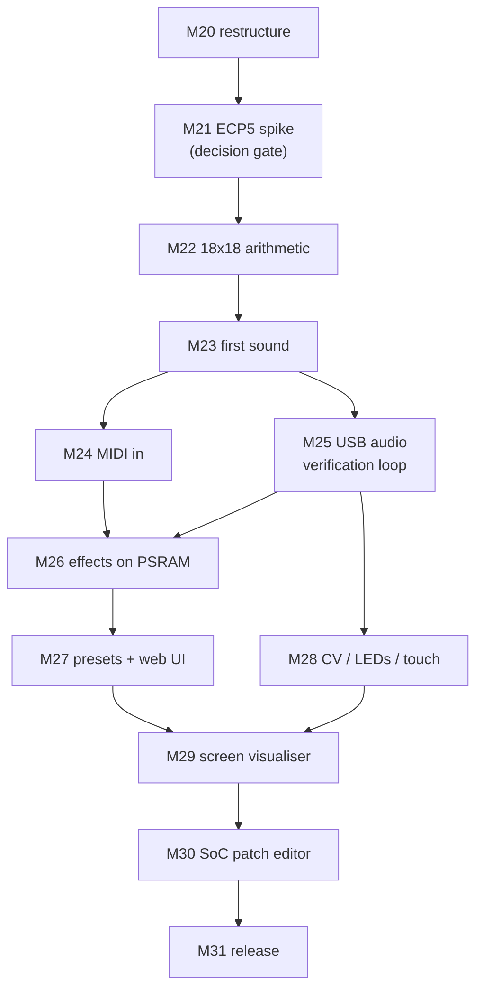

# Porting XLS32 to Tiliqua — milestone plan

A plan to run the XLS32 engine on **[Tiliqua](https://apfaudio.github.io/tiliqua/)** (`TLQ-MODULE` +
`TLQ-SCREEN`) alongside the existing Basys 3 target, and to restructure the repo so both boards are
first-class.

Status: **M20, M21 and M22 are done**; M23 onward is still plan. §1.1 records measurements taken on the
real module and M21 records measurements taken on the real toolchain, so the constraints below are
not estimates. Milestones continue the numbering in [DEVELOPMENT.md](../DEVELOPMENT.md)
(M1 → M19 + Web UI), so this starts at **M20**.

---

## 1. The two boards, side by side

| | **Basys 3** (today) | **Tiliqua R5 / SoldierCrab R3** |
|---|---|---|
| FPGA | Artix-7 `xc7a35t` | Lattice **ECP5 `LFE5U-25F`** |
| Logic | 20,800 LUT6 · 41,600 FF | 24,288 TRELLIS_COMB (LUT4) · 24,288 FF |
| Multipliers | 90× DSP48E1 (25×18) | **28× MULT18X18D (18×18)** |
| Block RAM | 50× RAMB36 (36 Kb) ≈ 1,800 Kb | **56× DP16KD (16 Kb data)** ≈ 896 Kb |
| Off-chip RAM | none | **32 MB HyperRAM / oSPI (APS256XXN)** |
| Clocks | one 100 MHz osc | `sync` 60 MHz · `fast` 120 MHz · `usb` 60 MHz (ECP5 PLL from 48 MHz) · `audio` 12.288 MHz (SI5351) |
| Audio out | UART PCM tee + Pmod I²S DAC | **eurorack-pmod R3.5** — 4 in + 4 out, DC-coupled, 24-bit, 48 kHz (or 192 kHz) |
| MIDI in | USB-UART @2 Mbaud; DIN Pmod (built, untested) | **TRS-A jack, optoisolated** + USB-MIDI on `usb2` |
| Host link | FT2232 UART, 2 Mbaud | RP2040 `dbg`: dirtyJtag + CDC serial **@115200 only**; `usb2`: **USB HS (480 Mbit) PHY on the FPGA** |
| Display | 16 LEDs | **TLQ-SCREEN 720×720p60** (panel rotated 90°), DVI/TMDS from framebuffer in PSRAM |
| Controls | switches/buttons | rotary encoder + push, capacitive touch on all 8 jacks, per-jack RGB LEDs, jack detect |
| Toolchain | XLS → Vivado / F4PGA / nextpnr-xilinx | XLS → **Amaranth** wrapper → yosys → **nextpnr-ecp5**, driven by `pdm` |
| Flashing | `openFPGALoader -b basys3` | `pdm flash archive … --slot N` (8 slots + bootloader) or `openFPGALoader -c dirtyJtag` to SRAM |

The engine itself is portable — XLS emits plain Verilog, Amaranth can `Instance()` it, and yosys
reads it for either family. **The port is not about the DSLX; it is about the shell.** Four things
in `rtl/top.v` are Xilinx/Basys-3-specific and must be rebuilt: the UART transport, the BRAM
effects, the LED comet, and the clocking.

## 1.1 Measured baseline (2026-08-03, on the physical module)

Everything in this subsection was measured, not inferred. Where it contradicts a number elsewhere in
this document, this subsection wins.

**Identity.** `openFPGALoader --scan-usb` reports `0x1209:0xc0ca dirtyJtag apf.audio` /
`Tiliqua R5 apfbug-beta4-1-g9b45`. Bitstream slots are at release **v1.2.1**. Slot map as shipped:
`0 XBEAM · 1 POLYSYN · 2 MACRO-OSC · 3 SID · 4 SELFTEST · 5 SAMPLER · 6 DSP-MDIFF · 7 VSYNTH`.

**From the bootloader's CDC log** (115200 on the `dbg` port — it prints on boot, then goes quiet):

- Screen EDID resolves to `DVIModeline { h_active: 720, v_active: 720, pixel_clk_mhz: 39.07,
  rotate: Left }`, and the firmware logs `detected tiliqua screen! rotate framebuffer 90 degrees`.
- **The SI5351 is reconfigured per bitstream.** The bootloader runs `clk0=12288000Hz` (→ 48 kHz);
  XBEAM runs `clk0=49152000Hz` (→ 192 kHz). `clk1` is the pixel clock, 39.07 MHz here. So the
  audio rate is a property of the bitstream, and XLS32 picks the 12.288 MHz / 48 kHz variant.
- `ak4619/codec: register config looks healthy`, `audio/calibration: looks good! switch to it`.
- PSRAM is exercised on every boot — the bootloader copies 163 KiB of firmware into
  `0x20200000..0x20228d30`. §2.2's escape hatch is real hardware that demonstrably works.
- All 8 slot manifests parse and CRC-match.
- One anomaly: `cy8cmbr3xxx/touch: n_working_sensors=Ok(0)` with `CRC OK`. Worth resolving with
  SELFTEST before M28 depends on touch.

**Audio sample format — this is the important one.**
`gateware/src/tiliqua/dsp/__init__.py` defines the native codec sample type as

```python
_ASQ_WIDTH  = int(os.environ.get('TILIQUA_ASQ_WIDTH',  '16'))
_ASQ_I_BITS = int(os.environ.get('TILIQUA_ASQ_I_BITS', '1'))
ASQ = fixed.SQ(_ASQ_I_BITS, _ASQ_WIDTH - _ASQ_I_BITS)   # s1.15, ±1.0 == ±8.192 V
```

**Tiliqua's DSP path is natively 16-bit signed**, 0.25 mV/LSB; the 24-bit USB descriptor is an
external representation only. `synth.x` emits `audio_out: chan<u16>`, so the engine's output drops
into `ASQ` with **no requantisation and no rescaling** — and `TILIQUA_ASQ_WIDTH` is an env var if we
ever want more. Any wording elsewhere about converting 16-bit to a 24-bit DAC is wrong; there is
nothing to convert.

**`dsp-mirror` reference build** (`pdm dsp build --dsp-core=mirror`, default yowasp/WASM toolchain,
Apple Silicon): **35.8 s wall** (29.92 s user, 88% CPU) end to end. Post-PnR utilisation of the
audio-only shell — PLL, I²C, eurorack-pmod codec interface, no video, no SoC:

| | used | available |
|---|---|---|
| TRELLIS_COMB | 1,768 | 24,288 (7%) |
| TRELLIS_FF | 731 | 24,288 (3%) |
| **DP16KD** | **0** | 56 (0%) |
| **MULT18X18D** | **1** | 28 (3%) |
| EHXPLLL | 1 | 2 |

The shell costs almost nothing: XLS32 gets essentially all 56 BRAM tiles and 27 of 28 multipliers,
and one `EHXPLLL` output is free for the dedicated engine clock §2.3 recommends.

**USB Audio Class 2 on `usb2` — validated.** With XBEAM running, macOS enumerates
`Tiliqua / apf.audio / 4 in / 4 out / 192000 Hz / USB` and PortAudio accepts both 192 kHz and
48 kHz at 4 channels. A capture returns real samples on all four channels. Caveats found the hard
way, all of which constrain `host/transport/usbaudio.py`:

- The interface enumerates unconditionally, but **no frames flow until `MISC → usb-mode = enable`**
  in the XBEAM menu, and the vendor docs say to set it *before* plugging the host in — doing it in
  the wrong order halved throughput quality (5.1% → 2.6% dropped frames after a re-plug).
- **Isochronous dropouts remain, and they originate in the device.** 2.5–5% of frames arrive
  all-zero, with no PortAudio status flag ever raised. Traced by logging every callback's
  `inputBufferAdcTime`, frame count and zero count: every callback is *full* (4096/4096 frames),
  the zeros sit *inside* those full buffers, and the ADC timeline jumps forward 44–500 ms about
  30 times in 10 s so only ~67% of the expected audio ever arrives. Isochronous transfer drops
  whole packets and never retries — it cannot insert a partial zero run into a full packet — so
  this is not the cable and not the host.

  | Config | zero frames |
  |---|---|
  | XBEAM, 192 kHz, 3 s, documented plug order | 2.56% |
  | `usb_audio`, 48 kHz, 10 s | 4.84% |
  | …with the CDC serial reader stopped | 3.82% |
  | …with `dbg` physically unplugged from the host | 4.17% |

  Eliminated: bandwidth (48 kHz was *worse* than 192 kHz), cable, host underrun, and our own
  gateware — it reproduces on the stock vendor `usb_audio` bitstream. **Report upstream at
  `apfaudio/tiliqua`; do not debug the vendor USB stack as part of this port.** M25 works around it
  with the gap detector below.
- **Let PortAudio choose the block size.** `blocksize=0` delivered 97.4% of expected frames;
  forcing `blocksize=1024` collapsed delivery to ~14%.
- **Open the stream once and keep it open.** Nine consecutive open/close cycles drove the device
  into a state where it returned one block and stopped; single-shot use recovered it.
- A cheap, reliable gap detector falls out of the DC offsets below: a genuine frame is never
  all-zero on all four channels, so the transport can self-validate every capture and retry.

**Factory calibration**, measured with nothing patched (median DC offset, ±8.192 V full scale):
ch0 −2.81 mV · ch1 −4.44 mV · ch2 −1.13 mV · ch3 −3.94 mV — all inside the quoted ±5 mV. Noise
floor ≈ −70 dBFS, strongly correlated across channels (0.82–0.97), i.e. shared supply/reference
noise rather than per-channel.

**But calibration only applies when there is a CPU to load it.** The same measurement on the
non-SoC `usb_audio` bitstream gives **−86 to −116 mV** DC offsets — 20–40× worse — because the
constants live in I²C EEPROM and are read at boot by firmware. A bare XLS32 top has no SoC, so it
gets raw, uncalibrated converters. This matters at **M23** (a DC-offset floor of ~100 mV is ~1.2%
of full scale and will show up in FFT grading) and at **M28**: either keep a minimal SoC/firmware
in the design, or read the EEPROM from a small state machine and apply the offsets in gateware.

---

## 2. The four hard constraints (read this before planning work)

### 2.1 Multipliers — the binding constraint

The committed build infers **26 DSP48E1**. A DSP48E1 is 25×18; an ECP5 `MULT18X18D` is 18×18, so
yosys splits any operand wider than 18 bits into 2–4 tiles. `synth.x` deliberately widens some
operands to fit *one* DSP48 (e.g. `(amp as s24 as s32) * compv` — a 24×18). Those become 2 tiles
each on ECP5.

Rough expectation: **26 DSP48 → 40–60 MULT18X18D against a budget of 28.** This has to be fixed in
DSLX by narrowing operands to ≤18×18, not worked around downstream.

### 2.2 Block RAM — the effects buffers do not fit

`rtl/top.v` declares four 16384×16 buffers (`dmemL`, `dmemR`, `dmem2L`, `dmem2R`) =
**1,048,576 bits**. At 16 Kb of usable data per `DP16KD` that is **64 tiles against 56 available** —
before the engine's own inferred ROMs, and before the video framebuffer. At 48 kHz the reverb tank
and delay taps would need ~1.5× *more* depth again.

The answer is the HyperRAM: Tiliqua ships `tiliqua/periph/psram.py`, `tiliqua/dsp/delay_line.py` and
`tiliqua/dsp/delay_effect.py` — PSRAM-backed delay lines are the idiomatic Tiliqua way to do exactly
this. The effects get **rewritten against that library**, not ported line-by-line.

### 2.3 Clocking — the cost of a sample is `--pipeline_stages`, not 32

> **This section was wrong until M21 measured it.** It read "one voice per engine-cycle, 32 cycles
> per sample… at 32 kHz that needs ≥ ~32.8 MHz". Those two claims cannot both be true — 32 cycles
> at 32 kHz is 1.02 MHz, not 32.8 MHz, a factor of 32. The right number was never derived, only
> back-fitted from the Basys 3 ÷3 divider that happened to work. It is now measured directly
> (`boards/tiliqua/spike/tb_rate.v`: count clocks between `audio_out` handshakes with `ce` tied
> high), and the answer is neither figure.

**One sample costs 32 × (roughly `STAGES`/2) engine cycles.** The voice ring is 32 iterations, but
each iteration re-enters a pipeline whose recurrence forces an initiation interval that scales with
the schedule depth. Measured, at 32 voices:

| `STAGES` | 6 | 8 | 10 | 12 | 16 | 20 | 24 | 32 | 40 | 48 | 64 | 80 |
|---|---|---|---|---|---|---|---|---|---|---|---|---|
| cycles/sample | 128 | 160 | 192 | 224 | 320 | 384 | 416 | 512 | 640 | 768 | 928 | 1216 |

This reframes the whole clocking question. The shipping Basys 3 build is `STAGES=48` → **768 cycles
per sample**, and its ÷3 enable gives 33.3 MHz, i.e. a 43.4 kHz ceiling against the 32 kHz it
actually runs. That matches the note in `boards/basys3/rtl/top.v` that ÷4 "capped at 28 kHz".

Because both the required clock *and* the achievable Fmax rise with `STAGES`, raising it does not
buy throughput — it buys timing slack and spends flip-flops. The sustainable sample rate is
`Fmax / cycles_per_sample`, and on ECP5 that stays **above 57 kHz at every `STAGES` that fits**
(§M21 table). **Sample rate is therefore not a constraint on this port at all.** Area is.

| Option | Verdict |
|---|---|
| `sync` ÷1 (60 MHz) | **Not available.** No `STAGES` reaches 60 MHz on ECP5; the best is 59.2 MHz at `STAGES=48`, which also costs 70% of the device's flip-flops |
| `sync` with a clock enable | **Not available either.** A clock enable does not relax a register-to-register path — the design still has to close at 60 MHz. Basys 3 gets away with ÷3 only because Vivado is given a multicycle constraint; nextpnr-ecp5 has no equivalent |
| dedicated PLL output, ~12–25 MHz | **Recommended, and now with numbers.** At the chosen `STAGES=12` the engine closes at 27.5 MHz and needs 224 × 48 kHz = **10.8 MHz**. Needs a free `EHXPLLL` output and an async FIFO on the MIDI/audio channels |

**Why the third row was already the right call.** Building the vendor's own `usb_audio` top — a
*shell*, with no DSP in it at all — nextpnr reports `$glbnet$clk` **58.66 MHz, FAIL against the
60 MHz constraint** on the first pass, recovering to **66.49 MHz PASS** only after retiming. The
stock `sync` domain barely makes its own timing with nothing of ours in it.

**Fallback ladder, in order:** 32 voices → 24 voices → 16 voices → 2 parts instead of 4. M21
measured the first two rungs and **found them unnecessary** — 32 voices × 4 parts fits. They are
kept here costed, because the video/SoC shell is a much larger tenant than the audio-only one this
was measured against.

### 2.4 The verification loop — 115200 baud kills it

The whole project rests on "audio is teed over USB and graded by FFT". The RP2040's CDC serial is
**115200 baud only**; 16-bit stereo at 48 kHz is 1.5 MB/s. **The Basys 3 transport does not carry
over.**

The replacement is the `usb2` port: Tiliqua has a USB HS PHY wired to the FPGA and ships
`tiliqua/usb_audio/` plus `src/top/usb_audio/top.py` (a UAC2 device). The host then sees Tiliqua as
an audio interface and records with `sounddevice`; MIDI goes in over USB-MIDI
(`tiliqua/midi/decode_usb.py`) or the TRS jack. This is a **blocking dependency for every later
milestone** — until it works, the agent loop is blind, so it comes early (M25).

**Confirmed on hardware (§1.1).** Recording 4×24-bit from Tiliqua over `usb2` with `sounddevice`
works today using the stock XBEAM bitstream, so M25 is *integration*, not invention: wire
`tiliqua/usb_audio/` into our own top and port the host side onto it. What is *not* yet solved is
gap-free capture — ~2.5% of frames still arrive zero-filled. Treat "0 dropped frames over 10 s at
48 kHz" as M25's real exit criterion, not mere enumeration.

Stopgap if USB audio slips: a decimated debug stream (e.g. 4 kHz mono 8-bit ≈ 32 kbps) fits inside
115200 and is enough for pitch/envelope grading, which is what M1–M3 used anyway.

### 2.5 What gets *easier*

- **Build time.** `nextpnr-ecp5` runs natively on Apple Silicon (oss-cad-suite arm64 or
  `yowasp-nextpnr-ecp5`). The GCE detour that exists purely because F4PGA/Vivado are x86 goes away.
  Measured: the reference `dsp-mirror` core builds end-to-end in **35.8 s** on this Mac, on the
  slower WASM toolchain (§1.1). The loop gets tighter, not looser.
- **The sample format already matches.** Tiliqua's native `ASQ` is 16-bit signed, which is exactly
  what `synth.x` emits (§1.1). No conversion layer.
- **MIDI DIN finally gets tested.** M7's DIN parser has been "built, HW-pending" — Tiliqua has an
  optoisolated TRS-A MIDI jack on the board.
- **A real DAC.** 24-bit DC-coupled outputs replace the UART tee + Pmod I²S breakout.
- **8 slots.** The bootloader holds 8 user bitstreams, so a 32-voice build and a 16-voice+video
  build can coexist on one module.

---

## 3. Directory restructuring (M20)

Today everything assumes one board. The seam to introduce is a **board package** (gateware + build
scripts + flash recipe) and a **host transport interface**. Everything that is DSP or musical stays
shared.

### The layout, as built

Everything unmarked exists today; `(Mnn)` marks a directory that lands with the milestone that
first needs it, so the tree below is also the plan.

```
core/                          # board-independent
  synth.x                      # (moved from rtl/)
  gen_lut.py
  fix_verilog.py               # clock-enable injection — both boards need it
  codegen.sh                   # ir_converter → opt → codegen → engine.v (STAGES/WCT env)
  sim/  tb.v tb_echo.v tb_io.v tb_stereo.v tb_stereo2.v tb_reverb_rail.v tb_fx_stub.v tb_top.v

boards/
  __init__.py                  # registry: get_board("basys3" | "tiliqua")
  basys3/
    board.py                   # descriptor: transport="uart", sr=32000, load cmd
    rtl/     top.v  basys3.xdc  basys3_nextpnr.xdc  build_vivado.tcl
    scripts/ build.sh  vmbuild.sh  vmbuild_vivado.sh  vmbuild_nextpnr.sh  remote_build.sh  verify.sh
    firmware/ top.bit
  tiliqua/
    board.py                   # descriptor: transport="usbaudio", sr=48000, unsupported="…M21"
    gateware/                  # (M21)
      top.py                   # Amaranth top — audio-only variant
      xls_engine.py            # Instance() wrapper around core/engine.v + CE/CDC
      effects.py               # (M26) PSRAM-backed chorus / echo / reverb
      midi_bridge.py           # (M24) TRS + USB-MIDI → engine's u8 midi_in channel
      video/                   # (M28+) framebuffer, scope, menu overlay
    fw/                        # (M29) Rust firmware for the SoC menu
    scripts/ build.sh          # (M21)   flash.sh (M31)
    firmware/                  # (M31) released .tar.gz bitstream archives
    deps/tiliqua               # (M21) git submodule (apfaudio/tiliqua)

host/
  transport/
    base.py                    # Transport ABC + open_transport(board) factory
    uart.py                    # ← the serial half of the old uartaudio.py, verbatim
    usbaudio.py                # (M25) sounddevice capture + USB-MIDI out
  synth.py                     # ← the set_* / CC helper half, plus SR from the descriptor
  play.py  record_wav.py  analyze.py  analyze_fft.py  filter_demo.py  fx_diag.py
  demos/

webui/  test/  presetgen/      # unchanged; they import host/synth.py and get SR from the board
scripts/                       # board-agnostic media tools stay: spectro.sh make_mp4.sh demo_video.sh
docs/
```

### Rules that make this hold

1. **`core/` never mentions a board.** No pin names, no clock rates, no transport. The only
   board-visible interface is the proc's three channels (`midi_in`, `audio_out`, `viz_out`).
2. **One board seam on the host side.** Everything in `host/`, `webui/`, `test/`, `presetgen/`
   talks to a `Transport` and reads `SR` from a board descriptor. 29 files used to touch
   `uartaudio`; now they touch `host/synth.py` and never `serial` directly.
3. **Board selection is `$XLS32_BOARD`, defaulting to `basys3`** so nothing existing breaks.
   *Deliberately no `--board` flag yet:* `host/synth.py` binds `SR` at **import** time, so a flag
   parsed halfway down a `main()` would be read after every module that depends on it has already
   captured the old value — it would look like it worked and silently grade at the wrong rate. The
   flag can land at M25, when a second board actually produces samples to be wrong about.
4. **Use `git mv`** so history follows the files.
5. **Exit criterion for M20: the Basys 3 e2e suite scores the same as before the move.** The
   restructure is not allowed to change behaviour.

Two things the first draft of this section got wrong, corrected here:

- **`presetgen/engine.py` must *not* take `SR` from the board.** Its `SR = 28000` is a property of
  the offline *model*, not of any board: the `BASE_INC` phase increments are tuned against it, and
  the calibration bank was fitted at that rate. Repointing it at the board's 32 kHz would silently
  invalidate every stored preset. It stays a module constant.
- **`core/codegen.sh` did not exist.** The XLS invocation was copy-pasted into four build scripts
  and had already drifted — `build.sh` hardcoded `--pipeline_stages=48` where the VM scripts passed
  `$STAGES`. M20 extracted it, so the Tiliqua build calls the same twelve lines the Basys 3 build
  does rather than a fifth copy.

Docs updated in the same milestone: `README.md` (repo layout, all command paths),
`ARCHITECTURE.md` (file references), `DEVELOPMENT.md`, `test/README.md`.

---

## 4. Milestones

Each milestone states its **exit criterion** — the thing a machine can grade, in the spirit of the
existing loop.

### Phase A — foundations

**M20 · Restructure for two boards** — ✅ **done, hardware-verified**
Move to the layout in §3. Split `host/uartaudio.py` into `host/transport/uart.py` +
`host/synth.py`. Add `boards/*/board.py` descriptors and `$XLS32_BOARD` plumbing through `host/`,
`webui/`, `test/`, `presetgen/`.
*Exit:* `uv run python test/run_tests.py` on Basys 3 scores within noise of the pre-move report.

**Met.** No pre-move report existed to diff against — `test/out/` is generated and no score was
ever committed — so the baseline was produced by checking `59d1e8e` out into a worktree and running
the suite there on the *same board, same bitstream, same session*, back to back with the new tree:

| | overall | PASS | WARN | FAIL |
|---|---|---|---|---|
| before (`59d1e8e`) | 98.4 A+ | 170 | 2 | 3 |
| after (M20) | **98.6 A+** | 172 | 0 | 3 |

**152 of 175 cases scored bit-identically**, mean delta +0.17, per-case stdev 2.10. The three FAILs
are the *same three* on both sides (`pitch_a4`, `filter_sweep`, `combo_wah`) — pre-existing, not
introduced here. The only two verdict flips both went WARN→PASS, and their metrics say why: the
before run clipped those presets (peak 32640, 5.0% clip) where the after run did not (peak 17026,
0.0%) — residual level from the preceding case, not a code difference.

The gateware was byte-identical across the move, so this isolates the host split cleanly: `git diff
-M` shows `synth.x` and `top.v` as pure renames with zero content change, and the one line that did
change is a comment in `basys3_nextpnr.xdc`.

**M21 ✅ · ECP5 feasibility spike** *(decision gate — passed)*
Build `core/engine.v` standalone for `LFE5U-25F` with yosys + nextpnr-ecp5 — no Tiliqua
infrastructure, no effects, a stub top that ties the channels off. Sweep `STAGES` and voice count.
*Exit:* a table of `TRELLIS_COMB` / `TRELLIS_FF` / `DP16KD` / `MULT18X18D` / Fmax vs
(STAGES, VOICES, PARTS), and a chosen operating point. This decides everything downstream — if
32 voices/4 parts cannot fit, the fallback ladder (§2.3) is applied here, once, in DSLX.

**Verdict: 32 voices × 4 parts fits an `LFE5U-25F`. No fallback rung is needed.**

Harness in `boards/tiliqua/spike/` — `stub_top.v` (drives every engine input from a real pin so
nothing constant-folds away, XOR-reduces every output so nothing is dead logic), `ecp5_build.sh`,
`scrape.py`, `sweep.sh`, `tb_rate.v`, `voices_variant.py`. Device `--25k --package CABGA256
--speed 6`; yosys 0.67 / nextpnr-ecp5 0.10 via yowasp, XLS codegen via the existing amd64 container.
All runs constrained to 60 MHz, so the reported Fmax is best-effort rather than "just met".

**32 voices / 4 parts, `STAGES` swept**

| `STAGES` | TRELLIS_COMB | TRELLIS_FF | DP16KD | MULT18X18D | Fmax | cycles/sample | max SR |
|---:|---:|---:|---:|---:|---:|---:|---:|
| 6 | 16,025 (66%) | 9,961 (41%) | 0 | 23 (82%) | 15.72 MHz | 128 | 123 kHz |
| 8 | 16,716 (69%) | 9,133 (38%) | 0 | 24 (86%) | 18.21 MHz | 160 | 114 kHz |
| 10 | 16,489 (68%) | 9,245 (38%) | 0 | 24 (86%) | 24.43 MHz | 192 | 127 kHz |
| **12** | **15,944 (66%)** | **9,122 (38%)** | **0** | **24 (86%)** | **27.49 MHz** | **224** | **123 kHz** |
| 16 | 16,503 (68%) | 12,075 (50%) | 0 | 24 (86%) | 36.06 MHz | 320 | 113 kHz |
| 20 | 15,954 (66%) | 11,334 (47%) | 0 | 24 (86%) | 37.96 MHz | 384 | 99 kHz |
| 24 | 16,051 (66%) | 12,710 (52%) | 0 | 24 (86%) | 45.30 MHz | 416 | 109 kHz |
| 32 | 15,951 (66%) | 13,646 (56%) | 0 | 24 (86%) | 46.99 MHz | 512 | 92 kHz |
| 40 | 16,802 (69%) | 16,016 (66%) | 0 | 24 (86%) | 49.04 MHz | 640 | 77 kHz |
| 48 | 16,566 (68%) | 16,913 (70%) | 0 | 24 (86%) | 59.20 MHz | 768 | 77 kHz |
| 64 | 16,518 (68%) | 21,690 (89%) | 0 | 24 (86%) | 52.80 MHz | 928 | 57 kHz |
| 80 | 20,609 (85%)¹ | 24,190 (100%)¹ | 0 | 24 | — | 1216 | **NOFIT** |

¹ pre-pack yosys counts — a run that never places leaves no nextpnr report.

**`STAGES=12`, voice count swept** (4 parts throughout; `voices_variant.py` rewrites a throwaway
copy of `synth.x`, and asserts the count of every rewrite so a future edit fails loudly rather than
producing a 32-voice build under a 16-voice filename):

| VOICES | TRELLIS_COMB | TRELLIS_FF | DP16KD | MULT18X18D | Fmax | cycles/sample | max SR |
|---:|---:|---:|---:|---:|---:|---:|---:|
| 16 | 11,014 (45%) | 4,528 (19%) | 0 | 24 (86%) | 33.30 MHz | 80 | 416 kHz |
| 24 | 11,662 (48%) | 5,517 (23%) | 0 | 24 (86%) | 32.06 MHz | 144 | 223 kHz |
| **32** | **15,944 (66%)** | **9,122 (38%)** | **0** | **24 (86%)** | **27.49 MHz** | **224** | **123 kHz** |

**Chosen operating point: 32 voices, 4 parts, `STAGES=12`, on a dedicated `EHXPLLL` output.**
`STAGES=12` is the knee: below it flip-flops stop falling and Fmax keeps dropping (`STAGES=8` costs
*more* FFs than 12 and runs 34% slower). Against the measured audio-only shell (1,768 COMB / 731 FF
/ 0 BRAM / 1 DSP, §1):

| | engine | + shell | available | |
|---|---:|---:|---:|---|
| TRELLIS_COMB | 15,944 | 17,712 | 24,288 | 73% |
| TRELLIS_FF | 9,122 | 9,853 | 24,288 | 41% |
| DP16KD | 0 | 0 | 56 | **0%** |
| MULT18X18D | 24 | 25 | 28 | **89%** |

Three findings that outlive this milestone:

- **`MULT18X18D` is the binding resource, and voice count does not touch it.** 24 multipliers at
  every point in both sweeps — they sit in the shared one-voice-per-cycle datapath, not in the ring,
  so cutting to 16 voices frees LUTs and FFs and *no* DSPs. Three spare after the shell. This is
  exactly what **M22** exists to fix, and M21 confirms it is not optional busywork.
- **Zero of 56 BRAM tiles are used.** yosys reports 42 `Replacing memory … with list of registers`
  warnings: the voice and part arrays are being flattened into flip-flops. That is the single
  largest untapped lever on this device — but it is an optimisation, not a blocker, so it is not
  being spent now.
- **`TRELLIS_COMB` is flat at ~16k across every `STAGES`.** Pipeline depth moves flip-flops, never
  combinational area. Any real LUT reduction has to come from the DSLX, not the schedule.

**Scope note.** These numbers are against the *audio-only* shell. The video/SoC shell (DVI
framebuffer + VexRiscv) is a far larger tenant and was not measured; if M27/M28 take that path, the
16- and 24-voice rungs above are already costed.

**M22 · Narrow the arithmetic to 18×18 — done**
Rework the multiplies in `synth.x` that currently exploit DSP48's 25×18 asymmetry so each fits one
`MULT18X18D`. Keep the Vivado build's DSP count from regressing.
*Exit:* `MULT18X18D` ≤ ~20 on ECP5 **and** Basys 3 e2e unchanged. (Both boards build from the same
`synth.x`; every DSLX change is dual-verified from here on.)

**Result: 24 → 19 `MULT18X18D`** (68% of 28; 20 including the shell's one). Four edits, all
bit-exact — see [DEVELOPMENT.md](../DEVELOPMENT.md) (Milestone 22) for the reasoning and the trap.

| ECP5, `STAGES=12`, engine alone | before | after | |
|---|---:|---:|---|
| MULT18X18D | 24 | **19** | **−5** |
| TRELLIS_COMB | 15,944 | 16,501 | +557 |
| TRELLIS_FF | 9,122 | 9,239 | +117 |
| DP16KD | 0 | 0 | — |
| Fmax | 27.49 MHz | 27.61 MHz | +0.12 |

With the audio-only shell that is **20 of 28 tiles (71%)**, eight spare where there were three.
`MULT18X18D` is no longer the binding resource — `TRELLIS_COMB` is, at 73%.

### Phase B — first sound

**M23 · Hello Tiliqua — audio-only bitstream**
Amaranth top: instantiate `engine.v`, clock it (dedicated PLL output or `sync`÷2 per M21), pace it
from the `audio` domain, resample 32 kHz → 48 kHz (`tiliqua.dsp.resample`) into eurorack-pmod
output channels 0/1. MIDI hardcoded to a note-on at reset. No effects.
*Exit:* a scope/recording of output 0 shows the expected pitch; the build is a valid bitstream
archive and boots from a slot.

> **Design decision — keep the engine at 32 kHz and resample to 48 kHz.** It preserves the entire
> preset bank, the demo songs, `presetgen/engine.py`'s calibration, and all 130+ test expectations.
> A native-48 kHz retune (`BASE_INC`, ADSR rates, comb lengths) is a later, optional milestone.

**M24 · MIDI in — TRS + USB**
`midi_bridge.py`: `tiliqua.midi.decode_serial` (TRS-A jack, 31250 baud) and
`tiliqua.midi.decode_usb` both feeding the engine's `u8 midi_in` ready/valid channel. Note that the
engine takes the **channel nibble's low 2 bits as the part**, so channels 1–4 work unchanged.
*Exit:* play the TRS jack from a hardware keyboard/DAW and hear correct pitches on all 4 parts;
this also closes M7's "built, HW-pending" DIN MIDI.

**M25 · Restore autonomous verification** *(blocking for everything after)*
USB Audio Class 2 device on `usb2` (from `tiliqua/usb_audio/`) so the host records the synth's own
output; USB-MIDI in the other direction. Implement `host/transport/usbaudio.py`. Port
`test/harness.py` and `webui/server.py` onto it.
*Exit:* `uv run python test/run_tests.py --board tiliqua --only basic` produces a scored
`report.md` from real hardware. From here the agent loop is closed again on Tiliqua.

### Phase C — feature parity

**M26 · Effects on HyperRAM**
Rebuild chorus / ping-pong echo / 8-comb Freeverb against `tiliqua.dsp.delay_line` +
`tiliqua.periph.psram` instead of the four on-chip buffers. Keep the CC map identical (CC82/91/93/94/95)
and keep depth-gating.
*Exit:* the `stress_fx_tail` family passes on Tiliqua — audible tail that decays without railing —
and delay time still spans ~4–508 ms.

**M27 · Preset bank + web UI on Tiliqua**
Point `webui/server.py` at the Tiliqua transport; recalibrate `presetgen/engine.py` for the ported
signal path if M21/M26 changed anything audible; re-verify the preset banks with
`presetgen/validate_hw.py`.
*Exit:* full e2e suite (basic + integration + stress) on Tiliqua, and all 7 demo songs play from
the browser.

**M28 · Eurorack-native I/O**
Use what the Basys 3 never had: 4 CV inputs → V/oct pitch, filter cutoff, and two assignable
destinations; gate/trigger in; per-jack LEDs driven from the existing `viz_out` envelope tap (the
LED comet, re-homed); touch sensing on unused jacks.
*Exit:* a 1 V/oct sweep on CV in tracks within a few cents across 5 octaves, graded by FFT.

### Phase D — the screen

**M29 · Screen, no SoC — visualiser**
Framebuffer in PSRAM + DVI at 720×720p60 (match-bootloader modeline), driven by
`tiliqua.video.framebuffer` and `tiliqua.raster.*`. Show a vectorscope/spectrum of the output plus a
per-voice envelope bar strip fed by `viz_out`.
*Exit:* stable 720×720p60 output with no audio glitching, captured as a photo/screenshot in the
report video.

> **Area warning.** M21's numbers decide whether video and 32 voices coexist. If not, ship *two*
> bitstream slots — `xls32-poly32` (audio only) and `xls32-video` (fewer voices) — which is exactly
> what the 8-slot bootloader is for.

**M30 · SoC + on-screen patch editor**
`TiliquaSoc` + Rust firmware (`riscv32im`): encoder-driven menu, the full CC map as editable
parameters, preset browsing from SPI flash, per-part selection. This is the Tiliqua-native
equivalent of the browser panel and is a substantial subproject in its own right — treat the
`polysyn` and `xbeam` examples as the reference.
*Exit:* every CC in the map is reachable from the encoder without a host attached, and presets
load/save to flash.

### Phase E — release

**M31 · Bitstream archives, CI, docs**
`manifest.json` metadata (name, IO assignments for the bootloader help screen), `pdm flash archive`
recipes, prebuilt `.tar.gz` in `boards/tiliqua/firmware/`, webflash-compatible release. CI that
builds both boards. Rewrite README §1–§3 as genuinely two-board; add a Tiliqua section to
DEVELOPMENT.md and the slide deck.
*Exit:* a fresh Tiliqua can be flashed from the web flasher and played with no toolchain, mirroring
today's `firmware/top.bit` story.

---

## 5. Dependency order



M25 is the load-bearing one: everything after it is graded automatically, everything before it is
graded by hand or by simulation.

---

## 6. Risk register

| # | Risk | Likelihood | Impact | Mitigation |
|---|---|---|---|---|
| 1 | ~~26 DSP48 explode past 28 `MULT18X18D`~~ | — | — | **Retired by M22**: 24 → 19 tiles (20 with the shell), eight spare. `TRELLIS_COMB` is now the binding resource |
| 2 | LUT4 / FF exhaustion with 32 voices × 4 parts | **High** | Reduced spec | Fallback ladder (§2.3); split into two bitstream slots |
| 3 | Timing: ECP5 can't hold ~30 ns on the SVF path | Medium | Lower sample rate or fewer voices | More `--pipeline_stages`; dedicated engine PLL output; 24/16 voices |
| 4 | 115200 CDC can't carry audio | **Certain** | Loop is blind until M25 | *Retired as a design risk* — UAC2 over `usb2` records 4×24-bit on real hardware (§1.1). M25 is integration work |
| 4b | USB audio delivers 2.5–5% of frames as zeros | **Confirmed; device-side, upstream** | Noisy FFT grading; unreliable scores | Isolated to the device on the stock vendor bitstream — not cable, bandwidth or host (§1.1). File upstream; in M25 keep the stream open, `blocksize=0`, and gap-detect + retry in `usbaudio.py` |
| 4c | Non-SoC bitstreams get no ADC/DAC calibration (−86…−116 mV offsets) | **Confirmed** | ~1.2% DC error pollutes M23 grading | Keep a minimal SoC, or read the cal EEPROM in gateware (§1.1). Alternatively high-pass in the grader and accept the offset |
| 5 | Effects don't fit on-chip | **Certain** | Rewrite, not port | M26 against `tiliqua.dsp.delay_line` (PSRAM) |
| 6 | Video + full polyphony don't coexist | Medium | Two bitstreams instead of one | Use the 8 bootloader slots; decide with M21 numbers |
| 7 | Tiliqua submodule / Amaranth version drift | Medium | Build breakage | Pin the submodule; build gateware in Tiliqua's own `pdm` env, keep `uv` for host tooling |
| 8 | 32→48 kHz resampling artifacts | Low | Audible aliasing | `tiliqua.dsp.resample` (2:3 rational); verify by FFT in M23 |
| 9 | Preset bank mismatches the ported path | Medium | Presets sound wrong | M27 — recalibrate `presetgen/engine.py`, re-run `validate_hw.py` |
| 10 | SoC firmware is a project unto itself | **High** | Schedule | M30 is explicitly last and optional; the browser UI already covers the use case |

---

## 7. Setup checklist (before M21)

Host tools, in addition to what the repo already needs:

```bash
# Tiliqua build toolchain
brew install pdm                       # or: curl -sSL https://pdm-project.org/install-pdm.py | python3 -
# oss-cad-suite (arm64 native) — or let pdm use yowasp-yosys / yowasp-nextpnr-ecp5
brew install verilator
brew install openfpgaloader             # already installed for Basys 3; needs >= 0.12.1 for dirtyJtag

# Rust, only for M30
rustup target add riscv32im-unknown-none-elf
cargo install cargo-binutils svd2rust form
```

Hardware: a Eurorack case + PSU (the module and the screen each take 16-pin Eurorack power), a USB-C
cable to `dbg`, and a second to `usb2` for M25 onward.

Sanity check that the module is talking before writing any gateware:

```bash
openFPGALoader --scan-usb        # expect: 0x1209:0xc0ca dirtyJtag  apf.audio  Tiliqua R5
```

---

## 8. References

- Tiliqua docs — [quickstart](https://apfaudio.github.io/tiliqua/quickstart/tlq_module.html) ·
  [electrical design](https://apfaudio.github.io/tiliqua/hardware_design.html) ·
  [building & flashing](https://apfaudio.github.io/tiliqua/building_flashing.html) ·
  [custom DSP](https://apfaudio.github.io/tiliqua/custom_dsp.html)
- Source — [`apfaudio/tiliqua`](https://github.com/apfaudio/tiliqua): platform pinout in
  `gateware/src/tiliqua/tiliqua_platform.py`; PSRAM delay lines in `gateware/src/tiliqua/dsp/`;
  reference tops in `gateware/src/top/` (`polysyn`, `xbeam`, `usb_audio`, `vectorscope_no_soc`)
- This repo — [ARCHITECTURE.md](../ARCHITECTURE.md) for the per-block deep dive that M23–M26 port
